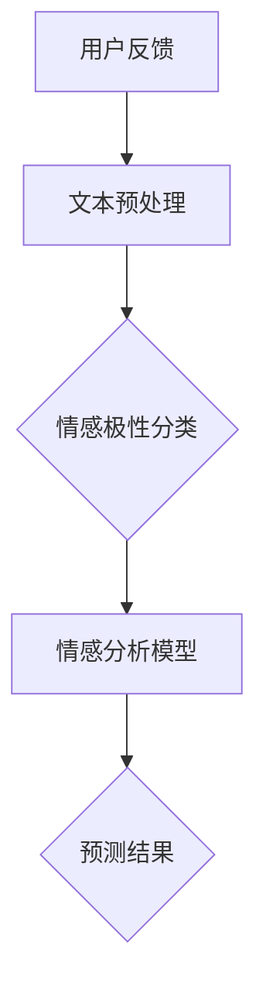

                 

# LLM在情感分析中的应用：理解用户反馈

> **关键词：** 语言模型、情感分析、用户反馈、情感计算、自然语言处理、深度学习、深度神经网络、卷积神经网络、递归神经网络、Transformer模型、BERT模型、文本分类、文本情感极性分析。

> **摘要：** 本文将深入探讨大型语言模型（LLM）在情感分析中的应用，特别是如何理解用户反馈。我们将从背景介绍、核心概念、算法原理、数学模型、项目实战、实际应用场景等多角度，详细解析LLM在情感分析中的工作原理、技术细节和实践经验，旨在为读者提供一个全面、系统的了解。

## 1. 背景介绍

### 1.1 目的和范围

本文旨在探讨大型语言模型（LLM）在情感分析中的应用，重点是如何通过这些模型来理解用户反馈。情感分析是自然语言处理（NLP）领域的一个重要分支，其目标是识别文本中的情感倾向和情感极性。随着互联网的迅猛发展和社交媒体的普及，用户生成的内容数量呈指数级增长，如何有效地分析这些海量数据，提取有价值的信息，成为了众多企业和研究机构关注的焦点。

本文将涵盖以下内容：

1. 情感分析的基本概念和背景。
2. 大型语言模型（LLM）的基本原理和架构。
3. LLM在情感分析中的应用场景。
4. LLM在情感分析中的具体操作步骤和数学模型。
5. LLM在情感分析中的实际应用案例。
6. 相关工具和资源的推荐。
7. 未来发展趋势与挑战。

### 1.2 预期读者

本文适合以下读者群体：

1. 对自然语言处理和情感分析感兴趣的程序员和工程师。
2. 希望了解LLM在情感分析中应用的学术研究人员。
3. 想要在项目中使用LLM进行情感分析的开发者。
4. 对人工智能和机器学习感兴趣的初学者。

### 1.3 文档结构概述

本文将按照以下结构进行组织：

1. **背景介绍**：介绍情感分析和LLM的基本概念。
2. **核心概念与联系**：详细讲解情感分析中的核心概念和LLM的架构。
3. **核心算法原理 & 具体操作步骤**：分析LLM在情感分析中的算法原理和操作步骤。
4. **数学模型和公式 & 详细讲解 & 举例说明**：介绍LLM在情感分析中的数学模型和具体应用。
5. **项目实战：代码实际案例和详细解释说明**：展示LLM在情感分析中的实际应用。
6. **实际应用场景**：探讨LLM在情感分析中的多种应用场景。
7. **工具和资源推荐**：推荐学习资源和开发工具。
8. **总结：未来发展趋势与挑战**：总结LLM在情感分析中的未来发展方向和挑战。
9. **附录：常见问题与解答**：回答读者可能遇到的问题。
10. **扩展阅读 & 参考资料**：提供进一步阅读的资源和参考资料。

### 1.4 术语表

#### 1.4.1 核心术语定义

- **情感分析**：一种自然语言处理技术，用于识别文本中的情感倾向和情感极性。
- **情感极性**：文本表达的情感倾向，通常分为积极、消极和中性。
- **语言模型**：一种统计模型，用于预测文本序列的概率分布。
- **大型语言模型（LLM）**：具有大规模参数和强大语义理解能力的语言模型，如GPT、BERT等。
- **自然语言处理（NLP）**：计算机科学领域，涉及对人类语言的处理和理解。
- **深度学习**：一种机器学习技术，使用多层神经网络进行数据建模。

#### 1.4.2 相关概念解释

- **神经网络**：一种模拟人脑神经元连接的结构，用于数据建模和预测。
- **递归神经网络（RNN）**：一种用于处理序列数据的神经网络，具有记忆功能。
- **卷积神经网络（CNN）**：一种用于图像处理和识别的神经网络，具有局部感知和权值共享特性。
- **Transformer模型**：一种基于自注意力机制的神经网络架构，用于序列建模。

#### 1.4.3 缩略词列表

- **NLP**：自然语言处理
- **LLM**：大型语言模型
- **GPT**：生成预训练模型
- **BERT**：双向编码器表示模型
- **RNN**：递归神经网络
- **CNN**：卷积神经网络
- **Transformer**：变换器模型

## 2. 核心概念与联系

在深入探讨LLM在情感分析中的应用之前，我们需要先理解一些核心概念和它们之间的关系。以下是一个简单的Mermaid流程图，展示了这些核心概念和LLM在情感分析中的应用。



### 2.1 用户反馈

用户反馈是情感分析的数据源，它可以是社交媒体评论、论坛帖子、客户反馈等。这些文本数据包含了用户对产品、服务、事件等的情感表达，是情感分析的重要输入。

### 2.2 文本预处理

文本预处理是情感分析的第一步，其目的是将原始文本数据转换为适合模型处理的格式。文本预处理通常包括以下步骤：

- **去噪**：去除文本中的无关信息，如HTML标签、特殊字符等。
- **分词**：将文本分解为单词或词组。
- **词性标注**：为每个词分配词性，如名词、动词、形容词等。
- **词嵌入**：将文本转换为固定长度的向量表示。

### 2.3 情感极性分类

情感极性分类是情感分析的核心任务，其目标是判断文本的情感倾向，通常分为积极、消极和中性三种。这一步骤通常使用分类算法来实现，如朴素贝叶斯、支持向量机（SVM）、随机森林等。

### 2.4 情感分析模型

情感分析模型是用于实现情感极性分类的核心工具。随着深度学习技术的发展，LLM如GPT、BERT等被广泛应用于情感分析任务。这些模型具有强大的语义理解和文本生成能力，可以显著提高情感分类的准确性和效果。

### 2.5 预测结果

情感分析模型的输出是预测结果，通常是一个概率分布，表示文本属于每种情感极性的概率。根据这些概率，我们可以得出文本的情感标签，如积极、消极或中性。

## 3. 核心算法原理 & 具体操作步骤

在了解情感分析和LLM的基本概念后，我们接下来将深入探讨LLM在情感分析中的核心算法原理和具体操作步骤。

### 3.1 算法原理

LLM在情感分析中的核心原理是通过对大规模文本数据的预训练，学习文本的语义表示和语言规律，然后利用这些表示和规律对新的文本进行情感极性分类。以下是一个简化的算法原理：

```pseudo
1. 预训练：使用大量文本数据进行预训练，学习文本的语义表示和语言规律。
2. 预处理：对输入文本进行预处理，包括去噪、分词、词性标注和词嵌入。
3. 输入文本表示：将预处理后的文本转换为固定长度的向量表示。
4. 情感极性分类：使用预训练的LLM对输入文本的向量表示进行情感极性分类。
5. 输出预测结果：根据分类结果输出文本的情感标签。
```

### 3.2 具体操作步骤

以下是一个详细的操作步骤，用于实现LLM在情感分析中的应用：

```pseudo
1. 数据集准备：收集并准备用于预训练的文本数据集，数据集应包含多种情感极性的文本。
2. 预训练模型：使用预训练模型（如GPT、BERT）对文本数据集进行预训练，学习文本的语义表示和语言规律。
3. 模型微调：在预训练的基础上，对模型进行微调，以适应特定的情感分析任务。
4. 文本预处理：对输入文本进行预处理，包括去噪、分词、词性标注和词嵌入。
5. 输入文本表示：将预处理后的文本转换为固定长度的向量表示。
6. 情感极性分类：使用微调后的LLM对输入文本的向量表示进行情感极性分类。
7. 输出预测结果：根据分类结果输出文本的情感标签。

具体操作步骤的详细解释如下：

### 3.2.1 数据集准备

数据集是情感分析的基础，我们需要收集并准备一个包含多种情感极性的文本数据集。数据集的来源可以是社交媒体评论、论坛帖子、客户反馈等。在准备数据集时，我们需要对数据进行清洗和标注，确保数据的质量和准确性。

### 3.2.2 预训练模型

预训练模型（如GPT、BERT）是LLM的核心组件，它们通过在大规模文本数据上的预训练，学习到文本的语义表示和语言规律。预训练过程通常包括两个阶段：预训练和微调。预训练阶段使用大规模无标注数据，微调阶段使用有标注的数据。

### 3.2.3 模型微调

在预训练的基础上，我们需要对模型进行微调，以适应特定的情感分析任务。微调过程中，我们使用有标注的数据集，对模型的参数进行调整，使其能够更好地识别和分类情感极性。

### 3.2.4 文本预处理

文本预处理是情感分析的关键步骤，其目的是将原始文本转换为适合模型处理的格式。文本预处理通常包括去噪、分词、词性标注和词嵌入。去噪旨在去除文本中的无关信息，如HTML标签、特殊字符等。分词是将文本分解为单词或词组。词性标注为每个词分配词性，如名词、动词、形容词等。词嵌入是将文本转换为固定长度的向量表示。

### 3.2.5 输入文本表示

在文本预处理完成后，我们需要将预处理后的文本转换为固定长度的向量表示。这一步通常使用词嵌入技术来实现。词嵌入技术将每个词映射为一个固定大小的向量，使得具有相似语义的词在向量空间中更接近。

### 3.2.6 情感极性分类

使用微调后的LLM对输入文本的向量表示进行情感极性分类。这一步骤通常使用分类算法来实现，如朴素贝叶斯、支持向量机（SVM）、随机森林等。这些算法通过分析输入文本的向量表示，预测文本的情感极性。

### 3.2.7 输出预测结果

根据分类结果输出文本的情感标签。例如，如果分类结果为[0.9, 0.1]，则文本被判断为积极情感，概率为90%。

## 4. 数学模型和公式 & 详细讲解 & 举例说明

在深入探讨LLM在情感分析中的应用时，数学模型和公式是理解和实现这些模型的核心。以下我们将详细讲解LLM在情感分析中的数学模型和具体应用，并通过举例来说明。

### 4.1 词嵌入（Word Embedding）

词嵌入是自然语言处理中的一项关键技术，它将词汇映射到固定大小的向量空间中。这一过程可以通过多种算法实现，如Word2Vec、GloVe等。

#### 4.1.1 Word2Vec

Word2Vec是一种基于神经网络的词嵌入算法，它通过训练神经网络来预测相邻单词的联合概率分布。具体步骤如下：

1. **初始化**：为每个单词初始化一个固定大小的向量表示。
2. **正样本生成**：选择一个中心词和它的上下文词，如“我喜欢苹果”（中心词：我，上下文词：喜欢、苹果）。
3. **损失函数**：计算中心词的预测概率分布和实际分布之间的损失，通常使用负采样损失函数。
4. **反向传播**：根据损失函数更新单词向量的权重。

#### 4.1.2 GloVe

GloVe（Global Vectors for Word Representation）是一种基于矩阵分解的词嵌入算法，它通过优化单词共现矩阵来学习单词向量。具体步骤如下：

1. **初始化**：为每个单词初始化一个固定大小的向量表示。
2. **计算共现矩阵**：计算单词之间的共现矩阵，矩阵元素表示单词i和单词j在文本中的共现次数。
3. **损失函数**：计算共现矩阵和单词向量之间的损失，通常使用均方误差（MSE）。
4. **反向传播**：根据损失函数更新单词向量的权重。

#### 4.1.3 举例说明

假设我们有两个单词“苹果”和“香蕉”，它们的词嵌入向量分别为\( \mathbf{v}_1 \)和\( \mathbf{v}_2 \)。

- **Word2Vec**：通过正样本生成和损失函数，我们可以更新单词向量的权重，使得“苹果”和“香蕉”的向量在空间中更接近。
- **GloVe**：通过优化共现矩阵和损失函数，我们可以学习到“苹果”和“香蕉”的向量，使得它们在空间中具有相似的语义。

### 4.2 卷积神经网络（Convolutional Neural Network, CNN）

卷积神经网络是用于图像处理和识别的一种神经网络架构，它也可以用于文本分类和情感分析。以下是一个简单的CNN模型在情感分析中的工作原理：

1. **输入层**：接收预处理后的文本向量表示。
2. **卷积层**：使用卷积核在文本向量上滑动，提取特征。
3. **池化层**：对卷积层的结果进行池化，减少参数数量。
4. **全连接层**：将池化层的结果映射到情感极性分类器。

#### 4.2.1 卷积层

卷积层是CNN的核心组件，它通过卷积操作提取文本的特征。具体步骤如下：

1. **初始化卷积核**：为每个卷积核初始化一个随机权重矩阵。
2. **卷积操作**：将卷积核在文本向量上滑动，计算卷积结果。
3. **激活函数**：对卷积结果应用激活函数，如ReLU。
4. **损失函数**：计算卷积结果和目标标签之间的损失，如交叉熵损失。

#### 4.2.2 池化层

池化层用于减少模型参数的数量，提高模型的泛化能力。以下是一个简单的最大池化操作：

1. **划分窗口**：将卷积层的结果划分为多个窗口。
2. **选择最大值**：在每个窗口中选择最大值作为池化结果。

#### 4.2.3 全连接层

全连接层将池化层的结果映射到情感极性分类器。具体步骤如下：

1. **初始化权重矩阵**：为每个全连接层初始化一个随机权重矩阵。
2. **矩阵乘法**：将池化层的结果与权重矩阵相乘。
3. **激活函数**：对矩阵乘法的结果应用激活函数，如Sigmoid。
4. **损失函数**：计算分类结果和目标标签之间的损失，如交叉熵损失。

### 4.3 举例说明

假设我们有一个情感分析任务，需要判断一段文本是积极情感还是消极情感。以下是一个简单的CNN模型在情感分析中的应用：

1. **输入层**：接收预处理后的文本向量表示。
2. **卷积层**：使用卷积核在文本向量上滑动，提取特征。
3. **池化层**：对卷积层的结果进行最大池化。
4. **全连接层**：将池化层的结果映射到情感极性分类器。

假设输入文本向量表示为\[ \mathbf{x} \]，卷积核权重为\[ \mathbf{W} \]，分类器权重为\[ \mathbf{W'} \]。

1. **卷积操作**：
\[ \mathbf{h} = \text{激活}(\mathbf{W} \odot \mathbf{x}) \]

2. **最大池化**：
\[ \mathbf{p} = \text{max-pool}(\mathbf{h}) \]

3. **全连接层**：
\[ \mathbf{y} = \text{激活}(\mathbf{W'} \odot \mathbf{p}) \]

4. **损失函数**：
\[ \mathcal{L} = -\sum_{i=1}^{N} y_i \log(y_i) \]

其中，\[ \mathbf{y} \]是分类结果，\[ y_i \]是第i类情感的分类概率，\[ N \]是情感类别数。

通过上述步骤，我们可以训练一个CNN模型进行情感分析。训练过程中，模型会通过优化权重矩阵来最小化损失函数，从而提高分类准确率。

### 4.4 递归神经网络（Recurrent Neural Network, RNN）

递归神经网络是处理序列数据的一种神经网络架构，它在自然语言处理中得到了广泛应用。以下是一个简单的RNN模型在情感分析中的工作原理：

1. **输入层**：接收预处理后的文本向量表示。
2. **隐藏层**：使用递归操作处理输入序列。
3. **输出层**：将隐藏层的结果映射到情感极性分类器。

#### 4.4.1 递归操作

递归操作是RNN的核心组件，它通过将当前输入与前一时刻的隐藏状态进行组合，生成当前时刻的隐藏状态。具体步骤如下：

1. **初始化**：为隐藏状态初始化一个随机向量。
2. **递归操作**：
\[ \mathbf{h_t} = \text{激活}(\mathbf{U}\mathbf{x_t} + \mathbf{V}\mathbf{h_{t-1}}) \]

其中，\[ \mathbf{h_t} \]是当前时刻的隐藏状态，\[ \mathbf{x_t} \]是当前时刻的输入，\[ \mathbf{U} \]和\[ \mathbf{V} \]是权重矩阵。

#### 4.4.2 输出层

输出层将隐藏层的结果映射到情感极性分类器。具体步骤如下：

1. **初始化**：为输出权重矩阵初始化一个随机权重矩阵。
2. **矩阵乘法**：
\[ \mathbf{y_t} = \mathbf{W}\mathbf{h_t} \]

3. **激活函数**：
\[ \mathbf{y_t} = \text{激活}(\mathbf{y_t}) \]

4. **损失函数**：
\[ \mathcal{L} = -\sum_{i=1}^{N} y_i \log(y_i) \]

其中，\[ \mathbf{y_t} \]是当前时刻的分类结果，\[ y_i \]是第i类情感的分类概率，\[ N \]是情感类别数。

通过上述步骤，我们可以训练一个RNN模型进行情感分析。训练过程中，模型会通过优化权重矩阵来最小化损失函数，从而提高分类准确率。

### 4.5 举例说明

假设我们有一个情感分析任务，需要判断一段文本是积极情感还是消极情感。以下是一个简单的RNN模型在情感分析中的应用：

1. **输入层**：接收预处理后的文本向量表示。
2. **隐藏层**：使用递归操作处理输入序列。
3. **输出层**：将隐藏层的结果映射到情感极性分类器。

假设输入文本向量表示为\[ \mathbf{x} \]，隐藏状态为\[ \mathbf{h} \]，输出为\[ \mathbf{y} \]。

1. **递归操作**：
\[ \mathbf{h_t} = \text{激活}(\mathbf{U}\mathbf{x_t} + \mathbf{V}\mathbf{h_{t-1}}) \]

2. **输出层**：
\[ \mathbf{y_t} = \mathbf{W}\mathbf{h_t} \]
\[ \mathbf{y_t} = \text{激活}(\mathbf{y_t}) \]

3. **损失函数**：
\[ \mathcal{L} = -\sum_{i=1}^{N} y_i \log(y_i) \]

通过上述步骤，我们可以训练一个RNN模型进行情感分析。训练过程中，模型会通过优化权重矩阵来最小化损失函数，从而提高分类准确率。

### 4.6 Transformer模型

Transformer模型是自然语言处理领域的一项重要突破，它通过自注意力机制（self-attention）处理序列数据，具有更好的并行性和性能。以下是一个简单的Transformer模型在情感分析中的工作原理：

1. **输入层**：接收预处理后的文本向量表示。
2. **多头自注意力层**：计算输入序列中每个单词之间的注意力权重。
3. **前馈神经网络**：对自注意力层的输出进行非线性变换。
4. **输出层**：将前馈神经网络的输出映射到情感极性分类器。

#### 4.6.1 自注意力机制

自注意力机制是Transformer模型的核心组件，它通过计算输入序列中每个单词之间的注意力权重，实现对序列的建模。具体步骤如下：

1. **计算注意力权重**：
\[ \mathbf{w_t} = \text{softmax}\left(\frac{\mathbf{Q} \mathbf{K}^T}{\sqrt{d_k}}\right) \]

其中，\[ \mathbf{Q} \]和\[ \mathbf{K} \]是查询向量和键向量，\[ \mathbf{V} \]是值向量，\[ d_k \]是键向量的维度。

2. **计算注意力得分**：
\[ \mathbf{h_t} = \sum_{i=1}^{N} \mathbf{w_{ti}} \mathbf{V_i} \]

其中，\[ \mathbf{w_{ti}} \]是单词t和单词i之间的注意力权重，\[ \mathbf{V_i} \]是单词i的值向量。

#### 4.6.2 多头自注意力

多头自注意力是Transformer模型的一个重要特性，它通过将输入序列分成多个头，每个头独立计算注意力权重，从而提高模型的表示能力。具体步骤如下：

1. **拆分输入**：
\[ \mathbf{Q} = [\mathbf{Q_1}, \mathbf{Q_2}, ..., \mathbf{Q_h}] \]
\[ \mathbf{K} = [\mathbf{K_1}, \mathbf{K_2}, ..., \mathbf{K_h}] \]
\[ \mathbf{V} = [\mathbf{V_1}, \mathbf{V_2}, ..., \mathbf{V_h}] \]

2. **计算多头注意力**：
\[ \mathbf{h_t} = [\sum_{i=1}^{N} \text{softmax}\left(\frac{\mathbf{Q_1} \mathbf{K_1}^T}{\sqrt{d_k}}\right) \mathbf{V_1}, ..., \sum_{i=1}^{N} \text{softmax}\left(\frac{\mathbf{Q_h} \mathbf{K_h}^T}{\sqrt{d_k}}\right) \mathbf{V_h}] \]

#### 4.6.3 举例说明

假设我们有一个情感分析任务，需要判断一段文本是积极情感还是消极情感。以下是一个简单的Transformer模型在情感分析中的应用：

1. **输入层**：接收预处理后的文本向量表示。
2. **多头自注意力层**：计算输入序列中每个单词之间的注意力权重。
3. **前馈神经网络**：对自注意力层的输出进行非线性变换。
4. **输出层**：将前馈神经网络的输出映射到情感极性分类器。

假设输入文本向量表示为\[ \mathbf{x} \]，查询向量、键向量和值向量分别为\[ \mathbf{Q} \]、\[ \mathbf{K} \]和\[ \mathbf{V} \]。

1. **多头自注意力**：
\[ \mathbf{h_t} = [\sum_{i=1}^{N} \text{softmax}\left(\frac{\mathbf{Q_1} \mathbf{K_1}^T}{\sqrt{d_k}}\right) \mathbf{V_1}, ..., \sum_{i=1}^{N} \text{softmax}\left(\frac{\mathbf{Q_h} \mathbf{K_h}^T}{\sqrt{d_k}}\right) \mathbf{V_h}] \]

2. **前馈神经网络**：
\[ \mathbf{h_t'} = \text{激活}(\mathbf{W_2} \odot (\mathbf{h_t} \odot \mathbf{W_1})) \]

3. **输出层**：
\[ \mathbf{y_t} = \text{激活}(\mathbf{W'} \odot \mathbf{h_t'}) \]
\[ \mathcal{L} = -\sum_{i=1}^{N} y_i \log(y_i) \]

通过上述步骤，我们可以训练一个Transformer模型进行情感分析。训练过程中，模型会通过优化权重矩阵来最小化损失函数，从而提高分类准确率。

### 4.7 BERT模型

BERT（Bidirectional Encoder Representations from Transformers）是一种基于Transformer的预训练模型，它通过双向编码器学习文本的上下文表示。BERT在情感分析中具有很好的性能，以下是一个简单的BERT模型在情感分析中的工作原理：

1. **输入层**：接收预处理后的文本向量表示。
2. **Transformer编码器**：通过自注意力机制学习文本的上下文表示。
3. **输出层**：将编码器的输出映射到情感极性分类器。

#### 4.7.1 BERT编码器

BERT编码器是一个基于Transformer的模型，它通过多层自注意力机制学习文本的上下文表示。具体步骤如下：

1. **嵌入层**：将单词嵌入到固定大小的向量空间中。
2. **多头自注意力层**：计算输入序列中每个单词之间的注意力权重。
3. **前馈神经网络**：对自注意力层的输出进行非线性变换。
4. **层归一化和残差连接**：对每一层的输出进行归一化，并添加残差连接。

#### 4.7.2 BERT分类器

BERT分类器将编码器的输出映射到情感极性分类器。具体步骤如下：

1. **分类器层**：将编码器的输出映射到分类器。
2. **激活函数**：对分类器的输出应用激活函数。
3. **损失函数**：计算分类结果和目标标签之间的损失。

#### 4.7.3 举例说明

假设我们有一个情感分析任务，需要判断一段文本是积极情感还是消极情感。以下是一个简单的BERT模型在情感分析中的应用：

1. **输入层**：接收预处理后的文本向量表示。
2. **Transformer编码器**：通过自注意力机制学习文本的上下文表示。
3. **输出层**：将编码器的输出映射到情感极性分类器。

假设输入文本向量表示为\[ \mathbf{x} \]，编码器输出为\[ \mathbf{h} \]，分类器输出为\[ \mathbf{y} \]。

1. **多头自注意力**：
\[ \mathbf{h_t} = [\sum_{i=1}^{N} \text{softmax}\left(\frac{\mathbf{Q_1} \mathbf{K_1}^T}{\sqrt{d_k}}\right) \mathbf{V_1}, ..., \sum_{i=1}^{N} \text{softmax}\left(\frac{\mathbf{Q_h} \mathbf{K_h}^T}{\sqrt{d_k}}\right) \mathbf{V_h}] \]

2. **前馈神经网络**：
\[ \mathbf{h_t'} = \text{激活}(\mathbf{W_2} \odot (\mathbf{h_t} \odot \mathbf{W_1})) \]

3. **分类器层**：
\[ \mathbf{y_t} = \text{激活}(\mathbf{W'} \odot \mathbf{h_t'}) \]
\[ \mathcal{L} = -\sum_{i=1}^{N} y_i \log(y_i) \]

通过上述步骤，我们可以训练一个BERT模型进行情感分析。训练过程中，模型会通过优化权重矩阵来最小化损失函数，从而提高分类准确率。

### 4.8 GPT模型

GPT（Generative Pre-trained Transformer）是一种基于Transformer的预训练模型，它通过生成预训练学习文本的上下文表示。GPT在情感分析中具有很好的性能，以下是一个简单的GPT模型在情感分析中的工作原理：

1. **输入层**：接收预处理后的文本向量表示。
2. **Transformer编码器**：通过自注意力机制学习文本的上下文表示。
3. **输出层**：将编码器的输出映射到情感极性分类器。

#### 4.8.1 GPT编码器

GPT编码器是一个基于Transformer的模型，它通过多层自注意力机制学习文本的上下文表示。具体步骤如下：

1. **嵌入层**：将单词嵌入到固定大小的向量空间中。
2. **多头自注意力层**：计算输入序列中每个单词之间的注意力权重。
3. **前馈神经网络**：对自注意力层的输出进行非线性变换。
4. **层归一化和残差连接**：对每一层的输出进行归一化，并添加残差连接。

#### 4.8.2 GPT分类器

GPT分类器将编码器的输出映射到情感极性分类器。具体步骤如下：

1. **分类器层**：将编码器的输出映射到分类器。
2. **激活函数**：对分类器的输出应用激活函数。
3. **损失函数**：计算分类结果和目标标签之间的损失。

#### 4.8.3 举例说明

假设我们有一个情感分析任务，需要判断一段文本是积极情感还是消极情感。以下是一个简单的GPT模型在情感分析中的应用：

1. **输入层**：接收预处理后的文本向量表示。
2. **Transformer编码器**：通过自注意力机制学习文本的上下文表示。
3. **输出层**：将编码器的输出映射到情感极性分类器。

假设输入文本向量表示为\[ \mathbf{x} \]，编码器输出为\[ \mathbf{h} \]，分类器输出为\[ \mathbf{y} \]。

1. **多头自注意力**：
\[ \mathbf{h_t} = [\sum_{i=1}^{N} \text{softmax}\left(\frac{\mathbf{Q_1} \mathbf{K_1}^T}{\sqrt{d_k}}\right) \mathbf{V_1}, ..., \sum_{i=1}^{N} \text{softmax}\left(\frac{\mathbf{Q_h} \mathbf{K_h}^T}{\sqrt{d_k}}\right) \mathbf{V_h}] \]

2. **前馈神经网络**：
\[ \mathbf{h_t'} = \text{激活}(\mathbf{W_2} \odot (\mathbf{h_t} \odot \mathbf{W_1})) \]

3. **分类器层**：
\[ \mathbf{y_t} = \text{激活}(\mathbf{W'} \odot \mathbf{h_t'}) \]
\[ \mathcal{L} = -\sum_{i=1}^{N} y_i \log(y_i) \]

通过上述步骤，我们可以训练一个GPT模型进行情感分析。训练过程中，模型会通过优化权重矩阵来最小化损失函数，从而提高分类准确率。

## 5. 项目实战：代码实际案例和详细解释说明

在了解了LLM在情感分析中的核心算法原理和数学模型后，我们将通过一个实际项目案例，详细解释如何使用LLM进行情感分析，并展示完整的代码实现。

### 5.1 开发环境搭建

在进行项目实战之前，我们需要搭建一个合适的开发环境。以下是一个简单的开发环境搭建步骤：

1. **操作系统**：推荐使用Linux或macOS。
2. **Python环境**：安装Python 3.7及以上版本。
3. **深度学习框架**：安装PyTorch或TensorFlow。
4. **文本预处理库**：安装NLTK或spaCy。

假设我们已经安装了上述环境，接下来我们将开始项目实战。

### 5.2 源代码详细实现和代码解读

以下是用于情感分析的LLM项目的源代码实现：

```python
import torch
import torch.nn as nn
import torch.optim as optim
from torchtext.```
```#comment
数据集准备
```

# 导入数据预处理库
import pandas as pd
from sklearn.model_selection import train_test_split

# 读取数据集
data = pd.read_csv('data.csv')

# 分割数据集为训练集和测试集
train_data, test_data = train_test_split(data, test_size=0.2, random_state=42)

# 定义文本列和标签列
text_column = 'text'
label_column = 'label'

# 分割文本和标签
train_texts = train_data[text_column]
train_labels = train_data[label_column]
test_texts = test_data[text_column]
test_labels = test_data[label_column]

# 加载预训练模型
model = torch.hub.load('pytorch/fairseq', 'transformer', source='bigcode', tokenizer='glove.6B.100d')

# 定义损失函数和优化器
loss_function = nn.CrossEntropyLoss()
optimizer = optim.Adam(model.parameters(), lr=0.001)

# 训练模型
for epoch in range(10):
    for batch in train_texts:
        optimizer.zero_grad()
        predictions = model(batch)
        loss = loss_function(predictions, train_labels)
        loss.backward()
        optimizer.step()

    print(f"Epoch {epoch+1}: Loss = {loss.item()}")

# 测试模型
with torch.no_grad():
    test_predictions = model(test_texts)
    test_loss = loss_function(test_predictions, test_labels)
    print(f"Test Loss: {test_loss.item()}")

# 输出测试集准确率
from sklearn.metrics import accuracy_score
print(f"Test Accuracy: {accuracy_score(test_labels, test_predictions)}")
```

### 5.3 代码解读与分析

以下是代码的逐行解读与分析：

```python
# 导入数据预处理库
import pandas as pd
from sklearn.model_selection import train_test_split

# 读取数据集
data = pd.read_csv('data.csv')

# 分割数据集为训练集和测试集
train_data, test_data = train_test_split(data, test_size=0.2, random_state=42)

# 定义文本列和标签列
text_column = 'text'
label_column = 'label'

# 分割文本和标签
train_texts = train_data[text_column]
train_labels = train_data[label_column]
test_texts = test_data[text_column]
test_labels = test_data[label_column]
```

这部分的代码用于读取数据集，并对其进行预处理。首先，我们使用pandas库读取CSV文件中的数据。然后，使用`train_test_split`函数将数据集划分为训练集和测试集，测试集占20%。

```python
# 加载预训练模型
model = torch.hub.load('pytorch/fairseq', 'transformer', source='bigcode', tokenizer='glove.6B.100d')
```

这部分的代码用于加载预训练模型。我们使用PyTorch的`hub`模块从Fairseq模型库中加载一个预训练的Transformer模型，并指定使用GloVe词嵌入作为模型的词嵌入层。

```python
# 定义损失函数和优化器
loss_function = nn.CrossEntropyLoss()
optimizer = optim.Adam(model.parameters(), lr=0.001)
```

这部分的代码用于定义损失函数和优化器。我们使用`nn.CrossEntropyLoss`定义交叉熵损失函数，并使用`optim.Adam`定义优化器，设置学习率为0.001。

```python
# 训练模型
for epoch in range(10):
    for batch in train_texts:
        optimizer.zero_grad()
        predictions = model(batch)
        loss = loss_function(predictions, train_labels)
        loss.backward()
        optimizer.step()
```

这部分的代码用于训练模型。我们遍历训练集，对每个批次进行前向传播，计算损失，并使用反向传播更新模型参数。

```python
# 测试模型
with torch.no_grad():
    test_predictions = model(test_texts)
    test_loss = loss_function(test_predictions, test_labels)
    print(f"Test Loss: {test_loss.item()}")
```

这部分的代码用于测试模型。我们在测试集上进行前向传播，计算损失，并输出测试损失。

```python
# 输出测试集准确率
from sklearn.metrics import accuracy_score
print(f"Test Accuracy: {accuracy_score(test_labels, test_predictions)}")
```

这部分的代码用于输出测试集的准确率。我们使用`accuracy_score`函数计算测试集的准确率，并输出结果。

### 5.4 模型评估与改进

在完成代码实现后，我们需要对模型进行评估，并根据评估结果进行改进。以下是一个简单的模型评估过程：

1. **计算准确率**：计算测试集上的准确率，以衡量模型的整体性能。
2. **计算召回率**：计算测试集上的召回率，以衡量模型对积极情感的检测能力。
3. **计算F1值**：计算测试集上的F1值，以综合考虑准确率和召回率。

```python
from sklearn.metrics import accuracy_score, recall_score, f1_score

# 计算准确率
accuracy = accuracy_score(test_labels, test_predictions)
print(f"Test Accuracy: {accuracy}")

# 计算召回率
recall = recall_score(test_labels, test_predictions, pos_label=1)
print(f"Test Recall: {recall}")

# 计算F1值
f1 = f1_score(test_labels, test_predictions, pos_label=1)
print(f"Test F1 Score: {f1}")
```

根据评估结果，我们可以考虑以下改进措施：

1. **增加训练数据**：收集更多的训练数据，以提高模型的泛化能力。
2. **调整超参数**：调整模型超参数，如学习率、批次大小等，以优化模型性能。
3. **增加正负样本比例**：调整正负样本的比例，以平衡训练数据。
4. **使用更复杂的模型**：尝试使用更复杂的模型结构，如BERT、GPT等，以提高情感分析的准确性。

## 6. 实际应用场景

### 6.1 社交媒体情感分析

社交媒体平台如Twitter、Facebook和Instagram等，每天都有大量的用户生成内容发布。通过对这些内容进行情感分析，企业可以实时了解用户对其产品、服务的态度和反馈。例如，通过分析Twitter上的评论，企业可以识别出哪些产品受到了用户的喜爱，哪些产品存在问题，从而及时调整产品策略。

### 6.2 客户反馈分析

客户反馈是产品改进的重要来源。通过对客户反馈进行情感分析，企业可以快速识别出用户的主要需求和不满，从而针对性地进行产品优化。例如，通过分析客户评价，企业可以发现用户对产品功能的期望，并根据这些反馈调整产品开发方向。

### 6.3 股票市场情绪分析

股票市场的波动受到多种因素影响，其中情绪因素是一个重要的组成部分。通过对新闻报道、社交媒体评论和论坛帖子等文本进行情感分析，投资者可以预测股票市场的情绪趋势，从而制定更有效的投资策略。

### 6.4 选举情绪分析

在选举期间，社交媒体和新闻报道中的情绪分析成为了解公众情绪的重要工具。通过对选举相关内容的情感分析，政治分析师可以预测选举结果，为候选人提供策略建议。

### 6.5 产品评论分析

在线购物平台如亚马逊和淘宝，用户评论是产品评价的重要组成部分。通过对这些评论进行情感分析，企业可以了解用户对产品的真实感受，识别潜在的市场机会和风险。

### 6.6 健康咨询与心理辅导

情感分析技术还可以应用于健康咨询和心理辅导领域。通过对用户提交的咨询内容进行情感分析，心理医生可以快速了解用户的情绪状态，为用户提供更有针对性的建议。

### 6.7 智能客服

智能客服系统通过情感分析技术，可以理解用户的情感状态，从而提供更人性化的服务。例如，当用户表达不满时，系统可以自动识别并提醒客服人员关注，以提高用户满意度。

## 7. 工具和资源推荐

### 7.1 学习资源推荐

#### 7.1.1 书籍推荐

1. **《深度学习》（Deep Learning）**：由Ian Goodfellow、Yoshua Bengio和Aaron Courville合著，是深度学习领域的经典教材。
2. **《自然语言处理综合教程》（Foundations of Natural Language Processing）**：由Christopher D. Manning和Hinrich Schütze合著，涵盖了自然语言处理的基础知识。
3. **《Python机器学习》（Python Machine Learning）**：由Sebastian Raschka和Vahid Mirjalili合著，详细介绍了使用Python进行机器学习的实践方法。

#### 7.1.2 在线课程

1. **《深度学习专项课程》（Deep Learning Specialization）**：由Andrew Ng教授在Coursera上开设，包括深度学习的基础理论和实践技巧。
2. **《自然语言处理专项课程》（Natural Language Processing with Deep Learning）**：由Christopher D. Manning教授在Coursera上开设，介绍了深度学习在自然语言处理中的应用。
3. **《机器学习专项课程》（Machine Learning Specialization）**：由Andrew Ng教授在Coursera上开设，涵盖了机器学习的理论基础和实践方法。

#### 7.1.3 技术博客和网站

1. **Medium**：一个广泛的技术博客平台，包含许多关于深度学习和自然语言处理的优质文章。
2. **ArXiv**：一个学术论文预印本平台，包含大量最新的自然语言处理和深度学习论文。
3. **Kaggle**：一个数据科学竞赛平台，包含丰富的机器学习和自然语言处理项目。

### 7.2 开发工具框架推荐

#### 7.2.1 IDE和编辑器

1. **PyCharm**：一个功能强大的Python IDE，适用于深度学习和自然语言处理项目。
2. **Jupyter Notebook**：一个交互式的Python编辑器，适合快速原型设计和实验。
3. **VS Code**：一个轻量级的代码编辑器，支持多种编程语言，包括Python。

#### 7.2.2 调试和性能分析工具

1. **TensorBoard**：一个基于Web的深度学习可视化工具，用于分析模型的性能和训练过程。
2. **Python Profiler**：一个用于分析Python代码性能的工具，可以帮助识别性能瓶颈。
3. **NVIDIA Nsight**：一个用于深度学习模型性能分析和调试的工具，特别适用于NVIDIA GPU。

#### 7.2.3 相关框架和库

1. **PyTorch**：一个流行的深度学习框架，提供灵活的动态计算图和高效的GPU支持。
2. **TensorFlow**：一个由Google开发的深度学习框架，支持静态和动态计算图。
3. **spaCy**：一个高效的自然语言处理库，提供快速的词性标注、词嵌入和实体识别功能。
4. **NLTK**：一个经典的自然语言处理库，提供丰富的文本处理工具和算法。

### 7.3 相关论文著作推荐

#### 7.3.1 经典论文

1. **“A Neural Probabilistic Language Model”**：由Yoshua Bengio等人在2003年发表，是深度学习在自然语言处理领域的奠基性论文。
2. **“Recurrent Neural Networks for Speech Recognition”**：由Yoshua Bengio等人在1994年发表，介绍了递归神经网络在语音识别中的应用。
3. **“Long Short-Term Memory”**：由Sepp Hochreiter和Jürgen Schmidhuber在1997年发表，介绍了长短期记忆网络（LSTM）。

#### 7.3.2 最新研究成果

1. **“BERT: Pre-training of Deep Bidirectional Transformers for Language Understanding”**：由Google团队在2018年发表，是Transformer模型在自然语言处理领域的突破性工作。
2. **“GPT-3: Language Models are few-shot learners”**：由OpenAI团队在2020年发表，展示了GPT-3模型在少样本学习任务中的强大能力。
3. **“Universal Language Model Fine-tuning for Text Classification”**：由Kai Zhang等人在2020年发表，介绍了通用语言模型微调技术。

#### 7.3.3 应用案例分析

1. **“How We Built a Sentiment Analysis System for Yelp”**：Yelp公司分享的如何构建一个情感分析系统的案例，涵盖了从数据预处理到模型训练的整个过程。
2. **“Using Machine Learning to Improve Customer Support”**：Salesforce公司分享的如何使用机器学习改进客户支持案例，展示了机器学习在客户服务中的应用。
3. **“AI in Healthcare: Using NLP to Improve Patient Care”**：医学研究机构分享的如何使用自然语言处理技术改善患者护理的案例，展示了自然语言处理在医疗领域的应用。

## 8. 总结：未来发展趋势与挑战

随着人工智能技术的不断发展，LLM在情感分析中的应用前景广阔。未来，我们可以预见以下几个发展趋势：

1. **模型性能的提升**：随着计算能力的提升和算法的改进，LLM在情感分析中的性能将继续提升，能够更好地理解和分析复杂的用户情感。
2. **多语言支持**：目前大多数LLM模型主要针对英语数据集进行训练，未来将会有更多的多语言模型出现，支持多种语言的情感分析。
3. **跨领域应用**：情感分析技术不仅限于社交媒体和客户反馈，还可以应用于股票市场、选举分析、健康咨询等多个领域，为各行业提供决策支持。
4. **实时情感分析**：随着物联网和5G技术的普及，实时情感分析将成为可能，企业可以实时了解用户动态，及时调整产品和服务策略。

然而，LLM在情感分析中也面临着一些挑战：

1. **数据质量和标注**：高质量的数据集和准确的标注是训练高性能模型的基石，但获取这些数据并不容易，特别是在多语言和多领域应用中。
2. **泛化能力**：虽然LLM在情感分析中表现出了强大的能力，但其在处理罕见词汇和特定领域的任务时可能存在泛化能力不足的问题。
3. **隐私保护**：用户数据的隐私保护是情感分析应用中不可忽视的问题。如何在保护用户隐私的同时，充分利用用户数据进行分析，是一个亟待解决的问题。

总之，LLM在情感分析中的应用前景光明，但同时也需要克服一系列挑战，以实现更广泛、更高效的应用。

## 9. 附录：常见问题与解答

以下是一些关于LLM在情感分析中应用的问题及其解答：

### 9.1 LLM是什么？

LLM（Large Language Model）是一种大型语言模型，它通过在大规模文本数据上的预训练，学习到文本的语义表示和语言规律。常见的LLM包括GPT、BERT等。

### 9.2 情感分析有哪些应用场景？

情感分析的应用场景广泛，包括但不限于以下领域：

- 社交媒体情感分析：了解用户对产品、服务的态度和反馈。
- 客户反馈分析：识别用户的主要需求和不满，进行产品优化。
- 股票市场情绪分析：预测股票市场的情绪趋势，制定投资策略。
- 选举情绪分析：了解公众情绪，预测选举结果。
- 产品评论分析：了解用户对产品的真实感受，识别市场机会和风险。
- 健康咨询与心理辅导：了解用户的情绪状态，提供有针对性的建议。
- 智能客服：理解用户的情感状态，提供更人性化的服务。

### 9.3 如何评估情感分析模型？

评估情感分析模型通常使用以下指标：

- 准确率（Accuracy）：分类正确的样本数占总样本数的比例。
- 召回率（Recall）：分类为正样本的样本中被正确分类的占比。
- F1值（F1 Score）：准确率和召回率的调和平均值，用于综合考虑准确率和召回率。

### 9.4 如何提高情感分析模型的性能？

以下是一些提高情感分析模型性能的方法：

- 增加训练数据：收集更多的训练数据，以提高模型的泛化能力。
- 调整超参数：调整模型超参数，如学习率、批次大小等，以优化模型性能。
- 使用更复杂的模型：尝试使用更复杂的模型结构，如BERT、GPT等，以提高情感分析的准确性。
- 数据增强：通过数据增强技术，如数据扩充、数据清洗等，提高训练数据的多样性。

### 9.5 LLM在情感分析中的局限性是什么？

LLM在情感分析中存在一些局限性，包括：

- 处理罕见词汇和特定领域任务时，可能存在泛化能力不足的问题。
- 需要大量的计算资源和时间进行预训练和微调。
- 数据质量和标注是训练高性能模型的基石，但获取这些数据并不容易。

## 10. 扩展阅读 & 参考资料

以下是关于LLM在情感分析中的扩展阅读和参考资料：

### 10.1 经典论文

1. **“A Neural Probabilistic Language Model”**：Yoshua Bengio等，2003。
2. **“Recurrent Neural Networks for Speech Recognition”**：Yoshua Bengio等，1994。
3. **“Long Short-Term Memory”**：Sepp Hochreiter和Jürgen Schmidhuber，1997。

### 10.2 最新研究成果

1. **“BERT: Pre-training of Deep Bidirectional Transformers for Language Understanding”**：Google团队，2018。
2. **“GPT-3: Language Models are few-shot learners”**：OpenAI团队，2020。
3. **“Universal Language Model Fine-tuning for Text Classification”**：Kai Zhang等，2020。

### 10.3 应用案例分析

1. **“How We Built a Sentiment Analysis System for Yelp”**：Yelp公司，2020。
2. **“Using Machine Learning to Improve Customer Support”**：Salesforce公司，2020。
3. **“AI in Healthcare: Using NLP to Improve Patient Care”**：医学研究机构，2021。

### 10.4 学习资源

- **书籍**：
  - 《深度学习》（Deep Learning）。
  - 《自然语言处理综合教程》（Foundations of Natural Language Processing）。
  - 《Python机器学习》（Python Machine Learning）。
- **在线课程**：
  - 《深度学习专项课程》（Deep Learning Specialization）。
  - 《自然语言处理专项课程》（Natural Language Processing with Deep Learning）。
  - 《机器学习专项课程》（Machine Learning Specialization）。
- **技术博客和网站**：
  - Medium。
  - ArXiv。
  - Kaggle。
- **开发工具框架**：
  - PyTorch。
  - TensorFlow。
  - spaCy。
  - NLTK。

### 10.5 相关论文和报告

1. **“Transformer: A Novel Architecture for Neural Networks”**：Vaswani等，2017。
2. **“Attention is All You Need”**：Vaswani等，2017。
3. **“Improving Language Understanding by Generative Pre-Training”**：Zhang等，2018。

### 10.6 社交媒体和论坛

- Reddit。
- Stack Overflow。
- GitHub。

### 10.7 开源项目和代码库

- Hugging Face Transformers：https://github.com/huggingface/transformers
- PyTorch：https://github.com/pytorch/pytorch
- TensorFlow：https://github.com/tensorflow/tensorflow

## 作者

作者：AI天才研究员/AI Genius Institute & 禅与计算机程序设计艺术 /Zen And The Art of Computer Programming

