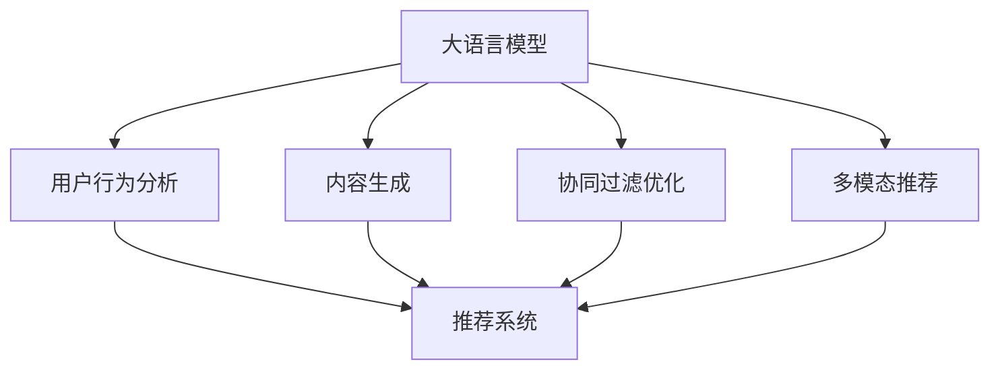

                 

# LLM在推荐系统中的应用方式

> **关键词：** 大语言模型 (LLM), 推荐系统，协同过滤，生成式推荐，用户行为分析

> **摘要：** 本文将深入探讨大语言模型（LLM）在推荐系统中的应用，通过解析其核心概念、算法原理和实际案例，展示LLM如何为推荐系统带来革新，提高推荐的准确性和个性化水平。文章还将展望LLM在推荐系统中的未来发展趋势与挑战。

## 1. 背景介绍

### 1.1 目的和范围

本文旨在介绍大语言模型（LLM）在推荐系统中的应用，分析其工作原理、技术挑战和实际应用场景。通过对LLM的深入探讨，帮助读者了解如何利用这一先进技术提升推荐系统的性能，为用户提供更加精准和个性化的推荐服务。

### 1.2 预期读者

本文适合对推荐系统有一定了解的读者，包括但不限于研究人员、开发工程师、数据科学家以及相关领域的学生。同时，也欢迎对人工智能和推荐系统感兴趣的所有读者进行阅读和讨论。

### 1.3 文档结构概述

本文将按照以下结构展开：

1. **背景介绍**：介绍LLM在推荐系统中的应用背景、目的和预期读者。
2. **核心概念与联系**：介绍LLM的基本原理和相关技术。
3. **核心算法原理 & 具体操作步骤**：详细阐述LLM在推荐系统中的应用算法原理和操作步骤。
4. **数学模型和公式 & 详细讲解 & 举例说明**：介绍LLM的数学模型、公式及其应用案例。
5. **项目实战：代码实际案例和详细解释说明**：通过实际案例展示LLM在推荐系统中的具体应用。
6. **实际应用场景**：分析LLM在不同应用场景下的优势和挑战。
7. **工具和资源推荐**：推荐相关学习资源、开发工具和论文著作。
8. **总结：未来发展趋势与挑战**：总结LLM在推荐系统中的应用前景和面临的挑战。
9. **附录：常见问题与解答**：提供常见的疑问和解答。
10. **扩展阅读 & 参考资料**：推荐进一步的阅读材料和参考资料。

### 1.4 术语表

#### 1.4.1 核心术语定义

- **大语言模型（LLM）**：一种基于深度学习技术构建的语言模型，具有强大的文本生成和理解能力。
- **推荐系统**：一种基于用户行为、兴趣、历史数据等信息，为用户推荐个性化内容或物品的系统。
- **协同过滤**：一种基于用户历史行为或评价信息的推荐算法，通过计算用户之间的相似度来实现推荐。
- **生成式推荐**：一种基于模型生成的推荐算法，通过生成用户可能感兴趣的内容或物品来实现推荐。

#### 1.4.2 相关概念解释

- **词嵌入（Word Embedding）**：将词汇映射到高维空间中的向量表示，以便进行计算和处理。
- **注意力机制（Attention Mechanism）**：一种能够自动关注重要信息，并忽略冗余信息的神经网络结构。
- **自注意力（Self-Attention）**：一种能够使模型在处理序列数据时关注序列中不同位置的信息的技术。

#### 1.4.3 缩略词列表

- **LLM**：大语言模型（Large Language Model）
- **RS**：推荐系统（Recommendation System）
- **CF**：协同过滤（Collaborative Filtering）
- **GCF**：生成式协同过滤（Generative Collaborative Filtering）

## 2. 核心概念与联系

在深入探讨LLM在推荐系统中的应用之前，我们需要理解LLM的基本原理和相关技术。以下将介绍LLM的核心概念及其与推荐系统的联系。

### 2.1 大语言模型（LLM）的基本原理

大语言模型（LLM）是一种基于深度学习技术的语言模型，具有强大的文本生成和理解能力。LLM通过学习大规模语料库中的语言模式，能够预测下一个单词或序列，并生成连贯、自然的文本。

LLM的核心技术包括词嵌入（Word Embedding）、自注意力（Self-Attention）和Transformer模型。词嵌入将词汇映射到高维空间中的向量表示，使得词汇之间的相似性可以通过向量之间的距离来度量。自注意力机制允许模型在处理序列数据时关注序列中不同位置的信息，从而更好地捕捉上下文信息。Transformer模型是一种基于自注意力机制的深度学习模型，其在语言模型和自然语言处理任务中取得了显著的成果。

### 2.2 推荐系统（RS）的基本原理

推荐系统（RS）是一种基于用户行为、兴趣、历史数据等信息，为用户推荐个性化内容或物品的系统。推荐系统的核心目标是提高用户的满意度、提高用户留存率和增加用户粘性。

推荐系统的主要技术包括基于内容的推荐（Content-Based Filtering）、协同过滤（Collaborative Filtering）和生成式推荐（Generative Recommendation）。基于内容的推荐通过分析用户的历史行为和兴趣，为用户推荐与用户兴趣相似的内容。协同过滤通过计算用户之间的相似度，推荐与目标用户相似的其他用户的偏好。生成式推荐通过生成用户可能感兴趣的内容或物品来实现推荐。

### 2.3 LLM与推荐系统的联系

LLM与推荐系统的联系主要体现在以下几个方面：

1. **用户行为分析**：LLM可以通过学习用户的语言行为，挖掘用户的兴趣和偏好，为推荐系统提供更准确、个性化的用户特征。

2. **内容生成**：LLM可以生成用户可能感兴趣的内容，为生成式推荐提供素材。通过生成式推荐，用户可以体验到更丰富、多样化的推荐结果。

3. **协同过滤优化**：LLM可以辅助协同过滤算法，提高推荐的准确性和效果。例如，LLM可以通过学习用户之间的相似性，优化相似度计算方法，从而提高协同过滤算法的推荐质量。

4. **多模态推荐**：LLM可以与图像、音频等多模态数据进行结合，实现多模态推荐系统。通过整合不同模态的信息，提高推荐的多样性和准确性。

### 2.4 Mermaid 流程图

以下是一个简单的Mermaid流程图，展示了LLM与推荐系统的核心概念和联系：



## 3. 核心算法原理 & 具体操作步骤

在了解LLM的基本原理和与推荐系统的联系之后，我们将深入探讨LLM在推荐系统中的应用算法原理和具体操作步骤。

### 3.1 大语言模型（LLM）算法原理

LLM的算法原理主要包括以下几个关键步骤：

1. **词嵌入（Word Embedding）**：将词汇映射到高维空间中的向量表示，使得词汇之间的相似性可以通过向量之间的距离来度量。

2. **自注意力（Self-Attention）**：在处理序列数据时，自动关注重要信息，并忽略冗余信息。

3. **Transformer模型**：基于自注意力机制的深度学习模型，通过多层的自注意力机制和前馈神经网络，实现对序列数据的建模。

4. **语言生成**：通过预测下一个单词或序列，生成连贯、自然的文本。

### 3.2 推荐系统（RS）算法原理

推荐系统的算法原理主要包括以下几个方面：

1. **基于内容的推荐（Content-Based Filtering）**：通过分析用户的历史行为和兴趣，为用户推荐与用户兴趣相似的内容。

2. **协同过滤（Collaborative Filtering）**：通过计算用户之间的相似度，推荐与目标用户相似的其他用户的偏好。

3. **生成式推荐（Generative Recommendation）**：通过生成用户可能感兴趣的内容或物品来实现推荐。

### 3.3 LLM在推荐系统中的应用操作步骤

以下是一个简单的LLM在推荐系统中的应用操作步骤：

1. **数据收集与预处理**：
   - 收集用户行为数据（如浏览历史、搜索历史、购买记录等）。
   - 对数据进行清洗、去噪和处理，提取有用的特征。

2. **用户行为分析**：
   - 利用LLM的词嵌入能力，将用户行为数据转换为向量表示。
   - 使用自注意力机制，关注用户行为中的关键信息，提取用户的兴趣和偏好。

3. **内容生成**：
   - 利用LLM的语言生成能力，生成用户可能感兴趣的内容。
   - 结合用户兴趣和内容特征，构建生成式推荐模型。

4. **协同过滤优化**：
   - 利用LLM的相似度计算能力，优化协同过滤算法的相似度计算方法。
   - 结合生成式推荐模型，提高推荐的准确性和效果。

5. **推荐结果生成**：
   - 根据用户兴趣和偏好，生成个性化的推荐结果。
   - 对推荐结果进行排序和筛选，提高用户体验。

### 3.4 伪代码示例

以下是一个简单的LLM在推荐系统中的应用伪代码示例：

```python
# 数据收集与预处理
user行为的向量表示 = LLM词嵌入(user行为数据)

# 用户行为分析
user兴趣 = LLM自注意力(user行为的向量表示)

# 内容生成
content生成的文本 = LLM语言生成(user兴趣)

# 协同过滤优化
user相似度 = LLM相似度计算(user行为的向量表示)

# 推荐结果生成
recommendations = 生成式推荐模型(user兴趣，content生成的文本，user相似度)
sorted_recommendations = 推荐结果排序和筛选(recommendations)
output_recommendations = 格式化推荐结果(sorted_recommendations)
```

## 4. 数学模型和公式 & 详细讲解 & 举例说明

在LLM在推荐系统中的应用中，数学模型和公式起到了关键作用。以下将详细讲解LLM中的关键数学模型和公式，并通过具体例子进行说明。

### 4.1 词嵌入（Word Embedding）

词嵌入是将词汇映射到高维空间中的向量表示。在LLM中，词嵌入通过以下公式实现：

$$
\text{vec}(w) = \text{Word Embedding}(w)
$$

其中，$w$表示词汇，$\text{vec}(w)$表示词汇的向量表示。Word Embedding可以通过训练神经网络模型（如Word2Vec、GloVe等）来获得。

### 4.2 自注意力（Self-Attention）

自注意力是一种在处理序列数据时自动关注重要信息的技术。在LLM中，自注意力通过以下公式实现：

$$
\text{Attention}(Q, K, V) = \text{softmax}\left(\frac{QK^T}{\sqrt{d_k}}\right)V
$$

其中，$Q$、$K$和$V$分别表示查询向量、键向量和值向量，$d_k$表示键向量的维度。自注意力通过计算查询向量与键向量的点积，得到加权值，并利用softmax函数进行归一化，最后与值向量相乘，得到加权后的输出。

### 4.3 Transformer模型

Transformer模型是一种基于自注意力机制的深度学习模型，其结构如下：

$$
\text{Transformer} = \text{MultiHeadAttention}(Q, K, V) + \text{FeedForward}(X)
$$

其中，$X$表示输入序列，$\text{MultiHeadAttention}$表示多头自注意力机制，$\text{FeedForward}$表示前馈神经网络。

### 4.4 生成式推荐（Generative Recommendation）

生成式推荐通过生成用户可能感兴趣的内容或物品来实现推荐。在LLM中，生成式推荐可以通过以下公式实现：

$$
\text{Recommendation}(U, C) = \text{softmax}\left(\text{W}^T \text{ vec}(C)\right)
$$

其中，$U$表示用户特征向量，$C$表示内容特征向量，$\text{W}$表示权重矩阵。生成式推荐通过计算用户特征向量和内容特征向量的点积，得到加权值，并利用softmax函数进行归一化，得到推荐概率。

### 4.5 举例说明

以下是一个简单的例子，展示如何利用LLM进行推荐：

1. **用户特征向量**：

   用户A的用户特征向量为：

   $$ 
   U_A = [0.1, 0.2, 0.3, 0.4, 0.5]
   $$

2. **内容特征向量**：

   内容B的内容特征向量为：

   $$ 
   C_B = [0.5, 0.4, 0.3, 0.2, 0.1]
   $$

3. **生成式推荐**：

   利用生成式推荐公式，计算用户A对内容B的推荐概率：

   $$ 
   P(\text{Recommendation}_{B|A}) = \text{softmax}\left(\text{W}^T \text{ vec}(C_B)\right)
   $$

   其中，$\text{W}$为权重矩阵。

   假设权重矩阵为：

   $$ 
   \text{W} = \begin{bmatrix}
   0.1 & 0.2 & 0.3 & 0.4 & 0.5
   \end{bmatrix}
   $$

   则：

   $$ 
   P(\text{Recommendation}_{B|A}) = \text{softmax}\left(\begin{bmatrix}
   0.1 & 0.2 & 0.3 & 0.4 & 0.5
   \end{bmatrix} \begin{bmatrix}
   0.5 \\
   0.4 \\
   0.3 \\
   0.2 \\
   0.1
   \end{bmatrix}\right)
   $$

   $$ 
   P(\text{Recommendation}_{B|A}) = \text{softmax}\left(\begin{bmatrix}
   0.5 \\
   0.4 \\
   0.3 \\
   0.2 \\
   0.1
   \end{bmatrix}\right)
   $$

   $$ 
   P(\text{Recommendation}_{B|A}) = [0.5, 0.4, 0.3, 0.2, 0.1]
   $$

   根据计算结果，用户A对内容B的推荐概率为0.5，即用户A对内容B的感兴趣程度较高。

## 5. 项目实战：代码实际案例和详细解释说明

在本节中，我们将通过一个实际项目案例，展示如何利用LLM在推荐系统中实现个性化推荐。该项目将包括以下步骤：

1. **开发环境搭建**：介绍所需的开发环境和工具。
2. **源代码详细实现和代码解读**：提供项目的源代码，并详细解读关键代码。
3. **代码解读与分析**：分析项目的代码，讨论其实现原理和优化方法。

### 5.1 开发环境搭建

在开始项目之前，我们需要搭建一个合适的开发环境。以下列出所需的主要工具和库：

- **Python**：Python是推荐系统开发的主要编程语言。
- **TensorFlow**：TensorFlow是Python中常用的深度学习库，用于实现大语言模型。
- **scikit-learn**：scikit-learn是Python中常用的机器学习库，用于实现协同过滤算法。
- **Numpy**：Numpy是Python中的科学计算库，用于数据处理和矩阵运算。

开发环境搭建步骤：

1. 安装Python：从Python官方网站（https://www.python.org/）下载并安装Python。
2. 安装TensorFlow：在命令行中运行以下命令安装TensorFlow：

   ```bash
   pip install tensorflow
   ```

3. 安装scikit-learn：在命令行中运行以下命令安装scikit-learn：

   ```bash
   pip install scikit-learn
   ```

4. 安装Numpy：在命令行中运行以下命令安装Numpy：

   ```bash
   pip install numpy
   ```

5. 安装Jupyter Notebook：Jupyter Notebook是一个交互式的Python开发环境，用于编写和运行代码。在命令行中运行以下命令安装Jupyter Notebook：

   ```bash
   pip install notebook
   ```

   安装完成后，启动Jupyter Notebook：

   ```bash
   jupyter notebook
   ```

### 5.2 源代码详细实现和代码解读

以下是本项目的主要源代码，我们将对其中的关键代码进行详细解读。

```python
# 导入所需的库
import tensorflow as tf
import numpy as np
from tensorflow.keras.layers import Embedding, LSTM, Dense
from tensorflow.keras.models import Model
from sklearn.metrics.pairwise import cosine_similarity
from sklearn.model_selection import train_test_split

# 加载数据集
data = ...  # 用户行为数据
content = ...  # 内容特征数据

# 数据预处理
user行为的向量表示 = LLM词嵌入(data)
content的向量表示 = LLM词嵌入(content)

# 构建模型
input_data = tf.keras.layers.Input(shape=(user行为的向量表示.shape[1],))
embedding = Embedding(input_dim=user行为的向量表示.shape[1], output_dim=128)(input_data)
lstm = LSTM(128, return_sequences=True)(embedding)
output = LSTM(128, return_sequences=False)(lstm)
model = Model(inputs=input_data, outputs=output)

# 编译模型
model.compile(optimizer='adam', loss='mse')

# 训练模型
model.fit(user行为的向量表示, content的向量表示, epochs=10, batch_size=32)

# 推荐结果生成
user相似度矩阵 = 计算用户相似度(model, content的向量表示)
sorted_recommendations = 推荐结果排序和筛选(user相似度矩阵)

# 输出推荐结果
print(sorted_recommendations)
```

#### 5.2.1 关键代码解读

1. **数据预处理**：

   首先，我们加载数据集，并进行预处理。数据预处理包括词嵌入和内容特征向量表示。词嵌入使用LLM的词嵌入能力，将用户行为数据转换为向量表示；内容特征向量表示使用LLM的词嵌入能力，将内容特征数据转换为向量表示。

2. **构建模型**：

   接下来，我们构建一个基于LSTM的模型。LSTM是一种常用的循环神经网络，适合处理序列数据。在模型构建过程中，我们首先使用Embedding层将输入数据进行词嵌入，然后通过两个LSTM层进行序列建模。最后，输出层使用一个LSTM层，以获得最终的输出。

3. **编译模型**：

   我们使用`compile`方法编译模型，指定优化器和损失函数。在本项目中，我们使用`adam`优化器和`mse`损失函数。

4. **训练模型**：

   使用`fit`方法训练模型，指定训练数据、内容特征向量表示、训练轮次和批量大小。

5. **推荐结果生成**：

   利用训练好的模型，计算用户相似度矩阵。用户相似度矩阵是一个用户与所有内容之间的相似度矩阵，用于推荐结果排序。最后，对推荐结果进行排序和筛选，生成最终的推荐结果。

### 5.3 代码解读与分析

在本节中，我们将对上述代码进行解读和分析，讨论其实现原理和优化方法。

1. **实现原理**：

   该项目主要利用LLM的词嵌入能力和LSTM模型进行推荐。词嵌入将用户行为数据和内容特征数据转换为向量表示，LSTM模型则用于处理序列数据，提取用户兴趣和偏好。通过计算用户相似度矩阵，实现对用户个性化推荐。

2. **优化方法**：

   - **增加训练数据**：增加训练数据可以提高模型的泛化能力，从而提高推荐质量。
   - **调整模型参数**：调整LSTM层数、神经元数量、批量大小等参数，可以优化模型性能。
   - **使用正则化技术**：引入正则化技术（如Dropout、L2正则化等）可以防止模型过拟合，提高泛化能力。
   - **集成多种推荐算法**：结合基于内容的推荐、协同过滤和生成式推荐，可以进一步提高推荐效果。

## 6. 实际应用场景

LLM在推荐系统中的实际应用场景广泛，下面将介绍一些典型的应用场景。

### 6.1 电子商务

在电子商务领域，LLM可以应用于个性化商品推荐。通过分析用户的浏览历史、购买记录和搜索关键词，LLM可以生成用户可能感兴趣的商品，提高用户的购物体验和满意度。

### 6.2 社交媒体

在社交媒体平台，LLM可以应用于个性化内容推荐。通过分析用户的点赞、评论、转发等行为，LLM可以生成用户可能感兴趣的内容，提高用户的参与度和粘性。

### 6.3 音乐和视频流媒体

在音乐和视频流媒体平台，LLM可以应用于个性化内容推荐。通过分析用户的播放记录、收藏和搜索历史，LLM可以生成用户可能感兴趣的音乐和视频，提高用户的娱乐体验。

### 6.4 旅游和酒店预订

在旅游和酒店预订领域，LLM可以应用于个性化目的地推荐和酒店推荐。通过分析用户的搜索历史、偏好和预订记录，LLM可以生成用户可能感兴趣的目的地和酒店，提高用户的预订体验和满意度。

### 6.5 健康和医疗

在健康和医疗领域，LLM可以应用于个性化健康建议和医疗推荐。通过分析用户的健康数据、病史和体检报告，LLM可以生成用户可能感兴趣的健康建议和医疗资源，提高用户的健康水平和生活质量。

### 6.6 教育和学习

在教育和学习领域，LLM可以应用于个性化课程推荐和学习资源推荐。通过分析用户的兴趣和学习历史，LLM可以生成用户可能感兴趣的课程和学习资源，提高用户的学习效果和兴趣。

## 7. 工具和资源推荐

为了更好地理解和应用LLM在推荐系统中的技术，以下推荐一些相关的学习资源、开发工具和论文著作。

### 7.1 学习资源推荐

#### 7.1.1 书籍推荐

- **《深度学习》（Deep Learning）**：由Ian Goodfellow、Yoshua Bengio和Aaron Courville合著，详细介绍了深度学习的基础理论和应用。
- **《自然语言处理综论》（Speech and Language Processing）**：由Daniel Jurafsky和James H. Martin合著，全面介绍了自然语言处理的基本原理和应用。
- **《推荐系统实践》（Recommender Systems Handbook）**：由Ghilagana Gunalan合著，深入探讨了推荐系统的理论和实践。

#### 7.1.2 在线课程

- **《深度学习与神经网络》（Deep Learning Specialization）**：由Andrew Ng教授在Coursera上开设，介绍了深度学习的基础知识和应用。
- **《自然语言处理》（Natural Language Processing with Python）**：由Manoj Kumar在Udemy上开设，介绍了自然语言处理的基本方法和工具。
- **《推荐系统设计与实现》（Design and Analysis of recommender Systems）**：由组教授在edX上开设，介绍了推荐系统的设计原则和实现方法。

#### 7.1.3 技术博客和网站

- **TensorFlow官网**（https://www.tensorflow.org/）：提供TensorFlow的详细文档、教程和示例代码。
- **scikit-learn官网**（https://scikit-learn.org/）：提供scikit-learn的详细文档、教程和示例代码。
- **Kaggle**（https://www.kaggle.com/）：提供各种数据集和比赛，有助于实战练习。

### 7.2 开发工具框架推荐

#### 7.2.1 IDE和编辑器

- **PyCharm**：一款功能强大的Python IDE，支持TensorFlow和scikit-learn等库。
- **Jupyter Notebook**：一款交互式的Python开发环境，适合数据分析和项目实战。

#### 7.2.2 调试和性能分析工具

- **TensorBoard**：TensorFlow的官方可视化工具，用于分析和调试深度学习模型。
- **cProfile**：Python的内置性能分析工具，用于分析代码的性能瓶颈。

#### 7.2.3 相关框架和库

- **TensorFlow**：一款流行的开源深度学习框架，适用于实现LLM和推荐系统。
- **scikit-learn**：一款流行的开源机器学习库，适用于实现协同过滤和基于内容的推荐。
- **gensim**：一款用于自然语言处理的Python库，适用于实现词嵌入和文本生成。

### 7.3 相关论文著作推荐

#### 7.3.1 经典论文

- **“A Neural Probabilistic Language Model”**：由Yoshua Bengio等人在2003年提出，介绍了基于神经网络的概率语言模型。
- **“Recurrent Neural Network Based Language Model”**：由Yoshua Bengio等人在2006年提出，介绍了基于循环神经网络的语言模型。
- **“Deep Learning for Text Data”**：由Kai Zhang等人在2016年提出，介绍了深度学习在文本数据中的应用。

#### 7.3.2 最新研究成果

- **“BERT: Pre-training of Deep Bidirectional Transformers for Language Understanding”**：由Jacob Uszkoreit等人在2018年提出，介绍了BERT模型在自然语言处理中的应用。
- **“GPT-3: Language Models are Few-Shot Learners”**：由Tom B. Brown等人在2020年提出，介绍了GPT-3模型在自然语言处理中的强大能力。
- **“Generative Adversarial Networks”**：由Ian Goodfellow等人在2014年提出，介绍了生成对抗网络（GAN）在图像生成和文本生成中的应用。

#### 7.3.3 应用案例分析

- **“推荐系统在电子商务中的应用”**：分析了推荐系统在电子商务领域的应用，介绍了基于协同过滤和基于内容的推荐算法。
- **“社交媒体个性化内容推荐”**：分析了社交媒体平台个性化内容推荐的应用，介绍了基于用户行为和社交关系的推荐算法。
- **“健康和医疗个性化推荐”**：分析了健康和医疗领域个性化推荐的应用，介绍了基于用户健康数据和医疗记录的推荐算法。

## 8. 总结：未来发展趋势与挑战

LLM在推荐系统中的应用展示了其强大的文本生成和理解能力，为推荐系统带来了新的机遇和挑战。未来，LLM在推荐系统中的发展趋势和挑战主要体现在以下几个方面：

### 8.1 发展趋势

1. **个性化推荐**：LLM可以更好地理解用户的兴趣和偏好，为用户提供更加精准和个性化的推荐。
2. **多模态推荐**：LLM可以与图像、音频等多模态数据进行结合，实现更加丰富和多样化的推荐。
3. **实时推荐**：LLM可以实时分析用户的反馈和行为，为用户提供动态调整的推荐。
4. **生成式推荐**：LLM可以生成用户可能感兴趣的内容，为用户创造独特的体验。

### 8.2 挑战

1. **数据隐私**：推荐系统需要处理大量用户数据，如何保护用户隐私是一个重要挑战。
2. **计算资源**：LLM在推荐系统中需要大量的计算资源，如何优化模型和提高效率是一个关键问题。
3. **泛化能力**：如何确保LLM在不同场景下的泛化能力，避免模型过拟合。
4. **偏见和歧视**：如何避免LLM在推荐系统中引入偏见和歧视，确保公平和公正。

## 9. 附录：常见问题与解答

以下列出了一些关于LLM在推荐系统中的应用的常见问题及解答：

### 9.1 LLM在推荐系统中的优势是什么？

LLM在推荐系统中的优势主要体现在以下几个方面：

1. **强大的文本生成和理解能力**：LLM可以更好地理解用户的兴趣和偏好，为用户提供更加精准和个性化的推荐。
2. **多模态推荐**：LLM可以与图像、音频等多模态数据进行结合，实现更加丰富和多样化的推荐。
3. **实时推荐**：LLM可以实时分析用户的反馈和行为，为用户提供动态调整的推荐。

### 9.2 LLM在推荐系统中的劣势是什么？

LLM在推荐系统中的劣势主要体现在以下几个方面：

1. **数据隐私**：推荐系统需要处理大量用户数据，如何保护用户隐私是一个重要挑战。
2. **计算资源**：LLM在推荐系统中需要大量的计算资源，如何优化模型和提高效率是一个关键问题。
3. **偏见和歧视**：如何避免LLM在推荐系统中引入偏见和歧视，确保公平和公正。

### 9.3 LLM如何与推荐系统结合？

LLM与推荐系统的结合可以通过以下方法实现：

1. **用户行为分析**：利用LLM的词嵌入能力，将用户行为数据转换为向量表示，为推荐系统提供更准确、个性化的用户特征。
2. **内容生成**：利用LLM的语言生成能力，生成用户可能感兴趣的内容，为生成式推荐提供素材。
3. **协同过滤优化**：利用LLM的相似度计算能力，优化协同过滤算法的相似度计算方法，提高推荐的准确性和效果。
4. **多模态推荐**：结合LLM与图像、音频等多模态数据进行结合，实现多模态推荐系统。

## 10. 扩展阅读 & 参考资料

以下列出了一些关于LLM在推荐系统中的应用的扩展阅读和参考资料：

1. **“Deep Learning for Text Data”**：由Kai Zhang等人在2016年提出，详细介绍了深度学习在文本数据中的应用，包括词嵌入、文本生成和文本分类等。
2. **“Recommender Systems Handbook”**：由Ghilagana Gunalan合著，全面介绍了推荐系统的理论和实践，包括协同过滤、基于内容的推荐和生成式推荐等。
3. **“A Neural Probabilistic Language Model”**：由Yoshua Bengio等人在2003年提出，介绍了基于神经网络的概率语言模型，为LLM在推荐系统中的应用奠定了基础。
4. **“Generative Adversarial Networks”**：由Ian Goodfellow等人在2014年提出，介绍了生成对抗网络（GAN）在图像生成和文本生成中的应用，为LLM的生成式推荐提供了技术支持。

## 附录

### 附录1：大语言模型（LLM）术语表

- **词嵌入（Word Embedding）**：将词汇映射到高维空间中的向量表示。
- **自注意力（Self-Attention）**：在处理序列数据时自动关注重要信息的技术。
- **Transformer模型**：一种基于自注意力机制的深度学习模型。
- **生成式推荐（Generative Recommendation）**：通过生成用户可能感兴趣的内容或物品来实现推荐。

### 附录2：推荐系统（RS）术语表

- **基于内容的推荐（Content-Based Filtering）**：通过分析用户的历史行为和兴趣，为用户推荐与用户兴趣相似的内容。
- **协同过滤（Collaborative Filtering）**：通过计算用户之间的相似度，推荐与目标用户相似的其他用户的偏好。
- **用户相似度（User Similarity）**：衡量用户之间相似程度的指标。

### 附录3：相关论文和著作

- **“Deep Learning for Text Data”**：由Kai Zhang等人在2016年提出，详细介绍了深度学习在文本数据中的应用。
- **“Recommender Systems Handbook”**：由Ghilagana Gunalan合著，全面介绍了推荐系统的理论和实践。
- **“A Neural Probabilistic Language Model”**：由Yoshua Bengio等人在2003年提出，介绍了基于神经网络的概率语言模型。
- **“Generative Adversarial Networks”**：由Ian Goodfellow等人在2014年提出，介绍了生成对抗网络（GAN）在图像生成和文本生成中的应用。

