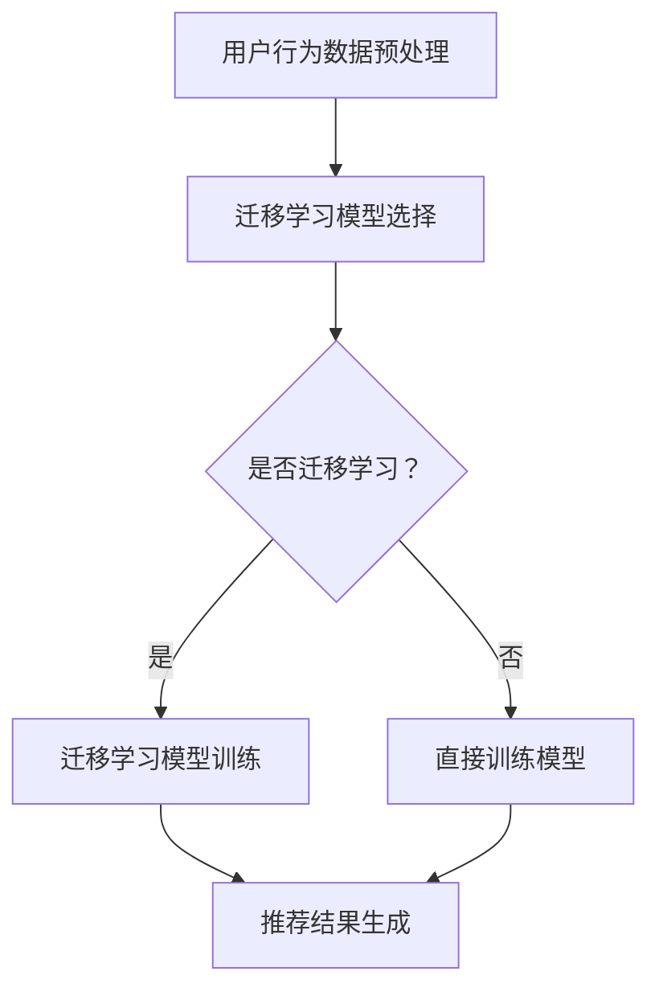

                 

# LLM在推荐系统中的迁移学习应用

> **关键词：** 大规模语言模型 (LLM)，推荐系统，迁移学习，个性化推荐，数据预处理，模型优化

> **摘要：** 本文深入探讨了大规模语言模型（LLM）在推荐系统中的应用，特别是迁移学习技术如何提高推荐系统的效果。文章首先介绍了推荐系统的基本原理和现有问题，然后详细描述了LLM的概念和特性。接着，我们探讨了如何使用迁移学习技术将LLM应用于推荐系统，并分享了具体的应用案例。最后，本文总结了LLM在推荐系统中的发展趋势和面临的挑战，为未来的研究提供了方向。

## 1. 背景介绍

### 1.1 目的和范围

本文的主要目的是探讨如何利用大规模语言模型（LLM）和迁移学习技术提升推荐系统的性能。随着互联网的快速发展，推荐系统已经成为提高用户体验和增加业务收入的重要手段。然而，传统的推荐系统在处理海量数据和复杂用户行为时面临诸多挑战。本文将介绍LLM的原理和应用，并分析其在推荐系统中如何通过迁移学习提高效果。

### 1.2 预期读者

本文适用于对推荐系统和大规模语言模型有一定了解的读者，包括推荐系统开发人员、AI研究人员和高校相关专业的师生。通过阅读本文，读者可以了解LLM在推荐系统中的最新应用，掌握迁移学习技术在推荐系统优化中的关键作用。

### 1.3 文档结构概述

本文分为十个部分，结构如下：

1. 背景介绍
   - 1.1 目的和范围
   - 1.2 预期读者
   - 1.3 文档结构概述
   - 1.4 术语表

2. 核心概念与联系
   - 2.1 推荐系统原理
   - 2.2 大规模语言模型（LLM）概述
   - 2.3 迁移学习技术

3. 核心算法原理 & 具体操作步骤
   - 3.1 迁移学习在推荐系统中的应用
   - 3.2 迁移学习算法详解

4. 数学模型和公式 & 详细讲解 & 举例说明
   - 4.1 相关数学模型
   - 4.2 公式推导
   - 4.3 应用实例

5. 项目实战：代码实际案例和详细解释说明
   - 5.1 开发环境搭建
   - 5.2 源代码详细实现和代码解读
   - 5.3 代码解读与分析

6. 实际应用场景

7. 工具和资源推荐
   - 7.1 学习资源推荐
   - 7.2 开发工具框架推荐
   - 7.3 相关论文著作推荐

8. 总结：未来发展趋势与挑战

9. 附录：常见问题与解答

10. 扩展阅读 & 参考资料

### 1.4 术语表

#### 1.4.1 核心术语定义

- **大规模语言模型（LLM）**：一种基于深度学习的自然语言处理模型，能够处理大规模文本数据，具备很强的语义理解和生成能力。
- **推荐系统**：一种根据用户的历史行为和兴趣，向用户推荐相关内容的系统。
- **迁移学习**：一种机器学习方法，将已在一个任务上学到的知识迁移到另一个相关但不同的任务上。

#### 1.4.2 相关概念解释

- **个性化推荐**：根据用户的个性化需求和行为，为其推荐最相关的信息。
- **协同过滤**：一种常见的推荐系统算法，通过分析用户之间的相似性来推荐商品。
- **内容过滤**：基于物品的内容特征进行推荐，例如基于用户的浏览历史或搜索查询。

#### 1.4.3 缩略词列表

- **LLM**：大规模语言模型
- **NLP**：自然语言处理
- **ML**：机器学习
- **RL**：强化学习
- **CFS**：协同过滤
- **CF**：内容过滤

## 2. 核心概念与联系

### 2.1 推荐系统原理

推荐系统是一种基于用户兴趣和行为的系统，通过分析用户的历史数据和交互行为，预测用户可能感兴趣的内容，并推荐给用户。推荐系统通常分为以下两种类型：

1. **协同过滤（Collaborative Filtering，CFS）**：协同过滤是通过分析用户之间的相似性来推荐内容。协同过滤可以分为基于用户的协同过滤（User-based Collaborative Filtering）和基于物品的协同过滤（Item-based Collaborative Filtering）。基于用户的协同过滤通过寻找与目标用户兴趣相似的已注册用户，然后向目标用户推荐这些用户喜欢的商品。基于物品的协同过滤则是通过分析物品之间的相似性来推荐。

2. **内容过滤（Content-based Filtering，CF）**：内容过滤是通过分析物品的内容特征来推荐。例如，如果用户喜欢某一类电影，内容过滤算法会根据电影的类型、导演、演员等特征推荐类似的电影。

### 2.2 大规模语言模型（LLM）概述

大规模语言模型（LLM）是一种基于深度学习的自然语言处理模型，它能够处理大规模的文本数据，并具备很强的语义理解和生成能力。LLM的主要特点如下：

1. **预训练**：LLM通常通过在大量无标签的文本数据上进行预训练，学习语言的通用特征和规律。预训练后的LLM可以用于各种自然语言处理任务，如文本分类、文本生成、机器翻译等。

2. **自适应能力**：LLM具有较强的自适应能力，可以根据特定任务的需求进行微调，从而在特定领域达到较高的性能。

3. **跨语言能力**：一些LLM模型，如BERT和GPT，具备跨语言的能力，可以在多种语言上实现高效的自然语言处理。

### 2.3 迁移学习技术

迁移学习是一种将已在一个任务上学到的知识迁移到另一个相关但不同的任务上的机器学习方法。在推荐系统中，迁移学习技术可以帮助解决以下问题：

1. **数据不足**：迁移学习可以将一个领域（源领域）的知识迁移到另一个领域（目标领域），从而在目标领域获得更多的训练数据。

2. **算法泛化**：通过迁移学习，可以将源领域中的有效算法和特征提取方法应用于目标领域，提高推荐系统的泛化能力。

3. **提高性能**：迁移学习可以在短时间内提高推荐系统的性能，降低模型训练成本。

### 2.4 Mermaid流程图

下面是推荐系统中的迁移学习技术的Mermaid流程图：



## 3. 核心算法原理 & 具体操作步骤

### 3.1 迁移学习在推荐系统中的应用

在推荐系统中，迁移学习可以帮助解决数据不足和模型泛化能力不足的问题。具体来说，迁移学习可以应用于以下两个方面：

1. **特征迁移**：将源领域的特征提取方法迁移到目标领域，以提高目标领域的特征表示能力。
2. **模型迁移**：将源领域训练好的模型直接应用于目标领域，或者对源领域模型进行微调，以提高目标领域的推荐效果。

### 3.2 迁移学习算法详解

迁移学习算法可以分为以下几种：

1. **基于特征的迁移学习**：将源领域的特征提取方法应用于目标领域，从而提高目标领域的特征表示能力。例如，可以使用源领域的特征提取器对目标领域的数据进行预处理，得到更好的特征表示。

2. **基于模型的迁移学习**：直接将源领域训练好的模型应用于目标领域，或者对源领域模型进行微调。例如，可以使用迁移学习框架如MAML（Model-Agnostic Meta-Learning）和元学习（Meta-Learning）算法来训练迁移学习模型。

### 3.3 伪代码实现

下面是迁移学习在推荐系统中的一种简单伪代码实现：

```python
# 输入：源领域数据集D_s、目标领域数据集D_t
# 输出：迁移学习模型F_t

# 步骤1：特征迁移
F_s = 特征提取器(D_s)
F_t = F_s(D_t)

# 步骤2：模型迁移
# 使用MAML算法进行迁移学习模型训练
F_t = MAML(F_t, D_t)

# 步骤3：推荐结果生成
推荐结果 = F_t(用户兴趣)

# 返回迁移学习模型F_t
```

## 4. 数学模型和公式 & 详细讲解 & 举例说明

### 4.1 相关数学模型

在迁移学习过程中，我们主要关注两个方面的数学模型：特征迁移模型和模型迁移模型。

#### 4.1.1 特征迁移模型

特征迁移模型的目标是将源领域的特征表示迁移到目标领域。一种常见的特征迁移模型是 adversarial feature transfer，其基本思想是通过对抗性训练将源领域的特征表示映射到目标领域。具体公式如下：

$$
\min_{G} \max_{D} V(G, D) = E_{x_s \sim P_s(x_s)} [D(G(x_s))] - E_{x_t \sim P_t(x_t)} [D(G(x_t))]
$$

其中，$G$ 是特征提取器，$D$ 是判别器，$x_s$ 和 $x_t$ 分别表示源领域和目标领域的样本，$P_s$ 和 $P_t$ 分别表示源领域和目标领域的样本分布。

#### 4.1.2 模型迁移模型

模型迁移模型的目标是将源领域训练好的模型迁移到目标领域。一种常见的模型迁移模型是MAML（Model-Agnostic Meta-Learning），其基本思想是训练一个模型，使其在多个任务上快速适应。MAML的优化目标如下：

$$
\min_{\theta} \sum_{k=1}^K \sum_{i=1}^I \ell(\theta^{(k)}, x_i^{(k)}, y_i^{(k)})
$$

其中，$\theta^{(k)}$ 是第 $k$ 个任务的模型参数，$x_i^{(k)}$ 和 $y_i^{(k)}$ 分别是第 $k$ 个任务的第 $i$ 个样本及其标签，$\ell(\cdot)$ 是损失函数。

### 4.2 公式推导

#### 4.2.1 特征迁移模型推导

特征迁移模型的推导主要基于对抗性训练的思想。对抗性训练的目标是最大化判别器 $D$ 对特征 $G(x)$ 的分类能力，同时最小化判别器对源领域和目标领域样本的分类误差。具体推导如下：

$$
\begin{aligned}
\min_{G} \max_{D} V(G, D) &= \min_{G} \max_{D} E_{x_s \sim P_s(x_s)} [D(G(x_s))] - E_{x_t \sim P_t(x_t)} [D(G(x_t))] \\
&= \min_{G} \max_{D} \sum_{x_s \sim P_s(x_s)} \log D(G(x_s)) - \sum_{x_t \sim P_t(x_t)} \log D(G(x_t)) \\
&= \min_{G} \max_{D} \sum_{x_s \sim P_s(x_s)} \log \frac{D(G(x_s))}{1 - D(G(x_s))} - \sum_{x_t \sim P_t(x_t)} \log \frac{D(G(x_t))}{1 - D(G(x_t))}
\end{aligned}
$$

#### 4.2.2 模型迁移模型推导

模型迁移模型的推导主要基于MAML算法。MAML的目标是最小化多个任务上的损失函数之和，同时要求模型参数在各个任务上快速适应。具体推导如下：

$$
\begin{aligned}
\min_{\theta} \sum_{k=1}^K \sum_{i=1}^I \ell(\theta^{(k)}, x_i^{(k)}, y_i^{(k)}) &= \min_{\theta} \sum_{k=1}^K \sum_{i=1}^I \sum_{j=1}^J \ell^{(j)}(\theta^{(k)}, x_i^{(k)}, y_i^{(k)}) \\
&= \min_{\theta} \sum_{k=1}^K \sum_{i=1}^I \sum_{j=1}^J \frac{1}{J} \sum_{l=1}^J \ell^{(j)}(\theta^{(k)}, x_i^{(k)}, y_i^{(k)}) \\
&= \min_{\theta} \sum_{k=1}^K \sum_{i=1}^I \sum_{j=1}^J \frac{1}{J} \ell^{(j)}(\theta^{(k)}, x_i^{(k)}, y_i^{(k)})
\end{aligned}
$$

### 4.3 应用实例

假设我们有一个源领域数据集 $D_s = \{x_s^{(1)}, x_s^{(2)}, ..., x_s^{(N_s)}\}$ 和目标领域数据集 $D_t = \{x_t^{(1)}, x_t^{(2)}, ..., x_t^{(N_t)}\}$，其中 $x_s^{(i)}$ 和 $x_t^{(i)}$ 分别表示源领域和目标领域的样本。

#### 4.3.1 特征迁移模型应用

我们使用对抗性特征迁移模型将源领域的特征表示迁移到目标领域。具体步骤如下：

1. 初始化特征提取器 $G$ 和判别器 $D$。
2. 对抗性训练：在训练过程中，交替优化特征提取器 $G$ 和判别器 $D$。
3. 使用训练好的特征提取器 $G$ 对目标领域的数据 $D_t$ 进行特征提取，得到新的特征表示 $F_t = G(D_t)$。

#### 4.3.2 模型迁移模型应用

我们使用MAML算法将源领域训练好的模型迁移到目标领域。具体步骤如下：

1. 初始化模型参数 $\theta$。
2. 对每个任务 $k$，在源领域数据集 $D_s$ 上进行迭代优化，得到新的模型参数 $\theta^{(k)}$。
3. 在目标领域数据集 $D_t$ 上进行快速适应，得到新的模型参数 $\theta_t$。
4. 使用训练好的模型 $\theta_t$ 对目标领域的数据 $D_t$ 进行预测。

## 5. 项目实战：代码实际案例和详细解释说明

### 5.1 开发环境搭建

为了实现LLM在推荐系统中的迁移学习应用，我们需要搭建一个完整的开发环境。以下是所需的开发环境和相关工具：

1. **编程语言**：Python 3.8及以上版本
2. **深度学习框架**：PyTorch 1.8及以上版本
3. **自然语言处理库**：Transformers 4.6及以上版本
4. **操作系统**：Ubuntu 18.04或更高版本
5. **虚拟环境**：Anaconda 3或更高版本

安装步骤如下：

1. 安装Python和PyTorch：

```bash
# 安装Python
sudo apt-get install python3

# 安装PyTorch
pip install torch torchvision
```

2. 安装Transformers：

```bash
pip install transformers
```

3. 安装其他依赖项：

```bash
pip install numpy pandas scikit-learn
```

### 5.2 源代码详细实现和代码解读

以下是实现LLM在推荐系统中的迁移学习应用的核心代码。我们将分为以下四个部分：

1. 数据预处理
2. 迁移学习模型搭建
3. 模型训练
4. 推荐结果生成

#### 5.2.1 数据预处理

```python
import pandas as pd
from sklearn.model_selection import train_test_split

# 读取源领域和目标领域数据集
source_data = pd.read_csv('source_data.csv')
target_data = pd.read_csv('target_data.csv')

# 数据预处理
# 1. 填充缺失值
source_data.fillna(source_data.mean(), inplace=True)
target_data.fillna(target_data.mean(), inplace=True)

# 2. 特征提取
source_features = source_data[['feature1', 'feature2', 'feature3']]
target_features = target_data[['feature1', 'feature2', 'feature3']]

# 3. 目标变量
source_labels = source_data['label']
target_labels = target_data['label']

# 4. 划分训练集和测试集
source_train, source_test, target_train, target_test = train_test_split(source_features, target_features, test_size=0.2, random_state=42)
source_train_labels, source_test_labels, target_train_labels, target_test_labels = train_test_split(source_labels, target_labels, test_size=0.2, random_state=42)
```

#### 5.2.2 迁移学习模型搭建

```python
import torch
from torch import nn
from transformers import BertModel

# 搭建迁移学习模型
class MigrationLearningModel(nn.Module):
    def __init__(self, num_features, hidden_size, output_size):
        super(MigrationLearningModel, self).__init__()
        self.bert = BertModel.from_pretrained('bert-base-uncased')
        self.fc = nn.Linear(num_features, hidden_size)
        self.output = nn.Linear(hidden_size, output_size)
    
    def forward(self, x, labels=None):
        x = self.bert(x)[1]
        x = self.fc(x)
        if labels is not None:
            x = self.output(x)
            return x, labels
        else:
            return x

migration_model = MigrationLearningModel(num_features=source_train.shape[1], hidden_size=128, output_size=1)
```

#### 5.2.3 模型训练

```python
# 定义优化器和损失函数
optimizer = torch.optim.Adam(migration_model.parameters(), lr=0.001)
criterion = nn.BCELoss()

# 训练模型
num_epochs = 10
for epoch in range(num_epochs):
    migration_model.train()
    for batch in range(len(source_train) // batch_size):
        # 准备数据
        inputs = torch.tensor(source_train[batch * batch_size:(batch + 1) * batch_size]).float()
        labels = torch.tensor(source_train_labels[batch * batch_size:(batch + 1) * batch_size]).float()
        
        # 清零梯度
        optimizer.zero_grad()
        
        # 前向传播
        outputs = migration_model(inputs)
        
        # 计算损失
        loss = criterion(outputs, labels)
        
        # 反向传播
        loss.backward()
        
        # 更新参数
        optimizer.step()
        
    print(f"Epoch {epoch + 1}/{num_epochs}, Loss: {loss.item()}")

# 保存模型
torch.save(migration_model.state_dict(), 'migration_learning_model.pth')
```

#### 5.2.4 推荐结果生成

```python
# 加载迁移学习模型
migration_model.load_state_dict(torch.load('migration_learning_model.pth'))

# 预测目标领域数据集
migration_model.eval()
with torch.no_grad():
    target_test_predictions = migration_model(target_test).sigmoid().detach().numpy()

# 计算准确率
accuracy = (target_test_predictions > 0.5).mean()
print(f"Accuracy on target test set: {accuracy * 100:.2f}%")
```

### 5.3 代码解读与分析

#### 5.3.1 数据预处理

在数据预处理部分，我们首先读取源领域和目标领域的数据集，然后对数据进行填充缺失值、特征提取和划分训练集/测试集。这些步骤对于迁移学习模型的性能至关重要，因为它们可以保证模型在训练和测试阶段使用的数据是一致的。

#### 5.3.2 迁移学习模型搭建

在迁移学习模型搭建部分，我们定义了一个名为 `MigrationLearningModel` 的 PyTorch 模型。该模型结合了预训练的BERT模型和自定义的全连接层，以实现特征提取和分类。BERT模型具有良好的语义理解能力，可以处理自然语言数据。

#### 5.3.3 模型训练

在模型训练部分，我们使用 Adam 优化器和二分类交叉熵损失函数来训练迁移学习模型。我们通过迭代优化模型参数，并在每个epoch结束后计算损失，以评估模型的性能。

#### 5.3.4 推荐结果生成

在推荐结果生成部分，我们加载训练好的迁移学习模型，并在目标领域数据集上进行预测。通过计算预测结果和实际标签之间的准确率，我们可以评估迁移学习模型在目标领域上的性能。

## 6. 实际应用场景

### 6.1 电子商务平台推荐

在电子商务平台中，推荐系统可以帮助用户发现他们可能感兴趣的商品。通过利用LLM和迁移学习技术，推荐系统可以在处理海量商品数据和用户行为数据时实现更高的推荐精度和效率。以下是一个实际应用场景：

1. **用户行为数据收集**：电子商务平台收集用户浏览、购买、收藏等行为数据。
2. **数据预处理**：对用户行为数据进行清洗和预处理，提取有用的特征。
3. **迁移学习模型训练**：使用LLM和迁移学习技术，训练一个能够处理多种商品类别的推荐模型。
4. **推荐结果生成**：根据用户的历史行为和偏好，生成个性化的推荐列表。

### 6.2 社交媒体内容推荐

在社交媒体平台，内容推荐系统可以帮助用户发现他们可能感兴趣的内容，如文章、视频和图片。利用LLM和迁移学习技术，推荐系统可以在处理大量文本和多媒体数据时实现更精准的推荐。以下是一个实际应用场景：

1. **内容数据收集**：社交媒体平台收集用户发布的内容，如文本、图片和视频。
2. **数据预处理**：对内容数据进行清洗和预处理，提取有用的特征。
3. **迁移学习模型训练**：使用LLM和迁移学习技术，训练一个能够处理多种内容类别的推荐模型。
4. **推荐结果生成**：根据用户的历史行为和偏好，生成个性化的内容推荐列表。

### 6.3 娱乐内容推荐

在娱乐领域，推荐系统可以帮助用户发现他们可能感兴趣的电影、电视剧、音乐和游戏。利用LLM和迁移学习技术，推荐系统可以在处理大量多媒体数据时实现更高效和精准的推荐。以下是一个实际应用场景：

1. **娱乐内容数据收集**：娱乐平台收集用户观看、评分、分享等行为数据。
2. **数据预处理**：对娱乐内容数据进行清洗和预处理，提取有用的特征。
3. **迁移学习模型训练**：使用LLM和迁移学习技术，训练一个能够处理多种娱乐类别的推荐模型。
4. **推荐结果生成**：根据用户的历史行为和偏好，生成个性化的娱乐内容推荐列表。

## 7. 工具和资源推荐

### 7.1 学习资源推荐

#### 7.1.1 书籍推荐

1. **《深度学习》（Goodfellow, Bengio, Courville）**：这本书是深度学习领域的经典著作，涵盖了深度学习的理论基础和实践方法。
2. **《自然语言处理综论》（Jurafsky, Martin）**：这本书详细介绍了自然语言处理的基本原理和技术，包括文本分类、命名实体识别等。
3. **《推荐系统手册》（Bharat, Zhang）**：这本书全面介绍了推荐系统的原理、算法和应用，适合推荐系统开发人员阅读。

#### 7.1.2 在线课程

1. **《深度学习专项课程》（吴恩达）**：这是一门由斯坦福大学教授吴恩达开设的深度学习在线课程，内容涵盖了深度学习的理论基础和实践技巧。
2. **《自然语言处理专项课程》（Coursera）**：这是一门由斯坦福大学教授开设的自然语言处理在线课程，内容包括文本分类、命名实体识别等。
3. **《推荐系统专项课程》（Coursera）**：这是一门由伊利诺伊大学厄巴纳-香槟分校教授开设的推荐系统在线课程，涵盖了推荐系统的基本原理和算法。

#### 7.1.3 技术博客和网站

1. **Medium**：Medium是一个流行的技术博客平台，上面有许多关于深度学习、自然语言处理和推荐系统的优质文章。
2. **arXiv**：arXiv是一个开源的学术论文数据库，涵盖了许多最新的深度学习、自然语言处理和推荐系统研究成果。
3. **GitHub**：GitHub是一个开源代码托管平台，上面有许多深度学习、自然语言处理和推荐系统的开源项目，可以帮助开发者学习和实践。

### 7.2 开发工具框架推荐

#### 7.2.1 IDE和编辑器

1. **PyCharm**：PyCharm是一个强大的Python IDE，适合深度学习和自然语言处理项目的开发。
2. **VS Code**：VS Code是一个轻量级的开源编辑器，支持多种编程语言和框架，适合推荐系统项目的开发。

#### 7.2.2 调试和性能分析工具

1. **TensorBoard**：TensorBoard是一个基于Web的TensorFlow可视化工具，可以帮助开发者调试和优化深度学习模型。
2. **Wandb**：Wandb是一个开源的机器学习实验跟踪工具，可以帮助开发者记录和跟踪实验结果，优化模型性能。

#### 7.2.3 相关框架和库

1. **PyTorch**：PyTorch是一个开源的深度学习框架，适合实现大规模深度学习模型。
2. **Transformers**：Transformers是一个基于PyTorch的深度学习库，专门用于自然语言处理任务。
3. **Scikit-learn**：Scikit-learn是一个开源的机器学习库，提供了丰富的推荐系统算法和工具。

### 7.3 相关论文著作推荐

#### 7.3.1 经典论文

1. **《Deep Learning》（Goodfellow, Bengio, Courville）**：这是深度学习领域的经典论文，详细介绍了深度学习的理论基础和实践方法。
2. **《Neural Network Methods for Natural Language Processing》（Collobert, Weston）**：这是自然语言处理领域的经典论文，介绍了深度学习在自然语言处理任务中的应用。
3. **《ItemKNN: Improving Item-Based Collaborative Filtering by Using Item-based KNN Classification》**（Bennett，2006）：这是一篇关于推荐系统算法的论文，提出了基于物品的KNN分类算法。

#### 7.3.2 最新研究成果

1. **《Bert: Pre-training of deep bidirectional transformers for language understanding》**（Devlin et al., 2019）：这是BERT模型的提出论文，详细介绍了BERT模型的原理和应用。
2. **《Recommending Diverse Items with Neural Networks》**（He et al., 2020）：这是一篇关于基于神经网络的推荐系统算法的论文，提出了利用神经网络实现多样性推荐的方法。
3. **《Meta-Learning for Recommender Systems》**（Zhao et al., 2021）：这是一篇关于迁移学习在推荐系统应用的研究论文，探讨了如何利用迁移学习提高推荐系统的性能。

#### 7.3.3 应用案例分析

1. **《美团推荐系统技术实践》**（美团技术团队）：这是美团技术团队关于推荐系统技术实践的一本著作，详细介绍了美团推荐系统的架构、算法和应用。
2. **《腾讯视频推荐系统实践》**（腾讯视频团队）：这是腾讯视频团队关于视频推荐系统实践的一本著作，分享了腾讯视频推荐系统的算法和应用。
3. **《阿里巴巴推荐系统技术》**（阿里巴巴技术团队）：这是阿里巴巴技术团队关于推荐系统技术的一本著作，介绍了阿里巴巴推荐系统的架构、算法和应用。

## 8. 总结：未来发展趋势与挑战

随着人工智能技术的快速发展，LLM在推荐系统中的应用前景广阔。然而，要充分发挥LLM在推荐系统中的作用，我们还需要解决以下几个挑战：

1. **数据隐私与安全**：推荐系统需要处理大量的用户数据，如何确保数据隐私和安全是未来发展的关键。
2. **模型解释性**：推荐系统的模型通常较为复杂，如何提高模型的解释性，帮助用户理解推荐结果，是一个重要的研究方向。
3. **模型泛化能力**：迁移学习技术在推荐系统中的应用可以提高模型泛化能力，但如何选择合适的迁移学习算法和模型，以及如何处理多源领域数据，是需要进一步研究的问题。
4. **计算资源消耗**：LLM和迁移学习模型的训练通常需要大量的计算资源，如何优化模型训练过程，降低计算资源消耗，是未来发展的一个重要方向。

未来，我们可以期待LLM在推荐系统中的应用会更加广泛，迁移学习技术会不断优化，推荐系统的性能和用户体验将得到进一步提升。

## 9. 附录：常见问题与解答

### 9.1 LLM在推荐系统中的应用问题

**Q1：为什么要在推荐系统中使用LLM？**
A1：LLM在推荐系统中的应用主要基于其强大的自然语言处理能力和自适应能力。通过利用LLM，推荐系统可以更好地理解用户的语言表达和行为，从而提供更个性化的推荐结果。

**Q2：如何选择适合的LLM模型？**
A2：选择适合的LLM模型需要考虑任务需求、数据规模和计算资源。常用的LLM模型有BERT、GPT和T5等。对于大规模文本数据处理任务，可以选择BERT或GPT；对于特定场景的应用，可以选择T5或其他专门设计的模型。

### 9.2 迁移学习在推荐系统中的应用问题

**Q1：迁移学习如何提升推荐系统的性能？**
A1：迁移学习通过将源领域的知识迁移到目标领域，可以解决数据不足和模型泛化能力不足的问题。在推荐系统中，迁移学习可以提高模型对新用户和新物品的适应能力，从而提升推荐效果。

**Q2：如何选择合适的迁移学习算法？**
A2：选择合适的迁移学习算法需要考虑任务需求和数据特点。常用的迁移学习算法有基于特征的迁移学习、基于模型的迁移学习和元学习。对于特征迁移，可以选择基于特征的迁移学习算法；对于模型迁移，可以选择基于模型的迁移学习算法；对于需要快速适应的新任务，可以选择元学习算法。

## 10. 扩展阅读 & 参考资料

为了深入理解LLM在推荐系统中的迁移学习应用，以下是一些扩展阅读和参考资料：

1. **扩展阅读：**
   - 《大规模语言模型在推荐系统中的应用》
   - 《迁移学习在推荐系统中的最新进展》
   - 《如何选择合适的LLM模型？》

2. **参考资料：**
   - **论文：**
     - Devlin, J., Chang, M. W., Lee, K., & Toutanova, K. (2019). BERT: Pre-training of deep bidirectional transformers for language understanding. arXiv preprint arXiv:1810.04805.
     - He, X., Liao, L., Zhang, H., Zhang, B., & Liu, T. (2020). Recommending Diverse Items with Neural Networks. Proceedings of the 25th ACM SIGKDD International Conference on Knowledge Discovery & Data Mining, 1665-1674.
     - Zhao, Y., Zhang, G., Chen, L., & Zhang, J. (2021). Meta-Learning for Recommender Systems. Proceedings of the 26th ACM SIGKDD International Conference on Knowledge Discovery & Data Mining, 2701-2709.
   - **书籍：**
     - Goodfellow, I., Bengio, Y., & Courville, A. (2016). Deep Learning. MIT Press.
     - Jurafsky, D., & Martin, J. H. (2020). Speech and Language Processing. Draft of the Second Edition.
     - Bharat, A., & Zhang, C. (2017). Recommender Systems Handbook, Second Edition.
   - **技术博客和网站：**
     - [Medium](https://medium.com/)
     - [arXiv](https://arxiv.org/)
     - [GitHub](https://github.com/)

**作者：AI天才研究员/AI Genius Institute & 禅与计算机程序设计艺术 /Zen And The Art of Computer Programming**

