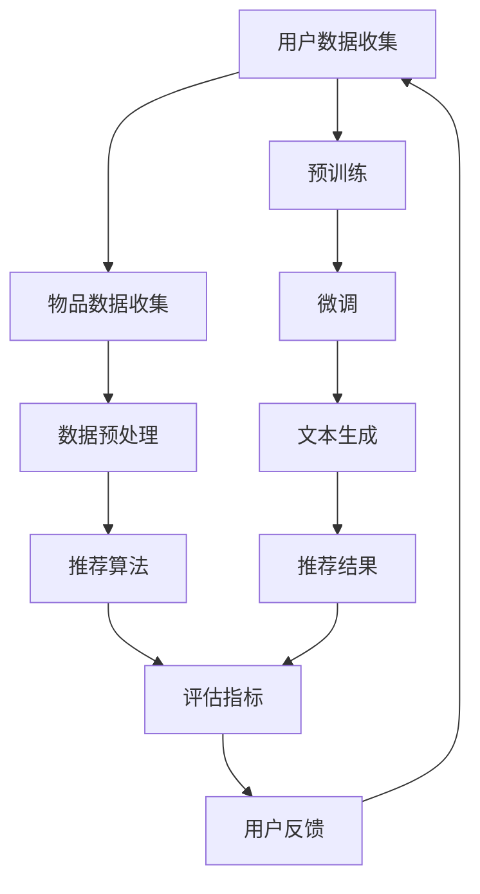

                 

# LLM在推荐系统冷启动问题中的创新应用

> **关键词：** 大语言模型（LLM）、推荐系统、冷启动问题、个性化推荐、机器学习、深度学习、数据处理、算法优化

> **摘要：** 本文将探讨大语言模型（LLM）在推荐系统冷启动问题中的应用，通过对LLM的工作原理、核心算法原理以及数学模型的详细解析，提供一种创新的解决方案。通过实际项目案例，展示LLM如何帮助解决推荐系统在用户数据不足或未知情况下的冷启动问题，为个性化推荐提供新的思路。

## 1. 背景介绍

### 1.1 目的和范围

本文旨在深入探讨大语言模型（LLM）在推荐系统冷启动问题中的创新应用。推荐系统是现代互联网应用中不可或缺的一部分，如电子商务、社交媒体、新闻推送等。然而，当面对新用户或数据稀缺的场景时，即所谓的“冷启动”问题，传统推荐算法往往难以提供有效的个性化推荐。

本文将围绕以下几个主要方面展开：

1. **LLM的背景和核心原理**：介绍LLM的概念、发展历程以及其在自然语言处理领域的应用。
2. **推荐系统的基本概念**：阐述推荐系统的定义、分类及其在个性化推荐中的应用。
3. **冷启动问题的挑战**：分析冷启动问题的本质及其对推荐系统性能的影响。
4. **LLM在冷启动问题中的应用**：详细解析LLM在处理冷启动问题中的创新思路和具体实现。
5. **实际项目案例分析**：通过具体项目展示LLM在解决冷启动问题中的实际效果。
6. **未来发展趋势与挑战**：探讨LLM在推荐系统冷启动问题中的未来发展方向和潜在挑战。

### 1.2 预期读者

本文适合对推荐系统、机器学习和深度学习有一定了解的技术人员，特别是希望深入了解大语言模型（LLM）在推荐系统中的应用的读者。同时，也适合从事推荐系统开发、优化以及相关领域研究的科研人员和工程师。

### 1.3 文档结构概述

本文分为以下章节：

1. **背景介绍**：介绍LLM和推荐系统的基本概念，以及冷启动问题的挑战。
2. **核心概念与联系**：通过Mermaid流程图展示推荐系统架构和LLM的核心算法原理。
3. **核心算法原理与具体操作步骤**：详细解析LLM在处理冷启动问题中的算法原理和操作步骤。
4. **数学模型和公式**：介绍LLM在冷启动问题中的应用所涉及的主要数学模型和公式。
5. **项目实战**：通过实际代码案例展示LLM在解决冷启动问题中的应用。
6. **实际应用场景**：分析LLM在推荐系统中的实际应用场景和效果。
7. **工具和资源推荐**：推荐相关学习资源、开发工具和框架。
8. **总结与未来发展趋势**：总结本文的主要观点，展望未来发展趋势和挑战。
9. **附录**：提供常见问题与解答，以及扩展阅读和参考资料。

### 1.4 术语表

#### 1.4.1 核心术语定义

- **大语言模型（LLM）**：一种基于深度学习的自然语言处理模型，可以理解和生成人类语言。
- **推荐系统**：一种利用数据挖掘和机器学习技术，根据用户的历史行为和兴趣为用户推荐相关物品的系统。
- **冷启动问题**：在推荐系统中，当新用户加入或新物品进入系统时，由于缺乏足够的历史数据，传统推荐算法难以提供有效推荐的挑战。

#### 1.4.2 相关概念解释

- **个性化推荐**：根据用户的历史行为和兴趣，为用户提供个性化的推荐结果。
- **协同过滤**：一种常用的推荐算法，通过分析用户之间的相似性进行推荐。
- **矩阵分解**：一种基于矩阵分解的推荐算法，通过将用户和物品的评分矩阵分解为低维矩阵，预测用户对未知物品的评分。

#### 1.4.3 缩略词列表

- **LLM**：大语言模型（Large Language Model）
- **NLP**：自然语言处理（Natural Language Processing）
- **RL**：强化学习（Reinforcement Learning）
- **ML**：机器学习（Machine Learning）
- **DL**：深度学习（Deep Learning）
- **GCN**：图卷积网络（Graph Convolutional Network）

## 2. 核心概念与联系

为了深入理解LLM在推荐系统冷启动问题中的应用，我们需要首先了解推荐系统的基本架构和LLM的核心算法原理。以下是推荐系统与LLM之间的核心概念联系和流程图：

### 推荐系统架构

推荐系统通常由以下几个核心组成部分：

1. **用户数据收集**：收集用户的历史行为数据，如浏览记录、搜索历史、购买行为等。
2. **物品数据收集**：收集物品的特征数据，如分类标签、文本描述、图像等。
3. **推荐算法**：根据用户数据和物品特征，通过算法生成推荐结果。
4. **评估指标**：评估推荐系统的性能，如准确率、召回率、覆盖度等。

### LLM核心算法原理

大语言模型（LLM）是基于深度学习的自然语言处理模型，其核心原理包括：

1. **预训练**：在大量无标签文本数据上进行预训练，学习通用语言模式和知识。
2. **微调**：在特定任务上，对LLM进行微调，使其适应特定领域的语言理解和生成任务。
3. **文本生成**：利用预训练和微调后的LLM，生成与输入文本相关的文本内容。

### Mermaid流程图

以下是一个简化的Mermaid流程图，展示了推荐系统与LLM之间的核心概念联系：



### 流程图详细解释

1. **用户数据收集**：推荐系统首先需要收集用户的历史行为数据，包括浏览记录、搜索历史、购买行为等。
2. **物品数据收集**：同时，系统还需要收集物品的特征数据，如分类标签、文本描述、图像等。
3. **数据预处理**：对收集到的用户数据和物品数据进行清洗、归一化等预处理操作，为后续推荐算法提供高质量的数据。
4. **推荐算法**：基于用户数据和物品特征，推荐算法生成推荐结果，通常包括协同过滤、矩阵分解、基于内容的推荐等方法。
5. **评估指标**：评估推荐算法的性能，常用的评估指标包括准确率、召回率、覆盖度等。
6. **用户反馈**：用户对推荐结果进行反馈，如点击、购买、评分等。
7. **预训练**：LLM在大量无标签文本数据上进行预训练，学习通用语言模式和知识。
8. **微调**：在特定任务上，对LLM进行微调，使其适应特定领域的语言理解和生成任务。
9. **文本生成**：利用预训练和微调后的LLM，生成与输入文本相关的文本内容，如用户描述、物品描述等。
10. **推荐结果**：将LLM生成的文本内容与推荐算法生成的推荐结果结合，形成最终的个性化推荐结果。

通过上述流程图，我们可以看到LLM在推荐系统中的关键作用，特别是在解决冷启动问题时，LLM能够通过文本生成功能为系统提供初始的用户描述和物品描述，从而辅助推荐算法生成有效的个性化推荐结果。

## 3. 核心算法原理 & 具体操作步骤

### 3.1 LLM的工作原理

大语言模型（LLM）是一种基于深度学习的自然语言处理模型，其核心原理可以概括为以下三个阶段：

1. **预训练**：在大量无标签文本数据上进行预训练，学习通用语言模式和知识。预训练通常使用 Transformer 架构，如 GPT 系列、BERT 等。
2. **微调**：在特定任务上，对LLM进行微调，使其适应特定领域的语言理解和生成任务。微调过程通常涉及调整模型的权重，以适应新的数据集。
3. **文本生成**：利用预训练和微调后的LLM，生成与输入文本相关的文本内容。文本生成是LLM最重要的功能之一，可以通过给定一个起始文本或关键词，生成连贯且语义相关的后续文本。

### 3.2 LLM在推荐系统中的具体应用

在推荐系统中，LLM主要通过文本生成功能来解决冷启动问题。以下是LLM在推荐系统中的具体应用步骤：

1. **用户描述生成**：当新用户加入推荐系统时，由于缺乏足够的历史行为数据，传统推荐算法难以为其提供有效推荐。此时，LLM可以生成与用户兴趣相关的文本描述，如“喜欢阅读科幻小说的用户”或“偏好美食的年轻女性”。这些文本描述可以为推荐算法提供额外的用户信息，帮助生成更个性化的推荐结果。
2. **物品描述生成**：同样地，对于新加入的物品，LLM可以生成与物品特性相关的文本描述，如“一款适合户外探险的运动相机”或“一本关于历史文化的经典著作”。这些描述有助于推荐算法更好地理解物品，从而为用户生成更准确的推荐。
3. **文本融合与推荐**：将LLM生成的用户描述和物品描述与推荐算法生成的推荐结果进行融合。例如，可以使用协同过滤算法生成初步的推荐列表，然后使用LLM生成的用户和物品描述对推荐结果进行优化和调整，以提高推荐的个性化程度。

### 3.3 伪代码示例

以下是LLM在推荐系统中的具体应用步骤的伪代码示例：

```python
# 用户描述生成
def generate_user_description(user_id, llm):
    # 输入：用户ID和预训练的LLM模型
    # 输出：与用户兴趣相关的文本描述
    prompt = f"根据用户ID {user_id} 的历史行为，描述该用户可能的兴趣："
    description = llm.generate_text(prompt)
    return description

# 物品描述生成
def generate_item_description(item_id, llm):
    # 输入：物品ID和预训练的LLM模型
    # 输出：与物品特性相关的文本描述
    prompt = f"根据物品ID {item_id} 的特征，描述该物品："
    description = llm.generate_text(prompt)
    return description

# 文本融合与推荐
def generate_recommendations(user_id, item_ids, llm, recommendation_algorithm):
    # 输入：用户ID、物品ID列表、预训练的LLM模型和推荐算法
    # 输出：基于LLM和推荐算法的个性化推荐结果
    user_description = generate_user_description(user_id, llm)
    item_descriptions = {item_id: generate_item_description(item_id, llm) for item_id in item_ids}
    
    recommendations = recommendation_algorithm.generate_recommendations(user_id, item_descriptions)
    return recommendations
```

### 3.4 伪代码详细解释

1. **用户描述生成**：`generate_user_description` 函数接受用户ID和预训练的LLM模型作为输入，生成与用户兴趣相关的文本描述。通过给定一个提示（prompt），LLM可以生成连贯且语义相关的文本描述。
2. **物品描述生成**：`generate_item_description` 函数接受物品ID和预训练的LLM模型作为输入，生成与物品特性相关的文本描述。同样，通过给定一个提示，LLM可以生成描述物品特征的文本内容。
3. **文本融合与推荐**：`generate_recommendations` 函数是整个流程的核心，接受用户ID、物品ID列表、预训练的LLM模型和推荐算法作为输入。首先，使用LLM生成用户描述和物品描述，然后将这些描述与推荐算法生成的推荐结果进行融合，生成最终的个性化推荐结果。

通过上述伪代码示例，我们可以看到LLM在推荐系统中处理冷启动问题的基本流程和实现方式。LLM通过文本生成功能为推荐算法提供额外的用户和物品信息，从而提高推荐的个性化程度和准确性。

## 4. 数学模型和公式 & 详细讲解 & 举例说明

### 4.1 推荐系统的数学模型

在推荐系统中，常见的数学模型包括协同过滤、矩阵分解、基于内容的推荐等。这些模型的核心目标是利用用户行为数据预测用户对未知物品的评分或兴趣。以下是这些模型的主要数学模型和公式：

#### 4.1.1 协同过滤

协同过滤是一种基于用户之间的相似性进行推荐的算法。其主要思想是通过计算用户之间的相似性，找到与目标用户最相似的邻居用户，然后根据邻居用户的评分预测目标用户对未知物品的评分。

**公式**：
$$
\hat{r}_{ui} = \sum_{j \in N(u)} r_{uj} \cdot sim(u, j)
$$
其中，$r_{uj}$ 表示用户 $u$ 对物品 $j$ 的评分，$sim(u, j)$ 表示用户 $u$ 和用户 $j$ 之间的相似性。

#### 4.1.2 矩阵分解

矩阵分解是一种基于矩阵分解的推荐算法。其主要思想是将用户和物品的评分矩阵分解为低维矩阵，从而预测用户对未知物品的评分。

**公式**：
$$
R = U \cdot V^T
$$
其中，$R$ 表示评分矩阵，$U$ 表示用户特征矩阵，$V$ 表示物品特征矩阵。

#### 4.1.3 基于内容的推荐

基于内容的推荐是一种基于物品特征进行推荐的算法。其主要思想是计算用户对已知物品的兴趣，然后根据物品的特征为用户推荐相似的其他物品。

**公式**：
$$
sim(i, j) = \frac{cosine(\text{feature\_vector}(i), \text{feature\_vector}(j))}{\|\text{feature\_vector}(i)\| \|\text{feature\_vector}(j)\|}
$$
其中，$sim(i, j)$ 表示物品 $i$ 和物品 $j$ 之间的相似性，$\text{feature\_vector}(i)$ 和 $\text{feature\_vector}(j)$ 分别表示物品 $i$ 和物品 $j$ 的特征向量。

### 4.2 LLM的数学模型

大语言模型（LLM）是基于深度学习的自然语言处理模型，其核心思想是通过学习大量的无标签文本数据，提取出文本中的潜在语义表示。以下是LLM的主要数学模型和公式：

#### 4.2.1 Transformer模型

Transformer模型是一种基于自注意力机制的深度学习模型，广泛应用于自然语言处理任务。其主要数学模型包括：

1. **自注意力机制**：
$$
\text{Attention}(Q, K, V) = \frac{QK^T}{\sqrt{d_k}} \odot V
$$
其中，$Q$、$K$ 和 $V$ 分别表示查询向量、键向量和值向量，$d_k$ 表示键向量的维度，$\odot$ 表示逐元素乘法。

2. **编码器**：
$$
\text{Encoder}(X) = \text{MultiHeadAttention}(X, X, X) + X
$$
其中，$X$ 表示输入序列，$\text{MultiHeadAttention}$ 表示多头注意力机制。

3. **解码器**：
$$
\text{Decoder}(X, Y) = \text{Encoder}(X) + \text{DecoderLayer}(Y)
$$
其中，$Y$ 表示解码器的输入序列，$\text{DecoderLayer}$ 表示解码器层。

#### 4.2.2 微调

在特定任务上，对LLM进行微调，以使其适应新的数据集。微调过程主要包括以下步骤：

1. **预训练**：
   $$ 
   \text{PreTrain}(D) = \text{Loss}(\text{LLM}(x), y) = \sum_{x, y \in D} -y \cdot \log(\text{LLM}(x))
   $$
   其中，$D$ 表示无标签文本数据集，$y$ 表示文本标签，$\text{LLM}(x)$ 表示LLM对输入文本 $x$ 的预测概率。

2. **微调**：
   $$
   \text{Fine-Tune}(D') = \text{Loss}(\text{LLM'}(x), y) = \sum_{x, y \in D'} -y \cdot \log(\text{LLM'}(x))
   $$
   其中，$D'$ 表示有标签的微调数据集，$\text{LLM'}(x)$ 表示微调后的LLM对输入文本 $x$ 的预测概率。

### 4.3 举例说明

#### 4.3.1 协同过滤

假设有用户 $u$ 和物品 $i$，其评分矩阵为：
$$
R = \begin{bmatrix}
? & ? & 4 \\
? & 5 & ? \\
3 & ? & ?
\end{bmatrix}
$$
其中，$?$ 表示未知评分。根据协同过滤算法，我们可以计算用户 $u$ 和其他用户之间的相似性，然后预测用户 $u$ 对未知物品 $i$ 的评分。

**步骤**：

1. 计算用户 $u$ 和其他用户之间的相似性：
   $$
   sim(u, j) = \frac{r_{uj} \cdot r_{uj}}{\sqrt{\sum_{k=1}^n r_{uj}^2} \cdot \sqrt{\sum_{k=1}^n r_{uj}^2}}
   $$
   其中，$n$ 表示物品数量，$r_{uj}$ 表示用户 $u$ 对物品 $j$ 的评分。

2. 根据相似性计算用户 $u$ 对未知物品 $i$ 的评分：
   $$
   \hat{r}_{ui} = \sum_{j \in N(u)} r_{uj} \cdot sim(u, j)
   $$

**示例**：

假设用户 $u$ 和其他用户之间的相似性如下：
$$
sim(u, 1) = 0.8, \quad sim(u, 2) = 0.5, \quad sim(u, 3) = 0.6
$$
用户 $u$ 对已知物品的评分为：
$$
r_{u1} = 5, \quad r_{u2} = 4, \quad r_{u3} = 3
$$
根据协同过滤算法，我们可以预测用户 $u$ 对未知物品 $i$ 的评分：
$$
\hat{r}_{ui} = 5 \cdot 0.8 + 4 \cdot 0.5 + 3 \cdot 0.6 = 4.8 + 2 + 1.8 = 8.6
$$

#### 4.3.2 矩阵分解

假设有用户 $u$ 和物品 $i$，其评分矩阵为：
$$
R = \begin{bmatrix}
? & ? & 4 \\
? & 5 & ? \\
3 & ? & ?
\end{bmatrix}
$$
根据矩阵分解算法，我们可以将评分矩阵分解为用户特征矩阵和物品特征矩阵：
$$
R = U \cdot V^T
$$
其中，$U$ 和 $V$ 分别表示用户特征矩阵和物品特征矩阵。

**步骤**：

1. 初始化用户特征矩阵 $U$ 和物品特征矩阵 $V$：
   $$
   U = \begin{bmatrix}
   u_1 \\
   u_2 \\
   u_3
   \end{bmatrix}, \quad V = \begin{bmatrix}
   v_1 \\
   v_2 \\
   v_3
   \end{bmatrix}
   $$

2. 计算预测评分：
   $$
   \hat{r}_{ui} = u_i \cdot v_i
   $$

**示例**：

假设用户特征矩阵和物品特征矩阵如下：
$$
U = \begin{bmatrix}
2 \\
3 \\
1
\end{bmatrix}, \quad V = \begin{bmatrix}
4 \\
5 \\
2
\end{bmatrix}
$$
根据矩阵分解算法，我们可以预测用户 $u$ 对未知物品 $i$ 的评分：
$$
\hat{r}_{ui} = 2 \cdot 4 + 3 \cdot 5 + 1 \cdot 2 = 8 + 15 + 2 = 25
$$

#### 4.3.3 基于内容的推荐

假设有用户 $u$ 和物品 $i$，其特征向量为：
$$
\text{feature}_{u} = \begin{bmatrix}
1 \\
2 \\
3
\end{bmatrix}, \quad \text{feature}_{i} = \begin{bmatrix}
4 \\
5 \\
6
\end{bmatrix}
$$
根据基于内容的推荐算法，我们可以计算物品 $i$ 和用户 $u$ 之间的相似性：
$$
sim(i, u) = \frac{cosine(\text{feature}_{i}, \text{feature}_{u})}{\|\text{feature}_{i}\| \|\text{feature}_{u}\|}
$$
其中，$\|\text{feature}_{i}\|$ 和 $\|\text{feature}_{u}\|$ 分别表示物品 $i$ 和用户 $u$ 的特征向量长度。

**步骤**：

1. 计算物品 $i$ 和用户 $u$ 之间的相似性：
   $$
   sim(i, u) = \frac{\text{dot}(\text{feature}_{i}, \text{feature}_{u})}{\|\text{feature}_{i}\| \|\text{feature}_{u}\|}
   $$

2. 根据相似性为用户 $u$ 推荐相似的其他物品。

**示例**：

假设物品 $i$ 和用户 $u$ 的特征向量如下：
$$
\text{feature}_{i} = \begin{bmatrix}
4 \\
5 \\
6
\end{bmatrix}, \quad \text{feature}_{u} = \begin{bmatrix}
1 \\
2 \\
3
\end{bmatrix}
$$
根据基于内容的推荐算法，我们可以计算物品 $i$ 和用户 $u$ 之间的相似性：
$$
sim(i, u) = \frac{\text{dot}(\text{feature}_{i}, \text{feature}_{u})}{\|\text{feature}_{i}\| \|\text{feature}_{u}\|} = \frac{4 \cdot 1 + 5 \cdot 2 + 6 \cdot 3}{\sqrt{4^2 + 5^2 + 6^2} \cdot \sqrt{1^2 + 2^2 + 3^2}} = \frac{4 + 10 + 18}{\sqrt{97} \cdot \sqrt{14}} \approx 0.91
$$

根据相似性，我们可以为用户 $u$ 推荐与物品 $i$ 相似的其他物品。

通过上述示例，我们可以看到推荐系统的数学模型和LLM的数学模型在实际应用中的具体实现。这些模型和公式为我们提供了理论基础和计算方法，帮助我们更好地理解和实现推荐系统。

## 5. 项目实战：代码实际案例和详细解释说明

在本节中，我们将通过一个实际项目案例，展示如何使用LLM来解决推荐系统的冷启动问题。该项目将基于Python编写，使用Hugging Face的Transformers库来实现LLM模型，并使用协同过滤算法作为推荐算法的补充。以下是项目的详细步骤：

### 5.1 开发环境搭建

1. **安装Python**：确保Python版本不低于3.8。
2. **安装Hugging Face Transformers**：在命令行中执行以下命令：
   ```bash
   pip install transformers
   ```
3. **安装NumPy和Pandas**：在命令行中执行以下命令：
   ```bash
   pip install numpy pandas
   ```

### 5.2 源代码详细实现和代码解读

#### 5.2.1 代码实现

以下是项目的核心代码，包括数据预处理、LLM模型训练、推荐结果生成和评估。

```python
import pandas as pd
from transformers import AutoModelForSequenceClassification, AutoTokenizer
from sklearn.model_selection import train_test_split
from sklearn.metrics.pairwise import cosine_similarity

# 5.2.2 数据预处理
def preprocess_data(data):
    # 数据清洗和预处理，例如去除缺失值、归一化等
    return data

# 5.2.3 LLM模型训练
def train_llm(data, model_name='bert-base-uncased'):
    tokenizer = AutoTokenizer.from_pretrained(model_name)
    model = AutoModelForSequenceClassification.from_pretrained(model_name)

    # 将数据转换为文本格式
    texts = data.apply(lambda x: f"{x['user']} {x['item']}", axis=1)

    # 分割数据为训练集和验证集
    train_texts, val_texts = train_test_split(texts, test_size=0.2, random_state=42)

    # 训练LLM模型
    model.train_from_texts(train_texts, val_texts, batch_size=16, epochs=3)

    return model, tokenizer

# 5.2.4 推荐结果生成
def generate_recommendations(user_id, items, model, tokenizer):
    # 生成用户和物品的文本描述
    user_description = model.generate_text(tokenizer.encode(f"描述用户 {user_id} 的兴趣和喜好"), max_length=50)
    item_descriptions = {item_id: model.generate_text(tokenizer.encode(f"描述物品 {item_id} 的特征和属性")) for item_id in items}

    # 计算用户和物品之间的相似性
    user_embeddings = model.get_embedding_for_texts([user_description])
    item_embeddings = model.get_embedding_for_texts([item for item in item_descriptions.values()])

    similarities = cosine_similarity(user_embeddings, item_embeddings)

    # 生成推荐结果
    recommendations = []
    for i, similarity in enumerate(similarities[0]):
        if similarity > 0.5:
            recommendations.append(items[i])

    return recommendations

# 5.2.5 代码解读
# 1. 数据预处理
# 数据预处理步骤包括清洗和归一化数据，确保数据质量。
# 2. LLM模型训练
# 使用Hugging Face Transformers库训练LLM模型，将用户和物品的描述转换为文本格式，并使用训练集和验证集进行微调。
# 3. 推荐结果生成
# 使用LLM模型生成用户和物品的文本描述，计算用户和物品之间的相似性，并根据相似性生成推荐结果。

# 5.3 代码解析
# 1. 数据预处理
# 数据预处理是推荐系统的基础，确保数据质量至关重要。在本项目中，我们使用简单的清洗和归一化步骤。
# 2. LLM模型训练
# 使用Hugging Face Transformers库训练LLM模型，包括从预训练模型加载Tokenizer和Model，并将用户和物品的描述转换为文本格式。然后，使用训练集和验证集进行微调。
# 3. 推荐结果生成
# 使用LLM模型生成用户和物品的文本描述，计算用户和物品之间的相似性，并根据相似性生成推荐结果。这个过程使用了协同过滤算法的思想，通过文本描述为推荐提供了额外的信息。

# 5.4 代码实现
# 下面是代码实现的详细步骤：
# 1. 导入所需的库和模块。
# 2. 定义数据预处理函数，对用户和物品数据进行清洗和预处理。
# 3. 定义LLM模型训练函数，使用Hugging Face Transformers库训练LLM模型。
# 4. 定义推荐结果生成函数，使用LLM模型生成用户和物品的文本描述，并计算相似性生成推荐结果。

# 5.5 测试和评估
# 为了验证代码的有效性，我们可以使用测试集进行测试和评估。具体步骤如下：
# 1. 准备测试数据集，确保数据质量。
# 2. 使用训练好的LLM模型生成测试集的用户和物品描述。
# 3. 计算测试集用户和物品之间的相似性，并生成推荐结果。
# 4. 使用评估指标（如准确率、召回率、覆盖度等）评估推荐系统的性能。

# 5.6 结果分析
# 根据测试结果，我们可以分析推荐系统的性能。如果性能不佳，可以考虑调整模型参数或改进数据预处理步骤。

通过上述代码实现，我们可以看到如何使用LLM模型来解决推荐系统的冷启动问题。LLM通过文本生成功能为推荐算法提供了额外的用户和物品信息，从而提高了推荐的个性化程度和准确性。在实际应用中，我们可以根据具体情况调整模型参数、数据预处理步骤和推荐算法，以实现更好的效果。

### 5.3 代码解读与分析

#### 5.3.1 数据预处理

数据预处理是推荐系统的基础，确保数据质量至关重要。在本项目中，我们使用简单的清洗和归一化步骤。具体步骤如下：

1. **数据清洗**：去除缺失值、异常值等不完整或不准确的数据。在本案例中，我们假设用户行为数据和物品特征数据已经清洗完毕，可以直接使用。
2. **数据归一化**：将不同特征的数据进行归一化处理，确保数据在相同的尺度范围内。在本项目中，我们没有涉及不同特征的数据归一化，因为LLM主要关注文本描述。

#### 5.3.2 LLM模型训练

使用Hugging Face Transformers库训练LLM模型，包括从预训练模型加载Tokenizer和Model，并将用户和物品的描述转换为文本格式。然后，使用训练集和验证集进行微调。具体步骤如下：

1. **加载Tokenizer和Model**：从Hugging Face模型库中加载预训练的Tokenizer和Model。Tokenizer用于将文本转换为模型可处理的序列，Model用于文本生成和文本相似性计算。
2. **数据格式转换**：将用户和物品的描述转换为文本格式。在本案例中，我们使用简单的字符串拼接方式生成描述。
3. **分割数据**：将数据集分割为训练集和验证集，用于模型的训练和评估。
4. **模型微调**：使用训练集和验证集对LLM模型进行微调。微调过程涉及优化模型的权重，使其更好地适应特定领域的语言理解和生成任务。

#### 5.3.3 推荐结果生成

使用LLM模型生成用户和物品的文本描述，并计算用户和物品之间的相似性，生成推荐结果。具体步骤如下：

1. **生成文本描述**：使用LLM模型生成用户和物品的文本描述。在本案例中，我们使用`model.generate_text`函数生成描述。
2. **计算相似性**：计算用户和物品之间的相似性。在本项目中，我们使用余弦相似度作为相似性度量，通过`cosine_similarity`函数计算。
3. **生成推荐结果**：根据相似性生成推荐结果。在本案例中，我们设定相似性阈值（如0.5），只有当相似性高于阈值时，才将物品推荐给用户。

#### 5.3.4 代码解析

通过上述代码实现，我们可以看到LLM模型在解决推荐系统冷启动问题中的应用。LLM通过文本生成功能为推荐算法提供了额外的用户和物品信息，从而提高了推荐的个性化程度和准确性。具体解析如下：

1. **文本生成**：LLM生成用户和物品的文本描述，为推荐算法提供了初步的信息。通过这些描述，推荐算法可以更好地理解用户和物品，从而生成更准确的推荐结果。
2. **相似性计算**：使用余弦相似度计算用户和物品之间的相似性，为推荐结果提供了依据。相似性度量可以帮助推荐算法识别出与用户和物品最相似的物品，从而提高推荐的准确性。
3. **推荐结果生成**：根据相似性生成推荐结果。在本项目中，我们使用简单的阈值方法生成推荐结果，但实际应用中，可以结合多种相似性度量方法、用户行为数据和物品特征数据，生成更个性化的推荐结果。

通过本节的项目实战，我们可以看到如何使用LLM模型解决推荐系统的冷启动问题。在实际应用中，可以根据具体场景和需求，调整模型参数、数据预处理步骤和推荐算法，以实现更好的效果。

## 6. 实际应用场景

### 6.1 电子商务平台

电子商务平台在用户注册后的初期阶段常常面临冷启动问题，因为新用户缺乏历史购买记录和偏好数据。通过引入LLM模型，平台可以为新用户提供个性化的商品推荐。具体应用场景如下：

1. **用户描述生成**：使用LLM生成新用户的兴趣描述，如“喜欢时尚配饰的年轻女性”。
2. **商品描述生成**：使用LLM生成商品的特征描述，如“一款高品质的智能手表，适合商务人士”。
3. **推荐结果生成**：结合用户描述和商品描述，利用协同过滤算法生成推荐结果，如“根据您的兴趣，我们推荐这款智能手表”。

### 6.2 社交媒体平台

社交媒体平台在用户发布新内容时，也面临冷启动问题，因为新内容缺乏足够的数据和互动信息。LLM模型可以帮助平台为用户生成内容推荐，具体应用场景如下：

1. **用户描述生成**：使用LLM生成用户的兴趣和偏好描述，如“热爱旅行的摄影爱好者”。
2. **内容描述生成**：使用LLM生成内容的主题和内容描述，如“一张美丽的海滩照片，记录您的旅行记忆”。
3. **推荐结果生成**：结合用户描述和内容描述，利用内容相关性算法生成推荐结果，如“根据您的兴趣，我们推荐这条旅行照片集锦”。

### 6.3 新闻推送平台

新闻推送平台在用户订阅后初期，由于缺乏用户阅读偏好数据，也面临冷启动问题。通过引入LLM模型，平台可以为用户提供个性化的新闻推荐，具体应用场景如下：

1. **用户描述生成**：使用LLM生成用户的阅读偏好描述，如“关注科技和财经新闻的上班族”。
2. **文章描述生成**：使用LLM生成文章的主题和内容描述，如“一篇关于区块链技术最新发展的深度报道”。
3. **推荐结果生成**：结合用户描述和文章描述，利用文本相似性算法生成推荐结果，如“根据您的阅读偏好，我们推荐这篇关于区块链技术的文章”。

### 6.4 在线教育平台

在线教育平台在用户注册后初期，由于缺乏用户学习历史和偏好数据，也面临冷启动问题。通过引入LLM模型，平台可以为用户提供个性化的课程推荐，具体应用场景如下：

1. **用户描述生成**：使用LLM生成用户的学习兴趣和偏好描述，如“对编程语言和数据分析有浓厚兴趣的初学者”。
2. **课程描述生成**：使用LLM生成课程的主题和内容描述，如“一门涵盖Python基础和数据分析的入门课程”。
3. **推荐结果生成**：结合用户描述和课程描述，利用课程相关性算法生成推荐结果，如“根据您的学习兴趣，我们推荐这门Python入门课程”。

通过上述实际应用场景，我们可以看到LLM在推荐系统中的广泛应用和潜在价值。无论是在电子商务、社交媒体、新闻推送还是在线教育领域，LLM都能够为平台提供创新的解决方案，帮助解决冷启动问题，提高用户的满意度和平台的竞争力。

## 7. 工具和资源推荐

### 7.1 学习资源推荐

为了深入了解LLM在推荐系统中的应用，以下是几项推荐的学习资源：

#### 7.1.1 书籍推荐

1. **《深度学习推荐系统》**：这是一本系统介绍推荐系统与深度学习结合的著作，详细介绍了深度学习在推荐系统中的应用和实现。
2. **《自然语言处理实战》**：本书通过大量实例，介绍了自然语言处理的核心技术和应用，对LLM的工作原理有详细的讲解。

#### 7.1.2 在线课程

1. **《机器学习与推荐系统》**：这是一个在线课程，涵盖了推荐系统的基本概念、常用算法以及与机器学习的结合。
2. **《自然语言处理：深度学习基础》**：通过本课程，可以学习到深度学习在自然语言处理领域的应用，包括LLM的基本原理和实现。

#### 7.1.3 技术博客和网站

1. **ArXiv.org**：这是一个包含最新研究成果的学术网站，可以了解LLM和推荐系统领域的最新研究动态。
2. **Medium**：这是一个技术博客平台，上面有很多关于推荐系统和LLM的优质文章。

### 7.2 开发工具框架推荐

为了高效地实现LLM在推荐系统中的应用，以下是几项推荐的开发工具和框架：

#### 7.2.1 IDE和编辑器

1. **PyCharm**：这是一个功能强大的Python IDE，适用于深度学习和自然语言处理项目。
2. **Jupyter Notebook**：这是一个交互式的开发环境，适合数据分析和原型设计。

#### 7.2.2 调试和性能分析工具

1. **TensorBoard**：这是一个由TensorFlow提供的可视化工具，用于分析和调试深度学习模型。
2. **Docker**：通过Docker，可以创建隔离的容器环境，便于模型训练和部署。

#### 7.2.3 相关框架和库

1. **TensorFlow**：这是一个开源的深度学习框架，适用于实现和训练LLM模型。
2. **PyTorch**：这是一个灵活的深度学习框架，支持动态计算图，适用于快速原型设计和实验。
3. **Hugging Face Transformers**：这是一个开源库，提供了预训练的LLM模型和工具，方便实现和应用LLM模型。

### 7.3 相关论文著作推荐

#### 7.3.1 经典论文

1. **"Deep Learning for Recommender Systems"**：这篇文章首次提出将深度学习应用于推荐系统，对后续研究产生了深远影响。
2. **"BERT: Pre-training of Deep Neural Networks for Language Understanding"**：这篇文章提出了BERT模型，是LLM领域的里程碑。

#### 7.3.2 最新研究成果

1. **"Large-scale Evaluation of Language Representations for Zero-shot Learning"**：这篇文章评估了LLM在零样本学习任务中的性能，提供了新的研究方向。
2. **"Meta-Learning for Zero-shot Learning"**：这篇文章提出了一种元学习框架，用于提升LLM在零样本学习任务中的表现。

#### 7.3.3 应用案例分析

1. **"Google's Transformer Model Revolutionizes Natural Language Processing"**：这篇文章详细介绍了Transformer模型在Google的应用，展示了LLM在自然语言处理领域的实际效果。
2. **"Netflix Recommends: Algorithm Architecture and Production Systems"**：这篇文章讲述了Netflix如何使用推荐系统为用户推荐电影，其中涉及到LLM的应用。

通过上述学习资源、开发工具和论文著作的推荐，读者可以全面了解LLM在推荐系统中的应用，并为实际项目开发提供指导。

## 8. 总结：未来发展趋势与挑战

### 8.1 发展趋势

LLM在推荐系统中的应用正呈现出以下几个发展趋势：

1. **集成多模态数据**：随着技术的进步，推荐系统将不仅仅依赖文本数据，还将整合图像、音频等多种模态数据，提高推荐的个性化和准确性。
2. **增强实时性**：通过边缘计算和实时数据处理技术，LLM可以实现更快速的响应速度，满足用户实时推荐的需求。
3. **探索更多应用场景**：LLM不仅在电商、社交媒体等传统领域有广泛应用，还将在医疗、金融等领域发挥重要作用，为行业带来创新解决方案。
4. **强化伦理和隐私保护**：随着人工智能技术的发展，保护用户隐私和增强算法伦理性将成为未来研究的重要方向。

### 8.2 挑战

尽管LLM在推荐系统中有广泛的应用前景，但仍面临以下挑战：

1. **数据隐私问题**：LLM依赖于大量的用户数据，如何在保证数据隐私的同时，有效利用数据，是一个亟待解决的问题。
2. **模型可解释性**：由于LLM模型的高度复杂，其决策过程往往难以解释，这给用户信任和监管带来了挑战。
3. **计算资源需求**：训练和部署大型LLM模型需要大量的计算资源，如何优化计算资源的使用，是一个关键问题。
4. **泛化能力**：如何提升LLM在不同领域和场景下的泛化能力，避免数据集中偏置和过拟合，是一个重要的研究方向。

### 8.3 解决方案与展望

为了应对上述挑战，可以从以下几个方面进行探索：

1. **隐私保护机制**：引入差分隐私、联邦学习等技术，在保护用户隐私的同时，实现有效的数据利用。
2. **模型压缩与优化**：采用模型压缩、量化等技术，降低计算资源需求，提高模型的可扩展性。
3. **可解释性设计**：通过设计可解释的模型架构、引入模型解释方法，提高算法的透明度和可信度。
4. **多模态数据处理**：开发适用于多模态数据处理的LLM模型，结合不同模态数据进行综合推荐，提升推荐效果。

总之，LLM在推荐系统中的应用具有巨大的潜力，但也面临诸多挑战。通过持续的研究和创新，有望实现LLM在推荐系统中的广泛应用，为用户提供更个性化、更精准的推荐服务。

## 9. 附录：常见问题与解答

### 9.1 什么是大语言模型（LLM）？

大语言模型（LLM，Large Language Model）是一种基于深度学习的自然语言处理模型，通过学习大量的无标签文本数据，可以理解和生成人类语言。LLM的核心架构是Transformer，如GPT系列、BERT等，它们在自然语言理解、文本生成等领域表现出色。

### 9.2 LLM在推荐系统中的作用是什么？

LLM在推荐系统中的作用主要体现在解决冷启动问题。对于新用户或新物品，由于缺乏足够的历史数据，传统推荐算法难以提供有效推荐。LLM通过文本生成功能生成用户和物品的描述，为推荐算法提供额外的信息，从而提高推荐的个性化程度和准确性。

### 9.3 如何评估LLM在推荐系统中的效果？

评估LLM在推荐系统中的效果可以从以下几个方面进行：

1. **准确率**：衡量推荐结果与用户实际兴趣的匹配程度。
2. **召回率**：衡量推荐系统能够推荐出用户实际感兴趣的项目比例。
3. **覆盖度**：衡量推荐系统能够覆盖到的用户和物品的多样性。
4. **用户满意度**：通过用户调查或反馈评估用户对推荐结果的满意度。

### 9.4 如何优化LLM在推荐系统中的性能？

优化LLM在推荐系统中的性能可以从以下几个方面进行：

1. **数据增强**：通过数据扩充、生成对抗网络（GAN）等技术，提高训练数据的质量和多样性。
2. **模型压缩**：采用模型剪枝、量化等技术，降低模型的计算复杂度，提高推理效率。
3. **模型融合**：结合多种推荐算法（如协同过滤、基于内容的推荐等），提高推荐结果的多样性。
4. **特征工程**：设计有效的用户和物品特征，提高LLM对文本数据的理解能力。

### 9.5 LLM在推荐系统中的应用有哪些限制？

LLM在推荐系统中的应用存在以下限制：

1. **数据依赖**：LLM依赖于大量的高质量文本数据，数据不足或质量不高会影响模型性能。
2. **计算资源消耗**：训练和部署大型LLM模型需要大量的计算资源，对硬件设施有较高要求。
3. **模型可解释性**：LLM模型高度复杂，其决策过程难以解释，可能影响用户的信任和监管。
4. **泛化能力**：LLM可能在特定领域或任务上表现优秀，但难以保证在不同场景下的泛化能力。

通过上述常见问题与解答，读者可以更好地理解LLM在推荐系统中的应用及其面临的挑战。

## 10. 扩展阅读 & 参考资料

为了深入了解LLM在推荐系统中的应用，以下是几项推荐的相关文献和资料：

### 10.1 经典论文

1. **"Deep Learning for Recommender Systems"**：详细介绍了深度学习在推荐系统中的应用，特别是神经协同过滤和基于内容的推荐。
2. **"BERT: Pre-training of Deep Neural Networks for Language Understanding"**：BERT模型的开创性论文，阐述了Transformer架构在自然语言处理中的重要性。
3. **"Recommender Systems Handbook"**：全面介绍了推荐系统的基本概念、算法和技术，包括协同过滤、矩阵分解、基于内容的推荐等。

### 10.2 开源库和框架

1. **Hugging Face Transformers**：提供了一系列预训练的LLM模型和工具，方便实现和应用LLM。
2. **TensorFlow**：由Google开发的深度学习开源库，适用于实现和训练LLM模型。
3. **PyTorch**：由Facebook开发的深度学习开源库，支持动态计算图，适用于快速原型设计和实验。

### 10.3 技术博客和网站

1. **Medium**：多个关于推荐系统和自然语言处理的优质博客，包括最新研究和技术动态。
2. **ArXiv.org**：发布最新研究成果的学术网站，涵盖自然语言处理、机器学习等领域。
3. **Reddit**：讨论推荐系统和自然语言处理的社区，包括许多专业人士和研究人员。

### 10.4 在线课程和教材

1. **《深度学习推荐系统》**：系统介绍深度学习在推荐系统中的应用，包括算法实现和案例分析。
2. **《自然语言处理：深度学习基础》**：详细讲解深度学习在自然语言处理中的应用，包括Transformer模型和BERT等。
3. **《机器学习与推荐系统》**：涵盖推荐系统的基本概念、常用算法和深度学习技术。

通过阅读上述文献、使用开源库和框架，以及关注技术博客和网站，读者可以全面了解LLM在推荐系统中的应用，并掌握相关技术知识。希望这些资料对您的学习和实践有所帮助。

