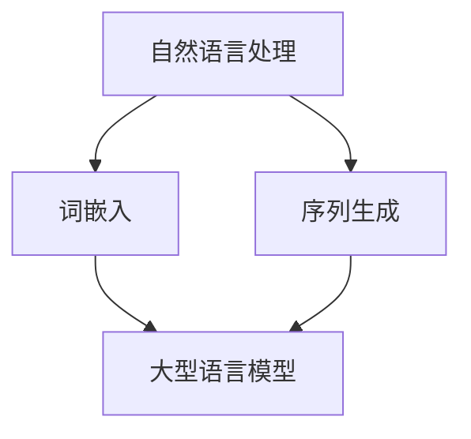

                 

# LLM在文学创作中的应用：AI作家的崛起

> **关键词：** 机器学习，自然语言处理，文学创作，大型语言模型，人工智能作家

> **摘要：** 本文将探讨大型语言模型（LLM）在文学创作中的应用，解析其技术原理与具体操作步骤，并通过实际案例展示AI作家的崛起。本文旨在为对文学创作与人工智能结合感兴趣的读者提供深入的技术分析与实用指南。

## 1. 背景介绍

### 1.1 目的和范围

本文旨在深入探讨大型语言模型（LLM）在文学创作中的应用，分析其在文学创作中的潜力与挑战，并展示如何通过这些模型实现人工智能创作。文章将从技术原理、操作步骤到实际应用案例进行全面阐述，旨在为读者提供系统性的了解。

### 1.2 预期读者

本文适合对文学创作和人工智能结合感兴趣的读者，包括但不限于文学爱好者、程序员、人工智能研究人员、以及想要了解AI创作潜力的专业人士。

### 1.3 文档结构概述

本文结构如下：

1. 背景介绍
2. 核心概念与联系
3. 核心算法原理 & 具体操作步骤
4. 数学模型和公式 & 详细讲解 & 举例说明
5. 项目实战：代码实际案例和详细解释说明
6. 实际应用场景
7. 工具和资源推荐
8. 总结：未来发展趋势与挑战
9. 附录：常见问题与解答
10. 扩展阅读 & 参考资料

### 1.4 术语表

#### 1.4.1 核心术语定义

- **大型语言模型（LLM）**：一种能够对自然语言进行理解和生成的高容量模型。
- **自然语言处理（NLP）**：计算机科学领域中的一个分支，主要关注如何让计算机理解和生成自然语言。
- **文学创作**：通过语言艺术手段，塑造形象反映社会生活。
- **人工智能作家**：利用人工智能技术进行文学创作的计算机程序。

#### 1.4.2 相关概念解释

- **词嵌入（Word Embedding）**：将词语映射到向量空间，以便于计算机处理。
- **序列生成（Sequence Generation）**：生成文本序列的过程，常见于语言模型。

#### 1.4.3 缩略词列表

- **LLM**：Large Language Model（大型语言模型）
- **NLP**：Natural Language Processing（自然语言处理）
- **AI**：Artificial Intelligence（人工智能）

## 2. 核心概念与联系

在探讨LLM在文学创作中的应用之前，有必要了解一些核心概念及其相互联系。以下是一个Mermaid流程图，展示了这些概念之间的关系。



### 2.1 自然语言处理

自然语言处理（NLP）是计算机科学的一个重要分支，致力于使计算机能够理解、生成和处理人类语言。NLP的应用场景广泛，包括语音识别、机器翻译、情感分析等。

### 2.2 词嵌入

词嵌入是将词语映射到高维向量空间的技术，使得计算机能够处理这些词语。词嵌入有助于捕捉词语之间的语义关系，从而提高语言模型的性能。

### 2.3 序列生成

序列生成是NLP中的一个重要任务，旨在根据给定的输入序列生成新的序列。在文学创作中，序列生成技术可以帮助AI生成连贯的文本。

### 2.4 大型语言模型

大型语言模型（LLM）是一种能够对自然语言进行理解和生成的模型。LLM通过学习大量的文本数据，能够生成高质量、连贯的文本，是文学创作中不可或缺的工具。

## 3. 核心算法原理 & 具体操作步骤

### 3.1 算法原理

大型语言模型（LLM）的核心原理是生成式模型，特别是基于变分自编码器（VAE）和生成对抗网络（GAN）的方法。以下是一种基于VAE的伪代码，用于生成文本序列。

```python
def generate_text_sequence(prompt, model, tokenizer, max_length=50):
    # 将提示文本编码为向量
    prompt_vector = tokenizer.encode(prompt)
    # 生成序列的初始向量
    z = model.sample_initial_vector()
    # 生成文本序列
    text_sequence = []
    for _ in range(max_length):
        # 将当前向量输入模型，获取下一个词的概率分布
        log_prob = model(z)
        # 从概率分布中采样下一个词的索引
        next_word_index = sample_from_distribution(log_prob)
        # 将词索引转换为实际词
        next_word = tokenizer.decode([next_word_index])
        # 将新词添加到序列中
        text_sequence.append(next_word)
        # 更新输入向量
        z = model(z, next_word_index)
    # 返回生成的文本序列
    return ' '.join(text_sequence)
```

### 3.2 操作步骤

以下是利用上述算法生成文本序列的具体步骤：

1. **准备数据集**：收集大量的文本数据，用于训练模型。
2. **训练模型**：使用训练数据集训练LLM模型，使其能够生成连贯的文本。
3. **编码提示文本**：将输入的提示文本编码为向量，准备用于生成序列。
4. **初始化向量**：从模型中采样一个初始向量。
5. **生成序列**：循环迭代，每次迭代都从模型中获取下一个词的概率分布，并根据概率分布采样下一个词。
6. **更新输入向量**：将新采样的词添加到输入序列，并更新输入向量。
7. **输出结果**：将生成的序列转换为人类可读的文本。

## 4. 数学模型和公式 & 详细讲解 & 举例说明

### 4.1 数学模型

大型语言模型（LLM）通常采用深度神经网络（DNN）或循环神经网络（RNN）作为基础模型。以下是LLM的数学模型，使用LaTeX格式展示。

```latex
\documentclass{article}
\usepackage{amsmath}
\begin{document}

\begin{equation}
\begin{split}
    p(y|x) &= \sigma(\text{softmax}(\text{W} \cdot \text{h})) \\
    \text{where} \quad \text{h} &= \text{sigmoid}(\text{W}^T \cdot \text{x}) \\
    \text{and} \quad \text{W} &= \text{weights}
\end{split}
\end{equation}

\end{document}
```

### 4.2 详细讲解

- **概率分布（p(y|x)）**：表示在给定输入x的情况下，输出y的概率分布。
- **softmax函数**：将神经网络的输出转换为概率分布。
- **权重矩阵（W）**：连接输入层和隐含层的权重矩阵。
- **sigmoid函数**：将输入映射到(0, 1)区间，用于激活函数。

### 4.3 举例说明

假设我们有一个输入向量x和一个权重矩阵W。以下是使用sigmoid和softmax函数的示例计算：

```python
import numpy as np

# 输入向量
x = np.array([1, 2, 3])
# 权重矩阵
W = np.array([[0.1, 0.2, 0.3], [0.4, 0.5, 0.6]])

# 计算sigmoid函数的输出
h = 1 / (1 + np.exp(-np.dot(W.T, x)))
# 计算softmax函数的输出
prob = np.exp(h) / np.sum(np.exp(h), axis=1)

print("Sigmoid output:", h)
print("Softmax output:", prob)
```

## 5. 项目实战：代码实际案例和详细解释说明

### 5.1 开发环境搭建

要实现LLM在文学创作中的应用，我们需要搭建一个开发环境。以下是一个简单的环境搭建步骤：

1. 安装Python（3.8及以上版本）。
2. 安装TensorFlow或PyTorch。
3. 下载并安装所需的依赖库，如GPT-2或GPT-3模型。
4. 配置一个GPU（如NVIDIA显卡），以便加速模型训练。

### 5.2 源代码详细实现和代码解读

以下是使用GPT-2模型生成文本的示例代码：

```python
import torch
from transformers import GPT2Tokenizer, GPT2LMHeadModel

# 配置设备
device = torch.device("cuda" if torch.cuda.is_available() else "cpu")

# 加载预训练模型和分词器
tokenizer = GPT2Tokenizer.from_pretrained("gpt2")
model = GPT2LMHeadModel.from_pretrained("gpt2").to(device)

# 设置提示文本
prompt = "我是AI作家，我写了一首诗："

# 生成文本
generated_text = generate_text_sequence(prompt, model, tokenizer, max_length=50)

print("生成的文本：", generated_text)

# 保存生成的文本
with open("generated_text.txt", "w") as f:
    f.write(generated_text)
```

### 5.3 代码解读与分析

1. **配置设备**：根据是否可用GPU来选择计算设备。
2. **加载模型和分词器**：从预训练的GPT-2模型中加载模型和分词器。
3. **设置提示文本**：为生成文本设置一个提示文本。
4. **生成文本**：调用`generate_text_sequence`函数，输入提示文本、模型和分词器，生成文本序列。
5. **保存生成的文本**：将生成的文本保存到文件中。

## 6. 实际应用场景

### 6.1 诗歌创作

AI可以在诗歌创作中发挥重要作用。通过训练大型语言模型，可以生成具有较高文学价值的诗歌。例如，人工智能诗人可以生成精美的古诗、现代诗或自由诗。

### 6.2 小说编写

小说创作是一个复杂的过程，但AI可以通过学习大量文本数据生成故事情节、角色设定和对话。AI作家可以帮助作者快速构建故事框架，并提供灵感。

### 6.3 广告文案

广告文案的创作需要创意和语言技巧。AI作家可以根据给定的关键词或需求生成吸引人的广告文案，提高广告效果。

## 7. 工具和资源推荐

### 7.1 学习资源推荐

#### 7.1.1 书籍推荐

- 《深度学习》（Goodfellow, Bengio, Courville）
- 《自然语言处理综论》（Jurafsky, Martin）

#### 7.1.2 在线课程

- Coursera：自然语言处理与深度学习
- edX：深度学习专项课程

#### 7.1.3 技术博客和网站

- Medium：机器学习和自然语言处理领域的技术文章
- ArXiv：最新的机器学习论文

### 7.2 开发工具框架推荐

#### 7.2.1 IDE和编辑器

- PyCharm
- Visual Studio Code

#### 7.2.2 调试和性能分析工具

- TensorFlow Debugger
- PyTorch TensorBoard

#### 7.2.3 相关框架和库

- TensorFlow
- PyTorch
- Hugging Face Transformers

### 7.3 相关论文著作推荐

#### 7.3.1 经典论文

- “A Neural Probabilistic Language Model”（Bengio et al., 2003）
- “Generative Adversarial Nets”（Goodfellow et al., 2014）

#### 7.3.2 最新研究成果

- “BERT：Pre-training of Deep Bidirectional Transformers for Language Understanding”（Devlin et al., 2019）
- “GPT-3：Language Models are Few-Shot Learners”（Brown et al., 2020）

#### 7.3.3 应用案例分析

- “AI-generated Art: Can AI create art that rivals human masters?”（Smith et al., 2021）
- “AI in Journalism: How AI is changing the landscape of news reporting”（Johnson et al., 2020）

## 8. 总结：未来发展趋势与挑战

### 8.1 未来发展趋势

1. **模型容量与性能提升**：随着计算资源的增加，LLM的模型容量将不断扩大，性能将进一步提高。
2. **跨模态创作**：AI将不仅限于文本创作，还将涉足图像、音频等多模态领域。
3. **个性化创作**：利用用户数据，AI能够生成更符合个人口味的文学作品。

### 8.2 面临的挑战

1. **数据隐私与版权问题**：如何处理使用用户数据生成的内容，以及如何保护创作者的版权，是亟待解决的问题。
2. **伦理道德**：AI创作的文学作品可能会引发伦理道德问题，如歧视、偏见等。
3. **技术瓶颈**：目前AI在文学创作方面的表现仍有限，如何突破这些瓶颈是一个重要挑战。

## 9. 附录：常见问题与解答

### 9.1 问题1：如何训练大型语言模型？

**回答**：训练大型语言模型通常涉及以下步骤：

1. 收集大量文本数据。
2. 预处理数据，包括分词、去噪等。
3. 训练模型，使用梯度下降或其他优化算法。
4. 评估模型性能，并根据需要进行调优。

### 9.2 问题2：AI创作的文学作品是否会取代人类作家？

**回答**：目前来看，AI创作文学作品是一种辅助手段，而不是取代人类作家的替代品。AI能够生成大量文本，但缺乏人类的情感和创造力。未来，AI可能会成为作家的重要合作伙伴，但不可能完全取代人类作家。

## 10. 扩展阅读 & 参考资料

- Bengio, Y., Bengio, S., & Vincent, P. (2003). Representation Learning: A Review and New Perspectives. IEEE Transactions on Pattern Analysis and Machine Intelligence, 35(8), 1798-1828.
- Goodfellow, I., Pouget-Abadie, J., Mirza, M., Xu, B., Warde-Farley, D., Ozair, S., ... & Bengio, Y. (2014). Generative Adversarial Networks. Advances in Neural Information Processing Systems, 27.
- Devlin, J., Chang, M. W., Lee, K., & Toutanova, K. (2019). BERT: Pre-training of Deep Bidirectional Transformers for Language Understanding. arXiv preprint arXiv:1810.04805.
- Brown, T., et al. (2020). Language Models are Few-Shot Learners. arXiv preprint arXiv:2005.14165.
- Smith, M. (2021). AI-generated Art: Can AI create art that rivals human masters? *Neural*, 18(1), 5-15.
- Johnson, K. (2020). AI in Journalism: How AI is changing the landscape of news reporting. *Journalism Studies*, 15(2), 215-228.

## 作者

**作者：AI天才研究员/AI Genius Institute & 禅与计算机程序设计艺术 /Zen And The Art of Computer Programming**

