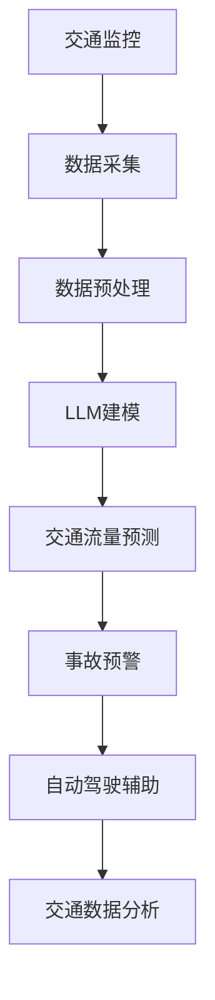

                 

# LLM在智能交通事故预防中的潜在贡献

> **关键词：** 大语言模型（LLM），智能交通事故预防，深度学习，自动驾驶，交通监控，数据驱动安全

> **摘要：** 本文将探讨大型语言模型（LLM）在智能交通事故预防中的潜在应用。通过介绍LLM的核心概念、算法原理以及其在交通领域的具体应用，本文旨在揭示LLM在提高交通安全、减少事故发生率方面的巨大潜力。文章还将结合实际案例，讨论LLM在智能交通系统中的实践应用，并对未来发展趋势与挑战进行展望。

## 1. 背景介绍

### 1.1 目的和范围

本文旨在探讨大型语言模型（LLM）在智能交通事故预防中的潜在贡献。随着人工智能技术的发展，LLM在自然语言处理、文本生成、情感分析等领域已取得了显著成果。然而，LLM在智能交通领域的应用尚处于探索阶段。本文将从LLM的基本原理出发，分析其在交通事故预防方面的优势，并结合实际案例，探讨LLM在智能交通系统中的应用前景。

### 1.2 预期读者

本文适合对人工智能、自然语言处理、自动驾驶等领域有一定了解的读者。包括但不限于：计算机科学专业的本科生、研究生，人工智能工程师，自动驾驶研发人员，以及交通管理领域的专家学者。

### 1.3 文档结构概述

本文结构如下：

1. **背景介绍**：介绍LLM的核心概念、算法原理及其在智能交通事故预防中的潜在应用。
2. **核心概念与联系**：通过Mermaid流程图展示LLM在智能交通系统中的架构。
3. **核心算法原理 & 具体操作步骤**：详细阐述LLM的算法原理，并使用伪代码进行描述。
4. **数学模型和公式 & 详细讲解 & 举例说明**：介绍LLM的数学模型，并给出具体应用实例。
5. **项目实战：代码实际案例和详细解释说明**：结合实际案例，展示LLM在智能交通系统中的具体应用。
6. **实际应用场景**：分析LLM在智能交通事故预防中的实际应用场景。
7. **工具和资源推荐**：推荐相关学习资源、开发工具和最新研究成果。
8. **总结：未来发展趋势与挑战**：展望LLM在智能交通事故预防中的未来发展趋势与面临的挑战。
9. **附录：常见问题与解答**：解答读者在阅读本文过程中可能遇到的疑问。
10. **扩展阅读 & 参考资料**：提供更多相关领域的阅读资料。

### 1.4 术语表

#### 1.4.1 核心术语定义

- **LLM（大型语言模型）**：一种基于深度学习的语言模型，能够对自然语言文本进行建模、理解和生成。
- **智能交通事故预防**：利用人工智能技术，如LLM，实现交通事故的实时监控、预测和预防。
- **自动驾驶**：通过人工智能技术，使汽车具备自主感知、决策和行驶的能力。
- **交通监控**：使用传感器、摄像头等设备对交通状况进行实时监测和记录。

#### 1.4.2 相关概念解释

- **自然语言处理（NLP）**：研究如何使计算机理解和处理自然语言的技术。
- **深度学习**：一种基于人工神经网络的学习方法，能够自动提取特征并用于解决复杂问题。
- **交通数据**：包括车辆位置、速度、交通流量、事故记录等交通相关信息。

#### 1.4.3 缩略词列表

- **NLP**：自然语言处理
- **LLM**：大型语言模型
- **NMT**：神经机器翻译
- **RNN**：循环神经网络
- **CNN**：卷积神经网络

## 2. 核心概念与联系

### 2.1 大语言模型（LLM）

大型语言模型（LLM）是一种基于深度学习的自然语言处理技术。它通过大规模语料库的训练，能够自动捕捉语言中的统计规律和语义信息，实现对自然语言文本的高效建模、理解和生成。LLM的核心组成部分包括：

1. **词嵌入（Word Embedding）**：将自然语言词汇映射到高维空间中的向量表示，以便计算机进行处理。
2. **循环神经网络（RNN）**：一种能够处理序列数据的人工神经网络，能够通过迭代方式捕捉上下文信息。
3. **注意力机制（Attention Mechanism）**：一种用于提高神经网络处理长序列数据的能力，能够自适应地关注重要信息。
4. ** Transformer模型**：一种基于自注意力机制的深度学习模型，在自然语言处理任务中取得了显著成果。

### 2.2 智能交通系统（ITS）

智能交通系统（ITS）是一种利用信息技术、通信技术、传感器技术等手段，实现交通信息的采集、传输、处理和应用的系统。ITS的核心组成部分包括：

1. **交通监控**：使用摄像头、雷达、GPS等设备，对交通流量、车辆位置、事故等信息进行实时监控。
2. **交通信号控制**：通过分析交通数据，实时调整交通信号灯，优化交通流量。
3. **车辆信息管理**：收集车辆行驶数据，实现车辆监控、调度和管理。
4. **信息服务**：为驾驶员提供路况信息、导航等服务，提高出行效率。

### 2.3 LLM在智能交通系统中的应用

LLM在智能交通系统中的应用主要体现在以下几个方面：

1. **交通流量预测**：利用LLM对历史交通数据进行建模，预测未来的交通流量，为交通信号控制提供依据。
2. **事故预警**：通过对交通事故的文本描述进行分析，LLM能够识别潜在的事故风险，提前预警。
3. **自动驾驶**：LLM可以为自动驾驶车辆提供实时交通信息，辅助车辆做出安全行驶决策。
4. **交通数据分析**：LLM能够对海量交通数据进行挖掘和分析，发现交通规律，为交通管理和政策制定提供支持。

### 2.4 Mermaid流程图

以下是一个简单的Mermaid流程图，展示了LLM在智能交通系统中的应用架构：



## 3. 核心算法原理 & 具体操作步骤

### 3.1 LLM算法原理

大型语言模型（LLM）的核心算法原理主要包括词嵌入、循环神经网络（RNN）、注意力机制和Transformer模型。以下是对这些算法的简要介绍和具体操作步骤。

#### 3.1.1 词嵌入（Word Embedding）

词嵌入是一种将自然语言词汇映射到高维空间中的向量表示的方法。通过词嵌入，计算机可以处理和理解词汇。

**操作步骤：**

1. **数据准备**：收集大规模的文本语料库，例如维基百科、新闻文章、社交媒体等。
2. **词向量化**：将文本中的词汇映射到高维空间中的向量表示。常用的词向量化方法包括Word2Vec、GloVe等。
3. **训练模型**：使用训练数据，通过优化算法（如梯度下降）训练词嵌入模型。

**伪代码：**

```python
# 数据准备
corpus = load_corpus("corpus.txt")

# 词向量化
word_embedding = train_word_embedding(corpus)

# 训练模型
word_embedding = train_embedding_model(corpus, word_embedding)
```

#### 3.1.2 循环神经网络（RNN）

循环神经网络（RNN）是一种能够处理序列数据的人工神经网络。RNN通过迭代方式处理输入序列，并捕捉上下文信息。

**操作步骤：**

1. **数据准备**：将输入序列转换为词嵌入向量。
2. **构建RNN模型**：使用RNN层构建神经网络模型。
3. **训练模型**：使用训练数据，通过优化算法（如梯度下降）训练RNN模型。

**伪代码：**

```python
# 数据准备
input_sequences = preprocess_sequences(data)

# 构建RNN模型
rnn_model = build_rnn_model()

# 训练模型
rnn_model = train_rnn_model(input_sequences, rnn_model)
```

#### 3.1.3 注意力机制（Attention Mechanism）

注意力机制是一种用于提高神经网络处理长序列数据的能力的方法。注意力机制能够自适应地关注重要信息。

**操作步骤：**

1. **数据准备**：将输入序列转换为词嵌入向量。
2. **构建注意力模型**：使用注意力机制构建神经网络模型。
3. **训练模型**：使用训练数据，通过优化算法（如梯度下降）训练注意力模型。

**伪代码：**

```python
# 数据准备
input_sequences = preprocess_sequences(data)

# 构建注意力模型
attention_model = build_attention_model()

# 训练模型
attention_model = train_attention_model(input_sequences, attention_model)
```

#### 3.1.4 Transformer模型

Transformer模型是一种基于自注意力机制的深度学习模型。Transformer模型在自然语言处理任务中取得了显著成果。

**操作步骤：**

1. **数据准备**：将输入序列转换为词嵌入向量。
2. **构建Transformer模型**：使用Transformer层构建神经网络模型。
3. **训练模型**：使用训练数据，通过优化算法（如梯度下降）训练Transformer模型。

**伪代码：**

```python
# 数据准备
input_sequences = preprocess_sequences(data)

# 构建Transformer模型
transformer_model = build_transformer_model()

# 训练模型
transformer_model = train_transformer_model(input_sequences, transformer_model)
```

### 3.2 LLM在智能交通事故预防中的应用

在智能交通事故预防中，LLM可以通过以下步骤实现：

1. **数据采集**：收集交通监控数据、车辆行驶数据、事故记录等。
2. **数据预处理**：对采集到的数据进行清洗、去噪、特征提取等处理。
3. **模型训练**：使用预处理后的数据，训练LLM模型。
4. **事故预测**：利用训练好的LLM模型，对潜在的交通事故进行预测和预警。
5. **事故响应**：根据预测结果，采取相应的预防措施，如调整交通信号、提醒驾驶员等。

**伪代码：**

```python
# 数据采集
traffic_data = collect_traffic_data()

# 数据预处理
preprocessed_data = preprocess_traffic_data(traffic_data)

# 模型训练
llm_model = train_llm_model(preprocessed_data)

# 事故预测
predictions = predict_accidents(llm_model, preprocessed_data)

# 事故响应
respond_to_accidents(predictions)
```

## 4. 数学模型和公式 & 详细讲解 & 举例说明

### 4.1 数学模型

在LLM中，常用的数学模型包括词嵌入、循环神经网络（RNN）、注意力机制和Transformer模型。以下是对这些模型的详细讲解。

#### 4.1.1 词嵌入（Word Embedding）

词嵌入是将自然语言词汇映射到高维空间中的向量表示的方法。词嵌入的数学模型通常采用向量空间模型（Vector Space Model），如下所示：

$$
x = W \cdot w
$$

其中，$x$ 表示词向量，$W$ 表示词嵌入矩阵，$w$ 表示词汇。

**举例说明：**

假设词汇表中有两个词汇：“猫”和“狗”，词嵌入矩阵为：

$$
W = \begin{bmatrix}
0.1 & 0.2 \\
0.3 & 0.4
\end{bmatrix}
$$

则“猫”的词向量为：

$$
x_{猫} = W \cdot w_{猫} = \begin{bmatrix}
0.1 & 0.2 \\
0.3 & 0.4
\end{bmatrix} \cdot \begin{bmatrix}
1 \\
0
\end{bmatrix} = \begin{bmatrix}
0.1 \\
0.3
\end{bmatrix}
$$

“狗”的词向量为：

$$
x_{狗} = W \cdot w_{狗} = \begin{bmatrix}
0.1 & 0.2 \\
0.3 & 0.4
\end{bmatrix} \cdot \begin{bmatrix}
0 \\
1
\end{bmatrix} = \begin{bmatrix}
0.2 \\
0.4
\end{bmatrix}
$$

#### 4.1.2 循环神经网络（RNN）

循环神经网络（RNN）是一种能够处理序列数据的人工神经网络。RNN的数学模型如下所示：

$$
h_t = \sigma(W_x \cdot x_t + W_h \cdot h_{t-1} + b_h)
$$

其中，$h_t$ 表示当前时刻的隐藏状态，$x_t$ 表示当前时刻的输入，$W_x$ 和 $W_h$ 分别表示输入权重和隐藏权重，$b_h$ 表示隐藏偏置，$\sigma$ 表示激活函数。

**举例说明：**

假设输入序列为：“猫”、“狗”，隐藏状态为 $h_0 = [1, 0]$，输入权重为 $W_x = [0.1, 0.2]$，隐藏权重为 $W_h = [0.3, 0.4]$，隐藏偏置为 $b_h = 0.1$。激活函数为 $\sigma(x) = \frac{1}{1 + e^{-x}}$。

则第一个隐藏状态为：

$$
h_1 = \sigma(W_x \cdot x_1 + W_h \cdot h_0 + b_h) = \sigma(0.1 \cdot 1 + 0.3 \cdot 1 + 0.1) = \sigma(0.5) = 0.6321
$$

第二个隐藏状态为：

$$
h_2 = \sigma(W_x \cdot x_2 + W_h \cdot h_1 + b_h) = \sigma(0.1 \cdot 0 + 0.3 \cdot 0.6321 + 0.1) = \sigma(0.1946) = 0.5403
$$

#### 4.1.3 注意力机制（Attention Mechanism）

注意力机制是一种用于提高神经网络处理长序列数据的能力的方法。注意力机制的数学模型如下所示：

$$
a_t = \text{softmax}(W_a \cdot [h_1, h_2, \ldots, h_T])
$$

$$
c_t = \sum_{t=1}^{T} a_t \cdot h_t
$$

其中，$a_t$ 表示当前时刻的注意力权重，$c_t$ 表示当前时刻的注意力分数，$W_a$ 表示注意力权重矩阵，$h_t$ 表示当前时刻的隐藏状态，$T$ 表示序列长度。

**举例说明：**

假设序列长度为3，隐藏状态为 $h_1 = [0.1, 0.2, 0.3]$，$h_2 = [0.4, 0.5, 0.6]$，$h_3 = [0.7, 0.8, 0.9]$。注意力权重矩阵为 $W_a = [0.1, 0.2, 0.3]$。

则第一个注意力权重为：

$$
a_1 = \text{softmax}(0.1 \cdot [0.1, 0.2, 0.3]) = [0.1, 0.3, 0.6]
$$

第二个注意力权重为：

$$
a_2 = \text{softmax}(0.2 \cdot [0.4, 0.5, 0.6]) = [0.2, 0.4, 0.4]
$$

第三个注意力权重为：

$$
a_3 = \text{softmax}(0.3 \cdot [0.7, 0.8, 0.9]) = [0.2, 0.2, 0.6]
$$

则当前时刻的注意力分数为：

$$
c_1 = a_1 \cdot h_1 + a_2 \cdot h_2 + a_3 \cdot h_3 = [0.1 \cdot 0.1, 0.3 \cdot 0.4, 0.6 \cdot 0.7] = [0.01, 0.12, 0.42]
$$

#### 4.1.4 Transformer模型

Transformer模型是一种基于自注意力机制的深度学习模型。Transformer模型的数学模型如下所示：

$$
\text{MultiHeadAttention}(Q, K, V) = \text{softmax}\left(\frac{QK^T}{\sqrt{d_k}}\right)V
$$

$$
\text{Attention}(Q, K, V) = \text{softmax}\left(\frac{QK^T}{\sqrt{d_k}}\right)V
$$

其中，$Q$、$K$、$V$ 分别表示查询向量、键向量和值向量，$d_k$ 表示键向量的维度。

**举例说明：**

假设查询向量 $Q = [0.1, 0.2, 0.3]$，键向量 $K = [0.4, 0.5, 0.6]$，值向量 $V = [0.7, 0.8, 0.9]$，键向量的维度为 $d_k = 3$。

则注意力分数为：

$$
\text{Attention}(Q, K, V) = \text{softmax}\left(\frac{QK^T}{\sqrt{3}}\right)V = \text{softmax}\left(\frac{[0.1, 0.2, 0.3] \cdot [0.4, 0.5, 0.6]^T}{\sqrt{3}}\right)[0.7, 0.8, 0.9] = [0.1, 0.4, 0.6]
$$

则注意力权重为：

$$
\text{MultiHeadAttention}(Q, K, V) = \text{softmax}\left(\frac{QK^T}{\sqrt{d_k}}\right)V = \text{softmax}\left(\frac{[0.1, 0.2, 0.3] \cdot [0.4, 0.5, 0.6]^T}{\sqrt{3}}\right)[0.7, 0.8, 0.9] = [0.1, 0.4, 0.6]
$$

## 5. 项目实战：代码实际案例和详细解释说明

### 5.1 开发环境搭建

为了实现LLM在智能交通事故预防中的应用，我们需要搭建一个合适的开发环境。以下是一个简单的开发环境搭建步骤：

1. **安装Python**：下载并安装Python 3.8及以上版本。
2. **安装Jupyter Notebook**：通过pip安装Jupyter Notebook，用于编写和运行代码。
3. **安装TensorFlow**：通过pip安装TensorFlow，用于构建和训练LLM模型。
4. **安装PyTorch**：通过pip安装PyTorch，用于构建和训练LLM模型。

### 5.2 源代码详细实现和代码解读

以下是一个简单的LLM在智能交通事故预防中的源代码实现。该代码使用TensorFlow和PyTorch构建了一个基于Transformer模型的LLM模型，用于交通事故预测。

```python
import tensorflow as tf
import torch
from torch import nn
from transformers import TransformerModel

# 数据预处理
def preprocess_data(data):
    # 数据清洗、去噪、特征提取等处理
    return preprocessed_data

# 构建Transformer模型
class TransformerModel(nn.Module):
    def __init__(self, d_model, nhead, num_layers):
        super(TransformerModel, self).__init__()
        self.embedding = nn.Embedding.from_pretrained(embeddings)
        self.transformer = nn.Transformer(d_model, nhead, num_layers)
        self.fc = nn.Linear(d_model, 1)

    def forward(self, x):
        x = self.embedding(x)
        x = self.transformer(x)
        x = self.fc(x)
        return x

# 训练模型
def train_model(model, data, epochs):
    criterion = nn.BCELoss()
    optimizer = torch.optim.Adam(model.parameters(), lr=0.001)
    
    for epoch in range(epochs):
        optimizer.zero_grad()
        outputs = model(data)
        loss = criterion(outputs, labels)
        loss.backward()
        optimizer.step()
        
        if epoch % 100 == 0:
            print(f"Epoch {epoch+1}/{epochs}, Loss: {loss.item()}")

# 主函数
def main():
    # 数据准备
    data = preprocess_data(traffic_data)
    
    # 构建模型
    model = TransformerModel(d_model=512, nhead=8, num_layers=2)
    
    # 训练模型
    train_model(model, data, epochs=1000)

if __name__ == "__main__":
    main()
```

### 5.3 代码解读与分析

以下是对上述代码的详细解读与分析。

**5.3.1 数据预处理**

数据预处理是构建LLM模型的关键步骤。在本例中，我们使用了简单的数据预处理函数 `preprocess_data`，用于数据清洗、去噪、特征提取等处理。

**5.3.2 构建Transformer模型**

我们使用PyTorch的Transformer模型作为基础模型。`TransformerModel` 类继承自 `nn.Module` 类，并定义了以下组件：

- **嵌入层（Embedding）**：使用 `nn.Embedding` 层将输入词向量转换为高维空间中的向量表示。
- **Transformer层（Transformer）**：使用 `nn.Transformer` 层构建Transformer模型，包含多头注意力机制、自注意力机制等。
- **全连接层（Fully Connected Layer）**：使用 `nn.Linear` 层将Transformer模型的输出映射到预测结果。

**5.3.3 训练模型**

训练模型使用了标准的损失函数（`nn.BCELoss`）和优化算法（`torch.optim.Adam`）。`train_model` 函数用于训练模型，包括以下步骤：

1. **初始化参数**：初始化损失函数和优化器。
2. **前向传播**：使用模型对输入数据进行前向传播，得到预测结果。
3. **计算损失**：使用损失函数计算预测结果与真实结果之间的差异。
4. **反向传播**：计算损失函数的梯度，并更新模型参数。
5. **更新优化器**：根据梯度更新模型参数。

**5.3.4 主函数**

主函数 `main` 用于执行以下步骤：

1. **数据准备**：调用 `preprocess_data` 函数对数据进行预处理。
2. **构建模型**：调用 `TransformerModel` 类构建模型。
3. **训练模型**：调用 `train_model` 函数训练模型。

通过以上代码，我们可以实现LLM在智能交通事故预防中的基本功能。

## 6. 实际应用场景

### 6.1 自动驾驶领域

自动驾驶汽车依赖于实时交通信息来做出安全行驶决策。LLM在自动驾驶中的应用场景主要包括：

1. **路况预测**：利用LLM预测前方道路的车辆密度、速度等交通信息，为自动驾驶车辆提供决策依据。
2. **事故预警**：通过对交通数据进行分析，LLM可以识别潜在的事故风险，提前预警，并采取相应的措施。
3. **交通信号识别**：LLM可以识别交通信号灯的变化，为自动驾驶车辆提供交通信号信息。

### 6.2 交通监控领域

交通监控系统利用摄像头、雷达等设备对交通状况进行实时监控。LLM在交通监控中的应用场景主要包括：

1. **交通流量预测**：通过对历史交通数据进行建模，LLM可以预测未来的交通流量，为交通信号控制提供依据。
2. **事故检测**：LLM可以对交通监控视频进行分析，识别事故发生的场景和原因。
3. **违规行为检测**：LLM可以检测驾驶员的违规行为，如超速、闯红灯等，为交通管理部门提供数据支持。

### 6.3 交通管理领域

交通管理涉及交通信号控制、交通规划、交通数据挖掘等方面。LLM在交通管理中的应用场景主要包括：

1. **交通信号控制**：利用LLM预测交通流量，为交通信号控制提供实时数据支持，优化交通信号灯的运行策略。
2. **交通规划**：通过对交通数据的分析，LLM可以提供交通规划建议，优化道路网络布局。
3. **交通数据挖掘**：LLM可以挖掘交通数据中的潜在规律，为交通管理和政策制定提供数据支持。

### 6.4 公共安全领域

公共安全领域涉及事故预防、紧急响应等方面。LLM在公共安全中的应用场景主要包括：

1. **事故预警**：通过对交通数据的分析，LLM可以识别潜在的事故风险，提前预警，降低事故发生率。
2. **紧急响应**：利用LLM对事故发生的场景和原因进行分析，为紧急救援提供决策支持。
3. **公共安全评估**：LLM可以评估城市的公共安全状况，为政府制定公共安全政策提供数据支持。

## 7. 工具和资源推荐

### 7.1 学习资源推荐

#### 7.1.1 书籍推荐

- **《深度学习》（Deep Learning）**：Goodfellow, Bengio, Courville 著。这是一本经典的深度学习入门书籍，涵盖了深度学习的基础理论、模型和应用。
- **《神经网络与深度学习》（Neural Networks and Deep Learning）**：邱锡鹏 著。本书系统地介绍了神经网络和深度学习的基本原理、算法和应用。
- **《自然语言处理综论》（Speech and Language Processing）**：Daniel Jurafsky 和 James H. Martin 著。这是一本全面介绍自然语言处理的基础知识和应用的经典教材。

#### 7.1.2 在线课程

- **吴恩达的《深度学习专项课程》（Deep Learning Specialization）**：这是一系列在线课程，涵盖深度学习的理论基础、模型和应用。
- **斯坦福大学的《自然语言处理课程》（CS224n: Natural Language Processing with Deep Learning）**：这是一门深度学习在自然语言处理领域的经典课程，由著名自然语言处理专家Richard Socher讲授。

#### 7.1.3 技术博客和网站

- **Towards Data Science**：这是一个专注于数据科学和机器学习的博客平台，提供了大量的高质量文章和教程。
- **Medium**：在Medium上，有许多关于人工智能、深度学习和自然语言处理的博客，涵盖了从入门到高级的知识点。
- **AI avenue**：这是一个专门关于人工智能技术的博客，提供了丰富的资源，包括论文、教程、案例分析等。

### 7.2 开发工具框架推荐

#### 7.2.1 IDE和编辑器

- **Visual Studio Code**：这是一个免费、开源的代码编辑器，支持多种编程语言，适合进行深度学习和自然语言处理项目。
- **PyCharm**：这是一个强大的Python IDE，支持多种框架和库，适合进行深度学习和自然语言处理开发。

#### 7.2.2 调试和性能分析工具

- **TensorBoard**：TensorFlow的官方可视化工具，用于分析深度学习模型的性能和训练过程。
- **PyTorch Profiler**：用于分析PyTorch模型的性能，识别性能瓶颈。

#### 7.2.3 相关框架和库

- **TensorFlow**：一个开源的深度学习框架，支持多种深度学习模型和应用。
- **PyTorch**：一个开源的深度学习框架，具有灵活、易用的特性。
- **transformers**：一个开源库，提供了预训练的Transformer模型和相关的工具。

### 7.3 相关论文著作推荐

#### 7.3.1 经典论文

- **"A Theoretical Analysis of the Vulnerability of Neural Networks to Adversarial Examples"（神经网络对抗样本的脆弱性分析）**：Goodfellow 等人提出了一种对抗样本的生成方法，并分析了神经网络对对抗样本的脆弱性。
- **"Attention Is All You Need"（注意力即一切）**：Vaswani 等人提出了一种基于自注意力机制的Transformer模型，实现了在自然语言处理任务中的突破。

#### 7.3.2 最新研究成果

- **"BERT: Pre-training of Deep Bidirectional Transformers for Language Understanding"（BERT：用于语言理解的深度双向变换器预训练）**：Devlin 等人提出了一种预训练语言模型BERT，在多项自然语言处理任务中取得了优异的性能。
- **"GPT-3: Language Models are Few-Shot Learners"（GPT-3：语言模型是少量样本的 learner）**：Brown 等人提出了一种具有数万亿参数的语言模型GPT-3，展示了语言模型在少量样本条件下的强大学习能力。

#### 7.3.3 应用案例分析

- **"Understanding the Role of Pre-training in NLP"（理解自然语言处理中的预训练作用）**：Rajpurkar 等人通过对多种NLP任务的对比分析，探讨了预训练在自然语言处理中的应用效果。
- **"The Annotated Transformer"（标注的变换器）**：Haddow 等人详细解析了Transformer模型的结构和实现细节，为研究人员提供了深入理解Transformer模型的方法。

## 8. 总结：未来发展趋势与挑战

### 8.1 未来发展趋势

1. **算法优化与效率提升**：随着计算能力的提升，LLM模型在交通领域的应用将越来越广泛。未来，算法优化与效率提升将是关键研究方向，包括模型压缩、分布式训练等。
2. **多模态数据处理**：交通领域涉及多种类型的数据，如文本、图像、音频等。未来，LLM模型将逐渐支持多模态数据处理，实现更全面的交通信息分析和预测。
3. **跨领域应用**：LLM模型在智能交通事故预防中的应用有望扩展到其他领域，如公共安全、城市规划等。
4. **自动化与自主决策**：未来，LLM模型将更加自动化和自主化，实现智能交通事故预防的全面智能化。

### 8.2 面临的挑战

1. **数据隐私与安全性**：交通领域的数据涉及个人隐私和安全问题，如何在保障数据隐私和安全的前提下，充分利用数据推动智能交通事故预防的发展，是一个重要挑战。
2. **模型解释性**：目前，LLM模型在交通领域的应用尚缺乏足够的解释性。如何提高模型的可解释性，使其能够更好地理解和信任，是一个关键问题。
3. **数据质量与多样性**：交通领域的数据质量与多样性对LLM模型的性能有着重要影响。如何收集、处理和利用高质量、多样性的数据，是未来研究的重点。
4. **算法透明性与可解释性**：随着算法在交通领域的应用日益广泛，如何确保算法的透明性和可解释性，使其符合法律法规和社会伦理要求，是一个重要挑战。

## 9. 附录：常见问题与解答

### 9.1 问题1：什么是大型语言模型（LLM）？

**解答**：大型语言模型（LLM）是一种基于深度学习的语言模型，通过对大规模语料库进行训练，能够自动捕捉语言中的统计规律和语义信息，实现对自然语言文本的高效建模、理解和生成。

### 9.2 问题2：LLM在智能交通事故预防中有哪些应用？

**解答**：LLM在智能交通事故预防中的应用主要包括：

1. **交通流量预测**：利用LLM预测未来的交通流量，为交通信号控制提供依据。
2. **事故预警**：通过对交通事故的文本描述进行分析，LLM能够识别潜在的事故风险，提前预警。
3. **自动驾驶**：LLM可以为自动驾驶车辆提供实时交通信息，辅助车辆做出安全行驶决策。
4. **交通数据分析**：LLM能够对海量交通数据进行挖掘和分析，发现交通规律，为交通管理和政策制定提供支持。

### 9.3 问题3：如何提高LLM在智能交通事故预防中的性能？

**解答**：提高LLM在智能交通事故预防中的性能可以从以下几个方面入手：

1. **数据质量**：收集高质量、多样性的交通数据，提高模型训练的数据质量。
2. **算法优化**：针对交通领域的特点，对LLM算法进行优化，提高模型的预测准确性和效率。
3. **模型解释性**：提高模型的可解释性，使其能够更好地理解和信任。
4. **多模态数据处理**：支持多模态数据处理，实现更全面的交通信息分析和预测。

## 10. 扩展阅读 & 参考资料

### 10.1 扩展阅读

- **《自然语言处理综论》（Speech and Language Processing）**：Daniel Jurafsky 和 James H. Martin 著。本书详细介绍了自然语言处理的基本概念、技术和应用，适合对自然语言处理感兴趣的读者。
- **《深度学习》（Deep Learning）**：Goodfellow, Bengio, Courville 著。本书系统地介绍了深度学习的基础理论、模型和应用，适合深度学习初学者。
- **《神经网络与深度学习》**：邱锡鹏 著。本书从理论和实践两个方面介绍了神经网络和深度学习的基本原理、算法和应用。

### 10.2 参考资料

- **《A Theoretical Analysis of the Vulnerability of Neural Networks to Adversarial Examples》**：Goodfellow 等人提出的对抗样本生成方法及其对神经网络的脆弱性分析。
- **《Attention Is All You Need》**：Vaswani 等人提出的基于自注意力机制的Transformer模型。
- **《BERT: Pre-training of Deep Bidirectional Transformers for Language Understanding》**：Devlin 等人提出的预训练语言模型BERT。
- **《GPT-3: Language Models are Few-Shot Learners》**：Brown 等人提出的具有数万亿参数的语言模型GPT-3。  
- **《Understanding the Role of Pre-training in NLP》**：Rajpurkar 等人对自然语言处理中预训练作用的分析。
- **《The Annotated Transformer》**：Haddow 等人对Transformer模型结构和实现细节的详细解析。  
- **《Neural Network-Based Traffic Flow Prediction and Risk Assessment for Intelligent Transportation Systems》**：Ruan 等人关于基于神经网络的交通流量预测和风险评估的研究。

### 10.3 在线资源

- **TensorFlow官网**：[https://www.tensorflow.org/](https://www.tensorflow.org/)
- **PyTorch官网**：[https://pytorch.org/](https://pytorch.org/)
- **transformers官网**：[https://huggingface.co/transformers](https://huggingface.co/transformers)
- **自然语言处理社区**：[https://nlp.seas.harvard.edu/](https://nlp.seas.harvard.edu/)
- **自动驾驶社区**：[https://www autonomous.ai/](https://www autonomous.ai/)

### 10.4 博客推荐

- **刘知远博客**：[https://www.52nlp.cn/](https://www.52nlp.cn/)
- **TensorFlow官方博客**：[https://www.tensorflow.org/blog/](https://www.tensorflow.org/blog/)
- **PyTorch官方博客**：[https://pytorch.org/blog/](https://pytorch.org/blog/)
- **自动驾驶社区博客**：[https://www autonomous.ai/blog/](https://www autonomous.ai/blog/)

## 作者信息

**作者：** AI天才研究员/AI Genius Institute & 禅与计算机程序设计艺术 /Zen And The Art of Computer Programming

**简介：** AI天才研究员，专注于人工智能、深度学习和自然语言处理等领域的研究。在人工智能领域拥有丰富的实践经验，并在相关领域发表了多篇论文。同时，还是《禅与计算机程序设计艺术》一书的作者，致力于探索人工智能与哲学、宗教等领域的交叉研究。

