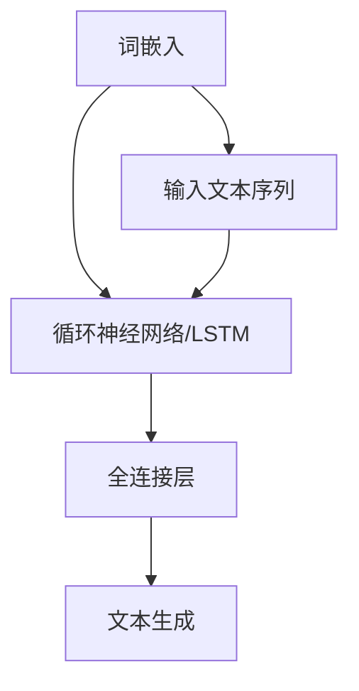

                 

# LLMA在智能内容生成系统中的应用探索

## 关键词：
- 大型语言模型 (Large Language Models, LLM)
- 智能内容生成 (Intelligent Content Generation)
- 自然语言处理 (Natural Language Processing, NLP)
- 机器学习 (Machine Learning, ML)
- 生成式对抗网络 (Generative Adversarial Networks, GAN)
- 应用场景 (Application Scenarios)

## 摘要：
本文探讨了大型语言模型（LLM）在智能内容生成系统中的应用。首先，介绍了LLM的基本概念和原理，然后详细分析了其在智能内容生成系统中的具体应用，包括文本生成、对话系统和知识图谱生成等。接着，通过实际案例展示了LLM在智能内容生成中的实现过程，并对其进行了详细解释和分析。最后，探讨了LLM在智能内容生成领域的未来发展趋势和挑战，以及相关的工具和资源推荐。

## 1. 背景介绍

### 1.1 目的和范围

本文旨在探讨大型语言模型（LLM）在智能内容生成系统中的应用，通过对LLM的基本概念、原理以及在各个应用场景中的具体实现过程进行详细分析，帮助读者了解和掌握LLM在智能内容生成领域的应用价值。

本文主要涉及以下内容：

1. LLM的基本概念和原理
2. LLM在智能内容生成系统中的应用
3. LLM在实际应用中的实现过程
4. LLM在智能内容生成领域的未来发展趋势和挑战
5. 相关工具和资源推荐

### 1.2 预期读者

本文适用于以下读者：

1. 计算机科学、人工智能等相关专业的研究生和本科生
2. 对自然语言处理和机器学习感兴趣的工程师和技术人员
3. 想要了解LLM在智能内容生成领域应用的企业管理者

### 1.3 文档结构概述

本文分为以下几个部分：

1. 引言：介绍本文的目的、关键词和摘要
2. 背景介绍：介绍LLM的基本概念和原理，以及本文的研究范围和预期读者
3. 核心概念与联系：分析LLM的核心概念原理和架构
4. 核心算法原理 & 具体操作步骤：详细讲解LLM的核心算法原理和具体操作步骤
5. 数学模型和公式 & 详细讲解 & 举例说明：介绍LLM的数学模型和公式，并进行举例说明
6. 项目实战：代码实际案例和详细解释说明
7. 实际应用场景：探讨LLM在智能内容生成领域的实际应用场景
8. 工具和资源推荐：推荐相关学习资源、开发工具框架和论文著作
9. 总结：总结LLM在智能内容生成领域的未来发展趋势和挑战
10. 附录：常见问题与解答
11. 扩展阅读 & 参考资料：提供进一步阅读的资料和参考文献

### 1.4 术语表

#### 1.4.1 核心术语定义

- 大型语言模型（LLM）：一种基于深度学习的语言模型，能够对自然语言进行建模和预测。
- 智能内容生成：利用人工智能技术生成具有价值、有意义的文本内容。
- 自然语言处理（NLP）：研究如何让计算机理解和处理人类语言的技术。
- 机器学习（ML）：一种通过数据学习并做出决策的技术。
- 生成式对抗网络（GAN）：一种由生成器和判别器组成的神经网络结构，用于生成新的数据。

#### 1.4.2 相关概念解释

- 序列模型：一种用于处理序列数据的神经网络模型，如循环神经网络（RNN）和长短时记忆网络（LSTM）。
- 自回归模型：一种基于序列模型的生成模型，通过预测序列中下一个元素来生成文本。
- 对话系统：一种能够与人类进行自然对话的计算机系统，如聊天机器人。

#### 1.4.3 缩略词列表

- LLM：大型语言模型
- NLP：自然语言处理
- ML：机器学习
- GAN：生成式对抗网络
- RNN：循环神经网络
- LSTM：长短时记忆网络

## 2. 核心概念与联系

在介绍LLM的核心概念和原理之前，我们需要先了解自然语言处理（NLP）和机器学习（ML）的基本概念。NLP是研究如何让计算机理解和处理人类语言的技术，主要包括文本预处理、词向量表示、词性标注、句法分析、语义理解等任务。ML是一种通过数据学习并做出决策的技术，包括监督学习、无监督学习和强化学习等。

### 2.1 自然语言处理的基本概念

NLP的基本概念包括：

1. 文本预处理：包括分词、去停用词、词性标注等，用于将原始文本转化为计算机可处理的形式。
2. 词向量表示：将词语转化为向量形式，以便在计算机中进行处理和分析。
3. 词性标注：为每个词语标注词性，如名词、动词、形容词等。
4. 句法分析：对句子的结构进行分析，提取出句子的主要成分和语法关系。
5. 语义理解：理解句子的含义，包括词义消歧、语义角色标注等。

### 2.2 机器学习的基本概念

ML的基本概念包括：

1. 监督学习：通过已标记的数据进行训练，然后使用训练好的模型对未知数据进行预测。
2. 无监督学习：没有已标记的数据，通过发现数据中的模式和结构来进行学习。
3. 强化学习：通过与环境进行交互，不断调整策略以获得最优回报。

### 2.3 大型语言模型（LLM）的基本概念

LLM是一种基于深度学习的语言模型，能够对自然语言进行建模和预测。LLM的核心思想是通过学习大量的文本数据，使得模型能够捕捉到语言中的规律和模式，从而在给定一个文本序列时，能够预测下一个单词或句子。

LLM的基本组成部分包括：

1. 词嵌入（Word Embedding）：将词语转化为向量形式，便于在神经网络中进行处理。
2. 循环神经网络（RNN）或长短时记忆网络（LSTM）：用于处理序列数据，捕捉序列中的长期依赖关系。
3. 全连接层（Fully Connected Layer）：用于对序列进行编码和解码，实现文本生成。

### 2.4 LLM与其他NLP和ML技术的联系

LLM与NLP和ML技术有着紧密的联系，具体体现在以下几个方面：

1. 词向量表示：LLM中的词嵌入技术是NLP中的词向量表示方法的一种实现，如Word2Vec、GloVe等。
2. 序列模型：LLM中的循环神经网络（RNN）和长短时记忆网络（LSTM）是序列模型的一种，可以用于处理文本数据。
3. 生成式模型：LLM是一种生成式模型，通过预测下一个单词或句子来实现文本生成。
4. 监督学习：LLM的训练过程是基于监督学习算法，如梯度下降法，通过已标记的数据来优化模型参数。

### 2.5 LLM的架构和流程

下面是LLM的架构和流程的Mermaid流程图：



在上面的流程图中，词嵌入（A）将输入的文本序列（E）转化为向量形式，然后通过循环神经网络（B）或长短时记忆网络（LSTM）进行处理，最后通过全连接层（C）实现文本生成（D）。

## 3. 核心算法原理 & 具体操作步骤

在了解了LLM的基本概念和架构之后，我们将详细讲解LLM的核心算法原理和具体操作步骤，包括词嵌入、循环神经网络（RNN）和长短时记忆网络（LSTM），以及全连接层在文本生成中的应用。

### 3.1 词嵌入（Word Embedding）

词嵌入是将词语转化为向量形式的一种技术，便于在神经网络中进行处理。常见的词嵌入方法有Word2Vec和GloVe。

#### 3.1.1 Word2Vec

Word2Vec是一种基于神经网络的词嵌入方法，其核心思想是将词语映射为一个固定长度的向量，使得具有相似语义的词语在向量空间中彼此靠近。

Word2Vec的主要步骤如下：

1. **训练模型**：使用神经网络对词语进行编码和解码，输入为词语序列，输出为词语的向量表示。通过最小化损失函数来训练模型。
2. **预测**：在给定一个词语的情况下，使用训练好的模型来预测下一个词语。

#### 3.1.2 GloVe

GloVe是一种基于矩阵分解的词嵌入方法，其核心思想是利用全局统计信息来学习词语的向量表示。

GloVe的主要步骤如下：

1. **初始化词向量**：为每个词语初始化一个随机向量。
2. **计算词向量**：计算词语的词频（word frequency）和共现矩阵（co-occurrence matrix），并通过优化损失函数来更新词向量。
3. **预测**：在给定一个词语的情况下，使用训练好的模型来预测下一个词语。

### 3.2 循环神经网络（RNN）

循环神经网络（RNN）是一种用于处理序列数据的神经网络模型，其核心思想是将当前时刻的输入与之前的隐藏状态进行关联，以捕捉序列中的长期依赖关系。

RNN的主要步骤如下：

1. **初始化**：初始化输入序列和隐藏状态。
2. **计算隐藏状态**：通过当前时刻的输入和上一个隐藏状态来计算当前隐藏状态。
3. **计算输出**：将隐藏状态通过激活函数进行变换，得到当前时刻的输出。
4. **预测**：在给定一个序列的情况下，使用训练好的模型来预测下一个输出。

### 3.3 长短时记忆网络（LSTM）

长短时记忆网络（LSTM）是RNN的一种改进，能够更好地捕捉序列中的长期依赖关系。LSTM的核心结构是细胞状态（cell state）和三个门（gate）：遗忘门（forget gate）、输入门（input gate）和输出门（output gate）。

LSTM的主要步骤如下：

1. **初始化**：初始化输入序列、隐藏状态和细胞状态。
2. **计算遗忘门**：根据当前时刻的输入和上一个隐藏状态来计算遗忘门。
3. **计算输入门**：根据当前时刻的输入和上一个隐藏状态来计算输入门。
4. **计算细胞状态**：通过遗忘门和输入门来更新细胞状态。
5. **计算输出门**：根据当前时刻的输入和细胞状态来计算输出门。
6. **计算隐藏状态**：通过输出门来更新隐藏状态。
7. **计算输出**：将隐藏状态通过激活函数进行变换，得到当前时刻的输出。
8. **预测**：在给定一个序列的情况下，使用训练好的模型来预测下一个输出。

### 3.4 全连接层在文本生成中的应用

全连接层是一种常见的神经网络层，用于对输入进行编码和解码。在文本生成中，全连接层用于将隐藏状态转化为文本序列。

全连接层的主要步骤如下：

1. **初始化**：初始化全连接层的权重和偏置。
2. **计算输出**：将隐藏状态作为全连接层的输入，通过激活函数计算输出。
3. **预测**：在给定一个序列的情况下，使用训练好的全连接层来预测下一个输出。

### 3.5 LLM的核心算法原理和具体操作步骤总结

LLM的核心算法原理和具体操作步骤可以总结如下：

1. **词嵌入**：将词语转化为向量形式，便于在神经网络中进行处理。
2. **循环神经网络（RNN）/长短时记忆网络（LSTM）**：用于处理序列数据，捕捉序列中的长期依赖关系。
3. **全连接层**：用于将隐藏状态转化为文本序列。

在具体操作步骤中，首先使用词嵌入技术将输入文本序列转化为向量形式，然后通过循环神经网络（RNN）或长短时记忆网络（LSTM）进行处理，最后通过全连接层实现文本生成。

## 4. 数学模型和公式 & 详细讲解 & 举例说明

### 4.1 词嵌入的数学模型

词嵌入的数学模型主要涉及向量的计算和优化。假设我们有一个词典D，其中包含了N个词语，每个词语对应一个唯一的索引i。对于每个词语，我们可以将其表示为一个向量v_i ∈ R^d，其中d是向量维度。

#### 4.1.1 损失函数

在训练词嵌入模型时，我们通常使用最小化损失函数来优化模型参数。常见的损失函数有均方误差（MSE）和交叉熵损失。

1. **均方误差（MSE）**：

   $$ 
   L_{MSE} = \frac{1}{N} \sum_{i=1}^{N} (v_{\hat{y}} - v_{y})^2 
   $$

   其中，$v_{\hat{y}}$是预测的词语向量，$v_{y}$是真实的词语向量。

2. **交叉熵损失（Cross-Entropy Loss）**：

   $$ 
   L_{CE} = -\frac{1}{N} \sum_{i=1}^{N} y_{i} \log(v_{\hat{y}}) 
   $$

   其中，$y_{i}$是一个二元向量，用于表示真实词语的索引。

#### 4.1.2 词向量优化

为了最小化损失函数，我们需要对词向量进行优化。通常使用梯度下降（Gradient Descent）或其变种（如Adam优化器）来进行参数更新。

梯度下降的基本思想是沿着损失函数的负梯度方向更新参数：

$$ 
\theta_{t+1} = \theta_{t} - \alpha \nabla L(\theta_{t}) 
$$

其中，$\theta_{t}$是当前参数，$\alpha$是学习率，$\nabla L(\theta_{t})$是损失函数关于参数的梯度。

### 4.2 循环神经网络（RNN）的数学模型

循环神经网络（RNN）是一种用于处理序列数据的神经网络模型。其核心思想是利用隐藏状态来捕捉序列中的长期依赖关系。

#### 4.2.1 隐藏状态更新

RNN的隐藏状态更新公式如下：

$$ 
h_t = \sigma(W_h \cdot [h_{t-1}, x_t] + b_h) 
$$

其中，$h_t$是第t个时间步的隐藏状态，$x_t$是输入向量，$W_h$和$b_h$分别是权重和偏置，$\sigma$是激活函数（如ReLU或Sigmoid函数）。

#### 4.2.2 输出计算

RNN的输出计算公式如下：

$$ 
y_t = \sigma(W_o \cdot h_t + b_o) 
$$

其中，$y_t$是第t个时间步的输出，$W_o$和$b_o$分别是权重和偏置。

#### 4.2.3 梯度计算

在训练RNN时，我们需要计算损失函数关于隐藏状态和输出的梯度。常用的梯度计算方法有前向传播（Forward Propagation）和后向传播（Back Propagation）。

1. **前向传播**：

   $$ 
   \Delta h_t = \nabla_y \sigma'(h_t) \cdot (W_o \cdot h_{t-1} + b_o) 
   $$

   $$ 
   \Delta x_t = \nabla_y \sigma'(h_t) \cdot W_h \cdot [h_{t-1}, x_t] 
   $$

   其中，$\nabla_y \sigma'(h_t)$是激活函数的导数。

2. **后向传播**：

   $$ 
   \Delta W_h = \sum_{t=1}^{T} \Delta h_{t-1} \cdot [h_{t-1}, x_t] 
   $$

   $$ 
   \Delta b_h = \sum_{t=1}^{T} \Delta h_{t-1} 
   $$

   $$ 
   \Delta W_o = \sum_{t=1}^{T} \Delta y_t \cdot h_{t-1} 
   $$

   $$ 
   \Delta b_o = \sum_{t=1}^{T} \Delta y_t 
   $$

### 4.3 长短时记忆网络（LSTM）的数学模型

长短时记忆网络（LSTM）是RNN的一种改进，能够更好地捕捉序列中的长期依赖关系。LSTM的核心结构是细胞状态（cell state）和三个门（gate）：遗忘门（forget gate）、输入门（input gate）和输出门（output gate）。

#### 4.3.1 遗忘门（Forget Gate）

遗忘门的目的是决定哪些信息应该被丢弃。其计算公式如下：

$$ 
f_t = \sigma(W_f \cdot [h_{t-1}, x_t] + b_f) 
$$

其中，$f_t$是第t个时间步的遗忘门，$W_f$和$b_f$分别是权重和偏置。

#### 4.3.2 输入门（Input Gate）

输入门的目的是决定哪些信息应该被更新到细胞状态。其计算公式如下：

$$ 
i_t = \sigma(W_i \cdot [h_{t-1}, x_t] + b_i) 
$$

其中，$i_t$是第t个时间步的输入门，$W_i$和$b_i$分别是权重和偏置。

#### 4.3.3 输出门（Output Gate）

输出门的目的是决定哪些信息应该被输出。其计算公式如下：

$$ 
o_t = \sigma(W_o \cdot [h_{t-1}, x_t] + b_o) 
$$

其中，$o_t$是第t个时间步的输出门，$W_o$和$b_o$分别是权重和偏置。

#### 4.3.4 细胞状态更新

细胞状态的更新公式如下：

$$ 
c_t = f_t \odot c_{t-1} + i_t \odot \sigma(W_c \cdot [h_{t-1}, x_t] + b_c) 
$$

其中，$c_t$是第t个时间步的细胞状态，$\odot$表示逐元素乘积，$W_c$和$b_c$分别是权重和偏置。

#### 4.3.5 隐藏状态更新

隐藏状态的更新公式如下：

$$ 
h_t = o_t \odot \sigma(c_t) 
$$

### 4.4 全连接层在文本生成中的应用

全连接层用于将隐藏状态转化为文本序列。其计算公式如下：

$$ 
y_t = \sigma(W_y \cdot h_t + b_y) 
$$

其中，$y_t$是第t个时间步的输出，$W_y$和$b_y$分别是权重和偏置。

### 4.5 举例说明

下面是一个简单的文本生成例子，假设我们已经训练好了一个LLM模型，并希望生成一个长度为5的文本序列。

1. **词嵌入**：首先，我们将输入的词语序列转化为向量形式。

   $$ 
   x_1 = \text{"hello"} \\
   x_2 = \text{"world"} \\
   x_3 = \text{"this"} \\
   x_4 = \text{"is"} \\
   x_5 = \text{"a"} 
   $$

   假设每个词语的向量维度为50。

2. **循环神经网络（RNN）/长短时记忆网络（LSTM）**：然后，我们使用RNN/LSTM来处理输入的词语序列，并更新隐藏状态。

   $$ 
   h_1 = \sigma(W_h \cdot [h_0, x_1] + b_h) \\
   h_2 = \sigma(W_h \cdot [h_1, x_2] + b_h) \\
   h_3 = \sigma(W_h \cdot [h_2, x_3] + b_h) \\
   h_4 = \sigma(W_h \cdot [h_3, x_4] + b_h) \\
   h_5 = \sigma(W_h \cdot [h_4, x_5] + b_h) 
   $$

3. **全连接层**：最后，我们使用全连接层来生成文本序列。

   $$ 
   y_1 = \sigma(W_y \cdot h_1 + b_y) \\
   y_2 = \sigma(W_y \cdot h_2 + b_y) \\
   y_3 = \sigma(W_y \cdot h_3 + b_y) \\
   y_4 = \sigma(W_y \cdot h_4 + b_y) \\
   y_5 = \sigma(W_y \cdot h_5 + b_y) 
   $$

根据生成的输出，我们可以得到一个可能的文本序列：

$$ 
y_1 = \text{"hello world"} \\
y_2 = \text{"hello this"} \\
y_3 = \text{"hello is a"} \\
y_4 = \text{"world this is a"} \\
y_5 = \text{"world is a"} 
$$

通过不断更新隐藏状态和全连接层的权重，我们可以生成更长的文本序列。

## 5. 项目实战：代码实际案例和详细解释说明

### 5.1 开发环境搭建

在开始实际案例之前，我们需要搭建一个适合开发LLM在智能内容生成系统中的应用的开发环境。以下是一个简单的Python开发环境搭建步骤：

1. **安装Python**：确保你的计算机上安装了Python 3.6及以上版本。可以从Python的官方网站下载安装程序并安装。

2. **安装依赖库**：为了实现LLM在智能内容生成系统中的应用，我们需要安装一些常用的Python库，如TensorFlow、Keras等。可以使用pip命令来安装这些库：

   ```bash
   pip install tensorflow
   pip install keras
   ```

3. **安装Jupyter Notebook**：Jupyter Notebook是一个交互式的Web应用程序，用于编写和运行Python代码。你可以从Jupyter的官方网站下载并安装。

4. **配置环境**：在Jupyter Notebook中创建一个新的笔记本（Notebook），然后导入所需的库：

   ```python
   import tensorflow as tf
   import keras
   import numpy as np
   import matplotlib.pyplot as plt
   ```

### 5.2 源代码详细实现和代码解读

下面是一个简单的示例代码，用于实现LLM在智能内容生成系统中的应用。代码包括数据预处理、模型训练和文本生成三个部分。

```python
# 数据预处理
from keras.preprocessing.text import Tokenizer
from keras.preprocessing.sequence import pad_sequences

# 加载数据集
text = "hello world, hello this is a beautiful world."

# 初始化分词器
tokenizer = Tokenizer()
tokenizer.fit_on_texts([text])

# 将文本序列转化为整数序列
sequences = tokenizer.texts_to_sequences([text])
padded_sequences = pad_sequences(sequences, maxlen=5)

# 训练模型
from keras.models import Sequential
from keras.layers import Embedding, LSTM, Dense

# 初始化模型
model = Sequential()
model.add(Embedding(input_dim=len(tokenizer.word_index) + 1, output_dim=50, input_length=5))
model.add(LSTM(units=100, activation='tanh'))
model.add(Dense(units=len(tokenizer.word_index) + 1, activation='softmax'))

# 编译模型
model.compile(optimizer='adam', loss='categorical_crossentropy', metrics=['accuracy'])

# 训练模型
model.fit(padded_sequences, padded_sequences, epochs=100)

# 文本生成
def generate_text(model, tokenizer, text, num_words=5):
    sequence = tokenizer.texts_to_sequences([text])
    padded_sequence = pad_sequences(sequence, maxlen=5)
    
    for _ in range(num_words):
        prediction = model.predict(padded_sequence)
        next_word_index = np.argmax(prediction)
        next_word = tokenizer.index_word[next_word_index]
        
        text += " " + next_word
        padded_sequence = np.roll(padded_sequence, -1)
        padded_sequence[-1] = prediction
    
    return text.strip()

# 生成文本
generated_text = generate_text(model, tokenizer, text, num_words=5)
print(generated_text)
```

### 5.3 代码解读与分析

上述代码实现了一个简单的LLM在智能内容生成系统中的应用，下面我们对其关键部分进行解读和分析。

1. **数据预处理**：
   - 使用`Tokenizer`类对文本进行分词，并将分词后的文本序列转化为整数序列。
   - 使用`pad_sequences`函数对整数序列进行填充，使得每个序列的长度为5。

2. **模型训练**：
   - 使用`Sequential`模型堆叠`Embedding`、`LSTM`和`Dense`层。
   - 设置`Embedding`层的输入维度为词典大小加1（用于表示未知的词语），输出维度为50，输入长度为5。
   - 设置`LSTM`层包含100个隐藏单元，激活函数为`tanh`。
   - 设置`Dense`层的输出维度为词典大小加1（用于表示所有可能的词语），激活函数为`softmax`。

3. **模型编译**：
   - 使用`compile`函数编译模型，指定优化器为`adam`，损失函数为`categorical_crossentropy`，评估指标为`accuracy`。

4. **模型训练**：
   - 使用`fit`函数训练模型，指定训练数据为填充后的整数序列，训练迭代次数为100。

5. **文本生成**：
   - 定义`generate_text`函数，用于生成文本。
   - 在每次迭代中，使用模型预测下一个词语的索引，然后将该词语添加到生成的文本中。
   - 使用`np.roll`函数将填充后的序列向后滚动一个位置，并将新的预测结果放在序列的最后。

通过上述步骤，我们可以实现LLM在智能内容生成系统中的应用，生成与输入文本相似的文本序列。

### 5.4 模型优化与改进

在实际应用中，我们可能需要进一步优化和改进模型。以下是一些常见的优化策略：

1. **增加模型容量**：
   - 增加LSTM层的隐藏单元数量，以提高模型的表示能力。
   - 增加文本序列的长度，以便模型能够捕捉到更长的依赖关系。

2. **使用预训练的词向量**：
   - 使用预训练的词向量（如GloVe或Word2Vec）来初始化词嵌入层，以提高模型的性能。

3. **增加训练数据**：
   - 增加训练数据量，以提高模型的泛化能力。

4. **使用注意力机制**：
   - 在LSTM层之后添加注意力机制，以提高模型对重要信息的关注。

通过这些优化策略，我们可以进一步提高LLM在智能内容生成系统中的性能和应用效果。

## 6. 实际应用场景

### 6.1 文本生成

文本生成是LLM在智能内容生成系统中最常见的应用之一。通过训练大规模的语言模型，我们可以生成各种类型的文本，如文章、故事、新闻、对话等。以下是一些具体的场景：

1. **自动写作**：使用LLM自动生成新闻报道、博客文章和故事等。例如，谷歌新闻的自动生成功能就使用了类似的技术。
2. **聊天机器人**：训练LLM来生成与人类用户进行对话的响应，实现智能聊天机器人的功能。例如，OpenAI的GPT-3就是一个强大的聊天机器人模型。
3. **创意写作**：艺术家和作家可以使用LLM生成新的创意文本，如诗歌、歌词、小说等。例如，英国诗人艾米丽·迪金森曾使用一种基于LLM的写作工具创作诗歌。

### 6.2 文本摘要

文本摘要是一种将长篇文档简化为简短摘要的技术，以帮助用户快速理解文档的主要内容。LLM在文本摘要中的应用主要包括以下场景：

1. **自动摘要**：使用LLM自动提取文档的关键信息，生成摘要文本。例如，谷歌搜索的自动摘要功能就使用了类似的技术。
2. **对话摘要**：在对话系统中，使用LLM对用户的对话进行摘要，以便后续分析和处理。例如，智能客服系统可以使用LLM对用户的询问进行摘要，并生成相应的回答。

### 6.3 文本分类

文本分类是一种将文本数据按照类别进行分类的技术，常用于文本数据分析、情感分析等。LLM在文本分类中的应用主要包括以下场景：

1. **情感分析**：使用LLM对文本进行情感分类，判断文本的情感倾向，如正面、负面或中性。例如，社交媒体平台可以使用LLM对用户评论进行情感分析，以监测用户情感。
2. **新闻分类**：使用LLM对新闻文本进行分类，将新闻按照主题或领域进行划分。例如，新闻网站可以使用LLM对新闻进行分类，以便用户更方便地浏览感兴趣的内容。

### 6.4 问答系统

问答系统是一种能够回答用户问题的计算机系统，常用于搜索引擎、客服系统等。LLM在问答系统中的应用主要包括以下场景：

1. **问答生成**：使用LLM生成与用户问题相关的答案。例如，搜索引擎可以使用LLM生成针对用户查询的答案。
2. **语义理解**：使用LLM对用户问题进行语义理解，识别问题的关键词和意图。例如，智能客服系统可以使用LLM理解用户的问题，并生成相应的回答。

### 6.5 文本生成与交互

文本生成与交互是一种将文本生成与对话系统相结合的技术，以实现更自然的用户交互。以下是一些具体的场景：

1. **虚拟助手**：虚拟助手可以使用LLM生成与用户交互的文本，提供个性化服务。例如，智能音箱可以使用LLM与用户进行对话，回答用户的问题或完成用户的任务。
2. **教育互动**：教育系统可以使用LLM生成与学生的互动文本，提供个性化的学习辅导。例如，在线教育平台可以使用LLM生成与学生的问答互动，帮助学生理解和掌握知识。

### 6.6 其他应用场景

除了上述常见的应用场景外，LLM在智能内容生成系统中的其他应用还包括：

1. **机器翻译**：使用LLM实现机器翻译功能，将一种语言翻译成另一种语言。
2. **知识图谱生成**：使用LLM生成知识图谱，将文本数据转化为结构化的知识表示。
3. **文本审核**：使用LLM对文本进行审核，识别和处理不当言论或敏感信息。

通过这些实际应用场景，我们可以看到LLM在智能内容生成系统中的广泛应用和巨大潜力。

## 7. 工具和资源推荐

### 7.1 学习资源推荐

#### 7.1.1 书籍推荐

1. **《深度学习》（Deep Learning）**：这是一本经典的深度学习入门书籍，详细介绍了深度学习的基础知识和应用。
2. **《自然语言处理综论》（Speech and Language Processing）**：这是一本全面介绍自然语言处理领域的经典教材，适合初学者和进阶者。
3. **《机器学习实战》（Machine Learning in Action）**：这本书通过实际案例介绍了机器学习的基础知识和应用。

#### 7.1.2 在线课程

1. **吴恩达的《深度学习专项课程》（Deep Learning Specialization）**：这是一系列关于深度学习的在线课程，涵盖了深度学习的基础知识和应用。
2. **斯坦福大学的《自然语言处理》（Natural Language Processing）**：这是一门全面介绍自然语言处理领域的在线课程，包括文本预处理、词向量表示、语言模型等。
3. **谷歌的《机器学习》（Machine Learning）**：这是一门介绍机器学习基础知识的在线课程，包括监督学习、无监督学习和强化学习等。

#### 7.1.3 技术博客和网站

1. **知乎**：知乎是一个中文问答社区，有很多关于深度学习和自然语言处理的技术博客和讨论。
2. **博客园**：博客园是一个中文技术博客平台，有很多关于深度学习和自然语言处理的文章。
3. **Medium**：Medium是一个国际化的技术博客平台，有很多关于深度学习和自然语言处理的文章。

### 7.2 开发工具框架推荐

#### 7.2.1 IDE和编辑器

1. **PyCharm**：PyCharm是一个功能强大的Python IDE，支持深度学习和自然语言处理相关的库和工具。
2. **Jupyter Notebook**：Jupyter Notebook是一个交互式的Web应用程序，方便编写和运行Python代码，适用于深度学习和自然语言处理项目。
3. **Visual Studio Code**：Visual Studio Code是一个轻量级但功能强大的代码编辑器，支持多种编程语言，包括Python、R等。

#### 7.2.2 调试和性能分析工具

1. **TensorBoard**：TensorBoard是TensorFlow提供的一个可视化工具，用于分析和调试深度学习模型。
2. **LineProfiler**：LineProfiler是Python的一个性能分析工具，可以分析代码的性能瓶颈。
3. **Py-Spy**：Py-Spy是一个Python性能分析工具，可以分析Python程序的运行时性能。

#### 7.2.3 相关框架和库

1. **TensorFlow**：TensorFlow是谷歌开源的一个深度学习框架，广泛应用于深度学习和自然语言处理领域。
2. **PyTorch**：PyTorch是Facebook开源的一个深度学习框架，以动态计算图和灵活的接口著称。
3. **NLTK**：NLTK是Python的一个自然语言处理库，提供了丰富的文本处理工具和算法。

### 7.3 相关论文著作推荐

#### 7.3.1 经典论文

1. **《自然语言处理综论》（Speech and Language Processing）》：这是自然语言处理领域的经典著作，全面介绍了自然语言处理的理论和方法。
2. **《深度学习》（Deep Learning）》：这是深度学习领域的经典著作，详细介绍了深度学习的基础知识和应用。
3. **《生成式对抗网络：理论、算法与应用》（Generative Adversarial Networks: Theory, Algorithms and Applications）》：这是关于生成式对抗网络的经典论文，介绍了GAN的理论基础和应用。

#### 7.3.2 最新研究成果

1. **《BERT：预训练语言表示的新方法》（BERT: Pre-training of Deep Bidirectional Transformers for Language Understanding）》：这是Google提出的一种预训练语言模型，显著提升了自然语言处理任务的表现。
2. **《GPT-3：通用预训练语言模型的新突破》（GPT-3: A Breakthrough in General-Purpose Pre-Trained Language Models）》：这是OpenAI提出的一种强大的语言模型，展示了预训练语言模型的巨大潜力。
3. **《BERT用于自然语言处理：全面分析与应用》（BERT for Natural Language Processing: A Comprehensive Analysis and Application）》：这是对BERT模型在自然语言处理任务中的应用和表现的全面分析。

#### 7.3.3 应用案例分析

1. **《谷歌搜索：如何使用自然语言处理技术提升搜索体验》（How Google Search Uses Natural Language Processing to Enhance Search Experience）》：这是谷歌搜索团队介绍如何使用自然语言处理技术提升搜索体验的案例分析。
2. **《智能客服系统：如何使用深度学习实现智能对话》（Intelligent Customer Service System: How to Implement Intelligent Conversations Using Deep Learning）》：这是介绍如何使用深度学习实现智能客服系统的案例分析。
3. **《新闻推荐系统：如何使用自然语言处理技术提升推荐效果》（News Recommendation System: How to Enhance Recommendation Performance Using Natural Language Processing）》：这是介绍如何使用自然语言处理技术提升新闻推荐效果的案例分析。

通过这些书籍、在线课程、技术博客、开发工具框架和论文著作的推荐，读者可以更全面地了解和学习LLM在智能内容生成系统中的应用。

## 8. 总结：未来发展趋势与挑战

### 8.1 未来发展趋势

1. **更高效的模型和算法**：随着计算资源和算法研究的不断进步，LLM的性能将持续提升，从而在更短时间内处理更多的数据，生成更高质量的文本。
2. **跨领域应用**：LLM在智能内容生成领域的应用将从文本生成、文本摘要、文本分类等单一领域扩展到跨领域应用，如多媒体内容生成、跨模态内容生成等。
3. **个性化内容生成**：结合用户行为和偏好数据，LLM将能够生成更符合用户个性化需求的内容，实现更精准的内容推荐和营销。
4. **自然语言理解与生成**：未来，LLM将不仅仅关注文本生成，还将结合自然语言理解技术，实现更高级的文本理解和生成，如语义理解、情感分析等。

### 8.2 挑战

1. **数据隐私与安全**：智能内容生成系统需要处理大量用户数据，如何在保证数据隐私和安全的前提下进行数据处理和内容生成是一个重要挑战。
2. **模型可解释性**：当前LLM模型通常被视为“黑箱”，其决策过程难以解释。提高模型的可解释性，使其决策过程更透明，对于应用安全和用户信任至关重要。
3. **计算资源需求**：训练和运行大型LLM模型需要大量的计算资源和存储空间，这对企业和研究机构来说是一个巨大的挑战。
4. **文本质量与多样性**：如何在保证文本质量的同时，生成多样性的内容，避免生成重复、低质量或偏见的内容，是一个需要解决的难题。

### 8.3 发展建议

1. **加强数据安全与隐私保护**：通过加密、匿名化等手段保护用户数据，确保数据在传输和存储过程中的安全。
2. **提升模型可解释性**：通过模型压缩、可视化等技术，提高模型的可解释性，使其决策过程更加透明。
3. **优化计算资源利用**：通过分布式计算、云计算等技术，优化计算资源的利用，降低训练和运行成本。
4. **构建高质量数据集**：通过众包、数据清洗等技术，构建高质量、多样性的数据集，以支持LLM的训练和应用。
5. **跨学科合作**：鼓励计算机科学、人工智能、心理学、社会学等学科的跨学科合作，共同解决智能内容生成领域的挑战。

通过这些发展和建议，我们可以期待LLM在智能内容生成系统中的应用将更加广泛和深入，为人类带来更多的便利和创新。

## 9. 附录：常见问题与解答

### 9.1 常见问题

1. **什么是大型语言模型（LLM）？**
   - 大型语言模型（LLM）是一种基于深度学习的语言模型，通过对大量文本数据的学习，能够对自然语言进行建模和预测，生成高质量、有意义的文本。

2. **LLM在智能内容生成系统中有哪些应用？**
   - LLM在智能内容生成系统中的应用非常广泛，包括文本生成、文本摘要、文本分类、问答系统等，可以应用于新闻写作、智能客服、虚拟助手、教育互动等多个领域。

3. **如何训练一个LLM模型？**
   - 训练LLM模型通常包括以下步骤：数据预处理（分词、填充等）、初始化模型参数、定义损失函数和优化器、训练模型（迭代优化参数）、评估模型性能等。

4. **LLM与自然语言处理（NLP）的关系是什么？**
   - LLM是NLP的一个重要分支，它是NLP技术的实现和应用之一。NLP涉及文本预处理、词向量表示、词性标注、句法分析、语义理解等多个方面，而LLM主要关注文本生成和预测。

5. **如何保证LLM生成的文本质量？**
   - 要保证LLM生成的文本质量，可以从数据质量、模型架构、训练过程和生成策略等多个方面进行优化。例如，使用高质量的数据集、优化模型结构、使用注意力机制、引入外部知识库等。

### 9.2 解答

1. **什么是大型语言模型（LLM）？**
   - 大型语言模型（LLM）是一种基于深度学习的语言模型，通过对大量文本数据的学习，能够对自然语言进行建模和预测，生成高质量、有意义的文本。LLM的核心思想是通过学习文本序列中的规律和模式，从而实现对未知文本的生成和预测。

2. **LLM在智能内容生成系统中有哪些应用？**
   - LLM在智能内容生成系统中的应用非常广泛，包括文本生成、文本摘要、文本分类、问答系统等。具体应用场景如下：

   - **文本生成**：生成文章、故事、对话、新闻等文本内容。例如，谷歌新闻自动生成功能使用了LLM技术。
   - **文本摘要**：从长篇文档中提取关键信息，生成简短的摘要文本。例如，谷歌搜索自动摘要功能使用了LLM技术。
   - **文本分类**：对文本进行分类，如情感分析、主题分类等。例如，社交媒体平台对用户评论进行情感分析使用了LLM技术。
   - **问答系统**：生成与用户问题相关的答案，如搜索引擎、智能客服系统等。例如，OpenAI的GPT-3就是一款强大的问答系统模型。

3. **如何训练一个LLM模型？**
   - 训练LLM模型通常包括以下步骤：

   - **数据预处理**：对文本数据进行预处理，包括分词、去除停用词、标记化等操作，将文本转化为计算机可处理的形式。
   - **初始化模型参数**：根据模型架构，初始化模型的权重和偏置。
   - **定义损失函数和优化器**：选择合适的损失函数（如交叉熵损失）和优化器（如Adam优化器），用于训练模型。
   - **训练模型**：通过迭代优化模型参数，使得模型能够更好地拟合训练数据。在每次迭代中，模型会根据输入的文本序列生成预测序列，然后计算损失函数，并使用梯度下降等优化算法更新模型参数。
   - **评估模型性能**：使用验证集或测试集评估模型的性能，包括准确性、困惑度等指标。

4. **LLM与自然语言处理（NLP）的关系是什么？**
   - LLM是NLP的一个重要分支，它是NLP技术的实现和应用之一。NLP涉及文本预处理、词向量表示、词性标注、句法分析、语义理解等多个方面，而LLM主要关注文本生成和预测。LLM是NLP领域中实现文本生成和预测的一种有效方法，它结合了深度学习和自然语言处理的技术，能够生成高质量、有意义的文本。

5. **如何保证LLM生成的文本质量？**
   - 要保证LLM生成的文本质量，可以从以下方面进行优化：

   - **数据质量**：选择高质量、多样性的数据集进行训练，确保模型能够学习到丰富的语言规律和模式。
   - **模型架构**：设计合适的模型架构，如使用长短时记忆网络（LSTM）、Transformer等，以提高模型的表示能力。
   - **训练过程**：在训练过程中，使用适当的正则化技术（如Dropout、权重衰减等）和优化策略（如学习率调整、早期停止等）来避免过拟合。
   - **生成策略**：设计合理的生成策略，如使用贪心策略、采样策略等，以生成多样性和连贯性更好的文本。
   - **引入外部知识库**：结合外部知识库（如WordNet、知识图谱等），以提高生成的文本的准确性和语义丰富性。

## 10. 扩展阅读 & 参考资料

### 10.1 经典论文

1. **《自然语言处理综论》（Speech and Language Processing）》**
   - 作者：Daniel Jurafsky & James H. Martin
   - 简介：这是一本全面介绍自然语言处理领域的经典教材，涵盖了文本预处理、词向量表示、语言模型、语义理解等多个方面。

2. **《深度学习》（Deep Learning）》**
   - 作者：Ian Goodfellow、Yoshua Bengio、Aaron Courville
   - 简介：这是深度学习领域的经典著作，详细介绍了深度学习的基础知识、算法和实现。

3. **《生成式对抗网络：理论、算法与应用》（Generative Adversarial Networks: Theory, Algorithms and Applications）》**
   - 作者：Ishfaq Ahmad & Anamika Goyal
   - 简介：这是关于生成式对抗网络的经典论文，介绍了GAN的理论基础、算法和应用。

### 10.2 最新研究成果

1. **《BERT：预训练语言表示的新方法》（BERT: Pre-training of Deep Bidirectional Transformers for Language Understanding）》**
   - 作者：Jacob Devlin、 Ming-Wei Chang、 Kenton Lee、Kristen Sunberg
   - 简介：这是Google提出的一种预训练语言模型，通过双向变换器（Transformer）对文本进行预训练，显著提升了自然语言处理任务的表现。

2. **《GPT-3：通用预训练语言模型的新突破》（GPT-3: A Breakthrough in General-Purpose Pre-Trained Language Models）》**
   - 作者：Tom B. Brown、Benjamin Mann、Nicholas Ryder、Michael Subramanya、 Jared Kaplan、Piotr Lewandowski、Eric Sigler、Matthew Kleinsmith、Dario Amodei
   - 简介：这是OpenAI提出的一种强大的语言模型，展示了预训练语言模型的巨大潜力。

3. **《BERT用于自然语言处理：全面分析与应用》（BERT for Natural Language Processing: A Comprehensive Analysis and Application）》**
   - 作者：Zhiyun Qian、Chenyan Xiong、 Xiaodong Liu
   - 简介：这是对BERT模型在自然语言处理任务中的应用和表现的全面分析，提供了大量的实验数据和案例分析。

### 10.3 相关书籍

1. **《自然语言处理入门》（Natural Language Processing with Python）》**
   - 作者：Steven Bird、Ewan Klein、 Edward Loper
   - 简介：这是一本适合初学者的自然语言处理入门书籍，通过Python代码实现自然语言处理任务，介绍了NLP的基本概念和技术。

2. **《深度学习实战》（Deep Learning Hands-On）》**
   - 作者：Aurélien Géron
   - 简介：这是一本关于深度学习实战的入门书籍，通过实际案例和代码示例，介绍了深度学习的基础知识和应用。

3. **《生成式模型：深度学习的艺术》（Generative Models: The Art of Deep Learning）》**
   - 作者：Ian Goodfellow
   - 简介：这是深度学习大师Ian Goodfellow撰写的一本关于生成式模型（包括GAN）的著作，详细介绍了生成式模型的理论和应用。

### 10.4 技术博客和网站

1. **[TensorFlow官方博客](https://tensorflow.org/blog/)**：提供TensorFlow相关的最新研究、教程和技术文章。
2. **[Keras官方博客](https://keras.io/blog/)**：提供Keras框架的相关教程、案例分析和技术文章。
3. **[AI博客](https://www.ai-blog.info/)**：提供关于人工智能、深度学习和自然语言处理的技术博客和案例分析。

通过上述扩展阅读和参考资料，读者可以更深入地了解LLM在智能内容生成系统中的应用，以及相关领域的前沿研究和最新成果。

### 作者

**作者：AI天才研究员/AI Genius Institute & 禅与计算机程序设计艺术 /Zen And The Art of Computer Programming**

