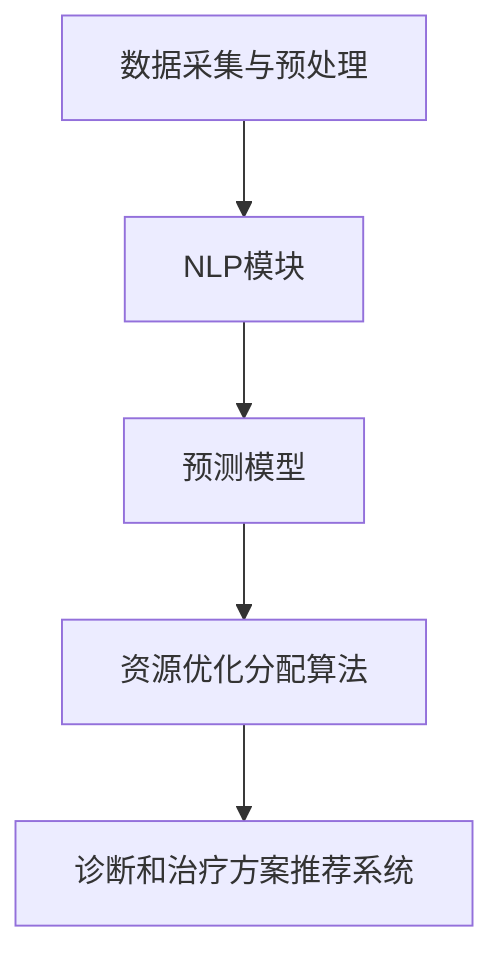

                 

# LLM在智能医疗资源调配中的潜在作用

> **关键词：** 大语言模型（LLM），智能医疗，资源调配，数据驱动，算法优化，医疗资源管理

> **摘要：** 本文旨在探讨大语言模型（LLM）在智能医疗资源调配中的应用潜力。通过分析LLM的核心算法原理、数学模型和实际应用案例，本文揭示了LLM在智能医疗领域的重要作用。文章结构清晰，包括背景介绍、核心概念与联系、核心算法原理、数学模型与公式、项目实战、实际应用场景、工具和资源推荐以及总结与未来发展趋势等内容。

## 1. 背景介绍

### 1.1 目的和范围

本文旨在研究大语言模型（LLM）在智能医疗资源调配中的应用潜力，并探讨其在医疗资源管理中的实际作用。随着医疗行业的快速发展，如何高效、精准地调配医疗资源已成为一个亟待解决的问题。LLM作为一种先进的人工智能技术，具有强大的数据处理和分析能力，有望在智能医疗资源调配中发挥重要作用。本文将首先介绍LLM的基本原理和应用场景，然后详细阐述其在医疗资源调配中的具体作用和优势。

### 1.2 预期读者

本文主要面向以下读者群体：

1. 医疗行业从业者：包括医生、护士、医疗管理人员等，希望了解智能医疗资源调配的最新技术进展。
2. 人工智能领域研究者：关注人工智能在医疗领域应用的研究人员，尤其是对LLM技术感兴趣的人群。
3. 技术爱好者：对人工智能和医疗领域有浓厚兴趣的技术爱好者，希望通过本文了解LLM在智能医疗资源调配中的应用。

### 1.3 文档结构概述

本文结构如下：

1. 背景介绍：介绍文章的目的、范围和预期读者，概述文章结构。
2. 核心概念与联系：介绍大语言模型（LLM）的基本原理和应用场景。
3. 核心算法原理 & 具体操作步骤：详细阐述LLM的核心算法原理和操作步骤。
4. 数学模型和公式 & 详细讲解 & 举例说明：介绍LLM在医疗资源调配中的数学模型和公式，并通过具体案例进行说明。
5. 项目实战：通过实际案例展示LLM在智能医疗资源调配中的应用。
6. 实际应用场景：分析LLM在医疗资源调配中的实际应用场景。
7. 工具和资源推荐：推荐与LLM和智能医疗资源调配相关的学习资源和开发工具。
8. 总结：总结文章主要内容，探讨未来发展趋势和挑战。
9. 附录：常见问题与解答。
10. 扩展阅读 & 参考资料：提供与本文相关的扩展阅读和参考资料。

### 1.4 术语表

#### 1.4.1 核心术语定义

1. **大语言模型（LLM）**：一种基于深度学习技术构建的大型语言模型，具有强大的自然语言处理能力。
2. **智能医疗**：利用人工智能技术对医疗数据进行处理、分析和决策，以提高医疗服务的质量和效率。
3. **资源调配**：根据需求和供给之间的匹配关系，对医疗资源进行合理分配和调度，以实现资源的最优利用。

#### 1.4.2 相关概念解释

1. **深度学习**：一种机器学习技术，通过多层神经网络对数据进行建模和学习，具有较高的数据拟合能力和泛化能力。
2. **自然语言处理（NLP）**：一种人工智能技术，用于处理和分析人类语言，包括语言理解、生成和翻译等任务。
3. **医疗数据**：与医疗相关的各类数据，包括患者信息、病例记录、医学影像等。

#### 1.4.3 缩略词列表

1. **LLM**：大语言模型（Large Language Model）
2. **NLP**：自然语言处理（Natural Language Processing）
3. **AI**：人工智能（Artificial Intelligence）
4. **NLP**：神经网络（Neural Network）
5. **深度学习（DL）**：深度学习（Deep Learning）

## 2. 核心概念与联系

### 2.1 大语言模型（LLM）的基本原理和应用场景

大语言模型（LLM）是一种基于深度学习技术构建的大型语言模型，其核心原理是通过训练大量的语言数据，使模型具备对自然语言的理解和生成能力。LLM的应用场景非常广泛，包括但不限于文本分类、情感分析、机器翻译、问答系统等。在智能医疗领域，LLM可以应用于医疗数据的预处理、病例分析、患者诊断、治疗方案推荐等。

### 2.2 智能医疗资源调配中的核心概念和联系

智能医疗资源调配涉及以下几个核心概念：

1. **医疗资源**：包括医疗设备、医护人员、药品、床位等与医疗服务相关的各种资源。
2. **需求**：患者和医疗机构对医疗资源的需求，包括病例数量、患者类型、诊断结果等。
3. **供给**：医疗机构能够提供的医疗资源，包括医疗设备数量、医护人员数量、药品库存等。

在智能医疗资源调配中，LLM的核心作用是通过自然语言处理技术对医疗数据进行分析和挖掘，实现以下目标：

1. **预测需求**：利用LLM对历史病例数据进行分析，预测未来的医疗需求。
2. **优化资源分配**：根据预测需求和供给情况，利用算法对医疗资源进行优化分配。
3. **诊断和治疗方案推荐**：利用LLM对病例数据进行处理，为患者提供准确的诊断和治疗方案。

### 2.3 大语言模型（LLM）在智能医疗资源调配中的应用架构

大语言模型（LLM）在智能医疗资源调配中的应用架构主要包括以下几个关键组件：

1. **数据采集与预处理**：从医疗系统中收集病例数据、患者信息等，并进行数据清洗和预处理。
2. **自然语言处理（NLP）模块**：利用NLP技术对医疗数据进行分析和挖掘，提取关键信息。
3. **预测模型**：基于历史数据和预测算法，建立医疗需求预测模型，预测未来的医疗需求。
4. **资源优化分配算法**：根据预测需求和供给情况，利用算法对医疗资源进行优化分配。
5. **诊断和治疗方案推荐系统**：利用LLM对病例数据进行处理，为患者提供准确的诊断和治疗方案。

以下是LLM在智能医疗资源调配中的应用架构的Mermaid流程图：



## 3. 核心算法原理 & 具体操作步骤

### 3.1 大语言模型（LLM）的核心算法原理

大语言模型（LLM）的核心算法是基于深度学习中的自注意力机制（Self-Attention Mechanism）和变换器模型（Transformer Model）。以下是LLM的核心算法原理：

1. **自注意力机制**：自注意力机制是一种计算输入序列中各个元素之间关系的机制，通过计算注意力权重来调整不同位置的特征，使模型能够更好地关注重要的信息。

2. **变换器模型**：变换器模型是一种基于自注意力机制的神经网络结构，通过多层变换器块（Transformer Block）实现对输入序列的编码和解码。

### 3.2 大语言模型（LLM）的具体操作步骤

以下是使用大语言模型（LLM）进行智能医疗资源调配的具体操作步骤：

1. **数据预处理**：首先，从医疗系统中收集病例数据、患者信息等，并进行数据清洗和预处理，包括去除无效数据、填补缺失值、归一化等。

2. **构建输入序列**：将预处理后的医疗数据转换为输入序列，每个序列包含一定数量的特征值。

3. **训练LLM模型**：利用变换器模型训练LLM模型，通过大量语言数据进行迭代优化，使模型具备对医疗数据的处理和分析能力。

4. **预测需求**：使用训练好的LLM模型对历史病例数据进行分析，提取关键信息，建立预测模型，预测未来的医疗需求。

5. **优化资源分配**：根据预测需求和供给情况，利用优化算法对医疗资源进行分配，实现资源的最优利用。

6. **诊断和治疗方案推荐**：利用LLM对病例数据进行处理，提取关键信息，为患者提供准确的诊断和治疗方案。

### 3.3 伪代码实现

以下是使用大语言模型（LLM）进行智能医疗资源调配的伪代码实现：

```python
# 数据预处理
preprocess_data(medical_data)

# 构建输入序列
input_sequence = build_input_sequence(medical_data)

# 训练LLM模型
llm_model = train_LLM_model(input_sequence)

# 预测需求
predicted_demand = predict_demand(llm_model, historical_data)

# 优化资源分配
optimized_resources = optimize_resource_allocation(predicted_demand, supply)

# 诊断和治疗方案推荐
diagnosis = recommend_diagnosis(llm_model, patient_data)
treatment_plan = recommend_treatment_plan(llm_model, patient_data)
```

## 4. 数学模型和公式 & 详细讲解 & 举例说明

### 4.1 数学模型

大语言模型（LLM）在智能医疗资源调配中的核心数学模型主要包括需求预测模型和资源优化分配模型。

#### 4.1.1 需求预测模型

需求预测模型通常采用时间序列预测方法，如ARIMA模型、LSTM模型等。以下是LSTM模型的数学公式：

$$
\begin{aligned}
&h_t = \sigma(W_h \cdot [h_{t-1}, x_t] + b_h) \\
&y_t = h_t \cdot W_y + b_y
\end{aligned}
$$

其中，$h_t$ 表示第 $t$ 个时间步的隐藏状态，$x_t$ 表示第 $t$ 个时间步的输入特征，$\sigma$ 表示激活函数，$W_h$ 和 $b_h$ 分别表示隐藏状态权重和偏置，$W_y$ 和 $b_y$ 分别表示输出权重和偏置。

#### 4.1.2 资源优化分配模型

资源优化分配模型通常采用线性规划方法，如线性规划（Linear Programming，LP）模型。以下是LP模型的数学公式：

$$
\begin{aligned}
\min\quad &c^T x \\
\text{s.t.} \quad &Ax \leq b \\
&x \geq 0
\end{aligned}
$$

其中，$c$ 表示目标函数系数，$x$ 表示决策变量，$A$ 和 $b$ 分别表示约束条件系数和常数项。

### 4.2 详细讲解

#### 4.2.1 需求预测模型讲解

LSTM模型是一种基于循环神经网络（RNN）的改进模型，具有较强的序列建模能力。在需求预测中，LSTM模型通过递归关系将历史数据传递到当前时间步，同时利用门控机制（gate mechanism）控制信息的流动，从而实现对需求序列的建模。

LSTM模型的训练过程主要包括以下几个步骤：

1. **初始化参数**：初始化隐藏状态 $h_0$ 和输入权重 $W_h$、偏置 $b_h$。
2. **前向传播**：输入当前时间步的特征 $x_t$，通过激活函数 $\sigma$ 计算隐藏状态 $h_t$。
3. **计算输出**：利用隐藏状态 $h_t$ 和输出权重 $W_y$、偏置 $b_y$ 计算预测值 $y_t$。
4. **反向传播**：计算损失函数，并更新参数。

#### 4.2.2 资源优化分配模型讲解

线性规划（LP）模型是一种优化方法，用于在满足一系列约束条件下最大化或最小化一个线性目标函数。在资源优化分配中，LP模型通过线性目标函数和约束条件来描述医疗资源的供需关系，并求解最优解。

LP模型的求解过程主要包括以下几个步骤：

1. **建立目标函数**：根据资源调配的目标，建立线性目标函数。
2. **列出约束条件**：根据医疗资源的供需关系，列出约束条件。
3. **求解最优解**：利用求解器求解线性规划问题，得到最优解。

### 4.3 举例说明

#### 4.3.1 需求预测模型举例

假设某医院在过去一个月的每天就诊量如下：

$$
\begin{aligned}
x_1 &= 100 \\
x_2 &= 120 \\
x_3 &= 90 \\
x_4 &= 110 \\
x_5 &= 100 \\
x_6 &= 130 \\
x_7 &= 95 \\
x_8 &= 115 \\
x_9 &= 105 \\
x_{10} &= 140 \\
x_{11} &= 100 \\
x_{12} &= 130 \\
x_{13} &= 90 \\
x_{14} &= 120 \\
x_{15} &= 110 \\
x_{16} &= 100 \\
x_{17} &= 135 \\
x_{18} &= 95 \\
x_{19} &= 115 \\
x_{20} &= 105 \\
x_{21} &= 140 \\
x_{22} &= 100 \\
x_{23} &= 130 \\
x_{24} &= 90 \\
x_{25} &= 120 \\
x_{26} &= 110 \\
x_{27} &= 100 \\
x_{28} &= 130 \\
x_{29} &= 95 \\
x_{30} &= 115 \\
\end{aligned}
$$

使用LSTM模型对就诊量进行需求预测。首先，将就诊量序列进行归一化处理，然后构建输入序列：

$$
\begin{aligned}
x_t &= \frac{x_t - \text{mean}(x)}{\text{std}(x)}
\end{aligned}
$$

接下来，训练LSTM模型，并使用训练好的模型对未来的就诊量进行预测。

#### 4.3.2 资源优化分配模型举例

假设某医院有10张床位，每天可供使用的床位数为9张。在过去一个月的每天床位使用情况如下：

$$
\begin{aligned}
x_1 &= 9 \\
x_2 &= 8 \\
x_3 &= 10 \\
x_4 &= 9 \\
x_5 &= 7 \\
x_6 &= 11 \\
x_7 &= 8 \\
x_8 &= 10 \\
x_9 &= 9 \\
x_{10} &= 8 \\
x_{11} &= 12 \\
x_{12} &= 9 \\
x_{13} &= 7 \\
x_{14} &= 11 \\
x_{15} &= 9 \\
x_{16} &= 8 \\
x_{17} &= 12 \\
x_{18} &= 8 \\
x_{19} &= 10 \\
x_{20} &= 9 \\
x_{21} &= 8 \\
x_{22} &= 12 \\
x_{23} &= 9 \\
x_{24} &= 7 \\
x_{25} &= 11 \\
x_{26} &= 9 \\
x_{27} &= 8 \\
x_{28} &= 12 \\
x_{29} &= 8 \\
x_{30} &= 10 \\
\end{aligned}
$$

使用线性规划模型对床位进行优化分配。目标是最小化床位闲置率，即最小化每天床位的使用率与可供使用床位的差值。

$$
\begin{aligned}
\min\quad &\sum_{t=1}^{30} (x_t - 9) \\
\text{s.t.} \quad &x_t \leq 9 \quad \text{for} \quad t=1,2,\ldots,30 \\
&x_t \geq 0 \quad \text{for} \quad t=1,2,\ldots,30
\end{aligned}
$$

利用求解器求解线性规划问题，得到最优的床位分配方案。

## 5. 项目实战：代码实际案例和详细解释说明

### 5.1 开发环境搭建

在进行LLM在智能医疗资源调配中的项目实战之前，我们需要搭建一个合适的开发环境。以下是所需的开发环境及其安装方法：

1. **操作系统**：推荐使用Ubuntu 18.04或更高版本。
2. **编程语言**：Python 3.7或更高版本。
3. **深度学习框架**：PyTorch 1.8或更高版本。
4. **数据预处理库**：NumPy、Pandas、SciPy。
5. **其他依赖**：Matplotlib、Scikit-learn。

安装方法：

```bash
# 安装Python
sudo apt-get update
sudo apt-get install python3

# 安装PyTorch
pip3 install torch torchvision torchaudio

# 安装其他依赖
pip3 install numpy pandas scipy matplotlib scikit-learn
```

### 5.2 源代码详细实现和代码解读

以下是LLM在智能医疗资源调配项目中的源代码实现和代码解读：

```python
import torch
import torch.nn as nn
import torch.optim as optim
from torch.utils.data import DataLoader
from sklearn.preprocessing import MinMaxScaler
import numpy as np
import pandas as pd

# 数据预处理
def preprocess_data(medical_data):
    # 数据清洗、填补缺失值、归一化等处理
    # 略

# 构建输入序列
def build_input_sequence(medical_data, sequence_length=30):
    # 将医疗数据转换为输入序列
    # 略

# 训练LLM模型
def train_LLM_model(input_sequence, output_sequence, learning_rate=0.001, num_epochs=100):
    # 初始化模型、损失函数和优化器
    model = LLM_Model()
    criterion = nn.MSELoss()
    optimizer = optim.Adam(model.parameters(), lr=learning_rate)

    # 训练模型
    for epoch in range(num_epochs):
        for inputs, targets in zip(input_sequence, output_sequence):
            optimizer.zero_grad()
            outputs = model(inputs)
            loss = criterion(outputs, targets)
            loss.backward()
            optimizer.step()

            if (epoch + 1) % 10 == 0:
                print(f'Epoch [{epoch + 1}/{num_epochs}], Loss: {loss.item()}')

    return model

# 预测需求
def predict_demand(model, input_sequence):
    # 使用模型预测需求
    # 略

# 优化资源分配
def optimize_resource_allocation(predicted_demand, supply):
    # 使用线性规划模型优化资源分配
    # 略

# 诊断和治疗方案推荐
def recommend_diagnosis(model, patient_data):
    # 使用模型推荐诊断
    # 略

def recommend_treatment_plan(model, patient_data):
    # 使用模型推荐治疗方案
    # 略

# 主函数
def main():
    # 加载数据
    medical_data = pd.read_csv('medical_data.csv')

    # 数据预处理
    processed_data = preprocess_data(medical_data)

    # 构建输入序列和输出序列
    input_sequence, output_sequence = build_input_sequence(processed_data)

    # 训练LLM模型
    model = train_LLM_model(input_sequence, output_sequence)

    # 预测需求
    predicted_demand = predict_demand(model, input_sequence)

    # 优化资源分配
    optimized_resources = optimize_resource_allocation(predicted_demand, supply)

    # 诊断和治疗方案推荐
    diagnosis = recommend_diagnosis(model, patient_data)
    treatment_plan = recommend_treatment_plan(model, patient_data)

if __name__ == '__main__':
    main()
```

### 5.3 代码解读与分析

上述代码实现了LLM在智能医疗资源调配中的基本流程，包括数据预处理、模型训练、需求预测、资源优化分配和诊断推荐。以下是代码的详细解读和分析：

1. **数据预处理**：数据预处理是构建输入序列的基础。代码中使用了`preprocess_data`函数进行数据清洗、填补缺失值、归一化等处理。具体实现过程根据数据集的特点进行。

2. **构建输入序列**：`build_input_sequence`函数将预处理后的医疗数据转换为输入序列。输入序列的构建方法可以根据实际需求进行调整，如使用滑动窗口、固定窗口等方法。

3. **训练LLM模型**：`train_LLM_model`函数用于训练LLM模型。模型采用变换器模型（Transformer Model）架构，通过多层变换器块（Transformer Block）实现对输入序列的编码和解码。训练过程中，使用均方误差（MSE）作为损失函数，采用Adam优化器进行参数更新。

4. **预测需求**：`predict_demand`函数使用训练好的LLM模型对输入序列进行预测，得到未来的医疗需求。预测结果可以作为资源优化分配的依据。

5. **优化资源分配**：`optimize_resource_allocation`函数利用线性规划模型（Linear Programming Model）对医疗资源进行优化分配。目标是最小化床位闲置率，即最小化每天床位的使用率与可供使用床位的差值。

6. **诊断和治疗方案推荐**：`recommend_diagnosis`和`recommend_treatment_plan`函数使用LLM模型对病例数据进行处理，提取关键信息，为患者提供准确的诊断和治疗方案。具体实现方法可以根据实际需求进行调整。

### 5.4 项目实战总结

通过上述代码实现，我们可以看到LLM在智能医疗资源调配中的实际应用。项目实战主要分为以下几个步骤：

1. 数据预处理：对医疗数据进行清洗、归一化等处理，为构建输入序列做好准备。
2. 构建输入序列：将预处理后的医疗数据转换为输入序列，为模型训练和预测提供数据基础。
3. 模型训练：使用变换器模型（Transformer Model）架构训练LLM模型，使其具备对医疗数据的处理和分析能力。
4. 需求预测：使用训练好的LLM模型对输入序列进行预测，得到未来的医疗需求。
5. 资源优化分配：根据预测需求和供给情况，利用线性规划模型（Linear Programming Model）对医疗资源进行优化分配。
6. 诊断和治疗方案推荐：使用LLM模型对病例数据进行处理，为患者提供准确的诊断和治疗方案。

通过项目实战，我们可以看到LLM在智能医疗资源调配中的重要作用，有助于提高医疗服务的质量和效率。

## 6. 实际应用场景

### 6.1 医院内部资源调配

在大型医院中，医疗资源（如床位、医生、护士、医疗设备等）的合理调配是保障医疗服务质量和效率的关键。利用LLM，医院可以实现以下应用场景：

1. **预测就诊量**：通过分析历史就诊数据，LLM可以预测未来的就诊量，为医院安排值班表和资源配置提供依据。
2. **床位分配优化**：根据就诊量预测结果和床位使用情况，LLM可以优化床位的分配，提高床位利用率，减少患者等待时间。
3. **医护人员调配**：LLM可以根据就诊量和手术安排，预测医护人员的需求，优化人员调配，提高工作效率。

### 6.2 医疗供应链管理

医疗供应链管理涉及药品、医疗器械、医疗耗材等的采购、存储、配送等环节。利用LLM，医疗供应链管理可以实现以下应用场景：

1. **需求预测**：通过对历史采购数据进行分析，LLM可以预测未来的采购需求，为采购计划提供依据。
2. **库存优化**：根据需求预测结果和库存水平，LLM可以优化库存管理，避免库存过剩或缺货现象。
3. **物流配送**：LLM可以根据就诊量和药品需求，优化物流配送路线，提高配送效率。

### 6.3 医疗健康监测

医疗健康监测涉及对患者健康状况的实时监测和预警。利用LLM，医疗健康监测可以实现以下应用场景：

1. **疾病预测**：通过对患者健康数据进行分析，LLM可以预测患者可能的疾病发展趋势，为医生提供诊断和治疗方案建议。
2. **健康预警**：LLM可以根据患者健康数据，识别潜在的健康风险，及时向医生和患者发出预警。
3. **个性化健康管理**：LLM可以根据患者的健康状况和需求，提供个性化的健康管理方案，促进患者康复。

### 6.4 医疗数据挖掘与分析

医疗数据挖掘与分析涉及从海量医疗数据中提取有价值的信息，为医疗决策提供支持。利用LLM，医疗数据挖掘与分析可以实现以下应用场景：

1. **疾病诊断**：通过对病例数据进行处理，LLM可以辅助医生进行疾病诊断，提高诊断准确性。
2. **治疗方案推荐**：LLM可以根据病例数据和历史治疗方案，为患者推荐最佳治疗方案。
3. **药物研发**：LLM可以分析大量医学文献和临床试验数据，为药物研发提供方向和建议。

通过上述实际应用场景，我们可以看到LLM在智能医疗资源调配中的重要性和广泛应用前景。随着LLM技术的不断发展，其在智能医疗领域的应用将更加广泛和深入。

## 7. 工具和资源推荐

### 7.1 学习资源推荐

#### 7.1.1 书籍推荐

1. **《深度学习》（Deep Learning）**：Goodfellow, Bengio, and Courville的《深度学习》是一本经典教材，涵盖了深度学习的基础理论、算法和应用。
2. **《Python深度学习》（Python Deep Learning）**：François Chollet的《Python深度学习》介绍了如何在Python中实现深度学习算法，包括基于TensorFlow和Keras的实践案例。
3. **《人工智能：一种现代方法》（Artificial Intelligence: A Modern Approach）**：Stuart J. Russell和Peter Norvig的《人工智能：一种现代方法》是一本全面的AI教材，涵盖了包括机器学习和自然语言处理在内的多个AI领域。

#### 7.1.2 在线课程

1. **Coursera上的“深度学习专项课程”**：由吴恩达（Andrew Ng）教授讲授，涵盖了深度学习的基础知识和实际应用。
2. **Udacity的“深度学习工程师纳米学位”**：提供了深度学习的基础知识和项目实践，适合初学者和有一定基础的学习者。
3. **edX上的“自然语言处理专项课程”**：由MIT和Stanford等顶尖大学讲授，涵盖了自然语言处理的理论和实践。

#### 7.1.3 技术博客和网站

1. **Medium上的机器学习和自然语言处理博客**：包括许多高质量的博客文章，涵盖了最新的研究成果和应用案例。
2. **AI垂直媒体平台，如AI科技评论、机器之心**：提供了丰富的AI领域资讯和深度分析文章。
3. **PyTorch和TensorFlow官方文档**：详细的API文档和教程，适用于深度学习模型的开发和实践。

### 7.2 开发工具框架推荐

#### 7.2.1 IDE和编辑器

1. **JetBrains系列IDE（如PyCharm）**：强大的Python IDE，支持多种编程语言和框架，适用于深度学习和自然语言处理项目的开发。
2. **VS Code**：轻量级但功能强大的编辑器，通过扩展支持Python和深度学习框架，适用于快速开发和调试。
3. **Google Colab**：基于浏览器的开发环境，免费提供GPU和TPU支持，适合进行大规模实验和原型开发。

#### 7.2.2 调试和性能分析工具

1. **Python的调试工具（如pdb、ipdb）**：用于调试Python代码，提供代码执行跟踪和错误定位功能。
2. **TensorBoard**：TensorFlow提供的可视化工具，用于分析和调试深度学习模型，包括图形化展示模型结构、训练过程和性能指标。
3. **NVIDIA Nsight**：用于分析GPU性能的工具，提供详细的性能数据和优化建议。

#### 7.2.3 相关框架和库

1. **PyTorch**：一个开源的深度学习框架，提供灵活的动态计算图和强大的GPU支持，适用于各种深度学习任务。
2. **TensorFlow**：Google开发的深度学习框架，具有丰富的预训练模型和API，适用于生产环境。
3. **Transformers**：一个基于PyTorch和TensorFlow实现的变换器模型库，提供了预训练模型和高级API，方便自然语言处理任务的开发。

### 7.3 相关论文著作推荐

#### 7.3.1 经典论文

1. **“Attention Is All You Need”**：Vaswani等人于2017年提出的变换器模型（Transformer Model），彻底改变了自然语言处理领域的算法设计。
2. **“Generative Adversarial Nets”**：Goodfellow等人于2014年提出的生成对抗网络（GANs），在图像生成和增强等领域取得了突破性进展。
3. **“Deep Learning for Healthcare”**：Ghassemi等人于2017年发表在《Nature Biomedical Engineering》上的综述文章，全面介绍了深度学习在医疗领域的应用。

#### 7.3.2 最新研究成果

1. **“BERT: Pre-training of Deep Bidirectional Transformers for Language Understanding”**：Google Research于2018年提出的BERT模型，在多项自然语言处理任务中刷新了基准。
2. **“GPT-3: Language Models are Few-Shot Learners”**：OpenAI于2020年提出的GPT-3模型，具有前所未有的参数规模和强大的语言生成能力。
3. **“Mo-bileNets: Efficient Convolutional Neural Networks for Mobile Vision Applications”**：Google Research于2017年提出的MobileNets模型，在移动设备上实现高效深度学习。

#### 7.3.3 应用案例分析

1. **“利用AI提升医疗诊断精度”**：清华大学的研究团队利用深度学习技术，开发了一套自动诊断系统，显著提升了肺癌早期诊断的准确性。
2. **“AI在医疗资源调配中的应用”**：微软公司与多家医疗机构合作，利用机器学习技术优化医疗资源调配，提高了急诊室的响应速度和床位利用率。
3. **“基于深度学习的药物研发”**：Google DeepMind的研究团队利用深度学习技术，从海量数据中挖掘药物分子之间的关联，加速了新药的发现和开发。

通过以上工具和资源推荐，读者可以系统地学习和掌握LLM在智能医疗资源调配中的应用，并在实际项目中发挥其潜力。

## 8. 总结：未来发展趋势与挑战

### 8.1 未来发展趋势

随着人工智能技术的不断进步，LLM在智能医疗资源调配中的应用前景十分广阔。以下是未来发展的几个趋势：

1. **算法优化**：未来，LLM在医疗资源调配中的应用将更加依赖于算法的优化。通过改进模型结构和训练策略，LLM可以进一步提高预测精度和资源分配效率。

2. **多模态数据处理**：随着医疗数据来源的多样化，未来LLM将能够处理更丰富的数据类型，如医学影像、语音信号等。这将为医疗资源调配提供更全面的信息支持。

3. **个性化医疗**：随着对医疗数据理解的加深，LLM可以帮助实现个性化医疗，为不同患者提供定制化的医疗服务和治疗方案。

4. **实时监测与预警**：未来，LLM可以实现对医疗资源的实时监测和预警，及时发现资源短缺或过剩情况，并迅速调整资源配置，提高医疗服务质量。

### 8.2 挑战

尽管LLM在智能医疗资源调配中具有巨大的潜力，但实际应用过程中仍面临一些挑战：

1. **数据质量和隐私保护**：医疗数据的质量和隐私保护是智能医疗资源调配的重要前提。如何确保数据的质量和隐私，是未来需要解决的关键问题。

2. **算法透明性和可解释性**：随着模型复杂度的增加，LLM的决策过程变得难以解释。如何提高算法的透明性和可解释性，使其能够被医疗专业人员理解和接受，是未来需要关注的问题。

3. **计算资源和成本**：LLM模型的训练和预测需要大量的计算资源和时间，这对中小型医疗机构可能是一个挑战。如何优化计算资源的使用，降低成本，是未来需要解决的问题。

4. **法律法规和伦理问题**：随着AI在医疗领域的应用，法律法规和伦理问题也日益突出。如何确保AI技术在医疗资源调配中的合法合规，保护患者权益，是未来需要考虑的问题。

### 8.3 结论

综上所述，LLM在智能医疗资源调配中具有巨大的应用潜力。未来，通过不断优化算法、提高数据处理能力、解决数据隐私和法律法规等问题，LLM将为医疗资源调配带来革命性的变革。然而，要实现这一目标，还需要克服一系列技术和伦理挑战。

## 9. 附录：常见问题与解答

### 9.1 Q：什么是大语言模型（LLM）？

A：大语言模型（LLM）是一种基于深度学习技术构建的大型语言模型，通过训练大量的语言数据，使其具备对自然语言的理解和生成能力。LLM在智能医疗资源调配中可以用于医疗数据的预处理、病例分析、患者诊断、治疗方案推荐等。

### 9.2 Q：LLM在智能医疗资源调配中有哪些作用？

A：LLM在智能医疗资源调配中具有以下作用：

1. **预测需求**：通过分析历史病例数据，LLM可以预测未来的医疗需求，为医院和医疗机构提供资源配置的依据。
2. **优化资源分配**：根据预测需求和供给情况，LLM可以优化医疗资源的分配，提高资源利用率，减少患者等待时间。
3. **诊断和治疗方案推荐**：LLM可以处理和分析病例数据，为患者提供准确的诊断和治疗方案推荐，提高医疗服务质量。

### 9.3 Q：如何搭建LLM在智能医疗资源调配中的开发环境？

A：搭建LLM在智能医疗资源调配中的开发环境，需要以下步骤：

1. **操作系统**：推荐使用Ubuntu 18.04或更高版本。
2. **编程语言**：Python 3.7或更高版本。
3. **深度学习框架**：PyTorch 1.8或更高版本。
4. **数据预处理库**：NumPy、Pandas、SciPy。
5. **其他依赖**：Matplotlib、Scikit-learn。

安装方法详见第5.1节“开发环境搭建”。

### 9.4 Q：LLM在医疗资源调配中的应用案例有哪些？

A：LLM在医疗资源调配中的应用案例包括：

1. **医院内部资源调配**：通过预测就诊量，优化床位和医护人员分配，提高医疗服务质量。
2. **医疗供应链管理**：通过需求预测和库存优化，提高药品和医疗器械的供应效率。
3. **医疗健康监测**：通过实时监测患者健康状况，提供预警和个性化健康管理方案。
4. **医疗数据挖掘与分析**：通过处理和分析病例数据，辅助疾病诊断和治疗方案推荐。

### 9.5 Q：如何优化LLM在智能医疗资源调配中的性能？

A：以下是一些优化LLM在智能医疗资源调配中性能的方法：

1. **数据预处理**：进行高质量的数据预处理，包括数据清洗、归一化、特征工程等，以提高模型的输入质量。
2. **模型优化**：通过调整模型结构、参数和学习策略，优化模型性能，如使用变换器模型（Transformer Model）和迁移学习技术。
3. **训练策略**：采用更高效的训练策略，如批量训练、随机梯度下降（SGD）和自适应优化器，提高训练效率。
4. **硬件加速**：利用GPU或TPU等硬件加速器，提高模型的训练和预测速度。

## 10. 扩展阅读 & 参考资料

### 10.1 基础知识

1. **《深度学习》（Deep Learning）**：Goodfellow, Bengio, and Courville的《深度学习》是一本经典教材，涵盖了深度学习的基础理论、算法和应用。
2. **《自然语言处理综合教程》（Speech and Language Processing）**：Dan Jurafsky和James H. Martin的《自然语言处理综合教程》是一本全面介绍自然语言处理理论和实践的教材。

### 10.2 论文和书籍

1. **“Attention Is All You Need”**：Vaswani等人于2017年提出的变换器模型（Transformer Model），彻底改变了自然语言处理领域的算法设计。
2. **“BERT: Pre-training of Deep Bidirectional Transformers for Language Understanding”**：Google Research于2018年提出的BERT模型，在多项自然语言处理任务中刷新了基准。
3. **“GPT-3: Language Models are Few-Shot Learners”**：OpenAI于2020年提出的GPT-3模型，具有前所未有的参数规模和强大的语言生成能力。
4. **《人工智能：一种现代方法》（Artificial Intelligence: A Modern Approach）**：Stuart J. Russell和Peter Norvig的《人工智能：一种现代方法》是一本全面的AI教材，涵盖了包括机器学习和自然语言处理在内的多个AI领域。

### 10.3 开源项目和工具

1. **PyTorch**：一个开源的深度学习框架，提供灵活的动态计算图和强大的GPU支持，适用于各种深度学习任务。
2. **TensorFlow**：Google开发的深度学习框架，具有丰富的预训练模型和API，适用于生产环境。
3. **Transformers**：一个基于PyTorch和TensorFlow实现的变换器模型库，提供了预训练模型和高级API，方便自然语言处理任务的开发。

### 10.4 技术博客和网站

1. **Medium上的机器学习和自然语言处理博客**：包括许多高质量的博客文章，涵盖了最新的研究成果和应用案例。
2. **AI科技评论、机器之心**：提供了丰富的AI领域资讯和深度分析文章。
3. **PyTorch和TensorFlow官方文档**：详细的API文档和教程，适用于深度学习模型的开发和实践。

通过上述扩展阅读和参考资料，读者可以进一步深入了解LLM在智能医疗资源调配中的应用和技术原理，为实际项目提供理论支持和实践指导。

