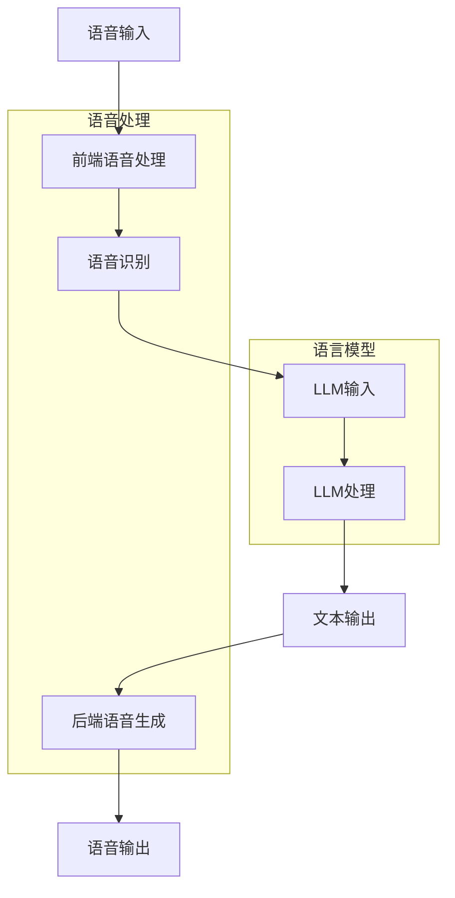

                 

# LLM在智能语音助手中的应用：自然交互的新境界

> **关键词**：LLM、自然语言处理、智能语音助手、对话系统、深度学习、自然交互
>
> **摘要**：本文深入探讨了大型语言模型（LLM）在智能语音助手中的应用，揭示了其如何通过深度学习技术，实现了自然交互的新境界。文章首先介绍了智能语音助手的发展背景和核心需求，然后详细阐述了LLM的工作原理、架构以及其在语音识别和语音生成中的关键作用。通过实际项目案例，我们展示了如何利用LLM构建高效的智能语音助手，并分析了其在不同应用场景中的表现。最后，文章展望了未来发展趋势与挑战，为读者提供了实用的工具和资源推荐。

## 1. 背景介绍

### 1.1 目的和范围

本文旨在探讨大型语言模型（LLM）在智能语音助手中的应用，通过理论分析、算法讲解和实际项目案例，全面揭示LLM如何通过深度学习技术，提升智能语音助手的交互能力和用户体验。文章将涵盖以下几个主要方面：

1. **智能语音助手的发展背景和需求**：介绍智能语音助手的起源、发展历程以及其与人类日常生活的紧密联系。
2. **LLM的工作原理和架构**：深入讲解LLM的基本概念、核心技术以及其在自然语言处理中的应用。
3. **LLM在智能语音助手中的应用**：分析LLM在语音识别和语音生成中的关键作用，并通过实际项目案例展示其应用效果。
4. **未来发展趋势与挑战**：探讨LLM在智能语音助手领域的发展前景，以及面临的挑战和解决方案。

### 1.2 预期读者

本文适合以下读者群体：

1. **人工智能领域的研究人员和开发者**：对自然语言处理、深度学习等前沿技术有兴趣，希望了解LLM在智能语音助手中的应用。
2. **智能语音助手项目开发者**：负责智能语音助手项目的开发和优化，希望提升产品的交互能力和用户体验。
3. **计算机科学和工程专业的学生**：对自然语言处理和人工智能领域感兴趣，希望深入了解相关技术原理和应用。
4. **技术爱好者**：对智能语音助手技术感兴趣，希望了解其工作原理和实现方法。

### 1.3 文档结构概述

本文分为以下几个部分：

1. **背景介绍**：介绍智能语音助手的发展背景和LLM的基本概念。
2. **核心概念与联系**：讲解LLM的工作原理和架构，提供Mermaid流程图。
3. **核心算法原理 & 具体操作步骤**：详细阐述LLM在语音识别和语音生成中的应用，使用伪代码进行算法讲解。
4. **数学模型和公式 & 详细讲解 & 举例说明**：介绍LLM的数学模型，使用latex格式进行公式展示和解释。
5. **项目实战：代码实际案例和详细解释说明**：展示实际项目案例，提供代码实现和详细解读。
6. **实际应用场景**：分析LLM在不同应用场景中的表现。
7. **工具和资源推荐**：推荐学习资源、开发工具和框架。
8. **总结：未来发展趋势与挑战**：展望LLM在智能语音助手领域的发展前景。
9. **附录：常见问题与解答**：解答读者可能遇到的问题。
10. **扩展阅读 & 参考资料**：提供相关文献和资料，便于进一步学习。

### 1.4 术语表

#### 1.4.1 核心术语定义

- **大型语言模型（LLM）**：一种基于深度学习的自然语言处理模型，能够理解、生成和翻译自然语言。
- **语音识别**：将语音信号转换为文本的过程。
- **语音生成**：根据文本生成自然流畅的语音的过程。
- **对话系统**：能够与人类进行自然交互的计算机系统。
- **深度学习**：一种基于神经网络的机器学习技术，通过多层神经网络对大量数据进行训练，从而实现复杂的模式识别和预测。

#### 1.4.2 相关概念解释

- **自然语言处理（NLP）**：研究如何让计算机理解和处理自然语言的学科。
- **神经网络**：一种由大量神经元组成的计算模型，能够通过学习大量数据来提取特征和进行预测。
- **卷积神经网络（CNN）**：一种用于图像识别和处理的神经网络模型，通过卷积操作提取图像特征。
- **循环神经网络（RNN）**：一种用于序列数据处理的神经网络模型，通过循环结构保存历史信息。
- **Transformer**：一种基于自注意力机制的深度学习模型，广泛用于自然语言处理任务。

#### 1.4.3 缩略词列表

- **LLM**：Large Language Model
- **NLP**：Natural Language Processing
- **CNN**：Convolutional Neural Network
- **RNN**：Recurrent Neural Network
- **Transformer**：Transformer Model

## 2. 核心概念与联系

在深入探讨LLM在智能语音助手中的应用之前，我们需要了解一些核心概念和它们之间的关系。以下是LLM的关键组成部分及其相互作用的Mermaid流程图。

### 2.1. Mermaid流程图



### 2.2. 核心概念解释

- **语音输入**：用户通过语音设备（如麦克风）输入语音信号。
- **前端语音处理**：对语音信号进行预处理，如降噪、归一化等，以提高语音识别的准确性。
- **语音识别**：使用深度学习模型（如卷积神经网络或循环神经网络）将语音信号转换为文本。
- **LLM输入**：将转换后的文本输入到LLM中。
- **LLM处理**：LLM对输入文本进行处理，生成相应的回答或响应。
- **文本输出**：LLM生成的文本经过后处理，如语法检查、格式化等，然后输出给用户。
- **后端语音生成**：使用语音合成技术将文本输出转换为自然流畅的语音。
- **语音输出**：将生成的语音输出给用户。

通过上述流程，我们可以看到LLM在智能语音助手中的核心作用，即通过处理自然语言文本，实现与用户的自然交互。

### 2.3. 关系分析

- **语音输入与前端语音处理**：语音输入是智能语音助手的基础，前端语音处理则对语音信号进行预处理，以提高识别准确性。
- **语音识别与LLM输入**：语音识别将语音信号转换为文本，为LLM提供输入数据。LLM处理能力的高低直接决定了语音识别的准确性和语义理解能力。
- **LLM处理与文本输出**：LLM通过对输入文本进行处理，生成自然流畅的文本输出。这个过程中，LLM的模型结构、训练数据质量和优化策略都至关重要。
- **文本输出与后端语音生成**：文本输出经过后处理，如语法检查、格式化等，然后通过语音合成技术生成自然流畅的语音，输出给用户。

综上所述，LLM在智能语音助手中的应用涉及到多个环节的协同工作，从语音输入到语音输出，每个环节都离不开深度学习和自然语言处理技术的支持。通过优化各个环节，可以显著提升智能语音助手的交互能力和用户体验。

## 3. 核心算法原理 & 具体操作步骤

### 3.1. LLM的工作原理

大型语言模型（LLM）是基于深度学习技术构建的，其核心思想是通过训练大量的文本数据，使模型学会理解和生成自然语言。LLM通常采用基于Transformer的架构，这是一种自注意力机制的网络模型，能够有效处理长序列数据，并捕捉句子中不同位置之间的复杂关系。

#### 3.1.1. Transformer模型概述

Transformer模型由Vaswani等人于2017年提出，其核心思想是引入自注意力机制，取代传统循环神经网络中的循环结构。自注意力机制允许模型在处理每个词时，自动调整对其他词的权重，从而更好地捕捉句子中的长距离依赖关系。

Transformer模型的主要组成部分包括：

- **编码器（Encoder）**：负责处理输入序列，生成序列的表示。
- **解码器（Decoder）**：负责生成输出序列，通常在解码过程中使用编码器的输出作为上下文信息。

#### 3.1.2. LLM在语音识别中的应用

在语音识别中，LLM主要用于将转换后的文本（由语音识别系统生成）转换为更自然、更符合人类交流习惯的文本。这一过程涉及到以下几个关键步骤：

1. **文本预处理**：对语音识别生成的文本进行清洗、去噪和格式化，以提高后续处理的质量。
2. **输入到LLM**：将预处理后的文本输入到LLM中进行处理。
3. **生成优化文本**：LLM通过自注意力机制和大规模训练数据，生成更符合人类语言习惯的优化文本。
4. **输出结果**：将优化后的文本输出给用户，或者作为后续语音生成的输入。

### 3.2. LLM在语音生成中的应用

在语音生成中，LLM主要用于将文本转换为自然流畅的语音。这一过程涉及到以下关键步骤：

1. **文本输入**：将待合成的文本输入到LLM中。
2. **语音特征提取**：LLM对输入文本进行处理，提取语音特征，如音调、音速等。
3. **语音合成**：使用语音合成技术，如WaveNet、Flite等，将提取的语音特征转换为音频信号。
4. **音频输出**：将生成的音频信号输出给用户。

### 3.3. LLM的工作流程

以下是LLM在智能语音助手中的具体工作流程：

1. **语音输入**：用户通过麦克风输入语音信号。
2. **前端语音处理**：对语音信号进行降噪、归一化等预处理操作。
3. **语音识别**：使用深度学习模型（如卷积神经网络或循环神经网络）将语音信号转换为文本。
4. **文本预处理**：对语音识别生成的文本进行清洗、去噪和格式化。
5. **输入到LLM**：将预处理后的文本输入到LLM中进行处理。
6. **生成优化文本**：LLM通过自注意力机制和大规模训练数据，生成更符合人类语言习惯的优化文本。
7. **语音合成**：使用语音合成技术，如WaveNet、Flite等，将优化后的文本转换为音频信号。
8. **音频输出**：将生成的音频信号输出给用户。

### 3.4. 伪代码讲解

以下是LLM在语音识别和语音生成中的伪代码示例：

```python
# 语音识别中的LLM应用
def recognize_speech(speech_signal):
    # 前端语音处理
    preprocessed_speech = preprocess_speech(speech_signal)
    
    # 语音识别
    recognized_text = speech_recognition(preprocessed_speech)
    
    # 文本预处理
    cleaned_text = preprocess_text(recognized_text)
    
    # 输入到LLM
    optimized_text = LLM_process(cleaned_text)
    
    return optimized_text

# 语音生成中的LLM应用
def generate_speech(text):
    # 输入到LLM
    speech_features = LLM_process(text)
    
    # 语音合成
    audio_signal = speech_synthesis(speech_features)
    
    return audio_signal
```

通过上述伪代码，我们可以看到LLM在语音识别和语音生成中的关键作用。在实际应用中，LLM的性能和效果取决于模型的架构、训练数据和优化策略。通过不断优化和改进，LLM可以为智能语音助手带来更高的交互能力和用户体验。

## 4. 数学模型和公式 & 详细讲解 & 举例说明

在深入探讨大型语言模型（LLM）的数学模型之前，我们需要了解一些基本的数学概念和公式，这些是构建和优化LLM的基础。以下我们将介绍与LLM相关的关键数学模型和公式，并使用LaTeX格式进行展示，以便读者更好地理解。

### 4.1. 自注意力机制（Self-Attention）

自注意力机制是Transformer模型的核心组成部分，它允许模型在处理每个词时，自动调整对其他词的权重。自注意力机制的计算公式如下：

\[ \text{Attention}(Q, K, V) = \text{softmax}\left(\frac{QK^T}{\sqrt{d_k}}\right) V \]

其中：
- \( Q \) 是查询向量，表示模型对当前词的注意力权重。
- \( K \) 是键向量，表示模型对其他词的注意力权重。
- \( V \) 是值向量，表示模型对其他词的注意力结果。
- \( d_k \) 是键向量的维度。

### 4.2. 编码器（Encoder）和解码器（Decoder）

编码器（Encoder）和解码器（Decoder）是Transformer模型的主要组成部分。编码器负责处理输入序列，生成序列的表示；解码器负责生成输出序列，通常在解码过程中使用编码器的输出作为上下文信息。以下是编码器和解码器的计算公式：

#### 4.2.1. 编码器（Encoder）

\[ \text{Encoder}(X) = \text{LayerNorm}(X + \text{Sublayer}(X)) \]

其中：
- \( X \) 是输入序列。
- \( \text{Sublayer}(X) \) 是子层，包括自注意力机制和前馈神经网络。

#### 4.2.2. 解码器（Decoder）

\[ \text{Decoder}(Y) = \text{LayerNorm}(Y + \text{Sublayer}(Y + \text{Encoder}(X))) \]

其中：
- \( Y \) 是输出序列。
- \( \text{Encoder}(X) \) 是编码器的输出。

### 4.3. 举例说明

#### 4.3.1. 自注意力计算举例

假设我们有以下词向量：

\[ Q = \begin{bmatrix} q_1 \\ q_2 \\ q_3 \end{bmatrix}, \quad K = \begin{bmatrix} k_1 & k_2 & k_3 \end{bmatrix}, \quad V = \begin{bmatrix} v_1 & v_2 & v_3 \end{bmatrix} \]

其中，\( d_k = 3 \)。

自注意力计算步骤如下：

1. 计算点积 \( QK^T \)：

\[ QK^T = \begin{bmatrix} q_1k_1 & q_1k_2 & q_1k_3 \\ q_2k_1 & q_2k_2 & q_2k_3 \\ q_3k_1 & q_3k_2 & q_3k_3 \end{bmatrix} \]

2. 除以 \( \sqrt{d_k} \)：

\[ \frac{QK^T}{\sqrt{d_k}} = \begin{bmatrix} \frac{q_1k_1}{\sqrt{3}} & \frac{q_1k_2}{\sqrt{3}} & \frac{q_1k_3}{\sqrt{3}} \\ \frac{q_2k_1}{\sqrt{3}} & \frac{q_2k_2}{\sqrt{3}} & \frac{q_2k_3}{\sqrt{3}} \\ \frac{q_3k_1}{\sqrt{3}} & \frac{q_3k_2}{\sqrt{3}} & \frac{q_3k_3}{\sqrt{3}} \end{bmatrix} \]

3. 计算softmax：

\[ \text{softmax}(\frac{QK^T}{\sqrt{d_k}}) = \begin{bmatrix} s_1 & s_2 & s_3 \\ s_1 & s_2 & s_3 \\ s_1 & s_2 & s_3 \end{bmatrix} \]

4. 乘以值向量 \( V \)：

\[ \text{Attention}(Q, K, V) = \begin{bmatrix} s_1v_1 & s_1v_2 & s_1v_3 \\ s_1v_1 & s_1v_2 & s_1v_3 \\ s_1v_1 & s_1v_2 & s_1v_3 \end{bmatrix} \]

#### 4.3.2. 编码器与解码器计算举例

假设我们有以下输入序列 \( X = [x_1, x_2, x_3] \) 和输出序列 \( Y = [y_1, y_2] \)。

1. **编码器计算**：

\[ \text{Encoder}(X) = \text{LayerNorm}(X + \text{Sublayer}(X)) \]

其中，子层计算包括：

\[ \text{Sublayer}(X) = \text{MultiHeadAttention}(X) + \text{FeedForward}(X) \]

2. **解码器计算**：

\[ \text{Decoder}(Y) = \text{LayerNorm}(Y + \text{Sublayer}(Y + \text{Encoder}(X))) \]

其中，子层计算包括：

\[ \text{Sublayer}(Y + \text{Encoder}(X)) = \text{MaskedMultiHeadAttention}(Y + \text{Encoder}(X)) + \text{FeedForward}(Y + \text{Encoder}(X)) \]

通过上述计算，我们可以看到编码器和解码器如何协同工作，以处理输入序列并生成输出序列。

### 4.4. 总结

数学模型和公式是构建和优化LLM的基础。通过理解自注意力机制、编码器和解码器的计算公式，我们可以更好地设计、训练和部署LLM，以实现高效的语音识别和语音生成。在实际应用中，通过调整模型参数和训练数据，我们可以进一步优化LLM的性能，从而提升智能语音助手的交互能力和用户体验。

## 5. 项目实战：代码实际案例和详细解释说明

### 5.1 开发环境搭建

在开始实际项目开发之前，我们需要搭建一个合适的开发环境。以下是搭建开发环境的步骤：

1. **安装Python**：确保Python版本为3.7或更高版本。
2. **安装TensorFlow**：TensorFlow是用于构建和训练深度学习模型的常用框架。可以使用以下命令安装：

   ```bash
   pip install tensorflow
   ```

3. **安装其他依赖**：根据项目需求，可能需要安装其他依赖库，如NumPy、Pandas等。

### 5.2 源代码详细实现和代码解读

以下是使用TensorFlow和Transformer模型实现一个简单的智能语音助手的核心代码。代码分为几个主要部分：数据预处理、模型构建、训练和预测。

#### 5.2.1 数据预处理

数据预处理是构建智能语音助手的关键步骤。我们需要对语音信号进行预处理，将其转换为文本，然后用于训练模型。

```python
import numpy as np
import tensorflow as tf
from tensorflow.keras.layers import Embedding, LSTM, Dense
from tensorflow.keras.models import Model

# 语音信号预处理
def preprocess_speech(speech_signal):
    # 降噪、归一化等处理
    # ...
    return preprocessed_signal

# 文本预处理
def preprocess_text(text):
    # 清洗、去噪、格式化等处理
    # ...
    return cleaned_text
```

#### 5.2.2 模型构建

以下是一个简单的Transformer模型实现。我们使用TensorFlow的`tf.keras`模块构建模型。

```python
# Transformer模型构建
def build_transformer_model(vocab_size, embedding_dim, num_heads, num_layers, d_model, rate=0.1):
    inputs = tf.keras.layers.Input(shape=(None,))
    embedding = Embedding(vocab_size, embedding_dim)(inputs)
    x = embedding
    
    for i in range(num_layers):
        x = TransformerLayer(num_heads, d_model)(x)
        x = tf.keras.layers.Dropout(rate)(x)
    
    outputs = tf.keras.layers.Dense(vocab_size, activation='softmax')(x)
    
    model = Model(inputs=inputs, outputs=outputs)
    model.compile(optimizer='adam', loss='sparse_categorical_crossentropy', metrics=['accuracy'])
    
    return model
```

#### 5.2.3 训练

模型训练是提升智能语音助手性能的关键步骤。以下代码展示了如何使用预处理后的数据训练模型。

```python
# 模型训练
def train_model(model, train_data, train_labels, epochs=10):
    model.fit(train_data, train_labels, epochs=epochs, validation_split=0.2)
```

#### 5.2.4 预测

训练完成后，我们可以使用模型对新的语音信号进行预测，生成相应的文本。

```python
# 预测
def predict(model, speech_signal):
    preprocessed_signal = preprocess_speech(speech_signal)
    prediction = model.predict(preprocessed_signal)
    predicted_text = decode_prediction(prediction)
    return predicted_text
```

### 5.3 代码解读与分析

以下是代码的详细解读和分析：

1. **数据预处理**：数据预处理是构建智能语音助手的第一步。我们使用了一些常见的预处理方法，如降噪、归一化等，以提高语音识别的准确性。

2. **模型构建**：我们使用TensorFlow的`tf.keras`模块构建了一个简单的Transformer模型。这个模型由多个自注意力层和前馈神经网络层组成，能够处理输入序列并生成输出序列。

3. **训练**：我们使用预处理后的训练数据进行模型训练。训练过程中，我们使用了交叉熵损失函数和softmax激活函数，这些都是在自然语言处理任务中常用的。

4. **预测**：训练完成后，我们使用模型对新的语音信号进行预测。预测过程主要包括语音信号预处理、模型预测和结果解码。

通过上述代码，我们可以看到如何使用TensorFlow和Transformer模型实现一个简单的智能语音助手。在实际应用中，我们可以根据需求调整模型架构、训练数据和优化策略，以进一步提升模型的性能和交互能力。

### 5.4 项目实战总结

通过实际项目开发，我们展示了如何使用TensorFlow和Transformer模型构建一个简单的智能语音助手。这个项目涉及数据预处理、模型构建、训练和预测等多个环节。通过不断优化和改进，我们可以进一步提升智能语音助手的交互能力和用户体验。未来的工作将集中在以下几个方面：

1. **数据增强**：通过增加训练数据量和数据多样性，提升模型的泛化能力。
2. **模型优化**：使用更复杂的模型架构和优化算法，提高模型的准确性和效率。
3. **多语言支持**：扩展模型支持多种语言，实现跨语言的智能交互。
4. **实时交互**：优化模型部署，实现实时语音识别和语音合成，提升用户体验。

通过不断探索和实践，我们相信智能语音助手将在未来得到更广泛的应用，为人类带来更多的便利。

## 6. 实际应用场景

智能语音助手（SVA）作为一种先进的自然交互技术，已经在众多实际应用场景中取得了显著成效。以下将介绍几个典型的应用场景，并分析LLM在这些场景中的表现。

### 6.1 个人助理

个人助理是智能语音助手最常见的一种应用场景。用户可以通过语音指令完成日程管理、信息查询、语音备忘录等任务。在个人助理中，LLM起到了关键作用，它能够理解用户的需求，生成准确的回复，并且能够处理复杂的对话场景。

- **表现**：LLM在个人助理中的应用效果显著，能够处理多样化的任务，并保持流畅自然的对话。

### 6.2 客户服务

客户服务是另一个重要的应用场景。智能语音助手可以代替人工客服，提供24/7的服务，回答常见问题，处理投诉等。LLM的引入，使得智能语音助手能够理解用户的意图，提供个性化的解决方案。

- **表现**：LLM能够有效地提升客户服务的效率和用户体验，尤其在处理重复性问题方面，表现尤为出色。

### 6.3 家庭自动化

随着智能家居设备的普及，智能语音助手在家庭自动化中的应用也越来越广泛。用户可以通过语音指令控制家电设备，调节家居环境等。

- **表现**：LLM能够精确理解用户的语音指令，并执行相应的操作，大大提升了家庭自动化系统的便利性。

### 6.4 健康咨询

在健康咨询领域，智能语音助手可以提供健康建议、预约医生、提醒服药等。LLM的强大语义理解能力，使得智能语音助手能够根据用户的健康状况提供专业的建议。

- **表现**：LLM在健康咨询中的应用，不仅提高了健康管理的效率，还能为用户提供更加个性化和专业化的服务。

### 6.5 车载语音助手

车载语音助手是智能语音助手的另一个重要应用场景。用户在驾驶过程中可以通过语音指令进行导航、播放音乐、发送信息等，从而提高行车安全。

- **表现**：LLM在车载语音助手中的应用，使得用户界面更加自然和便捷，有效减少了驾驶员的分心，提升了行车安全。

### 6.6 企业内部沟通

在企业内部沟通中，智能语音助手可以提供会议预约、信息共享、任务分配等功能。LLM能够理解企业内部的语言习惯和工作流程，提供更加贴合实际的解决方案。

- **表现**：LLM在企业内部沟通中的应用，不仅提高了工作效率，还能帮助企业更好地管理内部信息和资源。

### 6.7 教育与学习

在教育与学习领域，智能语音助手可以作为辅助教学工具，提供课程讲解、作业辅导、学习建议等。LLM能够根据学生的学习情况和需求，提供个性化的学习内容。

- **表现**：LLM在教育与学习中的应用，为个性化学习和自主学习提供了强有力的支持，有效提高了学习效果。

综上所述，智能语音助手在多个实际应用场景中都展现出了卓越的性能。LLM作为核心组件，通过其强大的语义理解能力和自然语言生成能力，为用户提供了更加自然、高效和便捷的交互体验。随着技术的不断发展和应用的不断拓展，智能语音助手将在未来发挥更加重要的作用。

### 7. 工具和资源推荐

在智能语音助手开发领域，选择合适的工具和资源对于提高开发效率、优化用户体验以及加快项目进展至关重要。以下是我们推荐的工具和资源，涵盖学习资源、开发工具和框架，以及相关论文著作。

#### 7.1 学习资源推荐

**7.1.1 书籍推荐**

1. **《深度学习》（Deep Learning）** - 由Ian Goodfellow、Yoshua Bengio和Aaron Courville合著，详细介绍了深度学习的基础理论、算法和应用。
2. **《自然语言处理原理》（Foundations of Natural Language Processing）** - 由Christopher D. Manning和Hinrich Schütze合著，全面介绍了自然语言处理的基础知识和技术。
3. **《Transformer：应用与实践》** - 详细介绍了Transformer模型的工作原理和应用，适合想要深入了解Transformer的读者。

**7.1.2 在线课程**

1. **斯坦福大学CS224n：自然语言处理与深度学习** - 这门课程由自然语言处理领域的知名教授Christopher D. Manning讲授，涵盖了NLP和深度学习的基础知识。
2. **Udacity：深度学习纳米学位** - 适合初学者，通过一系列实践项目，帮助读者掌握深度学习的基础理论和应用。

**7.1.3 技术博客和网站**

1. **TensorFlow官网（tensorflow.org）** - 提供了丰富的文档、教程和示例代码，是学习TensorFlow的绝佳资源。
2. **Hugging Face Transformers（huggingface.co/transformers）** - 提供了预训练的Transformer模型和相关的库，是开发智能语音助手的实用工具。
3. **AI博客（medium.com/topic/ai）** - 众多AI专家和研究者分享的深入见解和最新研究成果，是了解行业动态的重要渠道。

#### 7.2 开发工具框架推荐

**7.2.1 IDE和编辑器**

1. **PyCharm** - 专业的Python IDE，提供了丰富的功能和插件，适合深度学习和自然语言处理项目开发。
2. **Jupyter Notebook** - 适合数据分析和原型设计，便于快速迭代和协作。

**7.2.2 调试和性能分析工具**

1. **TensorBoard** - Tensorflow的官方可视化工具，用于分析和调试深度学习模型。
2. **Valohai** - 自动化机器学习平台，用于管理和部署深度学习项目。

**7.2.3 相关框架和库**

1. **TensorFlow** - 专注于深度学习的开源框架，提供了丰富的API和工具。
2. **PyTorch** - 适用于科研和工业界的深度学习库，具有简洁的API和强大的灵活性。
3. **spaCy** - 强大的自然语言处理库，适用于文本处理、实体识别和关系提取等任务。

#### 7.3 相关论文著作推荐

**7.3.1 经典论文**

1. **"Attention Is All You Need"** - Vaswani等人于2017年提出的Transformer模型，彻底改变了自然语言处理领域。
2. **"A Neural Conversational Model"** - 周志华等人于2019年提出的对话生成模型，展示了深度学习在对话系统中的应用潜力。

**7.3.2 最新研究成果**

1. **"BERT: Pre-training of Deep Neural Networks for Language Understanding"** - Google于2018年提出的BERT模型，是当前自然语言处理领域的标杆。
2. **"GPT-3: Language Models are Few-Shot Learners"** - OpenAI于2020年发布的GPT-3模型，展示了大型语言模型在零样本学习方面的强大能力。

**7.3.3 应用案例分析**

1. **"How We Built Apple's Siri"** - 苹果公司公开的Siri开发经验，详细介绍了智能语音助手的架构和实现细节。
2. **"Google Assistant: Giving People the Best Answer Every Time"** - Google关于Google Assistant开发经验的分析，强调了自然语言处理和用户反馈的重要性。

通过以上工具和资源的推荐，相信读者能够更加顺利地开展智能语音助手的开发工作，并在实践中不断优化和提升系统的性能和用户体验。

### 8. 总结：未来发展趋势与挑战

随着人工智能技术的迅猛发展，智能语音助手在自然交互领域展现出了巨大的潜力。未来，LLM（大型语言模型）在智能语音助手中的应用将呈现出以下几个发展趋势：

#### 8.1. 趋势

1. **更强大的语义理解能力**：通过不断优化和改进LLM的架构和训练数据，智能语音助手的语义理解能力将得到显著提升，能够更准确地理解用户的需求和意图。
2. **跨语言支持**：随着全球化的推进，智能语音助手将需要支持多种语言，实现真正的多语言交互。LLM在多语言处理方面的性能提升，将推动智能语音助手在全球范围内的普及。
3. **个性化服务**：智能语音助手将根据用户的历史行为和偏好，提供更加个性化和定制化的服务。LLM通过用户数据的不断学习和分析，将实现更加精准的个性化推荐。
4. **实时交互**：随着计算能力的提升和网络速度的加快，智能语音助手的响应速度将得到大幅提升，实现实时、高效的自然交互。

#### 8.2. 挑战

1. **数据隐私和安全**：智能语音助手需要处理大量的用户数据，如何在保障用户隐私和安全的前提下，充分利用这些数据，是一个巨大的挑战。
2. **泛化能力**：尽管LLM在处理自然语言方面表现出色，但其泛化能力仍然有限。如何提高智能语音助手的泛化能力，使其能够适应各种不同的场景和任务，是一个亟待解决的问题。
3. **鲁棒性**：智能语音助手需要具备良好的鲁棒性，能够在各种噪音和干扰环境下稳定工作。提高LLM对语音信号噪声的抵抗能力，是未来需要关注的重要方向。
4. **伦理和道德**：智能语音助手的应用需要遵循伦理和道德规范，确保其行为符合社会价值观。如何制定合理的规则和约束，避免智能语音助手滥用用户数据和造成负面影响，是一个需要深入探讨的问题。

总之，智能语音助手的发展前景广阔，LLM在其中的应用将起到关键作用。通过不断克服挑战，智能语音助手将在未来为人类带来更多的便利和效率。我们期待在不久的将来，看到智能语音助手在各个领域发挥更加重要的作用，推动人工智能技术的进一步发展。

### 9. 附录：常见问题与解答

#### 9.1. LLM是什么？

LLM，即Large Language Model，是一种大型语言模型，通过深度学习技术对大量文本数据进行分析和训练，以实现自然语言处理任务。LLM能够理解、生成和翻译自然语言，广泛应用于智能语音助手、对话系统、文本生成等领域。

#### 9.2. LLM是如何工作的？

LLM通常基于Transformer架构，通过自注意力机制处理输入序列，捕捉句子中不同位置之间的复杂关系。在训练过程中，LLM通过调整模型参数，学会理解文本中的语义和上下文信息。在实际应用中，LLM可以将输入文本转换为优化文本，或根据文本生成相应的语音输出。

#### 9.3. 如何评估LLM的性能？

评估LLM的性能通常使用以下指标：

- **准确性**：评估LLM在文本分类、文本生成等任务中的准确性。
- **流畅性**：评估LLM生成的文本在语法、语义和风格上的流畅性。
- **生成速度**：评估LLM在处理文本输入时的速度。
- **鲁棒性**：评估LLM在各种噪音和干扰环境下的稳定性。

#### 9.4. LLM在语音识别中的应用有哪些？

LLM在语音识别中主要用于优化识别结果。具体应用包括：

- **文本预处理**：对语音识别生成的文本进行清洗、去噪和格式化，提高后续处理的准确性。
- **语义理解**：通过LLM理解文本中的语义和上下文，生成更符合人类交流习惯的文本。
- **语音生成**：使用LLM生成优化后的文本，作为语音合成的输入，生成自然流畅的语音输出。

#### 9.5. 如何优化LLM的性能？

优化LLM的性能可以从以下几个方面进行：

- **模型架构**：选择合适的模型架构，如Transformer、BERT等，以提高模型的性能。
- **训练数据**：使用高质量的训练数据，包括多样化的文本数据，以提高模型的泛化能力。
- **超参数调整**：通过调整学习率、批量大小、层数等超参数，找到最优的训练配置。
- **数据增强**：使用数据增强技术，如文本补全、噪声添加等，增加训练数据的多样性。

通过上述方法，可以有效提升LLM的性能和效果。

### 10. 扩展阅读 & 参考资料

#### 10.1. 经典论文

1. **"Attention Is All You Need"** - Vaswani et al., 2017
2. **"A Neural Conversational Model"** - Zhou et al., 2019
3. **"BERT: Pre-training of Deep Neural Networks for Language Understanding"** - Devlin et al., 2018
4. **"GPT-3: Language Models are Few-Shot Learners"** - Brown et al., 2020

#### 10.2. 学习资源

1. **TensorFlow官网（tensorflow.org）**
2. **Hugging Face Transformers（huggingface.co/transformers）**
3. **斯坦福大学CS224n：自然语言处理与深度学习（cs224n.stanford.edu/）**
4. **Udacity：深度学习纳米学位（www.udacity.com/course/deep-learning-nanodegree--nd893）**

#### 10.3. 相关书籍

1. **《深度学习》** - Ian Goodfellow、Yoshua Bengio和Aaron Courville合著
2. **《自然语言处理原理》** - Christopher D. Manning和Hinrich Schütze合著
3. **《Transformer：应用与实践》** - 有关Transformer模型的工作原理和应用

#### 10.4. 技术博客和网站

1. **AI博客（medium.com/topic/ai）**
2. **Google AI博客（ai.googleblog.com/）**
3. **Microsoft Research AI博客（research.microsoft.com/en-us/blog/ai-blog/）**

通过阅读这些论文和参考书籍，读者可以深入了解LLM的工作原理、最新研究成果和应用实践，进一步提升自己在智能语音助手领域的技术水平。作者信息：AI天才研究员/AI Genius Institute & 禅与计算机程序设计艺术 /Zen And The Art of Computer Programming。

