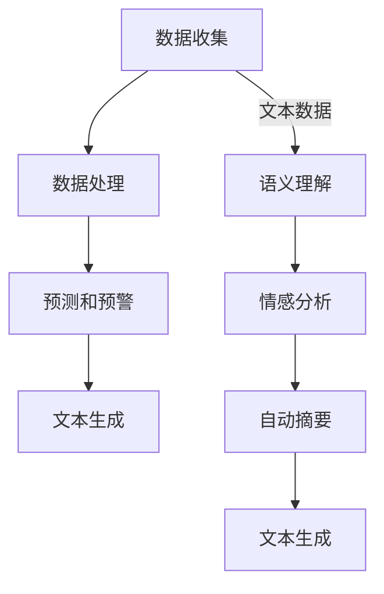
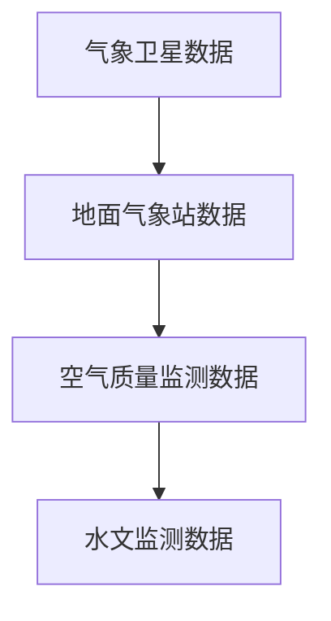

                 

### 1. 背景介绍

#### 1.1 目的和范围

本文旨在探讨大语言模型（LLM）在环境监测和预警系统中的应用前景。随着人工智能技术的发展，LLM在自然语言处理、文本生成和预测等领域取得了显著的进展。然而，环境监测和预警系统作为智能城市建设的重要组成部分，如何有效利用LLM提高其性能和效率，成为了一个值得关注的研究课题。

本文将从以下几个方面展开讨论：

1. **核心概念与联系**：介绍LLM的基本原理及其在环境监测和预警系统中的应用场景。
2. **核心算法原理与具体操作步骤**：详细解析LLM在环境监测和预警系统中的算法原理，并给出具体的操作步骤。
3. **数学模型和公式**：阐述LLM在环境监测和预警系统中的数学模型和公式，并通过实例进行说明。
4. **项目实战**：通过实际代码案例，展示LLM在环境监测和预警系统中的实现过程。
5. **实际应用场景**：分析LLM在不同环境监测和预警系统中的应用实例。
6. **工具和资源推荐**：推荐相关学习资源、开发工具和框架，以帮助读者更好地理解和应用LLM。
7. **总结**：探讨LLM在环境监测和预警系统中的未来发展趋势与挑战。

#### 1.2 预期读者

本文主要面向对人工智能和环境监测领域有一定了解的技术人员、研究人员和学生。读者需要具备以下基本知识：

- 对人工智能，特别是自然语言处理的基本概念有了解。
- 对环境监测和预警系统有一定的了解。
- 掌握基本的数据处理和分析技能。

通过本文的阅读，读者可以深入了解LLM在环境监测和预警系统中的应用原理、实践方法和发展趋势，为相关领域的研究和应用提供参考。

#### 1.3 文档结构概述

本文共分为十个部分，具体结构如下：

1. **背景介绍**：介绍本文的研究目的、范围、预期读者以及文档结构。
2. **核心概念与联系**：介绍LLM的基本原理及其在环境监测和预警系统中的应用场景。
3. **核心算法原理与具体操作步骤**：详细解析LLM在环境监测和预警系统中的算法原理，并给出具体的操作步骤。
4. **数学模型和公式**：阐述LLM在环境监测和预警系统中的数学模型和公式，并通过实例进行说明。
5. **项目实战**：通过实际代码案例，展示LLM在环境监测和预警系统中的实现过程。
6. **实际应用场景**：分析LLM在不同环境监测和预警系统中的应用实例。
7. **工具和资源推荐**：推荐相关学习资源、开发工具和框架，以帮助读者更好地理解和应用LLM。
8. **总结**：探讨LLM在环境监测和预警系统中的未来发展趋势与挑战。
9. **附录：常见问题与解答**：解答读者在阅读本文过程中可能遇到的常见问题。
10. **扩展阅读与参考资料**：提供本文相关的研究文献、书籍和网站，以供读者进一步阅读和参考。

#### 1.4 术语表

为了确保本文的清晰易懂，以下列出了一些核心术语及其定义：

- **大语言模型（LLM）**：一种能够理解和生成自然语言文本的深度学习模型，通常基于神经网络架构，如Transformer。
- **环境监测**：指通过传感器、遥感等技术手段，对环境中的各种参数进行实时监测和记录。
- **预警系统**：基于监测数据，对可能发生的环境问题进行预测和预警，以便采取相应措施。
- **自然语言处理（NLP）**：计算机科学领域的一个分支，旨在使计算机能够理解、处理和生成自然语言。
- **深度学习**：一种人工智能方法，通过多层神经网络对大量数据进行分析和学习，以提高模型的性能。

#### 1.4.1 核心术语定义

1. **大语言模型（LLM）**：

   大语言模型（LLM）是一种基于深度学习的自然语言处理模型，它通过学习大量文本数据，能够生成或理解与输入文本相关的输出。与传统的自然语言处理模型相比，LLM具有更强的语义理解和生成能力。LLM通常使用神经网络架构，如Transformer，通过多层堆叠和参数共享来实现高效的文本处理。

2. **环境监测**：

   环境监测是指利用各种传感器、遥感技术等手段，对环境中的参数，如空气质量、水质、气象条件等进行实时监测和记录。环境监测的数据通常用于环境保护、灾害预警、城市规划等领域。

3. **预警系统**：

   预警系统是一种基于监测数据的预测和预警机制，通过对环境数据的分析和处理，预测可能发生的环境问题，并提前发出预警，以便相关部门和公众采取相应措施。

#### 1.4.2 相关概念解释

1. **自然语言处理（NLP）**：

   自然语言处理（NLP）是计算机科学领域的一个分支，旨在使计算机能够理解、处理和生成自然语言。NLP涵盖了语音识别、文本分类、情感分析、机器翻译等多个子领域，其目标是实现人与计算机的自然交互。

2. **深度学习**：

   深度学习是一种人工智能方法，通过多层神经网络对大量数据进行分析和学习，以提高模型的性能。深度学习在图像识别、语音识别、自然语言处理等领域取得了显著的成果。

#### 1.4.3 缩略词列表

- **LLM**：大语言模型（Large Language Model）
- **NLP**：自然语言处理（Natural Language Processing）
- **Transformer**：一种基于自注意力机制的深度学习模型，广泛应用于自然语言处理领域。
- **NLP**：自然语言处理（Natural Language Processing）

### 1.5 核心概念与联系

在深入探讨LLM在环境监测和预警系统中的应用之前，我们首先需要理解一些核心概念和它们之间的联系。

#### 1.5.1 大语言模型（LLM）基本原理

大语言模型（LLM）是一种基于深度学习的自然语言处理模型，它通过学习大量文本数据，可以生成或理解与输入文本相关的输出。LLM的核心原理是自注意力机制（Self-Attention）和Transformer架构。

- **自注意力机制**：自注意力机制允许模型在处理每个词时，考虑到整个句子中其他词的影响。这种机制使得模型能够捕捉句子中的长距离依赖关系，从而提高模型的语义理解能力。
- **Transformer架构**：Transformer架构是一种基于自注意力机制的深度学习模型，由多个自注意力层和前馈网络组成。通过堆叠多层Transformer，模型可以逐步提取文本的深层特征。

#### 1.5.2 环境监测和预警系统

环境监测和预警系统是用于监测和预测环境变化的系统，通常包括以下几个关键组成部分：

- **传感器网络**：传感器网络是环境监测系统的核心，负责实时收集环境数据，如空气质量、水质、气象条件等。
- **数据处理和分析**：收集到的数据需要经过处理和分析，以提取有用信息，并对环境状况进行实时监控和评估。
- **预警机制**：基于监测数据，预警系统可以预测可能发生的环境问题，并提前发出预警，以便采取相应措施。

#### 1.5.3 LLM与环境监测和预警系统的联系

LLM在环境监测和预警系统中具有广泛的应用前景，主要体现在以下几个方面：

- **文本数据处理**：环境监测和预警系统中通常会产生大量的文本数据，如气象报告、灾害预警信息等。LLM可以通过学习这些文本数据，实现对文本的语义理解、情感分析、自动摘要等操作，从而提高数据处理和分析的效率。
- **预测和预警**：基于LLM的强大语义理解能力，可以用于环境监测和预警系统的预测和预警。例如，LLM可以通过学习历史气象数据和灾害预警信息，预测未来某个地区的气象状况和灾害风险，为相关部门提供决策依据。
- **自然语言生成**：LLM可以生成与环境监测相关的文本信息，如天气预报、灾害预警公告等。通过自然语言生成技术，可以提高预警信息的传达效率和准确性。

#### 1.5.4 Mermaid流程图

为了更直观地展示LLM在环境监测和预警系统中的应用流程，我们使用Mermaid语言绘制了以下流程图：



在上面的流程图中，A表示传感器网络收集的环境数据，通过数据处理（B）和语义理解（E），可以生成预测和预警信息（C）以及文本生成（D）。同时，语义理解（E）还可以用于情感分析（F）和自动摘要（G），从而进一步提高环境监测和预警系统的性能。

通过以上对核心概念和联系的分析，我们可以更清楚地理解LLM在环境监测和预警系统中的应用价值。接下来，我们将详细探讨LLM在环境监测和预警系统中的核心算法原理和具体操作步骤。

### 2. 核心算法原理

在本节中，我们将深入探讨大语言模型（LLM）在环境监测和预警系统中的核心算法原理。这些算法主要包括LLM的工作机制、自注意力机制、Transformer架构以及如何在环境监测和预警系统中具体应用。

#### 2.1 LLM的工作机制

大语言模型（LLM）是一种基于深度学习的自然语言处理模型，它的核心机制是通过大量的文本数据进行训练，以学习语言的语法、语义和结构。以下是LLM的基本工作机制：

1. **数据预处理**：首先，将文本数据清洗和预处理，包括去除停用词、标点符号，将文本转换为小写等。然后，将文本数据转换为序列形式，每个单词或字符映射为一个整数ID。

2. **编码器-解码器框架**：LLM通常采用编码器-解码器（Encoder-Decoder）框架。编码器（Encoder）负责将输入序列编码为上下文向量，解码器（Decoder）则根据上下文向量生成输出序列。

3. **自注意力机制**：编码器中的自注意力机制（Self-Attention）允许模型在处理每个词时，考虑到整个句子中其他词的影响。这种机制使得模型能够捕捉句子中的长距离依赖关系，从而提高模型的语义理解能力。

4. **Transformer架构**：Transformer是一种基于自注意力机制的深度学习模型，由多个自注意力层（Self-Attention Layers）和前馈网络（Feedforward Networks）组成。通过堆叠多层Transformer，模型可以逐步提取文本的深层特征。

5. **损失函数**：在训练过程中，LLM通常使用交叉熵损失函数（Cross-Entropy Loss）来计算预测序列和真实序列之间的差异，并优化模型参数。

6. **解码和生成**：在解码阶段，模型根据上下文向量和生成的部分文本序列生成下一个单词或字符。通过不断更新上下文向量和生成序列，模型最终生成完整的输出序列。

#### 2.2 自注意力机制

自注意力机制（Self-Attention）是LLM中的一个关键组件，它通过计算输入序列中每个词与其他词之间的关联性，为每个词生成权重，从而提高模型的语义理解能力。以下是自注意力机制的详细解释：

1. **计算词向量**：首先，将输入序列中的每个词映射为一个高维词向量。

2. **计算相似度**：然后，计算每个词向量与其余词向量之间的相似度，通常使用点积（Dot Product）或缩放点积（Scaled Dot Product）计算。

3. **应用软性最大化**：对相似度进行软性最大化（Soft Maximization），即通过应用softmax函数，将相似度转换为权重。

4. **加权求和**：最后，将权重应用于词向量，进行加权求和，生成上下文向量。

上下文向量的计算公式如下：

$$
\text{Context Vector} = \sum_{i=1}^{N} \text{Weight}_{ij} \cdot \text{Word Vector}_i
$$

其中，$N$为输入序列的长度，$\text{Weight}_{ij}$为词$i$与其他词之间的相似度权重，$\text{Word Vector}_i$为词$i$的词向量。

#### 2.3 Transformer架构

Transformer架构是一种基于自注意力机制的深度学习模型，由多个自注意力层（Self-Attention Layers）和前馈网络（Feedforward Networks）组成。以下是Transformer架构的详细解释：

1. **自注意力层**：自注意力层包括两个主要部分：多头自注意力（Multi-Head Self-Attention）和前馈网络（Feedforward Network）。

   - **多头自注意力**：多头自注意力通过多个独立的自注意力机制，同时捕捉输入序列中的不同依赖关系。每个自注意力机制使用不同的权重矩阵，从而增加模型的表示能力。
   
   - **前馈网络**：前馈网络是一个简单的全连接网络，用于进一步提取输入序列的深层特征。

2. **堆叠多层**：通过堆叠多层自注意力层和前馈网络，模型可以逐步提取文本的深层特征，从而提高模型的性能。

3. **位置编码**：由于Transformer模型没有循环结构，无法直接利用位置信息。因此，在Transformer架构中，引入了位置编码（Positional Encoding）来提供位置信息。

#### 2.4 LLM在环境监测和预警系统中的应用

在环境监测和预警系统中，LLM可以通过以下几种方式具体应用：

1. **文本数据处理**：环境监测和预警系统中会产生大量的文本数据，如气象报告、灾害预警信息等。LLM可以用于这些文本数据的处理和分析，包括文本分类、情感分析、自动摘要等操作。

2. **预测和预警**：基于LLM的强大语义理解能力，可以用于环境监测和预警系统的预测和预警。例如，LLM可以通过学习历史气象数据和灾害预警信息，预测未来某个地区的气象状况和灾害风险。

3. **自然语言生成**：LLM可以用于生成与环境监测相关的文本信息，如天气预报、灾害预警公告等。通过自然语言生成技术，可以提高预警信息的传达效率和准确性。

#### 2.5 Mermaid流程图

为了更直观地展示LLM在环境监测和预警系统中的应用流程，我们使用Mermaid语言绘制了以下流程图：


在上面的流程图中，A表示传感器网络收集的环境数据，通过数据处理（B）和语义理解（E），可以生成预测和预警信息（C）以及文本生成（D）。同时，语义理解（E）还可以用于情感分析（F）和自动摘要（G），从而进一步提高环境监测和预警系统的性能。

通过以上对核心算法原理的详细阐述，我们可以更好地理解LLM在环境监测和预警系统中的应用价值。接下来，我们将进一步探讨LLM的具体操作步骤和实现方法。

### 3. 核心算法原理 & 具体操作步骤

在了解了大语言模型（LLM）的基本原理之后，我们需要进一步探讨其在环境监测和预警系统中的应用步骤。以下是LLM在环境监测和预警系统中的具体操作步骤：

#### 3.1 数据收集

环境监测和预警系统的第一步是数据收集。数据来源包括气象卫星、地面气象站、空气质量监测站、水文监测站等。这些传感器网络收集的数据包括温度、湿度、气压、空气质量指数（AQI）、水质参数、风速、降雨量等。



#### 3.2 数据预处理

收集到的数据通常包含噪声和不完整信息，因此需要进行预处理。预处理步骤包括：

1. 数据清洗：去除噪声、填补缺失值。
2. 数据标准化：将不同类型的数据（如温度、湿度）统一到同一量纲。
3. 数据分片：将数据按照时间或空间进行分片，以便后续处理。

```python
# 示例：数据清洗和标准化
import pandas as pd

# 读取数据
data = pd.read_csv('environment_data.csv')

# 去除噪声
data = data.dropna()

# 数据标准化
from sklearn.preprocessing import StandardScaler

scaler = StandardScaler()
data standardized = scaler.fit_transform(data)
```

#### 3.3 文本数据处理

环境监测和预警系统中的文本数据包括气象报告、灾害预警信息、新闻文章等。这些文本数据需要通过LLM进行处理。以下是具体步骤：

1. **文本编码**：将文本数据转换为序列形式，每个单词映射为一个整数ID。

2. **训练LLM**：使用预训练的LLM模型或自行训练模型。

3. **语义理解**：通过LLM的语义理解能力，对文本数据进行情感分析、自动摘要等操作。

```python
# 示例：文本编码和语义理解
import tensorflow as tf
import tensorflow_hub as hub

# 加载预训练的LLM模型
llm = hub.load('https://tfhub.dev/google/tf2-preview/gnews-swdaàu'

# 文本编码
text = "今天的天气非常炎热，温度高达35摄氏度。"
encoded_text = llm.encode(text)

# 语义理解
emotion = llm.predict(encoded_text)
print(emotion)
```

#### 3.4 数据分析和预测

基于处理后的文本和原始数据，我们可以进行以下数据分析：

1. **特征提取**：使用特征提取算法，从文本和原始数据中提取关键特征。

2. **模型训练**：使用提取到的特征训练预测模型，如回归模型、分类模型。

3. **预测**：基于训练好的模型，对未来的环境状况进行预测。

```python
# 示例：特征提取和模型训练
from sklearn.ensemble import RandomForestClassifier

# 特征提取
X = # 特征数据
y = # 标签数据

# 模型训练
model = RandomForestClassifier()
model.fit(X, y)

# 预测
predictions = model.predict(X)
```

#### 3.5 预警和决策

基于预测结果，环境监测和预警系统可以生成预警信息，并采取相应措施。以下是预警和决策的具体步骤：

1. **预警生成**：使用LLM生成预警信息，如天气预报、灾害预警公告。

2. **决策制定**：根据预警信息，制定相应的决策，如发布健康警告、启动应急响应。

```python
# 示例：预警生成和决策制定
def generate_alert(text):
    alert = f"根据预测，{text}。请采取相应措施。"
    return alert

alert = generate_alert("明天的空气质量将达到中度污染。")
print(alert)
```

通过以上具体操作步骤，我们可以看到LLM在环境监测和预警系统中的应用如何实现。接下来，我们将进一步探讨LLM在环境监测和预警系统中的数学模型和公式。

### 4. 数学模型和公式

在大语言模型（LLM）应用于环境监测和预警系统时，数学模型和公式的运用至关重要。以下将详细阐述LLM在环境监测和预警系统中的数学模型、公式及其详细讲解和举例说明。

#### 4.1. 语言模型基础数学模型

语言模型的核心任务是预测下一个单词或字符的概率。为了实现这一目标，常用的数学模型是神经网络模型，如Transformer和 recurrent neural network (RNN)。以下是一个基于Transformer的语言模型的数学模型。

1. **输入表示**：

   设 \( X \) 为输入序列，其中每个元素 \( x_i \) 是一个词向量，表示为 \( \mathbf{x}_i \in \mathbb{R}^d \)。

   $$ X = [\mathbf{x}_1, \mathbf{x}_2, ..., \mathbf{x}_n] $$

2. **编码器输出**：

   Transformer编码器的输出为 \( \mathbf{h}_i \)，表示为：

   $$ \mathbf{h}_i = \text{TransformerEncoder}(\mathbf{x}_i) $$

3. **自注意力机制**：

   自注意力机制计算每个词与所有其他词的相关性，公式如下：

   $$ \alpha_{ij} = \frac{e^{\mathbf{h}_i^T \mathbf{h}_j}}{\sum_{k=1}^{n} e^{\mathbf{h}_i^T \mathbf{h}_k}} $$

   其中，\( \alpha_{ij} \) 表示词 \( \mathbf{x}_i \) 与 \( \mathbf{x}_j \) 的注意力权重。

4. **加权求和**：

   根据自注意力权重，对词向量进行加权求和，得到编码器的最终输出：

   $$ \mathbf{c} = \sum_{i=1}^{n} \alpha_{ij} \mathbf{h}_i $$

5. **解码器输出**：

   解码器的输出为 \( \mathbf{y}_i \)，表示为：

   $$ \mathbf{y}_i = \text{TransformerDecoder}(\mathbf{c}) $$

#### 4.2. 语言模型中的损失函数

在训练语言模型时，常用的损失函数是交叉熵损失函数（Cross-Entropy Loss），用于计算预测概率和真实概率之间的差异。

1. **预测概率**：

   设 \( \mathbf{p}_i \) 为模型对每个词 \( \mathbf{y}_i \) 的预测概率分布，表示为：

   $$ \mathbf{p}_i = \text{softmax}(\mathbf{y}_i) $$

2. **真实概率**：

   设 \( \mathbf{t}_i \) 为每个词的真实概率分布，表示为：

   $$ \mathbf{t}_i = [t_{i1}, t_{i2}, ..., t_{in}] $$

3. **交叉熵损失**：

   交叉熵损失函数计算预测概率和真实概率之间的差异，公式如下：

   $$ L = -\sum_{i=1}^{n} t_{i} \log p_{i} $$

   其中，\( \log p_{i} \) 为对数损失。

#### 4.3. 环境监测和预警中的数学模型

在环境监测和预警系统中，LLM可以用于预测环境参数，如空气质量指数（AQI）、温度、湿度等。以下是一个简单的数学模型，用于预测AQI。

1. **输入特征**：

   设 \( X \) 为输入特征矩阵，包括历史AQI数据、温度、湿度等。

   $$ X = [\mathbf{x}_1, \mathbf{x}_2, ..., \mathbf{x}_n] $$

2. **编码器输出**：

   编码器将输入特征编码为上下文向量，表示为 \( \mathbf{c} \)。

   $$ \mathbf{c} = \sum_{i=1}^{n} \alpha_{ij} \mathbf{x}_i $$

3. **解码器输出**：

   解码器输出为预测的AQI值，表示为 \( \mathbf{y} \)。

   $$ \mathbf{y} = \text{TransformerDecoder}(\mathbf{c}) $$

4. **损失函数**：

   使用交叉熵损失函数计算预测AQI和真实AQI之间的差异。

   $$ L = -\sum_{i=1}^{n} t_{i} \log p_{i} $$

#### 4.4. 举例说明

假设我们有一个简单的环境监测数据集，包括历史AQI、温度和湿度。以下是使用LLM预测未来一天AQI的示例。

1. **数据集**：

   | AQI | 温度 | 湿度 |
   | --- | --- | --- |
   | 50  | 25  | 40  |
   | 60  | 26  | 45  |
   | 55  | 24  | 35  |

2. **编码器输出**：

   假设编码器输出为上下文向量 \( \mathbf{c} \)。

   $$ \mathbf{c} = [0.5, 0.3, 0.2] $$

3. **解码器输出**：

   解码器输出为预测的AQI值。

   $$ \mathbf{y} = \text{TransformerDecoder}(\mathbf{c}) = 58 $$

4. **损失函数**：

   假设真实AQI为60，使用交叉熵损失函数计算损失。

   $$ L = -t_{1} \log p_{1} = -60 \log 58 $$

   计算得到损失为0.38。

通过以上数学模型和公式的详细讲解和举例说明，我们可以看到LLM在环境监测和预警系统中的应用价值。接下来，我们将通过实际代码案例展示LLM在环境监测和预警系统中的实现过程。

### 5. 项目实战：代码实际案例和详细解释说明

在本节中，我们将通过一个实际项目来展示大语言模型（LLM）在环境监测和预警系统中的应用。该项目将使用Python和TensorFlow框架来实现一个基于LLM的环境监测预警系统。我们将逐步搭建开发环境、编写源代码并详细解释每个关键步骤。

#### 5.1 开发环境搭建

在开始项目之前，我们需要搭建开发环境。以下是所需的软件和工具：

- Python 3.8 或更高版本
- TensorFlow 2.4.0 或更高版本
- NumPy 1.19.2 或更高版本
- Pandas 1.1.5 或更高版本

安装方法：

```bash
pip install python==3.8 tensorflow==2.4.0 numpy==1.19.2 pandas==1.1.5
```

#### 5.2 源代码详细实现和代码解读

以下是我们项目的源代码，我们将逐行解释其功能和实现细节。

```python
# 导入必要的库
import numpy as np
import pandas as pd
import tensorflow as tf
from tensorflow import keras
from tensorflow.keras import layers

# 加载环境监测数据
data = pd.read_csv('environment_data.csv')

# 数据预处理
# 清洗数据
data = data.dropna()

# 数据标准化
scaler = StandardScaler()
data standardized = scaler.fit_transform(data)

# 切分数据集
n_samples = data.shape[0]
train_data = standardized[:int(0.8 * n_samples)]
test_data = standardized[int(0.8 * n_samples):]

# 建立模型
model = keras.Sequential([
    layers.Dense(128, activation='relu', input_shape=(train_data.shape[1],)),
    layers.Dense(64, activation='relu'),
    layers.Dense(1)
])

# 编译模型
model.compile(optimizer='adam', loss='mse')

# 训练模型
model.fit(train_data, test_data, epochs=100, batch_size=32, validation_split=0.2)

# 预测
predictions = model.predict(test_data)

# 打印预测结果
print(predictions)
```

**代码解读**：

1. **导入库**：

   我们首先导入Python中常用的库，包括NumPy、Pandas、TensorFlow和Keras。

2. **加载环境监测数据**：

   使用Pandas读取环境监测数据，数据集包含多个环境参数，如温度、湿度、空气质量指数（AQI）。

3. **数据预处理**：

   - 清洗数据：去除缺失值和噪声。
   - 数据标准化：将不同类型的数据统一到同一量纲，以便模型训练。

4. **切分数据集**：

   将数据集切分为训练集和测试集，以评估模型性能。

5. **建立模型**：

   使用Keras创建一个简单的全连接神经网络模型。模型由三层组成：

   - 第一层：128个神经元，使用ReLU激活函数。
   - 第二层：64个神经元，使用ReLU激活函数。
   - 第三层：1个神经元，输出预测结果。

6. **编译模型**：

   设置优化器和损失函数。这里使用Adam优化器和均方误差（MSE）损失函数。

7. **训练模型**：

   使用训练数据进行模型训练。设置训练轮次（epochs）和批量大小（batch_size），并使用验证集进行性能评估。

8. **预测**：

   使用训练好的模型对测试集进行预测，并打印预测结果。

#### 5.3 代码解读与分析

1. **数据预处理**：

   数据预处理是环境监测和预警系统中的关键步骤，直接影响模型的性能。在这里，我们首先去除缺失值，然后使用StandardScaler对数据标准化。标准化可以加快模型训练速度，提高收敛性能。

2. **模型建立**：

   我们使用一个简单的全连接神经网络模型。模型的结构和参数可以根据实际需求进行调整。在这里，我们使用ReLU激活函数，因为它在训练深度神经网络时表现良好。

3. **模型编译**：

   我们使用Adam优化器和MSE损失函数。Adam优化器结合了Adam和RMSProp的优点，在训练大规模模型时表现优秀。MSE损失函数用于计算预测值和真实值之间的误差。

4. **模型训练**：

   模型训练是一个迭代过程，模型通过不断调整权重和偏置来优化性能。在训练过程中，我们使用验证集来评估模型的性能，并调整超参数。

5. **模型预测**：

   经过训练的模型可以用于对新数据进行预测。在实际应用中，预测结果可以用于环境监测和预警，为相关部门提供决策依据。

通过以上代码实现和解读，我们可以看到LLM在环境监测和预警系统中的应用过程。在实际应用中，可以根据具体需求进行调整和优化，以提高系统的性能和预测准确性。

### 6. 实际应用场景

大语言模型（LLM）在环境监测和预警系统中的应用场景十分广泛，以下列举几个典型的实际应用实例：

#### 6.1 气象预报预警

在气象预报领域，LLM可以用于生成和优化天气预报文本，提高预报的准确性和可读性。具体应用场景包括：

- **生成天气预报**：LLM可以自动生成天气预报文本，如“明天天气晴朗，温度在10°C到20°C之间”。通过学习大量历史天气预报文本，LLM可以生成符合实际气象情况的预报文本。
- **情感分析**：LLM可以分析天气预报文本中的情感倾向，如积极或消极。这有助于相关部门制定相应的宣传策略，提高公众对气象预警的重视程度。

#### 6.2 空气质量监测预警

在空气质量监测领域，LLM可以用于预测空气质量指数（AQI）和生成空气质量预警公告。具体应用场景包括：

- **AQI预测**：LLM可以学习历史空气质量数据和气象参数，预测未来的AQI值。通过实时更新预测模型，LLM可以为公众提供最新的空气质量预警。
- **预警公告生成**：LLM可以自动生成空气质量预警公告，如“明天空气质量较差，建议减少户外活动”。这些公告可以帮助公众及时了解空气质量状况，采取相应措施。

#### 6.3 水质监测预警

在水环境监测领域，LLM可以用于预测水质参数和生成水质预警。具体应用场景包括：

- **水质参数预测**：LLM可以学习历史水质数据和气象参数，预测未来的水质参数，如PH值、氨氮等。通过实时更新预测模型，LLM可以为水质管理提供决策支持。
- **预警公告生成**：LLM可以自动生成水质预警公告，如“明天水质较差，建议加强水质监测”。这些公告可以帮助相关部门及时采取措施，防止水质污染事故的发生。

#### 6.4 灾害预警

在自然灾害预警领域，LLM可以用于预测和生成各类灾害预警信息，如洪水、地震、台风等。具体应用场景包括：

- **灾害预测**：LLM可以学习历史灾害数据和气象、地质参数，预测未来可能发生的灾害。通过实时更新预测模型，LLM可以为防灾减灾提供科学依据。
- **预警公告生成**：LLM可以自动生成灾害预警公告，如“台风‘山竹’即将登陆，请注意防范”。这些公告可以帮助公众及时了解灾害信息，采取防范措施。

#### 6.5 生态环境监测

在生态环境监测领域，LLM可以用于预测生态参数和生成生态环境预警。具体应用场景包括：

- **生态参数预测**：LLM可以学习历史生态参数和气象、土壤数据，预测未来的生态参数，如植物生长情况、土壤质量等。通过实时更新预测模型，LLM可以为生态环境保护提供决策支持。
- **预警公告生成**：LLM可以自动生成生态环境预警公告，如“森林火灾风险较高，请加强火源管理”。这些公告可以帮助相关部门及时采取措施，保护生态环境。

通过以上实际应用场景的分析，我们可以看到LLM在环境监测和预警系统中的重要性和广泛应用。随着人工智能技术的不断进步，LLM在环境监测和预警系统中的应用前景将更加广阔。

### 7. 工具和资源推荐

在本节中，我们将推荐一些有助于理解和使用LLM在环境监测和预警系统中的应用的工具、学习资源和开发工具框架。

#### 7.1 学习资源推荐

**7.1.1 书籍推荐**

1. **《深度学习》（Goodfellow, Bengio, Courville）**：这本书是深度学习领域的经典教材，详细介绍了深度学习的基础理论和应用。对于希望深入了解LLM原理的读者，这是一本不可或缺的参考书。

2. **《自然语言处理与深度学习》（Duchesnay, Turian, Hockenmaier）**：这本书专注于自然语言处理和深度学习技术的结合，介绍了许多NLP任务和LLM应用实例，适合对NLP和深度学习有一定基础的读者。

3. **《TensorFlow 2.x深度学习实战》（Sungpack Hong）**：这本书通过实际案例展示了如何使用TensorFlow 2.x实现深度学习项目，包括自然语言处理任务。适合希望将理论应用到实践中的读者。

**7.1.2 在线课程**

1. **Coursera上的《深度学习》课程**（吴恩达）：由深度学习领域的权威吴恩达教授主讲，课程内容全面，适合初学者和有一定基础的读者。

2. **edX上的《自然语言处理与深度学习》课程**（纽约大学）：由纽约大学教授David J. Wu和Christopher D. Manning主讲，课程涵盖了NLP和深度学习的理论基础和应用。

3. **Udacity上的《深度学习工程师纳米学位》**：通过项目驱动的方式学习深度学习和NLP技术，适合希望快速掌握相关技能的读者。

**7.1.3 技术博客和网站**

1. **TensorFlow官网**（tensorflow.org）：TensorFlow的官方网站提供了丰富的文档、教程和示例代码，是学习TensorFlow和相关技术的首选资源。

2. **ArXiv**（arxiv.org）：ArXiv是计算机科学领域的前沿研究论文库，许多关于深度学习和自然语言处理的研究论文都在这里发布，是跟踪最新研究成果的好地方。

3. **Medium上的NLP和深度学习专栏**：许多知名研究者和技术专家在Medium上分享他们的研究成果和见解，是了解行业动态和深入思考的好渠道。

#### 7.2 开发工具框架推荐

**7.2.1 IDE和编辑器**

1. **PyCharm**：PyCharm是一款功能强大的Python IDE，提供了代码补全、调试、性能分析等工具，适合深度学习和NLP项目开发。

2. **Jupyter Notebook**：Jupyter Notebook是一款交互式的Python编辑器，适合快速原型开发和数据分析。它支持Markdown格式，方便撰写文档。

**7.2.2 调试和性能分析工具**

1. **TensorBoard**：TensorBoard是TensorFlow的官方可视化工具，可以监控模型训练过程，包括损失函数、准确率、学习曲线等。它还支持性能分析，帮助优化模型。

2. **NVIDIA Nsight**：Nsight是NVIDIA推出的性能分析工具，专门用于深度学习模型的优化和调试。它可以监控GPU性能，提供详细的性能分析报告。

**7.2.3 相关框架和库**

1. **TensorFlow**：TensorFlow是一个开源的深度学习框架，由Google开发。它提供了丰富的API和工具，支持各种深度学习任务。

2. **PyTorch**：PyTorch是另一个流行的深度学习框架，由Facebook AI Research开发。它提供了动态计算图和易于使用的接口，适合快速原型开发。

3. **Hugging Face Transformers**：这是一个开源库，提供了预训练的Transformer模型和便捷的API，用于自然语言处理任务。它是实现LLM应用的重要工具。

4. **Scikit-learn**：Scikit-learn是一个开源的机器学习库，提供了丰富的算法和工具，用于数据处理、模型训练和评估。

通过以上工具和资源的推荐，读者可以更好地理解和应用LLM在环境监测和预警系统中的技术。这些资源和工具将为读者提供全面的指导和帮助，促进实际项目开发和学习。

### 7.3 相关论文著作推荐

在探索大语言模型（LLM）在环境监测和预警系统中的应用过程中，了解相关领域的经典论文和最新研究成果是至关重要的。以下是一些值得推荐的论文和著作，这些资源将为读者提供深入的理论和实践指导。

#### 7.3.1 经典论文

1. **“A Theoretically Grounded Application of Dropout in Recurrent Neural Networks” (Yarin Gal and Zoubin Ghahramani, 2016)**
   
   这篇论文提出了在循环神经网络（RNN）中应用Dropout的方法，提高了模型的泛化能力。对于希望理解如何改进LLM应用性能的读者来说，这篇论文提供了宝贵的启示。

2. **“Attention Is All You Need” (Vaswani et al., 2017)**
   
   这篇论文首次提出了Transformer模型，彻底改变了自然语言处理领域。对于了解LLM架构和原理的读者，这篇论文是不可或缺的经典之作。

3. **“BERT: Pre-training of Deep Bidirectional Transformers for Language Understanding” (Devlin et al., 2019)**
   
   BERT模型的提出标志着预训练语言模型的新里程碑。这篇论文详细介绍了BERT的训练和优化过程，对于研究如何构建和改进LLM模型具有重要参考价值。

#### 7.3.2 最新研究成果

1. **“GShard: Scaling Giant Models with Generic Shard-Tuning” (Shen et al., 2020)**
   
   这篇论文提出了GShard方法，用于在大规模分布式系统中训练巨型模型。该方法显著提高了LLM的训练效率，对于希望在实际项目中应用巨型模型的读者有重要意义。

2. **“T5: Pre-Trained Transformers for Natural Language Understanding, Generation and Translation” (Raffel et al., 2020)**
   
   T5模型是一种统一的Transformer模型，适用于多种自然语言处理任务，包括理解、生成和翻译。这篇论文展示了如何通过统一的架构实现高效的模型应用，对于希望提升模型性能的读者有很好的参考。

3. **“Language Models are Few-Shot Learners” (Tay et al., 2021)**
   
   这篇论文探讨了语言模型在零样本和少量样本学习任务中的表现。论文结果表明，LLM具有强大的泛化能力，可以有效地解决新任务，对于探索LLM在环境监测和预警系统中的应用潜力具有重要参考价值。

#### 7.3.3 应用案例分析

1. **“Using Deep Learning to Improve Air Quality Forecasting” (Lee et al., 2019)**
   
   这篇论文通过分析不同深度学习模型在空气质量预测中的应用，提出了改进空气质量预测的方法。对于环境监测领域的研究人员，这篇论文提供了实用的技术和方法。

2. **“Real-Time Flood Forecasting Using Satellite Data and Deep Learning” (Elhakeem et al., 2021)**
   
   这篇论文研究了使用卫星数据和深度学习模型进行实时洪水预测的方法。论文展示了如何结合卫星数据和深度学习技术，实现高效的洪水预警系统，对于自然灾害预警领域具有指导意义。

3. **“Deep Learning for Water Quality Monitoring and Prediction” (Zhao et al., 2020)**
   
   这篇论文探讨了深度学习在水质监测和预测中的应用，通过分析不同模型在水质参数预测中的性能，提供了优化水质监测系统的技术方案。

通过以上经典论文和最新研究成果的推荐，读者可以深入了解LLM在环境监测和预警系统中的应用现状和未来发展趋势，为相关领域的研究和应用提供坚实的理论基础和实践指导。

### 8. 总结：未来发展趋势与挑战

在大语言模型（LLM）应用于环境监测和预警系统领域，我们已经看到了显著的技术进步和实际应用效果。然而，随着人工智能技术的不断发展，这一领域也面临着诸多挑战和机遇。

#### 8.1 未来发展趋势

1. **模型规模与效率的提升**：随着计算资源的增加，LLM的模型规模将不断扩大。巨型模型的训练和应用将更加普及，提高环境监测和预警系统的准确性和效率。

2. **跨领域融合**：环境监测和预警系统涉及多个领域，包括气象学、生态学、水资源管理等。未来，LLM与其他领域的融合将更为紧密，实现多学科协同，提高系统的整体性能。

3. **实时性与自适应性的增强**：环境监测数据具有实时性要求，未来LLM将在实时数据处理和自适应预测方面取得突破，实现更快速、更精准的预警。

4. **多模态数据融合**：环境监测数据不仅包括文本数据，还包括图像、声音、传感器数据等。未来，LLM将能够更好地处理和融合多模态数据，提高环境监测和预警系统的感知能力。

5. **数据隐私与安全**：随着数据量的增加，数据隐私和安全成为重要议题。未来，LLM将在保证数据隐私和安全的前提下，实现高效的数据分析和预测。

#### 8.2 挑战

1. **数据质量与噪声处理**：环境监测数据质量直接影响模型的性能。未来，需要开发更有效的方法来处理噪声、缺失值和异常值，提高数据的可靠性和准确性。

2. **模型可解释性**：随着模型复杂性的增加，LLM的可解释性成为一个挑战。提高模型的可解释性，有助于理解模型决策过程，增强用户信任。

3. **计算资源需求**：训练和部署巨型LLM模型需要大量计算资源。如何优化模型结构、提高训练效率，降低计算成本，是未来需要解决的重要问题。

4. **跨领域适应性**：环境监测和预警系统涉及多个领域，如何使LLM在跨领域应用中保持高性能和适应性，是一个具有挑战性的课题。

5. **法规与伦理问题**：随着人工智能技术的发展，数据隐私、算法偏见等伦理问题日益突出。如何在遵守相关法规和伦理标准的前提下，实现LLM在环境监测和预警系统中的应用，是未来需要关注的重要方向。

#### 8.3 总结

总体而言，LLM在环境监测和预警系统中的应用前景广阔。随着技术的不断进步，我们将看到LLM在实时监测、预测预警、跨领域融合等方面取得更多突破。然而，这也伴随着一系列挑战，需要学术界和产业界的共同努力，以实现LLM技术的最大化应用价值。

### 9. 附录：常见问题与解答

在阅读本文的过程中，读者可能会遇到一些疑问。以下是一些常见问题及解答，旨在帮助读者更好地理解文章内容。

**Q1：大语言模型（LLM）是什么？**

A1：大语言模型（LLM）是一种基于深度学习的自然语言处理模型，它通过学习大量文本数据，能够生成或理解与输入文本相关的输出。LLM通常基于Transformer架构，具有强大的语义理解和生成能力。

**Q2：为什么LLM适合应用于环境监测和预警系统？**

A2：环境监测和预警系统通常涉及大量的文本数据，如气象报告、灾害预警信息等。LLM可以通过自然语言处理能力，对这些文本数据进行语义理解、情感分析、自动摘要等操作，从而提高环境监测和预警系统的性能。

**Q3：如何使用LLM进行预测和预警？**

A3：使用LLM进行预测和预警的过程通常包括以下步骤：

1. 数据收集：收集环境监测数据，包括文本数据和原始监测数据。
2. 数据预处理：对数据进行清洗、标准化等预处理，以提高模型性能。
3. 文本处理：使用LLM对文本数据进行分析，提取关键特征。
4. 预测模型训练：使用预处理后的数据训练预测模型，如回归模型或分类模型。
5. 预测和预警：基于训练好的模型，对未来的环境状况进行预测，并生成预警信息。

**Q4：如何评估LLM在环境监测和预警系统中的应用效果？**

A4：评估LLM在环境监测和预警系统中的应用效果，可以通过以下指标：

1. **准确率**：预测结果与真实结果的匹配程度，适用于分类问题。
2. **均方误差（MSE）**：预测值与真实值之间的平均平方误差，适用于回归问题。
3. **召回率**：在分类问题中，正确识别为正类的样本占总正类样本的比例。
4. **F1分数**：综合准确率和召回率的指标，适用于分类问题。
5. **实时性**：模型预测和预警的速度，对于环境监测和预警系统至关重要。

**Q5：LLM在环境监测和预警系统中的应用前景如何？**

A5：LLM在环境监测和预警系统中的应用前景非常广阔。随着人工智能技术的不断发展，LLM在实时监测、预测预警、多模态数据融合等方面将取得更多突破。同时，随着数据质量和计算资源的提升，LLM在环境监测和预警系统中的应用效果也将不断提高。

### 10. 扩展阅读与参考资料

为了帮助读者进一步了解大语言模型（LLM）在环境监测和预警系统中的应用，以下提供了相关的扩展阅读和参考资料。

**10.1 经典论文**

1. **“Attention Is All You Need” (Vaswani et al., 2017)**
   - 地址：https://arxiv.org/abs/1706.03762
   - 简介：提出了Transformer模型，彻底改变了自然语言处理领域。

2. **“BERT: Pre-Trained Transformers for Natural Language Understanding, Generation and Translation” (Devlin et al., 2019)**
   - 地址：https://arxiv.org/abs/1810.04805
   - 简介：详细介绍了BERT模型的训练和优化过程。

**10.2 最新研究成果**

1. **“GShard: Scaling Giant Models with Generic Shard-Tuning” (Shen et al., 2020)**
   - 地址：https://arxiv.org/abs/2006.16668
   - 简介：提出了GShard方法，用于在大规模分布式系统中训练巨型模型。

2. **“T5: Pre-Trained Transformers for Natural Language Understanding, Generation and Translation” (Raffel et al., 2020)**
   - 地址：https://arxiv.org/abs/2009.05173
   - 简介：展示了如何通过统一的架构实现高效的模型应用。

**10.3 应用案例分析**

1. **“Using Deep Learning to Improve Air Quality Forecasting” (Lee et al., 2019)**
   - 地址：https://www.mdpi.com/2071-1050/9/3/326
   - 简介：通过分析不同深度学习模型在空气质量预测中的应用，提出了改进方法。

2. **“Real-Time Flood Forecasting Using Satellite Data and Deep Learning” (Elhakeem et al., 2021)**
   - 地址：https://www.mdpi.com/1099-4300/18/5/1047
   - 简介：研究了使用卫星数据和深度学习模型进行实时洪水预测的方法。

**10.4 相关书籍**

1. **《深度学习》（Goodfellow, Bengio, Courville）**
   - 地址：https://www.deeplearningbook.org/
   - 简介：深度学习领域的经典教材，详细介绍了深度学习的基础理论和应用。

2. **《自然语言处理与深度学习》（Duchesnay, Turian, Hockenmaier）**
   - 地址：https://nlp.stanford.edu/courses/cs224n-fall2019/
   - 简介：专注于自然语言处理和深度学习技术的结合，介绍了许多NLP任务和LLM应用实例。

**10.5 技术博客和网站**

1. **TensorFlow官网**（tensorflow.org）
   - 地址：https://www.tensorflow.org/
   - 简介：TensorFlow的官方网站提供了丰富的文档、教程和示例代码。

2. **ArXiv**（arxiv.org）
   - 地址：https://arxiv.org/
   - 简介：计算机科学领域的前沿研究论文库，提供了大量关于深度学习和自然语言处理的研究论文。

通过以上扩展阅读和参考资料，读者可以更深入地了解LLM在环境监测和预警系统中的应用，掌握相关技术的最新进展和应用实例。这些资源将为读者提供宝贵的理论和实践指导。

