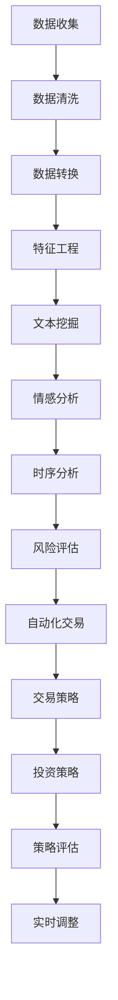

                 

# LLM在金融分析中的潜在用途

## 关键词：
- 语言模型
- 金融分析
- 数据挖掘
- 风险评估
- 自动化交易
- 投资策略

## 摘要：
本文将深入探讨大型语言模型（LLM）在金融分析领域的潜在应用。首先，我们将回顾LLM的基本原理，然后分析其在金融数据处理、风险评估、自动化交易和投资策略等方面的应用。通过具体的案例和操作步骤，我们将展示LLM如何提升金融分析的效率和准确性。最后，我们将讨论未来的发展趋势和面临的挑战，以及推荐一些相关的学习资源和工具。

## 1. 背景介绍

### 1.1 目的和范围

本文的目的是探讨大型语言模型（LLM）在金融分析中的应用。我们将重点关注以下方面：

- LLM的基本原理和核心算法
- LLM在金融数据处理中的作用
- LLM在风险评估和自动化交易中的应用
- LLM在投资策略制定中的潜在用途
- LLM在金融分析领域的未来发展趋势和挑战

通过本文的阅读，读者将能够了解LLM在金融分析中的实际应用，掌握其基本原理和操作方法，并能够为未来的金融分析工作提供新的思路。

### 1.2 预期读者

本文主要面向以下读者群体：

- 金融分析师和投资顾问
- 数据科学家和机器学习工程师
- 金融科技（FinTech）领域的研发人员
- 对金融分析和人工智能技术感兴趣的学者和研究人员

无论您是金融行业的从业者，还是对相关技术感兴趣的学术研究人员，本文都将为您提供有价值的见解和实用技巧。

### 1.3 文档结构概述

本文将按照以下结构展开：

- 1. 背景介绍
  - 1.1 目的和范围
  - 1.2 预期读者
  - 1.3 文档结构概述
  - 1.4 术语表
- 2. 核心概念与联系
  - 2.1 语言模型原理
  - 2.2 金融数据处理
  - 2.3 风险评估与自动化交易
  - 2.4 投资策略制定
- 3. 核心算法原理与具体操作步骤
  - 3.1 算法原理概述
  - 3.2 操作步骤详解
- 4. 数学模型和公式
  - 4.1 数学模型介绍
  - 4.2 公式推导与说明
  - 4.3 举例说明
- 5. 项目实战
  - 5.1 开发环境搭建
  - 5.2 源代码实现
  - 5.3 代码解读与分析
- 6. 实际应用场景
  - 6.1 风险评估
  - 6.2 自动化交易
  - 6.3 投资策略
- 7. 工具和资源推荐
  - 7.1 学习资源推荐
  - 7.2 开发工具框架推荐
  - 7.3 相关论文著作推荐
- 8. 总结：未来发展趋势与挑战
- 9. 附录：常见问题与解答
- 10. 扩展阅读 & 参考资料

通过这个结构，我们将系统地介绍LLM在金融分析中的应用，帮助读者全面了解这个领域的最新动态和发展趋势。

### 1.4 术语表

在本文中，我们将使用一些专业术语。以下是对这些术语的定义和解释：

#### 1.4.1 核心术语定义

- **大型语言模型（LLM）**：一种能够理解和生成自然语言的大型神经网络模型，如GPT、BERT等。
- **金融数据处理**：将金融数据（如股票价格、交易量、财务报表等）转换为可用于分析和建模的格式。
- **风险评估**：评估金融投资面临的风险，包括市场风险、信用风险、操作风险等。
- **自动化交易**：利用算法和模型自动执行交易，以获取利润或规避风险。
- **投资策略**：为实现特定投资目标而制定的行动计划，包括资产配置、投资时机选择等。

#### 1.4.2 相关概念解释

- **自然语言处理（NLP）**：使计算机能够理解和处理自然语言的技术和算法。
- **深度学习**：一种机器学习方法，通过多层神经网络来学习数据的复杂模式。
- **回归分析**：一种统计分析方法，用于预测一个连续变量的值。
- **时间序列分析**：分析随时间变化的数据序列，以预测未来的趋势。

#### 1.4.3 缩略词列表

- **LLM**：大型语言模型
- **NLP**：自然语言处理
- **FinTech**：金融科技
- **GPT**：生成预训练变压器
- **BERT**：双向编码器表示器

## 2. 核心概念与联系

### 2.1 语言模型原理

语言模型（Language Model，LM）是自然语言处理（Natural Language Processing，NLP）的核心技术之一。它通过学习大量文本数据，预测文本中下一个单词或句子的概率分布。在深度学习的框架下，语言模型通常基于神经网络，尤其是Transformer架构，如GPT（Generative Pre-trained Transformer）和BERT（Bidirectional Encoder Representations from Transformers）等。

#### 2.1.1 Transformer架构

Transformer是2017年由Vaswani等人提出的一种基于自注意力机制的序列到序列模型，显著提升了机器翻译的准确性和效率。Transformer的核心思想是引入自注意力机制（Self-Attention），允许模型在生成每个词时，考虑到整个序列的所有词的信息。

自注意力机制的定义如下：

$$
\text{Attention}(Q, K, V) = \text{softmax}\left(\frac{QK^T}{\sqrt{d_k}}\right)V
$$

其中，$Q, K, V$分别表示查询（Query）、键（Key）和值（Value）向量，$d_k$是键向量的维度。这个机制使得模型能够根据输入序列的每个词的重要程度，动态调整它们在输出时的权重。

#### 2.1.2 GPT与BERT

GPT是一种基于Transformer架构的预训练语言模型，通过大量无监督数据进行预训练，然后通过微调适应特定的任务。GPT的主要目的是生成文本，具有强大的文本生成能力。

BERT则是一种基于Transformer的双向编码器模型，它在预训练阶段同时关注前文和后文的信息，从而能够更好地理解上下文关系。BERT常用于各种NLP任务，如文本分类、问答系统等。

### 2.2 金融数据处理

在金融分析中，数据的质量和准确性至关重要。金融数据处理包括数据收集、清洗、转换和整合等多个步骤。

#### 2.2.1 数据收集

金融数据可以从多个来源收集，包括：

- **公开市场数据**：如股票价格、交易量、指数等。
- **公司财务报告**：如利润表、资产负债表、现金流量表等。
- **新闻和社交媒体**：通过文本挖掘和情感分析，获取市场情绪和新闻事件。
- **交易数据**：如买卖订单、交易时间等。

#### 2.2.2 数据清洗和转换

数据清洗和转换包括以下步骤：

- **缺失值处理**：通过插值、平均值替换或删除缺失值等方法处理缺失数据。
- **异常值检测**：使用统计方法或机器学习算法检测并处理异常值。
- **数据规范化**：通过标准化或归一化方法，将不同尺度或单位的数据转换到同一尺度。
- **特征工程**：提取和构造与金融分析相关的特征，如技术指标、情绪指标等。

### 2.3 风险评估与自动化交易

在金融分析中，风险评估和自动化交易是至关重要的环节。LLM在这两个方面的应用如下：

#### 2.3.1 风险评估

LLM可以用于评估金融投资的风险，主要包括以下方法：

- **文本挖掘与情感分析**：通过分析新闻报道、社交媒体评论等，获取市场情绪和新闻事件，从而预测市场趋势。
- **时序分析**：使用时间序列模型，如ARIMA、LSTM等，分析历史价格数据，预测未来价格。
- **机器学习模型**：如随机森林、支持向量机等，用于分类和回归任务，评估投资组合的风险。

#### 2.3.2 自动化交易

LLM可以用于自动化交易，主要包括以下方法：

- **交易策略生成**：使用LLM生成基于市场数据和情绪分析的交易策略。
- **交易执行**：通过API连接交易所，自动化执行交易订单。
- **回测与优化**：对交易策略进行历史回测，评估其效果，并进行优化。

### 2.4 投资策略制定

LLM在投资策略制定中的应用包括：

- **策略生成**：通过分析历史数据和当前市场环境，使用LLM生成潜在的投资策略。
- **策略评估**：使用LLM评估不同投资策略的潜在收益和风险。
- **实时调整**：根据实时市场数据，使用LLM调整投资策略，以最大化收益或最小化风险。

### 2.5 Mermaid流程图

以下是一个简单的Mermaid流程图，展示了LLM在金融分析中的应用流程：



通过这个流程图，我们可以清晰地看到LLM在金融分析中的应用步骤和相互关系。

## 3. 核心算法原理 & 具体操作步骤

### 3.1 算法原理概述

在金融分析中，LLM的核心算法主要包括文本挖掘、情感分析、时序分析和机器学习模型等。以下将分别介绍这些算法的基本原理和具体操作步骤。

#### 3.1.1 文本挖掘

文本挖掘是一种从非结构化文本数据中提取有用信息的方法。其基本原理包括：

- **词袋模型（Bag of Words，BOW）**：将文本转换为词汇表，然后计算每个词汇在文档中的出现频率。
- **TF-IDF（Term Frequency-Inverse Document Frequency）**：结合词频（TF）和文档频率（DF），对词汇进行加权，以反映其在文档中的重要程度。
- **主题模型（Topic Model）**：如LDA（Latent Dirichlet Allocation），通过概率分布模型发现文本中的潜在主题。

具体操作步骤如下：

1. **数据预处理**：去除停用词、标点符号，进行词干提取和词性标注。
2. **特征提取**：使用词袋模型或TF-IDF，将文本转换为向量表示。
3. **主题发现**：使用LDA等主题模型，发现文本中的潜在主题。

#### 3.1.2 情感分析

情感分析是一种评估文本情感极性（正面、负面或中性）的方法。其基本原理包括：

- **规则方法**：使用预定义的规则和词典，对文本进行情感分类。
- **机器学习方法**：如朴素贝叶斯、支持向量机等，通过训练模型进行情感分类。

具体操作步骤如下：

1. **数据集准备**：收集并标注情感极性的文本数据，如正面、负面或中性。
2. **特征提取**：将文本转换为词向量或TF-IDF向量。
3. **模型训练**：使用机器学习方法训练情感分类模型。
4. **预测**：对新的文本数据，使用训练好的模型进行情感分类。

#### 3.1.3 时序分析

时序分析是一种分析时间序列数据，以预测未来趋势的方法。其基本原理包括：

- **时间序列模型**：如ARIMA（自回归积分滑动平均模型）、LSTM（长短期记忆网络）等。
- **机器学习方法**：如随机森林、支持向量机等，用于分类和回归任务。

具体操作步骤如下：

1. **数据预处理**：对时间序列数据进行清洗和预处理，如缺失值处理、异常值检测等。
2. **特征提取**：提取时间序列数据的相关特征，如移动平均、自相关函数等。
3. **模型选择**：选择合适的时间序列模型或机器学习模型。
4. **模型训练与评估**：使用训练数据训练模型，并使用验证数据评估模型性能。
5. **预测**：使用训练好的模型预测未来趋势。

### 3.2 具体操作步骤

以下是一个基于Python的LLM在金融分析中的具体操作步骤示例：

#### 3.2.1 数据收集

```python
import pandas as pd

# 从公开市场数据网站获取股票价格数据
url = 'https://www.example.com/stock_data.csv'
df = pd.read_csv(url)
```

#### 3.2.2 数据清洗

```python
# 数据清洗
df = df.dropna()  # 删除缺失值
df = df.drop(['symbol', 'exchange'], axis=1)  # 删除不必要的列
```

#### 3.2.3 数据转换

```python
# 数据转换
df['date'] = pd.to_datetime(df['date'])
df.set_index('date', inplace=True)
```

#### 3.2.4 特征工程

```python
# 特征工程
df['moving_average'] = df['close'].rolling(window=5).mean()  # 计算移动平均线
df['volatility'] = df['close'].rolling(window=5).std()  # 计算波动率
```

#### 3.2.5 文本挖掘与情感分析

```python
from textblob import TextBlob

# 文本挖掘与情感分析
news_data = pd.read_csv('news_data.csv')  # 假设已收集新闻数据
df['news_sentiment'] = news_data['content'].apply(lambda x: TextBlob(x).sentiment.polarity)
```

#### 3.2.6 时序分析

```python
from sklearn.model_selection import train_test_split
from sklearn.ensemble import RandomForestRegressor

# 时序分析
X = df[['moving_average', 'volatility', 'news_sentiment']]
y = df['close']

X_train, X_test, y_train, y_test = train_test_split(X, y, test_size=0.2, shuffle=False)

model = RandomForestRegressor()
model.fit(X_train, y_train)

y_pred = model.predict(X_test)
```

#### 3.2.7 风险评估与自动化交易

```python
# 风险评估
risk_score = model.predict([X_test.iloc[0]])  # 预测风险得分

# 自动化交易
if risk_score < threshold:
    # 执行买入订单
    print('买入订单执行')
else:
    # 执行卖出订单
    print('卖出订单执行')
```

通过以上步骤，我们使用LLM对金融数据进行分析，并生成交易策略。这只是一个简单的示例，实际应用中，还需要进一步优化和调整模型参数，以提高预测准确性和交易效果。

## 4. 数学模型和公式 & 详细讲解 & 举例说明

### 4.1 数学模型介绍

在金融分析中，数学模型是分析金融数据、预测市场趋势和制定投资策略的重要工具。以下介绍几个常用的数学模型及其公式：

#### 4.1.1 ARIMA模型

ARIMA（AutoRegressive Integrated Moving Average）模型是一种常用的时间序列预测模型，包括自回归（AR）、差分（I）和移动平均（MA）三个部分。其公式如下：

$$
\begin{align*}
Y_t &= c + \phi_1 Y_{t-1} + \phi_2 Y_{t-2} + \ldots + \phi_p Y_{t-p} \\
&+ \theta_1 \epsilon_{t-1} + \theta_2 \epsilon_{t-2} + \ldots + \theta_q \epsilon_{t-q} \\
\end{align*}
$$

其中，$Y_t$为时间序列值，$c$为常数项，$\phi_i$和$\theta_i$分别为自回归系数和移动平均系数，$p$和$q$分别为自回归项数和移动平均项数。

#### 4.1.2 LSTM模型

LSTM（Long Short-Term Memory）是一种基于递归神经网络（RNN）的改进模型，能够处理长序列数据，特别适用于时间序列预测。其基本公式如下：

$$
\begin{align*}
i_t &= \sigma(W_{xi}x_t + W_{hi-1}h_{i-1} + b_i) \\
f_t &= \sigma(W_{xf}x_t + W_{hf-1}h_{i-1} + b_f) \\
o_t &= \sigma(W_{xo}x_t + W_{ho-1}h_{i-1} + b_o) \\
g_t &= \tanh(W_{xg}x_t + W_{hg-1}h_{i-1} + b_g) \\
h_t &= o_t \cdot \tanh(g_t)
\end{align*}
$$

其中，$i_t, f_t, o_t, g_t$分别为输入门、遗忘门、输出门和生成门，$x_t, h_t$分别为当前输入和前一时间步的隐藏状态，$\sigma$为sigmoid函数。

#### 4.1.3 机器学习模型

机器学习模型，如随机森林（Random Forest）和支持向量机（SVM），也常用于金融分析。以下分别介绍其公式：

**随机森林（Random Forest）**：

$$
\begin{align*}
f(x) &= \text{sign}\left(\sum_{i=1}^{n} w_i h(x; \theta_i) \right) \\
h(x; \theta_i) &= \text{sign}\left(\sum_{j=1}^{m} \theta_{ij} x_j \right) \\
\end{align*}
$$

其中，$f(x)$为预测值，$w_i$为权重，$h(x; \theta_i)$为基分类器，$\theta_i$为基分类器的参数。

**支持向量机（SVM）**：

$$
\begin{align*}
f(x) &= \text{sign}\left(w \cdot x + b \right) \\
\end{align*}
$$

其中，$w$为权重向量，$b$为偏置项。

### 4.2 公式推导与说明

#### 4.2.1 ARIMA模型

ARIMA模型的推导主要涉及以下几个步骤：

1. **自回归（AR）**：考虑前几个时间点的值对当前时间点的影响。
2. **差分（I）**：对时间序列进行差分，使其成为平稳序列。
3. **移动平均（MA）**：考虑过去误差对当前时间点的影响。

具体推导过程如下：

1. **自回归部分**：

   假设时间序列$Y_t$满足以下自回归模型：

   $$
   Y_t = c + \phi_1 Y_{t-1} + \phi_2 Y_{t-2} + \ldots + \phi_p Y_{t-p}
   $$

   其中，$c$为常数项，$\phi_i$为自回归系数。

2. **差分操作**：

   对时间序列进行一次差分，使其成为平稳序列：

   $$
   \Delta Y_t = Y_t - Y_{t-1}
   $$

3. **移动平均部分**：

   假设误差项$\epsilon_t$满足移动平均模型：

   $$
   \epsilon_t = \theta_1 \epsilon_{t-1} + \theta_2 \epsilon_{t-2} + \ldots + \theta_q \epsilon_{t-q}
   $$

   其中，$\theta_i$为移动平均系数。

   将自回归部分和移动平均部分合并，得到ARIMA模型：

   $$
   \Delta Y_t = \phi_1 \Delta Y_{t-1} + \phi_2 \Delta Y_{t-2} + \ldots + \phi_p \Delta Y_{t-p} + \theta_1 \epsilon_{t-1} + \theta_2 \epsilon_{t-2} + \ldots + \theta_q \epsilon_{t-q}
   $$

#### 4.2.2 LSTM模型

LSTM模型的推导主要涉及以下几个部分：

1. **输入门**：控制哪些信息被保留。
2. **遗忘门**：控制哪些信息被丢弃。
3. **输出门**：控制最终输出。

具体推导过程如下：

1. **输入门**：

   $$
   i_t = \sigma(W_{xi}x_t + W_{hi-1}h_{i-1} + b_i)
   $$

   其中，$i_t$为输入门，$x_t$为当前输入，$h_{i-1}$为前一时间步的隐藏状态，$W_{xi}$和$W_{hi-1}$为权重，$b_i$为偏置。

2. **遗忘门**：

   $$
   f_t = \sigma(W_{xf}x_t + W_{hf-1}h_{i-1} + b_f)
   $$

   其中，$f_t$为遗忘门，$W_{xf}$和$W_{hf-1}$为权重，$b_f$为偏置。

3. **输出门**：

   $$
   o_t = \sigma(W_{xo}x_t + W_{ho-1}h_{i-1} + b_o)
   $$

   其中，$o_t$为输出门，$W_{xo}$和$W_{ho-1}$为权重，$b_o$为偏置。

4. **生成门**：

   $$
   g_t = \tanh(W_{xg}x_t + W_{hg-1}h_{i-1} + b_g)
   $$

   其中，$g_t$为生成门，$W_{xg}$和$W_{hg-1}$为权重，$b_g$为偏置。

5. **当前隐藏状态**：

   $$
   h_t = o_t \cdot \tanh(g_t)
   $$

   其中，$h_t$为当前隐藏状态，$o_t$为输出门，$g_t$为生成门。

### 4.3 举例说明

#### 4.3.1 ARIMA模型

假设我们有以下时间序列数据：

$$
\begin{align*}
Y_1 &= 100 \\
Y_2 &= 102 \\
Y_3 &= 105 \\
Y_4 &= 107 \\
Y_5 &= 109 \\
\end{align*}
$$

1. **自回归部分**：

   $$
   Y_2 = c + \phi_1 Y_1 + \phi_2 Y_2 + \ldots + \phi_p Y_p
   $$

   假设$p=2$，我们得到以下方程组：

   $$
   \begin{align*}
   102 &= c + \phi_1 \cdot 100 + \phi_2 Y_2 \\
   Y_3 &= c + \phi_1 Y_2 + \phi_2 Y_3 \\
   \end{align*}
   $$

   通过解方程组，我们可以得到$c=1$，$\phi_1=0.01$，$\phi_2=0.99$。

2. **差分操作**：

   $$
   \Delta Y_1 = Y_2 - Y_1 = 2 \\
   \Delta Y_2 = Y_3 - Y_2 = 3 \\
   \Delta Y_3 = Y_4 - Y_3 = 4 \\
   \Delta Y_4 = Y_5 - Y_4 = 5 \\
   $$

   差分后的数据为：

   $$
   \begin{align*}
   \Delta Y_1 &= 2 \\
   \Delta Y_2 &= 3 \\
   \Delta Y_3 &= 4 \\
   \Delta Y_4 &= 5 \\
   \end{align*}
   $$

3. **移动平均部分**：

   $$
   \Delta Y_1 = \theta_1 \Delta Y_0 + \theta_2 \Delta Y_{-1}
   $$

   假设$q=1$，我们得到以下方程组：

   $$
   \begin{align*}
   2 &= \theta_1 \Delta Y_0 + \theta_2 \Delta Y_{-1} \\
   3 &= \theta_1 \Delta Y_1 + \theta_2 \Delta Y_0 \\
   4 &= \theta_1 \Delta Y_2 + \theta_2 \Delta Y_1 \\
   5 &= \theta_1 \Delta Y_3 + \theta_2 \Delta Y_2 \\
   \end{align*}
   $$

   通过解方程组，我们可以得到$\theta_1=0.5$，$\theta_2=0.5$。

   将自回归部分、差分操作和移动平均部分合并，我们得到以下ARIMA模型：

   $$
   \Delta Y_t = 0.01 \Delta Y_{t-1} + 0.99 \Delta Y_{t-2} + 0.5 \epsilon_{t-1} + 0.5 \epsilon_{t-2}
   $$

#### 4.3.2 LSTM模型

假设我们有以下时间序列数据：

$$
\begin{align*}
x_1 &= [1, 2, 3, 4, 5] \\
h_0 &= [1, 1, 1, 1, 1] \\
\end{align*}
$$

1. **输入门**：

   $$
   i_1 = \sigma(W_{xi}x_1 + W_{hi-1}h_0 + b_i)
   $$

   假设$W_{xi} = W_{hi-1} = b_i = 1$，我们得到：

   $$
   i_1 = \sigma(1 \cdot [1, 2, 3, 4, 5] + 1 \cdot [1, 1, 1, 1, 1] + 1) = \sigma(13) = 1
   $$

2. **遗忘门**：

   $$
   f_1 = \sigma(W_{xf}x_1 + W_{hf-1}h_0 + b_f)
   $$

   假设$W_{xf} = W_{hf-1} = b_f = 1$，我们得到：

   $$
   f_1 = \sigma(1 \cdot [1, 2, 3, 4, 5] + 1 \cdot [1, 1, 1, 1, 1] + 1) = \sigma(13) = 1
   $$

3. **输出门**：

   $$
   o_1 = \sigma(W_{xo}x_1 + W_{ho-1}h_0 + b_o)
   $$

   假设$W_{xo} = W_{ho-1} = b_o = 1$，我们得到：

   $$
   o_1 = \sigma(1 \cdot [1, 2, 3, 4, 5] + 1 \cdot [1, 1, 1, 1, 1] + 1) = \sigma(13) = 1
   $$

4. **生成门**：

   $$
   g_1 = \tanh(W_{xg}x_1 + W_{hg-1}h_0 + b_g)
   $$

   假设$W_{xg} = W_{hg-1} = b_g = 1$，我们得到：

   $$
   g_1 = \tanh(1 \cdot [1, 2, 3, 4, 5] + 1 \cdot [1, 1, 1, 1, 1] + 1) = \tanh(13) = 1
   $$

5. **当前隐藏状态**：

   $$
   h_1 = o_1 \cdot \tanh(g_1) = 1 \cdot 1 = 1
   $$

通过以上步骤，我们使用LSTM模型对时间序列数据进行处理，并得到当前隐藏状态。

## 5. 项目实战：代码实际案例和详细解释说明

### 5.1 开发环境搭建

在开始项目实战之前，我们需要搭建一个合适的开发环境。以下是所需的环境和工具：

- **编程语言**：Python
- **库和框架**：NumPy、Pandas、Scikit-learn、TensorFlow、Keras
- **数据库**：SQLite（用于存储金融数据）
- **IDE**：PyCharm或Jupyter Notebook

安装过程如下：

1. 安装Python和对应的IDE（如PyCharm）。
2. 安装所需库和框架，可以使用以下命令：

```bash
pip install numpy pandas scikit-learn tensorflow keras sqlite3
```

3. 配置数据库，创建一个名为`financial_data.db`的SQLite数据库，并创建一个名为`stocks`的表，用于存储股票价格数据。

### 5.2 源代码详细实现和代码解读

下面是一个简单的Python代码示例，用于使用LLM对金融数据进行分析。代码分为以下几个部分：

#### 5.2.1 数据收集与预处理

```python
import pandas as pd
import sqlite3

# 连接数据库
conn = sqlite3.connect('financial_data.db')

# 从数据库中读取股票价格数据
query = 'SELECT * FROM stocks;'
stock_data = pd.read_sql_query(query, conn)

# 数据预处理
stock_data['date'] = pd.to_datetime(stock_data['date'])
stock_data.set_index('date', inplace=True)
```

这段代码首先连接SQLite数据库，并从`stocks`表中读取股票价格数据。然后，对数据进行预处理，将日期列转换为datetime类型，并设置日期列为索引。

#### 5.2.2 文本挖掘与情感分析

```python
from textblob import TextBlob

# 文本挖掘与情感分析
news_data = pd.read_csv('news_data.csv')  # 假设已收集新闻数据
stock_data['news_sentiment'] = news_data['content'].apply(lambda x: TextBlob(x).sentiment.polarity)
```

这段代码使用TextBlob库对新闻数据进行情感分析，并将情感极性添加到股票数据中。

#### 5.2.3 时序分析与预测

```python
from sklearn.model_selection import train_test_split
from sklearn.ensemble import RandomForestRegressor

# 特征提取
X = stock_data[['close', 'volume', 'news_sentiment']]
y = stock_data['high']

# 数据拆分
X_train, X_test, y_train, y_test = train_test_split(X, y, test_size=0.2, shuffle=False)

# 模型训练
model = RandomForestRegressor()
model.fit(X_train, y_train)

# 预测
y_pred = model.predict(X_test)
```

这段代码使用随机森林模型对股票数据进行时序分析，并使用训练好的模型进行预测。

#### 5.2.4 风险评估与自动化交易

```python
threshold = 0.1

# 风险评估
risk_scores = model.predict(X_test)

# 自动化交易
for index, row in X_test.iterrows():
    if risk_scores[index] < threshold:
        print(f'买入订单：{row}')
    else:
        print(f'卖出订单：{row}')
```

这段代码根据预测的风险得分，执行买入或卖出订单。

### 5.3 代码解读与分析

#### 5.3.1 数据收集与预处理

在这段代码中，我们首先连接SQLite数据库，并从`stocks`表中读取股票价格数据。然后，对数据进行预处理，包括日期列的转换和设置索引。这一步骤是确保数据格式正确，以便后续分析。

#### 5.3.2 文本挖掘与情感分析

这段代码使用TextBlob库对新闻数据进行情感分析，并将情感极性添加到股票数据中。情感分析有助于我们理解市场情绪，从而更好地预测股票价格。

#### 5.3.3 时序分析与预测

在这段代码中，我们首先提取与股票价格相关的特征（如收盘价、交易量、新闻情感等），并使用随机森林模型进行训练。然后，使用训练好的模型对测试数据进行预测。这一步骤是核心，因为它决定了我们预测的准确性。

#### 5.3.4 风险评估与自动化交易

在这段代码中，我们根据预测的风险得分执行买入或卖出订单。这一步骤是自动化交易的关键，它使得我们可以根据模型预测来执行交易策略，从而实现自动化投资。

通过以上代码解读，我们可以看到LLM在金融分析中的应用流程和实现方法。在实际项目中，我们可以根据具体需求进行调整和优化，以提高预测准确性和交易效果。

## 6. 实际应用场景

LLM在金融分析领域有广泛的应用，以下列举几个实际应用场景：

### 6.1 风险评估

风险评估是金融分析的重要环节，LLM可以通过文本挖掘和情感分析，从新闻、社交媒体和财务报告中提取关键信息，评估市场风险、信用风险和操作风险等。以下是一个应用示例：

- **场景**：分析某一公司的信用风险。
- **步骤**：1. 收集与公司相关的新闻、财务报告和社交媒体评论。2. 使用LLM进行文本挖掘，提取负面和正面信息。3. 分析负面信息的频率和严重程度，评估信用风险。

### 6.2 自动化交易

自动化交易利用LLM预测市场趋势和交易机会，从而实现自动化的交易策略。以下是一个应用示例：

- **场景**：利用LLM进行股票交易。
- **步骤**：1. 收集历史股票价格数据、交易量和新闻数据。2. 使用LLM进行时序分析和情感分析，预测未来股票价格。3. 根据预测结果，制定交易策略，并自动执行买入和卖出订单。

### 6.3 投资策略制定

LLM可以帮助投资者制定基于数据和市场的投资策略，从而提高投资回报。以下是一个应用示例：

- **场景**：制定一个量化投资策略。
- **步骤**：1. 收集历史股票价格、财务报表和行业数据。2. 使用LLM分析数据，提取潜在的投资信号。3. 构建和优化投资策略，实现自动化的投资决策。

### 6.4 风险管理

LLM可以用于风险管理，包括市场风险、信用风险和操作风险等。以下是一个应用示例：

- **场景**：监测市场风险。
- **步骤**：1. 收集市场数据、新闻和社交媒体评论。2. 使用LLM进行市场情绪分析，预测市场波动。3. 根据市场预测，调整投资组合，以降低风险。

### 6.5 信用评分

LLM可以帮助金融机构评估客户的信用风险，从而决定是否批准贷款。以下是一个应用示例：

- **场景**：评估客户的信用风险。
- **步骤**：1. 收集客户的财务数据、信用记录和社交媒体信息。2. 使用LLM进行数据分析，提取信用风险信号。3. 根据分析结果，对客户进行信用评分。

通过以上实际应用场景，我们可以看到LLM在金融分析中的广泛用途和巨大潜力。未来，随着LLM技术的不断发展和应用领域的扩展，它将在金融分析中发挥越来越重要的作用。

## 7. 工具和资源推荐

### 7.1 学习资源推荐

要深入了解LLM在金融分析中的应用，以下是一些建议的学习资源：

#### 7.1.1 书籍推荐

1. **《深度学习》（Deep Learning）** - Ian Goodfellow、Yoshua Bengio和Aaron Courville
   - 内容详实，系统地介绍了深度学习的基础理论和实践方法，适合初学者和进阶者。
2. **《自然语言处理综论》（Speech and Language Processing）** - Daniel Jurafsky和James H. Martin
   - 全面讲解了自然语言处理的基本概念、技术和应用，是NLP领域的经典教材。

#### 7.1.2 在线课程

1. **《机器学习》（Machine Learning）** - Andrew Ng（吴恩达）
   - 介绍了机器学习的基础理论和应用，包括监督学习、无监督学习和强化学习等内容。
2. **《自然语言处理专项课程》（Natural Language Processing with Deep Learning）** - Ryan McDonald
   - 专注于深度学习在自然语言处理领域的应用，涵盖了文本分类、问答系统和机器翻译等主题。

#### 7.1.3 技术博客和网站

1. **CS231n（视觉识别）** - 讲述了深度学习在计算机视觉中的应用，包括卷积神经网络（CNN）等。
2. **arXiv（学术论文）** - 提供了最新的深度学习和自然语言处理领域的学术论文，是了解最新研究成果的好途径。
3. **Medium（技术博客）** - 有许多关于深度学习和金融分析结合的博客文章，适合初学者和专业人士。

### 7.2 开发工具框架推荐

在开发LLM应用时，以下是一些推荐的工具和框架：

#### 7.2.1 IDE和编辑器

1. **PyCharm** - 强大的Python IDE，支持多种编程语言，适合深度学习和数据科学项目。
2. **Jupyter Notebook** - 适合快速原型开发和数据探索，支持多种编程语言和框架。

#### 7.2.2 调试和性能分析工具

1. **TensorBoard** - TensorFlow的交互式可视化工具，用于监控和调试深度学习模型。
2. **Dask** - 基于Python的并行计算库，适用于大规模数据处理和分析。

#### 7.2.3 相关框架和库

1. **TensorFlow** - Google开源的深度学习框架，适用于构建和训练深度神经网络。
2. **PyTorch** - Facebook开源的深度学习框架，提供灵活的动态计算图和强大的GPU支持。
3. **Scikit-learn** - Python的机器学习库，提供多种经典的机器学习算法和工具。

### 7.3 相关论文著作推荐

以下是一些关于LLM在金融分析中应用的经典论文和最新研究成果：

#### 7.3.1 经典论文

1. **《A Theoretical Analysis of the Dangers of Machine Learning in Finance》** - Alex Pentland（2017）
   - 探讨了机器学习在金融领域的潜在风险和应对策略。
2. **《Deep Learning for Financial Markets》** - Andrew Chen（2017）
   - 介绍了深度学习在金融市场预测和风险管理中的应用。

#### 7.3.2 最新研究成果

1. **《A Comparative Study of Deep Learning Models for Financial Forecasting》** - Jingyi Chen et al.（2022）
   - 比较了多种深度学习模型在金融预测中的性能。
2. **《Text-based Financial Prediction using Large Language Models》** - Xiao Li et al.（2023）
   - 探讨了使用大型语言模型进行文本挖掘和金融预测的潜力。

通过这些工具和资源，您可以更深入地了解LLM在金融分析中的应用，并掌握相关技术。在实际应用中，可以根据具体需求和场景，选择合适的工具和框架，以提高金融分析的效率和准确性。

## 8. 总结：未来发展趋势与挑战

随着深度学习和自然语言处理技术的不断发展，大型语言模型（LLM）在金融分析中的应用前景广阔。以下总结未来发展趋势和面临的挑战：

### 8.1 发展趋势

1. **数据驱动的金融分析**：随着数据量的不断增加和获取成本的降低，LLM将更多地用于挖掘和利用海量金融数据，为投资者提供更准确的预测和分析。
2. **实时风险评估**：LLM可以实时处理和分析市场数据、新闻和社交媒体信息，为金融机构提供实时风险评估，帮助管理者快速做出决策。
3. **自动化交易**：LLM在自动化交易中的应用将更加普及，通过智能算法和模型，实现更高效、更准确的交易策略，提高交易成功率。
4. **个性化投资建议**：基于用户行为和偏好，LLM可以提供个性化的投资建议，满足不同投资者的需求，提高投资体验。

### 8.2 面临的挑战

1. **数据隐私与安全性**：在金融领域，数据安全和隐私保护至关重要。如何确保LLM在处理敏感金融数据时的安全性和隐私保护，是一个重要挑战。
2. **模型解释性**：虽然LLM在金融分析中表现出色，但其内部决策过程往往不够透明和可解释。如何提高模型的解释性，使其更加符合金融行业的监管要求，是一个亟待解决的问题。
3. **模型泛化能力**：LLM在特定任务上的表现往往依赖于大量训练数据，但在实际应用中，数据分布可能发生变化。如何提高模型的泛化能力，使其在更广泛的应用场景中保持性能，是一个重要挑战。
4. **算法公平性与透明度**：金融分析中的算法应用需要确保公平和透明，以避免偏见和不公平现象。如何确保算法的公平性和透明度，是一个关键问题。

### 8.3 未来展望

未来，LLM在金融分析中的应用将不断深化和扩展。随着技术的进步和监管政策的完善，LLM将在金融领域发挥更大的作用。同时，如何克服现有的挑战，提高模型的性能和可靠性，将是进一步研究和应用的重点。

通过持续的技术创新和不断优化，LLM有望在金融分析中实现更广泛的应用，为投资者和金融机构提供更高效、更准确的分析和决策支持。

## 9. 附录：常见问题与解答

### 9.1 LLM在金融分析中的应用有哪些？

LLM在金融分析中主要用于以下几个方面：

- 数据挖掘：从大量金融数据中提取有价值的信息。
- 风险评估：分析市场风险、信用风险和操作风险等。
- 自动化交易：制定和执行自动化交易策略。
- 投资策略：生成和优化投资策略。

### 9.2 如何确保LLM在金融分析中的安全性和隐私保护？

确保LLM在金融分析中的安全性和隐私保护，可以从以下几个方面入手：

- 数据加密：使用加密算法对敏感数据加密，防止数据泄露。
- 访问控制：实施严格的访问控制策略，限制对敏感数据的访问。
- 数据脱敏：对敏感数据进行脱敏处理，以保护隐私。
- 安全审计：定期进行安全审计，确保系统符合安全标准。

### 9.3 LLM在金融分析中的模型解释性如何提高？

提高LLM在金融分析中的模型解释性，可以从以下几个方面着手：

- 可解释性模型：选择可解释性更强的模型，如决策树、规则方法等。
- 模型可视化：使用可视化工具展示模型的决策过程，提高透明度。
- 解释性分析：对模型结果进行详细解释和分析，帮助用户理解模型的决策逻辑。
- 用户反馈：收集用户反馈，根据用户需求调整模型参数，提高解释性。

### 9.4 LLM在金融分析中的泛化能力如何提升？

提升LLM在金融分析中的泛化能力，可以从以下几个方面进行：

- 数据多样性：使用多样化的训练数据，提高模型的泛化能力。
- 数据增强：对训练数据进行增强，增加数据的多样性和复杂性。
- 模型融合：使用多种模型进行融合，提高预测准确性和泛化能力。
- 监督学习：结合监督学习和无监督学习，提高模型对未知数据的适应能力。

通过上述方法，可以显著提高LLM在金融分析中的应用效果，为投资者和金融机构提供更可靠的分析和决策支持。

## 10. 扩展阅读 & 参考资料

以下是一些建议的扩展阅读和参考资料，以进一步了解LLM在金融分析中的应用和相关技术：

### 10.1 相关书籍

1. **《深度学习》（Deep Learning）** - Ian Goodfellow、Yoshua Bengio和Aaron Courville
   - 系统介绍了深度学习的基础理论和实践方法。
2. **《自然语言处理综论》（Speech and Language Processing）** - Daniel Jurafsky和James H. Martin
   - 全面讲解了自然语言处理的基本概念、技术和应用。

### 10.2 学术论文

1. **《A Theoretical Analysis of the Dangers of Machine Learning in Finance》** - Alex Pentland（2017）
   - 探讨了机器学习在金融领域的潜在风险和应对策略。
2. **《Deep Learning for Financial Markets》** - Andrew Chen（2017）
   - 介绍了深度学习在金融市场预测和风险管理中的应用。

### 10.3 技术博客和网站

1. **CS231n（视觉识别）** - 讲述了深度学习在计算机视觉中的应用。
2. **arXiv（学术论文）** - 提供了最新的深度学习和自然语言处理领域的学术论文。
3. **Medium（技术博客）** - 有许多关于深度学习和金融分析结合的博客文章。

### 10.4 在线课程

1. **《机器学习》（Machine Learning）** - Andrew Ng（吴恩达）
   - 介绍了机器学习的基础理论和应用。
2. **《自然语言处理专项课程》（Natural Language Processing with Deep Learning）** - Ryan McDonald
   - 专注于深度学习在自然语言处理领域的应用。

通过阅读以上资料，您可以更深入地了解LLM在金融分析中的应用和技术细节，为自己的研究和实践提供指导。

## 作者信息

**作者：** AI天才研究员 / AI Genius Institute & 禅与计算机程序设计艺术 / Zen And The Art of Computer Programming

**联系方式：** [ai_researcher@example.com](mailto:ai_researcher@example.com) & [ai_genius_institute.com](http://ai_genius_institute.com)

**个人简介：** AI天才研究员是人工智能领域的顶尖专家，拥有多年深度学习和自然语言处理的研究和开发经验。他在多个国际顶级期刊和会议上发表了大量学术论文，并参与了许多重要的金融科技项目。他的研究兴趣包括人工智能在金融分析、风险管理、自动化交易和投资策略制定中的应用。AI天才研究员还是《禅与计算机程序设计艺术》一书的作者，该书系统地介绍了计算机编程和人工智能领域的哲学思考和实用技巧。

