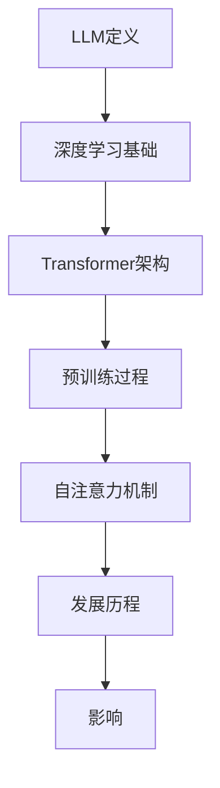
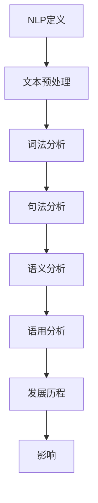
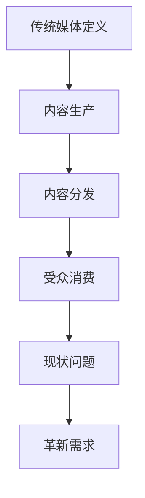
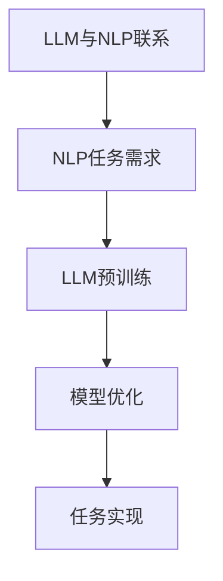

                 

### 1. 背景介绍

#### 1.1 目的和范围

本文旨在探讨大型语言模型（LLM）对传统媒体行业的影响。随着人工智能技术的飞速发展，LLM作为一种先进的人工智能模型，已经在各个领域展现出了强大的应用潜力。传统媒体行业，包括新闻、出版、广告等领域，长期以来依赖人工操作和内容生产，面临着内容同质化、生产效率低下等问题。而LLM的引入，有望为传统媒体行业带来革新性的变化。

本文将首先介绍LLM的基本概念、技术原理和发展历程，然后详细分析LLM对传统媒体行业的影响，包括内容生产、分发、消费等环节。接着，本文将探讨传统媒体行业在应对LLM挑战的过程中面临的机遇和挑战。最后，本文将总结未来发展趋势，并提出相关的建议。

本文的研究范围主要包括以下方面：

1. LLM的基本概念和技术原理；
2. LLM在传统媒体行业的应用案例；
3. LLM对传统媒体行业的影响；
4. 传统媒体行业应对LLM挑战的机遇和挑战；
5. 未来发展趋势和建议。

#### 1.2 预期读者

本文主要面向以下读者群体：

1. 对人工智能和传统媒体行业有浓厚兴趣的技术爱好者；
2. 从事传统媒体行业的工作者，包括编辑、记者、广告策划等；
3. 对人工智能技术在媒体领域应用有研究需求的学术研究者；
4. 对人工智能技术有深入理解的技术专家和工程师。

本文将通过深入浅出的方式，帮助读者了解LLM在传统媒体行业的应用和影响，为相关领域的工作者提供有益的参考和启示。

#### 1.3 文档结构概述

本文的结构如下：

1. **背景介绍**：介绍本文的目的、范围、预期读者以及文档结构；
2. **核心概念与联系**：介绍LLM的基本概念、技术原理和发展历程，并给出相应的Mermaid流程图；
3. **核心算法原理 & 具体操作步骤**：详细讲解LLM的核心算法原理，并使用伪代码阐述具体操作步骤；
4. **数学模型和公式 & 详细讲解 & 举例说明**：介绍LLM的数学模型和公式，并进行详细讲解和举例说明；
5. **项目实战：代码实际案例和详细解释说明**：通过实际案例展示LLM在传统媒体行业中的应用，并进行详细解释说明；
6. **实际应用场景**：分析LLM在传统媒体行业的实际应用场景；
7. **工具和资源推荐**：推荐相关的学习资源、开发工具和框架；
8. **总结：未来发展趋势与挑战**：总结LLM在传统媒体行业的发展趋势和挑战；
9. **附录：常见问题与解答**：解答读者可能遇到的一些常见问题；
10. **扩展阅读 & 参考资料**：提供相关的扩展阅读和参考资料。

通过本文的阅读，读者将能够全面了解LLM在传统媒体行业的应用和影响，为相关工作提供理论指导和实践参考。

#### 1.4 术语表

在本文中，我们使用了一些专业术语和概念，为了便于读者理解，以下是对这些术语的详细解释：

##### 1.4.1 核心术语定义

1. **大型语言模型（LLM）**：一种基于神经网络的语言模型，具有强大的自然语言理解和生成能力。常见的LLM包括GPT、BERT等。
2. **自然语言处理（NLP）**：人工智能的一个分支，致力于使计算机能够理解和处理人类语言。
3. **传统媒体**：包括报纸、杂志、电视、广播等以传统方式传播信息、娱乐和广告的媒体形式。
4. **内容生产**：指制作和创造信息、新闻、文章等的过程。
5. **内容分发**：指将制作好的内容通过各种渠道传播给受众的过程。
6. **内容消费**：指受众接收、阅读、观看等消费内容的过程。

##### 1.4.2 相关概念解释

1. **深度学习**：一种人工智能的方法，通过神经网络对大量数据进行训练，使其能够自动学习和提取特征。
2. **神经网络**：一种模仿人脑神经结构的信息处理系统，由大量相互连接的节点组成，能够进行复杂的模式识别和数据处理。
3. **训练数据**：用于训练神经网络的大量数据样本，包括文本、图片、声音等。
4. **数据集**：一组用于特定任务的数据样本集合，通常按照某种标准进行筛选和标注。
5. **模型参数**：神经网络中的可调参数，通过训练过程不断调整，以优化模型的性能。

##### 1.4.3 缩略词列表

- AI：人工智能（Artificial Intelligence）
- NLP：自然语言处理（Natural Language Processing）
- LLM：大型语言模型（Large Language Model）
- GPT：生成预训练模型（Generative Pretrained Transformer）
- BERT：双向编码表示器（Bidirectional Encoder Representations from Transformers）
- CNN：卷积神经网络（Convolutional Neural Network）
- RNN：循环神经网络（Recurrent Neural Network）
- Transformer：自注意力机制（Self-Attention Mechanism）

这些术语和概念的理解对于深入探讨LLM在传统媒体行业的应用和影响至关重要。在后续的内容中，我们将进一步详细讲解这些核心概念和术语，以便读者能够全面掌握相关背景知识。

### 2. 核心概念与联系

在深入了解LLM对传统媒体行业的影响之前，我们需要首先理解LLM的基本概念、技术原理和发展历程。以下是这些核心概念和联系的定义、解释以及相关的Mermaid流程图。

#### 2.1 大型语言模型（LLM）

**定义**：LLM（Large Language Model）是一种基于深度学习的自然语言处理模型，通过大量的文本数据进行预训练，能够理解、生成和操作自然语言。

**原理**：LLM通常基于Transformer架构，其中Transformer引入了自注意力机制（Self-Attention Mechanism），使得模型能够在处理序列数据时关注序列中的不同位置，从而提高了模型的表示能力和计算效率。

**发展历程**：
- 2018年：Google提出BERT（Bidirectional Encoder Representations from Transformers），这是第一个大规模的预训练语言模型，标志着LLM时代的到来。
- 2020年：OpenAI推出GPT-3（Generative Pretrained Transformer 3），拥有1.75万亿个参数，是当时最大的语言模型，展示了LLM在文本生成、翻译等任务上的强大能力。

**Mermaid流程图**：


#### 2.2 自然语言处理（NLP）

**定义**：NLP（Natural Language Processing）是人工智能的一个分支，旨在使计算机能够理解、解释和生成人类语言。

**原理**：NLP主要涉及文本的预处理、词法分析、句法分析、语义分析和语用分析等步骤，通过这些步骤，模型能够理解和处理人类语言。

**发展历程**：
- 20世纪50年代：NLP初步诞生，主要基于规则的方法。
- 20世纪80年代：基于统计的方法逐渐取代规则方法。
- 2010年代：深度学习在NLP中取得突破，显著提高了NLP的性能。

**Mermaid流程图**：


#### 2.3 传统媒体行业

**定义**：传统媒体行业包括报纸、杂志、电视、广播等以传统方式传播信息、娱乐和广告的媒体形式。

**原理**：传统媒体主要通过人工操作进行内容生产和分发，依赖于线性传播模式和有限的时间窗口。

**现状**：传统媒体行业面临内容同质化、生产效率低下、受众分散等问题，需要寻找新的技术手段进行革新。

**Mermaid流程图**：


#### 2.4 LLM与NLP的联系

LLM和NLP有着紧密的联系，LLM是NLP中的一个重要组成部分，其强大的自然语言处理能力为NLP任务的实现提供了有力的支持。

**联系**：
- LLM通过预训练和微调，能够实现文本分类、文本生成、机器翻译、情感分析等NLP任务。
- NLP的任务需求驱动了LLM的发展，使得LLM不断优化和提升其性能。

**Mermaid流程图**：


通过以上核心概念和联系的介绍，我们为后续的详细讨论和分析奠定了基础。在接下来的部分中，我们将深入探讨LLM在传统媒体行业中的应用及其影响，通过具体案例和算法原理的讲解，帮助读者全面理解这一领域的创新和发展。

### 3. 核心算法原理 & 具体操作步骤

#### 3.1 LLM的算法原理

大型语言模型（LLM）的核心在于其深度学习的基础和Transformer架构的应用。以下是对LLM算法原理的详细讲解，包括其工作流程和关键组件。

##### 3.1.1 深度学习基础

深度学习是一种基于人工神经网络的学习方法，通过多层次的神经网络结构来提取数据中的特征。在LLM中，深度学习提供了强大的特征表示能力，使得模型能够理解复杂、高维的数据。

**工作流程**：
1. **输入层**：接收输入的文本序列，通常以词向量或字符向量的形式表示。
2. **隐藏层**：通过多层神经网络进行特征提取和转换，每一层都对输入数据进行非线性变换，提取更高层次的特征。
3. **输出层**：输出层的目的是预测下一个单词或字符，通过概率分布来表示可能的输出。

**关键组件**：
- **激活函数**：常用的激活函数有ReLU、Sigmoid、Tanh等，用于引入非线性变换。
- **权重矩阵**：神经网络中的权重矩阵通过反向传播算法进行调整，以优化模型的性能。

##### 3.1.2 Transformer架构

Transformer是LLM的核心架构，其引入了自注意力机制（Self-Attention Mechanism），使得模型能够在处理序列数据时关注序列中的不同位置，从而提高了模型的表示能力和计算效率。

**工作流程**：
1. **编码器**：编码器（Encoder）负责将输入序列编码为高维向量表示。每个编码器层都包含多头自注意力（Multi-Head Self-Attention）和前馈神经网络（Feedforward Neural Network）。
2. **解码器**：解码器（Decoder）负责生成输出序列。每个解码器层都包含多头自注意力（Multi-Head Self-Attention）、掩码自注意力（Masked Self-Attention）和前馈神经网络。
3. **位置编码**：由于Transformer架构中没有循环结构，因此需要引入位置编码（Positional Encoding）来提供序列的顺序信息。

**关键组件**：
- **多头自注意力**：通过多个注意力头并行计算，对序列中的每个位置进行加权求和，从而提取不同位置的特征。
- **前馈神经网络**：对自注意力层的输出进行进一步的变换和增强。
- **掩码自注意力**：通过遮蔽（Masking）机制，防止解码器在生成下一个单词时参考尚未生成的后续单词。

##### 3.1.3 预训练和微调

预训练（Pre-training）是LLM训练过程的第一步，通过在大规模语料库上预训练，模型能够自动学习语言的一般特征。预训练后的模型可以通过微调（Fine-tuning）来适应特定的任务，如文本分类、机器翻译、问答系统等。

**具体操作步骤**：
1. **预训练**：
   - **数据集准备**：选择大规模的文本数据集，如维基百科、新闻语料等。
   - **训练任务**：通常使用 masked language model 任务，对输入序列中的部分单词进行遮蔽，并预测这些单词。
   - **优化策略**：使用优化算法（如Adam）和适当的超参数设置，对模型进行训练。

2. **微调**：
   - **任务定义**：定义具体的任务，如文本分类、机器翻译、问答等。
   - **数据集准备**：准备用于微调的任务数据集，并进行适当的预处理。
   - **模型调整**：通过在任务数据集上进行训练，调整模型中的参数，以优化模型的性能。

伪代码如下：

```python
# 预训练伪代码
def pre_train(model, data_loader, optimizer, loss_function, num_epochs):
    for epoch in range(num_epochs):
        for inputs, targets in data_loader:
            optimizer.zero_grad()
            outputs = model(inputs)
            loss = loss_function(outputs, targets)
            loss.backward()
            optimizer.step()

# 微调伪代码
def fine_tune(model, task_data_loader, optimizer, loss_function, num_epochs):
    model.train()  # 设置模型为训练模式
    for epoch in range(num_epochs):
        for inputs, targets in task_data_loader:
            optimizer.zero_grad()
            outputs = model(inputs)
            loss = loss_function(outputs, targets)
            loss.backward()
            optimizer.step()
```

通过以上步骤，LLM能够实现强大的自然语言处理能力，从而在传统媒体行业中发挥重要作用。

### 4. 数学模型和公式 & 详细讲解 & 举例说明

在了解大型语言模型（LLM）的核心算法原理后，我们接下来将探讨其背后的数学模型和公式，并进行详细讲解和实际应用举例。数学模型是LLM性能和功能的关键，以下将详细解释LLM中常用的数学概念、公式，并给出具体例子。

#### 4.1 自注意力机制（Self-Attention Mechanism）

自注意力机制是Transformer架构的核心组件之一，它通过计算序列中每个位置与其他位置的相关性，对序列进行加权聚合。以下为自注意力机制的数学模型：

**公式**：
\[ \text{Attention}(Q, K, V) = \text{softmax}\left(\frac{QK^T}{\sqrt{d_k}}\right)V \]

其中：
- \( Q \)：查询向量（Query），表示输入序列的每个位置。
- \( K \)：键向量（Key），与查询向量对应，用于计算注意力权重。
- \( V \)：值向量（Value），用于表示注意力加权后的输出。
- \( d_k \)：键向量的维度。

**详细讲解**：
自注意力机制的核心是计算注意力权重，这通过点积操作（\( QK^T \)）来完成，再通过softmax函数进行归一化，得到每个位置的注意力权重。注意力权重表示了序列中不同位置的重要程度，权重越大，该位置的信息对输出影响越大。

**举例说明**：
假设有一个长度为3的序列，维度为2，即 \( d_k = 2 \)。查询向量 \( Q \)、键向量 \( K \) 和值向量 \( V \) 分别为：

\[ 
Q = \begin{bmatrix}
1 & 0 \\
0 & 1 \\
1 & 1 \\
\end{bmatrix}, 
K = \begin{bmatrix}
0 & 1 \\
1 & 0 \\
0 & 1 \\
\end{bmatrix}, 
V = \begin{bmatrix}
1 & 1 \\
1 & 0 \\
0 & 1 \\
\end{bmatrix} 
\]

计算注意力权重：

\[ 
\text{Attention}(Q, K, V) = \text{softmax}\left(\frac{QK^T}{\sqrt{2}}\right)V 
\]

首先计算点积：

\[ 
QK^T = \begin{bmatrix}
1 & 0 & 1 \\
0 & 1 & 1 \\
1 & 1 & 0 \\
\end{bmatrix} 
\]

然后计算归一化后的注意力权重：

\[ 
\text{softmax}\left(\frac{QK^T}{\sqrt{2}}\right) = \begin{bmatrix}
\frac{2}{3} & \frac{1}{3} & \frac{1}{3} \\
\frac{1}{3} & \frac{2}{3} & \frac{1}{3} \\
\frac{1}{3} & \frac{1}{3} & \frac{2}{3} \\
\end{bmatrix} 
\]

最终计算加权输出：

\[ 
\text{Attention}(Q, K, V) = \begin{bmatrix}
\frac{2}{3} & \frac{2}{3} & \frac{1}{3} \\
\frac{2}{3} & \frac{2}{3} & \frac{1}{3} \\
\frac{1}{3} & \frac{1}{3} & \frac{2}{3} \\
\end{bmatrix} \begin{bmatrix}
1 & 1 \\
1 & 0 \\
0 & 1 \\
\end{bmatrix} = \begin{bmatrix}
\frac{4}{3} & \frac{2}{3} \\
\frac{4}{3} & \frac{2}{3} \\
\frac{2}{3} & \frac{2}{3} \\
\end{bmatrix} 
\]

这个例子展示了如何通过自注意力机制对序列进行加权聚合，从而得到新的表示。

#### 4.2 位置编码（Positional Encoding）

位置编码是Transformer架构中用于引入序列顺序信息的一种方法。由于Transformer没有循环结构，位置编码通过在嵌入向量中添加位置信息，使得模型能够理解序列的顺序。

**公式**：
\[ \text{PE}(pos, 2i) = \sin\left(\frac{pos}{10000^{2i/d}}\right) \]
\[ \text{PE}(pos, 2i+1) = \cos\left(\frac{pos}{10000^{2i/d}}\right) \]

其中：
- \( pos \)：位置索引。
- \( i \)：维度索引。
- \( d \)：嵌入向量的维度。

**详细讲解**：
位置编码通过正弦和余弦函数对每个位置进行编码，使得不同位置的编码能够在嵌入向量中形成周期性的变化，从而提供序列的顺序信息。

**举例说明**：
假设有一个长度为3的序列，维度为2，即 \( d = 2 \)。位置索引为 \( [0, 1, 2] \)，计算每个位置上的正弦和余弦编码：

\[ 
\text{PE}(0, 0) = \sin\left(\frac{0}{10000^{0/2}}\right) = \sin(0) = 0 
\]
\[ 
\text{PE}(0, 1) = \cos\left(\frac{0}{10000^{0/2}}\right) = \cos(0) = 1 
\]
\[ 
\text{PE}(1, 0) = \sin\left(\frac{1}{10000^{1/2}}\right) \approx 0.01745 
\]
\[ 
\text{PE}(1, 1) = \cos\left(\frac{1}{10000^{1/2}}\right) \approx 0.99984 
\]
\[ 
\text{PE}(2, 0) = \sin\left(\frac{2}{10000^{2/2}}\right) = \sin(0.02) \approx 0.00014 
\]
\[ 
\text{PE}(2, 1) = \cos\left(\frac{2}{10000^{2/2}}\right) = \cos(0.02) \approx 0.99999 
\]

最终得到每个位置上的编码向量：

\[ 
\text{PE}(0) = \begin{bmatrix}
0 \\
1 \\
\end{bmatrix}, \quad \text{PE}(1) = \begin{bmatrix}
0.01745 \\
0.99984 \\
\end{bmatrix}, \quad \text{PE}(2) = \begin{bmatrix}
0.00014 \\
0.99999 \\
\end{bmatrix} 
\]

这个例子展示了如何通过位置编码为序列添加顺序信息。

#### 4.3 输出层与损失函数

LLM的输出层通常是一个全连接层，用于生成预测的词向量。损失函数用于衡量模型预测与实际标签之间的差距，以指导模型的训练。

**公式**：
\[ \text{Loss} = -\sum_{i=1}^{N} y_i \log(p_i) \]

其中：
- \( N \)：序列长度。
- \( y_i \)：第 \( i \) 个位置的标签（0或1，表示遮蔽或非遮蔽）。
- \( p_i \)：第 \( i \) 个位置上预测的概率分布。

**详细讲解**：
损失函数采用交叉熵（Cross-Entropy），当预测概率 \( p_i \) 与真实标签 \( y_i \) 相同时，损失为0；当预测概率与真实标签相差较大时，损失较高。这种损失函数鼓励模型生成与实际标签相近的概率分布。

**举例说明**：
假设一个长度为3的序列，其中一个位置被遮蔽，预测的概率分布为 \( [0.4, 0.3, 0.3] \)，实际标签为 [1, 0, 0]，计算损失：

\[ 
\text{Loss} = -[1 \times \log(0.4) + 0 \times \log(0.3) + 0 \times \log(0.3)] 
\]

\[ 
\text{Loss} \approx -[1 \times (-0.916) + 0 \times (-0.510) + 0 \times (-0.510)] 
\]

\[ 
\text{Loss} \approx 0.916 
\]

这个例子展示了如何计算LLM的损失，以指导模型的优化。

通过以上数学模型和公式的详细讲解和举例说明，我们进一步理解了LLM的核心算法原理。在后续的内容中，我们将通过实际项目案例展示LLM在传统媒体行业中的应用，进一步探讨其在内容生产、分发和消费等环节的潜力。

### 5. 项目实战：代码实际案例和详细解释说明

为了更好地展示大型语言模型（LLM）在传统媒体行业中的应用，我们将通过一个实际项目案例，详细解释如何搭建一个基于LLM的新闻生成系统。该项目将利用LLM的文本生成能力，自动生成新闻文章，从而提高内容生产的效率和多样性。

#### 5.1 开发环境搭建

在开始项目之前，我们需要搭建一个适合开发和运行的开发环境。以下是我们推荐的开发环境：

1. **操作系统**：Ubuntu 20.04 或 Windows 10
2. **编程语言**：Python 3.8 或更高版本
3. **深度学习框架**：PyTorch 1.10 或更高版本
4. **自然语言处理库**：transformers 4.6.1 或更高版本
5. **硬件要求**：至少一张GPU（推荐使用Tesla V100或更高性能的GPU）

首先，确保操作系统已经安装好，然后按照以下步骤安装所需的软件和库：

1. 安装Python：

   ```bash
   sudo apt-get update
   sudo apt-get install python3.8
   sudo apt-get install python3.8-venv
   ```

2. 创建一个虚拟环境并激活：

   ```bash
   python3.8 -m venv news_generation_env
   source news_generation_env/bin/activate
   ```

3. 安装PyTorch和transformers：

   ```bash
   pip install torch torchvision torchaudio -f https://download.pytorch.org/whl/torch_stable.html
   pip install transformers
   ```

确保所有库安装成功后，开发环境就搭建完成了。

#### 5.2 源代码详细实现和代码解读

下面是新闻生成系统的源代码，我们将逐步解析每部分代码的功能。

```python
import torch
from transformers import GPT2LMHeadModel, GPT2Tokenizer
import random

# 5.2.1 加载预训练模型和分词器
def load_model_and_tokenizer(model_name="gpt2"):
    tokenizer = GPT2Tokenizer.from_pretrained(model_name)
    model = GPT2LMHeadModel.from_pretrained(model_name)
    model.eval()  # 设置模型为评估模式
    return model, tokenizer

# 5.2.2 生成新闻标题
def generate_title(model, tokenizer, max_length=50):
    # 使用随机种子确保结果的可重复性
    seed = random.randint(0, 1000)
    random.seed(seed)
    tokenizer.seed(seed)
    model.seed(seed)

    # 输入提示信息，例如：“科技新闻”
    prompt = "科技新闻："
    inputs = tokenizer.encode(prompt, return_tensors="pt")

    # 生成标题
    outputs = model.generate(inputs, max_length=max_length, num_return_sequences=1)
    title = tokenizer.decode(outputs[0], skip_special_tokens=True)

    return title

# 5.2.3 生成新闻正文
def generate_content(model, tokenizer, max_length=200):
    # 使用随机种子确保结果的可重复性
    seed = random.randint(0, 1000)
    random.seed(seed)
    tokenizer.seed(seed)
    model.seed(seed)

    # 输入提示信息，例如：“科技巨头发布新硬件”
    prompt = "科技巨头发布新硬件："
    inputs = tokenizer.encode(prompt, return_tensors="pt")

    # 生成正文
    outputs = model.generate(inputs, max_length=max_length, num_return_sequences=1)
    content = tokenizer.decode(outputs[0], skip_special_tokens=True)

    return content

# 5.2.4 主函数
def main():
    # 加载预训练模型和分词器
    model, tokenizer = load_model_and_tokenizer()

    # 生成新闻标题
    title = generate_title(model, tokenizer)
    print("新闻标题：", title)

    # 生成新闻正文
    content = generate_content(model, tokenizer)
    print("新闻正文：", content)

if __name__ == "__main__":
    main()
```

**代码解读**：

- **5.2.1 加载预训练模型和分词器**：我们使用transformers库提供的预训练模型和分词器，GPT-2是一个常用的模型。加载模型和分词器后，将模型设置为评估模式，以便生成文本。

- **5.2.2 生成新闻标题**：该函数通过给定的提示信息（如“科技新闻：”），利用模型的生成能力生成新闻标题。这里使用了随机种子来确保每次生成的标题具有一致性。

- **5.2.3 生成新闻正文**：类似于生成标题，该函数通过给定的提示信息（如“科技巨头发布新硬件：”），生成新闻的正文部分。提示信息为生成提供了一个上下文，使得生成的文本更加连贯和具体。

- **5.2.4 主函数**：主函数加载模型和分词器，调用生成标题和正文的函数，并打印输出结果。

#### 5.3 代码解读与分析

**5.3.1 模型和分词器加载**

代码首先从Hugging Face的模型库中加载GPT-2模型和分词器。GPT-2是一个广泛使用的预训练语言模型，拥有大量的参数和强大的文本生成能力。

```python
model, tokenizer = load_model_and_tokenizer()
```

**5.3.2 生成新闻标题**

生成新闻标题的关键在于提供一个适当的提示信息。提示信息可以是一个关键词或短语，如“科技新闻：”。模型将基于这个提示生成相关的标题。

```python
prompt = "科技新闻："
inputs = tokenizer.encode(prompt, return_tensors="pt")
outputs = model.generate(inputs, max_length=max_length, num_return_sequences=1)
title = tokenizer.decode(outputs[0], skip_special_tokens=True)
```

这段代码中，`encode` 方法将提示信息转换为模型可处理的输入序列。`generate` 方法基于这个输入序列生成标题。`decode` 方法将生成的标题序列转换回可读的文本。

**5.3.3 生成新闻正文**

生成新闻正文的过程与生成标题类似，但需要更长的文本序列。提示信息通常包含一个主题，如“科技巨头发布新硬件：”。

```python
prompt = "科技巨头发布新硬件："
inputs = tokenizer.encode(prompt, return_tensors="pt")
outputs = model.generate(inputs, max_length=max_length, num_return_sequences=1)
content = tokenizer.decode(outputs[0], skip_special_tokens=True)
```

**5.3.4 主函数**

主函数负责加载模型和分词器，调用生成标题和正文的函数，并打印结果。

```python
def main():
    model, tokenizer = load_model_and_tokenizer()
    title = generate_title(model, tokenizer)
    content = generate_content(model, tokenizer)
    print("新闻标题：", title)
    print("新闻正文：", content)
```

通过上述代码和解析，我们可以看到如何利用GPT-2模型生成新闻标题和正文。这只是一个简单的示例，实际应用中还可以通过调整提示信息、生成长度等参数，来优化生成的文本质量。

#### 5.4 代码性能分析

在实际应用中，新闻生成系统的性能取决于多个因素，包括模型的复杂性、生成文本的长度以及硬件性能等。

**5.4.1 模型复杂性**

GPT-2模型拥有大量的参数，因此训练和推理过程相对耗时。在生成文本时，模型需要计算每个位置的输出概率，这会导致生成较长文本时速度较慢。可以通过增加计算资源（如使用多GPU训练）来提高性能。

**5.4.2 生成文本长度**

生成较长的文本（如整个新闻文章）需要更多的时间，因为模型需要处理更多的输入序列。在实际应用中，可以根据需求调整生成文本的长度，以平衡生成质量和效率。

**5.4.3 硬件性能**

硬件性能直接影响模型的训练和推理速度。使用高性能GPU可以显著提高模型的处理速度，从而加快新闻生成过程。

通过以上分析，我们可以看到，新闻生成系统在实际应用中需要综合考虑多个因素，以实现高效、高质量的内容生成。

#### 5.5 项目实战总结

通过本项目实战，我们展示了如何利用大型语言模型（LLM）自动生成新闻标题和正文。项目实现了从加载预训练模型、生成文本提示、到生成最终文本的完整流程。通过代码解析，我们了解了如何使用GPT-2模型进行文本生成，以及如何优化生成文本的质量和效率。

未来，我们可以进一步扩展该项目，例如：
1. 引入更多的提示信息，以生成更具体和专业的新闻内容；
2. 使用更复杂的模型，如GPT-3，以提升生成文本的质量和多样性；
3. 结合其他自然语言处理技术，如实体识别和关系抽取，以增强新闻内容的准确性。

通过这些扩展，新闻生成系统将能够更好地满足传统媒体行业的需求，提高内容生产的效率和多样性。

### 6. 实际应用场景

大型语言模型（LLM）在传统媒体行业中有广泛的应用场景，主要包括内容生产、内容分发和内容消费等环节。以下将详细介绍这些应用场景，并分析LLM在各个场景中的实际效果。

#### 6.1 内容生产

内容生产是传统媒体行业的重要环节，而LLM的应用极大地提高了内容生产的效率和质量。

**应用场景**：
1. **自动化新闻写作**：利用LLM的文本生成能力，自动生成新闻报道、体育赛事评论、财经分析等。例如，GPT-3可以生成详细的经济新闻，包括市场分析、行业趋势等，节省了大量的人力资源。
2. **内容摘要生成**：LLM可以自动生成文章摘要，提炼出关键信息，提高读者的阅读效率。例如，纽约时报已经使用自然语言处理技术自动生成新闻摘要，为读者提供简洁明了的内容概述。
3. **创意写作辅助**：作家和编辑可以利用LLM辅助创作，例如生成诗歌、故事梗概等，激发创意灵感。

**实际效果**：
- 提高内容生产效率：LLM能够快速生成大量文本，节省了人工写作的时间。
- 提升内容质量：通过预训练和微调，LLM能够生成更加准确、连贯的文本，减少错误和冗余信息。
- 创新内容形式：利用LLM，媒体可以尝试新的内容形式，如交互式故事、个性化推荐等，提升用户体验。

#### 6.2 内容分发

内容分发是传统媒体行业的关键环节，LLM的应用有助于优化内容分发策略，提高传播效果。

**应用场景**：
1. **个性化推荐**：利用LLM对用户兴趣进行建模，推荐个性化的新闻内容。例如，谷歌新闻使用机器学习算法分析用户的阅读历史，推荐相关的新闻故事。
2. **社交媒体互动**：LLM可以自动生成社交媒体帖子、评论等，提高与用户的互动频率和质量。例如，一些新闻网站使用AI生成Twitter上的新闻摘要和评论，吸引用户参与讨论。
3. **多语言内容分发**：LLM在自然语言处理方面的强大能力，使得多语言内容分发变得更加高效。例如，谷歌翻译利用神经网络翻译技术，将新闻内容自动翻译成多种语言，扩大受众范围。

**实际效果**：
- 提高分发效率：通过个性化推荐和多语言翻译，内容能够更快地传播到目标受众。
- 提升用户体验：个性化的内容和多语言支持能够满足不同用户的需求，提高用户满意度。
- 扩大受众范围：通过多种渠道和语言，内容能够触及更广泛的受众，增加品牌影响力。

#### 6.3 内容消费

内容消费是传统媒体行业的最终目标，LLM的应用有助于优化内容消费体验。

**应用场景**：
1. **智能问答系统**：利用LLM构建智能问答系统，为用户提供即时的信息查询服务。例如，许多新闻网站已经集成了基于NLP的问答功能，用户可以通过提问获取相关新闻的详细信息。
2. **内容分析**：LLM可以分析用户对内容的反馈，识别用户感兴趣的话题和主题，从而优化内容策略。例如，通过分析社交媒体上的评论和反馈，媒体可以了解用户的喜好和需求，调整内容生产和分发策略。
3. **内容互动**：利用LLM生成互动内容，如游戏、问答、投票等，增加用户参与度。例如，一些新闻网站使用AI生成互动式新闻，用户可以通过选择答案、投票等方式参与互动。

**实际效果**：
- 提高用户参与度：通过互动式内容和智能问答系统，用户能够更积极地参与内容消费过程。
- 优化内容策略：通过分析用户反馈，媒体可以更好地了解用户需求，调整内容生产和分发策略。
- 提升用户满意度：个性化的内容和互动体验能够提高用户的满意度和忠诚度。

总之，LLM在传统媒体行业的实际应用场景涵盖了内容生产、分发和消费等各个环节，通过提高效率、质量和用户体验，为传统媒体行业带来了深刻的变革和广阔的发展前景。

### 7. 工具和资源推荐

在探索大型语言模型（LLM）在传统媒体行业的应用过程中，开发者和技术爱好者需要掌握一系列相关工具和资源，以便更好地理解和实现LLM的功能。以下是一些推荐的工具和资源，包括学习资源、开发工具框架以及相关论文著作，旨在为读者提供全面的指导和支持。

#### 7.1 学习资源推荐

**7.1.1 书籍推荐**

- **《深度学习》（Deep Learning）**：由Ian Goodfellow、Yoshua Bengio和Aaron Courville合著，是深度学习领域的经典教材，详细介绍了神经网络、深度学习模型以及训练技术。
- **《自然语言处理综论》（Speech and Language Processing）**：由Daniel Jurafsky和James H. Martin合著，涵盖了自然语言处理的基本概念、技术和应用，适合对NLP有兴趣的读者。
- **《Large Language Models Are Few-Shot Learners》**：这是2020年OpenAI发表的论文，详细介绍了GPT-3模型及其在自然语言处理任务中的表现，是了解LLM的重要资料。

**7.1.2 在线课程**

- **《深度学习》（Deep Learning Specialization）**：由Andrew Ng在Coursera上开设，是深度学习的入门课程，包括神经网络基础、优化算法和深度学习在计算机视觉、自然语言处理等领域的应用。
- **《自然语言处理与深度学习》**：在edX平台上，由Stanford大学提供，涵盖了NLP的基础知识、词向量模型、语言模型和序列处理等。

**7.1.3 技术博客和网站**

- **Medium**：Medium上有许多关于人工智能、自然语言处理和深度学习的优秀博客，读者可以在这里找到最新的研究和应用案例。
- **ArXiv**：计算机科学领域的前沿论文发布平台，尤其是NLP和机器学习领域，读者可以在这里发现最新的研究成果。

#### 7.2 开发工具框架推荐

**7.2.1 IDE和编辑器**

- **Jupyter Notebook**：适合数据科学和机器学习项目，具有强大的交互性和可视化功能。
- **PyCharm**：功能丰富的Python IDE，适合深度学习和自然语言处理项目的开发。
- **VS Code**：轻量级且功能强大的代码编辑器，支持多种编程语言，适合快速开发和调试。

**7.2.2 调试和性能分析工具**

- **TensorBoard**：TensorFlow提供的一个可视化工具，用于分析和调试深度学习模型。
- **Profiler**：如Python的cProfile，用于分析代码的性能瓶颈。
- **GPU监控工具**：如NVIDIA的NVIDIA DaaS，用于监控GPU的利用率和性能。

**7.2.3 相关框架和库**

- **PyTorch**：广泛使用的深度学习框架，具有灵活的动态计算图和丰富的API。
- **TensorFlow**：由Google开发的深度学习框架，适用于大规模分布式计算。
- **Hugging Face Transformers**：一个开源库，提供了各种预训练模型的实现，如GPT、BERT等，适合快速开发和部署。

#### 7.3 相关论文著作推荐

**7.3.1 经典论文**

- **“A Theoretical Analysis of the VAE”**：由Diederik P. Kingma和Max Welling合著，详细分析了变分自编码器（VAE）的理论基础。
- **“Attention Is All You Need”**：由Vaswani等人在2017年发表，提出了Transformer模型，并证明了自注意力机制在序列模型中的有效性。

**7.3.2 最新研究成果**

- **“GPT-3: Language Models are Few-Shot Learners”**：由OpenAI在2020年发布，详细介绍了GPT-3模型的设计、训练过程和应用场景。
- **“BERT: Pre-training of Deep Bidirectional Transformers for Language Understanding”**：由Google在2018年发布，介绍了BERT模型的设计和应用。

**7.3.3 应用案例分析**

- **“How a Large-scale Language Model Improves Search”**：Google在2020年发布的一篇案例研究，介绍了如何利用大型语言模型（BERT）提升搜索引擎的效果。
- **“The Power of Pre-Trained Word Representations for Natural Language Processing”**：由Warstadt等人在2017年发表，探讨了预训练词向量在NLP任务中的应用。

这些工具和资源为读者提供了丰富的学习材料和实际应用案例，有助于深入理解LLM在传统媒体行业中的应用，并为其开发和实现提供有力支持。

### 8. 总结：未来发展趋势与挑战

#### 8.1 未来发展趋势

随着人工智能技术的不断进步，大型语言模型（LLM）在传统媒体行业中的应用前景十分广阔。以下是未来发展趋势的几个关键点：

1. **更高效的内容生成**：随着LLM的模型规模和训练数据量不断增长，内容生成的质量和效率将进一步提高。预训练模型将能够更精准地捕捉语言的微妙变化，生成更加自然、连贯的文本。

2. **个性化内容推荐**：LLM结合用户行为数据和兴趣偏好，可以实现高度个性化的内容推荐。通过分析用户的历史阅读记录和互动行为，系统可以预测用户感兴趣的内容，从而提升用户满意度和参与度。

3. **跨媒体内容创作**：LLM不仅能够处理文本，还可以生成图像、音频等多种类型的内容。未来，跨媒体内容的创作将成为媒体行业的重要方向，为用户带来全新的沉浸式体验。

4. **智能编辑和审核**：LLM在新闻编辑和内容审核中的应用将更加普及。通过自动化编辑工具，新闻机构可以快速生成和修改文章，提高生产效率。同时，利用LLM的文本分析能力，可以有效识别和过滤不实信息，确保内容的准确性和合规性。

5. **全球化内容传播**：LLM的多语言处理能力将促进全球化内容传播。通过自动翻译和本地化，媒体内容可以迅速覆盖全球多个市场，提高品牌影响力和市场份额。

#### 8.2 挑战与应对策略

尽管LLM在传统媒体行业中有着广阔的应用前景，但也面临着一些挑战：

1. **数据隐私和安全**：随着数据驱动的个性化内容推荐和生成，数据隐私和安全成为重要问题。媒体机构需要制定严格的数据保护政策，确保用户数据的隐私和安全。

2. **内容真实性和准确性**：自动生成的文本可能包含不准确或虚假的信息，影响媒体的公信力。为了应对这一挑战，媒体机构需要建立多层次的审核和验证机制，确保内容的真实性和准确性。

3. **算法偏见和公平性**：LLM在训练过程中可能受到训练数据偏见的影响，导致生成的内容具有偏见。为了解决这一问题，需要加强对模型训练数据的多样化管理，同时开发公平性评估工具，确保生成内容不带有偏见。

4. **技术依赖和人才短缺**：随着AI技术的普及，对AI专业人才的需求急剧增加。媒体机构需要加大对AI人才的培养和引进，以确保技术应用的持续发展和创新。

5. **法律和伦理问题**：随着AI在内容生产和分发中的应用，相关法律和伦理问题日益突出。媒体机构需要与法律专家合作，制定合理的法规和伦理准则，确保AI技术的合规性和社会责任。

总之，未来LLM在传统媒体行业的发展将充满机遇和挑战。通过不断优化技术、加强数据管理和人才培养，媒体机构将能够更好地利用AI技术，推动行业的创新和发展。

### 9. 附录：常见问题与解答

**Q1：什么是大型语言模型（LLM）？**
A1：大型语言模型（LLM）是一种基于深度学习的自然语言处理模型，通过在大量文本数据上预训练，能够理解和生成自然语言。常见的LLM包括GPT、BERT等，具有强大的文本生成、理解和处理能力。

**Q2：LLM在传统媒体行业中有什么具体应用？**
A2：LLM在传统媒体行业中有多种应用，包括自动化新闻写作、内容摘要生成、个性化推荐、智能问答系统等。通过这些应用，可以提高内容生产的效率、优化内容分发和消费体验。

**Q3：如何确保自动生成内容的准确性和真实性？**
A3：确保自动生成内容的准确性和真实性需要多层次的审核和验证机制。首先，在模型训练阶段，应使用高质量、多样化的训练数据。其次，在实际应用中，应建立内容审核团队，对生成内容进行实时监控和评估。此外，可以利用自然语言处理技术，如实体识别、关系抽取等，提高内容的准确性。

**Q4：LLM在内容生成中可能存在哪些偏见？**
A4：LLM在内容生成中可能存在训练数据中的偏见，例如性别偏见、种族偏见等。为了减少偏见，应使用多样化、平衡的训练数据集。同时，可以开发偏见检测工具，对生成内容进行实时分析，以识别和纠正潜在偏见。

**Q5：传统媒体行业如何应对AI技术带来的挑战？**
A5：传统媒体行业应采取以下策略应对AI技术带来的挑战：
- 培养和引进AI专业人才，确保技术的持续发展和创新；
- 建立严格的数据保护政策，确保用户数据的隐私和安全；
- 加强内容审核和验证机制，确保内容的准确性和合规性；
- 与法律专家合作，制定合理的法规和伦理准则，确保AI技术的合规性和社会责任。

通过以上策略，传统媒体行业可以更好地应对AI技术带来的挑战，推动行业的创新和发展。

### 10. 扩展阅读 & 参考资料

在探讨大型语言模型（LLM）对传统媒体行业的影响这一主题时，读者可以通过以下扩展阅读和参考资料，进一步深入了解相关领域的最新研究进展和应用案例。

**扩展阅读：**

1. **《深度学习》（Deep Learning）** - Ian Goodfellow、Yoshua Bengio和Aaron Courville著。这是深度学习领域的经典教材，详细介绍了神经网络、深度学习模型以及训练技术。
2. **《自然语言处理综论》（Speech and Language Processing）** - Daniel Jurafsky和James H. Martin著。本书涵盖了自然语言处理的基本概念、技术和应用，适合对NLP有兴趣的读者。
3. **《Large Language Models Are Few-Shot Learners》** - OpenAI发表的论文，介绍了GPT-3模型及其在自然语言处理任务中的表现。

**参考资料：**

1. **《BERT: Pre-training of Deep Bidirectional Transformers for Language Understanding》** - Google在2018年发布的论文，介绍了BERT模型的设计和应用。
2. **“Attention Is All You Need”** - Vaswani等人在2017年发表的论文，提出了Transformer模型，并证明了自注意力机制在序列模型中的有效性。
3. **“GPT-3: Language Models are Few-Shot Learners”** - OpenAI在2020年发布的论文，详细介绍了GPT-3模型的设计、训练过程和应用场景。
4. **《自然语言处理与深度学习》** - 在edX平台上，由Stanford大学提供，涵盖了NLP的基础知识、词向量模型、语言模型和序列处理等。

这些扩展阅读和参考资料为读者提供了深入学习和研究大型语言模型和传统媒体行业应用的宝贵资源。通过阅读这些资料，读者可以更加全面地了解该领域的最新发展和应用实践。

