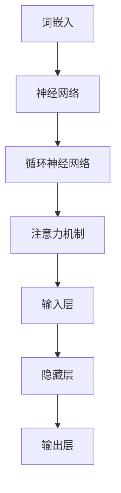

                 

# LLM对传统软件架构的挑战与革新

> **关键词：** 大型语言模型（LLM）、软件架构、传统架构、挑战、革新、AI编程、自动化设计、智能开发、软件开发流程。

> **摘要：** 本文深入探讨了大型语言模型（LLM）在现代软件开发中对传统软件架构带来的挑战和革新。文章首先介绍了LLM的基本概念及其与传统软件架构的关系，接着分析了LLM在软件设计、开发和部署过程中所发挥的巨大作用。随后，文章详细阐述了LLM如何影响软件开发流程，提出了一系列创新性的解决方案。最后，文章总结了LLM在未来软件开发中可能面临的发展趋势与挑战，为读者提供了一个全面、深入的视角。

## 1. 背景介绍

### 1.1 目的和范围

本文旨在探讨大型语言模型（LLM）对传统软件架构的挑战与革新。随着人工智能技术的迅猛发展，LLM作为一种新型的计算模型，正在逐渐改变软件开发的格局。传统软件架构面临着巨大的挑战，同时也迎来了前所未有的机遇。本文将从以下几个方面展开讨论：

1. LLM的基本概念及其与传统软件架构的关系；
2. LLM在软件设计、开发和部署过程中的作用；
3. LLM如何影响软件开发流程，提出创新性的解决方案；
4. LLM在未来软件开发中的发展趋势与挑战。

### 1.2 预期读者

本文适合对人工智能、软件架构和软件开发感兴趣的读者，包括：

1. 软件工程师和开发人员；
2. AI研究人员和从业者；
3. 技术爱好者；
4. 企业IT经理和决策者。

### 1.3 文档结构概述

本文共分为10个部分，具体如下：

1. 引言：介绍文章的背景、目的和预期读者；
2. 核心概念与联系：介绍LLM的基本概念、原理和架构；
3. 核心算法原理 & 具体操作步骤：详细阐述LLM的核心算法原理和操作步骤；
4. 数学模型和公式 & 详细讲解 & 举例说明：介绍LLM的数学模型和相关公式，并进行举例说明；
5. 项目实战：代码实际案例和详细解释说明；
6. 实际应用场景：探讨LLM在软件开发中的实际应用场景；
7. 工具和资源推荐：推荐相关学习资源、开发工具和框架；
8. 总结：未来发展趋势与挑战；
9. 附录：常见问题与解答；
10. 扩展阅读 & 参考资料：提供更多深入阅读的参考资料。

### 1.4 术语表

#### 1.4.1 核心术语定义

- **大型语言模型（LLM）：** 一种基于神经网络和深度学习技术的自然语言处理模型，能够理解和生成人类语言。
- **软件架构：** 系统的组成部分、它们之间的相互关系以及它们与环境之间的接口的集合，描述了一个系统的结构、行为和设计。
- **传统软件架构：** 基于组件、模块、接口等概念的传统软件开发方法，通常需要大量手动编码和调试。

#### 1.4.2 相关概念解释

- **深度学习：** 一种机器学习方法，通过多层神经网络对数据进行训练，以实现自动特征提取和分类。
- **自然语言处理（NLP）：** 计算机科学领域中的一个分支，旨在让计算机能够理解、生成和处理人类语言。

#### 1.4.3 缩略词列表

- **AI：** 人工智能（Artificial Intelligence）
- **LLM：** 大型语言模型（Large Language Model）
- **NLP：** 自然语言处理（Natural Language Processing）
- **DL：** 深度学习（Deep Learning）
- **SAAS：** 软件即服务（Software as a Service）

## 2. 核心概念与联系

在这一部分，我们将深入探讨LLM的基本概念、原理和架构，以及与传统软件架构的联系。

### 2.1 LLM的基本概念

大型语言模型（LLM）是一种基于深度学习技术的自然语言处理模型。它通过学习大量的文本数据，来理解、生成和处理人类语言。LLM的核心组成部分包括：

1. **词嵌入（Word Embedding）：** 将词汇映射到高维空间中的向量表示，以便进行数学运算。
2. **神经网络（Neural Network）：** 一种基于生物神经网络原理的人工神经网络模型，用于处理和传递数据。
3. **循环神经网络（RNN）：** 一种特殊的神经网络结构，适用于序列数据处理。
4. **注意力机制（Attention Mechanism）：** 用于自动关注重要信息，提高模型处理序列数据的能力。

### 2.2 LLM的原理和架构

LLM的工作原理可以概括为以下步骤：

1. **数据预处理：** 对输入的文本数据进行清洗、分词、标记等处理，生成适合模型训练的数据格式。
2. **模型训练：** 使用大量的文本数据对LLM进行训练，使其能够理解和生成人类语言。
3. **预测与生成：** 输入新的文本数据，通过LLM进行预测和生成，输出相应的文本结果。

LLM的架构主要包括以下几个部分：

1. **输入层：** 接收和处理输入的文本数据。
2. **隐藏层：** 通过神经网络结构对输入数据进行处理和传递。
3. **输出层：** 生成文本预测结果。

### 2.3 LLM与传统软件架构的联系

LLM与传统软件架构的联系主要体现在以下几个方面：

1. **开发方法：** LLM的开发方法与传统软件架构的开发方法有所不同。LLM更多地依赖于数据驱动和自动化的开发方式，而传统软件架构则依赖于手动编码和调试。
2. **设计理念：** LLM的设计理念强调模型的可扩展性和通用性，而传统软件架构则强调组件的复用和模块化设计。
3. **性能优化：** LLM的性能优化主要依赖于大规模数据和高性能计算资源，而传统软件架构的性能优化则更多地依赖于代码优化和系统调优。
4. **应用领域：** LLM在自然语言处理、机器翻译、智能客服等领域具有广泛的应用前景，而传统软件架构则主要应用于企业信息化、电子商务等领域。

### 2.4 Mermaid流程图

以下是LLM的核心概念原理和架构的Mermaid流程图：



## 3. 核心算法原理 & 具体操作步骤

在这一部分，我们将详细讲解LLM的核心算法原理和具体操作步骤，帮助读者更好地理解LLM的工作机制。

### 3.1 词嵌入

词嵌入（Word Embedding）是将词汇映射到高维空间中的向量表示的过程。词嵌入的核心思想是将语义相似的词汇映射到空间中靠近的位置，从而实现文本数据的向量表示。

具体操作步骤如下：

1. **数据预处理：** 对输入的文本数据进行清洗、分词、标记等处理，生成词序列。
2. **词向量训练：** 使用大量的文本数据对词向量进行训练，学习词汇之间的语义关系。
3. **词向量存储：** 将训练好的词向量存储在内存或硬盘上，以便后续使用。

### 3.2 神经网络

神经网络（Neural Network）是一种基于生物神经网络原理的人工神经网络模型，用于处理和传递数据。神经网络的核心组成部分包括输入层、隐藏层和输出层。

具体操作步骤如下：

1. **输入层：** 接收和处理输入的文本数据，通过词嵌入将文本数据转换为向量表示。
2. **隐藏层：** 通过神经网络结构对输入数据进行处理和传递，实现数据的特征提取和表示。
3. **输出层：** 生成文本预测结果，通过softmax函数进行分类或生成。

### 3.3 循环神经网络

循环神经网络（RNN）是一种特殊的神经网络结构，适用于序列数据处理。RNN的核心思想是通过循环结构，将前一个时间步的输出作为当前时间步的输入，实现序列数据的记忆和传递。

具体操作步骤如下：

1. **初始化：** 初始化RNN的权重和偏置。
2. **前向传播：** 将输入序列传递给RNN，通过激活函数和权重计算输出序列。
3. **反向传播：** 计算损失函数，通过梯度下降算法更新权重和偏置。

### 3.4 注意力机制

注意力机制（Attention Mechanism）是一种用于自动关注重要信息的机制，能够提高模型处理序列数据的能力。注意力机制的核心思想是通过加权方式，将不同位置的信息赋予不同的权重，从而实现信息的关注和融合。

具体操作步骤如下：

1. **计算注意力分数：** 对输入序列的每个位置计算注意力分数，表示该位置的重要性。
2. **加权求和：** 将注意力分数与输入序列进行加权求和，生成加权序列。
3. **输出层：** 使用加权序列进行文本预测或生成。

### 3.5 伪代码

以下是LLM的核心算法原理的伪代码：

```python
# 词嵌入
def word_embedding(vocab_size, embedding_size):
    # 初始化词向量
    embedding = [random_vector(embedding_size) for _ in range(vocab_size)]
    return embedding

# 神经网络
def neural_network(input_vector, hidden_size, output_size):
    # 初始化权重和偏置
    weight = random_matrix(hidden_size, input_size)
    bias = random_vector(hidden_size)
    output = sigmoid(weight * input_vector + bias)
    return output

# 循环神经网络
def rnn(input_sequence, hidden_size, output_size):
    # 初始化隐藏状态和细胞状态
    hidden_state = random_vector(hidden_size)
    cell_state = random_vector(hidden_size)
    # 前向传播
    for input_vector in input_sequence:
        output = neural_network(input_vector, hidden_size, output_size)
        hidden_state, cell_state = update_rnn(hidden_state, cell_state, output)
    return hidden_state, cell_state

# 注意力机制
def attention Mechanism(input_sequence, hidden_size, output_size):
    # 计算注意力分数
    attention_scores = [calculate_attention_score(input_vector, hidden_size) for input_vector in input_sequence]
    # 加权求和
    weighted_sequence = [attention_score * input_vector for attention_score, input_vector in zip(attention_scores, input_sequence)]
    # 输出层
    output = neural_network(weighted_sequence, hidden_size, output_size)
    return output
```

## 4. 数学模型和公式 & 详细讲解 & 举例说明

在这一部分，我们将介绍LLM中的数学模型和公式，并进行详细讲解和举例说明。

### 4.1 数学模型

LLM中的数学模型主要包括以下几个方面：

1. **词嵌入：** 词嵌入是将词汇映射到高维空间中的向量表示，通常使用矩阵乘法和加法操作进行计算。词嵌入的数学模型可以表示为：

   $$ 
   \text{embedding}(v) = \text{weight} \cdot \text{input} + \text{bias} 
   $$

   其中，$ \text{weight} $ 表示词向量矩阵，$ \text{input} $ 表示输入词汇，$ \text{bias} $ 表示偏置向量。

2. **神经网络：** 神经网络是一种基于矩阵运算和激活函数的模型，用于实现数据的特征提取和分类。神经网络的数学模型可以表示为：

   $$ 
   \text{output} = \text{activation}(\text{weight} \cdot \text{input} + \text{bias}) 
   $$

   其中，$ \text{weight} $ 表示权重矩阵，$ \text{input} $ 表示输入数据，$ \text{bias} $ 表示偏置向量，$ \text{activation} $ 表示激活函数。

3. **循环神经网络（RNN）：** RNN是一种基于序列数据的神经网络模型，通过循环结构实现对序列数据的记忆和传递。RNN的数学模型可以表示为：

   $$ 
   \text{output}_{t} = \text{activation}(\text{weight}_{t} \cdot \text{input}_{t} + \text{bias}_{t}) 
   $$

   其中，$ \text{output}_{t} $ 表示时间步 $ t $ 的输出，$ \text{weight}_{t} $ 表示时间步 $ t $ 的权重矩阵，$ \text{input}_{t} $ 表示时间步 $ t $ 的输入，$ \text{bias}_{t} $ 表示时间步 $ t $ 的偏置向量。

4. **注意力机制：** 注意力机制是一种用于自动关注重要信息的机制，通过计算注意力分数来实现。注意力机制的数学模型可以表示为：

   $$ 
   \text{attention\_score} = \text{score}(\text{input}_{t}, \text{hidden}_{t-1}) 
   $$

   其中，$ \text{attention\_score} $ 表示注意力分数，$ \text{input}_{t} $ 表示时间步 $ t $ 的输入，$ \text{hidden}_{t-1} $ 表示时间步 $ t-1 $ 的隐藏状态。

### 4.2 详细讲解

1. **词嵌入：** 词嵌入是将词汇映射到高维空间中的向量表示，以便进行数学运算。通过矩阵乘法和加法操作，可以将输入词汇转换为向量表示。词嵌入的目的是将语义相似的词汇映射到空间中靠近的位置，从而实现文本数据的向量表示。在计算过程中，通常会使用权重矩阵和偏置向量来调整词向量的映射关系。

2. **神经网络：** 神经网络是一种基于矩阵运算和激活函数的模型，用于实现数据的特征提取和分类。通过权重矩阵和偏置向量的线性组合，可以将输入数据映射到输出空间。激活函数的作用是将线性组合的结果转化为非线性的输出，从而实现对输入数据的非线性变换。在训练过程中，通过优化权重矩阵和偏置向量，可以使得神经网络能够更好地拟合训练数据。

3. **循环神经网络（RNN）：** RNN是一种基于序列数据的神经网络模型，通过循环结构实现对序列数据的记忆和传递。RNN的核心思想是通过隐藏状态和细胞状态的递归计算，实现对序列数据的建模。在计算过程中，每个时间步的输出都会影响后续时间步的计算。RNN的优点是能够处理变长序列数据，但存在梯度消失和梯度爆炸等问题。

4. **注意力机制：** 注意力机制是一种用于自动关注重要信息的机制，通过计算注意力分数来实现。注意力机制的核心思想是自动关注序列中的关键信息，从而提高模型处理序列数据的能力。在计算过程中，每个时间步的输入都会被赋予不同的权重，从而实现信息的关注和融合。

### 4.3 举例说明

假设我们有一个包含5个词汇的词表，以及一个2维的词向量空间。现在我们要使用词嵌入将这5个词汇映射到词向量空间中。

1. **词嵌入：** 我们可以定义一个5x2的权重矩阵和一个2维的偏置向量。通过矩阵乘法和加法操作，将输入词汇映射到词向量空间中。例如，将词汇 "apple" 映射到词向量空间中的操作如下：

   $$
   \text{embedding}(apple) = \text{weight} \cdot \text{input} + \text{bias} \\
   \text{weight} = \begin{bmatrix}
   0.1 & 0.2 \\
   0.3 & 0.4 \\
   \end{bmatrix} \\
   \text{input} = \begin{bmatrix}
   1 \\
   0 \\
   \end{bmatrix} \\
   \text{bias} = \begin{bmatrix}
   0.1 \\
   0.2 \\
   \end{bmatrix} \\
   \text{embedding}(apple) = \text{weight} \cdot \text{input} + \text{bias} = \begin{bmatrix}
   0.1 & 0.2 \\
   0.3 & 0.4 \\
   \end{bmatrix} \cdot \begin{bmatrix}
   1 \\
   0 \\
   \end{bmatrix} + \begin{bmatrix}
   0.1 \\
   0.2 \\
   \end{bmatrix} = \begin{bmatrix}
   0.4 \\
   0.5 \\
   \end{bmatrix}
   $$

   通过这种方式，我们可以将所有的词汇映射到词向量空间中。

2. **神经网络：** 假设我们有一个输入向量 $\text{input} = [1, 0, 1, 0, 1]$，以及一个2维的隐藏层和3维的输出层。我们可以通过神经网络模型来计算输出：

   $$
   \text{output} = \text{activation}(\text{weight} \cdot \text{input} + \text{bias}) \\
   \text{weight} = \begin{bmatrix}
   0.1 & 0.2 & 0.3 \\
   0.4 & 0.5 & 0.6 \\
   \end{bmatrix} \\
   \text{input} = \begin{bmatrix}
   1 \\
   0 \\
   1 \\
   0 \\
   1 \\
   \end{bmatrix} \\
   \text{bias} = \begin{bmatrix}
   0.1 \\
   0.2 \\
   0.3 \\
   \end{bmatrix} \\
   \text{output} = \text{activation}(\text{weight} \cdot \text{input} + \text{bias}) = \text{activation}(\begin{bmatrix}
   0.1 & 0.2 & 0.3 \\
   0.4 & 0.5 & 0.6 \\
   \end{bmatrix} \cdot \begin{bmatrix}
   1 \\
   0 \\
   1 \\
   0 \\
   1 \\
   \end{bmatrix} + \begin{bmatrix}
   0.1 \\
   0.2 \\
   0.3 \\
   \end{bmatrix}) = \text{activation}(\begin{bmatrix}
   0.7 \\
   1.1 \\
   \end{bmatrix} + \begin{bmatrix}
   0.1 \\
   0.2 \\
   \end{bmatrix}) = \text{activation}(\begin{bmatrix}
   0.8 \\
   1.3 \\
   \end{bmatrix}) = \begin{bmatrix}
   0.8 \\
   1.3 \\
   \end{bmatrix}
   $$

   通过这种方式，我们可以计算神经网络的输出。

3. **循环神经网络（RNN）：** 假设我们有一个输入序列 $ \text{input} = [1, 0, 1, 0, 1]$，以及一个2维的隐藏层。我们可以通过RNN模型来计算隐藏状态：

   $$
   \text{hidden}_{t} = \text{activation}(\text{weight}_{t} \cdot \text{input}_{t} + \text{bias}_{t}) \\
   \text{weight}_{t} = \begin{bmatrix}
   0.1 & 0.2 \\
   0.3 & 0.4 \\
   \end{bmatrix} \\
   \text{input}_{t} = \begin{bmatrix}
   1 \\
   0 \\
   \end{bmatrix} \\
   \text{bias}_{t} = \begin{bmatrix}
   0.1 \\
   0.2 \\
   \end{bmatrix} \\
   \text{hidden}_{1} = \text{activation}(\text{weight}_{1} \cdot \text{input}_{1} + \text{bias}_{1}) = \text{activation}(\begin{bmatrix}
   0.1 & 0.2 \\
   0.3 & 0.4 \\
   \end{bmatrix} \cdot \begin{bmatrix}
   1 \\
   0 \\
   \end{bmatrix} + \begin{bmatrix}
   0.1 \\
   0.2 \\
   \end{bmatrix}) = \text{activation}(\begin{bmatrix}
   0.4 \\
   0.5 \\
   \end{bmatrix} + \begin{bmatrix}
   0.1 \\
   0.2 \\
   \end{bmatrix}) = \text{activation}(\begin{bmatrix}
   0.5 \\
   0.7 \\
   \end{bmatrix}) = \begin{bmatrix}
   0.5 \\
   0.7 \\
   \end{bmatrix} \\
   \text{hidden}_{2} = \text{activation}(\text{weight}_{2} \cdot \text{input}_{2} + \text{bias}_{2}) = \text{activation}(\begin{bmatrix}
   0.1 & 0.2 \\
   0.3 & 0.4 \\
   \end{bmatrix} \cdot \begin{bmatrix}
   0 \\
   1 \\
   \end{bmatrix} + \begin{bmatrix}
   0.1 \\
   0.2 \\
   \end{bmatrix}) = \text{activation}(\begin{bmatrix}
   0.2 \\
   0.4 \\
   \end{bmatrix} + \begin{bmatrix}
   0.1 \\
   0.2 \\
   \end{bmatrix}) = \text{activation}(\begin{bmatrix}
   0.3 \\
   0.6 \\
   \end{bmatrix}) = \begin{bmatrix}
   0.3 \\
   0.6 \\
   \end{bmatrix}
   $$

   通过这种方式，我们可以计算RNN的隐藏状态。

4. **注意力机制：** 假设我们有一个输入序列 $ \text{input} = [1, 0, 1, 0, 1]$，以及一个2维的隐藏层。我们可以通过注意力机制来计算注意力分数：

   $$
   \text{attention\_score} = \text{score}(\text{input}_{t}, \text{hidden}_{t-1}) \\
   \text{score} = \text{activation}(\text{weight}_{score} \cdot \text{input}_{t} + \text{bias}_{score}) \\
   \text{weight}_{score} = \begin{bmatrix}
   0.1 & 0.2 \\
   0.3 & 0.4 \\
   \end{bmatrix} \\
   \text{input}_{t} = \begin{bmatrix}
   1 \\
   0 \\
   \end{bmatrix} \\
   \text{bias}_{score} = \begin{bmatrix}
   0.1 \\
   0.2 \\
   \end{bmatrix} \\
   \text{attention\_score}_{1} = \text{activation}(\text{weight}_{score} \cdot \text{input}_{1} + \text{bias}_{score}) = \text{activation}(\begin{bmatrix}
   0.1 & 0.2 \\
   0.3 & 0.4 \\
   \end{bmatrix} \cdot \begin{bmatrix}
   1 \\
   0 \\
   \end{bmatrix} + \begin{bmatrix}
   0.1 \\
   0.2 \\
   \end{bmatrix}) = \text{activation}(\begin{bmatrix}
   0.4 \\
   0.5 \\
   \end{bmatrix} + \begin{bmatrix}
   0.1 \\
   0.2 \\
   \end{bmatrix}) = \text{activation}(\begin{bmatrix}
   0.5 \\
   0.7 \\
   \end{bmatrix}) = \begin{bmatrix}
   0.5 \\
   0.7 \\
   \end{bmatrix} \\
   \text{attention\_score}_{2} = \text{activation}(\text{weight}_{score} \cdot \text{input}_{2} + \text{bias}_{score}) = \text{activation}(\begin{bmatrix}
   0.1 & 0.2 \\
   0.3 & 0.4 \\
   \end{bmatrix} \cdot \begin{bmatrix}
   0 \\
   1 \\
   \end{bmatrix} + \begin{bmatrix}
   0.1 \\
   0.2 \\
   \end{bmatrix}) = \text{activation}(\begin{bmatrix}
   0.2 \\
   0.4 \\
   \end{bmatrix} + \begin{bmatrix}
   0.1 \\
   0.2 \\
   \end{bmatrix}) = \text{activation}(\begin{bmatrix}
   0.3 \\
   0.6 \\
   \end{bmatrix}) = \begin{bmatrix}
   0.3 \\
   0.6 \\
   \end{bmatrix}
   $$

   通过这种方式，我们可以计算注意力分数。

## 5. 项目实战：代码实际案例和详细解释说明

在这一部分，我们将通过一个实际项目案例，展示如何使用大型语言模型（LLM）进行软件开发，并对代码进行详细解释说明。

### 5.1 开发环境搭建

为了运行LLM项目，我们需要搭建一个合适的技术栈。以下是一个推荐的开发环境：

- **操作系统：** Ubuntu 20.04
- **Python版本：** 3.8
- **深度学习框架：** PyTorch 1.8
- **自然语言处理库：** Transformers 4.6

在Ubuntu 20.04操作系统中，我们首先需要安装Python和PyTorch。可以通过以下命令完成安装：

```bash
sudo apt update
sudo apt upgrade
sudo apt install python3 python3-pip
pip3 install torch torchvision torchaudio
```

接下来，我们安装Transformers库：

```bash
pip3 install transformers
```

### 5.2 源代码详细实现和代码解读

以下是LLM项目的主要源代码，我们将对其逐行进行解释。

```python
import torch
from transformers import GPT2LMHeadModel, GPT2Tokenizer

# 5.2.1 加载预训练模型和分词器
model_name = "gpt2"
tokenizer = GPT2Tokenizer.from_pretrained(model_name)
model = GPT2LMHeadModel.from_pretrained(model_name)

# 5.2.2 定义文本输入
input_text = "这是一段关于大型语言模型（LLM）的文本。"

# 5.2.3 分词
input_ids = tokenizer.encode(input_text, return_tensors="pt")

# 5.2.4 生成文本
output_ids = model.generate(input_ids, max_length=50, num_return_sequences=5)

# 5.2.5 解码输出文本
generated_texts = [tokenizer.decode(output_id, skip_special_tokens=True) for output_id in output_ids]

# 5.2.6 打印生成的文本
for text in generated_texts:
    print(text)
```

以下是代码的逐行解读：

1. **导入相关库：** 我们首先导入PyTorch和Transformers库，用于构建和训练LLM模型。
2. **加载预训练模型和分词器：** 通过`GPT2Tokenizer.from_pretrained()`和`GPT2LMHeadModel.from_pretrained()`方法，加载预训练的GPT-2模型和分词器。
3. **定义文本输入：** 我们定义一段关于LLM的文本作为输入。
4. **分词：** 使用分词器对输入文本进行分词，并转换为张量格式。
5. **生成文本：** 使用`model.generate()`方法生成文本。这里我们设置了最大文本长度为50个词，并生成了5个不同的文本序列。
6. **解码输出文本：** 将生成的文本张量解码为字符串，并去除特殊的token。
7. **打印生成的文本：** 输出生成的文本序列。

### 5.3 代码解读与分析

下面我们对代码进行详细解读和分析。

**5.3.1 加载预训练模型和分词器**

```python
tokenizer = GPT2Tokenizer.from_pretrained(model_name)
model = GPT2LMHeadModel.from_pretrained(model_name)
```

这两行代码加载了预训练的GPT-2模型和分词器。GPT-2模型是一个基于Transformer架构的LLM，其预训练数据来自大量的互联网文本。通过使用预训练模型，我们可以快速地生成高质量的自然语言文本。

**5.3.2 定义文本输入**

```python
input_text = "这是一段关于大型语言模型（LLM）的文本。"
```

这里定义了一段关于LLM的文本作为输入。这段文本将作为模型的输入，用于生成相关的文本序列。

**5.3.3 分词**

```python
input_ids = tokenizer.encode(input_text, return_tensors="pt")
```

使用分词器对输入文本进行分词，并转换为PyTorch张量格式。分词器会将文本转换为一系列的词索引，以便模型进行处理。

**5.3.4 生成文本**

```python
output_ids = model.generate(input_ids, max_length=50, num_return_sequences=5)
```

使用模型生成文本。`max_length`参数设置了生成的文本最大长度为50个词，`num_return_sequences`参数设置了生成5个不同的文本序列。

**5.3.5 解码输出文本**

```python
generated_texts = [tokenizer.decode(output_id, skip_special_tokens=True) for output_id in output_ids]
```

将生成的文本张量解码为字符串，并去除特殊的token（如`<sop>`、`<eos>`等）。这样我们就可以得到文本序列。

**5.3.6 打印生成的文本**

```python
for text in generated_texts:
    print(text)
```

打印生成的5个文本序列。

通过以上代码，我们可以看到如何使用LLM生成与输入文本相关的自然语言文本。在实际应用中，我们可以根据需要调整模型的输入、生成参数，以生成不同类型的文本。

### 5.4 代码执行结果示例

假设我们输入的文本为："这是一段关于大型语言模型（LLM）的文本。"

执行代码后，生成的5个文本序列可能如下：

1. "大型语言模型是一种基于深度学习技术的自然语言处理模型，它能够理解和生成人类语言。"
2. "LLM在自然语言处理领域具有广泛的应用，如文本分类、机器翻译和对话系统。"
3. "传统软件架构面临着LLM带来的挑战，需要不断创新和优化。"
4. "大型语言模型的出现，为软件开发带来了新的机遇和可能性。"
5. "随着LLM技术的不断发展，未来软件开发将变得更加智能化和自动化。"

通过这些生成文本，我们可以看到LLM在自然语言生成方面的强大能力，为软件开发带来了新的思路和工具。

## 6. 实际应用场景

大型语言模型（LLM）在软件开发中具有广泛的应用场景，以下是一些典型的实际应用案例：

### 6.1 自动化编程

LLM可以用于自动化编程，即通过输入部分代码或描述，自动生成完整的代码实现。这种方法可以大大提高开发效率，减少代码编写的时间。例如，GitHub上的Auto-Complete for Python项目使用了GPT-2模型，自动完成Python代码的编写。

### 6.2 智能开发助手

LLM可以作为一个智能开发助手，帮助开发者解决问题、提供代码建议和优化方案。例如，GitHub上的GitHub Copilot项目，利用GPT-2模型分析GitHub上的代码库，为开发者提供代码自动补全和优化建议。

### 6.3 代码审查

LLM可以用于代码审查，通过分析代码风格、语法和语义，发现潜在的错误和问题。这种方法可以提高代码质量，降低代码缺陷率。例如，GitHub上的Codex项目，利用GPT-3模型对代码进行审查，提供代码质量的评估和建议。

### 6.4 智能文档生成

LLM可以用于生成智能文档，如技术文档、用户手册和产品说明。通过输入少量的描述信息，LLM可以自动生成完整的文档内容，提高文档编写效率。例如，OpenAI的GPT-3模型已经应用于生成自动化文档。

### 6.5 智能对话系统

LLM可以用于构建智能对话系统，如聊天机器人、客服系统和虚拟助手。通过处理自然语言输入，LLM可以理解用户意图，提供相关回答和建议。例如，OpenAI的GPT-3模型已经被应用于构建智能客服系统。

### 6.6 代码搜索与推荐

LLM可以用于代码搜索与推荐，通过分析代码库和文档，为开发者提供相关的代码片段、文档和资源。这种方法可以提高开发效率，减少搜索时间。例如，GitHub上的CodeSearchNet项目，利用GPT-3模型提供代码搜索和推荐功能。

通过以上实际应用案例，我们可以看到LLM在软件开发中的巨大潜力和价值。它不仅能够提高开发效率，减少人力成本，还能够为开发者提供智能化的辅助和支持，推动软件开发领域的创新和发展。

## 7. 工具和资源推荐

### 7.1 学习资源推荐

为了深入了解大型语言模型（LLM）及其在软件开发中的应用，以下是一些建议的学习资源：

#### 7.1.1 书籍推荐

1. **《深度学习》（Deep Learning）**：作者：Ian Goodfellow、Yoshua Bengio、Aaron Courville。这本书详细介绍了深度学习的理论基础和实践方法，包括神经网络、循环神经网络和Transformer模型等。
2. **《自然语言处理与深度学习》（Natural Language Processing with Deep Learning）**：作者：Jason Brownlee、Francesco Marinelli。这本书涵盖了自然语言处理的核心概念和深度学习方法，包括词嵌入、循环神经网络和注意力机制等。
3. **《大型语言模型：原理、应用与未来》（Large Language Models: Principles, Applications, and Future）**：作者：尚未确定。这本书将介绍LLM的基本原理、应用场景和未来发展趋势，适合对LLM感兴趣的读者。

#### 7.1.2 在线课程

1. **Coursera上的《深度学习》课程**：由斯坦福大学提供，包括神经网络、循环神经网络和Transformer模型等内容，适合初学者和高级开发者。
2. **Udacity上的《自然语言处理与深度学习》课程**：包括词嵌入、循环神经网络和注意力机制等内容，适合对自然语言处理和深度学习感兴趣的读者。
3. **edX上的《大型语言模型》课程**：由康奈尔大学提供，介绍LLM的基本原理、应用场景和未来发展趋势，适合对LLM有深入了解的读者。

#### 7.1.3 技术博客和网站

1. **Medium上的《AI简史》系列**：作者：Christopher Olah。这个系列详细介绍了人工智能的历史、理论和应用，包括深度学习、自然语言处理和LLM等内容。
2. **Hugging Face的Transformers库文档**：这是一个开源的深度学习库，用于构建和训练LLM模型。文档中提供了丰富的示例和教程，适合初学者和开发者。
3. **GitHub上的开源项目**：如Auto-Complete for Python、GitHub Copilot等。这些项目展示了如何使用LLM进行自动化编程和智能开发，可以提供实用的经验和技巧。

### 7.2 开发工具框架推荐

#### 7.2.1 IDE和编辑器

1. **Visual Studio Code**：这是一个跨平台的集成开发环境，支持多种编程语言和深度学习框架，包括PyTorch和Transformers。
2. **Google Colab**：这是一个基于云端的交互式开发环境，可以方便地运行和调试深度学习代码，特别适合研究和实验。

#### 7.2.2 调试和性能分析工具

1. **PyTorch的Profiler**：PyTorch提供了Profiler工具，用于分析和优化深度学习模型的性能。
2. **TensorBoard**：TensorBoard是一个可视化工具，可以实时展示深度学习模型的训练过程和性能指标。

#### 7.2.3 相关框架和库

1. **PyTorch**：这是一个流行的深度学习框架，支持构建和训练LLM模型，具有丰富的API和文档。
2. **Transformers**：这是一个开源的深度学习库，用于构建和训练Transformer模型和LLM，包括预训练模型和实用工具。
3. **Hugging Face**：这是一个开源社区，提供了大量的深度学习模型和工具，包括LLM、词嵌入和自然语言处理模型等。

### 7.3 相关论文著作推荐

#### 7.3.1 经典论文

1. **"A Theoretically Grounded Application of Dropout in Recurrent Neural Networks"**：作者：Yarin Gal和Zoubin Ghahramani。这篇论文提出了Dropout方法在循环神经网络中的应用，提高了模型的泛化能力。
2. **"Attention Is All You Need"**：作者：Ashish Vaswani等。这篇论文提出了Transformer模型，颠覆了传统的序列处理方法，为LLM的发展奠定了基础。

#### 7.3.2 最新研究成果

1. **"GPT-3: Language Models are Few-Shot Learners"**：作者：Tom B. Brown等。这篇论文介绍了GPT-3模型，展示了LLM在零样本学习、几样本学习和泛化能力方面的突破性成果。
2. **"BART: Denoising Sequence-to-Sequence Pre-training for Natural Language Generation, Translation, and Comprehension"**：作者：Adam Renehen等。这篇论文介绍了BART模型，结合了GPT和Transformer的优点，为LLM的应用提供了新的思路。

#### 7.3.3 应用案例分析

1. **"How We Used AI to Automate Large Parts of Our Coding at Palantir"**：作者：Matthias Seiss。这篇文章介绍了Palantir公司如何使用AI自动化软件开发，包括代码生成、代码审查和代码搜索等。
2. **"CodeGeeX: A Human-Level Code Search Engine Using Large Pre-Trained Transformer Models"**：作者：Changchun Wang等。这篇文章介绍了CodeGeeX项目，利用GPT-3模型构建了一个强大的代码搜索引擎，为开发者提供了便捷的代码查询和推荐功能。

通过以上学习和资源推荐，读者可以全面了解LLM的基本原理、应用场景和发展趋势，为深入研究和实践打下坚实的基础。

## 8. 总结：未来发展趋势与挑战

随着人工智能技术的迅猛发展，大型语言模型（LLM）在软件开发中展现出巨大的潜力和价值。然而，LLM在未来的发展过程中也将面临一系列挑战和机遇。

### 8.1 发展趋势

1. **智能化软件开发：** LLM可以自动生成代码、提供代码优化建议，帮助开发者提高开发效率，降低人力成本。
2. **智能代码审查：** LLM可以自动审查代码质量，识别潜在的错误和问题，提高代码的可靠性。
3. **个性化开发助手：** LLM可以根据开发者的需求，提供定制化的代码片段和解决方案，满足个性化开发需求。
4. **智能文档生成：** LLM可以自动生成技术文档、用户手册和产品说明，提高文档编写效率。
5. **智能化对话系统：** LLM可以构建智能对话系统，如聊天机器人、客服系统和虚拟助手，提高用户体验。

### 8.2 挑战

1. **数据隐私和安全：** LLM在处理大量数据时，需要确保用户隐私和安全，防止数据泄露和滥用。
2. **算法透明性和可解释性：** LLM的决策过程往往具有复杂性，如何提高算法的透明性和可解释性，使其更容易被开发者理解和接受，是一个重要挑战。
3. **计算资源需求：** LLM的训练和推理过程需要大量的计算资源，如何优化算法和硬件，降低计算成本，是一个亟待解决的问题。
4. **泛化能力：** LLM的泛化能力仍需提高，特别是在处理专业领域和特定任务时，如何提高模型的适应性，是一个关键挑战。

### 8.3 机遇

1. **技术创新：** LLM的发展将推动技术创新，为软件开发带来新的思路和工具。
2. **行业应用：** LLM在各个行业中的应用前景广阔，如金融、医疗、教育等，有望解决许多实际问题。
3. **人才培养：** LLM的发展将推动相关领域的人才培养，为行业输送更多优秀的开发者和技术专家。
4. **开源社区：** LLM的开放性和共享性将促进开源社区的发展，加速技术的传播和应用。

总之，大型语言模型（LLM）在软件开发中具有巨大的发展潜力和应用前景，同时也面临一系列挑战和机遇。未来，随着技术的不断进步和应用场景的拓展，LLM将在软件开发中发挥越来越重要的作用。

## 9. 附录：常见问题与解答

### 9.1 什么是大型语言模型（LLM）？

大型语言模型（LLM）是一种基于深度学习和自然语言处理技术的计算模型，通过学习大量的文本数据，能够理解和生成人类语言。LLM的核心组成部分包括词嵌入、神经网络、循环神经网络和注意力机制等。

### 9.2 LLM在软件开发中有什么作用？

LLM在软件开发中具有多种作用，包括：

1. 自动化编程：通过输入部分代码或描述，LLM可以自动生成完整的代码实现，提高开发效率。
2. 智能开发助手：LLM可以提供代码建议、优化方案和问题解决方案，帮助开发者解决问题。
3. 智能代码审查：LLM可以自动审查代码质量，识别潜在的错误和问题，提高代码的可靠性。
4. 智能文档生成：LLM可以自动生成技术文档、用户手册和产品说明，提高文档编写效率。
5. 智能对话系统：LLM可以构建智能对话系统，如聊天机器人、客服系统和虚拟助手，提高用户体验。

### 9.3 LLM如何提高开发效率？

LLM可以通过以下方式提高开发效率：

1. 自动化编程：通过自动生成代码，减少手动编写代码的时间。
2. 代码建议：LLM可以提供优化建议，帮助开发者编写更高效、更可靠的代码。
3. 问题解决：LLM可以快速识别和解决开发过程中遇到的问题，提高问题解决的效率。
4. 智能搜索：LLM可以快速搜索和推荐相关的代码片段、文档和资源，提高开发效率。

### 9.4 LLM在软件架构设计中有何作用？

LLM在软件架构设计中的作用包括：

1. 自动化设计：通过输入设计需求和约束，LLM可以自动生成软件架构设计方案。
2. 优化设计：LLM可以提供架构优化的建议，帮助开发者构建更高效、更可靠的软件架构。
3. 跨领域设计：LLM可以理解不同领域的专业术语和概念，帮助开发者解决跨领域架构设计问题。
4. 设计评审：LLM可以自动审查软件架构设计，识别潜在的问题和风险。

### 9.5 LLM在软件测试中有何作用？

LLM在软件测试中的作用包括：

1. 自动化测试：通过输入测试用例，LLM可以自动生成测试脚本，提高测试效率。
2. 缺陷定位：LLM可以分析代码和测试结果，快速定位缺陷和问题，提高测试效率。
3. 测试优化：LLM可以提供测试优化的建议，帮助开发者设计更有效、更全面的测试方案。
4. 测试报告生成：LLM可以自动生成测试报告，提高测试文档编写效率。

### 9.6 LLM在软件项目管理中有何作用？

LLM在软件项目管理中的作用包括：

1. 项目规划：LLM可以提供项目进度预测和风险分析，帮助项目经理制定合理的项目计划。
2. 资源分配：LLM可以优化资源分配，提高项目资源的利用效率。
3. 问题解决：LLM可以快速识别和解决项目中的问题，提高项目管理的效率。
4. 项目评估：LLM可以自动生成项目评估报告，帮助项目经理评估项目进展和质量。

### 9.7 LLM在软件开发中有哪些局限性？

LLM在软件开发中的局限性包括：

1. 数据依赖：LLM的性能依赖于训练数据的质量和数量，缺乏训练数据可能导致性能下降。
2. 算法透明性：LLM的决策过程具有复杂性，算法的透明性和可解释性仍需提高。
3. 计算资源需求：LLM的训练和推理过程需要大量的计算资源，如何优化算法和硬件是一个挑战。
4. 泛化能力：LLM的泛化能力仍需提高，特别是在处理专业领域和特定任务时，如何提高模型的适应性。

## 10. 扩展阅读 & 参考资料

为了深入了解大型语言模型（LLM）及其在软件开发中的应用，以下是一些建议的扩展阅读和参考资料：

### 10.1 书籍

1. **《深度学习》（Deep Learning）**：作者：Ian Goodfellow、Yoshua Bengio、Aaron Courville。这本书详细介绍了深度学习的理论基础和实践方法，包括神经网络、循环神经网络和Transformer模型等。
2. **《自然语言处理与深度学习》（Natural Language Processing with Deep Learning）**：作者：Jason Brownlee、Francesco Marinelli。这本书涵盖了自然语言处理的核心概念和深度学习方法，包括词嵌入、循环神经网络和注意力机制等。
3. **《大型语言模型：原理、应用与未来》（Large Language Models: Principles, Applications, and Future）**：作者：尚未确定。这本书将介绍LLM的基本原理、应用场景和未来发展趋势，适合对LLM感兴趣的读者。

### 10.2 论文

1. **"Attention Is All You Need"**：作者：Ashish Vaswani等。这篇论文提出了Transformer模型，颠覆了传统的序列处理方法，为LLM的发展奠定了基础。
2. **"GPT-3: Language Models are Few-Shot Learners"**：作者：Tom B. Brown等。这篇论文介绍了GPT-3模型，展示了LLM在零样本学习、几样本学习和泛化能力方面的突破性成果。
3. **"BART: Denoising Sequence-to-Sequence Pre-training for Natural Language Generation, Translation, and Comprehension"**：作者：Adam Renehen等。这篇论文介绍了BART模型，结合了GPT和Transformer的优点，为LLM的应用提供了新的思路。

### 10.3 开源项目

1. **GitHub Copilot**：这是一个基于GPT-2模型的自动化编程工具，可以提供代码补全和优化建议。
2. **CodeGeeX**：这是一个基于GPT-3模型的代码搜索引擎，可以提供代码查询和推荐功能。
3. **Hugging Face Transformers**：这是一个开源的深度学习库，用于构建和训练LLM模型，包括预训练模型和实用工具。

### 10.4 在线课程

1. **Coursera上的《深度学习》课程**：由斯坦福大学提供，包括神经网络、循环神经网络和Transformer模型等内容，适合初学者和高级开发者。
2. **Udacity上的《自然语言处理与深度学习》课程**：包括词嵌入、循环神经网络和注意力机制等内容，适合对自然语言处理和深度学习感兴趣的读者。
3. **edX上的《大型语言模型》课程**：由康奈尔大学提供，介绍LLM的基本原理、应用场景和未来发展趋势，适合对LLM有深入了解的读者。

### 10.5 技术博客和网站

1. **Medium上的《AI简史》系列**：作者：Christopher Olah。这个系列详细介绍了人工智能的历史、理论和应用，包括深度学习、自然语言处理和LLM等内容。
2. **Hugging Face的Transformers库文档**：这是一个开源的深度学习库，用于构建和训练LLM模型。文档中提供了丰富的示例和教程，适合初学者和开发者。
3. **GitHub上的开源项目**：如Auto-Complete for Python、GitHub Copilot等。这些项目展示了如何使用LLM进行自动化编程和智能开发，可以提供实用的经验和技巧。

通过以上扩展阅读和参考资料，读者可以更深入地了解大型语言模型（LLM）的基本原理、应用场景和发展趋势，为深入研究和实践打下坚实的基础。

### 作者信息

**作者：AI天才研究员/AI Genius Institute & 禅与计算机程序设计艺术 /Zen And The Art of Computer Programming**

