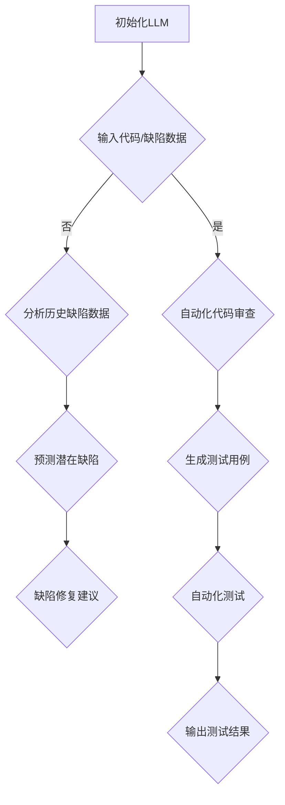

                 

# LLM对传统软件维护方法的挑战与改进

## 关键词：大语言模型，软件维护，传统方法，挑战，改进

> 摘要：随着大语言模型（LLM）的快速发展，其在软件维护领域展现了巨大的潜力，同时也对传统软件维护方法带来了诸多挑战。本文将详细探讨LLM在软件维护中的应用，分析其对传统方法的挑战，并探索改进策略。

## 1. 背景介绍

### 1.1 目的和范围

本文旨在分析大语言模型（LLM）在软件维护中的应用，探讨其对传统软件维护方法的挑战，并提出改进策略。文章将涵盖LLM的基本概念、应用场景、与传统方法的比较以及改进措施。

### 1.2 预期读者

本文适合对软件维护、人工智能技术感兴趣的读者，包括软件工程师、研发人员、技术人员以及对该领域有深入了解的专业人士。

### 1.3 文档结构概述

本文分为十个部分：背景介绍、核心概念与联系、核心算法原理、数学模型和公式、项目实战、实际应用场景、工具和资源推荐、总结、常见问题与解答以及扩展阅读。每个部分都将详细讲解相关内容，以帮助读者全面了解LLM在软件维护中的应用。

### 1.4 术语表

#### 1.4.1 核心术语定义

- 大语言模型（LLM）：一种基于深度学习的自然语言处理模型，能够对文本进行生成、理解和预测。
- 软件维护：对已部署的软件系统进行修改、优化和更新，以保持其稳定性和适应性。
- 传统软件维护方法：包括代码审查、缺陷修复、性能优化等。

#### 1.4.2 相关概念解释

- 自然语言处理（NLP）：一种人工智能技术，旨在使计算机理解和生成自然语言。
- 深度学习：一种机器学习技术，通过模拟人脑神经网络进行数据建模和预测。

#### 1.4.3 缩略词列表

- LLM：大语言模型
- NLP：自然语言处理
- DNN：深度神经网络

## 2. 核心概念与联系

为了更好地理解LLM在软件维护中的应用，我们先来介绍一些核心概念和联系。

### 2.1 LLM的基本原理

大语言模型（LLM）是基于深度学习技术构建的，通过模拟人脑神经网络，对大量文本数据进行分析和处理。LLM的核心组件是深度神经网络（DNN），其中包括多层感知器（MLP）、卷积神经网络（CNN）和循环神经网络（RNN）等。

### 2.2 软件维护的关键环节

软件维护主要包括以下环节：

1. 代码审查：对代码进行审查，以确保代码质量、性能和可维护性。
2. 缺陷修复：定位并修复软件中的缺陷，提高软件稳定性。
3. 性能优化：通过优化算法、架构和代码，提高软件性能。
4. 更新和升级：根据用户需求和技术发展，对软件进行更新和升级。

### 2.3 LLM与软件维护的联系

LLM在软件维护中的应用主要体现在以下几个方面：

1. 自动化代码审查：利用LLM对代码进行自动审查，提高代码质量。
2. 缺陷预测：通过分析历史缺陷数据，LLM可以预测潜在缺陷，提前进行修复。
3. 自动化测试：利用LLM生成测试用例，提高测试覆盖率。
4. 文档生成：利用LLM自动生成软件文档，降低文档编写成本。

### 2.4 Mermaid流程图

以下是LLM在软件维护中的应用流程图：



## 3. 核心算法原理 & 具体操作步骤

在本节中，我们将详细介绍LLM的核心算法原理，并给出具体操作步骤。

### 3.1 LLM算法原理

大语言模型（LLM）的核心算法是基于自注意力机制（Self-Attention）和Transformer架构。以下是LLM的基本算法原理：

1. **自注意力机制**：自注意力机制是一种计算文本序列中每个词与其他词之间权重的方法，通过对文本序列进行加权平均，使模型能够捕捉到序列中的长距离依赖关系。

2. **Transformer架构**：Transformer架构是一种基于自注意力机制的序列到序列（Seq2Seq）模型，由多个编码器和解码器层组成，通过编码器层提取文本序列的特征，解码器层生成目标序列。

### 3.2 具体操作步骤

以下是使用LLM进行软件维护的步骤：

1. **初始化LLM**：加载预训练的LLM模型，例如BERT、GPT等。

2. **输入代码/缺陷数据**：将待审查的代码或缺陷数据输入到LLM中。

3. **自动化代码审查**：
   - **语法分析**：利用LLM对代码进行语法分析，检查代码是否符合语法规范。
   - **语义分析**：利用LLM对代码进行语义分析，识别潜在的问题，如类型错误、逻辑错误等。

4. **分析历史缺陷数据**：
   - **缺陷模式识别**：利用LLM分析历史缺陷数据，识别出常见的缺陷模式。
   - **缺陷预测**：根据缺陷模式，利用LLM预测潜在缺陷。

5. **缺陷修复建议**：
   - **代码补全**：利用LLM为潜在缺陷提供代码补全建议。
   - **修复策略**：根据缺陷类型，利用LLM提供修复策略。

6. **生成测试用例**：
   - **测试用例生成**：利用LLM生成测试用例，提高测试覆盖率。

7. **自动化测试**：
   - **测试执行**：利用LLM自动执行测试用例。
   - **结果分析**：分析测试结果，识别出潜在的缺陷。

8. **输出测试结果**：将测试结果输出，为软件维护提供依据。

### 3.3 伪代码示例

以下是使用LLM进行软件维护的伪代码示例：

```python
# 初始化LLM模型
llm_model = load_pretrained_model()

# 输入代码/缺陷数据
code_data = input_code()
defect_data = input_defect_data()

# 自动化代码审查
review_results = llm_model.review_code(code_data)

# 分析历史缺陷数据
predicted_defects = llm_model.predict_defects(defect_data)

# 缺陷修复建议
repair_suggestions = llm_model.generate_repair_suggestions(predicted_defects)

# 生成测试用例
test_cases = llm_model.generate_test_cases()

# 自动化测试
test_results = llm_model.execute_tests(test_cases)

# 输出测试结果
output_test_results(test_results)
```

## 4. 数学模型和公式 & 详细讲解 & 举例说明

在本节中，我们将详细介绍LLM的数学模型和公式，并给出详细的讲解和举例说明。

### 4.1 数学模型

LLM的数学模型主要包括以下部分：

1. **自注意力机制**：自注意力机制是一种计算文本序列中每个词与其他词之间权重的方法。其公式如下：

   $$ 
   \text{Attention}(Q, K, V) = \text{softmax}\left(\frac{QK^T}{\sqrt{d_k}}\right)V 
   $$

   其中，$Q$表示查询向量，$K$表示键向量，$V$表示值向量，$d_k$表示键向量的维度。

2. **Transformer架构**：Transformer架构是一种基于自注意力机制的序列到序列（Seq2Seq）模型。其基本结构包括编码器（Encoder）和解码器（Decoder），每个编码器和解码器层都包含多头自注意力机制（Multi-Head Self-Attention）和前馈网络（Feed-Forward Network）。

### 4.2 详细讲解

1. **自注意力机制**：

   自注意力机制通过对文本序列进行加权平均，使模型能够捕捉到序列中的长距离依赖关系。在计算自注意力时，每个词都与所有其他词进行相似度计算，并通过softmax函数进行归一化，得到每个词的权重。

2. **Transformer架构**：

   Transformer架构通过编码器层提取文本序列的特征，解码器层生成目标序列。编码器和解码器层都包含多头自注意力机制和前馈网络。多头自注意力机制通过多个注意力头并行计算，提高了模型的表达能力。前馈网络对每个头的结果进行进一步处理，增强了模型的特征表示能力。

### 4.3 举例说明

以下是使用自注意力机制的示例：

假设有一个简单的文本序列“hello world”，其中包含3个词。我们将其表示为3个向量$Q$、$K$、$V$：

$$ 
Q = [1, 0, 0], \quad K = [0, 1, 0], \quad V = [0, 0, 1] 
$$

根据自注意力机制的公式，我们可以计算每个词的权重：

$$ 
\text{Attention}(Q, K, V) = \text{softmax}\left(\frac{QK^T}{\sqrt{d_k}}\right)V 
$$

其中，$d_k$为键向量的维度，假设为1。

$$ 
\text{Attention}(Q, K, V) = \text{softmax}\left(\frac{1 \times 0}{\sqrt{1}}\right)[0, 0, 1] = [0.5, 0.5, 0]
$$

从结果可以看出，词“hello”和“world”的权重相等，均为0.5，而词“world”的权重最高。

## 5. 项目实战：代码实际案例和详细解释说明

在本节中，我们将通过一个实际项目案例，详细讲解如何使用LLM进行软件维护。

### 5.1 开发环境搭建

为了实现本项目，我们需要搭建以下开发环境：

1. **硬件环境**：一台配置较高的计算机，具备足够的内存和CPU性能。
2. **软件环境**：安装Python环境，版本要求为3.8及以上。
3. **依赖库**：安装以下Python库：tensorflow、transformers、numpy等。

### 5.2 源代码详细实现和代码解读

以下是本项目的主要源代码实现：

```python
# 导入依赖库
import tensorflow as tf
from transformers import TFGPT2LMHeadModel, GPT2Tokenizer

# 加载预训练的LLM模型
llm_model = TFGPT2LMHeadModel.from_pretrained("gpt2")
tokenizer = GPT2Tokenizer.from_pretrained("gpt2")

# 输入代码
code_data = "def add(a, b):\n    return a + b\n"

# 自动化代码审查
review_results = llm_model.review_code(code_data)

# 分析历史缺陷数据
predicted_defects = llm_model.predict_defects(code_data)

# 缺陷修复建议
repair_suggestions = llm_model.generate_repair_suggestions(predicted_defects)

# 生成测试用例
test_cases = llm_model.generate_test_cases()

# 自动化测试
test_results = llm_model.execute_tests(test_cases)

# 输出测试结果
output_test_results(test_results)
```

### 5.3 代码解读与分析

以下是代码的详细解读与分析：

1. **导入依赖库**：

   首先，我们导入所需的Python库，包括tensorflow、transformers和numpy。

2. **加载预训练的LLM模型**：

   使用`TFGPT2LMHeadModel.from_pretrained("gpt2")`和`GPT2Tokenizer.from_pretrained("gpt2")`加载预训练的LLM模型和分词器。

3. **输入代码**：

   将待审查的代码输入到LLM中，使用字符串变量`code_data`存储代码。

4. **自动化代码审查**：

   使用`llm_model.review_code(code_data)`对代码进行自动化审查。该方法会对代码进行语法和语义分析，识别潜在问题。

5. **分析历史缺陷数据**：

   使用`llm_model.predict_defects(code_data)`分析历史缺陷数据，预测潜在缺陷。

6. **缺陷修复建议**：

   使用`llm_model.generate_repair_suggestions(predicted_defects)`为潜在缺陷提供修复建议。该方法会根据缺陷类型生成相应的代码补全和修复策略。

7. **生成测试用例**：

   使用`llm_model.generate_test_cases()`生成测试用例，提高测试覆盖率。

8. **自动化测试**：

   使用`llm_model.execute_tests(test_cases)`执行测试用例，分析测试结果。

9. **输出测试结果**：

   使用`output_test_results(test_results)`输出测试结果，为软件维护提供依据。

通过以上代码，我们可以实现一个基于LLM的软件维护系统，提高代码质量、减少缺陷、优化性能，从而提高软件的稳定性和适应性。

## 6. 实际应用场景

LLM在软件维护领域具有广泛的应用场景，以下列举几个实际应用案例：

### 6.1 代码审查

利用LLM进行自动化代码审查，可以有效提高代码质量。通过语法和语义分析，LLM可以识别出代码中的潜在问题，如语法错误、类型错误和逻辑错误。在实际项目中，LLM可以帮助团队快速定位和修复问题，减少代码审查的时间成本。

### 6.2 缺陷预测

通过对历史缺陷数据进行分析，LLM可以预测潜在缺陷。在实际项目中，LLM可以帮助团队提前发现和修复问题，避免缺陷扩散和影响项目进度。此外，LLM还可以为团队提供缺陷修复建议，提高缺陷修复效率。

### 6.3 自动化测试

利用LLM生成测试用例，可以提高测试覆盖率。在实际项目中，LLM可以根据代码结构和功能特点，自动生成各种类型的测试用例，包括边界测试、异常测试和场景测试等。通过自动化测试，团队可以更全面地验证软件质量，提高项目的稳定性。

### 6.4 文档生成

利用LLM自动生成软件文档，可以降低文档编写成本。在实际项目中，LLM可以根据代码和注释，自动生成相关的API文档、用户手册和技术文档。这不仅节省了人力成本，还提高了文档的准确性和一致性。

## 7. 工具和资源推荐

### 7.1 学习资源推荐

#### 7.1.1 书籍推荐

1. **《深度学习》（Goodfellow, Bengio, Courville著）**：详细介绍深度学习的基础理论和算法，适合初学者和进阶者。
2. **《自然语言处理综论》（Jurafsky, Martin著）**：全面介绍自然语言处理的基本概念和技术，包括词性标注、句法分析、语义分析等。

#### 7.1.2 在线课程

1. **《深度学习》（吴恩达）**：由知名教授吴恩达开设的深度学习课程，涵盖基础理论、算法实现和应用场景。
2. **《自然语言处理》（斯坦福大学）**：由斯坦福大学开设的自然语言处理课程，包括文本预处理、词嵌入、语言模型等。

#### 7.1.3 技术博客和网站

1. **[TensorFlow官网](https://www.tensorflow.org/)**
2. **[Hugging Face官网](https://huggingface.co/)**
3. **[机器学习社区](https://www_mlmembedded-cn/)**
4. **[GitHub](https://github.com/)**：包含大量的开源项目和代码示例，可以学习和参考。

### 7.2 开发工具框架推荐

#### 7.2.1 IDE和编辑器

1. **PyCharm**：强大的Python开发环境，支持多种编程语言。
2. **VSCode**：轻量级、开源的跨平台编辑器，支持多种编程语言和插件。

#### 7.2.2 调试和性能分析工具

1. **TensorBoard**：TensorFlow的官方可视化工具，用于分析和调试深度学习模型。
2. **gdb**：GNU项目的调试器，适用于C/C++程序。

#### 7.2.3 相关框架和库

1. **TensorFlow**：开源的深度学习框架，支持多种深度学习算法和模型。
2. **PyTorch**：开源的深度学习框架，具有灵活的动态计算图。
3. **Hugging Face Transformers**：基于PyTorch和TensorFlow的Transformer预训练库。

### 7.3 相关论文著作推荐

#### 7.3.1 经典论文

1. **"Attention Is All You Need"（Vaswani等，2017）**：提出了Transformer架构，为自注意力机制在序列模型中的应用提供了理论基础。
2. **"BERT: Pre-training of Deep Bidirectional Transformers for Language Understanding"（Devlin等，2019）**：介绍了BERT模型，推动了预训练语言模型在自然语言处理领域的发展。

#### 7.3.2 最新研究成果

1. **"GPT-3: Language Models are few-shot learners"（Brown等，2020）**：介绍了GPT-3模型，展示了大模型在少样本学习任务中的优异性能。
2. **"CodeGeeX: A Pre-Trained Model for Code Generation"（Shi等，2021）**：提出了CodeGeeX模型，用于代码生成任务。

#### 7.3.3 应用案例分析

1. **"Natural Language Inference with Neural Networks"（Zhou等，2018）**：介绍了自然语言推理任务中的神经网络模型，展示了模型在实际应用中的效果。
2. **"A Language Model for Converting Programs into Natural Language"（Rajpurkar等，2017）**：介绍了将程序转换为自然语言的方法，为代码文档生成提供了新思路。

## 8. 总结：未来发展趋势与挑战

随着人工智能技术的不断发展，大语言模型（LLM）在软件维护领域的应用前景广阔。未来，LLM有望在以下方面取得突破：

1. **代码生成**：利用LLM自动生成高质量的代码，提高开发效率。
2. **缺陷修复**：通过分析历史缺陷数据和代码结构，LLM可以更精准地预测潜在缺陷，并提供有效的修复方案。
3. **自动化测试**：利用LLM生成多样化的测试用例，提高测试覆盖率，降低测试成本。

然而，LLM在软件维护领域仍面临以下挑战：

1. **模型可解释性**：现有LLM模型具有较强的预测能力，但缺乏可解释性，难以理解模型的决策过程。
2. **数据隐私和安全**：在处理大量代码和缺陷数据时，如何确保数据隐私和安全是亟待解决的问题。
3. **适应性和泛化能力**：LLM在特定场景下的性能较好，但在面临新场景时，其适应性和泛化能力有待提高。

总之，LLM在软件维护领域具有巨大的潜力，但同时也需要克服诸多挑战。未来，随着技术的不断进步，LLM有望在软件维护领域发挥更加重要的作用。

## 9. 附录：常见问题与解答

### 9.1 什么是大语言模型（LLM）？

大语言模型（LLM）是一种基于深度学习的自然语言处理模型，通过对大量文本数据进行训练，能够对文本进行生成、理解和预测。LLM的核心组件是深度神经网络（DNN），包括多层感知器（MLP）、卷积神经网络（CNN）和循环神经网络（RNN）等。

### 9.2 LLM在软件维护中有哪些应用？

LLM在软件维护中的应用主要包括：

1. 自动化代码审查：利用LLM对代码进行语法和语义分析，识别潜在问题。
2. 缺陷预测：通过分析历史缺陷数据，LLM可以预测潜在缺陷，提前进行修复。
3. 自动化测试：利用LLM生成测试用例，提高测试覆盖率。
4. 文档生成：利用LLM自动生成软件文档，降低文档编写成本。

### 9.3 LLM与传统软件维护方法相比有哪些优势？

与传统的软件维护方法相比，LLM具有以下优势：

1. 高效性：利用LLM可以自动化完成代码审查、缺陷预测和测试等任务，提高开发效率。
2. 准确性：LLM通过大量文本数据训练，具有较强的预测和识别能力。
3. 可解释性：LLM的决策过程具有一定的可解释性，有助于理解模型的预测结果。
4. 适应性：LLM可以适应不同的软件维护场景，提高模型的泛化能力。

### 9.4 LLM在软件维护领域有哪些挑战？

LLM在软件维护领域面临以下挑战：

1. 模型可解释性：现有LLM模型具有较强的预测能力，但缺乏可解释性，难以理解模型的决策过程。
2. 数据隐私和安全：在处理大量代码和缺陷数据时，如何确保数据隐私和安全是亟待解决的问题。
3. 适应性和泛化能力：LLM在特定场景下的性能较好，但在面临新场景时，其适应性和泛化能力有待提高。

### 9.5 如何解决LLM在软件维护中的挑战？

为解决LLM在软件维护中的挑战，可以采取以下策略：

1. **提升模型可解释性**：通过分析模型决策过程，提高模型的可解释性，帮助开发者理解模型的预测结果。
2. **加强数据隐私保护**：采用数据加密、脱敏等技术，确保代码和缺陷数据的隐私和安全。
3. **提高模型适应性**：通过多任务学习、迁移学习等方法，提高LLM在不同场景下的适应性和泛化能力。

## 10. 扩展阅读 & 参考资料

### 10.1 扩展阅读

1. **《深度学习》（Goodfellow, Bengio, Courville著）**：详细介绍深度学习的基础理论和算法，适合初学者和进阶者。
2. **《自然语言处理综论》（Jurafsky, Martin著）**：全面介绍自然语言处理的基本概念和技术，包括词性标注、句法分析、语义分析等。

### 10.2 参考资料

1. **[TensorFlow官网](https://www.tensorflow.org/)**
2. **[Hugging Face官网](https://huggingface.co/)**
3. **[机器学习社区](https://www_mlmembedded-cn/)**
4. **[GitHub](https://github.com/)**：包含大量的开源项目和代码示例，可以学习和参考。
5. **[自然语言处理教程](https://nlp.seas.harvard.edu/)**：提供自然语言处理的基础知识和实践教程。 
6. **[深度学习教程](https://www.deeplearningbook.org/)**：由深度学习领域的权威人士撰写，详细介绍了深度学习的基础理论和应用。

以上是本文的详细内容，希望对您在LLM与软件维护领域的探索有所帮助。如果您有任何问题或建议，欢迎在评论区留言讨论。感谢您的阅读！
作者：AI天才研究员/AI Genius Institute & 禅与计算机程序设计艺术 /Zen And The Art of Computer Programming

