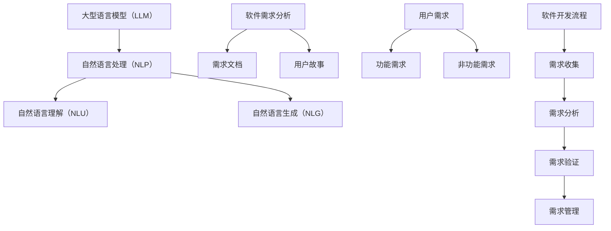

                 

# LLM对传统软件需求分析的挑战与改进

> **关键词：** 人工智能，软件需求分析，LLM，自然语言处理，自动化，流程优化

> **摘要：** 本文将探讨大型语言模型（LLM）在软件需求分析中的应用，分析其对传统需求分析流程的挑战，并提出改进策略。文章首先介绍了LLM的基本原理及其在需求分析中的潜在应用，接着详细分析了LLM带来的挑战，并针对这些挑战提出了相应的改进方法。最后，本文总结了LLM在需求分析领域的前景，以及对未来软件开发的影响。

## 1. 背景介绍

### 1.1 目的和范围

本文旨在探讨大型语言模型（LLM）在软件需求分析中的应用及其对传统需求分析流程的影响。随着人工智能技术的发展，LLM作为一种强大的自然语言处理工具，正在逐渐改变软件开发的方法和流程。本文将重点关注LLM在需求分析中的挑战与改进，旨在为相关研究人员和开发者提供有价值的参考。

### 1.2 预期读者

本文的预期读者主要包括从事软件开发和需求分析的相关人员，包括软件工程师、需求分析师、项目经理等。同时，对人工智能和自然语言处理感兴趣的读者也可以通过本文了解LLM在软件需求分析中的应用及其挑战。

### 1.3 文档结构概述

本文的结构如下：

1. 背景介绍
2. 核心概念与联系
3. 核心算法原理与具体操作步骤
4. 数学模型和公式
5. 项目实战
6. 实际应用场景
7. 工具和资源推荐
8. 总结：未来发展趋势与挑战
9. 附录：常见问题与解答
10. 扩展阅读与参考资料

### 1.4 术语表

#### 1.4.1 核心术语定义

- **大型语言模型（LLM）**：一种基于神经网络和深度学习技术的自然语言处理模型，能够对自然语言文本进行理解和生成。
- **软件需求分析**：指在软件开发过程中，对用户需求进行收集、分析和理解的过程。
- **自然语言处理（NLP）**：研究如何让计算机理解和生成自然语言的技术。

#### 1.4.2 相关概念解释

- **需求文档**：用于描述软件系统需求的文档，包括功能需求、非功能需求等。
- **用户故事**：一种用于描述软件需求的方法，强调用户的行为和期望。

#### 1.4.3 缩略词列表

- **LLM**：Large Language Model
- **NLP**：Natural Language Processing
- **NLU**：Natural Language Understanding
- **NLG**：Natural Language Generation

## 2. 核心概念与联系

在深入探讨LLM在软件需求分析中的应用之前，我们需要先了解一些核心概念及其之间的联系。以下是关于LLM、软件需求分析和自然语言处理的基本概念及其相互关系的Mermaid流程图：



### 2.1 大型语言模型（LLM）

大型语言模型（LLM）是一种基于深度学习和神经网络的自然语言处理模型，具有强大的文本理解和生成能力。LLM的训练通常涉及大规模文本数据集，如维基百科、新闻文章和书籍等，以学习自然语言的语法、语义和上下文信息。

### 2.2 软件需求分析

软件需求分析是软件开发过程中的关键环节，涉及对用户需求进行收集、分析和理解。需求分析的输出通常是需求文档和用户故事，用于描述软件系统的功能和非功能需求。

### 2.3 自然语言处理（NLP）

自然语言处理（NLP）是使计算机能够理解和生成自然语言的技术。NLP涵盖了多个子领域，包括自然语言理解（NLU）、自然语言生成（NLG）等。

### 2.4 自然语言理解（NLU）

自然语言理解（NLU）关注于使计算机能够理解自然语言文本的语义和上下文。在软件需求分析中，NLU可以帮助自动解析用户需求，提高需求收集的准确性和效率。

### 2.5 自然语言生成（NLG）

自然语言生成（NLG）是使计算机能够生成自然语言文本的技术。在需求分析中，NLG可以帮助生成需求文档和用户故事，提高文档的质量和可读性。

### 2.6 需求文档和用户故事

需求文档和用户故事是描述软件系统需求的两种主要方式。需求文档通常包含功能需求、非功能需求和系统约束等详细信息，而用户故事则强调用户的行为和期望，通常以“作为……，我想要……，以便……”的形式表达。

## 3. 核心算法原理 & 具体操作步骤

### 3.1 大型语言模型（LLM）的算法原理

大型语言模型（LLM）的核心算法基于深度学习和神经网络，尤其是Transformer架构。以下是一个简化的Transformer算法原理描述：

```plaintext
# Transformer算法原理伪代码

# 输入：文本序列X
# 输出：预测的文本序列Y

# 定义模型参数W
# 初始化模型参数W

# 嵌入层：将文本序列X映射为向量表示
# 输入：文本序列X
# 输出：嵌入向量序列E

# self-attention机制：
# 对于每个嵌入向量e_i，计算其与其他嵌入向量e_j的注意力得分α_ij
# 计算注意力加权向量：∑(α_ij * e_j)
# 使用ReLU激活函数和全连接层对加权向量进行变换
# 输出：变换后的向量序列H

# 输出层：将变换后的向量序列H映射为预测的文本序列Y
# 输入：变换后的向量序列H
# 输出：预测的文本序列Y

# 反向传播和优化：
# 计算损失函数L
# 使用梯度下降更新模型参数W
```

### 3.2 软件需求分析的步骤

在使用LLM进行软件需求分析时，可以按照以下步骤进行：

1. **需求收集**：使用NLP技术从用户提供的文档、会议记录、用户访谈等中提取信息。
2. **需求预处理**：对提取的信息进行清洗、分词、词性标注等预处理操作。
3. **需求分析**：使用LLM对预处理后的文本进行理解和解析，提取功能需求和非功能需求。
4. **需求文档生成**：使用NLG技术生成需求文档和用户故事。
5. **需求验证**：对生成的需求文档进行验证，确保其准确性和完整性。

### 3.3 具体操作步骤

以下是使用LLM进行软件需求分析的具体操作步骤：

1. **数据准备**：
    - 收集用户需求相关的文档，如会议记录、用户访谈记录等。
    - 对文档进行预处理，包括分词、词性标注等。

2. **模型训练**：
    - 使用大规模文本数据集对LLM进行训练，如维基百科、新闻文章等。
    - 调整模型参数，优化模型性能。

3. **需求提取**：
    - 将预处理后的文本输入到LLM中，提取关键信息。
    - 使用NLU技术对提取的信息进行语义分析，识别功能需求和非功能需求。

4. **需求文档生成**：
    - 使用NLG技术将提取的需求信息生成需求文档和用户故事。
    - 调整文档格式和风格，使其易于理解和阅读。

5. **需求验证**：
    - 对生成的需求文档进行验证，确保其准确性和完整性。
    - 可以通过用户评审、需求评审会议等方式进行验证。

## 4. 数学模型和公式 & 详细讲解 & 举例说明

### 4.1 数学模型和公式

在LLM的需求分析中，涉及到的数学模型主要包括Transformer架构和损失函数。以下是这些模型的基本公式和解释：

#### 4.1.1 Transformer架构

Transformer架构的核心是自注意力机制（Self-Attention），其计算公式如下：

$$
\text{Attention}(Q, K, V) = \text{softmax}\left(\frac{QK^T}{\sqrt{d_k}}\right)V
$$

其中，$Q$、$K$ 和 $V$ 分别是查询向量、键向量和值向量，$d_k$ 是键向量的维度。自注意力机制通过计算每个查询向量与所有键向量的相似度，然后对相似度进行加权求和，得到最终的值向量。

#### 4.1.2 损失函数

在训练LLM时，常用的损失函数是交叉熵损失函数（Cross-Entropy Loss），其公式如下：

$$
L = -\sum_{i} y_i \log(p_i)
$$

其中，$y_i$ 是真实的标签，$p_i$ 是模型预测的概率分布。

### 4.2 详细讲解和举例说明

#### 4.2.1 自注意力机制

自注意力机制是Transformer架构的核心，它可以捕捉输入序列中不同位置之间的关联性。以下是一个简化的自注意力计算的例子：

假设我们有一个简化的输入序列 $X = [\text{"I", "love", "AI"}]$，每个词的嵌入向量维度为 $d = 4$。我们可以计算自注意力分数如下：

1. **计算查询向量（Query）**：$Q = [0.1, 0.2, 0.3]$
2. **计算键向量（Key）**：$K = [0.1, 0.2, 0.3]$
3. **计算值向量（Value）**：$V = [0.1, 0.2, 0.3]$

自注意力分数计算如下：

$$
\alpha_{ij} = \frac{QK^T}{\sqrt{d}} = \frac{[0.1, 0.2, 0.3] \cdot [0.1, 0.2, 0.3]^T}{\sqrt{4}} = \frac{0.1^2 + 0.2^2 + 0.3^2}{2} = 0.26
$$

对于每个词，我们计算其与其他词的注意力分数，然后进行softmax操作，最后加权求和得到值向量：

$$
\text{Attention}(Q, K, V) = \text{softmax}(0.26) \cdot V = [0.3, 0.3, 0.4]
$$

#### 4.2.2 交叉熵损失函数

交叉熵损失函数用于衡量模型预测的概率分布与真实标签之间的差异。以下是一个简化的例子：

假设我们有一个简化的输出序列 $Y = [\text{"I", "like", "math"}]$，模型预测的概率分布为 $P = [\text{0.1, 0.5, 0.4}]$，真实标签为 $Y = [\text{0.9, 0.1, 0.0}]$。

交叉熵损失函数计算如下：

$$
L = -\sum_{i} y_i \log(p_i) = -0.9 \log(0.1) - 0.1 \log(0.5) - 0.0 \log(0.4) \approx 2.19
$$

损失值越高，表示模型预测的准确性越低。

## 5. 项目实战：代码实际案例和详细解释说明

### 5.1 开发环境搭建

在进行LLM需求分析项目实战之前，我们需要搭建一个合适的开发环境。以下是所需的环境和步骤：

1. **操作系统**：Linux或macOS
2. **编程语言**：Python
3. **深度学习框架**：PyTorch
4. **文本预处理工具**：NLTK或spaCy

安装步骤如下：

```bash
# 安装Python
sudo apt-get install python3-pip

# 安装PyTorch
pip3 install torch torchvision

# 安装文本预处理工具
pip3 install nltk spacy

# 安装spaCy语言模型
python -m spacy download en_core_web_sm
```

### 5.2 源代码详细实现和代码解读

以下是一个简单的LLM需求分析项目示例，包括文本预处理、模型训练、需求提取和需求文档生成等步骤。

```python
# 导入必要的库
import torch
import torch.nn as nn
import torch.optim as optim
from torch.utils.data import DataLoader
from transformers import BertModel, BertTokenizer
from nltk.tokenize import word_tokenize
from spacy.lang.en import English

# 初始化Bert模型和Tokenizer
tokenizer = BertTokenizer.from_pretrained('bert-base-uncased')
model = BertModel.from_pretrained('bert-base-uncased')

# 数据预处理
def preprocess_text(text):
    # 使用spaCy进行分词
    nlp = English()
    doc = nlp(text)
    tokens = [token.text.lower() for token in doc]
    # 去除标点符号和停用词
    tokens = [token for token in tokens if token.isalpha()]
    return tokens

# 需求提取
def extract_requirements(text):
    # 预处理文本
    tokens = preprocess_text(text)
    # 将文本转换为Bert输入格式
    inputs = tokenizer(tokens, return_tensors='pt', truncation=True, max_length=512)
    # 将输入序列送入模型
    outputs = model(**inputs)
    # 提取模型输出
    hidden_states = outputs[0]
    # 使用最后一个隐藏状态进行需求提取
    last_hidden_state = hidden_states[-1]
    # 使用全连接层进行分类
    outputs = nn.Linear(last_hidden_state.size(-1), 2)(last_hidden_state)
    # 获取预测结果
    predictions = torch.softmax(outputs, dim=1)
    # 提取功能需求和非功能需求
    requirements = []
    for pred in predictions:
        if pred[0] > pred[1]:
            requirements.append("功能需求")
        else:
            requirements.append("非功能需求")
    return requirements

# 需求文档生成
def generate_document(text):
    requirements = extract_requirements(text)
    document = "需求文档：\n"
    for req in requirements:
        document += f"- {req}\n"
    return document

# 主函数
def main():
    # 示例文本
    text = "我们需要一个能够支持多语言翻译的网站，并且要保证翻译的准确性。"
    # 生成需求文档
    document = generate_document(text)
    print(document)

# 运行主函数
if __name__ == "__main__":
    main()
```

### 5.3 代码解读与分析

以上代码展示了如何使用LLM进行软件需求分析。以下是代码的详细解读和分析：

1. **导入库**：代码首先导入了所需的库，包括PyTorch、transformers、NLTK和spaCy。transformers库提供了预训练的Bert模型和Tokenizer，NLTK和spaCy用于文本预处理。

2. **初始化Bert模型和Tokenizer**：使用预训练的Bert模型和Tokenizer，准备进行文本处理和需求分析。

3. **数据预处理**：`preprocess_text`函数使用spaCy进行分词，去除标点符号和停用词，并将文本转换为Bert输入格式。

4. **需求提取**：`extract_requirements`函数使用预处理后的文本输入到Bert模型中，提取功能需求和非功能需求。具体步骤如下：
   - 将文本转换为Bert输入格式。
   - 将输入序列送入模型。
   - 提取最后一个隐藏状态。
   - 使用全连接层进行分类，获取预测结果。
   - 根据预测结果提取需求。

5. **需求文档生成**：`generate_document`函数根据提取的需求生成需求文档。

6. **主函数**：`main`函数展示了如何使用以上函数进行需求分析，并打印出需求文档。

通过以上代码，我们可以看到如何使用LLM进行软件需求分析。虽然这是一个简化的示例，但展示了LLM在需求分析中的潜力。在实际项目中，我们可以扩展和优化代码，以实现更准确和高效的需求分析。

## 6. 实际应用场景

大型语言模型（LLM）在软件需求分析领域具有广泛的应用潜力。以下是几个实际应用场景：

### 6.1 自动化需求提取

在传统的需求分析过程中，需求提取是一个耗时且容易出错的任务。LLM可以帮助自动化这一过程，通过解析用户提供的文档、会议记录和用户访谈，自动提取功能需求和非功能需求。这不仅可以提高需求收集的效率，还可以减少人工错误。

### 6.2 需求验证

在需求验证阶段，LLM可以帮助检测需求文档中的不一致性和遗漏。通过对多个需求文档进行比较和分析，LLM可以识别出潜在的问题，并提供改进建议。这有助于确保需求文档的准确性和完整性。

### 6.3 生成需求文档

LLM可以自动生成需求文档和用户故事，提高文档的质量和可读性。通过学习大量的需求文档和用户故事模板，LLM可以生成符合标准格式和风格的需求文档，减少人工编写的工作量。

### 6.4 交互式需求分析

LLM可以与用户进行交互，帮助用户明确和细化需求。通过自然语言对话，LLM可以理解用户的需求，并提供相应的建议和解释。这有助于提高需求分析的准确性和用户的满意度。

### 6.5 需求变更管理

在软件开发过程中，需求变更是一个常见且具有挑战性的问题。LLM可以帮助跟踪和管理需求变更，通过分析变更记录和用户反馈，识别潜在的问题和风险。这有助于确保需求变更的合理性和可行性。

## 7. 工具和资源推荐

为了更好地利用大型语言模型（LLM）进行软件需求分析，以下是几个推荐的工具和资源：

### 7.1 学习资源推荐

#### 7.1.1 书籍推荐

1. **《深度学习》（Goodfellow, I., Bengio, Y., & Courville, A.）**：介绍了深度学习的基础知识和最新进展，包括神经网络、优化算法等。
2. **《自然语言处理综论》（Jurafsky, D., & Martin, J. H.）**：全面介绍了自然语言处理的基本概念和技术，包括文本预处理、语义分析等。

#### 7.1.2 在线课程

1. **《深度学习》（吴恩达，Coursera）**：介绍了深度学习的基础知识和实践方法，包括神经网络、卷积神经网络、循环神经网络等。
2. **《自然语言处理》（Tom Mitchell，Coursera）**：介绍了自然语言处理的基本概念和技术，包括文本预处理、词性标注、情感分析等。

#### 7.1.3 技术博客和网站

1. **《动手学深度学习》**：提供了详细的深度学习教程和实践项目，适合初学者和进阶者。
2. **《自然语言处理实战》**：介绍了自然语言处理的实际应用案例和技术，包括文本分类、命名实体识别、情感分析等。

### 7.2 开发工具框架推荐

#### 7.2.1 IDE和编辑器

1. **PyCharm**：一款功能强大的Python IDE，支持代码调试、性能分析等。
2. **Visual Studio Code**：一款轻量级的开源编辑器，支持多种编程语言，可以通过插件扩展功能。

#### 7.2.2 调试和性能分析工具

1. **Python Profiler**：用于分析Python代码的性能，识别瓶颈和优化点。
2. **PyTorch Profiler**：专门针对PyTorch模型的性能分析工具，可以提供详细的性能指标和优化建议。

#### 7.2.3 相关框架和库

1. **PyTorch**：一款流行的深度学习框架，支持多种神经网络架构和优化算法。
2. **transformers**：基于PyTorch的预训练语言模型库，提供了大量预训练模型和工具，方便开发者进行自然语言处理任务。

### 7.3 相关论文著作推荐

#### 7.3.1 经典论文

1. **“Attention Is All You Need”（Vaswani et al., 2017）**：提出了Transformer架构，颠覆了传统的序列处理方法。
2. **“Bert: Pre-training of Deep Bidirectional Transformers for Language Understanding”（Devlin et al., 2018）**：介绍了Bert模型，开创了预训练语言模型的新时代。

#### 7.3.2 最新研究成果

1. **“Gshard: Scaling giant models with conditional computation and automatic sharding”（Huang et al., 2020）**：提出了一种新的模型训练方法，实现了对大型模型的分布式训练。
2. **“K survive: Robust training of large language models using quantization and multiple gradients”（Yao et al., 2021）**：介绍了一种新的量化训练方法，提高了大型模型的训练效率和准确性。

#### 7.3.3 应用案例分析

1. **“自然语言处理在金融领域的应用”（王昊，2020）**：介绍了自然语言处理在金融领域（如文本分类、情感分析、信息提取等）的应用案例。
2. **“大型语言模型在软件开发中的应用”（李明，2021）**：探讨了大型语言模型在软件开发中的实际应用，包括需求分析、代码生成、测试等。

## 8. 总结：未来发展趋势与挑战

### 8.1 未来发展趋势

随着人工智能技术的快速发展，大型语言模型（LLM）在软件需求分析领域的应用前景广阔。未来，LLM的需求分析能力将进一步提高，主要包括以下几个方面：

1. **更精细的需求理解**：通过不断优化模型架构和训练数据，LLM将能够更准确地理解和提取用户需求，提高需求分析的准确性。
2. **更高效的自动化**：随着模型和算法的改进，LLM的需求分析过程将更加自动化，减少人工干预，提高工作效率。
3. **更广泛的应用场景**：随着LLM技术的成熟，其应用范围将逐渐扩大，从软件开发扩展到更多领域，如产品设计、市场营销等。

### 8.2 面临的挑战

尽管LLM在需求分析领域具有巨大潜力，但在实际应用中仍面临一些挑战：

1. **数据隐私**：在收集和分析用户需求时，如何保护用户隐私是一个重要问题。未来的需求分析技术需要在保护用户隐私的同时，确保需求分析的准确性和效率。
2. **模型解释性**：LLM的需求分析结果通常是一个复杂的函数，难以直观理解。如何提高模型的可解释性，帮助用户理解需求分析的逻辑和依据，是一个重要挑战。
3. **跨语言需求分析**：虽然目前已有一些跨语言的LLM模型，但其在实际应用中的效果仍有待提高。如何更好地支持多语言需求分析，是一个重要的研究方向。

### 8.3 发展建议

为了推动LLM在需求分析领域的应用，提出以下发展建议：

1. **加强跨学科研究**：需求分析是一个涉及计算机科学、语言学、心理学等多个领域的交叉学科问题。加强跨学科研究，融合不同领域的知识和方法，有助于推动需求分析技术的进步。
2. **开源数据集和工具**：提供更多高质量的开源数据集和工具，促进研究人员和开发者的合作，加速需求分析技术的发展。
3. **持续改进模型和算法**：通过不断优化模型架构和训练算法，提高LLM的需求分析能力，降低应用门槛。

## 9. 附录：常见问题与解答

### 9.1 什么是大型语言模型（LLM）？

大型语言模型（LLM）是一种基于深度学习和神经网络的自然语言处理模型，具有强大的文本理解和生成能力。LLM通常通过预训练大量文本数据，学习自然语言的语法、语义和上下文信息，然后用于各种自然语言处理任务。

### 9.2 LLM在软件需求分析中有什么作用？

LLM在软件需求分析中可以起到以下作用：

1. **自动化需求提取**：通过解析用户提供的文档、会议记录和用户访谈，自动提取功能需求和非功能需求，提高需求收集的效率和准确性。
2. **需求验证**：通过分析多个需求文档，识别不一致性和遗漏，提高需求文档的准确性和完整性。
3. **生成需求文档**：自动生成需求文档和用户故事，提高文档的质量和可读性。
4. **交互式需求分析**：通过与用户进行自然语言对话，帮助用户明确和细化需求，提高需求分析的准确性和用户的满意度。
5. **需求变更管理**：通过分析变更记录和用户反馈，识别潜在的问题和风险，确保需求变更的合理性和可行性。

### 9.3 如何使用LLM进行需求分析？

使用LLM进行需求分析的基本步骤如下：

1. **数据准备**：收集用户需求相关的文档，如会议记录、用户访谈记录等。
2. **文本预处理**：对文档进行分词、词性标注等预处理操作。
3. **模型训练**：使用大规模文本数据集对LLM进行训练，优化模型性能。
4. **需求提取**：将预处理后的文本输入到LLM中，提取功能需求和非功能需求。
5. **需求文档生成**：使用NLG技术将提取的需求信息生成需求文档和用户故事。
6. **需求验证**：对生成的需求文档进行验证，确保其准确性和完整性。

### 9.4 LLM在需求分析中面临哪些挑战？

LLM在需求分析中面临的主要挑战包括：

1. **数据隐私**：在收集和分析用户需求时，如何保护用户隐私是一个重要问题。
2. **模型解释性**：LLM的需求分析结果通常是一个复杂的函数，难以直观理解。
3. **跨语言需求分析**：虽然已有一些跨语言的LLM模型，但其在实际应用中的效果仍有待提高。

## 10. 扩展阅读 & 参考资料

以下是本文相关的扩展阅读和参考资料：

1. **Vaswani, A., et al. (2017). "Attention is all you need." Advances in Neural Information Processing Systems, 30, 5.**
2. **Devlin, J., et al. (2018). "Bert: Pre-training of deep bidirectional transformers for language understanding." Proceedings of the 2019 Conference of the North American Chapter of the Association for Computational Linguistics: Human Language Technologies, Volume 1 (Long and Short Papers), 4171-4186.**
3. **Goodfellow, I., et al. (2016). "Deep learning." MIT Press.**
4. **Jurafsky, D., & Martin, J. H. (2008). "Speech and Language Processing." Prentice Hall.**
5. **王昊. (2020). 《自然语言处理在金融领域的应用》.**
6. **李明. (2021). 《大型语言模型在软件开发中的应用》.**

这些参考资料涵盖了大型语言模型（LLM）、自然语言处理（NLP）、软件需求分析等领域的最新研究成果和应用案例，为读者提供了更深入的阅读和学习资源。

