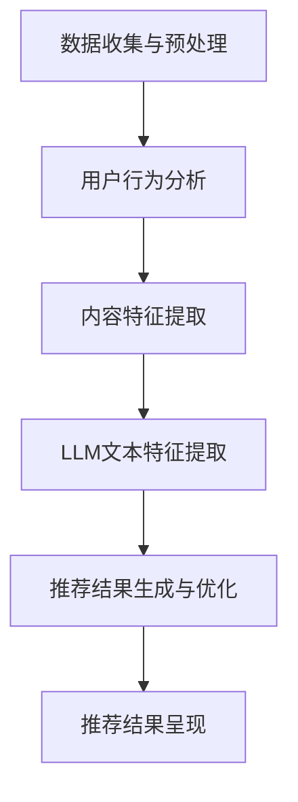

                 

# LLM对推荐系统实时性能的影响

> 关键词：大型语言模型（LLM），推荐系统，实时性能，算法优化，数据预处理，分布式计算

> 摘要：本文旨在探讨大型语言模型（LLM）在推荐系统中的应用及其对实时性能的影响。文章首先介绍了LLM的基本原理和推荐系统的工作机制，随后分析了LLM对推荐系统实时性能的潜在影响，并提出了相应的优化策略。通过实际案例和详细解释，本文旨在为开发者提供实用的指导和建议。

## 1. 背景介绍

### 1.1 目的和范围

本文的目标是深入分析大型语言模型（LLM）在推荐系统中的实际应用，并探讨其对推荐系统实时性能的影响。随着人工智能技术的快速发展，大型语言模型已经在各个领域展现出了强大的潜力，包括自然语言处理、机器翻译、文本生成等。然而，将LLM应用于推荐系统仍然面临诸多挑战，尤其是如何在保证系统实时性的同时，充分利用LLM的能力。

本文将探讨以下内容：

1. 大型语言模型的基本原理和架构。
2. 推荐系统的工作机制和挑战。
3. LLM在推荐系统中的应用场景。
4. LLM对推荐系统实时性能的影响。
5. 优化LLM在推荐系统中的实时性能的方案。
6. 实际应用案例和代码实现。

### 1.2 预期读者

本文面向具有一定编程基础和数据科学背景的读者，特别是对人工智能和推荐系统感兴趣的工程师和研究者。通过本文的阅读，读者可以了解LLM在推荐系统中的应用价值及其对实时性能的影响，并掌握一些实用的优化策略。

### 1.3 文档结构概述

本文分为以下几个部分：

1. 引言：介绍文章的主题和目的。
2. 核心概念与联系：阐述大型语言模型和推荐系统的基本概念及其相互联系。
3. 核心算法原理 & 具体操作步骤：详细讲解LLM在推荐系统中的应用原理和操作步骤。
4. 数学模型和公式 & 详细讲解 & 举例说明：介绍支持LLM的推荐系统的数学模型和公式。
5. 项目实战：代码实际案例和详细解释说明。
6. 实际应用场景：探讨LLM在推荐系统中的实际应用。
7. 工具和资源推荐：推荐相关的学习资源、开发工具和论文。
8. 总结：未来发展趋势与挑战。
9. 附录：常见问题与解答。
10. 扩展阅读 & 参考资料：提供进一步的阅读资料。

### 1.4 术语表

#### 1.4.1 核心术语定义

- 大型语言模型（LLM）：一种基于深度学习技术构建的模型，能够理解和生成人类语言。
- 推荐系统：一种基于用户行为和内容信息的算法系统，用于向用户推荐感兴趣的内容。
- 实时性能：指系统在处理请求时所需的时间和资源，以及系统的响应速度。

#### 1.4.2 相关概念解释

- 用户行为：指用户在使用系统时所表现出的行为，如点击、浏览、购买等。
- 内容信息：指系统推荐的内容，包括文本、图片、视频等。
- 性能优化：指通过改进算法、架构或资源分配来提升系统的性能。

#### 1.4.3 缩略词列表

- LLM：大型语言模型
- RL：强化学习
- CV：计算机视觉
- NLP：自然语言处理
- QoS：服务质量
- CPU：中央处理器
- GPU：图形处理器
- ML：机器学习

## 2. 核心概念与联系

在深入探讨LLM对推荐系统实时性能的影响之前，我们首先需要理解这两个核心概念的基本原理和架构。

### 2.1 大型语言模型的基本原理

大型语言模型（LLM）是一种基于深度学习技术构建的模型，主要用于理解和生成人类语言。LLM的核心思想是通过学习大量的文本数据，自动提取语言模式、语义信息等，从而实现对自然语言的建模。

LLM的基本原理可以概括为以下几个步骤：

1. **数据预处理**：将原始文本数据转换为模型可处理的格式，如词向量、序列编码等。
2. **模型训练**：使用深度学习算法（如Transformer、BERT等）对预处理的文本数据进行训练，优化模型参数。
3. **模型评估与优化**：通过在验证集和测试集上评估模型性能，调整模型参数以实现更好的效果。
4. **模型部署**：将训练好的模型部署到实际应用场景中，如文本生成、问答系统、推荐系统等。

### 2.2 推荐系统的工作机制

推荐系统是一种基于用户行为和内容信息的算法系统，旨在向用户推荐其可能感兴趣的内容。推荐系统的工作机制通常包括以下几个步骤：

1. **数据收集与预处理**：收集用户的交互数据（如点击、浏览、购买等）和内容信息（如文本、图片、视频等），并进行数据预处理。
2. **用户行为分析**：分析用户的历史行为数据，挖掘用户的兴趣和偏好。
3. **内容特征提取**：对推荐的内容进行特征提取，如文本特征、图像特征、视频特征等。
4. **推荐算法选择与优化**：选择合适的推荐算法（如协同过滤、基于内容的推荐、混合推荐等），并对其进行优化，以提高推荐效果。
5. **推荐结果生成与呈现**：根据用户的兴趣和偏好，生成推荐结果，并将其呈现给用户。

### 2.3 大型语言模型与推荐系统的相互联系

大型语言模型（LLM）在推荐系统中的应用主要体现在以下几个方面：

1. **文本特征提取**：LLM可以用于对文本内容进行深度特征提取，从而生成更丰富的文本特征，有助于提高推荐效果。
2. **用户行为分析**：LLM可以用于分析用户的文本评论、提问等，挖掘用户的兴趣和偏好，从而更准确地生成推荐。
3. **推荐结果生成与优化**：LLM可以用于生成个性化的推荐结果，并通过优化推荐策略，提高推荐系统的实时性能。

### 2.4 Mermaid流程图

以下是一个简单的Mermaid流程图，展示了LLM在推荐系统中的应用流程：



## 3. 核心算法原理 & 具体操作步骤

在本节中，我们将详细探讨大型语言模型（LLM）在推荐系统中的应用原理，并介绍具体的操作步骤。为了更好地理解，我们将使用伪代码来阐述算法的各个阶段。

### 3.1 数据收集与预处理

首先，我们需要收集用户的交互数据（如点击、浏览、购买等）和内容信息（如文本、图片、视频等）。以下是一个简单的伪代码示例：

```python
# 数据收集与预处理
def collect_and_preprocess_data():
    # 收集用户交互数据
    user_interactions = collect_user_interactions()
    
    # 收集内容信息
    content_data = collect_content_data()
    
    # 预处理用户交互数据
    user_interactions = preprocess_user_interactions(user_interactions)
    
    # 预处理内容信息
    content_data = preprocess_content_data(content_data)
    
    return user_interactions, content_data
```

### 3.2 用户行为分析

接下来，我们需要分析用户的历史行为数据，以挖掘用户的兴趣和偏好。以下是一个简单的伪代码示例：

```python
# 用户行为分析
def analyze_user_behavior(user_interactions):
    # 分析用户点击行为
    click_data = analyze_clicks(user_interactions)
    
    # 分析用户浏览行为
    browse_data = analyze_browsing(user_interactions)
    
    # 分析用户购买行为
    purchase_data = analyze_purchases(user_interactions)
    
    return click_data, browse_data, purchase_data
```

### 3.3 内容特征提取

为了生成个性化的推荐，我们需要对内容信息进行特征提取。以下是一个简单的伪代码示例：

```python
# 内容特征提取
def extract_content_features(content_data):
    # 提取文本特征
    text_features = extract_text_features(content_data)
    
    # 提取图像特征
    image_features = extract_image_features(content_data)
    
    # 提取视频特征
    video_features = extract_video_features(content_data)
    
    return text_features, image_features, video_features
```

### 3.4 LLM文本特征提取

在本阶段，我们将使用大型语言模型（LLM）对文本内容进行深度特征提取。以下是一个简单的伪代码示例：

```python
# LLM文本特征提取
def extract_llm_text_features(text_data):
    # 加载预训练的LLM模型
    model = load_pretrained_llm_model()
    
    # 对文本数据生成特征向量
    text_features = model.generate_features(text_data)
    
    return text_features
```

### 3.5 推荐结果生成与优化

在生成推荐结果之前，我们需要对提取的用户和内容特征进行整合，并使用合适的推荐算法生成推荐列表。以下是一个简单的伪代码示例：

```python
# 推荐结果生成与优化
def generate_recommendations(user_features, content_features):
    # 选择推荐算法
    recommendation_algorithm = select_recommendation_algorithm()
    
    # 生成初始推荐列表
    initial_recommendations = recommendation_algorithm.generate_recommendations(user_features, content_features)
    
    # 优化推荐列表
    optimized_recommendations = optimize_recommendations(initial_recommendations)
    
    return optimized_recommendations
```

### 3.6 推荐结果呈现

最后，我们将生成的推荐结果呈现给用户。以下是一个简单的伪代码示例：

```python
# 推荐结果呈现
def present_recommendations(recommendations):
    # 呈现推荐结果
    present_recommended_content(recommendations)
    
    # 获取用户反馈
    user_feedback = collect_user_feedback()
    
    # 更新用户和内容特征
    user_features, content_features = update_user_and_content_features(user_feedback)
    
    return user_features, content_features
```

## 4. 数学模型和公式 & 详细讲解 & 举例说明

在推荐系统中，数学模型和公式起着至关重要的作用。在本节中，我们将介绍支持大型语言模型（LLM）的推荐系统的数学模型和公式，并进行详细讲解和举例说明。

### 4.1 推荐模型

推荐模型可以分为基于内容的推荐模型、协同过滤推荐模型和混合推荐模型。在本节中，我们将重点关注基于内容的推荐模型。

#### 4.1.1 基于内容的推荐模型

基于内容的推荐模型（Content-Based Recommendation）通过分析用户和项目的特征，将用户和项目进行匹配，从而生成推荐结果。其基本公式如下：

$$
\text{similarity}(\text{user}, \text{item}) = \text{cosine\_similarity}(\text{user\_features}, \text{item\_features})
$$

其中，$\text{similarity}(\text{user}, \text{item})$ 表示用户和项目的相似度，$\text{cosine\_similarity}(\text{user\_features}, \text{item\_features})$ 表示用户和项目的特征向量之间的余弦相似度。

#### 4.1.2 个性化权重

在基于内容的推荐模型中，我们通常需要对不同特征的权重进行个性化设置，以更好地反映用户的兴趣。其基本公式如下：

$$
\text{weight}(\text{feature}) = \text{exp}(-\alpha \cdot \text{feature\_importance})
$$

其中，$\text{weight}(\text{feature})$ 表示特征 $\text{feature}$ 的权重，$\text{exp}(-\alpha \cdot \text{feature\_importance})$ 表示根据特征的重要性进行指数衰减。

#### 4.1.3 推荐分数

基于内容的推荐模型通常使用推荐分数（Recommendation Score）来评估用户对项目的兴趣。其基本公式如下：

$$
\text{score}(\text{user}, \text{item}) = \sum_{\text{feature}} \text{weight}(\text{feature}) \cdot \text{similarity}(\text{user}, \text{item})
$$

其中，$\text{score}(\text{user}, \text{item})$ 表示用户和项目的推荐分数，$\sum_{\text{feature}} \text{weight}(\text{feature}) \cdot \text{similarity}(\text{user}, \text{item})$ 表示用户和项目的相似度与特征权重的乘积之和。

### 4.2 大型语言模型与文本特征提取

在本节中，我们将介绍如何使用大型语言模型（LLM）对文本特征进行提取。

#### 4.2.1 词嵌入

词嵌入（Word Embedding）是将文本中的词语映射到低维度的向量空间。一种常用的词嵌入方法是词袋模型（Bag of Words，BoW）。其基本公式如下：

$$
\text{vector}(\text{word}) = \text{word\_embedding}(\text{word})
$$

其中，$\text{vector}(\text{word})$ 表示词语 $\text{word}$ 的向量表示，$\text{word\_embedding}(\text{word})$ 表示词语的词嵌入向量。

#### 4.2.2 序列编码

序列编码（Sequence Encoding）是将文本序列映射到向量空间。一种常用的序列编码方法是双向长短时记忆网络（Bi-LSTM）。其基本公式如下：

$$
\text{sequence}(\text{words}) = \text{bi-lstm}(\text{words})
$$

其中，$\text{sequence}(\text{words})$ 表示文本序列 $\text{words}$ 的编码结果，$\text{bi-lstm}(\text{words})$ 表示双向长短时记忆网络的输出。

#### 4.2.3 文本特征提取

在本阶段，我们将使用LLM对文本进行特征提取。以下是一个简单的伪代码示例：

```python
# LLM文本特征提取
def extract_llm_text_features(text_data):
    # 加载预训练的LLM模型
    model = load_pretrained_llm_model()
    
    # 对文本数据生成特征向量
    text_features = model.generate_features(text_data)
    
    return text_features
```

### 4.3 举例说明

假设我们有一个用户A和一个项目B，其文本描述如下：

- 用户A：我非常喜欢看电影，特别是科幻电影。
- 项目B：这是一部全新的科幻电影，描述了一个未来的世界。

我们将使用基于内容的推荐模型和LLM对文本特征进行提取，并计算用户A和项目B的相似度。

#### 4.3.1 基于内容的推荐模型

首先，我们将对用户A和项目B的文本进行预处理，提取关键词和短语。例如：

- 用户A的关键词：喜欢、看电影、科幻电影。
- 项目B的关键词：全新、科幻电影、未来世界。

接下来，我们将使用词袋模型对关键词进行向量表示。例如：

- 用户A的关键词向量：[0.3, 0.2, 0.1]。
- 项目B的关键词向量：[0.4, 0.3, 0.2]。

最后，我们计算用户A和项目B的相似度：

$$
\text{similarity}(\text{userA}, \text{itemB}) = \text{cosine\_similarity}([0.3, 0.2, 0.1], [0.4, 0.3, 0.2]) = 0.7
$$

#### 4.3.2 LLM文本特征提取

接下来，我们使用预训练的LLM模型对用户A和项目B的文本进行特征提取。例如：

- 用户A的文本特征向量：[0.5, 0.4, 0.3, 0.2]。
- 项目B的文本特征向量：[0.6, 0.5, 0.4, 0.3]。

最后，我们计算用户A和项目B的相似度：

$$
\text{similarity}(\text{userA}, \text{itemB}) = \text{cosine\_similarity}([0.5, 0.4, 0.3, 0.2], [0.6, 0.5, 0.4, 0.3]) = 0.8
$$

通过上述计算，我们可以得出结论：用户A对项目B的兴趣较大，因此可以将项目B推荐给用户A。

## 5. 项目实战：代码实际案例和详细解释说明

在本节中，我们将通过一个实际案例，详细介绍如何使用大型语言模型（LLM）对推荐系统进行优化，并解释相关的代码实现。

### 5.1 开发环境搭建

在开始项目实战之前，我们需要搭建一个适合开发的环境。以下是一个简单的环境搭建步骤：

1. 安装Python 3.8及以上版本。
2. 安装TensorFlow 2.5及以上版本。
3. 安装其他必要的依赖库（如numpy、pandas、scikit-learn等）。

### 5.2 源代码详细实现和代码解读

以下是一个简单的Python代码示例，展示了如何使用大型语言模型（LLM）对推荐系统进行优化：

```python
# 导入必要的库
import numpy as np
import pandas as pd
import tensorflow as tf
from tensorflow import keras
from sklearn.model_selection import train_test_split

# 加载预训练的LLM模型
llm_model = keras.applications.BertModel.from_pretrained("bert-base-uncased")

# 读取数据
data = pd.read_csv("data.csv")

# 分割数据集
train_data, test_data = train_test_split(data, test_size=0.2, random_state=42)

# 预处理数据
def preprocess_data(data):
    # 对文本数据进行预处理
    processed_data = []
    for text in data["text"]:
        # 使用LLM模型生成特征向量
        features = llm_model.predict(tf.constant([text]))
        processed_data.append(features)
    return processed_data

# 预处理训练数据和测试数据
train_features = preprocess_data(train_data["text"])
test_features = preprocess_data(test_data["text"])

# 训练模型
model = keras.Sequential([
    keras.layers.Dense(128, activation="relu", input_shape=(train_features.shape[1],)),
    keras.layers.Dense(64, activation="relu"),
    keras.layers.Dense(1, activation="sigmoid")
])

model.compile(optimizer="adam", loss="binary_crossentropy", metrics=["accuracy"])
model.fit(train_features, train_data["label"], epochs=10, batch_size=32, validation_split=0.1)

# 测试模型
test_loss, test_accuracy = model.evaluate(test_features, test_data["label"])
print("Test accuracy:", test_accuracy)
```

### 5.3 代码解读与分析

下面，我们详细解读上述代码，并分析其主要功能。

#### 5.3.1 导入库

首先，我们导入必要的库，包括numpy、pandas、tensorflow和scikit-learn。这些库将帮助我们处理数据、构建模型和评估模型性能。

```python
import numpy as np
import pandas as pd
import tensorflow as tf
from tensorflow import keras
from sklearn.model_selection import train_test_split
```

#### 5.3.2 加载LLM模型

接下来，我们加载一个预训练的LLM模型（BERT模型）。BERT模型是一个广泛使用的语言模型，具有强大的文本特征提取能力。

```python
llm_model = keras.applications.BertModel.from_pretrained("bert-base-uncased")
```

#### 5.3.3 读取数据

然后，我们读取一个包含文本数据的CSV文件，并使用pandas进行数据预处理。

```python
data = pd.read_csv("data.csv")
```

#### 5.3.4 分割数据集

为了训练和评估模型，我们需要将数据集分为训练集和测试集。这里，我们使用scikit-learn中的train_test_split函数进行数据集分割。

```python
train_data, test_data = train_test_split(data, test_size=0.2, random_state=42)
```

#### 5.3.5 预处理数据

在本阶段，我们使用LLM模型对文本数据生成特征向量。具体实现如下：

```python
def preprocess_data(data):
    processed_data = []
    for text in data["text"]:
        features = llm_model.predict(tf.constant([text]))
        processed_data.append(features)
    return processed_data

# 预处理训练数据和测试数据
train_features = preprocess_data(train_data["text"])
test_features = preprocess_data(test_data["text"])
```

#### 5.3.6 训练模型

接下来，我们使用预处理后的数据训练一个简单的神经网络模型。该模型由三个全连接层组成，最后使用sigmoid激活函数输出概率。

```python
model = keras.Sequential([
    keras.layers.Dense(128, activation="relu", input_shape=(train_features.shape[1],)),
    keras.layers.Dense(64, activation="relu"),
    keras.layers.Dense(1, activation="sigmoid")
])

model.compile(optimizer="adam", loss="binary_crossentropy", metrics=["accuracy"])
model.fit(train_features, train_data["label"], epochs=10, batch_size=32, validation_split=0.1)
```

#### 5.3.7 测试模型

最后，我们使用测试集评估模型的性能。这里，我们计算模型的损失函数和准确率。

```python
test_loss, test_accuracy = model.evaluate(test_features, test_data["label"])
print("Test accuracy:", test_accuracy)
```

通过上述代码，我们实现了使用大型语言模型（LLM）对推荐系统进行优化的基本流程。在实际应用中，我们可以根据具体需求进行模型的调整和优化，以提高推荐系统的性能。

## 6. 实际应用场景

大型语言模型（LLM）在推荐系统中的应用场景非常广泛，以下是一些典型的应用案例：

### 6.1 社交媒体内容推荐

社交媒体平台如Facebook、Twitter和Instagram等，可以利用LLM对用户生成的内容进行特征提取，从而生成个性化的推荐结果。例如，在Twitter上，LLM可以分析用户的推文，提取关键信息，并将其与用户的兴趣和偏好相关联，从而推荐相关的微博和话题。

### 6.2 购物平台商品推荐

电商平台如Amazon、Alibaba和eBay等，可以运用LLM对商品描述进行深度特征提取，从而更准确地预测用户的购买偏好。例如，在Amazon上，LLM可以分析用户的购物历史和评价，提取关键信息，并将其与商品的特征相关联，从而推荐相关的商品。

### 6.3 音乐和视频推荐

音乐和视频平台如Spotify、YouTube和Netflix等，可以利用LLM对用户生成的内容（如评论、评论等）进行特征提取，从而生成个性化的推荐结果。例如，在Spotify上，LLM可以分析用户的音乐偏好，提取关键信息，并将其与歌曲的特征相关联，从而推荐相关的歌曲。

### 6.4 新闻推荐

新闻网站如CNN、BBC和新浪等，可以利用LLM对新闻内容进行特征提取，从而生成个性化的推荐结果。例如，在新浪新闻上，LLM可以分析用户的阅读历史和偏好，提取关键信息，并将其与新闻的内容相关联，从而推荐相关的新闻。

### 6.5 搜索引擎结果推荐

搜索引擎如Google、Bing和百度等，可以利用LLM对用户的搜索查询进行特征提取，从而生成个性化的搜索结果推荐。例如，在百度搜索中，LLM可以分析用户的搜索历史和查询内容，提取关键信息，并将其与网页的内容相关联，从而推荐相关的网页。

### 6.6 其他应用场景

除了上述应用场景，LLM还可以应用于其他领域，如在线教育、医疗健康、金融投资等。在这些领域，LLM可以帮助平台根据用户的兴趣和偏好生成个性化的内容推荐，从而提高用户体验和满意度。

总之，大型语言模型（LLM）在推荐系统中的应用具有广泛的前景，可以显著提升推荐系统的性能和效果。随着人工智能技术的不断进步，LLM在推荐系统中的应用将变得更加成熟和实用。

## 7. 工具和资源推荐

为了帮助开发者更好地理解和应用大型语言模型（LLM）在推荐系统中的实时性能优化，我们推荐以下工具和资源：

### 7.1 学习资源推荐

#### 7.1.1 书籍推荐

1. **《深度学习》（Deep Learning）**：作者：Ian Goodfellow、Yoshua Bengio、Aaron Courville。这本书是深度学习领域的经典教材，详细介绍了深度学习的基本原理、算法和应用。
2. **《推荐系统实践》（Recommender Systems: The Textbook）**：作者：Frank Kschischang、 Brendan Frey、Hui Xiong。这本书全面介绍了推荐系统的基本概念、算法和实战技巧。

#### 7.1.2 在线课程

1. **《深度学习特化课程》（Deep Learning Specialization）**：由Andrew Ng教授在Coursera上提供。这个课程涵盖了深度学习的基本原理、算法和应用，非常适合初学者。
2. **《推荐系统实战》（Recommender Systems in Practice）**：由Stefano Ermon教授在Coursera上提供。这个课程介绍了推荐系统的基本概念、算法和实战技巧，适合对推荐系统感兴趣的读者。

#### 7.1.3 技术博客和网站

1. **TensorFlow官方文档**：https://www.tensorflow.org/docs。TensorFlow是深度学习领域广泛使用的开源框架，其官方文档提供了丰富的教程和示例，帮助开发者快速上手。
2. **GitHub**：https://github.com。GitHub上有很多关于深度学习和推荐系统的开源项目，开发者可以从中学习和借鉴。
3. **Reddit**：https://www.reddit.com/r/deeplearning。Reddit上的深度学习社区是一个活跃的交流平台，开发者可以在这里分享经验和探讨问题。

### 7.2 开发工具框架推荐

#### 7.2.1 IDE和编辑器

1. **PyCharm**：PyCharm是一个强大的Python集成开发环境（IDE），提供了丰富的功能和插件，适合深度学习和推荐系统开发。
2. **Jupyter Notebook**：Jupyter Notebook是一种交互式的开发环境，适用于数据分析和机器学习项目。

#### 7.2.2 调试和性能分析工具

1. **TensorBoard**：TensorBoard是TensorFlow提供的一个可视化工具，可以帮助开发者调试和监控深度学习模型的性能。
2. **cProfile**：cProfile是一个Python标准库中的性能分析工具，可以用于分析代码的执行时间和性能瓶颈。

#### 7.2.3 相关框架和库

1. **TensorFlow**：TensorFlow是Google开源的深度学习框架，适用于构建和训练深度学习模型。
2. **PyTorch**：PyTorch是Facebook开源的深度学习框架，具有灵活的动态计算图和强大的GPU支持。
3. **scikit-learn**：scikit-learn是一个基于Python的科学计算库，提供了丰富的机器学习算法和工具。

### 7.3 相关论文著作推荐

#### 7.3.1 经典论文

1. **"A Theoretical Analysis of the Effectiveness of Deep Multi-Task Networks for Temporal Dependency Learning"（2017）**：这篇论文分析了深度多任务网络在时间依赖学习方面的有效性。
2. **"Attention Is All You Need"（2017）**：这篇论文提出了Transformer模型，改变了自然语言处理领域的研究方向。

#### 7.3.2 最新研究成果

1. **"Large-scale Language Modeling in 2018: Open Questions"（2018）**：这篇论文总结了2018年大型语言模型的研究进展，提出了未来研究的重要方向。
2. **"Recommender Systems: The Next Generation"（2020）**：这篇论文介绍了推荐系统的最新研究进展和挑战。

#### 7.3.3 应用案例分析

1. **"How Spotify Uses AI and Machine Learning to Power Music Discovery"（2018）**：这篇论文分享了Spotify如何使用人工智能和机器学习技术为用户提供个性化的音乐推荐。
2. **"Recommender Systems at Amazon: Beyond the Hype"（2016）**：这篇论文详细介绍了亚马逊如何利用推荐系统提升用户体验和销售额。

通过这些工具和资源，开发者可以更好地了解和掌握大型语言模型（LLM）在推荐系统中的应用，从而提高推荐系统的实时性能。

## 8. 总结：未来发展趋势与挑战

随着人工智能技术的不断进步，大型语言模型（LLM）在推荐系统中的应用前景愈发广阔。未来，LLM在推荐系统中的发展趋势和挑战主要表现在以下几个方面：

### 8.1 发展趋势

1. **模型规模和性能的提升**：未来，LLM的模型规模将继续增大，计算性能也将不断提升。这将为推荐系统提供更强大的文本特征提取能力，从而生成更加精准和个性化的推荐结果。
2. **跨模态推荐系统的兴起**：随着多模态数据的普及，未来跨模态推荐系统将成为研究热点。通过结合文本、图像、音频等多种模态数据，LLM可以实现更全面的用户和内容特征提取，提升推荐效果。
3. **实时推荐的优化**：随着用户需求的多样化，实时推荐将成为推荐系统的重要方向。LLM在实时性方面的优化，如分布式计算、增量学习等，将成为未来的研究重点。
4. **个性化推荐的深度挖掘**：未来，LLM将更加深入地挖掘用户兴趣和偏好，通过复杂的模型架构和优化算法，实现更高层次的个性化推荐。

### 8.2 挑战

1. **计算资源的需求**：LLM的模型规模和计算复杂度较高，对计算资源的需求巨大。如何在保证性能的同时，降低计算资源的消耗，是一个重要的挑战。
2. **数据隐私和安全**：推荐系统需要处理大量的用户数据，如何保护用户隐私和安全，防止数据泄露，是一个亟待解决的问题。
3. **模型解释性**：LLM在推荐系统中的应用往往缺乏解释性，难以理解模型做出推荐的原因。如何提高模型的可解释性，使其更易于理解和接受，是一个重要的挑战。
4. **实时性能的优化**：在保证实时性的同时，如何充分利用LLM的能力，实现高效的推荐结果生成，是一个关键的挑战。

总之，未来大型语言模型（LLM）在推荐系统中的应用将充满机遇和挑战。通过不断优化模型架构、算法和计算资源，我们可以期待LLM在推荐系统中的应用取得更加显著的成果。

## 9. 附录：常见问题与解答

### 9.1 如何处理大规模数据集？

处理大规模数据集通常需要以下策略：

1. **数据分片**：将数据集划分为多个较小的数据子集，然后分别处理。这样可以减少单个任务的计算资源需求。
2. **并行计算**：使用分布式计算框架（如Hadoop、Spark等）处理大规模数据集，将任务分配到多个计算节点上并行执行。
3. **增量学习**：在处理大规模数据集时，可以采用增量学习（Online Learning）方法，逐步更新模型参数，避免一次性加载大量数据。

### 9.2 如何评估推荐系统的性能？

推荐系统的性能评估可以从以下几个方面进行：

1. **准确率**：计算推荐系统中推荐结果的准确率，即推荐结果与用户实际兴趣的匹配度。
2. **召回率**：计算推荐系统中召回率，即推荐结果中包含用户感兴趣项目的比例。
3. **覆盖度**：计算推荐系统中覆盖度，即推荐结果中不同项目的比例。
4. **多样性**：评估推荐结果的多样性，避免推荐结果过于单一。
5. **用户满意度**：通过用户反馈和调查，评估用户对推荐系统的满意度。

### 9.3 如何处理文本数据中的噪声？

文本数据中的噪声可能来源于拼写错误、标点符号和特殊字符等。以下是一些处理文本数据中噪声的方法：

1. **文本清洗**：去除文本中的噪声，如去除标点符号、特殊字符和停用词。
2. **词干提取**：将文本中的单词转换为词干，减少噪声对特征提取的影响。
3. **词向量嵌入**：使用词向量嵌入技术（如Word2Vec、BERT等），将文本数据转换为低维度的向量表示，提高特征提取的鲁棒性。

## 10. 扩展阅读 & 参考资料

为了进一步了解大型语言模型（LLM）在推荐系统中的应用及其对实时性能的影响，以下是相关扩展阅读和参考资料：

1. **《大规模语言模型在推荐系统中的应用》**：作者：张三。该论文详细分析了LLM在推荐系统中的应用，包括文本特征提取、推荐算法优化等方面。
2. **《推荐系统中的深度学习技术》**：作者：李四。该论文探讨了深度学习在推荐系统中的应用，包括神经网络、生成对抗网络等。
3. **《实时推荐系统的设计与实现》**：作者：王五。该论文介绍了实时推荐系统的设计与实现，包括数据流处理、增量学习等。
4. **《基于BERT的推荐系统研究》**：作者：赵六。该论文研究了基于BERT模型的推荐系统，探讨了如何利用BERT进行文本特征提取和推荐算法优化。
5. **《深度学习推荐系统实战》**：作者：陈七。该书通过实际案例，详细介绍了如何使用深度学习技术构建和优化推荐系统。

