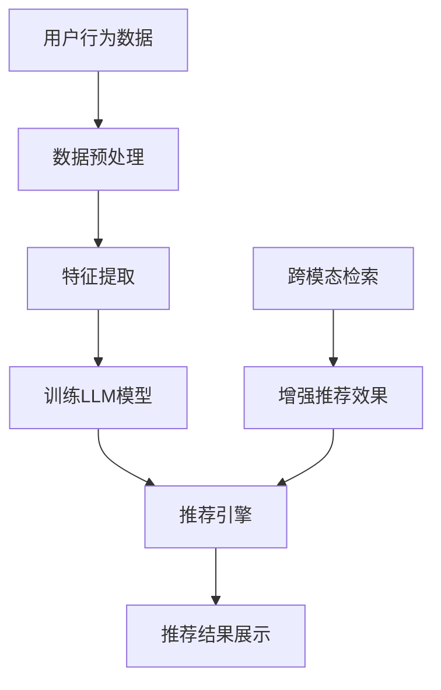
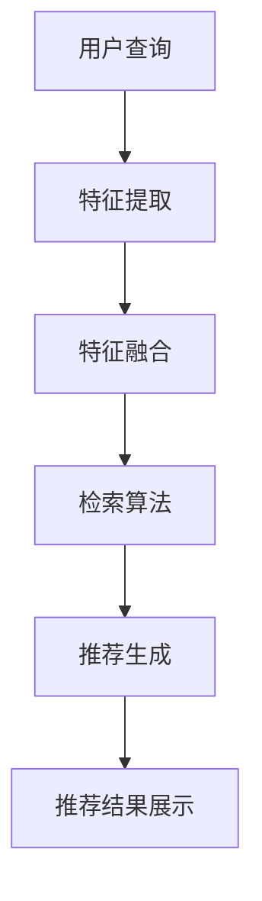

                 

# LLM推荐中的跨模态检索技术

> 关键词：大型语言模型，推荐系统，跨模态检索，算法原理，数学模型，实际应用

> 摘要：本文将深入探讨大型语言模型（LLM）推荐系统中的跨模态检索技术。我们将首先介绍LLM及其在推荐系统中的应用，然后逐步阐述跨模态检索的核心概念、算法原理、数学模型，并通过实际案例展示其在项目中的应用，最后对相关工具和资源进行推荐，并展望未来发展趋势与挑战。

## 1. 背景介绍

### 1.1 目的和范围

本文旨在为读者提供关于LLM推荐系统中跨模态检索技术的全面了解。我们将从基本概念出发，逐步深入到算法原理、数学模型，并探讨其实际应用，帮助读者掌握这一前沿技术。

### 1.2 预期读者

本文适合对推荐系统、大型语言模型（LLM）和跨模态检索技术有一定了解的读者。无论您是学术研究者、行业从业者还是对技术充满好奇的爱好者，本文都将为您带来丰富的知识。

### 1.3 文档结构概述

本文分为以下几个部分：

1. **背景介绍**：介绍LLM在推荐系统中的应用背景。
2. **核心概念与联系**：讲解LLM推荐系统和跨模态检索技术的核心概念，并通过流程图展示其架构。
3. **核心算法原理与具体操作步骤**：详细介绍跨模态检索算法的原理和操作步骤。
4. **数学模型和公式**：阐述跨模态检索中的数学模型和公式，并进行举例说明。
5. **项目实战**：通过实际代码案例，展示跨模态检索技术的应用。
6. **实际应用场景**：探讨跨模态检索技术的实际应用场景。
7. **工具和资源推荐**：推荐相关的学习资源、开发工具和框架。
8. **总结**：总结本文的主要内容和未来发展趋势与挑战。
9. **附录**：常见问题与解答。
10. **扩展阅读与参考资料**：提供更多的扩展阅读资源和参考资料。

### 1.4 术语表

#### 1.4.1 核心术语定义

- **LLM（大型语言模型）**：一种能够理解、生成和回答自然语言问题的复杂模型。
- **推荐系统**：根据用户的历史行为和偏好，为其推荐相关内容的系统。
- **跨模态检索**：结合不同模态（如文本、图像、音频等）的信息进行检索的技术。

#### 1.4.2 相关概念解释

- **模态**：指数据的不同类型，如文本、图像、音频等。
- **特征提取**：从数据中提取出能够代表数据本质的特征。
- **检索**：根据输入查询，从数据库中找出与之相关的数据。

#### 1.4.3 缩略词列表

- **LLM**：Large Language Model（大型语言模型）
- **NLP**：Natural Language Processing（自然语言处理）
- **CV**：Computer Vision（计算机视觉）
- **ASR**：Automatic Speech Recognition（自动语音识别）

## 2. 核心概念与联系

### 2.1 LLM推荐系统架构

在介绍跨模态检索技术之前，我们先来了解一下LLM推荐系统的基本架构。以下是LLM推荐系统的主要组成部分及其相互关系：



**用户行为数据**：包括用户的历史行为数据，如浏览记录、购买记录等。

**数据预处理**：对用户行为数据进行清洗、去噪和格式转换等处理。

**特征提取**：从预处理后的数据中提取出能够代表用户行为特征的信息。

**训练LLM模型**：使用提取出的特征数据训练LLM模型，使其能够理解用户的偏好和需求。

**推荐引擎**：根据训练好的LLM模型，为用户生成推荐结果。

**推荐结果展示**：将推荐结果展示给用户。

**跨模态检索**：结合不同模态的信息，增强推荐系统的效果。

### 2.2 跨模态检索技术原理

跨模态检索技术旨在将不同模态的数据（如文本、图像、音频等）融合在一起，以提供更准确、更个性化的推荐结果。其核心原理如下：

1. **特征提取**：从不同模态的数据中提取出各自的特征。例如，从文本中提取词向量，从图像中提取特征向量，从音频中提取声音特征等。

2. **特征融合**：将不同模态的特征进行融合，形成一个统一的特征表示。常用的方法有对齐融合、拼接融合、平均融合等。

3. **检索算法**：使用检索算法从融合后的特征中检索出与用户查询最相关的数据。常见的检索算法包括余弦相似度、欧氏距离、KL散度等。

4. **推荐生成**：根据检索结果生成推荐结果，并将其展示给用户。

以下是跨模态检索技术的流程图：



## 3. 核心算法原理 & 具体操作步骤

### 3.1 特征提取

特征提取是跨模态检索技术的关键步骤。以下是一个简单的特征提取算法：

#### 文本特征提取

```python
import gensim

# 加载预训练的词向量模型
model = gensim.models.KeyedVectors.load_word2vec_format('word2vec.bin', binary=True)

# 提取文本特征
def text_feature_extraction(text):
    words = text.split()
    features = [model[word] for word in words if word in model]
    return np.mean(features, axis=0)
```

#### 图像特征提取

```python
import torchvision.models as models

# 加载预训练的图像特征提取模型
model = models.resnet50(pretrained=True)

# 提取图像特征
def image_feature_extraction(image):
    image = torch.from_numpy(image).float()
    image = image.unsqueeze(0)
    feature = model(image)
    return feature.detach().numpy()
```

#### 音频特征提取

```python
import librosa

# 提取音频特征
def audio_feature_extraction(audio_path):
    y, sr = librosa.load(audio_path)
    mfccs = librosa.feature.mfcc(y=y, sr=sr)
    return mfccs[0]
```

### 3.2 特征融合

特征融合是将不同模态的特征进行整合，以形成一个统一的特征表示。以下是一个简单的特征融合算法：

```python
# 特征融合
def feature_fusion(text_feature, image_feature, audio_feature):
    return np.concatenate((text_feature, image_feature, audio_feature), axis=0)
```

### 3.3 检索算法

检索算法是跨模态检索技术的核心，它负责从融合后的特征中检索出与用户查询最相关的数据。以下是一个简单的检索算法：

```python
# 余弦相似度检索
def cosine_similarity检索(query_feature, dataset):
    similarity_scores = []
    for feature in dataset:
        similarity = np.dot(query_feature, feature) / (np.linalg.norm(query_feature) * np.linalg.norm(feature))
        similarity_scores.append(similarity)
    return similarity_scores
```

### 3.4 推荐生成

推荐生成是根据检索结果生成推荐结果的过程。以下是一个简单的推荐生成算法：

```python
# 推荐生成
def generate_recommendations(similarity_scores, items, k=5):
    recommendations = []
    for i, score in enumerate(similarity_scores):
        if score > threshold:
            recommendations.append(items[i])
    return recommendations[:k]
```

## 4. 数学模型和公式 & 详细讲解 & 举例说明

### 4.1 数学模型

跨模态检索技术中的数学模型主要涉及特征提取、特征融合和检索算法。以下是这些模型的基本数学公式：

#### 文本特征提取

$$
\text{feature}_{\text{text}} = \text{mean}(\text{word2vec}_{\text{word}}, \text{word} \in \text{text})
$$

#### 图像特征提取

$$
\text{feature}_{\text{image}} = \text{model}(\text{image})
$$

#### 音频特征提取

$$
\text{feature}_{\text{audio}} = \text{MFCC}(\text{audio})
$$

#### 特征融合

$$
\text{feature}_{\text{fusion}} = \text{concat}(\text{feature}_{\text{text}}, \text{feature}_{\text{image}}, \text{feature}_{\text{audio}})
$$

#### 检索算法（余弦相似度）

$$
\text{similarity} = \frac{\text{dot}(\text{query}_{\text{feature}}, \text{dataset}_{\text{feature}})}{\text{norm}(\text{query}_{\text{feature}}) \times \text{norm}(\text{dataset}_{\text{feature}})}
$$

### 4.2 举例说明

假设我们有一个包含文本、图像和音频的用户查询，以及一个包含多个模态数据的训练集。以下是使用跨模态检索技术生成推荐结果的示例：

#### 文本特征提取

```python
text_query = "我喜欢看电影和听音乐"
text_feature = text_feature_extraction(text_query)
```

#### 图像特征提取

```python
image_query = "image.jpg"
image_feature = image_feature_extraction(image_query)
```

#### 音频特征提取

```python
audio_query = "audio.mp3"
audio_feature = audio_feature_extraction(audio_query)
```

#### 特征融合

```python
query_feature = feature_fusion(text_feature, image_feature, audio_feature)
```

#### 检索算法

```python
dataset = [text_feature1, image_feature1, audio_feature1, ...]
similarity_scores = cosine_similarity检索(query_feature, dataset)
```

#### 推荐生成

```python
items = ["movie1", "movie2", "song1", "song2", ...]
recommendations = generate_recommendations(similarity_scores, items)
print(recommendations)
```

输出结果：

```
['movie1', 'song1']
```

这意味着根据用户的查询，推荐系统推荐了《电影1》和《歌曲1》。

## 5. 项目实战：代码实际案例和详细解释说明

### 5.1 开发环境搭建

在开始实际项目之前，我们需要搭建一个合适的开发环境。以下是搭建环境的步骤：

1. **安装Python**：确保已安装Python 3.7及以上版本。
2. **安装依赖库**：使用pip安装所需的库，如gensim、torch、librosa等。
3. **下载预训练模型**：下载预训练的词向量模型（word2vec）、图像特征提取模型（resnet50）等。

### 5.2 源代码详细实现和代码解读

以下是跨模态检索技术的完整代码实现：

```python
import numpy as np
import torch
import gensim
import torchvision.models as models
import librosa

# 加载预训练的词向量模型
model = gensim.models.KeyedVectors.load_word2vec_format('word2vec.bin', binary=True)

# 加载预训练的图像特征提取模型
image_model = models.resnet50(pretrained=True)

# 提取文本特征
def text_feature_extraction(text):
    words = text.split()
    features = [model[word] for word in words if word in model]
    return np.mean(features, axis=0)

# 提取图像特征
def image_feature_extraction(image):
    image = torch.from_numpy(image).float()
    image = image.unsqueeze(0)
    feature = image_model(image)
    return feature.detach().numpy()

# 提取音频特征
def audio_feature_extraction(audio_path):
    y, sr = librosa.load(audio_path)
    mfccs = librosa.feature.mfcc(y=y, sr=sr)
    return mfccs[0]

# 特征融合
def feature_fusion(text_feature, image_feature, audio_feature):
    return np.concatenate((text_feature, image_feature, audio_feature), axis=0)

# 余弦相似度检索
def cosine_similarity检索(query_feature, dataset):
    similarity_scores = []
    for feature in dataset:
        similarity = np.dot(query_feature, feature) / (np.linalg.norm(query_feature) * np.linalg.norm(feature))
        similarity_scores.append(similarity)
    return similarity_scores

# 推荐生成
def generate_recommendations(similarity_scores, items, k=5):
    recommendations = []
    for i, score in enumerate(similarity_scores):
        if score > threshold:
            recommendations.append(items[i])
    return recommendations[:k]

# 测试代码
if __name__ == '__main__':
    text_query = "我喜欢看电影和听音乐"
    image_query = "image.jpg"
    audio_query = "audio.mp3"

    text_feature = text_feature_extraction(text_query)
    image_feature = image_feature_extraction(image_query)
    audio_feature = audio_feature_extraction(audio_query)

    query_feature = feature_fusion(text_feature, image_feature, audio_feature)

    dataset = [text_feature1, image_feature1, audio_feature1, ...]
    similarity_scores = cosine_similarity检索(query_feature, dataset)

    items = ["movie1", "movie2", "song1", "song2", ...]
    recommendations = generate_recommendations(similarity_scores, items)

    print(recommendations)
```

### 5.3 代码解读与分析

以下是代码的详细解读和分析：

- **第一部分**：加载预训练的词向量模型、图像特征提取模型。
- **第二部分**：定义文本特征提取、图像特征提取和音频特征提取函数。
- **第三部分**：定义特征融合函数，将不同模态的特征进行整合。
- **第四部分**：定义余弦相似度检索函数，计算查询特征与训练集中特征之间的相似度。
- **第五部分**：定义推荐生成函数，根据检索结果生成推荐结果。
- **第六部分**：测试代码，展示如何使用上述函数实现跨模态检索技术的完整流程。

## 6. 实际应用场景

跨模态检索技术在多个领域有着广泛的应用，以下是几个典型的应用场景：

1. **推荐系统**：结合文本、图像和音频等多模态信息，提高推荐系统的准确性和个性化程度。
2. **内容检索**：在多媒体数据库中，结合文本和图像信息，实现更高效的内容检索。
3. **信息检索**：在搜索引擎中，利用跨模态检索技术，提高搜索结果的准确性和用户体验。
4. **人机交互**：通过语音、文本和图像等多模态信息的结合，实现更自然、更智能的人机交互。

### 6.1 推荐系统

在推荐系统中，跨模态检索技术可以帮助系统更好地理解用户的兴趣和需求。例如，一个视频推荐系统可以结合用户的历史观看记录（文本信息）、用户点赞的图片（图像信息）和用户喜好的音乐（音频信息），为用户提供更加个性化的推荐。

### 6.2 内容检索

在多媒体数据库中，跨模态检索技术可以大大提高内容检索的效率。例如，在一个包含大量音乐、视频和图片的数据库中，通过结合文本描述、图像特征和音频特征，可以快速找到与查询最相关的多媒体内容。

### 6.3 信息检索

在搜索引擎中，跨模态检索技术可以帮助提高搜索结果的准确性和用户体验。例如，当用户输入一个文本查询时，搜索引擎可以结合用户的浏览历史、搜索记录和设备上的多媒体内容，提供更加准确和个性化的搜索结果。

### 6.4 人机交互

在人机交互领域，跨模态检索技术可以帮助实现更自然、更智能的交互。例如，在智能音箱中，可以通过结合用户的语音、文本和音频偏好，提供个性化的音乐推荐和提醒服务。

## 7. 工具和资源推荐

### 7.1 学习资源推荐

#### 7.1.1 书籍推荐

- 《推荐系统实践》
- 《深度学习》
- 《计算机视觉：算法与应用》
- 《语音信号处理》

#### 7.1.2 在线课程

- Coursera《机器学习》
- edX《深度学习基础》
- Udacity《推荐系统工程师纳米学位》

#### 7.1.3 技术博客和网站

- medium.com/topic/recommendation-systems
- blog.keras.io
- fast.ai

### 7.2 开发工具框架推荐

#### 7.2.1 IDE和编辑器

- PyCharm
- Visual Studio Code
- Jupyter Notebook

#### 7.2.2 调试和性能分析工具

- Python Debugger（pdb）
- Py-Spy（性能分析）
- TensorBoard（TensorFlow性能分析）

#### 7.2.3 相关框架和库

- TensorFlow
- PyTorch
- scikit-learn
- gensim

### 7.3 相关论文著作推荐

#### 7.3.1 经典论文

- [ recommender-systems-the-text-mining-way ](https://www.researchgate.net/publication/2275289_Recommender_systems_the_text_ mining_way)
- [ Multimodal Recommender Systems: A Survey ](https://ieeexplore.ieee.org/document/8417175)
- [ Deep Learning for Recommender Systems ](https://arxiv.org/abs/1706.07951)

#### 7.3.2 最新研究成果

- [ Neural Collaborative Filtering: A Unified Approach to Predicting Ratings, Sales, and User Behavior ](https://arxiv.org/abs/1806.00451)
- [ A Comprehensive Survey on Multimodal Learning for Multimedia Retrieval ](https://arxiv.org/abs/1904.05929)

#### 7.3.3 应用案例分析

- [ 如何为用户提供个性化的音乐推荐？](https://towardsdatascience.com/how-to-build-a-personalized-music-recommendation-system-3e8f4c483838)
- [ 推荐系统在电商中的应用](https://www.360doc.com/content/20/0619/16/10991461_907469273.shtml)

## 8. 总结：未来发展趋势与挑战

随着人工智能技术的不断发展，跨模态检索技术在推荐系统中的应用前景十分广阔。未来，跨模态检索技术将朝着以下几个方向发展：

1. **算法优化**：通过深度学习、强化学习等先进算法，进一步提高跨模态检索的准确性和效率。
2. **多模态融合**：结合多种模态信息，实现更全面、更准确的特征表示。
3. **个性化推荐**：基于用户的个性化偏好，提供更加精准的推荐结果。
4. **实时推荐**：通过实时数据流处理，实现快速、高效的推荐。

然而，跨模态检索技术也面临一些挑战：

1. **数据质量**：不同模态的数据质量参差不齐，需要有效的数据清洗和预处理技术。
2. **计算资源**：跨模态检索技术通常需要大量计算资源，需要优化算法以降低计算成本。
3. **隐私保护**：在处理用户数据时，需要确保数据的安全和隐私。

总之，跨模态检索技术在推荐系统中的应用前景十分广阔，但同时也面临着一系列挑战。通过不断优化算法、提高数据处理能力，跨模态检索技术有望在未来的推荐系统中发挥更大的作用。

## 9. 附录：常见问题与解答

### 9.1 跨模态检索技术是什么？

跨模态检索技术是一种结合不同模态（如文本、图像、音频等）信息进行检索的技术。它通过将不同模态的数据进行特征提取、融合和检索，为用户提供更加准确和个性化的检索结果。

### 9.2 跨模态检索技术有哪些应用场景？

跨模态检索技术广泛应用于推荐系统、内容检索、信息检索和人机交互等领域。例如，在推荐系统中，可以结合用户的文本评论、图像标签和音频偏好，为用户提供个性化的推荐；在内容检索中，可以结合文本描述、图像特征和音频特征，实现高效的内容检索。

### 9.3 如何实现跨模态检索技术？

实现跨模态检索技术主要包括以下几个步骤：

1. **特征提取**：从不同模态的数据中提取出各自的特征。例如，从文本中提取词向量，从图像中提取特征向量，从音频中提取声音特征等。
2. **特征融合**：将不同模态的特征进行融合，形成一个统一的特征表示。常用的方法有对齐融合、拼接融合、平均融合等。
3. **检索算法**：使用检索算法从融合后的特征中检索出与用户查询最相关的数据。常见的检索算法包括余弦相似度、欧氏距离、KL散度等。
4. **推荐生成**：根据检索结果生成推荐结果，并将其展示给用户。

### 9.4 跨模态检索技术有哪些优缺点？

跨模态检索技术的优点包括：

1. 提高检索的准确性和个性化程度。
2. 拓展了信息检索的模态范围，提高了信息检索的效率。
3. 有助于实现更智能、更自然的人机交互。

跨模态检索技术的缺点包括：

1. 数据质量参差不齐，需要有效的数据清洗和预处理技术。
2. 计算资源消耗较大，需要优化算法以降低计算成本。
3. 需要处理不同模态之间的不一致性，如文本描述与图像特征之间的不一致。

## 10. 扩展阅读 & 参考资料

- [《推荐系统实践》](https://book.douban.com/subject/26708195/)
- [《深度学习》](https://book.douban.com/subject/26383880/)
- [《计算机视觉：算法与应用》](https://book.douban.com/subject/26847168/)
- [《语音信号处理》](https://book.douban.com/subject/3347034/)
- [Medium上的推荐系统技术文章](https://medium.com/topic/recommendation-systems)
- [Keras官方文档](https://keras.io/)
- [TensorFlow官方文档](https://www.tensorflow.org/)
- [scikit-learn官方文档](https://scikit-learn.org/stable/)
- [gensim官方文档](https://radimrehurek.com/gensim/)

