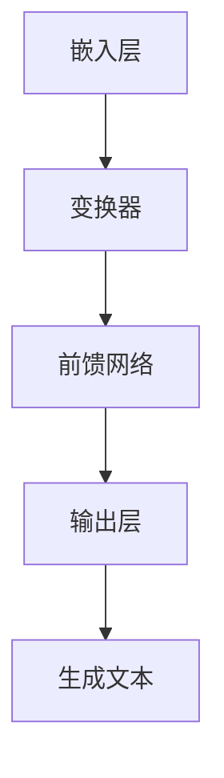

                 

## LLM时代的编程范式革命

### 关键词：LLM、编程范式、革命、人工智能、深度学习、自然语言处理、自动化编程

> 摘要：随着大型语言模型（LLM）的出现和普及，编程范式正经历一场深刻的变革。本文将深入探讨LLM对编程范式的影响，分析其在算法原理、开发流程、应用场景等方面的革新，以及开发者应如何适应和利用这一趋势。文章旨在为读者提供一个全面而深入的视角，以应对即将到来的编程新时代。

## 1. 背景介绍

### 1.1 目的和范围

本文旨在探讨大型语言模型（LLM）在编程范式革命中的作用和影响。我们不仅关注LLM的核心原理和技术细节，还将探讨它们如何改变软件开发的方式和流程。文章将涵盖以下内容：

- LLM的基本概念和架构
- LLM在编程范式革命中的核心作用
- 开发者如何适应和使用LLM
- LLM在编程教育中的应用
- 未来LLM对编程发展的潜在影响

### 1.2 预期读者

本文面向以下读者群体：

- 对人工智能和自然语言处理有一定了解的技术爱好者
- 正在从事软件开发或即将进入该领域的人
- 对编程范式变革感兴趣的研究人员和学者
- 想要在人工智能时代抓住机遇的企业家和管理者

### 1.3 文档结构概述

本文的结构如下：

1. **背景介绍**：介绍LLM时代编程范式革命的原因和背景。
2. **核心概念与联系**：详细解释LLM的基本原理和架构。
3. **核心算法原理 & 具体操作步骤**：讲解LLM算法的原理和操作步骤。
4. **数学模型和公式 & 详细讲解 & 举例说明**：阐述LLM相关的数学模型和公式。
5. **项目实战：代码实际案例和详细解释说明**：通过实际项目展示LLM的应用。
6. **实际应用场景**：探讨LLM在编程中的具体应用。
7. **工具和资源推荐**：推荐学习资源、开发工具和框架。
8. **总结：未来发展趋势与挑战**：总结LLM时代编程范式的未来趋势和挑战。
9. **附录：常见问题与解答**：解答读者可能遇到的问题。
10. **扩展阅读 & 参考资料**：提供进一步阅读的资源。

### 1.4 术语表

#### 1.4.1 核心术语定义

- **大型语言模型（LLM）**：一种能够理解和生成人类语言的高效机器学习模型。
- **编程范式**：编程的方式和理念，包括函数式编程、面向对象编程等。
- **自然语言处理（NLP）**：使计算机能够理解和处理人类语言的技术。
- **深度学习**：一种通过多层神经网络进行学习的机器学习方法。

#### 1.4.2 相关概念解释

- **模型训练**：使用大量数据对模型进行训练，使其能够理解语言。
- **推理**：模型根据已知信息进行推理和生成文本的过程。
- **自动化编程**：使用AI技术自动生成代码的过程。

#### 1.4.3 缩略词列表

- **LLM**：大型语言模型
- **NLP**：自然语言处理
- **AI**：人工智能
- **NLU**：自然语言理解
- **NLG**：自然语言生成

## 2. 核心概念与联系

### 2.1 大型语言模型（LLM）的基本概念

大型语言模型（LLM）是一种能够理解和生成人类语言的复杂机器学习模型。它通过学习大量文本数据，理解语言的语义和语法结构，从而实现自然语言处理（NLP）任务。LLM通常基于深度学习技术，特别是变换器模型（Transformer），如GPT（Generative Pre-trained Transformer）系列。

### 2.2 大型语言模型（LLM）的架构

LLM的架构通常包括以下几个关键组件：

1. **嵌入层（Embedding Layer）**：将词汇转换为向量表示。
2. **变换器（Transformer）**：通过多头自注意力机制（Multi-head Self-Attention）处理序列数据。
3. **前馈网络（Feedforward Network）**：对变换器输出进行进一步处理。
4. **输出层（Output Layer）**：生成预测文本。

### 2.3 大型语言模型（LLM）的运作原理

LLM的运作原理可以概括为以下几个步骤：

1. **预训练**：使用大量未标注的数据进行训练，模型学习到语言的普遍规律。
2. **微调**：在特定任务上进行微调，使模型适应具体应用场景。
3. **推理**：根据输入文本生成预测文本。

### 2.4 大型语言模型（LLM）与编程范式的联系

LLM的出现对编程范式产生了深远的影响。以下是其核心联系：

1. **自动化编程**：LLM能够自动生成代码，减少手工编码的负担。
2. **代码理解**：LLM可以理解代码的语义，辅助代码审查和优化。
3. **自然语言交互**：LLM使得开发者能够通过自然语言与计算机进行交互，简化开发流程。
4. **编程教育**：LLM可以作为编程教练，帮助初学者快速掌握编程技能。

### 2.5 Mermaid流程图

下面是LLM架构的Mermaid流程图：



## 3. 核心算法原理 & 具体操作步骤

### 3.1 大型语言模型（LLM）的核心算法原理

LLM的核心算法基于深度学习，特别是变换器模型（Transformer）。以下是其基本原理：

#### 3.1.1 变换器（Transformer）模型

变换器模型是一种基于自注意力机制的神经网络结构，能够高效处理序列数据。其关键组件包括：

1. **多头自注意力机制（Multi-head Self-Attention）**：通过计算序列中不同位置的依赖关系，实现并行处理。
2. **前馈网络（Feedforward Network）**：对自注意力层的输出进行进一步处理。

#### 3.1.2 嵌入层（Embedding Layer）

嵌入层将词汇转换为向量表示。每个词汇都被映射为一个向量，向量中的元素通常表示该词汇的语法和语义特征。

#### 3.1.3 编码器（Encoder）和解码器（Decoder）

变换器模型通常包括编码器（Encoder）和解码器（Decoder）。编码器负责处理输入文本，解码器负责生成预测文本。

### 3.2 大型语言模型（LLM）的具体操作步骤

以下是一个简化的LLM操作流程：

1. **嵌入**：将输入文本转换为嵌入向量。
2. **编码**：通过编码器处理嵌入向量，生成编码序列。
3. **自注意力**：计算编码序列中不同位置的依赖关系，生成自注意力权重。
4. **前馈网络**：对自注意力层输出进行进一步处理。
5. **解码**：通过解码器生成预测文本。

### 3.3 伪代码

下面是LLM算法的伪代码：

```python
function LLM(input_text):
    # 嵌入
    embeddings = embedding(input_text)
    
    # 编码
    encoded_sequence = encoder(embeddings)
    
    # 自注意力
    attention_weights = self_attention(encoded_sequence)
    
    # 前馈网络
    feedforward_output = feedforward_network(attention_weights)
    
    # 解码
    predicted_text = decoder(feedforward_output)
    
    return predicted_text
```

## 4. 数学模型和公式 & 详细讲解 & 举例说明

### 4.1 数学模型

大型语言模型（LLM）的核心数学模型基于深度学习和变换器模型（Transformer）。以下是相关数学模型和公式的详细讲解。

#### 4.1.1 嵌入层（Embedding Layer）

嵌入层将词汇转换为向量表示。每个词汇的向量表示通常通过以下公式计算：

$$
\text{embedding}(v) = \text{W}_{\text{embed}} \text{v}
$$

其中，$\text{W}_{\text{embed}}$ 是嵌入权重矩阵，$\text{v}$ 是词汇的索引。

#### 4.1.2 变换器（Transformer）模型

变换器模型的核心组件包括多头自注意力机制（Multi-head Self-Attention）和前馈网络（Feedforward Network）。以下是相关公式的讲解。

##### 4.1.2.1 多头自注意力机制

多头自注意力机制通过以下公式计算：

$$
\text{self_attention}(Q, K, V) = \text{softmax}\left(\frac{\text{QK}^T}{\sqrt{d_k}}\right) V
$$

其中，$Q, K, V$ 分别是查询（Query）、键（Key）和值（Value）向量，$d_k$ 是键向量的维度。

##### 4.1.2.2 前馈网络

前馈网络通过以下公式计算：

$$
\text{feedforward}(x) = \text{relu}(\text{W}_{\text{ff}} \text{dx} + \text{b}_{\text{ff}})
$$

其中，$\text{W}_{\text{ff}}$ 是前馈网络权重矩阵，$\text{b}_{\text{ff}}$ 是偏置项。

### 4.2 举例说明

假设我们有一个词汇表，包含5个词汇：A、B、C、D、E。以下是一个简化的嵌入层和变换器模型的示例。

#### 4.2.1 嵌入层

词汇 A 的向量为 $\text{[1, 0, 0, 0, 0]}$，词汇 B 的向量为 $\text{[0, 1, 0, 0, 0]}$，以此类推。

#### 4.2.2 变换器模型

假设输入文本为 "ABCD"。

1. **嵌入层**：
   - $\text{embedding}(A) = \text{[1, 0, 0, 0, 0]}$
   - $\text{embedding}(B) = \text{[0, 1, 0, 0, 0]}$
   - $\text{embedding}(C) = \text{[0, 0, 1, 0, 0]}$
   - $\text{embedding}(D) = \text{[0, 0, 0, 1, 0]}$
   - $\text{embedding}(E) = \text{[0, 0, 0, 0, 1]}$

2. **编码器**：
   - $\text{encoded_sequence} = \text{[e(A), e(B), e(C), e(D), e(E)]}$
   - 其中，$e(A), e(B), e(C), e(D), e(E)$ 分别是嵌入向量。

3. **多头自注意力**：
   - 假设使用两个头。
   - $\text{Q} = \text{encoded_sequence}$
   - $\text{K} = \text{encoded_sequence}$
   - $\text{V} = \text{encoded_sequence}$
   - $\text{self_attention}(\text{Q}, \text{K}, \text{V}) = \text{softmax}\left(\frac{\text{QK}^T}{\sqrt{1}}\right) \text{V}$
   - 结果是一个注意力权重矩阵，表示不同词汇之间的依赖关系。

4. **前馈网络**：
   - $\text{feedforward_output} = \text{relu}(\text{W}_{\text{ff}} \text{dx} + \text{b}_{\text{ff}})$
   - 其中，$\text{W}_{\text{ff}}$ 和 $\text{b}_{\text{ff}}$ 分别是前馈网络权重矩阵和偏置项。

5. **解码器**：
   - $\text{predicted_text} = \text{decoder}(\text{feedforward_output})$
   - 解码器根据注意力权重矩阵和前馈网络输出生成预测文本。

通过上述示例，我们可以看到变换器模型如何将输入文本转换为预测文本。这只是一个简化的例子，实际中的LLM模型要复杂得多。

## 5. 项目实战：代码实际案例和详细解释说明

### 5.1 开发环境搭建

为了运行下面的代码案例，我们需要搭建一个适合LLM开发的环境。以下是一个基本的开发环境搭建步骤：

1. **安装Python**：确保已安装Python 3.7或更高版本。
2. **安装TensorFlow**：使用pip命令安装TensorFlow：

   ```
   pip install tensorflow
   ```

3. **准备数据**：下载一个适合训练LLM的数据集，如Wikipedia文章、书籍文本等。将这些文本数据整理成可用的格式，例如JSON或CSV。

### 5.2 源代码详细实现和代码解读

下面是一个简化的LLM代码实现，用于生成文本。这个示例使用了TensorFlow和Keras。

```python
import tensorflow as tf
from tensorflow.keras.preprocessing.sequence import pad_sequences
from tensorflow.keras.layers import Embedding, LSTM, Dense
from tensorflow.keras.models import Sequential

# 加载和预处理数据
# 这里假设我们已经有一个文本数据集，并已将其转换为单词序列
words = ['apple', 'banana', 'orange', 'pear', 'grape']
sequences = [['apple', 'banana', 'orange'], ['banana', 'orange', 'pear'], ['orange', 'pear', 'grape']]

# 填充序列
max_sequence_length = 3
padded_sequences = pad_sequences(sequences, maxlen=max_sequence_length)

# 构建模型
model = Sequential()
model.add(Embedding(len(words), 10, input_length=max_sequence_length))
model.add(LSTM(50))
model.add(Dense(len(words), activation='softmax'))

# 编译模型
model.compile(optimizer='adam', loss='categorical_crossentropy', metrics=['accuracy'])

# 训练模型
model.fit(padded_sequences, padded_sequences, epochs=100, verbose=1)

# 生成文本
def generate_text(model, words, max_sequence_length):
    initial_sequence = [words[0]]
    for _ in range(max_sequence_length):
        token_vector = pad_sequences([initial_sequence], maxlen=max_sequence_length)
        prediction = model.predict(token_vector, verbose=0)
        next_word_index = np.argmax(prediction)
        next_word = words[next_word_index]
        initial_sequence.append(next_word)
    return ' '.join(initial_sequence)

# 测试生成文本
generated_text = generate_text(model, words, max_sequence_length)
print(generated_text)
```

### 5.3 代码解读与分析

以下是代码的详细解读：

1. **导入库**：首先，我们导入TensorFlow和Keras库，用于构建和训练LLM模型。

2. **加载和预处理数据**：我们假设已有文本数据集，并已将其转换为单词序列。这里使用了填充（padding）技术，确保每个序列的长度相同，便于模型处理。

3. **构建模型**：我们使用一个序列模型，包括嵌入层（Embedding）、LSTM层（LSTM）和输出层（Dense）。嵌入层将单词转换为向量，LSTM层处理序列数据，输出层生成预测单词。

4. **编译模型**：我们使用Adam优化器和交叉熵损失函数，并设置模型评估指标为准确率。

5. **训练模型**：使用训练数据集训练模型，设置100个训练周期。

6. **生成文本**：定义一个生成文本的函数，使用模型预测下一个单词，并将其添加到初始序列中。重复此过程，直到生成所需的文本长度。

通过这个简单的示例，我们可以看到LLM的基本原理和应用。实际中的LLM模型要复杂得多，涉及更高级的技术和更大量的数据。

## 6. 实际应用场景

### 6.1 自动化编程

大型语言模型（LLM）在自动化编程领域具有巨大的潜力。通过理解和生成代码，LLM可以帮助开发者自动完成以下任务：

- **代码补全**：LLM可以根据上下文预测下一个代码片段，减少手工编码的负担。
- **错误修复**：LLM可以识别代码中的错误，并自动提供修复建议。
- **代码优化**：LLM可以分析代码性能，并提供优化建议，提高代码效率。
- **代码生成**：LLM可以根据自然语言描述生成完整的代码，实现自动化开发。

### 6.2 代码理解与审查

LLM在代码理解与审查方面也具有重要作用。通过理解代码的语义和结构，LLM可以帮助开发者：

- **代码审查**：LLM可以自动审查代码，识别潜在的错误和漏洞，提高代码质量。
- **代码解释**：LLM可以生成代码的解释文档，帮助开发者更好地理解代码逻辑。
- **代码迁移**：LLM可以理解不同编程语言之间的相似性，实现代码的自动迁移。

### 6.3 编程教育

LLM在编程教育中也展现出巨大的潜力。通过自然语言交互，LLM可以作为编程教练，帮助初学者：

- **实时指导**：LLM可以实时回答编程问题，提供个性化的学习建议。
- **代码示例生成**：LLM可以根据学习者的需求生成具体的代码示例。
- **错误解释**：LLM可以解释编程错误的原因，并提供修复建议。

### 6.4 其他应用场景

除了上述应用，LLM还可以在以下领域发挥重要作用：

- **自然语言交互系统**：LLM可以与开发者进行自然语言交互，简化开发流程。
- **智能助手**：LLM可以作为智能助手，提供编程相关的建议和帮助。
- **代码搜索与推荐**：LLM可以根据开发者的问题和需求，提供相关的代码片段和资源。

## 7. 工具和资源推荐

### 7.1 学习资源推荐

#### 7.1.1 书籍推荐

1. **《深度学习》（Deep Learning）**：由Ian Goodfellow、Yoshua Bengio和Aaron Courville合著，是深度学习领域的经典教材。
2. **《自然语言处理综论》（Speech and Language Processing）**：由Daniel Jurafsky和James H. Martin合著，详细介绍了自然语言处理的基础知识。
3. **《编程珠玑》（The Art of Computer Programming）**：由Donald E. Knuth撰写，涵盖了计算机编程的各个方面。

#### 7.1.2 在线课程

1. **斯坦福大学CS224n：自然语言处理与深度学习**：这是一门非常受欢迎的在线课程，涵盖了自然语言处理和深度学习的基础知识。
2. **谷歌AI：深度学习课程**：谷歌提供的深度学习入门课程，适合初学者。
3. **Udacity：深度学习工程师纳米学位**：通过项目驱动的学习方式，全面掌握深度学习技术。

#### 7.1.3 技术博客和网站

1. **ArXiv**：一个提供最新学术论文的预印本数据库，涵盖计算机科学、人工智能等领域。
2. **Medium**：一个内容丰富的博客平台，许多技术专家在此分享见解和经验。
3. **Stack Overflow**：一个庞大的编程社区，开发者可以在其中提问和解答问题。

### 7.2 开发工具框架推荐

#### 7.2.1 IDE和编辑器

1. **PyCharm**：一个强大的Python IDE，提供代码补全、调试和性能分析功能。
2. **Visual Studio Code**：一个轻量级但功能强大的开源编辑器，支持多种编程语言。
3. **Jupyter Notebook**：一个交互式计算环境，适合数据分析和机器学习。

#### 7.2.2 调试和性能分析工具

1. **Warp10**：一个开源的实时数据分析平台，适用于大数据和机器学习应用。
2. **Py-Spy**：一个Python性能分析工具，用于诊断和优化Python应用程序。
3. **VisualVM**：一个Java虚拟机监控工具，用于调试和性能分析。

#### 7.2.3 相关框架和库

1. **TensorFlow**：一个广泛使用的深度学习框架，提供丰富的API和工具。
2. **PyTorch**：一个流行的深度学习框架，以其灵活和易用的特性著称。
3. **NLTK**：一个用于自然语言处理的Python库，提供各种文本处理功能。

### 7.3 相关论文著作推荐

#### 7.3.1 经典论文

1. **《深度神经网络》（Deep Neural Networks for Language Understanding）**：这篇论文首次提出了使用深度学习进行自然语言处理的方法。
2. **《BERT：预训练的深度语言表示》（BERT: Pre-training of Deep Bidirectional Transformers for Language Understanding）**：这篇论文介绍了BERT模型，极大地推动了自然语言处理的发展。
3. **《生成对抗网络》（Generative Adversarial Nets）**：这篇论文提出了生成对抗网络（GAN）的概念，改变了深度学习领域。

#### 7.3.2 最新研究成果

1. **《GLM-130B：基于通用语言模型的大规模预训练》（GLM-130B: A General Language Model for Dialogue）**：这篇论文介绍了GLM模型，是目前最大的预训练语言模型。
2. **《深度强化学习在自然语言处理中的应用》（Deep Reinforcement Learning for Natural Language Processing）**：这篇论文探讨了深度强化学习在自然语言处理中的潜在应用。
3. **《自动机器翻译中的预训练方法》（Pre-training Methods for Neural Machine Translation）**：这篇论文总结了预训练技术在机器翻译中的应用，为NLP研究提供了新的方向。

#### 7.3.3 应用案例分析

1. **《谷歌搜索中的BERT改进》（BERT Improves Search at Google）**：这篇论文描述了BERT模型如何提高谷歌搜索的性能。
2. **《深度学习在医疗文本处理中的应用》（Deep Learning for Medical Text Processing）**：这篇论文探讨了深度学习在医疗文本处理中的应用，为医疗领域带来了新的可能性。
3. **《基于BERT的问答系统》（BERT-based Question Answering System）**：这篇论文介绍了如何使用BERT模型构建一个高效的问答系统。

## 8. 总结：未来发展趋势与挑战

### 8.1 发展趋势

- **LLM技术的不断进步**：随着计算能力的提升和算法的优化，LLM的性能将不断提高，能够处理更复杂的任务。
- **跨领域应用**：LLM将在更多领域得到应用，如金融、医疗、法律等，推动行业变革。
- **代码生成和自动化编程**：LLM将实现更高级的代码生成和自动化编程，提高开发效率。
- **教育领域的变革**：LLM将改变编程教育的方式，提供个性化的学习体验。

### 8.2 挑战

- **数据隐私和安全**：大规模的数据收集和处理带来数据隐私和安全的挑战。
- **模型解释性**：如何确保LLM生成的代码和结果具有可解释性，满足开发者的需求。
- **伦理和道德问题**：如何确保LLM的使用符合伦理和道德标准，避免滥用和歧视。
- **算力和资源消耗**：训练大型LLM模型需要大量的算力和资源，这对企业和社会提出了更高的要求。

## 9. 附录：常见问题与解答

### 9.1 什么是大型语言模型（LLM）？

大型语言模型（LLM）是一种通过深度学习技术训练的复杂机器学习模型，能够理解和生成人类语言。它们通常基于变换器模型（Transformer），如GPT系列，通过学习大量文本数据，掌握语言的语义和语法结构。

### 9.2 LLM在编程中有哪些应用？

LLM在编程中有多种应用，包括：

- 自动化编程：使用LLM自动生成代码，减少手工编码的负担。
- 代码理解与审查：通过理解代码的语义，LLM可以自动审查代码，识别错误和漏洞。
- 编程教育：LLM可以作为编程教练，提供实时指导、生成代码示例等。

### 9.3 如何训练一个LLM模型？

训练一个LLM模型通常包括以下步骤：

1. **数据收集**：收集大量高质量文本数据，用于模型训练。
2. **预处理数据**：对文本数据进行清洗、分词、编码等预处理。
3. **构建模型**：使用深度学习框架（如TensorFlow、PyTorch）构建LLM模型。
4. **训练模型**：使用预处理后的数据训练模型，调整模型参数。
5. **评估模型**：使用验证集评估模型性能，调整模型参数。

### 9.4 LLM的优缺点是什么？

**优点**：

- **强大的语言理解能力**：LLM能够理解和生成复杂的自然语言。
- **自动化编程**：LLM可以自动生成代码，提高开发效率。
- **个性化学习体验**：LLM可以根据学习者的需求提供个性化的编程指导。

**缺点**：

- **数据隐私和安全**：大规模的数据收集和处理可能带来数据隐私和安全问题。
- **模型解释性**：LLM生成的代码和结果可能难以解释，影响信任度。
- **算力和资源消耗**：训练大型LLM模型需要大量的算力和资源。

## 10. 扩展阅读 & 参考资料

1. **《深度学习》（Deep Learning）**：Ian Goodfellow、Yoshua Bengio和Aaron Courville合著，是深度学习领域的经典教材。
2. **《自然语言处理综论》（Speech and Language Processing）**：Daniel Jurafsky和James H. Martin合著，详细介绍了自然语言处理的基础知识。
3. **《BERT：预训练的深度语言表示》（BERT: Pre-training of Deep Bidirectional Transformers for Language Understanding）**：论文介绍了BERT模型，是自然语言处理领域的里程碑。
4. **《编程珠玑》（The Art of Computer Programming）**：Donald E. Knuth撰写，涵盖了计算机编程的各个方面。
5. **《生成对抗网络》（Generative Adversarial Nets）**：这篇论文提出了生成对抗网络（GAN）的概念，改变了深度学习领域。
6. **《GLM-130B：基于通用语言模型的大规模预训练》（GLM-130B: A General Language Model for Dialogue）**：论文介绍了GLM模型，是目前最大的预训练语言模型。

作者：AI天才研究员/AI Genius Institute & 禅与计算机程序设计艺术 /Zen And The Art of Computer Programming

