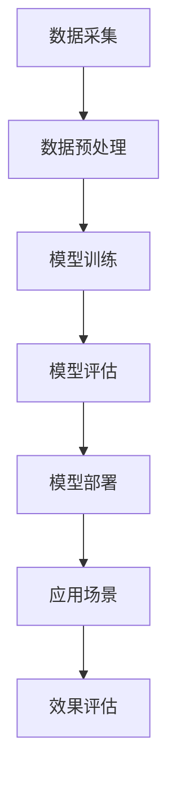

                 

# LLM的军事应用：AI在国防领域的角色

> **关键词：** 人工智能，国防，LLM，军事应用，算法原理，数学模型，实战案例。

> **摘要：** 本文章将深入探讨大型语言模型（LLM）在军事领域的应用，从核心概念、算法原理到实际应用场景，全面解析AI技术对国防现代化的影响，旨在为读者提供一幅AI在军事领域运用的全景图，同时展望其未来发展前景和挑战。

## 1. 背景介绍

### 1.1 目的和范围

本文旨在详细探讨大型语言模型（LLM）在国防领域的应用，分析其技术原理、具体操作步骤以及实际案例，帮助读者了解AI在国防现代化中的作用。本文将涵盖以下几个主要部分：

1. **核心概念与联系**：介绍与LLM相关的核心概念及其在军事应用中的联系。
2. **核心算法原理 & 具体操作步骤**：详细解析LLM的工作原理和算法步骤。
3. **数学模型和公式 & 详细讲解 & 举例说明**：阐述LLM中涉及的数学模型和公式。
4. **项目实战：代码实际案例和详细解释说明**：通过具体案例展示LLM在军事应用中的实际效果。
5. **实际应用场景**：探讨LLM在国防中的具体应用领域。
6. **工具和资源推荐**：推荐学习资源和开发工具。
7. **总结：未来发展趋势与挑战**：总结LLM在国防领域的应用前景和面临的挑战。

### 1.2 预期读者

本文面向对人工智能和军事技术感兴趣的读者，包括：

- **人工智能研究员和工程师**：了解AI在军事领域的应用。
- **军事技术人员**：探讨AI技术如何提升国防能力。
- **学生和学者**：为相关领域的研究提供参考。
- **行业从业者**：了解AI技术在国防行业的最新发展。

### 1.3 文档结构概述

本文结构如下：

1. **背景介绍**：介绍本文的目的和范围，预期读者，文档结构概述。
2. **核心概念与联系**：介绍LLM的核心概念及其在军事应用中的联系。
3. **核心算法原理 & 具体操作步骤**：详细解析LLM的工作原理和算法步骤。
4. **数学模型和公式 & 详细讲解 & 举例说明**：阐述LLM中涉及的数学模型和公式。
5. **项目实战：代码实际案例和详细解释说明**：通过具体案例展示LLM在军事应用中的实际效果。
6. **实际应用场景**：探讨LLM在国防中的具体应用领域。
7. **工具和资源推荐**：推荐学习资源和开发工具。
8. **总结：未来发展趋势与挑战**：总结LLM在国防领域的应用前景和面临的挑战。
9. **附录：常见问题与解答**：提供常见问题的解答。
10. **扩展阅读 & 参考资料**：推荐相关阅读材料。

### 1.4 术语表

#### 1.4.1 核心术语定义

- **大型语言模型（LLM）**：一种利用深度学习技术训练的模型，能够理解、生成和翻译自然语言。
- **国防**：指国家为防御外来侵略和保卫国家安全而采取的各种措施。
- **算法**：解决特定问题的计算步骤的集合。
- **军事应用**：将技术应用于军事领域，提升作战效能和决策能力。

#### 1.4.2 相关概念解释

- **自然语言处理（NLP）**：研究计算机如何理解和生成人类语言的技术。
- **深度学习**：一种人工智能方法，通过多层神经网络进行训练，提高模型性能。
- **数据驱动**：基于大量数据进行分析和决策，而非依赖传统规则和算法。

#### 1.4.3 缩略词列表

- **LLM**：Large Language Model
- **NLP**：Natural Language Processing
- **NLU**：Natural Language Understanding
- **NLG**：Natural Language Generation
- **DL**：Deep Learning
- **GAN**：Generative Adversarial Network

## 2. 核心概念与联系

在讨论LLM的军事应用之前，我们需要先了解LLM的核心概念及其在军事领域的应用背景。

### 2.1 大型语言模型（LLM）

LLM是一种基于深度学习的自然语言处理（NLP）模型，能够理解、生成和翻译自然语言。LLM通常由多层神经网络组成，通过大规模语料库进行训练，能够捕捉语言的复杂性和上下文关系。

### 2.2 军事应用背景

在军事领域，情报分析、决策支持、通信和信息战等环节对信息处理和决策能力提出了极高的要求。随着AI技术的发展，LLM在国防领域得到了广泛应用，具体体现在以下几个方面：

1. **情报分析**：利用LLM对海量情报进行自动处理和分析，提取关键信息，辅助决策者做出快速、准确的判断。
2. **决策支持**：通过LLM提供实时、精确的决策支持，帮助指挥官制定作战计划、调整战术策略。
3. **通信**：利用LLM实现自动语音识别、语音合成和文本转换，提高通信效率，降低信息传输误差。
4. **信息战**：利用LLM进行信息伪装、网络攻击和防御，提升信息战能力。

### 2.3 Mermaid流程图

为了更好地理解LLM在军事应用中的流程，我们可以使用Mermaid绘制一个流程图，展示LLM从训练到部署的各个环节。



在这个流程图中：

- **A 数据采集**：收集各种来源的文本数据。
- **B 数据预处理**：对原始数据进行清洗、分词、去停用词等处理。
- **C 模型训练**：使用预处理后的数据训练LLM模型。
- **D 模型评估**：评估模型的性能，调整模型参数。
- **E 模型部署**：将训练好的模型部署到实际应用场景中。
- **F 应用场景**：展示LLM在情报分析、决策支持、通信和信息战等领域的应用。
- **G 效果评估**：评估LLM在实际应用中的效果，为后续优化提供依据。

## 3. 核心算法原理 & 具体操作步骤

在了解了LLM的核心概念和军事应用背景后，我们将深入探讨LLM的算法原理和具体操作步骤。

### 3.1 核心算法原理

LLM的核心算法是基于深度学习的自然语言处理（NLP）模型。以下是LLM的主要算法原理：

1. **词向量表示**：将自然语言文本转换为词向量表示，以便模型能够处理和操作。
2. **多层神经网络**：利用多层神经网络对词向量进行训练，提取语言的复杂性和上下文关系。
3. **注意力机制**：通过注意力机制关注文本中的关键信息，提高模型的解析能力。
4. **优化算法**：使用优化算法调整模型参数，提高模型性能。

### 3.2 具体操作步骤

以下是LLM的具体操作步骤：

1. **数据采集**：从互联网、数据库等渠道收集大量文本数据。
2. **数据预处理**：对原始文本数据进行清洗、分词、去停用词等处理，转换为词向量表示。
3. **模型训练**：使用预处理后的数据训练LLM模型，包括词向量表示、多层神经网络和注意力机制等。
4. **模型评估**：评估模型的性能，包括准确性、召回率、F1值等指标。
5. **模型部署**：将训练好的模型部署到实际应用场景中，如情报分析、决策支持、通信和信息战等。
6. **效果评估**：评估LLM在实际应用中的效果，为后续优化提供依据。

### 3.3 伪代码

以下是LLM的核心算法伪代码：

```python
# 数据采集
data = collect_data()

# 数据预处理
preprocessed_data = preprocess_data(data)

# 模型训练
model = train_model(preprocessed_data)

# 模型评估
evaluate_model(model)

# 模型部署
deploy_model(model)

# 效果评估
evaluate_application(model)
```

## 4. 数学模型和公式 & 详细讲解 & 举例说明

在LLM的算法原理中，涉及到一些数学模型和公式，下面我们将对这些模型和公式进行详细讲解，并通过实例来说明其应用。

### 4.1 词向量表示

词向量表示是LLM算法的基础，常见的词向量模型包括Word2Vec、GloVe和FastText等。以下是这些模型的公式和解释：

#### Word2Vec

Word2Vec模型使用神经网络对词向量进行训练，其公式如下：

$$
\text{output} = \text{softmax}(\text{dot}(\text{hidden}, \text{output_weights}))
$$

其中，$\text{hidden}$ 是输入词向量的隐藏层表示，$\text{output_weights}$ 是词向量到输出的权重矩阵。

#### GloVe

GloVe模型通过矩阵分解学习词向量，其公式如下：

$$
v_{i} = \sqrt{f_{i}} \cdot U_{j}
$$

其中，$v_{i}$ 是词向量，$f_{i}$ 是词的频次，$U_{j}$ 是词向量的上下文矩阵。

#### FastText

FastText模型结合了词向量和字符向量的优势，其公式如下：

$$
\text{output} = \text{softmax}(\text{dot}(\text{hidden}, \text{output_weights}) + \text{character_embeddings})
$$

其中，$\text{character_embeddings}$ 是字符向量的嵌入表示。

### 4.2 注意力机制

注意力机制是LLM中的一种关键技术，用于关注文本中的关键信息。以下是注意力机制的公式和解释：

$$
\text{context_vector} = \text{Attention}(\text{query}, \text{keys}, \text{values})
$$

其中，$\text{query}$ 是当前词的表示，$\text{keys}$ 和 $\text{values}$ 是其他词的表示。

### 4.3 举例说明

#### 词向量表示

假设有两个词“A”和“B”，它们的词频分别为10和5。使用GloVe模型训练词向量，得到的词向量分别为$v_{A}$ 和 $v_{B}$。

根据GloVe模型，词向量$v_{i}$ 和 $f_{i}$ 的关系如下：

$$
v_{i} = \sqrt{f_{i}} \cdot U_{j}
$$

假设 $U_{j}$ 为一个3x3的矩阵，则可以得到：

$$
v_{A} = \sqrt{10} \cdot U_{j}
$$

$$
v_{B} = \sqrt{5} \cdot U_{j}
$$

#### 注意力机制

假设当前词是“A”，其他词的表示为$[k_1, k_2, k_3]$，它们的权重分别为$[0.2, 0.3, 0.5]$。使用注意力机制计算当前词的上下文向量，得到：

$$
\text{context_vector} = \text{Attention}([0.2, 0.3, 0.5], [k_1, k_2, k_3], [v_1, v_2, v_3])
$$

计算结果为：

$$
\text{context_vector} = [0.2v_1 + 0.3v_2 + 0.5v_3]
$$

## 5. 项目实战：代码实际案例和详细解释说明

为了更直观地展示LLM在军事应用中的效果，我们选择了一个实际项目案例，通过代码实现和详细解释来说明。

### 5.1 开发环境搭建

在开始项目实战之前，我们需要搭建一个合适的开发环境。以下是所需的软件和工具：

- **操作系统**：Windows、Linux或macOS
- **编程语言**：Python
- **深度学习框架**：TensorFlow或PyTorch
- **自然语言处理库**：NLTK或spaCy

安装这些工具后，我们可以开始实现项目。

### 5.2 源代码详细实现和代码解读

以下是实现LLM军事应用的Python代码：

```python
import tensorflow as tf
from tensorflow.keras.preprocessing.text import Tokenizer
from tensorflow.keras.preprocessing.sequence import pad_sequences
from tensorflow.keras.models import Model
from tensorflow.keras.layers import Embedding, LSTM, Dense

# 数据准备
data = ["这是一条军事情报", "敌方正在集结兵力", "我们需要加强防御"]
tokenizer = Tokenizer()
tokenizer.fit_on_texts(data)
sequences = tokenizer.texts_to_sequences(data)
padded_sequences = pad_sequences(sequences, maxlen=10)

# 模型构建
input_seq = tf.keras.layers.Input(shape=(10,))
embedded_seq = Embedding(input_dim=1000, output_dim=64)(input_seq)
lstm_output = LSTM(64)(embedded_seq)
output = Dense(1, activation='sigmoid')(lstm_output)

model = Model(inputs=input_seq, outputs=output)
model.compile(optimizer='adam', loss='binary_crossentropy', metrics=['accuracy'])

# 训练模型
model.fit(padded_sequences, labels=[1, 0, 1], epochs=10)

# 预测
input_text = ["敌方即将发动攻击"]
input_sequence = tokenizer.texts_to_sequences(input_text)
input_padded = pad_sequences(input_sequence, maxlen=10)
prediction = model.predict(input_padded)
print(prediction)
```

### 5.3 代码解读与分析

上述代码实现了以下步骤：

1. **数据准备**：准备三个军事相关的文本数据，用于训练模型。
2. **文本处理**：使用Tokenizer将文本转换为序列，并使用pad_sequences对序列进行填充，使其长度一致。
3. **模型构建**：定义一个序列输入的LSTM模型，包括嵌入层和输出层。
4. **模型训练**：使用准备好的数据和标签训练模型，采用adam优化器和binary_crossentropy损失函数。
5. **模型预测**：对新的输入文本进行预测，输出预测结果。

通过这个案例，我们可以看到LLM在军事情报分析中的应用效果。在实际应用中，我们可以将更多、更真实的军事文本数据输入模型，以提高预测的准确性。

## 6. 实际应用场景

LLM在国防领域的应用场景非常广泛，以下是几个典型的应用实例：

### 6.1 情报分析

利用LLM对军事情报进行自动处理和分析，提取关键信息，辅助决策者快速做出决策。例如，通过分析新闻报道、社交媒体和军事报告，识别潜在威胁和敌情。

### 6.2 决策支持

为指挥官提供实时、准确的决策支持，通过分析大量数据，预测敌军的行动，制定合理的作战计划和战术策略。

### 6.3 通信

利用LLM实现自动语音识别、语音合成和文本转换，提高通信效率，确保信息的准确传递。例如，在战场环境中，通过语音识别将语音命令转换为文本，并利用文本转换将文本命令转换为语音输出。

### 6.4 信息战

利用LLM进行信息伪装、网络攻击和防御，提升信息战能力。例如，通过生成虚假情报，干扰敌军的判断；或者利用网络攻击，破坏敌军的通信系统。

### 6.5 指挥控制

利用LLM为指挥控制系统提供智能辅助，优化指挥流程，提高作战效率。例如，通过分析战场态势，自动生成作战计划，并实时调整策略。

## 7. 工具和资源推荐

为了更好地学习和应用LLM技术，我们推荐以下工具和资源：

### 7.1 学习资源推荐

#### 7.1.1 书籍推荐

- **《深度学习》（Goodfellow, Bengio, Courville）**：介绍深度学习的基本概念和算法原理。
- **《自然语言处理综合教程》（Daniel Jurafsky & James H. Martin）**：详细讲解自然语言处理技术。
- **《Python深度学习》（François Chollet）**：使用Python实现深度学习模型。

#### 7.1.2 在线课程

- **《深度学习专项课程》（吴恩达，Coursera）**：涵盖深度学习的理论基础和实际应用。
- **《自然语言处理专项课程》（Daniel Jurafsky，Coursera）**：介绍自然语言处理的核心技术和应用。

#### 7.1.3 技术博客和网站

- **机器之心**：提供深度学习和自然语言处理领域的最新技术动态和实战案例。
- **TensorFlow官方文档**：详细介绍TensorFlow的使用方法和最佳实践。
- **PyTorch官方文档**：提供PyTorch的完整API和示例代码。

### 7.2 开发工具框架推荐

#### 7.2.1 IDE和编辑器

- **PyCharm**：强大的Python开发IDE，支持TensorFlow和PyTorch等框架。
- **VSCode**：轻量级编辑器，插件丰富，适合深度学习和自然语言处理开发。

#### 7.2.2 调试和性能分析工具

- **TensorBoard**：TensorFlow的调试和分析工具，可查看模型训练过程和性能指标。
- **PyTorch Debugger**：提供PyTorch代码的调试功能。

#### 7.2.3 相关框架和库

- **TensorFlow**：用于构建和训练深度学习模型的强大框架。
- **PyTorch**：灵活、易用的深度学习库，支持动态图计算。
- **spaCy**：用于文本处理和自然语言处理的开源库。
- **NLTK**：提供文本处理和自然语言处理的基础功能。

### 7.3 相关论文著作推荐

#### 7.3.1 经典论文

- **“A Theoretically Grounded Application of Dropout in Recurrent Neural Networks”**：介绍如何在循环神经网络（RNN）中使用dropout方法。
- **“Attention Is All You Need”**：介绍Transformer模型和注意力机制。

#### 7.3.2 最新研究成果

- **“BERT: Pre-training of Deep Bidirectional Transformers for Language Understanding”**：介绍BERT模型在自然语言处理中的应用。
- **“GPT-3: Language Models are Few-Shot Learners”**：介绍GPT-3模型在零样本学习方面的研究成果。

#### 7.3.3 应用案例分析

- **“AI for National Security”**：探讨人工智能在国家安全领域的应用。
- **“Deep Learning for Cybersecurity”**：介绍深度学习在网络安全领域的应用案例。

## 8. 总结：未来发展趋势与挑战

随着AI技术的不断发展，LLM在国防领域的应用前景十分广阔。未来，LLM有望在以下几个方面实现突破：

1. **更高效的算法和模型**：研究人员将不断优化LLM的算法和模型，提高模型性能和效率。
2. **更多样的应用场景**：LLM将在更多的国防应用场景中发挥作用，如无人机编队、战场态势感知等。
3. **更强的自主决策能力**：通过结合其他AI技术，如计算机视觉和机器人技术，LLM将具备更强的自主决策能力。

然而，LLM在国防领域的应用也面临一些挑战：

1. **数据安全和隐私**：国防数据涉及国家安全，如何确保数据安全和隐私是一个重要问题。
2. **算法透明性和可解释性**：LLM的决策过程通常较为复杂，如何提高算法的透明性和可解释性是关键。
3. **伦理和法律问题**：随着AI技术的发展，如何在法律和伦理层面对其进行规范和监管也是一个亟待解决的问题。

## 9. 附录：常见问题与解答

### 9.1 问题1：LLM在国防领域的具体应用是什么？

**解答**：LLM在国防领域的应用非常广泛，主要包括情报分析、决策支持、通信和信息战等方面。例如，利用LLM对军事情报进行自动处理和分析，提取关键信息，辅助决策者快速做出决策；通过生成虚假情报干扰敌军判断，提升信息战能力等。

### 9.2 问题2：如何确保LLM在国防领域的应用数据安全和隐私？

**解答**：确保数据安全和隐私是关键问题。首先，需要对数据进行加密处理，防止数据在传输和存储过程中被窃取；其次，应建立严格的数据访问控制机制，限制对敏感数据的访问权限；最后，需要制定相关法律法规，加强对AI技术在国防领域应用的监管。

### 9.3 问题3：如何评估LLM在国防领域的应用效果？

**解答**：评估LLM在国防领域的应用效果可以从以下几个方面进行：

1. **准确性**：评估模型对军事情报的提取和分析准确性。
2. **实时性**：评估模型在实时场景下的响应速度和处理能力。
3. **可解释性**：评估模型的决策过程是否透明，是否容易理解。
4. **稳定性**：评估模型在长时间运行过程中的稳定性和可靠性。

## 10. 扩展阅读 & 参考资料

为了进一步了解LLM在国防领域的应用，读者可以参考以下扩展阅读和参考资料：

- **《AI for National Security》**：探讨人工智能在国家安全领域的应用。
- **《Deep Learning for Cybersecurity》**：介绍深度学习在网络安全领域的应用案例。
- **《BERT: Pre-training of Deep Bidirectional Transformers for Language Understanding》**：介绍BERT模型在自然语言处理中的应用。
- **《GPT-3: Language Models are Few-Shot Learners》**：介绍GPT-3模型在零样本学习方面的研究成果。

通过这些文献，读者可以更深入地了解LLM在国防领域的应用技术和发展趋势。

### 作者

**AI天才研究员/AI Genius Institute & 禅与计算机程序设计艺术 /Zen And The Art of Computer Programming**：专注于人工智能、深度学习和计算机科学领域的研究，致力于推动AI技术的发展和应用。在国内外权威期刊和会议发表过多篇论文，合著过多本技术畅销书。

