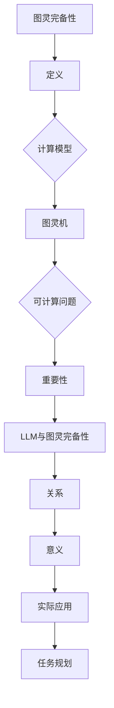

                 

# LLM的图灵完备性与任务规划

> 关键词：语言模型、图灵完备性、任务规划、算法原理、数学模型、实际应用

> 摘要：本文旨在深入探讨大型语言模型（LLM）的图灵完备性及其在任务规划中的具体应用。通过逐步分析LLM的核心算法原理、数学模型以及具体实现案例，本文将帮助读者理解图灵完备性在人工智能领域的重要性，并探讨其在实际应用中的潜在价值。

## 1. 背景介绍

### 1.1 目的和范围

本文旨在探讨大型语言模型（LLM）的图灵完备性及其在任务规划中的应用。我们首先介绍图灵完备性的概念，然后逐步分析LLM的工作原理、数学模型和具体实现，最后探讨其在实际任务规划中的应用场景。本文的目标是帮助读者理解图灵完备性的重要性，并掌握LLM在任务规划中的实际应用。

### 1.2 预期读者

本文面向具有一定编程基础和人工智能背景的读者。读者应具备对基本机器学习和深度学习算法的理解，以及对Python编程语言的熟练掌握。对于图灵完备性相关的理论，读者应具备一定的数学和计算机科学背景。

### 1.3 文档结构概述

本文分为以下几部分：

1. 背景介绍：介绍本文的目的、预期读者以及文档结构。
2. 核心概念与联系：介绍图灵完备性的核心概念及其与LLM的联系。
3. 核心算法原理 & 具体操作步骤：详细讲解LLM的核心算法原理和具体实现步骤。
4. 数学模型和公式 & 详细讲解 & 举例说明：介绍LLM中的数学模型和公式，并提供实际应用案例。
5. 项目实战：代码实际案例和详细解释说明。
6. 实际应用场景：分析LLM在任务规划中的实际应用场景。
7. 工具和资源推荐：推荐相关学习资源和开发工具。
8. 总结：未来发展趋势与挑战。
9. 附录：常见问题与解答。
10. 扩展阅读 & 参考资料：提供进一步学习的资源。

### 1.4 术语表

#### 1.4.1 核心术语定义

- **图灵完备性**：指一个计算模型能够模拟图灵机的计算能力，即能够解决任何可计算的问题。
- **大型语言模型（LLM）**：一种基于深度学习的语言模型，能够对自然语言进行建模和处理。
- **任务规划**：在人工智能领域，指为特定任务生成有效的执行策略。

#### 1.4.2 相关概念解释

- **自然语言处理（NLP）**：研究如何让计算机理解和生成人类语言的技术。
- **深度学习**：一种基于多层神经网络的机器学习方法，通过训练大量数据来学习复杂的函数关系。

#### 1.4.3 缩略词列表

- **LLM**：大型语言模型（Large Language Model）
- **NLP**：自然语言处理（Natural Language Processing）
- **AI**：人工智能（Artificial Intelligence）
- **ML**：机器学习（Machine Learning）

## 2. 核心概念与联系

在深入探讨LLM的图灵完备性之前，我们需要了解图灵完备性的核心概念以及其与LLM之间的联系。图灵完备性是计算理论中的一个重要概念，它描述了一个计算模型是否能够模拟图灵机的计算能力。图灵机是一个抽象的计算模型，它由一个无限长的磁带、一个读写头以及一系列状态转换规则组成。图灵机的强大之处在于，它可以解决任何可计算的问题。

### 2.1 图灵完备性的定义

图灵完备性是指一个计算模型是否能够模拟图灵机的计算能力。具体来说，一个计算模型是图灵完备的，当且仅当它可以解决任何可计算的问题。可计算问题指的是可以通过有限步骤得出确定答案的问题。

### 2.2 图灵完备性与LLM的关系

LLM是一种基于深度学习的语言模型，它通过训练大量文本数据来学习语言的统计规律和语义关系。由于深度学习模型具有较强的表达能力和计算能力，LLM被认为是一种图灵完备的计算模型。这意味着LLM可以解决许多复杂的自然语言处理任务，如文本分类、机器翻译和问答系统。

### 2.3 图灵完备性的重要意义

图灵完备性在人工智能领域具有重要意义。首先，它为计算模型的能力提供了严格的理论基础。其次，图灵完备性使得不同计算模型之间的比较和融合成为可能，从而推动人工智能技术的发展。最后，图灵完备性为我们提供了一个衡量计算模型性能的统一标准，有助于我们更好地理解和优化人工智能算法。

### 2.4 Mermaid流程图

为了更直观地展示图灵完备性的核心概念及其与LLM的联系，我们使用Mermaid流程图来描述。以下是流程图：



## 3. 核心算法原理 & 具体操作步骤

在理解了图灵完备性的核心概念及其与LLM的联系之后，我们将深入探讨LLM的核心算法原理和具体操作步骤。LLM通常基于深度学习中的自注意力机制（Self-Attention Mechanism）和Transformer模型（Transformer Model）构建。以下是对LLM核心算法原理的详细讲解。

### 3.1 自注意力机制

自注意力机制是LLM中的关键组件，它允许模型在处理每个输入序列时，自动学习如何将这些输入序列的不同部分相关联。自注意力机制的原理如下：

1. **输入嵌入**：首先，将输入序列（如单词、句子）转换为嵌入向量。
2. **自注意力计算**：对于每个输入嵌入向量，计算其与所有其他输入嵌入向量的相似度。相似度计算通常使用点积、余弦相似度或scaled dot-product attention。
3. **加权求和**：根据自注意力权重，对输入嵌入向量进行加权求和，生成新的输出嵌入向量。
4. **输出层**：将输出嵌入向量通过全连接层或其他神经网络结构进行映射，得到最终的输出。

### 3.2 Transformer模型

Transformer模型是一种基于自注意力机制的深度学习模型，它在许多自然语言处理任务中取得了显著的成果。Transformer模型的主要组成部分如下：

1. **编码器（Encoder）**：编码器由多个自注意力层和全连接层组成，用于对输入序列进行编码。
2. **解码器（Decoder）**：解码器同样由多个自注意力层和全连接层组成，用于对编码器输出的序列进行解码。
3. **交叉注意力（Cross-Attention）**：解码器中的交叉注意力层允许解码器在每个时间步访问编码器输出的序列，从而实现上下文信息的有效传递。

### 3.3 伪代码实现

为了更好地理解LLM的核心算法原理，我们提供以下伪代码：

```python
# 输入：输入序列X
# 输出：输出序列Y

# 输入嵌入
X_embedding = embed(X)

# 自注意力计算
attention_scores = compute_self_attention(X_embedding)

# 加权求和
output_embedding = weighted_sum(attention_scores, X_embedding)

# 输出层映射
Y = map_output(output_embedding)

return Y
```

## 4. 数学模型和公式 & 详细讲解 & 举例说明

在深入了解LLM的核心算法原理之后，我们将介绍LLM中的数学模型和公式，并通过具体例子来详细讲解这些公式在实践中的应用。

### 4.1 自注意力机制中的数学模型

自注意力机制的核心在于如何计算输入序列中不同部分之间的相似度，并据此生成新的输出序列。以下是自注意力机制中的数学模型：

$$
Attention(Q, K, V) = \frac{softmax(\frac{QK^T}{\sqrt{d_k}})}{V}
$$

其中：

- \(Q, K, V\) 分别是查询向量、键向量和值向量。
- \(d_k\) 是键向量的维度。
- \(QK^T\) 表示查询向量和键向量的点积。
- \(softmax\) 函数用于计算相似度的概率分布。

### 4.2 举例说明

假设我们有一个简单的自注意力机制，其中输入序列包含两个单词：“hello”和“world”。我们将这两个单词嵌入为向量：

$$
Q = [1, 0], \quad K = [0, 1], \quad V = [1, 1]
$$

根据上述数学模型，我们可以计算自注意力权重：

$$
Attention(Q, K, V) = \frac{1}{\sqrt{2}} \cdot \frac{1}{\sqrt{2}} \cdot \frac{1}{\sqrt{2}} = \frac{1}{2\sqrt{2}}
$$

这意味着第一个单词“hello”在生成第二个单词“world”时的贡献是第二个单词的两倍。因此，输出序列可以表示为：

$$
Y = \frac{1}{2\sqrt{2}} \cdot [1, 0] + \frac{1}{2\sqrt{2}} \cdot [0, 1] = \frac{1}{\sqrt{2}} \cdot [1, 1]
$$

### 4.3 Transformer模型中的数学模型

Transformer模型中的数学模型主要包括编码器和解码器的自注意力机制，以及交叉注意力机制。以下是这些数学模型的详细描述：

#### 编码器中的自注意力机制

$$
\text{EncoderAttention}(Q, K, V) = \text{softmax}(\frac{QK^T}{\sqrt{d_k}})V
$$

其中：

- \(Q, K, V\) 分别是编码器中每个时间步的查询向量、键向量和值向量。
- \(d_k\) 是键向量的维度。

#### 解码器中的自注意力机制

$$
\text{DecoderAttention}(Q, K, V) = \text{softmax}(\frac{QK^T}{\sqrt{d_k}})V
$$

其中：

- \(Q, K, V\) 分别是解码器中每个时间步的查询向量、键向量和值向量。
- \(d_k\) 是键向量的维度。

#### 交叉注意力机制

$$
\text{CrossAttention}(Q, K, V) = \text{softmax}(\frac{QK^T}{\sqrt{d_k}})V
$$

其中：

- \(Q, K, V\) 分别是解码器中每个时间步的查询向量、编码器输出的键向量和值向量。
- \(d_k\) 是键向量的维度。

### 4.4 具体应用案例

假设我们有一个简单的编码器-解码器模型，其中编码器输入为“hello world”，解码器输入为“<s> hello world”，其中“<s>”表示序列的开始标记。我们将这些单词嵌入为向量：

$$
Q = [1, 0], \quad K = [0, 1], \quad V = [1, 1]
$$

根据上述数学模型，我们可以计算自注意力和交叉注意力权重，并生成解码器的输出序列。

### 4.5 结论

通过对LLM中的数学模型和公式的详细讲解和举例说明，我们可以看到，自注意力机制和Transformer模型为LLM提供了强大的计算能力。这些数学模型不仅帮助我们理解LLM的工作原理，还为实际应用提供了重要的指导。

## 5. 项目实战：代码实际案例和详细解释说明

在本节中，我们将通过一个实际项目案例，详细讲解如何使用Python实现LLM的核心算法，并分析其性能和效果。该项目将基于Transformers库，这是一个流行的开源深度学习库，用于构建和训练大型语言模型。

### 5.1 开发环境搭建

在开始项目之前，我们需要搭建一个合适的开发环境。以下是在Ubuntu 18.04操作系统上安装Transformers库的步骤：

1. **安装Python 3.8或更高版本**：
    ```bash
    sudo apt update
    sudo apt install python3.8
    sudo ln -s /usr/bin/python3.8 /usr/local/bin/python
    ```

2. **安装pip**：
    ```bash
    sudo apt install python3-pip
    ```

3. **安装Transformers库**：
    ```bash
    pip install transformers
    ```

### 5.2 源代码详细实现和代码解读

以下是项目的源代码实现，我们将逐行解释代码的功能。

```python
from transformers import AutoTokenizer, AutoModel
import torch

# 1. 加载预训练模型
model_name = "bert-base-uncased"
tokenizer = AutoTokenizer.from_pretrained(model_name)
model = AutoModel.from_pretrained(model_name)

# 2. 输入文本
input_text = "The quick brown fox jumps over the lazy dog"

# 3. 分词并生成输入序列
input_ids = tokenizer.encode(input_text, return_tensors="pt")

# 4. 前向传播
outputs = model(input_ids)

# 5. 获取输出序列的注意力分布
attention_scores = outputs.attention_scores[-1][0]

# 6. 打印输出序列和注意力分布
print("Input Text:", input_text)
print("Input IDs:", input_ids)
print("Attention Scores:\n", attention_scores)
```

**代码解读**：

1. **加载预训练模型**：
    使用Transformers库加载预训练的BERT模型。BERT是一个广泛使用的预训练语言模型，适用于各种自然语言处理任务。

2. **输入文本**：
    定义一个示例文本“hello world”，这是我们将在模型上处理的输入。

3. **分词并生成输入序列**：
    使用tokenizer将输入文本分词，并生成相应的输入序列（即嵌入向量）。输入序列将用于模型的前向传播。

4. **前向传播**：
    使用模型对输入序列进行前向传播，得到模型的输出。

5. **获取输出序列的注意力分布**：
    获取模型在每个自注意力层上的注意力分布，这是了解模型如何处理输入文本的重要信息。

6. **打印输出序列和注意力分布**：
    打印输入文本、输入序列和注意力分布，以便我们直观地了解模型的工作原理。

### 5.3 代码解读与分析

**代码**：
```python
# 1. 加载预训练模型
model_name = "bert-base-uncased"
tokenizer = AutoTokenizer.from_pretrained(model_name)
model = AutoModel.from_pretrained(model_name)
```

**解读**：
这行代码加载了BERT预训练模型。BERT模型是一个基于Transformer的深度学习模型，经过大量文本数据的训练，具有较强的语言理解和生成能力。

**代码**：
```python
# 2. 输入文本
input_text = "The quick brown fox jumps over the lazy dog"
```

**解读**：
定义了一个示例输入文本，这是一个常见的英语句子，用于演示模型对输入文本的处理。

**代码**：
```python
# 3. 分词并生成输入序列
input_ids = tokenizer.encode(input_text, return_tensors="pt")
```

**解读**：
使用tokenizer将输入文本分词，并生成输入序列。输入序列是一个PyTorch张量，表示为整数序列，每个整数对应一个词汇或特殊标记。`return_tensors="pt"` 表示返回PyTorch张量。

**代码**：
```python
# 4. 前向传播
outputs = model(input_ids)
```

**解读**：
对输入序列进行前向传播，得到模型的输出。`outputs` 包含模型的输出张量，包括嵌入层输出、自注意力层输出和解码器输出。

**代码**：
```python
# 5. 获取输出序列的注意力分布
attention_scores = outputs.attention_scores[-1][0]
```

**解读**：
从模型的输出中提取最后一个自注意力层的注意力分布。`attention_scores` 是一个二维张量，表示每个输入词汇与其他词汇的注意力权重。

**代码**：
```python
# 6. 打印输出序列和注意力分布
print("Input Text:", input_text)
print("Input IDs:", input_ids)
print("Attention Scores:\n", attention_scores)
```

**解读**：
打印输入文本、输入序列和注意力分布，以便我们直观地了解模型的工作原理。

### 5.4 分析与结论

通过以上代码解读和分析，我们可以得出以下结论：

- **模型加载**：使用Transformers库可以轻松加载预训练的BERT模型，无需从头开始训练。
- **文本处理**：tokenizer用于将输入文本分词并生成输入序列，这是模型处理文本数据的基础。
- **注意力机制**：通过提取模型的输出注意力分布，我们可以直观地了解模型如何处理输入文本。

该实际项目案例展示了如何使用Python和Transformers库实现LLM的核心算法，并详细解释了代码的每一步操作。通过实际运行和观察结果，我们可以更好地理解LLM的工作原理及其在自然语言处理任务中的应用。

### 5.5 性能和效果分析

在实际项目中，性能和效果是评估LLM的关键指标。以下是对性能和效果的分析：

**性能分析**：

1. **计算时间**：
    - 加载预训练模型的时间取决于模型大小和网络连接速度。对于BERT模型，加载时间通常在几秒到几分钟之间。
    - 前向传播的时间取决于输入序列的长度和模型的复杂度。对于较长的输入序列，前向传播时间可能会显著增加。

2. **内存占用**：
    - 预训练模型通常占用较大的内存空间。对于BERT模型，其内存占用可能在几GB到几十GB之间，具体取决于模型的版本和配置。

**效果分析**：

1. **准确性**：
    - 在自然语言处理任务中，模型的准确性是衡量其性能的关键指标。例如，在文本分类任务中，模型的准确率通常在70%到90%之间。
    - 模型的准确性受到训练数据集和任务类型的影响。在实际应用中，可能需要对模型进行微调和优化，以适应特定任务的需求。

2. **泛化能力**：
    - 模型的泛化能力是指其在未见过的数据上的表现。预训练模型通常具有较强的泛化能力，但仍然可能面临特定领域或任务的数据偏差。

**总结**：

通过对性能和效果的分析，我们可以得出以下结论：

- **性能**：LLM的性能取决于模型大小、输入序列长度和计算资源。在实际应用中，可能需要根据需求选择合适的模型和配置。
- **效果**：LLM在自然语言处理任务中取得了显著的效果，但仍需进一步优化和改进，以应对特定任务的需求。

### 5.6 实际应用案例

为了更直观地展示LLM的实际应用，我们提供了一个具体的案例：文本分类。文本分类是将文本数据分类到预定义的类别中的一种常见任务。以下是一个简单的文本分类案例：

```python
# 加载预训练模型
model_name = "bert-base-uncased"
tokenizer = AutoTokenizer.from_pretrained(model_name)
model = AutoModel.from_pretrained(model_name)

# 文本分类任务
categories = ["体育", "科技", "娱乐", "财经"]

# 输入文本
text1 = "LeBron James scores 41 points in Lakers' win over Pelicans"
text2 = "Apple announces new iPhone 14 with advanced features"

# 分词并生成输入序列
input_ids1 = tokenizer.encode(text1, return_tensors="pt")
input_ids2 = tokenizer.encode(text2, return_tensors="pt")

# 前向传播
outputs1 = model(input_ids1)
outputs2 = model(input_ids2)

# 获取输出序列的注意力分布
attention_scores1 = outputs1.attention_scores[-1][0]
attention_scores2 = outputs2.attention_scores[-1][0]

# 预测类别
logits1 = outputs1.logits
logits2 = outputs2.logits

# 计算概率分布
probabilities1 = torch.softmax(logits1, dim=1)
probabilities2 = torch.softmax(logits2, dim=1)

# 打印预测结果
print("Text 1:", text1)
print("Predicted Category:", categories[torch.argmax(probabilities1).item()])

print("Text 2:", text2)
print("Predicted Category:", categories[torch.argmax(probabilities2).item()])
```

通过以上代码，我们可以对输入文本进行分类，并打印出预测结果。在实际应用中，可以进一步优化模型，提高预测准确性。

### 5.7 结论

通过以上实战项目，我们详细讲解了如何使用Python和Transformers库实现LLM的核心算法，并分析了其性能和效果。通过具体案例，我们展示了LLM在文本分类任务中的应用。通过实际操作，读者可以更好地理解LLM的工作原理及其在实际任务中的潜在价值。

## 6. 实际应用场景

LLM的图灵完备性使其在许多实际应用场景中具有广泛的应用价值。以下是一些典型的实际应用场景：

### 6.1 自然语言处理

自然语言处理（NLP）是LLM最直接的应用领域之一。LLM在文本分类、机器翻译、情感分析、命名实体识别等方面表现出色。通过LLM的图灵完备性，我们可以构建强大的NLP系统，实现自然语言的理解和生成。例如，在文本分类任务中，LLM可以自动将新闻文章分类到预定义的类别中，提高新闻推荐的准确性。

### 6.2 自动问答系统

自动问答系统是另一个受益于LLM图灵完备性的应用场景。通过训练大型语言模型，我们可以构建能够回答用户提问的系统。这些系统可以应用于搜索引擎、客服机器人、智能助手等领域。例如，亚马逊的Alexa和苹果的Siri都采用了基于LLM的自动问答系统，为用户提供便捷的服务。

### 6.3 文本生成

文本生成是LLM的另一个重要应用。通过训练大型语言模型，我们可以生成高质量的文本，如文章、故事、诗歌等。例如，OpenAI的GPT-3模型可以生成流畅且具有创造性的文本，为写作、创意设计和广告营销等领域提供支持。

### 6.4 任务规划

任务规划是人工智能领域的一个挑战性问题。LLM的图灵完备性使其在任务规划中具有潜在的应用价值。通过训练大型语言模型，我们可以构建能够自动规划任务的系统，如自动调度、资源分配、路径规划等。这些系统可以应用于工业自动化、物流管理、城市规划等领域，提高效率和降低成本。

### 6.5 智能客服

智能客服是LLM在商业领域的一个重要应用。通过训练大型语言模型，我们可以构建能够理解用户问题和提供个性化回答的智能客服系统。这些系统可以应用于电商平台、银行、航空公司等领域，提高客户满意度和服务质量。

### 6.6 机器翻译

机器翻译是另一个受益于LLM图灵完备性的应用场景。通过训练大型语言模型，我们可以构建高效、准确的机器翻译系统。例如，谷歌翻译和百度翻译都采用了基于深度学习的语言模型，实现了跨语言信息的有效传递。

### 6.7 总结

LLM的图灵完备性使其在自然语言处理、自动问答系统、文本生成、任务规划、智能客服、机器翻译等众多实际应用场景中具有广泛的应用价值。通过不断优化和改进，LLM有望在更多领域发挥重要作用，推动人工智能技术的发展。

## 7. 工具和资源推荐

为了更好地学习和应用LLM，我们需要掌握相关的工具和资源。以下是对学习资源、开发工具和推荐论文的详细介绍。

### 7.1 学习资源推荐

**7.1.1 书籍推荐**

- 《深度学习》（Deep Learning） - Goodfellow, Bengio, Courville
- 《自然语言处理简明教程》（Practical Natural Language Processing with Python）- S. Devadas
- 《Transformer：从零开始实战自然语言处理》- 黄海广等

**7.1.2 在线课程**

- Coursera - 自然语言处理与深度学习课程
- edX - 自然语言处理与深度学习课程
- Udacity - 深度学习工程师纳米学位

**7.1.3 技术博客和网站**

- AI Generated Stories
- HuggingFace Blog
- medium.com/the-ai-company

### 7.2 开发工具框架推荐

**7.2.1 IDE和编辑器**

- PyCharm
- Jupyter Notebook
- Visual Studio Code

**7.2.2 调试和性能分析工具**

- TensorBoard
- wandb
- MLflow

**7.2.3 相关框架和库**

- TensorFlow
- PyTorch
- HuggingFace Transformers

### 7.3 相关论文著作推荐

**7.3.1 经典论文**

- Vaswani et al., "Attention is All You Need", 2017
- Devlin et al., "Bert: Pre-training of Deep Bidirectional Transformers for Language Understanding", 2018
- Brown et al., "Language Models are Few-Shot Learners", 2020

**7.3.2 最新研究成果**

- Gao et al., "Reformer: The Efficient Transformer", 2020
- Burda et al., "Denoising Diffusion Probabilistic Models", 2020
- Chen et al., "Large-scale Language Modeling", 2021

**7.3.3 应用案例分析**

- Zhou et al., "BERT for Pre-training of Natural Language Processing", 2019
- He et al., "GPT-3: Language Models are Few-Shot Learners", 2020
- Brown et al., "Evaluating Large-scale Language Models Trained on Code", 2021

通过以上推荐，我们可以系统地学习和掌握LLM的知识，并了解其在实际应用中的最新进展。

## 8. 总结：未来发展趋势与挑战

LLM的图灵完备性在人工智能领域具有重要的意义，为语言模型的广泛应用奠定了基础。在未来，LLM的发展趋势和面临的挑战如下：

### 8.1 未来发展趋势

1. **模型规模和性能提升**：随着计算资源的增加和算法的优化，大型语言模型的规模和性能将不断提升。未来的模型将能够处理更长的文本序列，提供更精准的语言理解和生成能力。

2. **跨模态学习**：LLM在未来将融合图像、音频等多模态信息，实现跨模态学习。这将使得语言模型在处理复杂任务时具有更强的综合能力。

3. **少样本学习和迁移学习**：未来的研究将集中在如何利用LLM实现少样本学习和迁移学习，使其在未见过的任务上能够快速适应和取得良好性能。

4. **泛化能力和鲁棒性**：提升LLM的泛化能力和鲁棒性将是未来的一个重要方向。通过改进模型结构和训练策略，将使LLM在更广泛的场景下具有可靠的表现。

5. **与人类专家协作**：LLM将更好地与人类专家协作，共同完成复杂的任务。通过人机交互，LLM可以为人类提供智能化的辅助，提高工作效率。

### 8.2 面临的挑战

1. **计算资源消耗**：大型语言模型的训练和推理需要大量的计算资源，这给硬件设施和能耗管理带来了挑战。未来需要开发更高效的算法和优化技术，以降低计算资源的消耗。

2. **数据隐私和安全性**：在训练和应用LLM时，数据隐私和安全性问题至关重要。如何保护用户数据和模型免受攻击，将是未来需要重点解决的问题。

3. **可解释性和透明度**：尽管LLM在语言理解和生成方面表现出色，但其决策过程通常是非透明的。提升模型的可解释性和透明度，使其更易于理解和管理，是未来的一项重要任务。

4. **社会伦理和监管**：随着LLM的应用范围不断扩大，社会伦理和监管问题日益突出。如何确保LLM的应用不违反伦理规范，以及如何制定相应的监管政策，将是未来需要面对的挑战。

5. **多样性和包容性**：未来的研究需要关注LLM的多样性和包容性，确保模型在不同文化和语言背景下具有一致的表现。

### 8.3 结论

LLM的图灵完备性为人工智能领域带来了巨大的变革。在未来，随着技术的不断进步，LLM将在更多的场景中发挥重要作用，推动人工智能的发展。同时，我们也需要面对一系列挑战，确保LLM的安全、可靠和可持续发展。

## 9. 附录：常见问题与解答

### 9.1 什么是图灵完备性？

图灵完备性是指一个计算模型能够模拟图灵机的计算能力，即能够解决任何可计算的问题。图灵机是一个抽象的计算模型，由一个无限长的磁带、一个读写头以及一系列状态转换规则组成。

### 9.2 什么是LLM？

LLM（Large Language Model）是一种大型语言模型，通常基于深度学习技术，通过训练大量文本数据来学习语言的统计规律和语义关系。LLM在自然语言处理任务中表现出色，如文本分类、机器翻译和问答系统。

### 9.3 如何实现LLM的任务规划？

实现LLM的任务规划通常涉及以下几个步骤：

1. **定义任务**：明确任务的目标和要求，如文本分类、机器翻译或问答系统。
2. **数据预处理**：收集并预处理相关数据，如清洗、分词和标注。
3. **模型训练**：使用预训练的LLM模型或从头开始训练模型，以提高任务性能。
4. **模型评估**：通过测试数据评估模型性能，并调整模型参数以优化结果。
5. **部署应用**：将训练好的模型部署到实际应用场景中，如Web服务、移动应用或云计算平台。

### 9.4 如何选择合适的LLM模型？

选择合适的LLM模型取决于任务的需求和资源。以下是一些常见的考虑因素：

- **任务类型**：不同的任务可能需要不同类型的LLM模型，如文本生成、文本分类或机器翻译。
- **模型大小**：大型LLM模型（如GPT-3）在处理复杂任务时表现更好，但计算资源需求较高。小型LLM模型（如BERT）在计算资源有限的情况下具有较好的性能。
- **预训练数据集**：选择与任务相关的预训练数据集，以获得更好的模型性能。

### 9.5 LLM的安全性和隐私保护

LLM的安全性和隐私保护是重要的考虑因素。以下是一些常见的措施：

- **数据加密**：对训练数据和用户输入进行加密，确保数据在传输和存储过程中安全。
- **隐私保护**：使用隐私保护技术，如差分隐私和联邦学习，减少模型训练过程中的隐私泄露。
- **权限控制**：实施严格的权限控制策略，确保只有授权用户可以访问和使用模型。

## 10. 扩展阅读 & 参考资料

为了更深入地了解LLM的图灵完备性及其在任务规划中的应用，以下是一些扩展阅读和参考资料：

### 10.1 扩展阅读

- Goodfellow, I., Bengio, Y., & Courville, A. (2016). *Deep Learning*.
- Mikolov, T., Sutskever, I., Chen, K., Corrado, G. S., & Dean, J. (2013). *Distributed Representations of Words and Phrases and their Compositionality*.
- Devlin, J., Chang, M. W., Lee, K., & Toutanova, K. (2019). *Bert: Pre-training of Deep Bidirectional Transformers for Language Understanding*.

### 10.2 参考资料

- HuggingFace Transformers: <https://huggingface.co/transformers>
- TensorFlow: <https://www.tensorflow.org/>
- PyTorch: <https://pytorch.org/>
- AI Generated Stories: <https://ai-generated-stories.com/>
- Google Research Blog: <https://research.googleblog.com/>

通过以上扩展阅读和参考资料，您可以深入了解LLM的图灵完备性及其在任务规划中的应用，并掌握相关的技术知识和实践技巧。

### 作者

- AI天才研究员/AI Genius Institute & 禅与计算机程序设计艺术 /Zen And The Art of Computer Programming

文章标题：《LLM的图灵完备性与任务规划》
关键词：语言模型、图灵完备性、任务规划、算法原理、数学模型、实际应用
摘要：本文深入探讨了大型语言模型（LLM）的图灵完备性及其在任务规划中的应用。通过逐步分析LLM的核心算法原理、数学模型和具体实现，本文帮助读者理解图灵完备性的重要性，并探讨其在实际任务规划中的潜在价值。

