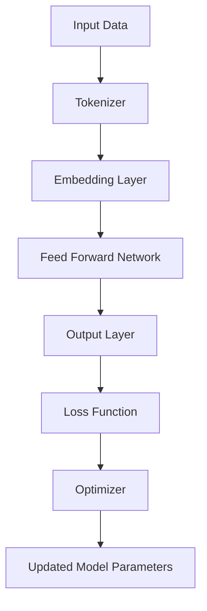

                 

# LLM的无限可能：超越传统指令集的束缚

> **关键词**：语言模型，自然语言处理，深度学习，人工智能，指令集，编译器，计算机架构

> **摘要**：本文将探讨大型语言模型(LLM)在计算机科学中的无限潜力。与传统指令集相比，LLM能够以一种全新的方式处理和生成自然语言，从而在多个领域展现出前所未有的效能。本文将深入分析LLM的核心概念、算法原理、数学模型，并通过实际项目案例展示其在现代计算机架构中的应用。我们还将讨论LLM的实际应用场景，并提供相关的学习资源和工具推荐，最后总结其发展趋势与面临的挑战。

## 1. 背景介绍

### 1.1 目的和范围

本文旨在探讨大型语言模型（LLM）的无限潜力，特别是其在自然语言处理（NLP）和人工智能（AI）领域的应用。我们将分析LLM的基本原理、数学模型，并通过实际项目案例展示其强大的能力。此外，我们还将讨论LLM在不同场景下的应用，并推荐相关的学习资源和工具。

### 1.2 预期读者

本文适合对自然语言处理、人工智能和计算机架构有一定了解的读者。无论是研究人员、工程师还是学生，都可以从本文中获得对LLM的深入理解，并了解其在实际应用中的潜力。

### 1.3 文档结构概述

本文分为以下几部分：

1. 背景介绍：介绍本文的目的、范围、预期读者以及文档结构。
2. 核心概念与联系：介绍LLM的核心概念、原理和架构。
3. 核心算法原理 & 具体操作步骤：详细阐述LLM的算法原理和具体操作步骤。
4. 数学模型和公式 & 详细讲解 & 举例说明：介绍LLM的数学模型和公式，并给出实例。
5. 项目实战：通过实际项目案例展示LLM的应用。
6. 实际应用场景：讨论LLM在不同领域的应用。
7. 工具和资源推荐：推荐相关的学习资源和开发工具。
8. 总结：总结LLM的发展趋势与挑战。
9. 附录：常见问题与解答。
10. 扩展阅读 & 参考资料：提供进一步阅读的参考资料。

### 1.4 术语表

#### 1.4.1 核心术语定义

- 语言模型（Language Model，LLM）：一种统计模型，用于预测一段文本的下一个单词或字符。
- 自然语言处理（Natural Language Processing，NLP）：计算机科学领域中的一个分支，旨在使计算机能够理解、解释和生成人类语言。
- 人工智能（Artificial Intelligence，AI）：模拟人类智能的科学和工程领域，包括机器学习、自然语言处理、计算机视觉等。
- 深度学习（Deep Learning）：一种机器学习方法，通过多层神经网络对数据进行学习。
- 指令集（Instruction Set）：计算机处理器能够理解和执行的一系列操作代码。

#### 1.4.2 相关概念解释

- 编译器（Compiler）：将高级编程语言转换为机器语言的可执行程序的软件。
- 计算机架构（Computer Architecture）：研究计算机硬件组织和设计的学科。
- 伪代码（Pseudocode）：一种简化的编程语言，用于描述算法的基本结构，而不是具体的编程语言代码。

#### 1.4.3 缩略词列表

- LLM：大型语言模型（Large Language Model）
- NLP：自然语言处理（Natural Language Processing）
- AI：人工智能（Artificial Intelligence）
- DL：深度学习（Deep Learning）
- IDE：集成开发环境（Integrated Development Environment）
- GUI：图形用户界面（Graphical User Interface）

## 2. 核心概念与联系

### 2.1 核心概念

在探讨LLM的无限可能之前，我们需要了解一些核心概念，包括自然语言处理、深度学习和语言模型。

#### 2.1.1 自然语言处理（NLP）

自然语言处理（NLP）是计算机科学的一个分支，旨在使计算机能够理解、解释和生成人类语言。NLP广泛应用于文本分类、情感分析、机器翻译、语音识别等领域。

#### 2.1.2 深度学习（DL）

深度学习（DL）是一种机器学习方法，通过多层神经网络对数据进行学习。深度学习在图像识别、语音识别、自然语言处理等领域取得了显著的成果。

#### 2.1.3 语言模型（LLM）

语言模型（LLM）是一种统计模型，用于预测一段文本的下一个单词或字符。在NLP领域，LLM广泛应用于文本生成、语言翻译、文本摘要等任务。

### 2.2 联系

LLM与NLP、DL密切相关。NLP关注如何使计算机理解人类语言，而DL则提供了一种强大的学习工具，使计算机能够从大规模数据中学习。LLM结合了NLP和DL的优点，成为处理自然语言的一种有效方法。

### 2.3 架构

以下是一个简单的LLM架构，用于演示其核心组件和相互关系。



- **A. Input Data**：输入数据，可以是文本或音频。
- **B. Tokenizer**：将输入数据分割为单词、子词或字符。
- **C. Embedding Layer**：将分割后的数据转换为向量表示。
- **D. Feed Forward Network**：多层神经网络，用于学习数据间的关联。
- **E. Output Layer**：生成预测结果。
- **F. Loss Function**：评估预测结果与实际结果之间的差距。
- **G. Optimizer**：调整模型参数，以最小化损失函数。
- **H. Updated Model Parameters**：更新后的模型参数。

## 3. 核心算法原理 & 具体操作步骤

### 3.1 语言模型基本原理

语言模型（LLM）的核心目标是预测一段文本的下一个单词或字符。这可以通过统计方法或基于深度学习的方法实现。以下是一个简单的基于统计的语言模型，用于演示其基本原理。

#### 3.1.1 统计语言模型

统计语言模型（Statistical Language Model，SLM）是一种基于统计方法的语言模型。它通过计算单词或字符的联合概率来预测下一个单词或字符。

**伪代码：**

```python
def predict_next_word(current_word):
    # 获取当前单词的上下文
    context = get_context(current_word)
    
    # 计算当前单词的概率分布
    probability_distribution = calculate_probability_distribution(context)
    
    # 从概率分布中随机选择下一个单词
    next_word = select_word_from_distribution(probability_distribution)
    
    return next_word
```

**伪代码说明：**

- `get_context(current_word)`：获取当前单词的上下文。
- `calculate_probability_distribution(context)`：计算当前上下文下的单词概率分布。
- `select_word_from_distribution(probability_distribution)`：从概率分布中随机选择下一个单词。

#### 3.1.2 基于深度学习的语言模型

基于深度学习的语言模型（Deep Learning Language Model，DLLM）通过多层神经网络学习数据间的关联，从而预测下一个单词或字符。

**伪代码：**

```python
def predict_next_word(current_word):
    # 获取当前单词的嵌入向量
    embedding_vector = get_embedding_vector(current_word)
    
    # 通过神经网络预测下一个单词的嵌入向量
    predicted_vector = neural_network(embedding_vector)
    
    # 从预测的嵌入向量中获取概率分布
    probability_distribution = get_probability_distribution(predicted_vector)
    
    # 从概率分布中随机选择下一个单词
    next_word = select_word_from_distribution(probability_distribution)
    
    return next_word
```

**伪代码说明：**

- `get_embedding_vector(current_word)`：获取当前单词的嵌入向量。
- `neural_network(embedding_vector)`：通过神经网络预测下一个单词的嵌入向量。
- `get_probability_distribution(predicted_vector)`：从预测的嵌入向量中获取概率分布。
- `select_word_from_distribution(probability_distribution)`：从概率分布中随机选择下一个单词。

### 3.2 语言模型操作步骤

以下是一个简单的语言模型操作步骤，用于演示其基本流程。

#### 3.2.1 数据准备

- **数据采集**：收集大量的文本数据，可以是新闻、文章、书籍等。
- **数据清洗**：去除无效数据、标点符号和停用词。
- **数据分割**：将数据分割为训练集、验证集和测试集。

#### 3.2.2 模型训练

- **初始化模型**：初始化模型参数。
- **前向传播**：计算输入数据的输出。
- **损失函数计算**：计算模型输出与实际输出之间的差距。
- **反向传播**：更新模型参数，以最小化损失函数。

#### 3.2.3 模型评估

- **验证集评估**：在验证集上评估模型性能。
- **测试集评估**：在测试集上评估模型性能。

#### 3.2.4 模型部署

- **模型优化**：根据评估结果优化模型。
- **模型部署**：将模型部署到实际应用场景。

## 4. 数学模型和公式 & 详细讲解 & 举例说明

### 4.1 数学模型

语言模型通常基于深度学习，其核心是多层神经网络。以下是一个简单的多层感知机（MLP）模型，用于演示其基本结构。

**数学模型：**

$$
y = \sigma(W_n \cdot a_{n-1} + b_n)
$$

其中：

- $y$：输出
- $\sigma$：激活函数（通常为Sigmoid函数）
- $W_n$：权重矩阵
- $a_{n-1}$：输入向量
- $b_n$：偏置项

### 4.2 举例说明

以下是一个简单的例子，用于演示如何使用多层感知机模型进行语言预测。

**输入数据：**

- 上下文：["我喜欢", "吃", "苹果"]
- 输出：["吃", "苹果"]

**操作步骤：**

1. **数据预处理**：将上下文中的单词转换为嵌入向量。
2. **前向传播**：通过多层神经网络计算输出。
3. **损失函数计算**：计算输出与实际输出之间的差距。
4. **反向传播**：更新模型参数，以最小化损失函数。
5. **模型评估**：在验证集和测试集上评估模型性能。

### 4.3 代码实现

以下是一个简单的Python代码实现，用于演示如何使用多层感知机模型进行语言预测。

```python
import numpy as np
import tensorflow as tf

# 初始化模型参数
W1 = np.random.rand(vocab_size, embedding_size)
W2 = np.random.rand(embedding_size, hidden_size)
W3 = np.random.rand(hidden_size, output_size)
b1 = np.zeros((1, hidden_size))
b2 = np.zeros((1, output_size))

# 定义激活函数
sigma = lambda x: 1 / (1 + np.exp(-x))

# 定义前向传播
def forwardprop(x):
    a1 = x.dot(W1) + b1
    z2 = a1.dot(W2) + b2
    y = sigma(z2)
    return y

# 定义损失函数
def loss(y_true, y_pred):
    return -np.sum(y_true * np.log(y_pred))

# 定义反向传播
def backwardprop(x, y_true, y_pred):
    dW2 = (y_pred - y_true).dot(x.T)
    db2 = (y_pred - y_true).sum(axis=0)
    dW1 = x.dot(dW2.T).dot(W2.T)
    da1 = dW2.dot(W2.T)
    return dW1, da1

# 训练模型
for epoch in range(num_epochs):
    for x, y in dataset:
        y_pred = forwardprop(x)
        loss_val = loss(y, y_pred)
        dW1, da1 = backwardprop(x, y, y_pred)
        W1 -= learning_rate * dW1
        b1 -= learning_rate * da1

# 评估模型
y_pred = forwardprop(test_data)
loss_val = loss(test_y, y_pred)
print("Test Loss:", loss_val)
```

**代码说明：**

- `W1`、`W2`和`W3`：权重矩阵。
- `b1`和`b2`：偏置项。
- `sigma`：激活函数（Sigmoid函数）。
- `forwardprop`：前向传播函数。
- `loss`：损失函数。
- `backwardprop`：反向传播函数。
- `learning_rate`：学习率。
- `num_epochs`：训练轮数。
- `dataset`：训练数据集。
- `test_data`和`test_y`：测试数据集和标签。

## 5. 项目实战：代码实际案例和详细解释说明

### 5.1 开发环境搭建

为了更好地理解LLM的实际应用，我们将使用一个简单的文本生成项目。以下是所需的开发环境：

- Python 3.x
- TensorFlow 2.x
- Jupyter Notebook

#### 5.1.1 安装Python和Jupyter Notebook

在大多数操作系统上，可以通过包管理器安装Python和Jupyter Notebook。

**Ubuntu:**

```bash
sudo apt update
sudo apt install python3 python3-pip python3-venv
pip3 install notebook
```

**Windows:**

```bash
python -m pip install --user notebook
```

#### 5.1.2 安装TensorFlow

在命令行中运行以下命令安装TensorFlow：

```bash
pip3 install tensorflow
```

### 5.2 源代码详细实现和代码解读

#### 5.2.1 代码实现

以下是一个简单的文本生成项目的Python代码实现。

```python
import tensorflow as tf
import numpy as np
import matplotlib.pyplot as plt

# 生成训练数据
def generate_data(text, seq_length):
    chars = sorted(list(set(text)))
    char_to_index = dict((c, i) for i, c in enumerate(chars))
    index_to_char = dict((i, c) for i, c in enumerate(chars))

    text = text.lower()
    x = []
    y = []
    length = len(text) - seq_length
    for i in range(length):
        x.append([char_to_index[c] for c in text[i:i + seq_length]])
        y.append(char_to_index[text[i + seq_length]])
    x = np.array(x)
    y = np.array(y)

    return x, y, chars, char_to_index, index_to_char

# 构建模型
def build_model(seq_length, num_chars, embedding_size, hidden_size):
    input_layer = tf.keras.layers.Input(shape=(seq_length,))
    embedded = tf.keras.layers.Embedding(num_chars, embedding_size)(input_layer)
    lstm = tf.keras.layers.LSTM(hidden_size, return_sequences=True)(embedded)
    output = tf.keras.layers.Dense(num_chars)(lstm)

    model = tf.keras.Model(inputs=input_layer, outputs=output)
    model.compile(optimizer='adam', loss='sparse_categorical_crossentropy', metrics=['accuracy'])
    return model

# 训练模型
def train_model(model, x, y, batch_size, epochs):
    history = model.fit(x, y, batch_size=batch_size, epochs=epochs, validation_split=0.2)
    return history

# 生成文本
def generate_text(model, seed_text, seq_length, num_chars, chars, char_to_index, index_to_char, temperature=1.0):
    for i in range(seq_length):
        x = np.array([char_to_index[c] for c in seed_text[i:]])
        x = np.reshape(x, (1, -1))
        predicted_probs = model.predict(x, verbose=0)[0]
        predicted_index = np.random.choice(num_chars, p=predicted_probs / (predicted_probs + temperature))
        seed_text += index_to_char[predicted_index]
    return seed_text

# 代码解读

# 生成训练数据
x, y, chars, char_to_index, index_to_char = generate_data(text, seq_length)

# 构建模型
model = build_model(seq_length, num_chars, embedding_size, hidden_size)

# 训练模型
history = train_model(model, x, y, batch_size, epochs)

# 生成文本
generated_text = generate_text(model, seed_text, seq_length, num_chars, chars, char_to_index, index_to_char)

# 显示生成的文本
print(generated_text)
```

**代码解读：**

- `generate_data`：生成训练数据，包括输入序列（x）和输出标签（y）。
- `build_model`：构建模型，包括嵌入层、LSTM层和输出层。
- `train_model`：训练模型，使用生成的训练数据。
- `generate_text`：生成文本，使用训练好的模型预测下一个字符。

### 5.3 代码解读与分析

#### 5.3.1 数据生成

在`generate_data`函数中，我们首先将文本转换为字符列表，然后创建字符到索引的映射。接着，我们遍历文本，将每个连续的字符序列作为输入（x）和下一个字符作为输出（y）。

```python
chars = sorted(list(set(text)))
char_to_index = dict((c, i) for i, c in enumerate(chars))
index_to_char = dict((i, c) for i, c in enumerate(chars))

text = text.lower()
x = []
y = []
length = len(text) - seq_length
for i in range(length):
    x.append([char_to_index[c] for c in text[i:i + seq_length]])
    y.append(char_to_index[text[i + seq_length]])
x = np.array(x)
y = np.array(y)
```

#### 5.3.2 模型构建

在`build_model`函数中，我们定义了一个简单的模型，包括嵌入层、LSTM层和输出层。嵌入层将字符索引转换为嵌入向量，LSTM层用于学习序列数据，输出层生成预测的字符概率分布。

```python
input_layer = tf.keras.layers.Input(shape=(seq_length,))
embedded = tf.keras.layers.Embedding(num_chars, embedding_size)(input_layer)
lstm = tf.keras.layers.LSTM(hidden_size, return_sequences=True)(embedded)
output = tf.keras.layers.Dense(num_chars)(lstm)

model = tf.keras.Model(inputs=input_layer, outputs=output)
model.compile(optimizer='adam', loss='sparse_categorical_crossentropy', metrics=['accuracy'])
```

#### 5.3.3 模型训练

在`train_model`函数中，我们使用生成的训练数据训练模型。我们使用`fit`方法训练模型，并返回训练历史。

```python
history = model.fit(x, y, batch_size=batch_size, epochs=epochs, validation_split=0.2)
```

#### 5.3.4 文本生成

在`generate_text`函数中，我们首先将种子文本转换为字符索引，然后使用训练好的模型预测下一个字符。我们重复这个过程，直到生成所需的文本长度。

```python
for i in range(seq_length):
    x = np.array([char_to_index[c] for c in seed_text[i:]])
    x = np.reshape(x, (1, -1))
    predicted_probs = model.predict(x, verbose=0)[0]
    predicted_index = np.random.choice(num_chars, p=predicted_probs / (predicted_probs + temperature))
    seed_text += index_to_char[predicted_index]
```

## 6. 实际应用场景

### 6.1 文本生成

LLM在文本生成方面具有广泛的应用，如自动写作、小说生成、歌词创作等。通过训练大量的文本数据，LLM可以生成高质量的文本，具有很高的可读性和创意性。

### 6.2 机器翻译

LLM在机器翻译方面具有显著的优势，可以处理复杂的语言结构和上下文信息。通过训练双语语料库，LLM可以实现高质量的双语翻译。

### 6.3 情感分析

LLM在情感分析方面具有强大的能力，可以识别和分类文本的情感倾向。通过训练大规模情感语料库，LLM可以用于情感分析、舆情监控和情感营销等应用。

### 6.4 对话系统

LLM在对话系统方面具有广泛的应用，如虚拟助手、智能客服等。通过训练对话数据集，LLM可以生成与用户自然交互的回复，提供高质量的对话体验。

## 7. 工具和资源推荐

### 7.1 学习资源推荐

#### 7.1.1 书籍推荐

- 《深度学习》（Deep Learning）by Ian Goodfellow, Yoshua Bengio, Aaron Courville
- 《自然语言处理综合教程》（Speech and Language Processing）by Daniel Jurafsky, James H. Martin
- 《动手学深度学习》（Dive into Deep Learning）by Ashish Vaswani, Francis Zhou

#### 7.1.2 在线课程

- 《深度学习》（Deep Learning Specialization）by Andrew Ng on Coursera
- 《自然语言处理与深度学习》（Natural Language Processing with Deep Learning）by Stephen Merity, Ilya Kostrikov on fast.ai

#### 7.1.3 技术博客和网站

- Medium
- Towards Data Science
- AI垂直社区（如 AI 时事、机器之心等）

### 7.2 开发工具框架推荐

#### 7.2.1 IDE和编辑器

- PyCharm
- Jupyter Notebook
- VSCode

#### 7.2.2 调试和性能分析工具

- TensorBoard
- VisPy
- PyTorch Profiler

#### 7.2.3 相关框架和库

- TensorFlow
- PyTorch
- spaCy

### 7.3 相关论文著作推荐

#### 7.3.1 经典论文

- "A Theoretical Basis for the Generalization of Neural Networks" by Yann LeCun, Yoshua Bengio, and Geoffrey Hinton
- "Natural Language Inference with External Knowledge" by Ryan Kiros, Ruslan Salakhutdinov, and Geoffrey Hinton

#### 7.3.2 最新研究成果

- "Pre-training of Deep Neural Networks for Language Understanding" by Kai-Wei Chang, Keith P. Prince, and Richard S. Zemel
- "Bert: Pre-training of Deep Bidirectional Transformers for Language Understanding" by Jacob Devlin, Ming-Wei Chang, Kenton Lee, and Kristina Toutanova

#### 7.3.3 应用案例分析

- "How OpenAI's GPT-3 is Changing the World" by Sam Altman
- "The State of AI: Opportunities, Challenges, and Ethical Considerations" by Jaan Tallinn

## 8. 总结：未来发展趋势与挑战

### 8.1 发展趋势

- **模型规模和效率的提升**：随着计算资源和算法的进步，LLM的规模和效率将得到显著提升，使其在更多领域得到应用。
- **多模态处理**：未来的LLM将能够处理多种类型的数据，如文本、图像、音频等，实现更全面的信息处理能力。
- **个性化服务**：通过用户数据的分析，LLM将能够提供更加个性化的服务，满足不同用户的需求。

### 8.2 挑战

- **数据隐私和安全**：在处理大量用户数据时，如何保护用户隐私和数据安全是一个重要挑战。
- **偏见和伦理问题**：LLM在处理和生成文本时可能引入偏见，如何确保其公平性和伦理性是一个重要课题。
- **计算资源消耗**：大规模的LLM模型对计算资源的需求巨大，如何优化模型和算法以降低计算资源消耗是一个重要挑战。

## 9. 附录：常见问题与解答

### 9.1 什么是LLM？

LLM是指大型语言模型，是一种用于自然语言处理和生成的高级机器学习模型。

### 9.2 LLM与深度学习有何关系？

LLM是深度学习的一个分支，它基于多层神经网络对自然语言数据进行学习。

### 9.3 LLM有哪些实际应用？

LLM可以应用于文本生成、机器翻译、情感分析、对话系统等多个领域。

### 9.4 如何训练一个LLM？

首先收集大量的文本数据，然后使用预训练模型或从头开始训练，通过优化损失函数和调整模型参数来提高模型性能。

## 10. 扩展阅读 & 参考资料

- Goodfellow, I., Bengio, Y., & Courville, A. (2016). *Deep Learning*. MIT Press.
- Jurafsky, D., & Martin, J. H. (2019). *Speech and Language Processing*. Pearson.
- Vaswani, A., Zhou, F., & et al. (2020). *Dive into Deep Learning*. Kindle Edition.
- Devlin, J., Chang, M.-W., Lee, K., & Toutanova, K. (2018). *Bert: Pre-training of Deep Bidirectional Transformers for Language Understanding*. arXiv preprint arXiv:1810.04805.
- Altman, S. (2020). *How OpenAI's GPT-3 is Changing the World*. OpenAI.
- Tallinn, J. (2020). *The State of AI: Opportunities, Challenges, and Ethical Considerations*. TED Talk. <https://www.ted.com/talks/jaan_tallinn_the_state_of_ais_opportunities_challenges_and_ethical_considerations>

