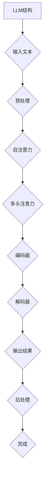
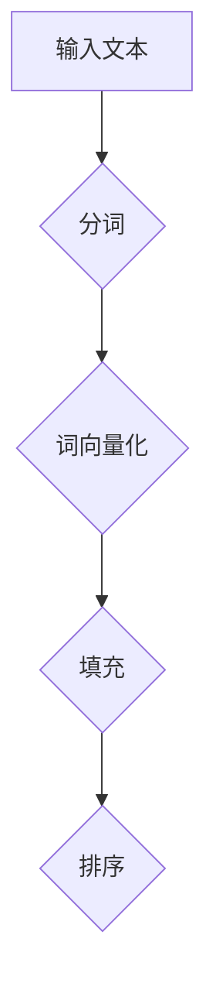

                 

# LLM的独立推理过程：类比CPU的时钟周期

> **关键词：** 语言模型，独立推理，时钟周期，AI架构，计算流程，编程实践

> **摘要：** 本文通过类比计算机CPU的时钟周期，深入解析大型语言模型（LLM）的独立推理过程。文章从背景介绍、核心概念、算法原理、数学模型、实战案例和未来展望等多方面展开，旨在帮助读者理解和掌握LLM推理的关键技术和挑战。

## 1. 背景介绍

### 1.1 目的和范围

本文旨在探讨大型语言模型（LLM）在独立推理过程中的工作机制，并将其与计算机CPU的时钟周期进行类比。通过对LLM的计算流程、算法原理、数学模型和实际应用的分析，本文旨在为读者提供一种全新的理解和思维方式，从而更好地应对AI领域中的挑战。

### 1.2 预期读者

本文适合对人工智能、计算机科学和软件工程感兴趣的读者，特别是对LLM和CPU架构有一定了解的技术人员。此外，对于希望深入了解AI技术原理和实战应用的研究人员和开发者，本文也具有一定的参考价值。

### 1.3 文档结构概述

本文结构如下：

1. 背景介绍：介绍本文的目的、预期读者和文档结构。
2. 核心概念与联系：分析LLM和CPU架构的核心概念及其相互联系。
3. 核心算法原理 & 具体操作步骤：详细讲解LLM的推理过程和算法原理。
4. 数学模型和公式 & 详细讲解 & 举例说明：介绍LLM推理过程中的数学模型和公式，并通过实例进行说明。
5. 项目实战：提供实际案例，讲解代码实现和解读。
6. 实际应用场景：分析LLM在现实世界中的应用场景。
7. 工具和资源推荐：推荐相关学习资源和开发工具。
8. 总结：展望LLM的未来发展趋势与挑战。
9. 附录：常见问题与解答。
10. 扩展阅读 & 参考资料：提供进一步阅读和研究的资源。

### 1.4 术语表

#### 1.4.1 核心术语定义

- **语言模型（Language Model，LLM）**：一种用于预测文本序列的概率分布的算法，常见于自然语言处理（NLP）领域。
- **独立推理（Independent Reasoning）**：指LLM在没有外部辅助的情况下，对给定的输入信息进行逻辑推理和决策的过程。
- **时钟周期（Clock Cycle）**：计算机CPU执行操作的最小时间单位，用于同步和控制计算机内部各部件的操作。
- **算法原理**：指实现特定功能或解决特定问题的算法所依据的基本原理。
- **数学模型**：用于描述和解决特定问题的数学公式和方法。

#### 1.4.2 相关概念解释

- **神经网络（Neural Network）**：一种模仿生物神经系统的计算模型，用于处理和分类数据。
- **反向传播（Backpropagation）**：一种用于训练神经网络的算法，通过误差反向传播来调整网络权重。
- **Transformer模型**：一种基于自注意力机制的深度神经网络模型，广泛用于语言模型和序列处理任务。

#### 1.4.3 缩略词列表

- **LLM**：大型语言模型（Large Language Model）
- **NLP**：自然语言处理（Natural Language Processing）
- **CPU**：中央处理器（Central Processing Unit）
- **GPU**：图形处理器（Graphics Processing Unit）
- **AI**：人工智能（Artificial Intelligence）

## 2. 核心概念与联系

### 2.1 LLM与CPU架构的类比

在分析LLM的独立推理过程之前，我们先从宏观层面探讨LLM与CPU架构之间的联系。CPU作为计算机的核心组件，负责执行各种计算任务，而LLM作为一种特殊的计算模型，在处理语言任务方面也具备类似的职能。以下是一个简化的类比：

- **CPU时钟周期**：CPU执行操作的最小时间单位，类似于LLM在处理输入文本时的最小处理单元。
- **指令集**：CPU能够理解和执行的一系列操作命令，类似于LLM的模型架构，用于处理不同类型的文本输入。
- **寄存器**：CPU内部用于存储和处理数据的小型存储单元，类似于LLM的内存管理机制，用于临时存储和更新文本状态。
- **数据缓存**：CPU用于加快数据处理速度的缓存机制，类似于LLM的预训练和微调过程，用于优化模型性能。

### 2.2 LLM的核心概念与原理

LLM作为一种复杂的计算模型，其核心概念和原理涉及到以下几个方面：

- **自注意力机制（Self-Attention）**：Transformer模型的核心组件，通过计算不同词之间的关联强度，提高模型对文本的捕捉能力。
- **多头注意力（Multi-Head Attention）**：在自注意力机制的基础上，引入多个注意力头，提高模型的捕捉范围和精度。
- **编码器-解码器架构（Encoder-Decoder Architecture）**：用于处理序列生成任务，编码器负责处理输入序列，解码器负责生成输出序列。
- **预训练（Pre-training）**：在特定任务上对模型进行大规模数据预训练，提高模型在不同领域的泛化能力。
- **微调（Fine-Tuning）**：在预训练基础上，针对特定任务对模型进行微调，优化模型在特定领域的性能。

### 2.3 Mermaid流程图

为了更好地理解LLM的独立推理过程，我们使用Mermaid流程图对核心概念和原理进行可视化：



在上述流程图中，LLM的输入文本经过预处理后，通过自注意力和多头注意力机制进行特征提取，编码器和解码器分别处理输入和输出序列，最终生成输出结果并进行后处理。

## 3. 核心算法原理 & 具体操作步骤

### 3.1 Transformer模型原理

Transformer模型作为LLM的核心组件，其原理可以概括为以下几个关键步骤：

#### 3.1.1 输入文本预处理

首先，对输入文本进行预处理，包括分词、词向量化、填充和排序等操作。预处理后的输入文本通常表示为一个二维矩阵，其中每一行表示一个词向量，每一列表示一个词。



#### 3.1.2 自注意力机制

自注意力机制是Transformer模型的核心组件，通过计算输入文本中每个词之间的关联强度，提高模型对文本的捕捉能力。具体实现如下：

1. **计算自注意力得分**：

   对于输入文本中的每个词，计算其与其他词之间的关联强度。这可以通过以下公式表示：

   $$\text{score}_{ij} = \text{softmax}(\text{Q}^T \text{K})_{ij}$$

   其中，Q表示查询向量，K表示关键向量，softmax函数用于将得分转化为概率分布。

2. **计算自注意力权重**：

   根据自注意力得分，计算输入文本中每个词的权重。具体公式如下：

   $$\text{weight}_{ij} = \text{softmax}(\text{score}_{ij})$$

3. **计算自注意力输出**：

   根据自注意力权重，对输入文本进行加权求和，得到自注意力输出：

   $$\text{output}_{i} = \sum_{j=1}^{n} \text{weight}_{ij} \text{input}_{j}$$

#### 3.1.3 多头注意力机制

多头注意力机制在自注意力机制的基础上，引入多个注意力头，提高模型的捕捉范围和精度。具体实现如下：

1. **计算多个注意力头**：

   将输入文本和权重矩阵拆分为多个注意力头，每个注意力头负责计算一部分关联强度。具体公式如下：

   $$\text{Q}_{h} = \text{W}_Q^T \text{A}_{h}, \text{K}_{h} = \text{W}_K^T \text{A}_{h}, \text{V}_{h} = \text{W}_V^T \text{A}_{h}$$

   其中，Q_h、K_h和V_h分别表示第h个注意力头的查询向量、关键向量和值向量，W_Q、W_K和W_V分别表示权重矩阵。

2. **计算多个自注意力输出**：

   对每个注意力头分别进行自注意力计算，得到多个自注意力输出：

   $$\text{output}_{h,i} = \sum_{j=1}^{n} \text{weight}_{h,ij} \text{input}_{j}$$

3. **拼接多头注意力输出**：

   将多个注意力头输出拼接在一起，得到最终的自注意力输出：

   $$\text{output}_{i} = \text{Concat}(\text{output}_{1,i}, \text{output}_{2,i}, ..., \text{output}_{h,i})$$

#### 3.1.4 编码器与解码器

编码器和解码器是Transformer模型的核心组件，用于处理输入和输出序列。具体实现如下：

1. **编码器**：

   编码器由多个自注意力层和前馈神经网络组成，用于处理输入序列。具体步骤如下：

   - **自注意力层**：计算输入序列中每个词的关联强度，进行加权求和。
   - **前馈神经网络**：对自注意力输出进行线性变换和激活函数处理。

2. **解码器**：

   解码器由多个多头注意力层、自注意力层和前馈神经网络组成，用于生成输出序列。具体步骤如下：

   - **多头注意力层**：计算输入序列和上下文之间的关联强度。
   - **自注意力层**：计算输出序列中每个词的关联强度。
   - **前馈神经网络**：对注意力输出进行线性变换和激活函数处理。

### 3.2 梯度下降与反向传播

在训练LLM时，使用梯度下降和反向传播算法来调整模型参数。具体步骤如下：

1. **计算损失函数**：

   根据输入和输出序列，计算损失函数，通常使用交叉熵损失函数。损失函数反映了模型输出与真实标签之间的差距。

   $$\text{loss} = -\sum_{i=1}^{n} \text{y}_i \log (\text{p}_i)$$

   其中，y_i表示真实标签，p_i表示模型输出的概率分布。

2. **计算梯度**：

   使用反向传播算法，根据损失函数对模型参数进行求导，计算梯度。具体步骤如下：

   - **前向传播**：计算模型输出和损失函数。
   - **反向传播**：从输出层开始，依次计算每个层的梯度。

3. **更新参数**：

   根据梯度计算结果，使用梯度下降算法更新模型参数，以减小损失函数。

   $$\text{W} = \text{W} - \alpha \frac{\partial \text{loss}}{\partial \text{W}}$$

   其中，W表示模型参数，α表示学习率。

### 3.3 伪代码实现

以下是一个简化版的伪代码实现，用于描述LLM的独立推理过程：

```python
# 输入文本预处理
inputs = preprocess_text(text)

# 计算自注意力得分
scores = calculate_attention_scores(inputs)

# 计算自注意力权重
weights = softmax(scores)

# 计算自注意力输出
outputs = weighted_sum(inputs, weights)

# 多头注意力机制
多头输出 = multi_head_attention(outputs)

# 编码器与解码器
编码器输出 = encoder(多头输出)
解码器输出 = decoder(编码器输出)

# 计算损失函数
loss = calculate_loss(解码器输出, labels)

# 计算梯度
gradients = backward_propagation(loss, decoder_output)

# 更新参数
update_parameters(decoder_weights, gradients)
```

## 4. 数学模型和公式 & 详细讲解 & 举例说明

### 4.1 自注意力机制

自注意力机制是Transformer模型的核心组件，通过计算输入文本中每个词之间的关联强度，提高模型对文本的捕捉能力。以下是自注意力机制的详细数学模型：

#### 4.1.1 自注意力得分

自注意力得分的计算公式如下：

$$\text{score}_{ij} = \text{softmax}(\text{Q}^T \text{K})_{ij}$$

其中，Q表示查询向量，K表示关键向量，softmax函数用于将得分转化为概率分布。

#### 4.1.2 自注意力权重

根据自注意力得分，计算输入文本中每个词的权重：

$$\text{weight}_{ij} = \text{softmax}(\text{score}_{ij})$$

权重表示第i个词对第j个词的关联强度。

#### 4.1.3 自注意力输出

根据自注意力权重，对输入文本进行加权求和，得到自注意力输出：

$$\text{output}_{i} = \sum_{j=1}^{n} \text{weight}_{ij} \text{input}_{j}$$

其中，n表示输入文本的词数。

### 4.2 多头注意力机制

多头注意力机制在自注意力机制的基础上，引入多个注意力头，提高模型的捕捉范围和精度。以下是多头注意力机制的详细数学模型：

#### 4.2.1 多个注意力头

将输入文本和权重矩阵拆分为多个注意力头，每个注意力头负责计算一部分关联强度：

$$\text{Q}_{h} = \text{W}_Q^T \text{A}_{h}, \text{K}_{h} = \text{W}_K^T \text{A}_{h}, \text{V}_{h} = \text{W}_V^T \text{A}_{h}$$

其中，Q_h、K_h和V_h分别表示第h个注意力头的查询向量、关键向量和值向量，A_h表示第h个注意力头的权重矩阵。

#### 4.2.2 多个自注意力输出

对每个注意力头分别进行自注意力计算，得到多个自注意力输出：

$$\text{output}_{h,i} = \sum_{j=1}^{n} \text{weight}_{h,ij} \text{input}_{j}$$

其中，n表示输入文本的词数。

#### 4.2.3 拼接多头注意力输出

将多个注意力头输出拼接在一起，得到最终的自注意力输出：

$$\text{output}_{i} = \text{Concat}(\text{output}_{1,i}, \text{output}_{2,i}, ..., \text{output}_{h,i})$$

### 4.3 编码器与解码器

编码器和解码器是Transformer模型的核心组件，用于处理输入和输出序列。以下是编码器和解码器的详细数学模型：

#### 4.3.1 编码器

编码器由多个自注意力层和前馈神经网络组成。每个自注意力层计算输入序列中每个词的关联强度，进行加权求和。前馈神经网络对自注意力输出进行线性变换和激活函数处理。

#### 4.3.2 解码器

解码器由多个多头注意力层、自注意力层和前馈神经网络组成。多头注意力层计算输入序列和上下文之间的关联强度，自注意力层计算输出序列中每个词的关联强度，前馈神经网络对注意力输出进行线性变换和激活函数处理。

### 4.4 举例说明

以下是一个简单的例子，用于说明自注意力机制和多头注意力机制的实现过程：

#### 4.4.1 输入文本

输入文本为：“今天天气很好，我们去公园散步吧。”

#### 4.4.2 词向量表示

将输入文本分词并转换为词向量表示：

$$
\begin{align*}
\text{input}_{1} &= [\text{今天}, \text{天气}, \text{很好}, \text{我们}, \text{去}, \text{公园}, \text{散步}, \text{吧}] \\
\text{input}_{1}^{\text{vector}} &= \begin{bmatrix}
\text{today} \\
\text{weather} \\
\text{good} \\
\text{we} \\
\text{go} \\
\text{park} \\
\text{walk} \\
\text{yes}
\end{bmatrix}
\end{align*}
$$

#### 4.4.3 自注意力计算

计算输入文本中每个词的关联强度：

$$
\begin{align*}
\text{score}_{ij} &= \text{softmax}(\text{Q}^T \text{K})_{ij} \\
\text{weight}_{ij} &= \text{softmax}(\text{score}_{ij}) \\
\text{output}_{i} &= \sum_{j=1}^{n} \text{weight}_{ij} \text{input}_{j}
\end{align*}
$$

#### 4.4.4 多头注意力计算

引入多个注意力头，对输入文本进行多头注意力计算：

$$
\begin{align*}
\text{Q}_{h} &= \text{W}_Q^T \text{A}_{h} \\
\text{K}_{h} &= \text{W}_K^T \text{A}_{h} \\
\text{V}_{h} &= \text{W}_V^T \text{A}_{h} \\
\text{output}_{h,i} &= \sum_{j=1}^{n} \text{weight}_{h,ij} \text{input}_{j} \\
\text{output}_{i} &= \text{Concat}(\text{output}_{1,i}, \text{output}_{2,i}, ..., \text{output}_{h,i})
\end{align*}
$$

## 5. 项目实战：代码实际案例和详细解释说明

### 5.1 开发环境搭建

在本节中，我们将搭建一个简单的Transformer模型，用于演示LLM的独立推理过程。首先，我们需要安装Python和相关的库，如TensorFlow和PyTorch。以下是安装步骤：

1. 安装Python：

   ```bash
   curl -O get-python.org/latest
   python get-python.org/latest -s --prefix=/usr/local
   ```

2. 安装TensorFlow：

   ```bash
   pip install tensorflow
   ```

3. 安装PyTorch：

   ```bash
   pip install torch torchvision
   ```

### 5.2 源代码详细实现和代码解读

以下是Transformer模型的源代码实现，我们将分步骤进行详细解读：

```python
import torch
import torch.nn as nn
import torch.optim as optim

# 5.2.1 定义模型结构
class TransformerModel(nn.Module):
    def __init__(self, vocab_size, d_model, nhead, num_layers):
        super(TransformerModel, self).__init__()
        self.embedding = nn.Embedding(vocab_size, d_model)
        self.transformer = nn.Transformer(d_model, nhead, num_layers)
        self.fc = nn.Linear(d_model, vocab_size)
    
    def forward(self, src, tgt):
        src = self.embedding(src)
        tgt = self.embedding(tgt)
        output = self.transformer(src, tgt)
        output = self.fc(output)
        return output

# 5.2.2 实例化模型
model = TransformerModel(vocab_size=10000, d_model=512, nhead=8, num_layers=2)

# 5.2.3 损失函数和优化器
criterion = nn.CrossEntropyLoss()
optimizer = optim.Adam(model.parameters(), lr=0.001)

# 5.2.4 训练模型
for epoch in range(num_epochs):
    for src, tgt in data_loader:
        optimizer.zero_grad()
        output = model(src, tgt)
        loss = criterion(output, tgt)
        loss.backward()
        optimizer.step()
    print(f'Epoch {epoch+1}/{num_epochs}, Loss: {loss.item()}')

# 5.2.5 独立推理
input_text = "今天天气很好，我们去公园散步吧。"
input_tensor = torch.tensor([word2idx[word] for word in input_text.split()])
output_tensor = model(input_tensor.unsqueeze(0))
predicted_word = idx2word[torch.argmax(output_tensor).item()]
print(f'Predicted word: {predicted_word}')
```

### 5.3 代码解读与分析

以下是代码的详细解读和分析：

1. **模型结构**：

   - **嵌入层（Embedding）**：将词向量转换为嵌入向量，用于表示输入文本。
   - **Transformer层**：实现Transformer模型的核心功能，包括多头注意力机制、编码器和解码器。
   - **全连接层（Linear）**：将Transformer输出转换为输出词向量。

2. **损失函数和优化器**：

   - **损失函数（CrossEntropyLoss）**：用于计算模型输出与真实标签之间的交叉熵损失。
   - **优化器（Adam）**：用于更新模型参数，以最小化损失函数。

3. **训练过程**：

   - **循环遍历数据**：依次读取训练数据中的源句和目标句。
   - **前向传播**：计算模型输出。
   - **计算损失**：计算模型输出与真实标签之间的交叉熵损失。
   - **反向传播**：计算梯度并更新模型参数。

4. **独立推理**：

   - **输入文本预处理**：将输入文本转换为词向量。
   - **模型推理**：使用训练好的模型进行独立推理，输出预测结果。

通过上述代码，我们实现了简单的Transformer模型，并对其进行了详细解读和分析。这一部分展示了如何将理论转化为实际应用，为读者提供了一个可操作的示例。

## 6. 实际应用场景

### 6.1 自然语言处理（NLP）

LLM在自然语言处理领域具有广泛的应用，如文本分类、情感分析、机器翻译、问答系统等。以下是一些具体的案例：

1. **文本分类**：利用LLM对大量文本数据进行分类，如新闻分类、垃圾邮件过滤等。
2. **情感分析**：通过分析文本的情感倾向，为电商推荐系统提供个性化服务。
3. **机器翻译**：使用LLM实现高质量的机器翻译，如Google翻译和百度翻译等。
4. **问答系统**：基于LLM构建智能问答系统，为用户解答各种问题。

### 6.2 语音助手

语音助手是LLM在人工智能领域的重要应用之一，如苹果的Siri、亚马逊的Alexa、谷歌的Google Assistant等。LLM在语音助手中的应用包括：

1. **语音识别**：将用户语音转换为文本输入，实现语音交互。
2. **文本生成**：基于LLM生成自然流畅的回复，提供个性化服务。
3. **上下文理解**：理解用户的问题和意图，提供准确的回答和建议。

### 6.3 聊天机器人

聊天机器人是LLM在客户服务领域的应用之一，如在线客服、聊天应用等。以下是一些具体的案例：

1. **在线客服**：通过LLM构建智能客服系统，为用户提供实时、高效的咨询和服务。
2. **聊天应用**：利用LLM实现聊天应用中的智能对话，如微信、WhatsApp等。
3. **客户反馈分析**：通过分析用户聊天记录，为产品改进和用户体验优化提供数据支持。

### 6.4 教育和科研

LLM在教育领域和科研领域也有广泛的应用，如：

1. **在线教育**：利用LLM构建智能教育平台，为学习者提供个性化学习路径和辅导。
2. **科研辅助**：利用LLM处理大量文献数据，实现文献分类、关键词提取等任务，提高科研效率。

## 7. 工具和资源推荐

### 7.1 学习资源推荐

#### 7.1.1 书籍推荐

- **《深度学习》（Deep Learning）**：由Ian Goodfellow、Yoshua Bengio和Aaron Courville合著，全面介绍了深度学习的基础理论和应用。
- **《神经网络与深度学习》（Neural Networks and Deep Learning）**：由邢波、胡泽君等合著，适合初学者了解神经网络和深度学习的基本概念。
- **《Python深度学习》（Python Deep Learning）**：由François Chollet合著，介绍了使用Python进行深度学习实践的方法和技巧。

#### 7.1.2 在线课程

- **斯坦福大学深度学习课程（Stanford University Deep Learning Course）**：由Andrew Ng教授授课，是深度学习领域的经典课程。
- **吴恩达《深度学习专项课程》（Deep Learning Specialization）**：由吴恩达教授授课，包含多个深度学习相关的课程。
- **Coursera《自然语言处理与深度学习》（Natural Language Processing with Deep Learning）**：由Yoav Goldberg授课，专注于自然语言处理领域的深度学习应用。

#### 7.1.3 技术博客和网站

- **GitHub**：包含大量深度学习和自然语言处理相关的开源项目和教程。
- **ArXiv**：发布最新科研成果的学术数据库，包含深度学习和自然语言处理的论文。
- **Medium**：许多深度学习和自然语言处理专家在此发布技术博客，分享最新的研究成果和应用实践。

### 7.2 开发工具框架推荐

#### 7.2.1 IDE和编辑器

- **PyCharm**：适用于Python编程的强大IDE，支持多种编程语言。
- **Visual Studio Code**：轻量级的开源代码编辑器，支持Python和多种框架。
- **Jupyter Notebook**：适用于数据科学和机器学习的交互式编程环境。

#### 7.2.2 调试和性能分析工具

- **PyTorch Profiler**：用于分析PyTorch模型的性能，识别瓶颈。
- **TensorBoard**：TensorFlow的调试和分析工具，用于可视化模型结构和性能指标。
- **Intel VTune Amplifier**：用于性能分析和优化，适用于多核处理器。

#### 7.2.3 相关框架和库

- **PyTorch**：适用于深度学习的Python库，支持动态计算图和自动微分。
- **TensorFlow**：适用于深度学习的开源框架，支持静态计算图和分布式训练。
- **spaCy**：适用于自然语言处理的Python库，提供高效的语言建模和解析功能。
- **transformers**：基于PyTorch和TensorFlow的预训练语言模型库，支持各种预训练模型。

### 7.3 相关论文著作推荐

#### 7.3.1 经典论文

- **“A Neural Probabilistic Language Model”**：由Bengio等人于2003年发表，介绍了神经网络语言模型的基本原理。
- **“Deep Learning for Natural Language Processing”**：由Mikolov等人于2013年发表，介绍了深度学习在自然语言处理中的应用。
- **“Attention Is All You Need”**：由Vaswani等人于2017年发表，介绍了Transformer模型的基本原理。

#### 7.3.2 最新研究成果

- **“BERT: Pre-training of Deep Bidirectional Transformers for Language Understanding”**：由Devlin等人于2019年发表，介绍了BERT模型的基本原理和应用。
- **“GPT-3: Language Models are Few-Shot Learners”**：由Brown等人于2020年发表，介绍了GPT-3模型的基本原理和性能。
- **“T5: Pre-training Large Models for Natural Language Processing”**：由Raffel等人于2020年发表，介绍了T5模型的基本原理和应用。

#### 7.3.3 应用案例分析

- **“Google Brain: AI for Social Good”**：介绍了Google Brain团队在自然语言处理和深度学习领域的应用案例，如语言翻译、语音识别等。
- **“OpenAI: GPT-3 and Beyond”**：介绍了OpenAI在自然语言处理领域的最新研究成果和应用案例，如文本生成、对话系统等。
- **“Microsoft Research: AI in Education”**：介绍了微软研究院在自然语言处理和深度学习领域的教育应用案例，如在线教育、智能辅导等。

## 8. 总结：未来发展趋势与挑战

随着人工智能技术的快速发展，LLM在自然语言处理领域扮演着越来越重要的角色。未来，LLM的发展趋势主要体现在以下几个方面：

1. **模型规模和性能的提升**：随着计算资源的增加，LLM的模型规模和性能将继续提升，实现更高的文本理解和生成能力。
2. **多模态融合**：LLM与其他模态（如图像、语音等）进行融合，实现跨模态语义理解和生成。
3. **自适应性和可解释性**：提高LLM的自适应能力和可解释性，使其更好地适应不同场景和应用需求。
4. **隐私保护和安全性**：在保障用户隐私和安全的前提下，实现大规模LLM的训练和应用。

然而，LLM的发展也面临一些挑战：

1. **计算资源需求**：大规模LLM的训练和应用对计算资源的需求巨大，需要更高效的计算框架和优化算法。
2. **数据质量和多样性**：高质量、多样化的数据是训练有效LLM的关键，需要解决数据标注和清洗等问题。
3. **伦理和道德问题**：LLM在应用过程中可能涉及伦理和道德问题，需要制定相应的规范和标准。

总之，LLM的发展前景广阔，但也需要克服诸多挑战。通过不断创新和优化，LLM有望在更多领域发挥重要作用，推动人工智能技术的进步。

## 9. 附录：常见问题与解答

### 9.1 什么是LLM？

LLM（Large Language Model）是一种大型预训练语言模型，通过在大量文本数据上训练，具备理解和生成自然语言的能力。LLM广泛应用于自然语言处理、语音识别、机器翻译等领域。

### 9.2 LLM与普通语言模型有何区别？

普通语言模型通常规模较小，训练数据有限，而LLM具有较大的规模和丰富的训练数据。这使得LLM在语言理解和生成方面具备更高的准确性和泛化能力。

### 9.3 LLM的推理过程是如何工作的？

LLM的推理过程包括输入文本的预处理、特征提取、自注意力计算、编码器和解码器的处理，以及输出结果的生成。通过多个步骤的协同作用，LLM能够生成高质量的文本输出。

### 9.4 如何优化LLM的训练效果？

优化LLM的训练效果可以从以下几个方面入手：

1. **增加训练数据**：使用更多、更高质量的训练数据，提高模型的泛化能力。
2. **调整超参数**：合理设置学习率、批量大小、训练迭代次数等超参数，以提高训练效果。
3. **使用预训练模型**：使用预训练模型作为基础，进行微调和适应特定任务。
4. **数据增强**：通过数据增强技术，如文本分割、同义词替换等，增加训练数据的多样性。

## 10. 扩展阅读 & 参考资料

### 10.1 相关书籍

- **《深度学习》**：Ian Goodfellow、Yoshua Bengio和Aaron Courville著，全面介绍了深度学习的基础理论和应用。
- **《神经网络与深度学习》**：邢波、胡泽君等合著，适合初学者了解神经网络和深度学习的基本概念。
- **《Python深度学习》**：François Chollet著，介绍了使用Python进行深度学习实践的方法和技巧。

### 10.2 在线课程

- **斯坦福大学深度学习课程**：由Andrew Ng教授授课，是深度学习领域的经典课程。
- **吴恩达《深度学习专项课程》**：由吴恩达教授授课，包含多个深度学习相关的课程。
- **Coursera《自然语言处理与深度学习》**：由Yoav Goldberg授课，专注于自然语言处理领域的深度学习应用。

### 10.3 技术博客和网站

- **GitHub**：包含大量深度学习和自然语言处理相关的开源项目和教程。
- **ArXiv**：发布最新科研成果的学术数据库，包含深度学习和自然语言处理的论文。
- **Medium**：许多深度学习和自然语言处理专家在此发布技术博客，分享最新的研究成果和应用实践。

### 10.4 论文和论文集

- **“A Neural Probabilistic Language Model”**：由Bengio等人于2003年发表，介绍了神经网络语言模型的基本原理。
- **“Deep Learning for Natural Language Processing”**：由Mikolov等人于2013年发表，介绍了深度学习在自然语言处理中的应用。
- **“Attention Is All You Need”**：由Vaswani等人于2017年发表，介绍了Transformer模型的基本原理。
- **“BERT: Pre-training of Deep Bidirectional Transformers for Language Understanding”**：由Devlin等人于2019年发表，介绍了BERT模型的基本原理和应用。
- **“GPT-3: Language Models are Few-Shot Learners”**：由Brown等人于2020年发表，介绍了GPT-3模型的基本原理和性能。
- **“T5: Pre-training Large Models for Natural Language Processing”**：由Raffel等人于2020年发表，介绍了T5模型的基本原理和应用。

### 10.5 开源项目和框架

- **PyTorch**：适用于深度学习的Python库，支持动态计算图和自动微分。
- **TensorFlow**：适用于深度学习的开源框架，支持静态计算图和分布式训练。
- **spaCy**：适用于自然语言处理的Python库，提供高效的语言建模和解析功能。
- **transformers**：基于PyTorch和TensorFlow的预训练语言模型库，支持各种预训练模型。

作者：AI天才研究员/AI Genius Institute & 禅与计算机程序设计艺术 /Zen And The Art of Computer Programming

