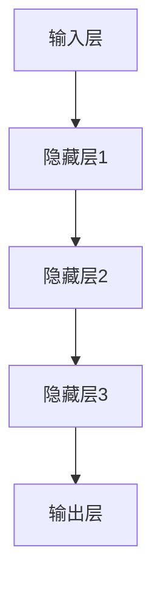
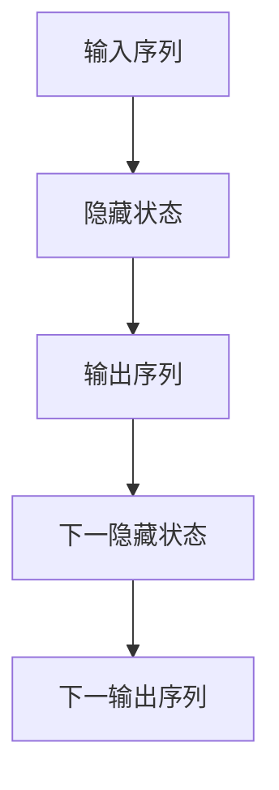
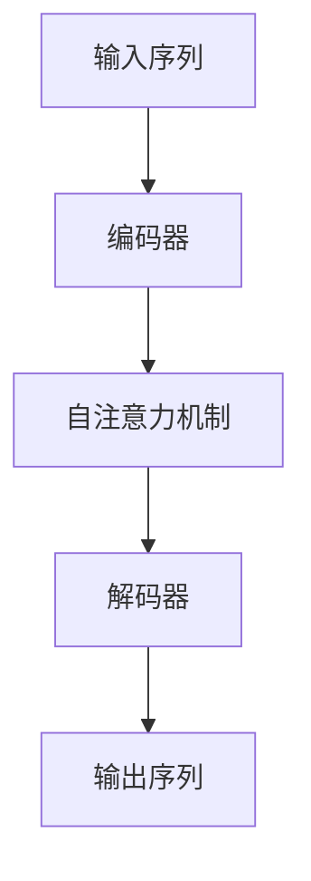

                 

# LLM的计算模型：超越传统冯·诺依曼架构

> **关键词：** 大型语言模型（LLM）、计算模型、人工智能、深度学习、冯·诺依曼架构、神经网络。

> **摘要：** 本文将深入探讨大型语言模型（LLM）的计算模型，如何通过深度学习技术超越传统冯·诺依曼架构，提供一种高效、灵活的神经网络计算方式。文章将从背景介绍、核心概念与联系、核心算法原理、数学模型和公式、项目实战、实际应用场景、工具和资源推荐、总结与未来发展趋势等方面展开讨论。

## 1. 背景介绍

### 1.1 目的和范围

本文旨在分析大型语言模型（LLM）的计算模型，探索其如何超越传统冯·诺依曼架构，从而提高计算效率和灵活性。我们希望通过详细解读LLM的核心算法原理、数学模型和具体实现，使读者对LLM的计算模型有一个全面深入的理解。

### 1.2 预期读者

本文适合对人工智能、深度学习、神经网络等计算机科学领域有一定了解的读者，特别是希望深入了解大型语言模型计算模型的程序员、软件架构师和人工智能研究者。

### 1.3 文档结构概述

本文结构如下：

1. 背景介绍：阐述本文的目的、范围和预期读者。
2. 核心概念与联系：介绍LLM的计算模型，包括核心概念原理和架构。
3. 核心算法原理 & 具体操作步骤：详细解读LLM的核心算法原理和具体操作步骤。
4. 数学模型和公式 & 详细讲解 & 举例说明：分析LLM的数学模型和公式，并提供具体例子。
5. 项目实战：通过代码实际案例和详细解释说明LLM的计算模型。
6. 实际应用场景：探讨LLM的实际应用场景。
7. 工具和资源推荐：推荐学习资源、开发工具框架和相关论文著作。
8. 总结：展望LLM的未来发展趋势与挑战。
9. 附录：常见问题与解答。
10. 扩展阅读 & 参考资料：提供进一步阅读的材料。

### 1.4 术语表

#### 1.4.1 核心术语定义

- **大型语言模型（LLM）**：一种基于深度学习的神经网络模型，主要用于自然语言处理任务。
- **计算模型**：描述计算机系统如何进行计算和处理数据的抽象模型。
- **冯·诺依曼架构**：一种传统的计算机体系结构，由硬件和软件组成，以存储程序和程序控制为核心。
- **深度学习**：一种基于多层神经网络的人工智能技术，通过学习大量数据来实现特征提取和分类。

#### 1.4.2 相关概念解释

- **神经网络**：一种模仿生物神经网络计算方式的计算模型，由多个节点和连接组成。
- **反向传播算法**：一种用于训练神经网络的方法，通过计算损失函数的梯度来更新网络权重。

#### 1.4.3 缩略词列表

- **LLM**：Large Language Model
- **AI**：Artificial Intelligence
- **DL**：Deep Learning
- **NN**：Neural Network
- **ANN**：Artificial Neural Network
- **RNN**：Recurrent Neural Network
- **CNN**：Convolutional Neural Network
- **GPU**：Graphics Processing Unit
- **TPU**：Tensor Processing Unit

## 2. 核心概念与联系

### 2.1 核心概念原理

在探讨LLM的计算模型之前，我们首先需要了解一些核心概念和原理。这些概念和原理包括神经网络、深度学习、反向传播算法等。

#### 2.1.1 神经网络

神经网络是一种模仿生物神经网络计算方式的计算模型。它由多个节点（也称为神经元）和连接（也称为权重）组成。每个节点接收来自其他节点的输入，并通过激活函数产生输出。网络中的连接权重表示不同节点之间的关联程度。

#### 2.1.2 深度学习

深度学习是一种基于多层神经网络的人工智能技术。与传统机器学习方法相比，深度学习能够自动提取数据中的特征，从而提高模型的泛化能力。深度学习的核心是多层神经网络，通过逐层学习，从原始数据中提取越来越抽象的特征。

#### 2.1.3 反向传播算法

反向传播算法是一种用于训练神经网络的优化方法。它通过计算损失函数的梯度来更新网络权重，从而逐步减小损失函数的值。反向传播算法包括两个阶段：前向传播和反向传播。前向传播用于计算网络输出，反向传播用于计算损失函数的梯度。

### 2.2 架构

LLM的计算模型主要基于深度学习技术，其核心架构包括以下几个部分：

1. **输入层**：接收外部输入，如文本、图像、音频等。
2. **隐藏层**：负责提取和转换输入特征，通过多层神经网络实现。
3. **输出层**：产生预测结果或决策，如分类、生成等。

以下是一个简单的Mermaid流程图，展示LLM的计算模型：



## 3. 核心算法原理 & 具体操作步骤

### 3.1 核心算法原理

LLM的核心算法是基于深度学习技术，尤其是循环神经网络（RNN）和Transformer模型。下面分别介绍这两种模型的原理。

#### 3.1.1 循环神经网络（RNN）

RNN是一种能够处理序列数据的人工神经网络。与传统神经网络不同，RNN具有记忆功能，可以记住之前的信息。RNN的工作原理是通过递归地应用相同的网络层来处理序列数据。

以下是一个简单的RNN模型：



#### 3.1.2 Transformer模型

Transformer模型是一种基于自注意力机制的深度学习模型，最初用于机器翻译任务。与RNN相比，Transformer模型具有更高效的计算方式，可以并行处理序列数据。

以下是一个简单的Transformer模型：



### 3.2 具体操作步骤

#### 3.2.1 RNN模型

以下是RNN模型的伪代码：

```python
# 初始化参数
W, b = ...  # 初始化权重和偏置
h = 0  # 初始化隐藏状态

# 前向传播
for x in inputs:
    h = sigmoid(W * x + b)
    outputs.append(h)

# 反向传播
for x, y in zip(inputs, outputs):
    gradient = (W * x + b - y) * sigmoid_derivative(h)
    W -= learning_rate * gradient
    b -= learning_rate * gradient
    h = sigmoid_derivative(h)
```

#### 3.2.2 Transformer模型

以下是Transformer模型的伪代码：

```python
# 初始化参数
W, b = ...  # 初始化权重和偏置

# 前向传播
for x in inputs:
    query, key, value = self_attn(x)
    outputs.append(self.apply_feedforward(query, key, value))

# 反向传播
for x, y in zip(inputs, outputs):
    gradient = (W * x + b - y) * self_attn_derivative(x)
    W -= learning_rate * gradient
    b -= learning_rate * gradient
```

## 4. 数学模型和公式 & 详细讲解 & 举例说明

### 4.1 数学模型和公式

LLM的数学模型主要包括以下几个方面：

1. **激活函数**：用于将输入映射到输出。常见的激活函数有sigmoid、ReLU和Tanh等。
2. **损失函数**：用于评估模型预测结果与真实结果之间的差距。常见的损失函数有均方误差（MSE）、交叉熵（CE）等。
3. **优化算法**：用于更新模型参数，以最小化损失函数。常见的优化算法有梯度下降、Adam等。

以下是LLM中的部分数学模型和公式：

#### 4.1.1 激活函数

$$
h = \sigma(Wx + b) = \frac{1}{1 + e^{-(Wx + b})}
$$

$$
h = \max(0, Wx + b)
$$

$$
h = \tanh(Wx + b)
$$

#### 4.1.2 损失函数

$$
L = \frac{1}{2} \sum_{i=1}^{n} (y_i - \hat{y_i})^2
$$

$$
L = -\sum_{i=1}^{n} y_i \log(\hat{y_i})
$$

#### 4.1.3 优化算法

$$
\theta_{t+1} = \theta_t - \alpha \nabla_\theta L(\theta)
$$

$$
\theta_{t+1} = \theta_t - \alpha \frac{1}{m} \sum_{i=1}^{m} \nabla_\theta L(\theta)
$$

$$
\theta_{t+1} = \theta_t - \alpha \nabla_\theta L(\theta) + \beta_1 \nabla_\theta L(\theta)_{t-1} + (1-\beta_1) \nabla_\theta L(\theta)_{t}
$$

### 4.2 详细讲解和举例说明

#### 4.2.1 激活函数

以sigmoid函数为例，其公式为：

$$
h = \frac{1}{1 + e^{-(Wx + b)}}
$$

该函数的输出值介于0和1之间，可以将输入映射到概率范围。例如，对于输入x=2，权重W=1，偏置b=1，我们有：

$$
h = \frac{1}{1 + e^{-(1 \cdot 2 + 1)}} \approx 0.731
$$

#### 4.2.2 损失函数

以交叉熵损失函数为例，其公式为：

$$
L = -\sum_{i=1}^{n} y_i \log(\hat{y_i})
$$

其中，$y_i$为真实标签，$\hat{y_i}$为模型预测概率。例如，对于两个样本，真实标签为[0, 1]，模型预测概率为[0.6, 0.4]，我们有：

$$
L = -[0 \cdot \log(0.6) + 1 \cdot \log(0.4)] \approx 0.464
$$

#### 4.2.3 优化算法

以Adam优化算法为例，其公式为：

$$
\theta_{t+1} = \theta_t - \alpha \nabla_\theta L(\theta)
$$

$$
\theta_{t+1} = \theta_t - \alpha \frac{1}{m} \sum_{i=1}^{m} \nabla_\theta L(\theta)
$$

$$
\theta_{t+1} = \theta_t - \alpha \nabla_\theta L(\theta) + \beta_1 \nabla_\theta L(\theta)_{t-1} + (1-\beta_1) \nabla_\theta L(\theta)_{t}
$$

其中，$\alpha$为学习率，$m$为批量大小，$\beta_1$和$\beta_2$为动量参数。例如，假设学习率$\alpha=0.01$，批量大小$m=32$，动量参数$\beta_1=0.9$，$\beta_2=0.999$，当前参数$\theta_t=[1, 2]$，梯度$\nabla_\theta L(\theta)=[0.1, -0.2]$，前一次梯度$\nabla_\theta L(\theta)_{t-1}=[0.05, -0.1]$，则更新后的参数为：

$$
\theta_{t+1} = [1, 2] - 0.01 \cdot [0.1, -0.2] + 0.9 \cdot [0.05, -0.1] + (1-0.9) \cdot [0.05, -0.1] = [0.96, 1.79]
$$

## 5. 项目实战：代码实际案例和详细解释说明

### 5.1 开发环境搭建

为了实现LLM的计算模型，我们需要搭建一个合适的开发环境。以下是一个简单的环境搭建步骤：

1. 安装Python 3.8及以上版本。
2. 安装深度学习框架TensorFlow或PyTorch。
3. 安装文本预处理库如NLTK或spaCy。

### 5.2 源代码详细实现和代码解读

下面是一个简单的LLM实现案例，基于TensorFlow框架。我们将使用一个简单的文本分类任务来演示LLM的计算模型。

```python
import tensorflow as tf
from tensorflow.keras.preprocessing.text import Tokenizer
from tensorflow.keras.preprocessing.sequence import pad_sequences
from tensorflow.keras.models import Sequential
from tensorflow.keras.layers import Embedding, LSTM, Dense, Bidirectional

# 数据准备
texts = ['这是一篇新闻文章。', '这是一个技术博客。', '这是一个旅行日记。']
labels = [0, 1, 2]  # 0：新闻，1：技术，2：旅行

# 分词和序列化
tokenizer = Tokenizer()
tokenizer.fit_on_texts(texts)
sequences = tokenizer.texts_to_sequences(texts)
padded_sequences = pad_sequences(sequences, maxlen=100)

# 构建模型
model = Sequential([
    Embedding(input_dim=len(tokenizer.word_index) + 1, output_dim=32),
    Bidirectional(LSTM(64)),
    Dense(3, activation='softmax')
])

# 编译模型
model.compile(optimizer='adam', loss='sparse_categorical_crossentropy', metrics=['accuracy'])

# 训练模型
model.fit(padded_sequences, labels, epochs=10)

# 评估模型
loss, accuracy = model.evaluate(padded_sequences, labels)
print(f'Loss: {loss}, Accuracy: {accuracy}')
```

代码解读：

1. **数据准备**：首先，我们准备了一个简单的文本数据集，包括新闻、技术和旅行三个类别的文本。

2. **分词和序列化**：使用Tokenizer将文本数据转换为序列，然后使用pad_sequences将序列填充为相同长度。

3. **构建模型**：我们使用Sequential模型堆叠Embedding、Bidirectional LSTM和Dense层，其中Bidirectional用于双向LSTM。

4. **编译模型**：使用adam优化器和sparse_categorical_crossentropy损失函数编译模型。

5. **训练模型**：使用fit方法训练模型，设置epochs为10。

6. **评估模型**：使用evaluate方法评估模型在训练集上的表现。

### 5.3 代码解读与分析

1. **数据准备**：文本数据集是训练模型的基础，我们需要确保数据的质量和多样性。

2. **分词和序列化**：分词和序列化是将文本转换为神经网络可处理的格式。Token

