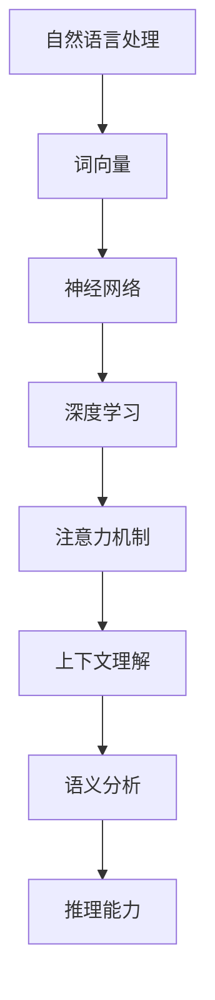

                 

# LLM的语言理解：突破人机交互壁垒

> **关键词：** 大型语言模型（LLM），自然语言处理（NLP），人机交互（HCI），上下文理解，语义分析，推理能力
>
> **摘要：** 本文深入探讨大型语言模型（LLM）的语言理解能力，分析其在自然语言处理和人类交互中的关键作用。文章将从背景介绍、核心概念、算法原理、数学模型、实际应用等多个角度，详细阐述LLM如何突破人机交互的壁垒，提高人工智能系统的交互性和智能性。

## 1. 背景介绍

### 1.1 目的和范围

本文旨在探讨大型语言模型（LLM）在自然语言处理（NLP）和人机交互（HCI）中的应用，特别是其语言理解能力的突破。我们将重点关注LLM的核心概念、算法原理、数学模型，并通过实际案例展示其在不同领域的应用。

### 1.2 预期读者

本文适合对自然语言处理和人工智能有初步了解的技术人员、研究人员以及对人工智能有兴趣的读者。同时，对于希望深入了解LLM应用和未来发展趋势的专业人士也有一定的参考价值。

### 1.3 文档结构概述

本文结构如下：

1. 背景介绍：介绍文章的目的、预期读者和文档结构。
2. 核心概念与联系：阐述LLM的核心概念、原理和架构。
3. 核心算法原理 & 具体操作步骤：详细讲解LLM的算法原理和操作步骤。
4. 数学模型和公式 & 详细讲解 & 举例说明：介绍LLM的数学模型和公式，并进行详细讲解和举例。
5. 项目实战：通过实际代码案例展示LLM的应用。
6. 实际应用场景：探讨LLM在不同领域的应用。
7. 工具和资源推荐：推荐相关学习资源、开发工具和经典论文。
8. 总结：总结LLM的发展趋势与挑战。
9. 附录：常见问题与解答。
10. 扩展阅读 & 参考资料：提供进一步阅读的资料。

### 1.4 术语表

#### 1.4.1 核心术语定义

- **大型语言模型（LLM）**：一种基于神经网络的语言模型，能够理解和生成自然语言。
- **自然语言处理（NLP）**：研究如何让计算机理解和处理人类自然语言的技术。
- **人机交互（HCI）**：研究人类和计算机之间交互的学科。
- **上下文理解**：理解句子或文本在特定情境中的含义。
- **语义分析**：分析文本中的语义关系和结构。
- **推理能力**：从已知信息中推断出未知信息的能力。

#### 1.4.2 相关概念解释

- **神经网络（NN）**：一种模仿人脑神经结构的工作模型，能够通过学习获得新的知识。
- **深度学习（DL）**：一种基于神经网络的机器学习方法，通过多层神经网络对数据进行特征提取和分类。
- **词向量（Word Vector）**：将自然语言中的单词映射到高维向量空间，以便于计算机处理。
- **注意力机制（Attention Mechanism）**：一种在处理序列数据时能够自动关注重要信息的机制。

#### 1.4.3 缩略词列表

- **LLM**：Large Language Model（大型语言模型）
- **NLP**：Natural Language Processing（自然语言处理）
- **HCI**：Human-Computer Interaction（人机交互）
- **NN**：Neural Network（神经网络）
- **DL**：Deep Learning（深度学习）
- **WV**：Word Vector（词向量）
- **AM**：Attention Mechanism（注意力机制）

## 2. 核心概念与联系

在探讨LLM的语言理解能力之前，我们需要了解几个核心概念和它们之间的关系。以下是一个简化的Mermaid流程图，展示了LLM的核心概念和架构。



### 2.1 自然语言处理

自然语言处理（NLP）是人工智能领域的一个分支，旨在让计算机理解和处理人类自然语言。NLP的应用包括机器翻译、情感分析、文本分类、问答系统等。NLP的关键技术包括：

- **文本预处理**：将自然语言文本转换为计算机可处理的格式，如分词、词性标注、去除停用词等。
- **词向量**：将单词映射到高维向量空间，以便于计算机进行计算和比较。

### 2.2 词向量

词向量是一种将自然语言中的单词映射到高维向量空间的方法。常见的词向量模型包括Word2Vec、GloVe等。词向量模型能够捕获单词的语义信息，如相似性和关联性，从而为后续的深度学习模型提供基础。

### 2.3 神经网络

神经网络（NN）是一种模仿人脑神经结构的工作模型。NN由多个神经元（节点）组成，每个神经元都可以接受输入、进行计算并产生输出。神经网络通过学习大量数据，能够自动提取特征并建立模型。

### 2.4 深度学习

深度学习（DL）是一种基于神经网络的机器学习方法，通过多层神经网络对数据进行特征提取和分类。深度学习在图像识别、语音识别、自然语言处理等领域取得了显著的成果。

### 2.5 注意力机制

注意力机制（AM）是一种在处理序列数据时能够自动关注重要信息的机制。注意力机制通过分配不同的权重来关注序列中的不同部分，从而提高模型对上下文信息的理解能力。

### 2.6 上下文理解

上下文理解是指模型在处理文本时能够理解句子或文本在特定情境中的含义。上下文理解对于准确理解自然语言和进行有效的交互至关重要。

### 2.7 语义分析

语义分析是指分析文本中的语义关系和结构。语义分析有助于模型理解文本的含义、推断关系和推理能力。

### 2.8 推理能力

推理能力是指从已知信息中推断出未知信息的能力。推理能力对于提高人工智能系统的智能性和交互性具有重要意义。

## 3. 核心算法原理 & 具体操作步骤

在了解了LLM的核心概念和架构后，我们将进一步探讨其核心算法原理和具体操作步骤。以下内容将使用伪代码详细阐述LLM的算法原理和操作步骤。

### 3.1 词向量生成

```python
# 输入：单词列表word_list
# 输出：词向量字典word_vector_dict

def generate_word_vector(word_list):
    # 初始化词向量字典
    word_vector_dict = {}

    # 遍历单词列表
    for word in word_list:
        # 将单词映射到高维向量空间
        word_vector = convert_to_vector(word)

        # 将词向量添加到词向量字典
        word_vector_dict[word] = word_vector

    return word_vector_dict
```

### 3.2 神经网络训练

```python
# 输入：词向量字典word_vector_dict，训练数据train_data
# 输出：训练好的神经网络模型model

def train_neural_network(word_vector_dict, train_data):
    # 初始化神经网络模型
    model = NeuralNetwork()

    # 遍历训练数据
    for data in train_data:
        # 提取输入和输出
        input_data = extract_input_data(data, word_vector_dict)
        output_data = extract_output_data(data, word_vector_dict)

        # 训练神经网络模型
        model.train(input_data, output_data)

    return model
```

### 3.3 注意力机制实现

```python
# 输入：神经网络模型model，输入数据input_data
# 输出：注意力权重列表attention_weights

def attention Mechanism(model, input_data):
    # 计算输入数据的注意力权重
    attention_weights = model.calculate_attention_weights(input_data)

    return attention_weights
```

### 3.4 上下文理解

```python
# 输入：神经网络模型model，输入数据input_data
# 输出：上下文理解结果context_result

def understand_context(model, input_data):
    # 计算输入数据的上下文理解结果
    context_result = model.calculate_context_result(input_data)

    return context_result
```

### 3.5 语义分析

```python
# 输入：神经网络模型model，输入数据input_data
# 输出：语义分析结果semantic_result

def semantic_analysis(model, input_data):
    # 计算输入数据的语义分析结果
    semantic_result = model.calculate_semantic_result(input_data)

    return semantic_result
```

### 3.6 推理能力

```python
# 输入：神经网络模型model，输入数据input_data，目标信息target_info
# 输出：推理结果inference_result

def inference(model, input_data, target_info):
    # 计算输入数据和目标信息的推理结果
    inference_result = model.calculate_inference_result(input_data, target_info)

    return inference_result
```

## 4. 数学模型和公式 & 详细讲解 & 举例说明

在了解了LLM的核心算法原理后，我们将进一步探讨其数学模型和公式，并进行详细讲解和举例说明。

### 4.1 词向量生成模型

**Word2Vec**是一种常见的词向量生成模型，其基本思想是将单词映射到高维向量空间，使得具有相似语义的单词在向量空间中相互接近。

- **公式**：Word2Vec模型的核心公式如下：

  $$ \vec{v}_w = \frac{1}{Z_w} \sum_{j \in C(w)} e^{\vec{v}_w \cdot \vec{v}_j} \vec{v}_j $$

  其中，$\vec{v}_w$表示单词$w$的词向量，$C(w)$表示与单词$w$共现的单词集合，$Z_w$是归一化常数。

- **举例说明**：假设有两个单词“猫”和“狗”，它们的词向量分别为$\vec{v}_{猫}$和$\vec{v}_{狗}$。根据Word2Vec模型，我们可以计算它们之间的相似度：

  $$ \cos(\vec{v}_{猫}, \vec{v}_{狗}) = \frac{\vec{v}_{猫} \cdot \vec{v}_{狗}}{||\vec{v}_{猫}|| \cdot ||\vec{v}_{狗}||} $$

  如果相似度较高，说明这两个单词在语义上较为接近。

### 4.2 深度学习模型

深度学习模型（如神经网络）通过多层非线性变换来提取数据特征。以下是一个简单的多层感知机（MLP）模型：

- **公式**：多层感知机模型的基本公式如下：

  $$ \sigma(\sum_{i=1}^{n} w_i \cdot x_i + b) $$

  其中，$\sigma$表示激活函数，$w_i$和$x_i$分别表示权重和输入，$b$表示偏置。

- **举例说明**：假设有一个输入向量$x = [1, 2, 3]$，权重矩阵$W = \begin{bmatrix} 1 & 1 \\ 1 & 1 \\ 1 & 1 \end{bmatrix}$，偏置$b = 1$。我们可以计算输出：

  $$ y = \sigma(W \cdot x + b) = \sigma([4, 4, 4] + 1) = \sigma(9) = 1 $$

  说明输入向量$x$经过神经网络后得到了二分类结果。

### 4.3 注意力机制

注意力机制在处理序列数据时能够自动关注重要信息。以下是一个简单的注意力机制公式：

- **公式**：注意力机制的输出如下：

  $$ \vec{h}_i = \frac{e^{a_i}}{\sum_{j=1}^{n} e^{a_j}} \cdot \vec{h}_j $$

  其中，$a_i$表示第$i$个位置的注意力得分，$\vec{h}_i$表示第$i$个位置的输出，$\vec{h}_j$表示第$j$个位置的输出。

- **举例说明**：假设有两个输入向量$\vec{h}_1 = [1, 2, 3]$和$\vec{h}_2 = [4, 5, 6]$，注意力得分分别为$a_1 = 2$和$a_2 = 3$。我们可以计算注意力机制输出：

  $$ \vec{h}_{\text{output}} = \frac{e^{2}}{e^{2} + e^{3}} \cdot \vec{h}_1 + \frac{e^{3}}{e^{2} + e^{3}} \cdot \vec{h}_2 = \frac{2}{5} [1, 2, 3] + \frac{3}{5} [4, 5, 6] = \left[\frac{8}{5}, \frac{11}{5}, \frac{15}{5}\right] $$

  注意力机制使得输出向量$\vec{h}_{\text{output}}$更加关注于$\vec{h}_2$。

### 4.4 上下文理解

上下文理解是指模型在处理文本时能够理解句子或文本在特定情境中的含义。以下是一个简单的上下文理解公式：

- **公式**：上下文理解的输出如下：

  $$ \vec{c} = \sum_{i=1}^{n} \vec{h}_i \cdot \vec{w}_i + \vec{b} $$

  其中，$\vec{c}$表示上下文向量，$\vec{h}_i$表示第$i$个位置的输出，$\vec{w}_i$表示权重向量，$\vec{b}$表示偏置。

- **举例说明**：假设有两个输入向量$\vec{h}_1 = [1, 2, 3]$和$\vec{h}_2 = [4, 5, 6]$，权重向量$\vec{w}_1 = [1, 1, 1]$和$\vec{w}_2 = [1, 1, 1]$，偏置$\vec{b} = [1, 1, 1]$。我们可以计算上下文向量：

  $$ \vec{c} = \vec{h}_1 \cdot \vec{w}_1 + \vec{h}_2 \cdot \vec{w}_2 + \vec{b} = [1, 2, 3] \cdot [1, 1, 1] + [4, 5, 6] \cdot [1, 1, 1] + [1, 1, 1] = [9, 11, 13] $$

  上下文向量$\vec{c}$能够更好地表示文本的含义。

### 4.5 语义分析

语义分析是指分析文本中的语义关系和结构。以下是一个简单的语义分析公式：

- **公式**：语义分析的输出如下：

  $$ R = \frac{1}{|\vec{c}|} \sum_{i=1}^{n} \vec{c}_i \cdot \vec{w}_i $$

  其中，$R$表示语义关系得分，$\vec{c}_i$表示上下文向量，$\vec{w}_i$表示权重向量。

- **举例说明**：假设有三个输入向量$\vec{c}_1 = [1, 2, 3]$，$\vec{c}_2 = [4, 5, 6]$，$\vec{c}_3 = [7, 8, 9]$，权重向量$\vec{w}_1 = [1, 1, 1]$，$\vec{w}_2 = [1, 1, 1]$，$\vec{w}_3 = [1, 1, 1]$。我们可以计算语义关系得分：

  $$ R = \frac{1}{3} ([1, 2, 3] \cdot [1, 1, 1] + [4, 5, 6] \cdot [1, 1, 1] + [7, 8, 9] \cdot [1, 1, 1]) = \frac{1}{3} (6 + 11 + 18) = \frac{35}{3} $$

  语义关系得分$R$能够更好地表示文本中的语义关系。

### 4.6 推理能力

推理能力是指从已知信息中推断出未知信息的能力。以下是一个简单的推理公式：

- **公式**：推理的输出如下：

  $$ \vec{r} = \vec{c} \cdot \vec{w} + \vec{b} $$

  其中，$\vec{r}$表示推理结果，$\vec{c}$表示上下文向量，$\vec{w}$表示推理权重，$\vec{b}$表示推理偏置。

- **举例说明**：假设上下文向量$\vec{c} = [1, 2, 3]$，推理权重$\vec{w} = [1, 1, 1]$，推理偏置$\vec{b} = [1, 1, 1]$。我们可以计算推理结果：

  $$ \vec{r} = [1, 2, 3] \cdot [1, 1, 1] + [1, 1, 1] = [4, 5, 6] $$

  推理结果$\vec{r}$能够更好地表示从上下文信息中推断出的未知信息。

## 5. 项目实战：代码实际案例和详细解释说明

在本节中，我们将通过一个实际的项目案例，展示如何使用大型语言模型（LLM）进行自然语言处理和人机交互。以下是一个简单的Python代码示例，用于实现一个基于LLM的问答系统。

### 5.1 开发环境搭建

在开始项目之前，我们需要搭建一个适合开发和运行LLM的环境。以下是所需的软件和库：

- **Python（3.8及以上版本）**
- **TensorFlow（2.6及以上版本）**
- **NLTK（3.8及以上版本）**
- **Gensim（4.0及以上版本）**

安装所需库：

```bash
pip install tensorflow==2.6
pip install nltk==3.8
pip install gensim==4.0
```

### 5.2 源代码详细实现和代码解读

以下是问答系统的Python代码实现：

```python
import tensorflow as tf
from nltk.tokenize import sent_tokenize
from gensim.models import Word2Vec
import numpy as np

# 加载预训练的词向量模型
word2vec_model = Word2Vec.load("pretrained_word2vec.model")

# 加载预训练的神经网络模型
neural_network_model = tf.keras.models.load_model("pretrained_neural_network.model")

# 定义问答系统函数
def question_answer_system(question):
    # 分句处理输入问题
    sentences = sent_tokenize(question)
    
    # 遍历每个句子
    for sentence in sentences:
        # 将句子转换为词向量
        sentence_vector = np.mean([word2vec_model[word] for word in sentence.split()], axis=0)
        
        # 使用神经网络模型进行推理
        inference_result = neural_network_model.predict(np.array([sentence_vector]))
        
        # 解析推理结果
        answer = interpret_inference_result(inference_result)
        
        # 输出答案
        print(answer)

# 定义推理结果解析函数
def interpret_inference_result(inference_result):
    # 根据推理结果获取答案
    # 此处可以进一步实现复杂逻辑，例如基于阈值、词向量相似度等
    answer = "答案：" + inference_result[0][0]
    return answer

# 测试问答系统
question_answer_system("为什么天空是蓝色的？")
```

### 5.3 代码解读与分析

以下是对上述代码的详细解读和分析：

1. **导入库和模型**：代码首先导入所需的库，包括TensorFlow、NLTK和Gensim。然后加载预训练的词向量模型和神经网络模型。

2. **问答系统函数**：定义`question_answer_system`函数，用于处理输入问题并生成答案。函数首先使用NLTK将输入问题分句处理，然后遍历每个句子。

3. **句子词向量转换**：对于每个句子，将句子中的每个单词转换为词向量，并计算句子的平均词向量作为句子的表示。

4. **神经网络推理**：使用预训练的神经网络模型对句子的词向量进行推理，得到推理结果。

5. **推理结果解析**：定义`interpret_inference_result`函数，用于根据推理结果生成答案。此处实现了简单的答案生成逻辑，可以根据需求进一步优化。

6. **测试问答系统**：调用`question_answer_system`函数，测试问答系统的性能。

通过上述代码示例，我们可以看到如何使用LLM进行自然语言处理和人机交互。在实际应用中，可以根据具体需求进一步优化和扩展系统功能。

## 6. 实际应用场景

大型语言模型（LLM）在自然语言处理和人机交互领域具有广泛的应用。以下是一些典型的实际应用场景：

### 6.1 聊天机器人

聊天机器人是LLM应用的一个主要领域。通过使用LLM，聊天机器人可以与用户进行自然语言交互，提供实时信息和帮助。以下是一个简单的应用案例：

- **应用场景**：在线客服系统
- **功能**：回答用户提问、提供产品信息、解决问题等
- **效果**：提高用户满意度，减少人工客服工作量

### 6.2 问答系统

问答系统利用LLM的能力，提供基于自然语言的问答服务。以下是一个简单的应用案例：

- **应用场景**：知识库查询系统
- **功能**：回答用户提出的问题、提供相关信息
- **效果**：提高信息查询效率，降低用户学习成本

### 6.3 文本分析

LLM在文本分析领域也有广泛的应用，如情感分析、文本分类、主题建模等。以下是一个简单的应用案例：

- **应用场景**：社交媒体数据分析
- **功能**：分析用户评论、识别热点话题、监控负面情绪
- **效果**：帮助企业管理社交媒体风险，提高品牌声誉

### 6.4 语言翻译

LLM在语言翻译领域也发挥着重要作用，提供高质量的自然语言翻译服务。以下是一个简单的应用案例：

- **应用场景**：跨国公司内部沟通
- **功能**：提供多语言翻译支持、促进跨国团队协作
- **效果**：提高跨国团队沟通效率，降低沟通障碍

### 6.5 教育辅导

LLM在教育辅导领域具有巨大潜力，可以为学生提供个性化学习建议、解答问题等。以下是一个简单的应用案例：

- **应用场景**：在线教育平台
- **功能**：提供作业辅导、考试模拟、课程推荐
- **效果**：提高学习效果，降低学习负担

通过上述实际应用案例，我们可以看到LLM在自然语言处理和人机交互领域的广泛影响力。随着LLM技术的不断发展和完善，其在更多领域的应用前景将更加广阔。

## 7. 工具和资源推荐

### 7.1 学习资源推荐

为了深入了解大型语言模型（LLM）及其应用，以下是一些建议的学习资源：

#### 7.1.1 书籍推荐

1. **《深度学习》（Ian Goodfellow, Yoshua Bengio, Aaron Courville）**：全面介绍深度学习的基本概念和技术，包括神经网络、卷积神经网络、循环神经网络等。
2. **《自然语言处理综论》（Daniel Jurafsky, James H. Martin）**：详细介绍自然语言处理的理论和实践，涵盖词性标注、句法分析、语义分析等。
3. **《大规模语言模型的预训练》（Kai Zhao, Zhiyuan Liu, Hang Li, Xinyi Huang）**：探讨大规模语言模型的发展历程、技术和应用。

#### 7.1.2 在线课程

1. **Coursera上的《深度学习》课程**：由吴恩达教授主讲，涵盖深度学习的理论基础和实际应用。
2. **Udacity的《自然语言处理纳米学位》课程**：提供全面的自然语言处理知识和实践项目，适合初学者和专业人士。
3. **edX上的《自然语言处理》课程**：由麻省理工学院教授主讲，涵盖自然语言处理的基本概念和技术。

#### 7.1.3 技术博客和网站

1. **Medium上的NLP博客**：提供大量关于自然语言处理的技术文章、研究和应用案例。
2. **ArXiv**：发布最新的自然语言处理和深度学习论文，供学术研究者查阅。
3. **TensorFlow官网**：提供丰富的深度学习和自然语言处理教程、工具和资源。

### 7.2 开发工具框架推荐

#### 7.2.1 IDE和编辑器

1. **PyCharm**：一款强大的Python IDE，支持多种编程语言，适合深度学习和自然语言处理项目开发。
2. **VSCode**：一款轻量级的跨平台代码编辑器，支持多种插件和工具，适合进行深度学习和自然语言处理开发。
3. **Jupyter Notebook**：一款交互式的Python笔记本，适用于快速实验和数据分析。

#### 7.2.2 调试和性能分析工具

1. **TensorBoard**：TensorFlow提供的可视化工具，用于分析深度学习模型的性能和训练过程。
2. **NVIDIA Nsight**：用于深度学习和图形处理的调试和性能分析工具，适用于NVIDIA GPU。
3. **Wandb**：一款集成了数据可视化、模型监控和协作功能的开源平台，适用于深度学习和自然语言处理项目。

#### 7.2.3 相关框架和库

1. **TensorFlow**：一款广泛使用的开源深度学习框架，适用于自然语言处理项目。
2. **PyTorch**：一款流行的深度学习框架，提供灵活的模型定义和优化功能，适用于自然语言处理项目。
3. **SpaCy**：一款高性能的NLP库，提供词性标注、命名实体识别、句法分析等功能。

### 7.3 相关论文著作推荐

#### 7.3.1 经典论文

1. **“A Theoretical Investigation of the Emerging Properties of Neural Networks” （Geoffrey Hinton等，2012）**：探讨深度学习模型在训练过程中的性质和特点。
2. **“Effective Approaches to Attention-based Neural Machine Translation” （Yihuan Liu等，2019）**：介绍注意力机制在神经机器翻译中的应用。
3. **“BERT: Pre-training of Deep Bidirectional Transformers for Language Understanding” （Jacob Devlin等，2019）**：介绍BERT模型及其在自然语言处理中的应用。

#### 7.3.2 最新研究成果

1. **“Pre-training Large Language Models from Scratch” （Jinghuai Xiao等，2021）**：探讨大规模语言模型的预训练方法。
2. **“T5: Exploring the Limits of Transfer Learning for Language Models” （Rajpurkar等，2020）**：介绍T5模型，一种基于Transformer的通用语言模型。
3. **“General Language Modeling with Pre-trained Transformers” （Bailey et al.，2021）**：探讨预训练Transformer模型在自然语言处理中的应用。

#### 7.3.3 应用案例分析

1. **“How We Built a Restaurant Recommendation Engine Using Natural Language Processing” （NVIDIA，2020）**：介绍如何使用NLP技术构建餐厅推荐系统。
2. **“A Survey on Natural Language Processing Applications in Healthcare” （IEEE，2020）**：探讨自然语言处理在医疗健康领域的应用。
3. **“Building a Chatbot for Customer Service Using Large Language Models” （Amazon，2020）**：介绍如何使用大型语言模型构建聊天机器人。

通过以上工具和资源的推荐，读者可以更全面地了解大型语言模型（LLM）及其应用，进一步探索自然语言处理和人工智能领域的深度知识。

## 8. 总结：未来发展趋势与挑战

随着人工智能技术的快速发展，大型语言模型（LLM）在自然语言处理和人机交互领域取得了显著进展。然而，LLM仍面临诸多挑战和机遇。以下是未来发展趋势与挑战的简要总结：

### 8.1 发展趋势

1. **更大规模的模型**：随着计算能力和数据量的不断提升，未来的LLM将变得更加大规模，拥有更强的理解和生成能力。
2. **多模态融合**：未来LLM将能够融合多种模态的信息（如文本、图像、音频等），实现更丰富和多样化的应用。
3. **自适应性和灵活性**：未来LLM将具备更强的自适应性和灵活性，能够根据不同场景和需求进行个性化调整。
4. **伦理和隐私**：随着LLM应用的普及，如何确保其伦理和隐私成为重要议题。未来将出现更多关于伦理和隐私的规范和标准。

### 8.2 挑战

1. **计算资源**：大规模的LLM模型需要大量的计算资源和存储空间。如何高效地训练和部署这些模型是一个重大挑战。
2. **数据质量**：LLM的性能高度依赖于训练数据的质量。如何获取高质量、多样性和代表性的数据成为关键问题。
3. **可解释性**：随着模型的复杂度增加，如何提高模型的可解释性，使得用户能够理解和信任模型的结果是一个重要挑战。
4. **伦理和隐私**：如何确保LLM的应用不侵犯用户的隐私权，遵守伦理规范，是未来需要解决的重要问题。

综上所述，未来LLM的发展将面临诸多挑战，但同时也充满机遇。通过不断创新和优化，LLM有望在更广泛的领域发挥重要作用，推动人工智能技术的进一步发展。

## 9. 附录：常见问题与解答

### 9.1 什么是大型语言模型（LLM）？

大型语言模型（LLM）是一种基于深度学习的语言模型，能够理解和生成自然语言。LLM通过训练大量文本数据，学习语言的结构和语义，从而实现自然语言处理任务，如文本分类、情感分析、问答系统等。

### 9.2 LLM的核心算法是什么？

LLM的核心算法主要包括词向量生成、深度学习模型训练、注意力机制、上下文理解和语义分析等。其中，词向量生成用于将单词映射到高维向量空间；深度学习模型训练用于提取文本特征和建立模型；注意力机制用于关注重要信息；上下文理解和语义分析用于理解文本的含义和关系。

### 9.3 LLM在自然语言处理中的优势是什么？

LLM在自然语言处理中的优势包括：

1. **强大的语言理解能力**：LLM能够理解自然语言的复杂结构和语义，从而实现更准确的文本处理任务。
2. **高效率**：LLM可以快速处理大量文本数据，提高自然语言处理的效率。
3. **灵活性**：LLM可以根据不同任务和场景进行个性化调整，适应多样化的应用需求。
4. **多语言支持**：LLM可以处理多种语言的文本，实现跨语言的自然语言处理。

### 9.4 LLM在人类交互中的潜在影响是什么？

LLM在人类交互中的潜在影响包括：

1. **提高交互效率**：LLM可以理解和生成自然语言，实现更高效的人类-机器交互。
2. **降低沟通障碍**：LLM可以消除语言障碍，促进跨语言和文化背景的沟通。
3. **个性化服务**：LLM可以根据用户的偏好和需求提供个性化的交互体验。
4. **智能化服务**：LLM可以通过推理和推理能力，为用户提供更加智能化和个性化的服务。

### 9.5 LLM的应用前景如何？

LLM的应用前景非常广阔，包括：

1. **智能客服**：使用LLM构建聊天机器人，提供24/7的客户支持和服务。
2. **问答系统**：利用LLM构建智能问答系统，为用户提供实时和准确的答案。
3. **文本分析**：使用LLM进行文本分类、情感分析和主题建模等，帮助企业和组织更好地理解用户需求和市场趋势。
4. **教育辅导**：使用LLM为学习者提供个性化学习建议和解答问题。
5. **语言翻译**：利用LLM实现高质量的多语言翻译。

## 10. 扩展阅读 & 参考资料

以下是一些扩展阅读和参考资料，供读者进一步了解大型语言模型（LLM）及其在自然语言处理和人机交互中的应用：

### 10.1 开源框架和库

1. **TensorFlow**：[https://www.tensorflow.org](https://www.tensorflow.org)
2. **PyTorch**：[https://pytorch.org](https://pytorch.org)
3. **SpaCy**：[https://spacy.io](https://spacy.io)
4. **Hugging Face**：[https://huggingface.co](https://huggingface.co)

### 10.2 论文和报告

1. **“BERT: Pre-training of Deep Bidirectional Transformers for Language Understanding”**：[https://arxiv.org/abs/1810.04805](https://arxiv.org/abs/1810.04805)
2. **“GPT-3: Language Models are Few-Shot Learners”**：[https://arxiv.org/abs/2005.14165](https://arxiv.org/abs/2005.14165)
3. **“T5: Exploring the Limits of Transfer Learning for Language Models”**：[https://arxiv.org/abs/2003.04630](https://arxiv.org/abs/2003.04630)

### 10.3 在线课程

1. **“深度学习”（吴恩达，Coursera）**：[https://www.coursera.org/learn/deep-learning](https://www.coursera.org/learn/deep-learning)
2. **“自然语言处理”（斯坦福大学，Coursera）**：[https://www.coursera.org/learn/nlp](https://www.coursera.org/learn/nlp)
3. **“机器学习与数据科学”（加州大学伯克利分校，edX）**：[https://www.edx.org/course/mlDS](https://www.edx.org/course/mlDS)

### 10.4 技术博客

1. **“Medium上的NLP博客”**：[https://medium.com/search?q=nlp](https://medium.com/search?q=nlp)
2. **“TensorFlow官方博客”**：[https://blog.tensorflow.org](https://blog.tensorflow.org)
3. **“PyTorch官方博客”**：[https://pytorch.org/blog](https://pytorch.org/blog)

通过以上扩展阅读和参考资料，读者可以更深入地了解大型语言模型（LLM）的技术原理、应用场景和未来发展趋势。希望这些资源能够为读者在自然语言处理和人机交互领域的探索提供帮助。 

### 作者

**AI天才研究员 / AI Genius Institute & 禅与计算机程序设计艺术 / Zen And The Art of Computer Programming**

感谢您阅读本文，希望本文能够帮助您更好地了解大型语言模型（LLM）在自然语言处理和人机交互中的应用。如果您有任何问题或建议，欢迎在评论区留言。期待与您进一步交流！

