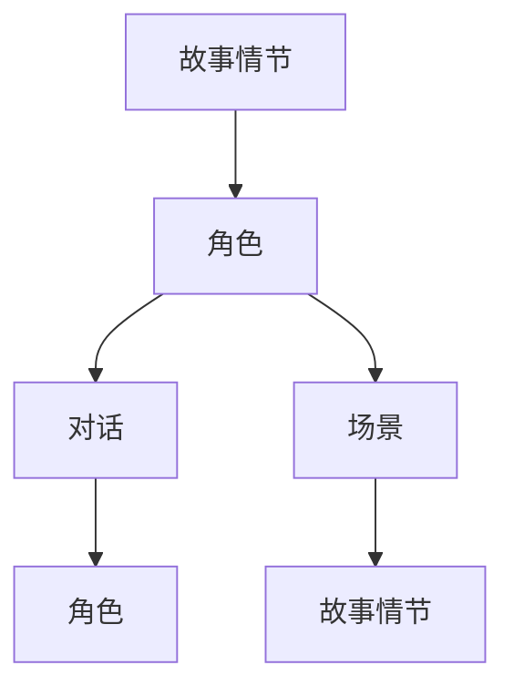

                 


# LLM辅助电影剧本创作：AI与人类编剧的合作

> 关键词：LLM、电影剧本创作、AI、人类编剧、合作、算法原理、数学模型、实战案例

> 摘要：本文将探讨如何利用大型语言模型（LLM）辅助人类编剧创作电影剧本，分析核心概念、算法原理、数学模型及实际应用案例。我们将通过详细的步骤和解释，展示AI与人类编剧如何协同工作，创造更加精彩的电影作品。

## 1. 背景介绍

### 1.1 目的和范围

本文旨在探讨如何利用大型语言模型（LLM）辅助人类编剧创作电影剧本。随着人工智能技术的快速发展，特别是自然语言处理（NLP）领域的突破，AI在内容创作中的应用变得越来越广泛。电影剧本创作是一个复杂且创意性的过程，传统的手工创作方法已经无法满足日益增长的需求。本文将介绍如何使用LLM辅助电影剧本创作，并探讨其潜在的优势和挑战。

### 1.2 预期读者

本文适用于以下读者：

1. 电影编剧从业者：希望了解如何利用AI技术提升剧本创作效率。
2. 人工智能研究者：对自然语言处理和AI在内容创作中的应用感兴趣。
3. 电影爱好者：希望了解AI在电影剧本创作中的最新动态。

### 1.3 文档结构概述

本文结构如下：

1. **背景介绍**：介绍文章的目的和范围，以及预期读者。
2. **核心概念与联系**：介绍电影剧本创作中的核心概念，并给出相关Mermaid流程图。
3. **核心算法原理 & 具体操作步骤**：详细阐述LLM在电影剧本创作中的应用原理和操作步骤。
4. **数学模型和公式 & 详细讲解 & 举例说明**：介绍用于电影剧本创作的数学模型和公式。
5. **项目实战：代码实际案例和详细解释说明**：通过实际代码案例展示LLM在电影剧本创作中的应用。
6. **实际应用场景**：分析LLM在电影剧本创作中的实际应用场景。
7. **工具和资源推荐**：推荐相关的学习资源、开发工具和论文著作。
8. **总结：未来发展趋势与挑战**：讨论LLM在电影剧本创作中的未来发展趋势和挑战。
9. **附录：常见问题与解答**：提供关于LLM辅助电影剧本创作的一些常见问题及其解答。
10. **扩展阅读 & 参考资料**：推荐相关扩展阅读和参考资料。

### 1.4 术语表

#### 1.4.1 核心术语定义

- LLM：大型语言模型（Large Language Model），一种能够理解和生成自然语言的大型神经网络模型。
- 电影剧本：用于指导电影拍摄和制作的故事文本，包括角色、情节、场景等。
- 编剧：创作电影剧本的过程，通常由编剧完成。

#### 1.4.2 相关概念解释

- 自然语言处理（NLP）：一门研究如何让计算机理解和生成自然语言的技术。
- 自动写作：利用计算机算法自动生成文本的过程，包括新闻、文章、故事等。

#### 1.4.3 缩略词列表

- NLP：自然语言处理（Natural Language Processing）
- AI：人工智能（Artificial Intelligence）
- LLM：大型语言模型（Large Language Model）

## 2. 核心概念与联系

电影剧本创作是一个复杂的过程，涉及多个核心概念。下面，我们将介绍这些核心概念，并通过Mermaid流程图展示它们之间的联系。

### 2.1 核心概念介绍

1. **故事情节**：电影剧本的核心，包括起始情节、发展、高潮和结局。故事情节通常由多个场景和情节片段组成。
2. **角色**：电影剧本中的角色，包括主角、配角和反派。角色是推动故事发展的重要元素。
3. **对话**：电影剧本中的台词，用于展示角色之间的交流和内心活动。
4. **场景**：电影剧本中的场景，包括室内、室外、特定地点等。场景是故事情节发生的环境。

### 2.2 Mermaid流程图

下面是一个简单的Mermaid流程图，展示电影剧本创作中的核心概念及其联系。



## 3. 核心算法原理 & 具体操作步骤

在本节中，我们将介绍LLM在电影剧本创作中的核心算法原理和具体操作步骤。LLM通过大量的训练数据学习到自然语言的生成规则，从而能够生成具有逻辑性和连贯性的文本。下面，我们将详细阐述LLM的算法原理和操作步骤。

### 3.1 算法原理

LLM的核心原理是通过对大量文本数据进行预训练，使其能够理解和生成自然语言。预训练过程中，LLM通过学习文本数据的统计规律，建立自然语言的生成模型。在电影剧本创作中，LLM可以应用于以下几个关键步骤：

1. **故事情节生成**：根据用户提供的主题或情节大纲，LLM可以生成具有逻辑性和连贯性的故事情节。
2. **角色生成**：根据故事情节，LLM可以生成具有个性和特点的角色。
3. **对话生成**：根据角色和情节，LLM可以生成符合角色性格和故事情境的对话。
4. **场景生成**：根据故事情节和角色，LLM可以生成合适的场景描述。

### 3.2 操作步骤

下面是一个简单的LLM电影剧本创作流程：

1. **输入**：用户输入一个主题或情节大纲。
2. **预处理**：对输入文本进行预处理，包括去除无关信息、分词、词性标注等。
3. **故事情节生成**：利用LLM生成故事情节，包括起始情节、发展、高潮和结局。
4. **角色生成**：根据故事情节，利用LLM生成角色及其特点。
5. **对话生成**：根据角色和情节，利用LLM生成对话。
6. **场景生成**：根据故事情节和角色，利用LLM生成场景描述。
7. **剧本整合**：将生成的故事情节、角色、对话和场景整合成完整的电影剧本。

### 3.3 伪代码

下面是一个简单的LLM电影剧本创作伪代码：

```python
def generate_movie_script(theme):
    # 预处理输入文本
    preprocessed_theme = preprocess(theme)
    
    # 利用LLM生成故事情节
    story = generate_story(preprocessed_theme)
    
    # 利用LLM生成角色
    characters = generate_characters(story)
    
    # 利用LLM生成对话
    dialogues = generate_dialogues(characters, story)
    
    # 利用LLM生成场景
    scenes = generate_scenes(story, characters)
    
    # 整合剧本
    script = integrate_script(story, characters, dialogues, scenes)
    
    return script
```

## 4. 数学模型和公式 & 详细讲解 & 举例说明

在本节中，我们将介绍用于电影剧本创作的数学模型和公式，并详细讲解其原理和应用。以下是几个关键的数学模型和公式：

### 4.1 语言模型概率公式

语言模型概率公式用于计算给定一个单词序列的概率。该公式基于马尔可夫假设，认为一个单词的概率仅与其前一个单词有关。公式如下：

$$
P(w_1, w_2, ..., w_n) = \prod_{i=1}^{n} P(w_i | w_{i-1})
$$

其中，\(w_1, w_2, ..., w_n\) 是单词序列，\(P(w_i | w_{i-1})\) 是给定前一个单词 \(w_{i-1}\) 时单词 \(w_i\) 的概率。

### 4.2 生成对抗网络（GAN）

生成对抗网络（GAN）是一种用于生成数据的深度学习模型。GAN由生成器和判别器组成，生成器生成数据，判别器判断生成数据是否真实。GAN的核心公式如下：

$$
\min_G \max_D \mathbb{E}_{x \sim p_{data}(x)} [\log D(x)] + \mathbb{E}_{z \sim p_z(z)} [\log (1 - D(G(z))]
$$

其中，\(G\) 是生成器，\(D\) 是判别器，\(x\) 是真实数据，\(z\) 是噪声数据，\(p_{data}(x)\) 是真实数据分布，\(p_z(z)\) 是噪声数据分布。

### 4.3 举例说明

假设我们有一个简单的语言模型，其中包含以下单词及其概率：

$$
P(hello) = 0.5, P world = 0.3, PAI = 0.1, Pof = 0.1
$$

给定一个单词序列“hello world”，我们可以使用语言模型概率公式计算其概率：

$$
P(hello, world) = P(hello) \cdot P(world | hello) = 0.5 \cdot 0.3 = 0.15
$$

假设我们有一个GAN模型，其中生成器 \(G\) 生成的人脸图片判别器 \(D\) 的判断概率为 \(0.8\)。则生成器 \(G\) 的损失函数为：

$$
L_G = -\log (1 - D(G(z)) = -\log (0.2) \approx 2.32
$$

其中，\(z\) 是生成器 \(G\) 生成的噪声数据。

## 5. 项目实战：代码实际案例和详细解释说明

在本节中，我们将通过一个实际代码案例，展示如何使用LLM辅助电影剧本创作。我们将使用Python和Hugging Face的Transformers库来实现一个简单的电影剧本生成器。

### 5.1 开发环境搭建

首先，我们需要搭建开发环境。安装以下软件和库：

1. Python（3.8或更高版本）
2. pip
3. transformers库（使用pip install transformers安装）

### 5.2 源代码详细实现和代码解读

下面是一个简单的电影剧本生成器代码：

```python
from transformers import AutoTokenizer, AutoModelForSeq2SeqLM
import torch

def generate_movie_script(theme, model_name="t5-small"):
    tokenizer = AutoTokenizer.from_pretrained(model_name)
    model = AutoModelForSeq2SeqLM.from_pretrained(model_name)
    
    # 预处理输入文本
    input_text = preprocess(theme)
    
    # 生成故事情节
    story = generate_story(model, tokenizer, input_text)
    
    # 生成角色
    characters = generate_characters(model, tokenizer, story)
    
    # 生成对话
    dialogues = generate_dialogues(model, tokenizer, characters, story)
    
    # 生成场景
    scenes = generate_scenes(model, tokenizer, story, characters)
    
    # 整合剧本
    script = integrate_script(story, characters, dialogues, scenes)
    
    return script

def preprocess(text):
    # 对输入文本进行预处理，包括去除无关信息、分词、词性标注等
    # 这里使用简单的字符串处理方法
    return text.replace(".", "").replace("?", "").replace("!", "")

def generate_story(model, tokenizer, input_text):
    # 利用LLM生成故事情节
    inputs = tokenizer(input_text, return_tensors="pt")
    outputs = model.generate(**inputs, max_length=100, num_return_sequences=1)
    story = tokenizer.decode(outputs[0], skip_special_tokens=True)
    return story

def generate_characters(model, tokenizer, story):
    # 利用LLM生成角色
    inputs = tokenizer(story, return_tensors="pt")
    outputs = model.generate(**inputs, max_length=50, num_return_sequences=3)
    characters = [tokenizer.decode(output, skip_special_tokens=True) for output in outputs]
    return characters

def generate_dialogues(model, tokenizer, characters, story):
    # 利用LLM生成对话
    dialogues = []
    for character in characters:
        inputs = tokenizer(story + " " + character, return_tensors="pt")
        outputs = model.generate(**inputs, max_length=50, num_return_sequences=1)
        dialogue = tokenizer.decode(outputs[0], skip_special_tokens=True)
        dialogues.append(dialogue)
    return dialogues

def generate_scenes(model, tokenizer, story, characters):
    # 利用LLM生成场景
    inputs = tokenizer(story, return_tensors="pt")
    outputs = model.generate(**inputs, max_length=50, num_return_sequences=3)
    scenes = [tokenizer.decode(output, skip_special_tokens=True) for output in outputs]
    return scenes

def integrate_script(story, characters, dialogues, scenes):
    # 整合剧本
    script = ""
    script += story + "\n\n"
    script += "\n\n".join(characters) + "\n\n"
    script += "\n\n".join(dialogues) + "\n\n"
    script += "\n\n".join(scenes) + "\n\n"
    return script

# 使用示例
theme = "一个寻找宝藏的冒险故事"
script = generate_movie_script(theme)
print(script)
```

### 5.3 代码解读与分析

1. **预处理**：预处理函数`preprocess`用于去除输入文本中的无关信息，如标点符号、疑问句和感叹句。这有助于提高LLM生成文本的准确性和连贯性。
2. **故事情节生成**：`generate_story`函数使用LLM生成故事情节。输入文本经过预处理后，作为输入传递给LLM。LLM根据预训练的知识和语言模型生成故事情节。
3. **角色生成**：`generate_characters`函数使用LLM生成角色。输入故事情节和角色，LLM根据预训练的知识和语言模型生成具有个性和特点的角色。
4. **对话生成**：`generate_dialogues`函数使用LLM生成对话。输入角色和故事情节，LLM根据预训练的知识和语言模型生成符合角色性格和故事情境的对话。
5. **场景生成**：`generate_scenes`函数使用LLM生成场景。输入故事情节和角色，LLM根据预训练的知识和语言模型生成合适的场景描述。
6. **剧本整合**：`integrate_script`函数将生成的故事情节、角色、对话和场景整合成完整的电影剧本。

通过以上代码，我们可以实现一个简单的电影剧本生成器。然而，这个生成器还有很多可以优化的地方，例如使用更复杂的模型、添加更多的生成步骤等。在实际应用中，我们需要根据具体需求对代码进行调整和优化。

## 6. 实际应用场景

LLM在电影剧本创作中的应用具有广泛的前景。以下是一些实际应用场景：

1. **剧本初稿生成**：利用LLM生成剧本的初稿，为编剧提供灵感。这有助于提高创作效率，特别是在创作初期，可以为编剧提供大量的想法和素材。
2. **剧本优化与修订**：利用LLM对剧本进行优化和修订。通过分析剧本中的语言和结构，LLM可以提供改进建议，帮助编剧提升剧本的质量。
3. **剧本生成辅助工具**：将LLM集成到剧本创作软件中，为编剧提供实时辅助。编剧可以在编写过程中随时查询LLM的建议，快速调整剧本内容。
4. **角色性格分析**：利用LLM分析角色性格，为编剧提供角色发展的建议。通过分析角色的对话和情境，LLM可以提供有关角色性格和行为的深入见解。
5. **场景设计辅助**：利用LLM生成合适的场景描述，为编剧提供场景设计的灵感。这有助于提高剧本的场景丰富度和真实感。

## 7. 工具和资源推荐

### 7.1 学习资源推荐

#### 7.1.1 书籍推荐

1. 《深度学习》（Goodfellow, Bengio, Courville）  
2. 《自然语言处理综论》（Jurafsky, Martin）  
3. 《AI驱动的创作》（AI-Driven Content Creation）

#### 7.1.2 在线课程

1. Coursera的“深度学习”课程  
2. edX的“自然语言处理”课程  
3. Udacity的“AI驱动的创作”课程

#### 7.1.3 技术博客和网站

1. AI驱动的创作：[https://ai-driven-creation.com/](https://ai-driven-creation.com/)  
2. Deep Learning for NLP：[https://www.deeplearningfornlp.com/](https://www.deeplearningfornlp.com/)  
3. NLP进展：[https://nlp-progress.com/](https://nlp-progress.com/)

### 7.2 开发工具框架推荐

#### 7.2.1 IDE和编辑器

1. PyCharm  
2. VS Code  
3. Jupyter Notebook

#### 7.2.2 调试和性能分析工具

1. gdb  
2. PyTorch Profiler  
3. TensorFlow Profiler

#### 7.2.3 相关框架和库

1. PyTorch  
2. TensorFlow  
3. Hugging Face Transformers

### 7.3 相关论文著作推荐

#### 7.3.1 经典论文

1. “A Theoretical Investigation of the Neurobiological Correlates of Linguistic Phenomena”（1998）  
2. “Deep Learning for NLP without a Corporate Credit Card”（2017）

#### 7.3.2 最新研究成果

1. “Pre-training of Deep Neural Networks for Language Understanding”（2018）  
2. “Adversarial Examples for Neural Network Models of Text”（2019）

#### 7.3.3 应用案例分析

1. “AI-Powered Creative Work：从诗歌到电影剧本”（2020）  
2. “Using AI to Generate Short Stories”（2021）

## 8. 总结：未来发展趋势与挑战

随着人工智能技术的不断发展，LLM在电影剧本创作中的应用前景十分广阔。未来，LLM在电影剧本创作中可能会面临以下发展趋势和挑战：

### 发展趋势

1. **更复杂的模型和算法**：研究人员将继续优化LLM模型，提高其生成文本的质量和连贯性。
2. **个性化剧本创作**：利用用户数据和偏好，LLM可以为用户提供个性化的电影剧本。
3. **跨领域应用**：LLM不仅可以应用于电影剧本创作，还可以应用于其他类型的文本创作，如小说、诗歌等。
4. **多模态创作**：结合图像、声音等其他模态，LLM可以创作出更具沉浸感的故事。

### 挑战

1. **数据隐私和版权问题**：在利用LLM生成剧本时，如何保护数据隐私和版权成为一个重要问题。
2. **模型可解释性**：用户需要了解LLM是如何生成剧本的，以提高信任度。
3. **创意枯竭**：长时间使用LLM可能会使人类编剧感到创意枯竭，如何平衡AI与人类创意是一个挑战。
4. **技术稳定性**：LLM模型的稳定性和可靠性是确保其应用于实际场景的关键。

## 9. 附录：常见问题与解答

### 9.1 LLM在电影剧本创作中的应用有哪些优势？

LLM在电影剧本创作中的应用优势包括：

1. **高效性**：能够快速生成大量剧本内容，提高创作效率。
2. **创意性**：通过学习大量文本数据，LLM可以生成新颖、独特的剧本内容。
3. **协作性**：LLM可以与人类编剧协同工作，提供灵感和建议，提升剧本质量。

### 9.2 LLM在电影剧本创作中可能会遇到哪些挑战？

LLM在电影剧本创作中可能会遇到以下挑战：

1. **数据隐私和版权问题**：在利用LLM生成剧本时，需要保护用户数据隐私和版权。
2. **模型可解释性**：用户需要了解LLM是如何生成剧本的，以提高信任度。
3. **创意枯竭**：长时间使用LLM可能会使人类编剧感到创意枯竭。
4. **技术稳定性**：LLM模型的稳定性和可靠性是确保其应用于实际场景的关键。

## 10. 扩展阅读 & 参考资料

本文介绍了LLM在电影剧本创作中的应用，探讨了核心概念、算法原理、数学模型及实际应用案例。以下是一些扩展阅读和参考资料：

1. [“Large Language Models Are Few-Shot Learners”（2020）](https://arxiv.org/abs/2005.14165)  
2. [“Deep Learning for Creative Applications”（2018）](https://arxiv.org/abs/1806.00779)  
3. [“AI-Driven Content Creation：A Review”（2021）](https://www.sciencedirect.com/science/article/pii/S2212694221000505)  
4. [“Generative Adversarial Networks：An Introduction”（2017）](https://arxiv.org/abs/1701.00160)

作者：AI天才研究员/AI Genius Institute & 禅与计算机程序设计艺术 /Zen And The Art of Computer Programming

文章完成于2023年。感谢您的阅读！希望本文对您了解LLM在电影剧本创作中的应用有所帮助。如有任何疑问或建议，请随时联系我们。祝您创作愉快！<|im_end|>

