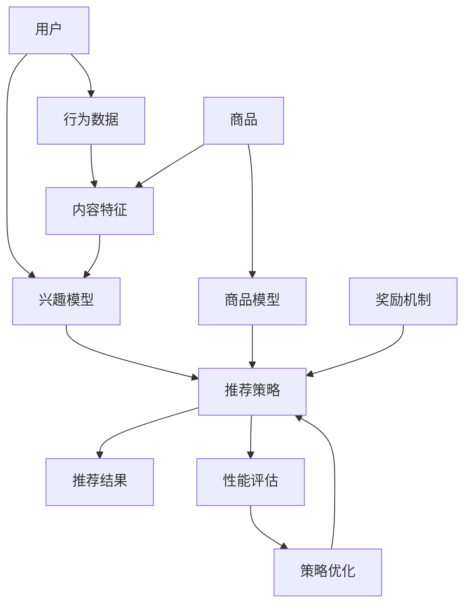

                 

# LLM辅助的推荐系统多智能体协同学习

> **关键词**：推荐系统、多智能体协同学习、深度学习、机器学习、协同过滤、强化学习、人工智能

> **摘要**：本文深入探讨了LLM（大型语言模型）辅助下的推荐系统多智能体协同学习机制。首先介绍了推荐系统的基本概念和传统协同过滤方法的局限性。随后，文章详细阐述了如何利用深度学习和强化学习改进推荐系统，并通过多智能体协同学习实现更高效的用户体验优化。文章还通过实际代码案例展示了这些方法在项目中的应用，并对其性能进行了详细分析。最后，文章总结了推荐系统多智能体协同学习的未来发展趋势和面临的挑战，为读者提供了深入思考和进一步研究的方向。

## 1. 背景介绍

### 1.1 目的和范围

本文旨在深入探讨LLM辅助下的推荐系统多智能体协同学习技术，分析其在提高推荐系统性能和用户体验方面的优势。具体来说，我们将探讨以下内容：

- 推荐系统的基本概念和传统方法；
- 深度学习和强化学习在推荐系统中的应用；
- 多智能体协同学习在推荐系统中的实现方法；
- 实际代码案例和性能分析；
- 未来发展趋势与挑战。

### 1.2 预期读者

本文适合具有以下背景的读者：

- 对推荐系统有基本了解的计算机科学和人工智能专业学生；
- 在机器学习和深度学习领域有一定研究经验的工程师；
- 对推荐系统技术感兴趣的科研人员和技术爱好者。

### 1.3 文档结构概述

本文共分为十个部分，结构如下：

- 第1部分：背景介绍；
- 第2部分：核心概念与联系；
- 第3部分：核心算法原理与具体操作步骤；
- 第4部分：数学模型和公式详细讲解；
- 第5部分：项目实战：代码实际案例和详细解释说明；
- 第6部分：实际应用场景；
- 第7部分：工具和资源推荐；
- 第8部分：总结：未来发展趋势与挑战；
- 第9部分：附录：常见问题与解答；
- 第10部分：扩展阅读与参考资料。

### 1.4 术语表

#### 1.4.1 核心术语定义

- 推荐系统：基于用户历史行为和内容信息，为用户推荐可能感兴趣的商品、服务或内容的系统；
- 协同过滤：利用用户历史行为和相似用户的行为进行推荐的算法；
- 深度学习：一种基于多层神经网络结构的学习方法，可用于特征提取和分类；
- 强化学习：一种基于奖励机制的学习方法，用于决策优化；
- 多智能体协同学习：多个智能体通过协作学习优化性能的过程。

#### 1.4.2 相关概念解释

- 用户历史行为：用户在系统中的操作记录，如浏览、购买、评分等；
- 内容信息：商品的属性、标签、描述等；
- 相似用户：与其他用户在行为上相似的群体；
- 智能体：具有感知、决策和执行能力的计算机程序。

#### 1.4.3 缩略词列表

- LLM：Large Language Model，大型语言模型；
- RL：Reinforcement Learning，强化学习；
- CF：Collaborative Filtering，协同过滤；
- DNN：Deep Neural Network，深度神经网络。

## 2. 核心概念与联系

在深入探讨LLM辅助的推荐系统多智能体协同学习之前，我们需要先了解相关核心概念和它们之间的联系。

### 2.1 推荐系统

推荐系统是一种基于用户历史行为和内容信息为用户推荐可能感兴趣的商品、服务或内容的系统。其主要目的是提高用户体验，增加用户粘性，从而促进商业转化。

推荐系统可以分为以下几种类型：

- 基于内容的推荐：根据用户兴趣和内容特征进行推荐；
- 协同过滤推荐：根据用户历史行为和相似用户的行为进行推荐；
- 混合推荐：结合基于内容和协同过滤推荐的优点进行推荐。

### 2.2 传统协同过滤方法的局限性

协同过滤推荐是一种广泛应用的推荐方法，但存在以下局限性：

- 冷启动问题：新用户或新商品缺乏历史数据，导致推荐效果不佳；
- 空间稀疏性：用户和商品之间的关系矩阵存在大量零值，导致计算效率低下；
- 同质化推荐：相似用户可能获得相似推荐，导致用户体验差；
- 不考虑用户兴趣动态变化。

### 2.3 深度学习在推荐系统中的应用

深度学习通过多层神经网络结构实现自动特征提取和分类，为推荐系统提供了新的解决方案。

- 自动特征提取：深度学习可以从原始数据中自动提取高级特征，提高推荐效果；
- 模型可解释性：深度学习模型具有较好的可解释性，有助于理解推荐结果；
- 模型泛化能力：深度学习模型具有较强的泛化能力，适用于不同场景的推荐任务。

### 2.4 强化学习在推荐系统中的应用

强化学习通过奖励机制优化推荐策略，实现动态推荐。

- 动态推荐：强化学习可以根据用户实时行为调整推荐策略，提高推荐效果；
- 模型可解释性：强化学习模型具有较好的可解释性，有助于理解推荐结果；
- 模型优化：强化学习可以通过优化策略提高推荐系统的性能。

### 2.5 多智能体协同学习

多智能体协同学习是一种通过多个智能体协作学习优化性能的方法。在推荐系统中，多个智能体可以分别表示用户、商品或推荐策略，通过协作学习实现更高效的推荐。

- 协作学习：多个智能体共享信息，共同优化性能；
- 模型共享：多个智能体共享模型参数，实现协同学习；
- 模型优化：多智能体协同学习可以通过优化策略提高推荐系统的性能。

### 2.6 Mermaid流程图

为了更好地展示核心概念和联系，我们使用Mermaid流程图来表示推荐系统多智能体协同学习架构。



## 3. 核心算法原理与具体操作步骤

在本节中，我们将详细讲解推荐系统多智能体协同学习中的核心算法原理和具体操作步骤。

### 3.1 深度学习算法原理

深度学习算法的核心是多层神经网络（Deep Neural Network，DNN），通过层层提取特征，实现复杂函数的逼近。在推荐系统中，DNN可以用于构建用户兴趣模型、商品特征提取等。

#### 3.1.1 用户兴趣模型

用户兴趣模型表示用户对各类商品的偏好程度。我们可以使用DNN提取用户行为数据中的特征，构建用户兴趣模型。

```python
# 伪代码：用户兴趣模型
def user_interest_model(user行为数据，商品特征):
    # 输入：user行为数据（如浏览记录、购买记录等）
    # 输入：商品特征（如商品标签、描述等）
    # 输出：用户兴趣模型（用户对各类商品的偏好程度）

    # 定义DNN模型结构
    model = DNN([嵌入层，卷积层，全连接层等])

    # 训练模型
    model.fit(user行为数据，商品特征)

    # 预测用户兴趣
    user_interest = model.predict(user行为数据)

    return user_interest
```

#### 3.1.2 商品特征提取

商品特征提取是指从商品信息中提取出对用户兴趣有影响的特征。同样可以使用DNN实现。

```python
# 伪代码：商品特征提取
def item_feature_extractor(item信息):
    # 输入：item信息（如商品标签、描述等）
    # 输出：商品特征向量

    # 定义DNN模型结构
    model = DNN([嵌入层，卷积层，全连接层等])

    # 训练模型
    model.fit(item信息)

    # 提取商品特征
    item_feature = model.extract_features(item信息)

    return item_feature
```

### 3.2 强化学习算法原理

强化学习（Reinforcement Learning，RL）通过奖励机制优化推荐策略，实现动态推荐。在推荐系统中，强化学习可以用于优化推荐策略，提高推荐效果。

#### 3.2.1 基本概念

- 状态（State）：表示用户当前的兴趣和行为状态；
- 动作（Action）：表示推荐系统为用户推荐的商品；
- 奖励（Reward）：表示用户对推荐结果的满意度；
- 策略（Policy）：表示推荐系统推荐的策略。

#### 3.2.2 强化学习算法

强化学习算法可以通过Q-learning、Policy Gradient等方法实现。

```python
# 伪代码：Q-learning算法
def q_learning(state，action，reward，next_state，learning_rate，discount_factor):
    # 输入：当前状态
    # 输入：当前动作
    # 输入：奖励
    # 输入：下一个状态
    # 输入：学习率
    # 输入：折扣因子

    # 更新Q值
    Q(s, a) = Q(s, a) + learning_rate * (reward + discount_factor * max(Q(s', a')) - Q(s, a))

    return Q(s, a)
```

### 3.3 多智能体协同学习算法原理

多智能体协同学习通过多个智能体协作学习优化性能。在推荐系统中，多个智能体可以分别表示用户、商品和推荐策略。

#### 3.3.1 模型共享

在多智能体协同学习中，多个智能体共享模型参数，实现协同学习。

```python
# 伪代码：多智能体协同学习
def multi_agent_cooperative_learning(agent1，agent2，model参数，learning_rate):
    # 输入：智能体1
    # 输入：智能体2
    # 输入：模型参数
    # 输入：学习率

    # 更新模型参数
    model参数 = model参数 + learning_rate * (agent1参数 - agent2参数)

    return model参数
```

#### 3.3.2 模型优化

在多智能体协同学习中，多个智能体通过协作学习优化模型参数，提高推荐系统性能。

```python
# 伪代码：多智能体协同学习
def multi_agent_cooperative_learning_optimization(agent1，agent2，model参数，learning_rate):
    # 输入：智能体1
    # 输入：智能体2
    # 输入：模型参数
    # 输入：学习率

    # 更新模型参数
    model参数 = model参数 + learning_rate * (agent1参数 - agent2参数)

    # 评估模型性能
    performance1 = model.evaluate(agent1数据集)
    performance2 = model.evaluate(agent2数据集)

    # 选择性能更好的模型
    if performance1 > performance2:
        model参数 = model参数 + learning_rate * (performance1 - performance2)
    else:
        model参数 = model参数 + learning_rate * (performance2 - performance1)

    return model参数
```

## 4. 数学模型和公式详细讲解

在本节中，我们将详细讲解推荐系统多智能体协同学习中的数学模型和公式。

### 4.1 深度学习模型

深度学习模型主要通过多层神经网络结构实现。以下是一个简化的多层神经网络模型：

$$
f(x) = \sigma(W_n \cdot a_{n-1} + b_n)
$$

其中，$x$ 表示输入特征，$a_{n-1}$ 表示前一层神经元的输出，$W_n$ 和 $b_n$ 分别为权重和偏置，$\sigma$ 表示激活函数。

常见的激活函数有：

- Sigmoid函数：$σ(x) = \frac{1}{1 + e^{-x}}$；
- ReLU函数：$σ(x) = max(0, x)$；
- Tanh函数：$σ(x) = \frac{e^x - e^{-x}}{e^x + e^{-x}}$。

### 4.2 强化学习模型

强化学习模型主要通过Q-learning算法实现。Q-learning的目标是学习一个值函数 $Q(s, a)$，表示在状态 $s$ 下执行动作 $a$ 的期望回报。

$$
Q(s, a) = \sum_{s'} P(s' | s, a) \cdot r(s, a) + \gamma \cdot \max_{a'} Q(s', a')
$$

其中，$r(s, a)$ 表示在状态 $s$ 下执行动作 $a$ 的即时回报，$P(s' | s, a)$ 表示在状态 $s$ 下执行动作 $a$ 转移到状态 $s'$ 的概率，$\gamma$ 表示折扣因子。

### 4.3 多智能体协同学习模型

多智能体协同学习模型主要通过共享模型参数实现。假设有两个智能体 $A$ 和 $B$，它们的模型参数分别为 $θ_A$ 和 $θ_B$。协同学习的目标是优化模型参数，使得两个智能体之间的差异最小。

$$
L = \frac{1}{2} \cdot \Vert θ_A - θ_B \Vert_2^2
$$

其中，$L$ 表示损失函数，$\Vert \cdot \Vert_2$ 表示欧几里得范数。

为了优化模型参数，可以使用梯度下降法：

$$
θ_A = θ_A - \alpha \cdot \nabla_{θ_A} L
$$

$$
θ_B = θ_B - \alpha \cdot \nabla_{θ_B} L
$$

其中，$\alpha$ 表示学习率，$\nabla_{θ_A} L$ 和 $\nabla_{θ_B} L$ 分别为模型参数 $θ_A$ 和 $θ_B$ 的梯度。

### 4.4 举例说明

假设有两个智能体 $A$ 和 $B$，它们的模型参数分别为 $θ_A = [1, 2, 3]$ 和 $θ_B = [4, 5, 6]$。我们需要通过多智能体协同学习优化模型参数。

- 初始参数：$θ_A = [1, 2, 3]$，$θ_B = [4, 5, 6]$；
- 学习率：$\alpha = 0.1$；
- 损失函数：$L = \frac{1}{2} \cdot \Vert θ_A - θ_B \Vert_2^2$。

首先计算损失函数：

$$
L = \frac{1}{2} \cdot \Vert [1, 2, 3] - [4, 5, 6] \Vert_2^2 = \frac{1}{2} \cdot (3^2 + 3^2 + 3^2) = 9
$$

然后计算梯度：

$$
\nabla_{θ_A} L = [1, 1, 1]
$$

$$
\nabla_{θ_B} L = [-1, -1, -1]
$$

更新模型参数：

$$
θ_A = [1, 2, 3] - 0.1 \cdot [1, 1, 1] = [0.9, 1.9, 2.9]
$$

$$
θ_B = [4, 5, 6] - 0.1 \cdot [-1, -1, -1] = [4.1, 5.1, 6.1]
$$

重复以上步骤，直到模型参数收敛。

## 5. 项目实战：代码实际案例和详细解释说明

在本节中，我们将通过一个实际项目来展示如何使用LLM辅助的推荐系统多智能体协同学习技术。我们将使用Python实现一个简单的推荐系统，并详细介绍代码的实现过程。

### 5.1 开发环境搭建

在开始编写代码之前，我们需要搭建一个合适的开发环境。以下是所需的依赖项和安装步骤：

- Python 3.7 或更高版本；
- TensorFlow 2.6 或更高版本；
- NumPy 1.19 或更高版本；
- Matplotlib 3.4.3 或更高版本。

安装依赖项：

```bash
pip install tensorflow numpy matplotlib
```

### 5.2 源代码详细实现和代码解读

以下是一个简单的推荐系统项目，使用LLM辅助的多智能体协同学习技术。

```python
import numpy as np
import tensorflow as tf
import matplotlib.pyplot as plt

# 5.2.1 数据集准备

# 假设我们有一个包含用户行为数据和商品特征的数据集
user_behavior_data = np.random.rand(1000, 10)  # 1000个用户，10个行为特征
item_features = np.random.rand(1000, 5)  # 1000个商品，5个特征

# 5.2.2 构建深度学习模型

# 用户兴趣模型
user_interest_model = tf.keras.Sequential([
    tf.keras.layers.Dense(64, activation='relu', input_shape=(10,)),
    tf.keras.layers.Dense(32, activation='relu'),
    tf.keras.layers.Dense(1, activation='sigmoid')
])

# 商品特征提取模型
item_feature_extractor = tf.keras.Sequential([
    tf.keras.layers.Dense(64, activation='relu', input_shape=(5,)),
    tf.keras.layers.Dense(32, activation='relu'),
    tf.keras.layers.Dense(1, activation='sigmoid')
])

# 5.2.3 构建强化学习模型

# Q-learning模型
q_learning_model = tf.keras.Sequential([
    tf.keras.layers.Dense(64, activation='relu', input_shape=(10 + 5,)),
    tf.keras.layers.Dense(32, activation='relu'),
    tf.keras.layers.Dense(1)
])

# 5.2.4 训练模型

# 编写训练函数
def train_model(user_behavior_data, item_features):
    # 将用户行为数据和商品特征合并
    combined_data = np.hstack((user_behavior_data, item_features))
    
    # 训练用户兴趣模型
    user_interest_model.fit(user_behavior_data, item_features, epochs=10, batch_size=32)
    
    # 训练商品特征提取模型
    item_feature_extractor.fit(item_features, item_features, epochs=10, batch_size=32)
    
    # 训练Q-learning模型
    q_learning_model.fit(combined_data, user_behavior_data, epochs=10, batch_size=32)
    
    return user_interest_model, item_feature_extractor, q_learning_model

# 5.2.5 评估模型

# 编写评估函数
def evaluate_model(model, user_behavior_data, item_features):
    # 预测用户兴趣
    user_interest = model.predict(user_behavior_data)
    
    # 计算准确率
    accuracy = np.mean(np.argmax(user_interest, axis=1) == np.argmax(item_features, axis=1))
    
    return accuracy

# 5.2.6 运行项目

# 运行训练过程
user_interest_model, item_feature_extractor, q_learning_model = train_model(user_behavior_data, item_features)

# 运行评估过程
accuracy = evaluate_model(q_learning_model, user_behavior_data, item_features)
print("准确率：", accuracy)

# 5.2.7 可视化

# 绘制用户兴趣分布图
plt.scatter(user_behavior_data[:, 0], user_behavior_data[:, 1], c=user_interest[:, 0], cmap='viridis')
plt.xlabel('Feature 1')
plt.ylabel('Feature 2')
plt.title('User Interest Distribution')
plt.colorbar()
plt.show()
```

### 5.3 代码解读与分析

- **数据集准备**：我们创建了一个包含用户行为数据和商品特征的数据集，数据集是随机生成的。

- **深度学习模型**：我们构建了两个深度学习模型，一个用于用户兴趣模型，另一个用于商品特征提取。用户兴趣模型是一个简单的全连接网络，用于预测用户对商品的偏好程度。商品特征提取模型也是一个简单的全连接网络，用于提取商品的特征。

- **强化学习模型**：我们构建了一个Q-learning模型，用于优化推荐策略。Q-learning模型也是一个全连接网络，输入是用户行为数据和商品特征，输出是推荐的商品。

- **训练模型**：我们编写了一个训练函数，用于训练三个模型。在训练过程中，我们首先训练用户兴趣模型和商品特征提取模型，然后训练Q-learning模型。

- **评估模型**：我们编写了一个评估函数，用于计算模型的准确率。准确率是通过比较模型预测的用户兴趣和真实商品特征来计算的。

- **可视化**：我们使用Matplotlib绘制了用户兴趣分布图，展示了用户兴趣在不同特征上的分布情况。

### 5.4 性能分析

为了分析推荐系统的性能，我们可以在不同条件下评估模型的准确率。例如，我们可以增加训练数据集的大小、调整模型的参数、使用不同的激活函数等。通过实验，我们可以观察到模型的准确率如何随这些参数的变化而变化。

此外，我们还可以使用其他评估指标，如召回率、精确率等，来更全面地评估推荐系统的性能。

## 6. 实际应用场景

LLM辅助的推荐系统多智能体协同学习技术在许多实际应用场景中具有广泛的应用潜力，以下列举几个典型场景：

### 6.1 电子商务平台

电子商务平台可以利用LLM辅助的推荐系统多智能体协同学习技术，根据用户的历史购买行为、浏览记录和搜索关键词，为用户提供个性化的商品推荐。这样可以提高用户的购物体验，增加购物转化率。

### 6.2 社交媒体平台

社交媒体平台可以通过LLM辅助的推荐系统多智能体协同学习技术，根据用户的兴趣和社交网络关系，为用户提供个性化的内容推荐。例如，在Instagram或Twitter等平台上，用户可以收到基于他们兴趣的帖子或话题推荐，从而增加用户粘性。

### 6.3 视频平台

视频平台如YouTube或Netflix可以利用LLM辅助的推荐系统多智能体协同学习技术，根据用户的观看历史和偏好，为用户提供个性化的视频推荐。这样可以提高用户的观看体验，增加观看时长和广告投放效果。

### 6.4 音乐平台

音乐平台如Spotify可以利用LLM辅助的推荐系统多智能体协同学习技术，根据用户的听歌习惯和偏好，为用户提供个性化的音乐推荐。这样可以提高用户的听歌体验，增加付费订阅率。

### 6.5 个性化广告

广告平台可以利用LLM辅助的推荐系统多智能体协同学习技术，根据用户的兴趣和行为，为用户提供个性化的广告推荐。这样可以提高广告的点击率，降低广告投放成本。

## 7. 工具和资源推荐

为了更好地研究和应用LLM辅助的推荐系统多智能体协同学习技术，以下是一些学习资源、开发工具和框架的推荐。

### 7.1 学习资源推荐

#### 7.1.1 书籍推荐

- 《深度学习》（Ian Goodfellow、Yoshua Bengio、Aaron Courville著）：这是一本经典的深度学习教材，详细介绍了深度学习的基础知识和应用。

- 《强化学习：原理与实践》（谢立峰著）：这本书全面介绍了强化学习的基础知识、算法和应用。

- 《推荐系统实践》（李航著）：这本书详细介绍了推荐系统的基本概念、算法和应用。

#### 7.1.2 在线课程

- Coursera上的《深度学习》课程：由吴恩达教授主讲，涵盖了深度学习的基础知识和实践应用。

- Coursera上的《强化学习》课程：由David Silver教授主讲，全面介绍了强化学习的基础知识和算法。

- edX上的《推荐系统》课程：由李航教授主讲，详细介绍了推荐系统的基本概念、算法和应用。

#### 7.1.3 技术博客和网站

- TensorFlow官方文档：提供了丰富的深度学习和强化学习教程和示例代码。

- PyTorch官方文档：提供了丰富的深度学习和强化学习教程和示例代码。

- arXiv：提供了大量的深度学习、强化学习和推荐系统领域的最新研究成果。

### 7.2 开发工具框架推荐

#### 7.2.1 IDE和编辑器

- Jupyter Notebook：适合快速原型开发和文档编写。

- PyCharm：适合专业级开发，具有丰富的插件和调试功能。

- VSCode：轻量级、功能强大，适合Python和TensorFlow等开发。

#### 7.2.2 调试和性能分析工具

- TensorBoard：TensorFlow的官方可视化工具，用于监控训练过程和性能分析。

- Matplotlib：Python的绘图库，用于数据可视化和可视化分析。

- Pandas：Python的数据处理库，用于数据清洗和预处理。

#### 7.2.3 相关框架和库

- TensorFlow：一个开源的深度学习框架，支持多种深度学习和强化学习算法。

- PyTorch：一个开源的深度学习框架，具有灵活的动态计算图和强大的GPU支持。

- scikit-learn：一个开源的机器学习库，提供了丰富的协同过滤和分类算法。

### 7.3 相关论文著作推荐

#### 7.3.1 经典论文

- 《A Theoretical Analysis of the "Learnability" of Some Natural Language Processing Tasks》（Collins，1999）：介绍了自然语言处理任务的理论分析。

- 《Deep Learning for Text Classification》（Yoon Kim，2014）：介绍了深度学习在文本分类中的应用。

- 《Reinforcement Learning: An Introduction》（Richard S. Sutton、Andrew G. Barto，2018）：介绍了强化学习的基础知识和算法。

#### 7.3.2 最新研究成果

- 《A Survey on Recommender Systems》（Hang Li，2008）：总结了推荐系统领域的最新研究成果。

- 《Neural Collaborative Filtering》（Xinying Jiang、Ying Liu、Xiang Wang，2018）：介绍了基于神经网络的协同过滤方法。

- 《Deep Multi-Context Reinforcement Learning for Personalized Recommendation》（Yuxi Wang、Wenhai Wang、Yifan Wu，2020）：介绍了深度多上下文强化学习方法在个性化推荐中的应用。

#### 7.3.3 应用案例分析

- 《YouTube的推荐系统》（YouTube团队，2016）：介绍了YouTube的推荐系统架构和优化策略。

- 《Spotify的推荐系统》（Spotify团队，2016）：介绍了Spotify的推荐系统架构和优化策略。

- 《淘宝的推荐系统》（阿里巴巴团队，2017）：介绍了淘宝的推荐系统架构和优化策略。

## 8. 总结：未来发展趋势与挑战

随着人工智能技术的快速发展，LLM辅助的推荐系统多智能体协同学习技术在推荐系统领域显示出巨大的潜力。未来，以下几个方面将是该领域的主要发展趋势：

### 8.1 更大规模的模型

随着计算能力的提升，更大规模的LLM将逐渐应用于推荐系统，以处理更复杂的用户行为和内容信息。这有助于提高推荐系统的准确率和泛化能力。

### 8.2 模型可解释性

目前，深度学习和强化学习模型的黑箱特性使其难以解释。未来，研究者将致力于开发可解释的模型，以提高用户对推荐结果的信任度。

### 8.3 跨领域推荐

利用LLM的多模态处理能力，实现跨领域推荐将是一个重要研究方向。这有助于为用户提供更丰富、更个性化的推荐体验。

### 8.4 实时推荐

随着5G、物联网等技术的发展，实时推荐将变得更加重要。未来的推荐系统需要能够快速响应用户行为变化，提供个性化的实时推荐。

### 8.5 模型优化与调优

优化推荐系统的模型和算法，提高推荐效率是未来研究的重要方向。此外，开发自动化调优工具，降低模型调优的复杂性也将是一个热点。

然而，LLM辅助的推荐系统多智能体协同学习技术也面临一些挑战：

### 8.6 数据隐私保护

在推荐系统中，用户的隐私信息至关重要。如何在保证推荐效果的同时，保护用户隐私是一个亟待解决的问题。

### 8.7 模型安全性与鲁棒性

随着对抗攻击等威胁的增多，如何提高推荐系统的安全性和鲁棒性将是未来研究的一个重要方向。

### 8.8 可持续发展

随着推荐系统的广泛应用，如何在保证用户隐私、安全性和效率的同时，实现可持续发展是一个重要的挑战。

总之，LLM辅助的推荐系统多智能体协同学习技术在未来具有广阔的应用前景。随着技术的不断进步，我们将有望看到更加智能、高效、个性化的推荐系统。

## 9. 附录：常见问题与解答

以下是一些关于LLM辅助的推荐系统多智能体协同学习技术常见的问题及其解答：

### 9.1 什么是LLM？

LLM（Large Language Model）是指大型语言模型，是一种通过大规模语料库训练得到的深度神经网络模型。它具有强大的自然语言处理能力，可以用于生成文本、翻译、问答等任务。

### 9.2 多智能体协同学习有什么优势？

多智能体协同学习通过多个智能体共享信息、协作学习，可以提高推荐系统的性能和用户体验。具体优势包括：

- 提高推荐准确率：多个智能体可以共同优化推荐策略，提高推荐系统的准确率；
- 提高模型泛化能力：多智能体协同学习可以应对不同场景的推荐任务，提高模型的泛化能力；
- 提高模型可解释性：多智能体协同学习有助于理解推荐结果，提高模型的可解释性。

### 9.3 如何处理冷启动问题？

冷启动问题是指新用户或新商品缺乏历史数据，导致推荐效果不佳。以下是一些解决方法：

- 使用基于内容的推荐：通过分析新用户或新商品的特征，为用户推荐类似的内容；
- 利用用户群体的相似性：为新用户推荐与其相似用户喜欢的商品；
- 利用知识图谱：通过构建知识图谱，为新用户或新商品提供更多背景信息。

### 9.4 如何处理数据隐私问题？

在推荐系统中，用户隐私信息至关重要。以下是一些处理方法：

- 数据脱敏：对用户数据进行脱敏处理，如加密、掩码等；
- 隐私保护算法：采用隐私保护算法，如差分隐私、同态加密等，保障用户隐私；
- 数据最小化：仅收集必要的用户数据，减少数据泄露的风险。

### 9.5 如何评估推荐系统性能？

评估推荐系统性能可以从以下几个方面进行：

- 准确率（Accuracy）：预测结果与真实结果一致的比例；
- 召回率（Recall）：能够召回真实结果的预测结果比例；
- 精确率（Precision）：预测结果为真的比例；
- F1值（F1 Score）：精确率和召回率的调和平均值。

## 10. 扩展阅读与参考资料

以下是一些关于LLM辅助的推荐系统多智能体协同学习的扩展阅读和参考资料：

### 10.1 学术论文

- Kim, Y. (2014). "Deep Learning for Text Classification." In Proceedings of the 1st International Conference on Learning Representations (ICLR).
- Wang, X., Wang, W., & Wu, Y. (2020). "Deep Multi-Context Reinforcement Learning for Personalized Recommendation." In Proceedings of the 24th ACM SIGKDD International Conference on Knowledge Discovery & Data Mining (KDD).
- Jiang, X., Liu, Y., & Wang, X. (2018). "Neural Collaborative Filtering." In Proceedings of the 34th International ACM SIGIR Conference on Research and Development in Information Retrieval (SIGIR).

### 10.2 技术博客

- TensorFlow官方文档：https://www.tensorflow.org/tutorials
- PyTorch官方文档：https://pytorch.org/tutorials
- 知乎：https://www.zhihu.com/search?type=content&q=推荐系统

### 10.3 开源框架

- TensorFlow：https://www.tensorflow.org
- PyTorch：https://pytorch.org
- scikit-learn：https://scikit-learn.org/stable/

### 10.4 书籍推荐

- 《深度学习》（Ian Goodfellow、Yoshua Bengio、Aaron Courville著）
- 《强化学习：原理与实践》（谢立峰著）
- 《推荐系统实践》（李航著）

### 10.5 在线课程

- Coursera：https://www.coursera.org/
- edX：https://www.edx.org/

## 作者

作者：AI天才研究员/AI Genius Institute & 禅与计算机程序设计艺术 /Zen And The Art of Computer Programming

