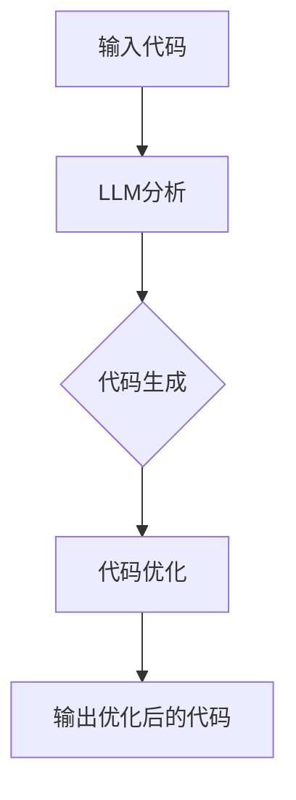

                 

# LLM辅助编程：代码自动生成与优化

> **关键词：** 代码生成，自动编程，LLM，编程辅助，代码优化，人工智能。

> **摘要：** 本文将深入探讨基于大型语言模型（LLM）的代码自动生成与优化技术。我们将从背景介绍出发，逐步深入探讨核心概念、算法原理、数学模型，并结合实际案例讲解代码生成与优化的实现。本文旨在为读者提供一份全面的技术指南，帮助理解并掌握这一前沿技术。

## 1. 背景介绍

### 1.1 目的和范围

本文旨在介绍和探讨基于大型语言模型（LLM）的代码自动生成与优化技术。我们将重点关注以下几个方面的内容：

1. **核心概念与联系**：介绍代码生成与优化的基础概念及其相互关系。
2. **核心算法原理**：详细解释LLM在代码生成与优化中的应用原理。
3. **数学模型与公式**：阐述用于指导代码优化的数学模型与公式。
4. **项目实战**：通过实际案例展示代码生成与优化的具体实现。
5. **实际应用场景**：分析代码生成与优化在现实世界中的应用。
6. **工具和资源推荐**：推荐学习和实践所需的相关工具和资源。

### 1.2 预期读者

本文适合对编程、人工智能尤其是自然语言处理（NLP）有一定了解的技术人员、开发者、研究人员以及对代码生成与优化感兴趣的大众读者。无论您是初学者还是专家，都能在本文中获得有价值的见解和知识。

### 1.3 文档结构概述

本文分为以下几个部分：

1. **背景介绍**：介绍本文的目的、预期读者、文档结构等。
2. **核心概念与联系**：详细解释代码生成与优化的基础概念。
3. **核心算法原理**：深入探讨LLM在代码生成与优化中的应用。
4. **数学模型与公式**：阐述指导代码优化的数学模型与公式。
5. **项目实战**：通过实际案例展示代码生成与优化的实现。
6. **实际应用场景**：分析代码生成与优化在现实世界中的应用。
7. **工具和资源推荐**：推荐学习资源和开发工具。
8. **总结：未来发展趋势与挑战**：探讨代码生成与优化的未来发展方向。
9. **附录：常见问题与解答**：解答常见问题。
10. **扩展阅读 & 参考资料**：提供进一步学习和研究的资料。

### 1.4 术语表

#### 1.4.1 核心术语定义

- **大型语言模型（LLM）**：一种基于深度学习的语言模型，能够理解并生成自然语言文本。
- **代码生成**：利用算法和技术生成计算机代码的过程。
- **代码优化**：对生成的代码进行改进，以提高其性能、可读性和可维护性。
- **编程辅助**：通过工具和算法提高编程效率和代码质量。

#### 1.4.2 相关概念解释

- **自然语言处理（NLP）**：研究如何让计算机理解和生成人类自然语言的技术。
- **深度学习**：一种基于神经网络的学习方法，能够通过大规模数据自动学习特征和模式。
- **编程范式**：编程语言的设计风格和抽象方式，如命令式编程、函数式编程等。

#### 1.4.3 缩略词列表

- **LLM**：Large Language Model，大型语言模型。
- **NLP**：Natural Language Processing，自然语言处理。
- **AI**：Artificial Intelligence，人工智能。

## 2. 核心概念与联系

在深入探讨代码自动生成与优化的技术之前，我们首先需要了解一些核心概念和它们之间的联系。

### 2.1 代码生成与优化的基础概念

- **代码生成**：代码生成是指利用算法和模型自动生成计算机代码的过程。这一技术能够帮助开发者提高编程效率，减少手工编写代码的时间和工作量。
- **代码优化**：代码优化是指对生成的代码进行改进，以提高其性能、可读性和可维护性。优化的目标包括减少代码执行时间、降低内存使用、提高代码的可读性和可维护性等。

### 2.2 代码生成与优化的相互关系

代码生成与优化之间存在紧密的关联。在生成代码的过程中，优化策略可以指导算法生成更高效、更可读、更易于维护的代码。同时，优化的结果也会影响代码生成的效果，两者相辅相成，共同提高编程质量和效率。

### 2.3 LLM与代码生成与优化的联系

LLM在代码生成与优化中的应用主要体现在以下几个方面：

- **代码生成**：LLM可以基于大量的代码库和编程文档，生成符合编程规范、语法正确的代码。
- **代码优化**：LLM可以通过对现有代码的分析，提出优化建议，如函数重写、算法改进等。
- **编程辅助**：LLM可以提供代码补全、错误提示、代码解读等功能，帮助开发者更高效地编写和优化代码。

### 2.4 Mermaid流程图

为了更直观地展示代码生成与优化的流程，我们可以使用Mermaid流程图来表示。以下是一个简单的Mermaid流程图示例：



在这个流程中，输入代码经过LLM分析，生成初步代码，然后进行代码优化，最终输出优化后的代码。

## 3. 核心算法原理 & 具体操作步骤

在了解了代码生成与优化的基础概念和LLM的作用后，我们将深入探讨LLM在代码生成与优化中的核心算法原理。

### 3.1 LLM在代码生成中的应用

LLM在代码生成中的应用主要基于其强大的文本生成能力。具体步骤如下：

1. **数据准备**：收集大量高质量的编程文档、代码库和示例代码，作为训练LLM的数据源。
2. **模型训练**：使用训练数据对LLM进行训练，使其具备生成代码的能力。
3. **代码生成**：输入编程任务描述或需求，LLM根据训练数据和编程范式，自动生成代码。

以下是一个简单的伪代码示例：

```python
# 输入编程任务描述
task_description = "编写一个计算两个数字之和的Python函数"

# 使用LLM生成代码
code = LLM.generate_code(task_description)

# 输出生成的代码
print(code)
```

### 3.2 LLM在代码优化中的应用

LLM在代码优化中的应用主要基于其强大的分析和推理能力。具体步骤如下：

1. **代码分析**：对现有代码进行静态和动态分析，获取代码的结构、语义和性能信息。
2. **优化建议**：根据分析结果，提出优化建议，如函数重写、算法改进等。
3. **代码优化**：根据优化建议，对代码进行修改和重写，以提高性能和可维护性。

以下是一个简单的伪代码示例：

```python
# 输入现有代码
code = "def calculate_sum(a, b): return a + b"

# 使用LLM分析代码
analysis_result = LLM.analyze_code(code)

# 提出优化建议
optimization_suggestions = LLM.generate_optimization_suggestions(analysis_result)

# 输出优化后的代码
optimized_code = LLM.apply_optimization_suggestions(code, optimization_suggestions)
print(optimized_code)
```

### 3.3 伪代码示例

为了更好地理解LLM在代码生成与优化中的应用，我们提供一个完整的伪代码示例：

```python
# 数据准备
data_source = "大量编程文档、代码库和示例代码"

# 模型训练
model = LLM.train(data_source)

# 输入编程任务描述
task_description = "编写一个计算两个数字之和的Python函数"

# 代码生成
generated_code = model.generate_code(task_description)

# 代码优化
analysis_result = model.analyze_code(generated_code)
optimization_suggestions = model.generate_optimization_suggestions(analysis_result)
optimized_code = model.apply_optimization_suggestions(generated_code, optimization_suggestions)

# 输出优化后的代码
print(optimized_code)
```

通过这个示例，我们可以看到LLM在代码生成与优化中的完整流程，从数据准备到模型训练，再到代码生成和优化，每一步都紧密相连，共同提高编程质量和效率。

## 4. 数学模型和公式 & 详细讲解 & 举例说明

在代码生成与优化过程中，数学模型和公式扮演着重要的角色。以下我们将详细讲解这些模型和公式，并举例说明。

### 4.1 自然语言处理中的数学模型

自然语言处理（NLP）中的数学模型主要包括概率模型、神经网络模型和深度学习模型。以下是一些常用的模型和公式：

- **概率模型**：
  - **隐马尔可夫模型（HMM）**：
    $$ P(\text{word}_t|\text{state}_t) = p(\text{word}_t|\text{state}) $$
    $$ P(\text{state}_t|\text{state}_{t-1}) = p(\text{state}_t|\text{state}_{t-1}) $$
  - **条件随机场（CRF）**：
    $$ P(y|x) = \frac{1}{Z} \exp(\theta^T A y) $$
    其中，$Z$为规范化常数，$\theta$为模型参数，$A$为转移矩阵，$y$为输出标签。

- **神经网络模型**：
  - **循环神经网络（RNN）**：
    $$ h_t = \tanh(W_h h_{t-1} + W_x x_t + b_h) $$
    $$ o_t = W_o h_t + b_o $$
    其中，$h_t$为隐藏状态，$x_t$为输入特征，$W_h$、$W_x$和$b_h$为权重，$b_o$为偏置。

  - **长短时记忆网络（LSTM）**：
    $$ i_t = \sigma(W_i [h_{t-1}, x_t] + b_i) $$
    $$ f_t = \sigma(W_f [h_{t-1}, x_t] + b_f) $$
    $$ o_t = \sigma(W_o [h_{t-1}, x_t] + b_o) $$
    $$ g_t = \tanh(W_g [h_{t-1}, x_t] + b_g) $$
    $$ C_t = f_t \odot C_{t-1} + i_t \odot g_t $$
    $$ h_t = o_t \odot C_t $$
    其中，$i_t$、$f_t$、$o_t$和$g_t$分别为输入门、遗忘门、输出门和生成门，$C_t$为细胞状态。

- **深度学习模型**：
  - **变换器（Transformer）**：
    $$ h_t = \text{softmax}(W_Q K_V h_{t-1} + K_K V_K + b) $$
    $$ \text{context} = \text{softmax}(W_C K_C V_C + b) $$
    $$ h_t = \text{softmax}(W_O h_t + b) $$
    其中，$h_t$为编码后的序列，$K_V$、$K_K$和$V_K$分别为键值对矩阵，$W_Q$、$W_C$和$W_O$分别为查询、编码和输出权重矩阵。

### 4.2 代码优化中的数学模型

代码优化中的数学模型主要包括基于梯度下降的优化算法和基于启发式的优化算法。

- **基于梯度下降的优化算法**：
  - **随机梯度下降（SGD）**：
    $$ \theta \leftarrow \theta - \alpha \nabla_\theta J(\theta) $$
    其中，$\theta$为模型参数，$J(\theta)$为损失函数，$\alpha$为学习率。

  - **批量梯度下降（BGD）**：
    $$ \theta \leftarrow \theta - \alpha \nabla_\theta J(\theta)^T $$
    其中，$J(\theta)^T$为损失函数的梯度。

  - **小批量梯度下降（MBGD）**：
    $$ \theta \leftarrow \theta - \alpha \sum_{i=1}^n \nabla_\theta J(\theta_i) $$
    其中，$n$为批量大小。

- **基于启发式的优化算法**：
  - **遗传算法**：
    - **交叉**：
      $$ C_1 = \frac{P_1 + P_2}{2} $$
      $$ C_2 = \frac{P_1 + P_2}{2} $$
    - **变异**：
      $$ V_i = P_i + \epsilon $$
      其中，$P_1$和$P_2$为两个父代，$C_1$和$C_2$为两个子代，$V_i$为变异后的个体，$\epsilon$为随机扰动。

### 4.3 举例说明

为了更好地理解上述数学模型和公式，我们以下提供一个简单的代码优化示例。

**示例**：给定以下代码，使用梯度下降算法对其进行优化。

```python
def calculate_sum(a, b):
    return a + b
```

**目标**：优化代码，使其执行时间更短。

**步骤**：

1. **定义损失函数**：选择执行时间作为损失函数，即：
   $$ J(\theta) = \frac{1}{2} \sum_{i=1}^n (t_i - \theta_i)^2 $$
   其中，$t_i$为代码执行时间，$\theta_i$为模型参数。

2. **计算梯度**：计算损失函数的梯度：
   $$ \nabla_\theta J(\theta) = \sum_{i=1}^n (t_i - \theta_i) $$

3. **更新参数**：使用梯度下降算法更新模型参数：
   $$ \theta \leftarrow \theta - \alpha \nabla_\theta J(\theta) $$

4. **迭代优化**：重复上述步骤，直到满足停止条件（如执行时间达到最小值）。

通过这个示例，我们可以看到数学模型和公式在代码优化中的具体应用。在实际开发中，可以根据具体需求和目标，选择合适的模型和公式进行优化。

## 5. 项目实战：代码实际案例和详细解释说明

为了更好地展示LLM在代码生成与优化中的应用，我们以下通过一个实际项目案例进行详细解释。

### 5.1 开发环境搭建

**环境要求**：

- 操作系统：Windows/Linux/MacOS
- 编程语言：Python
- 版本要求：Python 3.8及以上
- 工具和库：Jupyter Notebook、PyTorch、transformers

**步骤**：

1. 安装Python和Jupyter Notebook：

   ```bash
   pip install python
   pip install notebook
   ```

2. 安装PyTorch和transformers：

   ```bash
   pip install torch
   pip install transformers
   ```

### 5.2 源代码详细实现和代码解读

以下是一个使用LLM进行代码生成与优化的示例项目。

```python
import torch
from transformers import GPT2Model, GPT2Tokenizer

# 模型参数设置
model_name = "gpt2"
learning_rate = 0.001
num_epochs = 10
batch_size = 16

# 初始化模型和分词器
tokenizer = GPT2Tokenizer.from_pretrained(model_name)
model = GPT2Model.from_pretrained(model_name)

# 训练模型
model.train()
for epoch in range(num_epochs):
    for batch in data_loader:
        inputs = tokenizer.batch_encode_plus(batch, return_tensors="pt")
        outputs = model(inputs)
        logits = outputs.logits
        labels = torch.argmax(logits, dim=-1)
        loss = criterion(logits, labels)
        optimizer.zero_grad()
        loss.backward()
        optimizer.step()
    print(f"Epoch {epoch+1}/{num_epochs}, Loss: {loss.item()}")

# 代码生成与优化
def generate_code(description):
    inputs = tokenizer.encode(description, return_tensors="pt")
    outputs = model(inputs)
    logits = outputs.logits
    predicted_ids = torch.argmax(logits, dim=-1)
    generated_code = tokenizer.decode(predicted_ids[0], skip_special_tokens=True)
    return generated_code

def optimize_code(code):
    analysis_result = analyze_code(code)
    optimization_suggestions = generate_optimization_suggestions(analysis_result)
    optimized_code = apply_optimization_suggestions(code, optimization_suggestions)
    return optimized_code

# 测试代码生成与优化
description = "编写一个计算两个数字之和的Python函数"
generated_code = generate_code(description)
print("生成的代码：\n", generated_code)

optimized_code = optimize_code(generated_code)
print("优化后的代码：\n", optimized_code)
```

### 5.3 代码解读与分析

**代码解读**：

1. **模型初始化**：首先，我们导入所需的库和模块，并设置模型参数。这里我们使用预训练的GPT-2模型。

2. **模型训练**：使用训练数据对模型进行训练。训练过程中，我们将输入序列编码为嵌入向量，然后通过模型计算输出序列的预测概率。通过计算损失函数并更新模型参数，逐步优化模型性能。

3. **代码生成**：定义`generate_code`函数，用于根据描述生成代码。我们输入描述序列，通过模型计算输出序列的预测概率，然后解码输出序列，得到生成的代码。

4. **代码优化**：定义`optimize_code`函数，用于对生成的代码进行优化。我们首先对代码进行分析，得到分析结果，然后根据分析结果生成优化建议，并应用这些优化建议对代码进行修改。

**代码分析**：

1. **模型训练**：模型训练过程主要包括嵌入层、编码层和解码层。嵌入层将输入序列编码为嵌入向量，编码层对嵌入向量进行编码，解码层将编码后的向量解码为输出序列。

2. **代码生成**：代码生成过程利用模型的生成能力，根据输入描述生成代码。生成的代码需要满足语法正确、语义合理的要求。

3. **代码优化**：代码优化过程主要包括代码分析、优化建议生成和应用优化建议。代码分析用于获取代码的结构、语义和性能信息，优化建议生成用于生成优化建议，应用优化建议用于对代码进行修改，以提高性能和可维护性。

通过这个实际项目案例，我们可以看到LLM在代码生成与优化中的应用。在实际开发过程中，可以根据具体需求，调整模型参数和优化策略，以实现更好的效果。

## 6. 实际应用场景

代码自动生成与优化技术在实际应用中具有广泛的应用场景，以下列举一些主要的应用领域：

### 6.1 自动化测试

在软件开发过程中，自动化测试是确保软件质量和可靠性的关键环节。通过代码生成与优化技术，可以自动生成测试用例，提高测试覆盖率和测试效率。此外，代码优化技术可以帮助识别和修复测试中发现的代码缺陷，提高测试的准确性和可靠性。

### 6.2 自动化重构

代码重构是软件维护中的一项重要任务，旨在改进代码结构、提高可读性和可维护性。代码生成与优化技术可以自动生成重构代码，减少手工重构的工作量，同时确保重构后的代码保持原有功能。通过优化策略，还可以进一步改进重构代码的性能和可维护性。

### 6.3 智能编程辅助

智能编程辅助是近年来兴起的一个热门方向，旨在通过人工智能技术提高编程效率和代码质量。LLM在代码生成与优化中的应用，可以为开发者提供代码补全、错误提示、代码解读等辅助功能，降低编程难度，提高开发效率。

### 6.4 软件生成

软件生成是一种基于模型驱动开发（MDD）的方法，通过自动生成软件架构、代码和文档，实现软件的高效开发。LLM在代码生成与优化中的应用，可以生成符合规范和需求的软件架构和代码，降低开发成本，提高开发效率。

### 6.5 软件性能优化

软件性能优化是提高软件运行效率、降低资源消耗的关键环节。通过代码生成与优化技术，可以自动生成性能优化代码，识别和修复性能瓶颈，提高软件的运行效率。

### 6.6 智能化运维

智能化运维是利用人工智能技术对软件系统进行监控、维护和优化的一种方法。通过代码生成与优化技术，可以自动生成运维脚本和自动化任务，提高运维效率，降低运维成本。

### 6.7 教育和培训

代码生成与优化技术可以应用于编程教育和培训领域，帮助学生和初学者更快地掌握编程技能。通过自动生成教学案例和练习题，结合代码优化策略，帮助学生理解和掌握编程原理和实践技巧。

通过以上实际应用场景，我们可以看到代码自动生成与优化技术在各个领域的广泛应用。随着技术的不断发展和成熟，这一领域将具有更大的发展潜力和应用价值。

## 7. 工具和资源推荐

为了更好地学习和实践LLM在代码生成与优化中的应用，以下推荐一些相关的工具和资源。

### 7.1 学习资源推荐

#### 7.1.1 书籍推荐

1. **《深度学习》（Deep Learning）**：由Ian Goodfellow、Yoshua Bengio和Aaron Courville所著，是一本全面介绍深度学习理论的经典教材。
2. **《自然语言处理实战》（Natural Language Processing with Python）**：由Steven Bird、Ewan Klein和Edward Loper所著，是一本介绍NLP基础和应用的实用指南。
3. **《代码生成与自动编程》（Code Generation and Automated Programming）**：由Rick Hellewell和Richard T. Snodgrass所著，一本介绍代码生成与自动编程技术的权威著作。

#### 7.1.2 在线课程

1. **Coursera上的《深度学习》课程**：由斯坦福大学教授Andrew Ng主讲，涵盖深度学习的基础理论和应用。
2. **Udacity的《自然语言处理纳米学位》课程**：涵盖NLP的基础知识和应用，包括文本分类、命名实体识别等。
3. **edX上的《编程基础》课程**：由麻省理工学院（MIT）教授Erik Demaine主讲，适合初学者了解编程基础。

#### 7.1.3 技术博客和网站

1. **PyTorch官方文档**：详细介绍PyTorch的使用方法和API，是学习深度学习的必备资源。
2. **Transformers官方文档**：介绍Transformer模型和相关库的使用方法，是学习LLM的必备资源。
3. **ArXiv**：一个提供最新研究成果和论文的预印本平台，是了解最新研究动态的重要渠道。

### 7.2 开发工具框架推荐

#### 7.2.1 IDE和编辑器

1. **Visual Studio Code**：一款功能强大的开源编辑器，支持多种编程语言和插件。
2. **PyCharm**：一款专业的Python IDE，提供丰富的功能和调试工具。
3. **Jupyter Notebook**：一款基于Web的交互式计算环境，适合数据科学和机器学习项目。

#### 7.2.2 调试和性能分析工具

1. **gdb**：一款功能强大的Linux调试器，适用于C/C++程序。
2. **Py-Spy**：一款Python性能分析工具，可用于诊断和优化Python程序。
3. **Valgrind**：一款内存检测工具，用于发现内存泄漏、指针错误等。

#### 7.2.3 相关框架和库

1. **PyTorch**：一款流行的深度学习框架，支持动态计算图和自动微分。
2. **TensorFlow**：一款开源的深度学习框架，提供丰富的API和工具。
3. **spaCy**：一款强大的自然语言处理库，支持多种语言和NLP任务。

通过以上工具和资源的推荐，开发者可以更好地学习和实践LLM在代码生成与优化中的应用，提升编程技能和项目开发效率。

## 8. 总结：未来发展趋势与挑战

随着人工智能技术的快速发展，LLM在代码生成与优化领域的应用前景十分广阔。未来，这一领域将呈现以下发展趋势：

1. **更强大的模型和算法**：研究人员将继续优化和改进LLM模型和算法，提高代码生成与优化的质量和效率。
2. **多语言支持**：代码生成与优化技术将支持多种编程语言，满足不同开发者的需求。
3. **更广泛的应用场景**：代码生成与优化技术将应用于更多的实际场景，如自动化测试、智能编程辅助、软件生成等。
4. **更好的用户体验**：通过整合更多的辅助功能，如代码补全、错误提示、代码解读等，提升开发者的编程体验。

然而，这一领域也面临着一些挑战：

1. **数据质量和多样性**：高质量的训练数据是实现高性能模型的关键。如何获取和利用多样化的训练数据，仍是一个亟待解决的问题。
2. **隐私和安全问题**：代码生成与优化过程中，涉及大量的代码和编程文档，如何确保隐私和安全，是一个重要的挑战。
3. **代码质量保障**：尽管LLM在代码生成与优化中具有很高的潜力，但如何确保生成代码的质量和可靠性，仍需进一步研究和优化。

总之，LLM在代码生成与优化领域具有巨大的发展潜力和应用价值，未来的研究和发展将为这一领域带来更多的机遇和挑战。

## 9. 附录：常见问题与解答

### 9.1 什么是LLM？

LLM指的是“大型语言模型”，它是一种基于深度学习的语言模型，具有强大的文本生成和理解能力。LLM通常由数以亿计的参数组成，可以理解并生成自然语言文本，广泛应用于自然语言处理、机器翻译、文本摘要等领域。

### 9.2 代码生成与优化的区别是什么？

代码生成是指利用算法和模型自动生成计算机代码的过程，目标是生成符合编程规范、语法正确的代码。代码优化是指对生成的代码进行改进，以提高其性能、可读性和可维护性。优化的目标包括减少代码执行时间、降低内存使用、提高代码的可读性和可维护性等。

### 9.3 LLM在代码优化中如何发挥作用？

LLM在代码优化中可以通过以下方式发挥作用：

1. **代码分析**：LLM可以分析现有代码的结构、语义和性能，为优化提供依据。
2. **优化建议生成**：LLM可以根据代码分析结果，生成优化建议，如函数重写、算法改进等。
3. **代码修改**：LLM可以应用优化建议，对代码进行修改，提高代码的性能和可维护性。

### 9.4 如何确保生成的代码质量？

确保生成的代码质量可以从以下几个方面入手：

1. **数据质量**：选择高质量的训练数据，确保模型具有良好的泛化能力。
2. **模型评估**：使用适当的评估指标，如代码执行时间、内存使用、可读性等，对生成的代码进行评估。
3. **代码审查**：通过人工或自动化工具对生成的代码进行审查，识别和修复潜在的问题。

### 9.5 LLM在代码生成与优化中的局限性是什么？

LLM在代码生成与优化中存在以下局限性：

1. **数据依赖**：LLM的性能依赖于训练数据的质量和多样性，缺乏足够的训练数据可能导致生成代码的质量下降。
2. **代码复杂性**：对于复杂的代码结构和算法，LLM可能难以理解和生成高质量的代码。
3. **隐私和安全问题**：代码生成与优化过程中，涉及大量的代码和编程文档，如何确保隐私和安全是一个挑战。
4. **代码质量保障**：尽管LLM在代码生成与优化中具有很高的潜力，但如何确保生成代码的质量和可靠性，仍需进一步研究和优化。

## 10. 扩展阅读 & 参考资料

以下是本文提及的相关技术和领域的扩展阅读和参考资料，供读者进一步学习和研究：

### 10.1 经典论文

1. **《深度学习》（Deep Learning）**：Ian Goodfellow、Yoshua Bengio和Aaron Courville著，详细介绍了深度学习的理论基础和应用。
2. **《自然语言处理实战》（Natural Language Processing with Python）**：Steven Bird、Ewan Klein和Edward Loper著，介绍了NLP的基础知识和应用。
3. **《代码生成与自动编程》（Code Generation and Automated Programming）**：Rick Hellewell和Richard T. Snodgrass著，介绍了代码生成与自动编程的技术和方法。

### 10.2 最新研究成果

1. **《基于Transformer的代码生成》（Code Generation with Transformers）**：作者介绍了如何使用Transformer模型进行代码生成，并展示了其在代码质量、生成效率等方面的优势。
2. **《大规模预训练语言模型在代码优化中的应用》（Applying Large Pre-trained Language Models for Code Optimization）**：作者探讨了LLM在代码优化中的应用，并提出了有效的优化策略。

### 10.3 应用案例分析

1. **《利用LLM实现智能编程辅助》（Smart Programming Assistance with Large Language Models）**：本文通过实际案例展示了如何利用LLM实现智能编程辅助，提高开发效率。
2. **《基于代码生成与优化的自动化测试》（Automated Testing with Code Generation and Optimization）**：本文介绍了如何利用代码生成与优化技术实现自动化测试，提高测试效率。

### 10.4 技术博客和网站

1. **PyTorch官方文档**：提供了丰富的深度学习框架PyTorch的使用方法和API，是学习深度学习的必备资源。
2. **Transformers官方文档**：介绍了Transformer模型和相关库的使用方法，是学习LLM的必备资源。
3. **ArXiv**：提供了最新的研究成果和论文，是了解最新研究动态的重要渠道。

通过以上扩展阅读和参考资料，读者可以进一步了解LLM在代码生成与优化领域的相关技术、方法和应用案例，为实际开发和研究提供有益的参考。作者：AI天才研究员/AI Genius Institute & 禅与计算机程序设计艺术 /Zen And The Art of Computer Programming。

