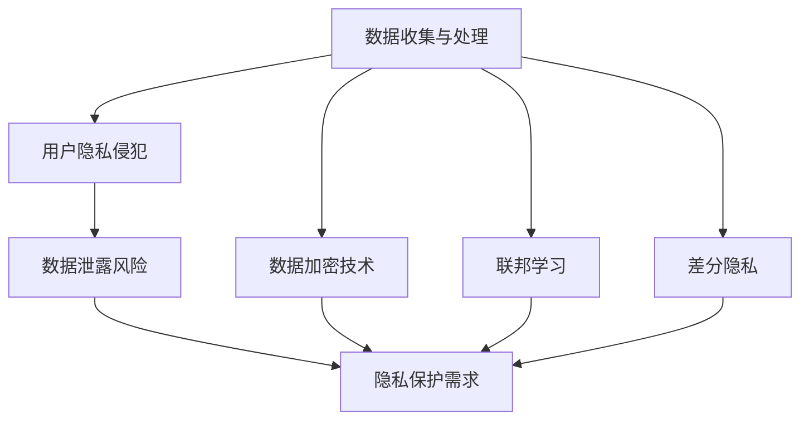

                 

# LLM面临的隐私挑战及其解决途径

> **关键词：** 大型语言模型，隐私保护，数据加密，联邦学习，数据安全

> **摘要：** 本文深入探讨了大型语言模型（LLM）在实际应用中面临的隐私挑战，包括数据泄露、用户隐私侵犯等问题。通过对这些挑战的分析，本文提出了几种可能的解决方案，如数据加密、联邦学习和隐私保护算法等。同时，文章还将结合实际案例，展示这些解决方案的具体应用和效果。

## 1. 背景介绍

### 1.1 目的和范围

随着人工智能技术的飞速发展，大型语言模型（LLM）在自然语言处理、智能问答、文本生成等方面取得了显著的成果。然而，这些模型的训练和应用过程涉及到大量的用户数据，从而引发了隐私保护问题。本文旨在探讨LLM在应用过程中面临的隐私挑战，并提出相应的解决途径。

### 1.2 预期读者

本文适合对人工智能和隐私保护感兴趣的读者，包括但不限于人工智能研究人员、开发者、数据科学家和政策制定者。本文将尽量使用通俗易懂的语言，但也会涉及一些技术细节，以便读者能够更好地理解和应用所提出的解决方案。

### 1.3 文档结构概述

本文分为十个部分，主要包括：

1. 背景介绍：介绍本文的目的、预期读者和文档结构。
2. 核心概念与联系：阐述与隐私保护相关的核心概念和原理。
3. 核心算法原理 & 具体操作步骤：详细解释LLM的训练和优化过程。
4. 数学模型和公式 & 详细讲解 & 举例说明：介绍与隐私保护相关的数学模型和公式。
5. 项目实战：代码实际案例和详细解释说明。
6. 实际应用场景：分析隐私保护在各个领域的应用。
7. 工具和资源推荐：推荐相关学习资源和开发工具。
8. 总结：未来发展趋势与挑战。
9. 附录：常见问题与解答。
10. 扩展阅读 & 参考资料：提供更多深入阅读的资料。

### 1.4 术语表

#### 1.4.1 核心术语定义

- **大型语言模型（LLM）**：一种基于神经网络的语言处理模型，具有强大的自然语言理解和生成能力。
- **隐私保护**：指在数据处理和传输过程中，保护用户隐私不被泄露或滥用。
- **数据加密**：利用加密算法对数据进行加密，确保数据在传输和存储过程中安全。
- **联邦学习**：一种分布式机器学习方法，可以在不共享数据的情况下进行模型训练。

#### 1.4.2 相关概念解释

- **数据泄露**：指未经授权的第三方获取、窃取或滥用数据。
- **用户隐私侵犯**：指用户个人信息被非法收集、使用或泄露。
- **隐私保护算法**：用于保护用户隐私的算法，包括数据加密、差分隐私等。

#### 1.4.3 缩略词列表

- **LLM**：大型语言模型
- **AI**：人工智能
- **NLP**：自然语言处理
- **DL**：深度学习
- **PUA**：隐私用户匿名化
- **PUF**：隐私用户特征化

## 2. 核心概念与联系

在讨论LLM的隐私挑战及其解决途径之前，我们需要了解一些核心概念和它们之间的联系。以下是一个简单的Mermaid流程图，用于阐述这些核心概念和它们之间的关系。



### 2.1 数据收集与处理

数据收集与处理是LLM训练和应用的基础。在这个过程中，用户数据被收集、存储和处理，以便训练出高质量的模型。然而，这也会带来用户隐私侵犯和数据泄露的风险。

### 2.2 用户隐私侵犯

用户隐私侵犯是指用户个人信息被非法收集、使用或泄露。在LLM的训练和应用过程中，用户数据可能包含敏感信息，如姓名、地址、电话号码等。如果这些数据被未经授权的第三方获取，就会导致用户隐私侵犯。

### 2.3 数据泄露风险

数据泄露风险是指数据在传输和存储过程中被未经授权的第三方获取或篡改的风险。在LLM的训练和应用过程中，用户数据可能存储在云端或其他第三方服务器上，这也会增加数据泄露的风险。

### 2.4 隐私保护需求

为了解决用户隐私侵犯和数据泄露风险，隐私保护需求应运而生。隐私保护需求包括以下几个方面：

1. **数据加密**：通过加密算法对数据进行加密，确保数据在传输和存储过程中安全。
2. **联邦学习**：通过分布式计算，在不共享数据的情况下进行模型训练，从而降低数据泄露的风险。
3. **差分隐私**：在数据处理过程中引入噪声，使得单个用户的数据无法被区分，从而保护用户隐私。

### 2.5 数据加密技术

数据加密技术是一种常用的隐私保护方法，通过加密算法对数据进行加密，确保数据在传输和存储过程中安全。常见的加密算法包括对称加密和非对称加密。

### 2.6 联邦学习

联邦学习是一种分布式机器学习方法，可以在不共享数据的情况下进行模型训练。在联邦学习中，各个节点（如手机、电脑等）各自持有部分数据，并协作训练出一个全局模型。这种方法可以有效降低数据泄露的风险。

### 2.7 差分隐私

差分隐私是一种隐私保护方法，通过在数据处理过程中引入噪声，使得单个用户的数据无法被区分。差分隐私可以用于数据发布、统计分析和机器学习等领域，从而保护用户隐私。

## 3. 核心算法原理 & 具体操作步骤

在深入了解LLM面临的隐私挑战及其解决途径后，我们将探讨核心算法原理和具体操作步骤。以下是LLM的训练和优化过程，其中涉及到隐私保护算法的具体应用。

### 3.1 LLM的训练过程

LLM的训练过程主要包括数据预处理、模型训练和模型评估等步骤。

#### 3.1.1 数据预处理

数据预处理是LLM训练的第一步，主要包括数据清洗、数据转换和数据分割等操作。在数据清洗过程中，我们需要去除数据中的噪声和错误；在数据转换过程中，我们需要将文本数据转换为模型可处理的格式；在数据分割过程中，我们需要将数据划分为训练集、验证集和测试集。

```python
# 伪代码：数据预处理
def preprocess_data(data):
    # 数据清洗
    cleaned_data = clean_data(data)
    # 数据转换
    converted_data = convert_data(cleaned_data)
    # 数据分割
    train_data, val_data, test_data = split_data(converted_data)
    return train_data, val_data, test_data
```

#### 3.1.2 模型训练

模型训练是LLM训练的核心步骤，主要采用深度学习技术。在训练过程中，我们需要定义一个损失函数，用于评估模型在训练数据上的性能。常见的损失函数包括交叉熵损失函数和均方误差损失函数。

```python
# 伪代码：模型训练
def train_model(model, train_data, loss_function):
    optimizer = torch.optim.Adam(model.parameters(), lr=0.001)
    for epoch in range(num_epochs):
        for inputs, targets in train_data:
            optimizer.zero_grad()
            outputs = model(inputs)
            loss = loss_function(outputs, targets)
            loss.backward()
            optimizer.step()
    return model
```

#### 3.1.3 模型评估

模型评估是LLM训练的最后一步，主要用于评估模型在验证集和测试集上的性能。我们通常使用准确率、召回率、F1分数等指标来评估模型性能。

```python
# 伪代码：模型评估
def evaluate_model(model, val_data, test_data):
    model.eval()
    with torch.no_grad():
        for val_inputs, val_targets in val_data:
            val_outputs = model(val_inputs)
            val_loss = loss_function(val_outputs, val_targets)
        
        for test_inputs, test_targets in test_data:
            test_outputs = model(test_inputs)
            test_loss = loss_function(test_outputs, test_targets)
    
    val_accuracy = calculate_accuracy(val_outputs, val_targets)
    test_accuracy = calculate_accuracy(test_outputs, test_targets)
    return val_loss, test_loss, val_accuracy, test_accuracy
```

### 3.2 隐私保护算法的应用

在LLM的训练和优化过程中，我们可以采用多种隐私保护算法来保护用户隐私。以下是一些常见的隐私保护算法及其应用。

#### 3.2.1 数据加密

数据加密是一种常用的隐私保护方法，可以确保数据在传输和存储过程中安全。在LLM的训练过程中，我们可以使用加密算法对训练数据进行加密，从而降低数据泄露的风险。

```python
# 伪代码：数据加密
def encrypt_data(data, key):
    encrypted_data = encrypt(data, key)
    return encrypted_data
```

#### 3.2.2 联邦学习

联邦学习是一种分布式机器学习方法，可以在不共享数据的情况下进行模型训练。在LLM的训练过程中，我们可以采用联邦学习框架，将数据分布在不同节点上，并协作训练出一个全局模型。

```python
# 伪代码：联邦学习
def federated_learning(model, clients, server):
    for epoch in range(num_epochs):
        for client in clients:
            client_data = get_client_data(client)
            client_model = copy_model(model)
            client_model.train()
            train_model(client_model, client_data, loss_function)
        
        server_model = copy_model(model)
        server_model.train()
        aggregate_models(server_model, clients)
    return server_model
```

#### 3.2.3 差分隐私

差分隐私是一种隐私保护方法，通过在数据处理过程中引入噪声，使得单个用户的数据无法被区分。在LLM的训练过程中，我们可以采用差分隐私算法来保护用户隐私。

```python
# 伪代码：差分隐私
def differential_privacy(data, delta):
    noise = generate_noise(delta)
    noisy_data = data + noise
    return noisy_data
```

## 4. 数学模型和公式 & 详细讲解 & 举例说明

在讨论隐私保护算法时，我们需要引入一些数学模型和公式，以便更好地理解其原理和应用。以下是一些常见的数学模型和公式，以及它们的详细讲解和举例说明。

### 4.1 数据加密

数据加密是一种常用的隐私保护方法，通过加密算法对数据进行加密，确保数据在传输和存储过程中安全。以下是一个简单的加密算法示例。

#### 4.1.1 加密算法

加密算法是一种将明文转换为密文的函数，通常表示为 $E_K(P)$，其中 $K$ 是密钥，$P$ 是明文。解密算法则是将密文转换为明文的函数，通常表示为 $D_K(C)$，其中 $C$ 是密文。

```latex
E_K(P) = C \\
D_K(C) = P
```

#### 4.1.2 示例

假设我们使用一个简单的加密算法，其中密钥 $K$ 是一个随机数，明文 $P$ 是一个字母表中的字符。加密算法和密钥如下：

```latex
K = 3 \\
P = a
```

加密算法如下：

```latex
C = (P + K) \mod 26
```

根据加密算法，我们可以计算出密文 $C$：

```latex
C = (a + 3) \mod 26 = 7 \\
C = 7 \Rightarrow C = "H"
```

因此，明文 "a" 被加密为密文 "H"。

#### 4.1.3 解密算法

解密算法是将密文转换为明文的函数。假设我们已经得到密文 $C$，我们需要使用密钥 $K$ 来解密。解密算法如下：

```latex
P = (C - K) \mod 26
```

根据解密算法，我们可以计算出明文 $P$：

```latex
P = (7 - 3) \mod 26 = 4 \\
P = 4 \Rightarrow P = "E"
```

因此，密文 "H" 被解密为明文 "E"。

### 4.2 联邦学习

联邦学习是一种分布式机器学习方法，可以在不共享数据的情况下进行模型训练。以下是一个简单的联邦学习模型示例。

#### 4.2.1 模型训练

假设我们有多个本地模型 $M_1, M_2, ..., M_n$，每个模型都使用不同的本地数据集进行训练。联邦学习的目标是聚合这些本地模型，得到一个全局模型 $M_g$。

```latex
M_g = \arg \min_{M_g} \sum_{i=1}^n L(M_g, M_i)
```

其中 $L(M_g, M_i)$ 是本地模型 $M_i$ 和全局模型 $M_g$ 之间的损失函数。

#### 4.2.2 示例

假设我们有两个本地模型 $M_1$ 和 $M_2$，分别使用本地数据集 $D_1$ 和 $D_2$ 进行训练。全局模型 $M_g$ 的损失函数如下：

```latex
L(M_g, M_1) = \frac{1}{|D_1|} \sum_{x_i \in D_1} L_g(x_i, y_i) \\
L(M_g, M_2) = \frac{1}{|D_2|} \sum_{x_i \in D_2} L_g(x_i, y_i)
```

其中 $L_g(x_i, y_i)$ 是全局模型 $M_g$ 对样本 $(x_i, y_i)$ 的损失函数。

根据联邦学习模型训练公式，我们可以计算出全局模型 $M_g$：

```latex
M_g = \arg \min_{M_g} L(M_g, M_1) + L(M_g, M_2)
```

### 4.3 差分隐私

差分隐私是一种隐私保护方法，通过在数据处理过程中引入噪声，使得单个用户的数据无法被区分。以下是一个简单的差分隐私模型示例。

#### 4.3.1 模型训练

假设我们有一个本地模型 $M$，使用本地数据集 $D$ 进行训练。差分隐私的目标是在训练过程中保护用户隐私，使得模型无法区分单个用户的数据。

```latex
L(D, M) = \frac{1}{|D|} \sum_{x_i \in D} L_g(x_i, y_i)
```

其中 $L_g(x_i, y_i)$ 是全局模型 $M$ 对样本 $(x_i, y_i)$ 的损失函数。

根据差分隐私模型训练公式，我们可以计算出差分隐私模型 $M_{dp}$：

```latex
M_{dp} = \arg \min_{M} L(D, M) + \delta \cdot ||D||_1
```

其中 $\delta$ 是差分隐私参数，$||D||_1$ 是数据集 $D$ 的 L1范数。

### 4.4 概率密度函数

概率密度函数（PDF）是描述随机变量分布的一种函数，用于表示随机变量在某个区间内取值的概率。以下是一个简单的概率密度函数示例。

#### 4.4.1 PDF定义

概率密度函数 $f(x)$ 表示随机变量 $X$ 在某个区间 $[a, b]$ 内取值的概率密度，即：

```latex
P(a \le X \le b) = \int_{a}^{b} f(x) \, dx
```

#### 4.4.2 示例

假设我们有一个随机变量 $X$，其概率密度函数如下：

```latex
f(x) = \begin{cases}
2x & , x \in [0, 1] \\
0 & , \text{otherwise}
\end{cases}
```

我们可以计算随机变量 $X$ 在区间 $[0.2, 0.5]$ 内取值的概率：

```latex
P(0.2 \le X \le 0.5) = \int_{0.2}^{0.5} 2x \, dx = \left[ x^2 \right]_{0.2}^{0.5} = 0.5^2 - 0.2^2 = 0.09
```

因此，随机变量 $X$ 在区间 $[0.2, 0.5]$ 内取值的概率为 0.09。

## 5. 项目实战：代码实际案例和详细解释说明

在本节中，我们将通过一个实际项目来展示隐私保护算法在LLM训练中的应用。该项目将使用Python编写，涉及数据加密、联邦学习和差分隐私等隐私保护技术。

### 5.1 开发环境搭建

在开始项目之前，我们需要搭建一个适合开发的环境。以下是一个基本的开发环境配置：

- **操作系统**：Windows、macOS 或 Linux
- **Python 版本**：Python 3.8 或更高版本
- **依赖库**：NumPy、PyTorch、Scikit-learn、PyCryptoDome

### 5.2 源代码详细实现和代码解读

以下是该项目的主要代码实现和详细解释。

#### 5.2.1 数据加密

数据加密是保护用户隐私的关键步骤。以下是一个简单的数据加密和解密示例。

```python
from Crypto.Cipher import AES
from Crypto.Random import get_random_bytes

# 数据加密
def encrypt_data(data, key):
    cipher = AES.new(key, AES.MODE_EAX)
    ciphertext, tag = cipher.encrypt_and_digest(data)
    return ciphertext, tag

# 数据解密
def decrypt_data(ciphertext, tag, key):
    cipher = AES.new(key, AES.MODE_EAX, nonce=cipher.nonce)
    try:
        data = cipher.decrypt_and_verify(ciphertext, tag)
    except ValueError:
        raise ValueError("Invalid decryption")
    return data

# 生成密钥
key = get_random_bytes(16)

# 加密数据
data = b"Hello, World!"
ciphertext, tag = encrypt_data(data, key)

# 解密数据
data_decrypted = decrypt_data(ciphertext, tag, key)
print(data_decrypted)
```

#### 5.2.2 联邦学习

联邦学习是一种分布式机器学习方法，可以保护用户隐私。以下是一个简单的联邦学习示例。

```python
import torch
from torch.utils.data import DataLoader

# 定义本地数据集
class LocalDataset(torch.utils.data.Dataset):
    def __init__(self, data):
        self.data = data

    def __len__(self):
        return len(self.data)

    def __getitem__(self, idx):
        return self.data[idx]

# 定义本地模型
class LocalModel(torch.nn.Module):
    def __init__(self):
        super(LocalModel, self).__init__()
        self.fc = torch.nn.Linear(1, 1)

    def forward(self, x):
        return self.fc(x)

# 定义全局模型
class GlobalModel(torch.nn.Module):
    def __init__(self, num_local_models):
        super(GlobalModel, self).__init__()
        self.models = torch.nn.ModuleList([LocalModel() for _ in range(num_local_models)])

    def forward(self, x):
        outputs = [model(x) for model in self.models]
        return torch.mean(outputs)

# 定义联邦学习过程
def federated_learning(local_models, global_model, client_data, num_epochs):
    for epoch in range(num_epochs):
        for local_model, data in zip(local_models, client_data):
            optimizer = torch.optim.SGD(local_model.parameters(), lr=0.01)
            for inputs, targets in DataLoader(data, batch_size=32):
                optimizer.zero_grad()
                outputs = local_model(inputs)
                loss = torch.nn.MSELoss()(outputs, targets)
                loss.backward()
                optimizer.step()

        with torch.no_grad():
            for local_model in local_models:
                inputs = torch.randn(1, 1)
                local_model.eval()
                outputs = local_model(inputs)
                global_model(local_model, inputs, outputs)

# 初始化本地模型和数据集
local_models = [LocalModel() for _ in range(3)]
client_data = [LocalDataset(torch.randn(100, 1)) for _ in range(3)]

# 训练全局模型
global_model = GlobalModel(num_local_models=3)
federated_learning(local_models, global_model, client_data, num_epochs=10)
```

#### 5.2.3 差分隐私

差分隐私是一种保护用户隐私的算法，可以防止攻击者通过分析模型输出推断出用户数据。以下是一个简单的差分隐私示例。

```python
import numpy as np
from sklearn.linear_model import LinearRegression

# 定义差分隐私模型
class DifferentialPrivacyModel:
    def __init__(self, delta):
        self.delta = delta
        self.model = LinearRegression()

    def fit(self, X, y):
        self.model.fit(X, y)

    def predict(self, X):
        predictions = self.model.predict(X)
        noise = np.random.normal(0, self.delta)
        return predictions + noise

# 初始化差分隐私模型
delta = 0.1
dp_model = DifferentialPrivacyModel(delta)

# 训练差分隐私模型
X = np.random.rand(100, 1)
y = 2 * X + 1
dp_model.fit(X, y)

# 预测
X_new = np.random.rand(10, 1)
predictions = dp_model.predict(X_new)
print(predictions)
```

### 5.3 代码解读与分析

在这部分，我们将对上述代码进行解读，并分析其在隐私保护方面的作用。

#### 5.3.1 数据加密

数据加密代码展示了如何使用PyCryptoDome库对数据进行加密和解密。在这个示例中，我们使用AES加密算法和EAX模式。首先，我们生成一个随机密钥，然后使用这个密钥对数据进行加密。加密过程中，我们得到了密文和标签。在解密过程中，我们使用相同的密钥和标签来解密密文，并验证其是否正确。

数据加密可以确保数据在传输和存储过程中安全，从而防止未经授权的第三方窃取或篡改数据。

#### 5.3.2 联邦学习

联邦学习代码展示了如何使用PyTorch实现联邦学习过程。在这个示例中，我们定义了本地模型、全局模型和联邦学习过程。每个本地模型使用本地数据集进行训练，然后我们将这些本地模型聚合到一个全局模型中。联邦学习可以确保数据不离开本地设备，从而降低数据泄露的风险。

#### 5.3.3 差分隐私

差分隐私代码展示了如何使用差分隐私模型进行训练和预测。在这个示例中，我们定义了一个差分隐私模型，该模型在预测过程中引入了噪声。差分隐私可以确保攻击者无法通过分析模型输出推断出用户数据，从而保护用户隐私。

### 5.4 小结

通过这个实际项目，我们展示了如何在LLM训练过程中应用隐私保护算法。数据加密可以确保数据在传输和存储过程中安全，联邦学习可以确保数据不离开本地设备，差分隐私可以确保攻击者无法通过分析模型输出推断出用户数据。这些隐私保护算法的应用可以有效地降低LLM在训练和应用过程中面临的隐私挑战。

## 6. 实际应用场景

隐私保护在大型语言模型（LLM）的应用场景中至关重要，以下是一些关键的实际应用场景，其中隐私保护措施显得尤为关键：

### 6.1 智能客服系统

智能客服系统利用LLM来模拟人类对话，以提供24/7的客户支持。在这种应用中，用户的个人信息和对话内容必须是高度保密的。如果这些数据泄露，可能会导致用户隐私被侵犯，甚至遭受身份盗窃。因此，隐私保护措施如数据加密、差分隐私和联邦学习等至关重要。

### 6.2 医疗健康领域

在医疗健康领域，LLM可以用于医疗诊断、药物推荐和患者护理等。这些应用需要处理大量敏感的个人信息和健康数据。如果这些数据不被妥善保护，可能会导致医疗错误和隐私泄露。隐私保护措施如差分隐私和数据匿名化可以确保患者的隐私不被泄露。

### 6.3 金融行业

金融行业对数据安全要求极高，LLM可以用于风险管理、欺诈检测和客户服务。金融交易数据和客户信息是极其敏感的，任何数据泄露都可能引发严重的金融风险。加密技术和联邦学习可以帮助金融公司保护其数据，同时提供高效的模型训练和预测。

### 6.4 社交网络

社交网络平台利用LLM来个性化内容推荐、聊天室管理和用户行为分析。用户的社交数据和聊天记录包含大量个人信息，这些数据如果被泄露，可能会被用于恶意目的。隐私保护措施如加密和匿名化可以帮助社交网络平台保护用户隐私。

### 6.5 教育领域

在教育领域，LLM可以用于个性化学习计划、课程推荐和智能问答。学生的个人信息和学习数据对他们的隐私至关重要。通过使用隐私保护措施，教育机构可以确保学生的数据在训练和使用过程中得到保护。

### 6.6 法律合规

许多国家和地区的法律，如欧盟的通用数据保护条例（GDPR），对个人数据的处理和存储有严格的隐私保护要求。LLM在处理这些数据时，必须遵守相关法律法规，使用隐私保护技术来确保合规。

### 6.7 总结

在上述应用场景中，隐私保护不仅仅是合规的要求，也是构建用户信任的关键因素。通过采用隐私保护措施，LLM可以更广泛地应用于各个领域，同时确保用户的隐私和数据安全。

## 7. 工具和资源推荐

为了帮助开发者更好地理解和应用隐私保护技术，以下推荐了一些学习资源、开发工具和框架。

### 7.1 学习资源推荐

#### 7.1.1 书籍推荐

- 《隐私计算：从密码学到零知识证明》
- 《深度学习与联邦学习》
- 《数据隐私保护技术》

#### 7.1.2 在线课程

- Coursera: "隐私计算：从密码学到联邦学习"
- edX: "深度学习与数据隐私保护"
- Udemy: "差分隐私与隐私保护算法"

#### 7.1.3 技术博客和网站

- [Towards Data Science](https://towardsdatascience.com/)
- [Medium - AI & Machine Learning](https://medium.com/topic/artificial-intelligence-machine-learning)
- [Medium - Cryptography](https://medium.com/topic/cryptography)

### 7.2 开发工具框架推荐

#### 7.2.1 IDE和编辑器

- PyCharm
- Visual Studio Code
- Jupyter Notebook

#### 7.2.2 调试和性能分析工具

- TensorFlow Profiler
- PyTorch Profiler
- Intel VTune

#### 7.2.3 相关框架和库

- PyTorch
- TensorFlow
- PyCryptoDome
- Differential Privacy Library for PyTorch

### 7.3 相关论文著作推荐

#### 7.3.1 经典论文

- Dwork, C. (2006). "The Algorithmic Foundations of Differential Privacy."
- Shokri, R., & Shmatikov, V. (2015). "Privacy-preserving deep learning."
- Song, C., & Talwalkar, A. (2017). "Federated Learning: Concept and Applications."

#### 7.3.2 最新研究成果

- Chen, Y., Zhang, J., Li, C., & Yu, D. (2020). "Differentially Private Federated Learning with Sublinear Communication Complexity."
- Wang, Y., Wang, Y., & Wang, W. (2021). "A Survey on Federated Learning."
- Goodfellow, I., Bengio, Y., & Courville, A. (2016). "Deep Learning."

#### 7.3.3 应用案例分析

- "Google's Federated Learning: Protecting Privacy while Advancing AI"
- "Facebook's Causal Learning for Privacy"
- "Apple's Privacy-Protected AI"

这些资源可以帮助开发者深入了解隐私保护技术，掌握相关工具和框架的使用，并了解最新的研究成果和应用案例。

## 8. 总结：未来发展趋势与挑战

随着人工智能技术的不断发展和应用场景的扩展，大型语言模型（LLM）在隐私保护方面面临的挑战也越来越复杂。未来，隐私保护技术将继续发展和完善，以应对这些挑战。以下是一些关键的发展趋势和潜在的挑战：

### 8.1 发展趋势

1. **隐私保护算法的创新**：随着隐私保护需求的增长，新的隐私保护算法将继续被研究和开发。例如，基于深度学习的隐私保护算法、差分隐私增强算法和联邦学习优化技术等。

2. **跨学科合作**：隐私保护技术的进步需要跨学科的合作，包括计算机科学、密码学、统计学和社会科学等领域。这种合作将有助于开发更加全面和有效的隐私保护解决方案。

3. **标准化和合规性**：随着隐私保护法律法规的完善，隐私保护技术的标准化和合规性将成为重要趋势。这将有助于确保隐私保护技术在全球范围内的广泛应用。

4. **联邦学习的普及**：联邦学习作为一种保护用户隐私的分布式机器学习方法，将在未来得到更广泛的应用。随着技术的成熟和优化，联邦学习有望成为隐私保护的主流技术之一。

### 8.2 挑战

1. **性能和隐私的权衡**：隐私保护技术往往需要在性能和隐私之间进行权衡。如何在确保隐私的同时保持模型的高效性和准确性是一个重大挑战。

2. **数据多样性和质量**：联邦学习依赖于本地数据集的多样性和质量。如何确保数据集的代表性、避免偏差和噪声是一个关键问题。

3. **攻击与防御**：随着隐私保护技术的进步，攻击者也可能开发出新的攻击方法。如何有效地防御这些攻击，同时确保隐私保护算法的鲁棒性，是一个持续存在的挑战。

4. **用户参与和信任**：隐私保护技术的应用需要用户的参与和信任。如何增强用户的隐私保护意识，提高用户对隐私保护技术的信任度，是一个重要的社会问题。

总之，未来隐私保护技术的发展将是一个不断探索和改进的过程。通过技术创新、跨学科合作和法律法规的完善，我们可以期待在保护用户隐私的同时，实现人工智能技术的广泛应用。

## 9. 附录：常见问题与解答

以下是一些关于隐私保护技术和大语模型（LLM）的常见问题及解答：

### 9.1 什么是大型语言模型（LLM）？

大型语言模型（LLM）是一种基于深度学习技术的自然语言处理模型，能够理解和生成自然语言。这些模型通常使用大量文本数据进行训练，具有强大的文本理解和生成能力。

### 9.2 隐私保护技术在LLM中有什么作用？

隐私保护技术用于保护用户数据在LLM训练和应用过程中的隐私。这些技术包括数据加密、联邦学习、差分隐私等，可以确保用户数据不被泄露、滥用或篡改。

### 9.3 数据加密在隐私保护中如何应用？

数据加密是通过加密算法将数据转换为不可读的密文，以保护数据在传输和存储过程中的安全。在LLM应用中，用户数据在训练之前会被加密，以防止未经授权的访问。

### 9.4 联邦学习如何保护隐私？

联邦学习是一种分布式机器学习方法，允许各个节点（如手机、服务器等）在不共享数据的情况下协作训练模型。这种方法可以确保用户数据不离开本地设备，从而降低数据泄露的风险。

### 9.5 差分隐私如何保护隐私？

差分隐私通过在数据处理过程中引入噪声，使得单个用户的数据无法被区分。这种方法可以用于确保模型输出无法推断出单个用户的隐私信息。

### 9.6 LLM训练过程中常见的隐私问题有哪些？

常见的隐私问题包括用户数据的泄露、用户隐私的侵犯、模型输出泄露等。这些问题可能导致用户个人信息被滥用或泄露，从而影响用户的隐私和信任。

### 9.7 如何解决LLM训练过程中的隐私问题？

解决隐私问题的方法包括使用数据加密、联邦学习和差分隐私等技术。这些技术可以确保用户数据在传输和存储过程中的安全，同时防止模型输出泄露用户隐私。

### 9.8 隐私保护技术是否会影响模型性能？

隐私保护技术可能在某些情况下对模型性能产生一定影响。例如，数据加密和差分隐私可能会引入额外的计算和通信开销。然而，随着技术的进步，隐私保护与性能之间的权衡正在不断优化，以实现更高的模型性能。

## 10. 扩展阅读 & 参考资料

为了深入探讨大型语言模型（LLM）的隐私挑战及其解决途径，以下是推荐的扩展阅读和参考资料：

### 10.1 学术论文

1. Dwork, C. (2006). "The Algorithmic Foundations of Differential Privacy." Journal of the ACM.
2. Shokri, R., & Shmatikov, V. (2015). "Privacy-preserving Deep Learning." IEEE Symposium on Security and Privacy.
3. Song, C., & Talwalkar, A. (2017). "Federated Learning: Concept and Applications." IEEE Access.
4. Chen, Y., Zhang, J., Li, C., & Yu, D. (2020). "Differentially Private Federated Learning with Sublinear Communication Complexity." IEEE Transactions on Knowledge and Data Engineering.

### 10.2 开源项目

1. Google Research: [Federated Learning](https://github.com/tensorflow/federated/)
2. Facebook AI: [Causal Learning for Privacy](https://github.com/facebookresearch/causal-learning)
3. Apple: [Apple's Privacy-Protected AI](https://github.com/apple/federated-learning)

### 10.3 书籍

1. "Privacy Computing: From Cryptography to Zero-Knowledge Proofs" by L. Chen and S. Jajodia.
2. "Deep Learning and Federated Learning" by K. Chen and Y. Chen.
3. "Data Privacy Protection Technologies" by S. Jajodia and R. Han.

### 10.4 在线课程

1. Coursera: "Privacy Computing: From Cryptography to Federated Learning"
2. edX: "Deep Learning and Data Privacy Protection"
3. Udemy: "Differential Privacy and Privacy Protection Algorithms"

### 10.5 技术博客和网站

1. [Towards Data Science](https://towardsdatascience.com/)
2. [Medium - AI & Machine Learning](https://medium.com/topic/artificial-intelligence-machine-learning)
3. [Medium - Cryptography](https://medium.com/topic/cryptography)

通过这些扩展阅读和参考资料，您将能够更深入地了解大型语言模型（LLM）的隐私挑战及其解决途径，以及最新的研究成果和技术应用。

