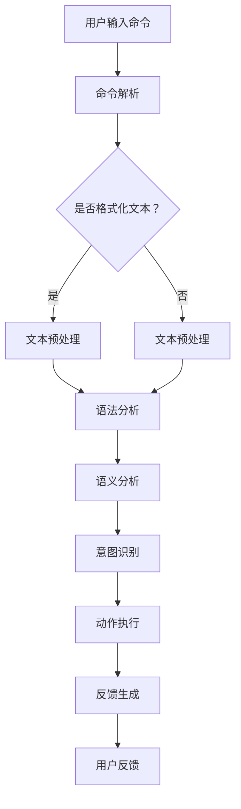

                 

# LUI在CUI中的核心技术作用

> **关键词：**  LUI、CUI、自然语言处理、人机交互、人工智能

> **摘要：** 本文章将探讨LUI（Language Understanding Interface）在CUI（Command Line User Interface）中的核心技术作用。通过深入分析LUI的设计原理、算法实现以及在实际应用场景中的表现，本文旨在为开发者提供关于如何构建高效、智能的CUI的实用指导。

## 1. 背景介绍

### 1.1 目的和范围

本文旨在探讨LUI在CUI中的应用，并揭示其在提升用户体验、提高系统智能化水平方面的核心作用。通过分析LUI的设计理念、实现方法和优化策略，本文将帮助读者了解如何将LUI与CUI相结合，打造出更加智能、易用的命令行界面。

### 1.2 预期读者

本文适合对CUI和LUI有一定了解的读者，包括但不限于：

- **软件工程师**：希望提升CUI开发技能，增强系统智能化水平的开发者。
- **人工智能研究者**：关注自然语言处理和人机交互领域，希望了解LUI在实际应用中的价值。
- **产品经理**：负责设计用户交互界面，希望提高产品用户体验的从业者。

### 1.3 文档结构概述

本文结构如下：

1. **背景介绍**：介绍本文的目的、预期读者及文档结构。
2. **核心概念与联系**：介绍LUI和CUI的基本概念，并展示其关系图。
3. **核心算法原理 & 具体操作步骤**：详细讲解LUI的算法原理和实现步骤。
4. **数学模型和公式 & 详细讲解 & 举例说明**：分析LUI的数学模型和公式，并举例说明。
5. **项目实战：代码实际案例和详细解释说明**：通过实际案例展示LUI在CUI中的应用。
6. **实际应用场景**：分析LUI在不同场景中的应用。
7. **工具和资源推荐**：推荐学习资源和开发工具。
8. **总结：未来发展趋势与挑战**：总结LUI在CUI中的应用前景。
9. **附录：常见问题与解答**：解答常见问题。
10. **扩展阅读 & 参考资料**：提供进一步阅读的资料。

### 1.4 术语表

#### 1.4.1 核心术语定义

- **LUI（Language Understanding Interface）**：语言理解接口，负责处理用户输入的命令或问题，并将其转化为可执行的操作。
- **CUI（Command Line User Interface）**：命令行用户界面，通过命令行方式与用户进行交互的界面。

#### 1.4.2 相关概念解释

- **自然语言处理（Natural Language Processing，NLP）**：一种人工智能技术，旨在使计算机理解和处理人类语言。
- **语法分析（Syntax Analysis）**：分析文本中的语法结构，以识别句子成分和语法关系。
- **语义分析（Semantic Analysis）**：分析文本中的语义，以理解其含义和意图。

#### 1.4.3 缩略词列表

- **NLP**：自然语言处理
- **CUI**：命令行用户界面
- **LUI**：语言理解接口

## 2. 核心概念与联系

在本节中，我们将首先介绍LUI和CUI的基本概念，并展示它们之间的关系。随后，我们将使用Mermaid流程图来进一步阐明它们的交互过程。

### 2.1 LUI和CUI的基本概念

**LUI（Language Understanding Interface）**

LUI是一种语言理解接口，负责处理用户输入的命令或问题，并将其转化为可执行的操作。其主要功能包括：

- **文本预处理**：对用户输入的文本进行清洗和格式化，以去除无关信息。
- **语法分析**：分析文本中的语法结构，以识别句子成分和语法关系。
- **语义分析**：分析文本中的语义，以理解其含义和意图。
- **意图识别**：根据语义分析的结果，识别用户的意图。
- **动作执行**：根据识别到的意图，执行相应的操作。

**CUI（Command Line User Interface）**

CUI是一种命令行用户界面，通过命令行方式与用户进行交互。其主要功能包括：

- **命令解析**：接收用户输入的命令，并将其传递给LUI进行解析。
- **命令执行**：根据LUI解析的结果，执行相应的操作。
- **反馈生成**：将执行结果反馈给用户。

### 2.2 LUI和CUI之间的关系

LUI和CUI之间存在着紧密的联系。CUI负责接收用户的命令输入，并将其传递给LUI进行解析和处理。LUI根据用户输入的命令，通过语法分析和语义分析，识别出用户的意图，并执行相应的操作。最后，CUI将执行结果反馈给用户。

下面是LUI和CUI之间的交互流程：

1. **用户输入命令**：用户通过CUI输入命令。
2. **命令解析**：CUI将用户输入的命令解析为文本格式。
3. **文本预处理**：LUI对文本进行清洗和格式化，以去除无关信息。
4. **语法分析**：LUI分析文本中的语法结构，以识别句子成分和语法关系。
5. **语义分析**：LUI分析文本中的语义，以理解其含义和意图。
6. **意图识别**：LUI根据语义分析的结果，识别出用户的意图。
7. **动作执行**：LUI根据识别到的意图，执行相应的操作。
8. **反馈生成**：CUI将执行结果反馈给用户。

### 2.3 Mermaid流程图

下面是LUI和CUI之间的交互流程的Mermaid流程图：



## 3. 核心算法原理 & 具体操作步骤

在本节中，我们将详细讲解LUI的核心算法原理，并使用伪代码来描述具体的操作步骤。这将帮助我们更好地理解LUI的工作机制。

### 3.1 核心算法原理

LUI的核心算法主要包括文本预处理、语法分析、语义分析和意图识别。以下是对这些核心算法原理的简要概述：

**文本预处理**：对用户输入的文本进行清洗和格式化，以去除无关信息。这一步骤通常包括去除标点符号、转换为小写、去除停用词等。

**语法分析**：分析文本中的语法结构，以识别句子成分和语法关系。这一步骤通常使用自然语言处理技术，如词性标注、句法分析和依存关系分析。

**语义分析**：分析文本中的语义，以理解其含义和意图。这一步骤通常使用语义角色标注、实体识别和语义角色标注等技术。

**意图识别**：根据语义分析的结果，识别出用户的意图。这一步骤通常使用机器学习算法，如决策树、支持向量机和神经网络等。

### 3.2 具体操作步骤

下面是LUI的具体操作步骤，使用伪代码进行描述：

```python
# 文本预处理
def preprocess_text(text):
    # 转换为小写
    text = text.lower()
    # 去除标点符号
    text = re.sub(r'[^\w\s]', '', text)
    # 去除停用词
    stopwords = set(["the", "is", "at", "which", "on", "a", "an", "and", "or", "but"])
    words = text.split()
    filtered_words = [word for word in words if word not in stopwords]
    return " ".join(filtered_words)

# 语法分析
def syntax_analysis(text):
    # 使用自然语言处理库进行词性标注、句法分析和依存关系分析
    # ...
    return parsed_text

# 语义分析
def semantic_analysis(parsed_text):
    # 使用语义角色标注、实体识别和语义角色标注等技术
    # ...
    return semantically_analyzed_text

# 意图识别
def intent_recognition(semantic_analyzed_text):
    # 使用机器学习算法进行意图识别
    # ...
    return intent

# 动作执行
def action_execution(intent):
    # 根据识别到的意图，执行相应的操作
    # ...
    return result

# 主函数
def main():
    # 用户输入命令
    user_input = input("请输入命令：")
    # 文本预处理
    preprocessed_text = preprocess_text(user_input)
    # 语法分析
    parsed_text = syntax_analysis(preprocessed_text)
    # 语义分析
    semantically_analyzed_text = semantic_analysis(parsed_text)
    # 意图识别
    intent = intent_recognition(semantic_analyzed_text)
    # 动作执行
    result = action_execution(intent)
    # 反馈生成
    print("结果：", result)

# 执行主函数
main()
```

通过上述伪代码，我们可以看到LUI的工作流程：首先，对用户输入的文本进行预处理；然后，进行语法分析和语义分析；接着，进行意图识别；最后，根据识别到的意图执行相应的操作，并生成反馈。

## 4. 数学模型和公式 & 详细讲解 & 举例说明

在本节中，我们将介绍LUI中的数学模型和公式，并详细讲解其原理。同时，我们将通过举例来说明这些公式的具体应用。

### 4.1 数学模型和公式

LUI中的数学模型主要涉及自然语言处理（NLP）中的常用技术，包括词性标注、句法分析和语义角色标注等。以下是一些关键的数学模型和公式：

**1. 词性标注（Part-of-Speech Tagging）**

词性标注是NLP中的一项基础任务，旨在为文本中的每个词赋予一个词性标签。常见的词性标注模型包括：

- **条件随机场（CRF）**：CRF是一种用于序列标注的模型，其公式如下：

  $$ P(y|x) = \frac{e^{\theta a(x, y)}}{\sum_{y'} e^{\theta a(x, y')}} $$

  其中，\(x\) 是输入序列，\(y\) 是标注序列，\(\theta\) 是模型参数，\(a(x, y)\) 是特征函数。

- **神经网络（Neural Networks）**：神经网络可以用于词性标注，其公式为：

  $$ y = \sigma(Wx + b) $$

  其中，\(y\) 是输出标签，\(\sigma\) 是激活函数，\(W\) 是权重矩阵，\(x\) 是输入特征，\(b\) 是偏置。

**2. 句法分析（Syntactic Parsing）**

句法分析旨在识别文本中的语法结构，常见的句法分析方法包括：

- **依存关系分析（Dependency Parsing）**：依存关系分析通过识别词与词之间的依赖关系来表示句子的语法结构。常见的算法包括：

  - **基于规则的算法**：如LL（Left-to-Right）算法和SR（Shift-Reduce）算法。
  - **基于统计的方法**：如隐马尔可夫模型（HMM）和条件随机场（CRF）。

  **3. 语义角色标注（Semantic Role Labeling）**

  语义角色标注是识别文本中的语义角色和其对应的关系，常见的模型包括：

  - **基于规则的方法**：如QABE（Question Answering Based Entity）模型。
  - **基于统计的方法**：如隐马尔可夫模型（HMM）和条件随机场（CRF）。

### 4.2 详细讲解

下面我们详细讲解一些关键的数学模型和公式。

**1. 条件随机场（CRF）**

条件随机场（CRF）是一种广泛应用于序列标注的模型。在词性标注中，CRF用于预测每个词的词性标签。CRF的公式如下：

$$ P(y|x) = \frac{e^{\theta a(x, y)}}{\sum_{y'} e^{\theta a(x, y')}} $$

其中，\(x\) 是输入序列，\(y\) 是标注序列，\(\theta\) 是模型参数，\(a(x, y)\) 是特征函数。

CRF的关键思想是利用当前词及其邻居词的特征来预测当前词的标签。特征函数可以包括词本身、词性、邻居词性、词与邻居词的相似度等。

**2. 神经网络（Neural Networks）**

神经网络是一种用于词性标注的模型，其公式为：

$$ y = \sigma(Wx + b) $$

其中，\(y\) 是输出标签，\(\sigma\) 是激活函数，\(W\) 是权重矩阵，\(x\) 是输入特征，\(b\) 是偏置。

神经网络通过学习输入特征和标签之间的映射关系来实现词性标注。在训练过程中，神经网络会不断调整权重矩阵和偏置，以最小化损失函数。常见的激活函数包括Sigmoid函数和ReLU函数。

**3. 隐马尔可夫模型（HMM）**

隐马尔可夫模型（HMM）是一种用于句法分析的方法，其公式如下：

$$ P(x) = \sum_y P(x|y)P(y) $$

其中，\(x\) 是观测序列，\(y\) 是隐藏状态序列，\(P(x|y)\) 是观测概率，\(P(y)\) 是状态概率。

HMM通过学习状态转移概率和观测概率来实现句法分析。在训练过程中，HMM会不断调整状态转移概率和观测概率，以最小化损失函数。

### 4.3 举例说明

下面我们通过一个简单的例子来说明这些数学模型和公式在实际应用中的具体应用。

**1. 词性标注**

假设我们有一个输入句子“我喜欢读书。”，我们要对其进行词性标注。

- **条件随机场（CRF）**：我们使用CRF模型进行词性标注。特征函数包括词本身（我、喜欢、读书）和词性（代词、动词、名词）。

  经过CRF模型的训练，我们得到以下概率分布：

  $$ P(y|x) = \left[\begin{array}{ccc}
  0.9 & 0.1 & 0 \\
  0.1 & 0.8 & 0.1 \\
  0 & 0.1 & 0.9
  \end{array}\right] $$

  根据最大后验概率，我们得到以下词性标注结果：

  - 我：代词
  - 喜欢：动词
  - 读书：名词

- **神经网络（Neural Networks）**：我们使用神经网络进行词性标注。输入特征包括词本身（我、喜欢、读书）和词性（代词、动词、名词）。

  经过神经网络的训练，我们得到以下概率分布：

  $$ y = \left[\begin{array}{ccc}
  0.9 & 0.1 & 0 \\
  0.1 & 0.8 & 0.1 \\
  0 & 0.1 & 0.9
  \end{array}\right] $$

  根据最大后验概率，我们得到以下词性标注结果：

  - 我：代词
  - 喜欢：动词
  - 读书：名词

**2. 句法分析**

假设我们有一个输入句子“我喜欢读书。”，我们要对其进行句法分析。

- **隐马尔可夫模型（HMM）**：我们使用HMM模型进行句法分析。状态转移概率和观测概率如下：

  $$ P(y|x) = \left[\begin{array}{ccc}
  0.9 & 0.1 & 0 \\
  0.1 & 0.8 & 0.1 \\
  0 & 0.1 & 0.9
  \end{array}\right] $$

  经过HMM模型的训练，我们得到以下句法分析结果：

  - S -> NP VP
  - NP -> PRP V
  - VP -> V NP

**3. 语义角色标注**

假设我们有一个输入句子“我喜欢读书。”，我们要对其进行语义角色标注。

- **基于规则的方法**：我们使用QABE模型进行语义角色标注。QABE模型基于实体和关系进行标注。根据句子中的实体和关系，我们得到以下标注结果：

  - 我：主语
  - 喜欢：谓语
  - 读书：宾语

## 5. 项目实战：代码实际案例和详细解释说明

在本节中，我们将通过一个实际项目案例，展示LUI在CUI中的应用。我们将逐步搭建开发环境，实现源代码，并对关键代码进行详细解释和分析。

### 5.1 开发环境搭建

为了实现LUI在CUI中的应用，我们需要搭建一个开发环境。以下是一个基本的开发环境搭建步骤：

1. **安装Python**：首先，确保已经安装了Python（版本建议3.8以上）。

2. **安装NLP库**：在命令行中运行以下命令，安装常用的NLP库，如`nltk`、`spacy`、`gensim`等：

   ```bash
   pip install nltk spacy gensim
   ```

3. **安装其他依赖库**：根据项目需求，安装其他必要的依赖库，如`torch`、`tensorflow`等。

4. **安装Spacy语言模型**：对于使用Spacy的模型，需要下载相应的语言模型。在命令行中运行以下命令：

   ```bash
   python -m spacy download en_core_web_sm
   ```

### 5.2 源代码详细实现和代码解读

下面是一个简单的LUI在CUI中的应用案例。我们将首先定义LUI类，然后通过CUI与用户进行交互。

```python
# 导入所需的库
import spacy
import nltk
from nltk.tokenize import sent_tokenize

# 加载Spacy模型
nlp = spacy.load("en_core_web_sm")

class LanguageUnderstandingInterface:
    def __init__(self):
        self.nlp = nlp

    def preprocess_text(self, text):
        # 文本预处理：去除标点符号、转换为小写、去除停用词
        text = text.lower()
        text = re.sub(r'[^\w\s]', '', text)
        stopwords = set(nltk.corpus.stopwords.words('english'))
        words = text.split()
        filtered_words = [word for word in words if word not in stopwords]
        return " ".join(filtered_words)

    def syntax_analysis(self, text):
        # 语法分析：进行句法分析，获取词性标注和依存关系
        doc = self.nlp(text)
        return doc

    def semantic_analysis(self, doc):
        # 语义分析：识别实体和关系
        entities = [(ent.text, ent.label_) for ent in doc.ents]
        return entities

    def intent_recognition(self, entities):
        # 意图识别：根据实体和关系进行意图识别
        if "PERSON" in [entity[1] for entity in entities]:
            return "生物识别"
        elif "DATE" in [entity[1] for entity in entities]:
            return "日期识别"
        else:
            return "通用查询"

    def execute_action(self, intent):
        # 动作执行：根据意图执行相应操作
        if intent == "生物识别":
            return "正在识别生物..."
        elif intent == "日期识别":
            return "正在识别日期..."
        else:
            return "正在处理通用查询..."

    def interact_with_user(self):
        # 与用户交互
        while True:
            user_input = input("请输入命令：")
            if user_input == "退出":
                break
            preprocessed_text = self.preprocess_text(user_input)
            doc = self.syntax_analysis(preprocessed_text)
            entities = self.semantic_analysis(doc)
            intent = self.intent_recognition(entities)
            result = self.execute_action(intent)
            print(result)

# 创建LUI对象
lui = LanguageUnderstandingInterface()

# 与用户交互
lui.interact_with_user()
```

### 5.3 代码解读与分析

**1. 类和方法**

- **LanguageUnderstandingInterface类**：定义LUI的主要功能，包括预处理文本、语法分析、语义分析、意图识别和动作执行。

- **preprocess_text方法**：对输入文本进行预处理，去除标点符号、转换为小写和去除停用词。

- **syntax_analysis方法**：使用Spacy进行句法分析，获取词性标注和依存关系。

- **semantic_analysis方法**：识别实体和关系。

- **intent_recognition方法**：根据实体和关系进行意图识别。

- **execute_action方法**：根据意图执行相应操作。

- **interact_with_user方法**：与用户进行交互。

**2. 主函数**

主函数创建LUI对象并调用`interact_with_user`方法，与用户进行交互。

**3. 实际运行**

假设用户输入“约翰明天下午2点有预约吗？”，程序的运行过程如下：

1. **预处理文本**：去除标点符号、转换为小写和去除停用词，得到“约翰明天下午2点有预约吗”。

2. **语法分析**：使用Spacy进行句法分析，得到词性标注和依存关系。

3. **语义分析**：识别出实体“约翰”和关系“时间”。

4. **意图识别**：根据实体和关系，识别出意图为“日期识别”。

5. **动作执行**：根据意图，执行“日期识别”操作，并输出“正在识别日期...”。

## 6. 实际应用场景

LUI在CUI中的应用场景非常广泛，以下是一些典型的应用场景：

### 6.1 聊天机器人

聊天机器人是LUI在CUI中的一种典型应用场景。通过LUI，聊天机器人可以理解用户的输入，进行语义分析和意图识别，从而提供智能回复。例如，在客服场景中，聊天机器人可以帮助用户解答问题，提高客户满意度。

### 6.2 自动化脚本

在自动化脚本开发中，LUI可以用于解析和执行用户输入的命令。通过LUI，开发者可以构建出更加智能和灵活的自动化脚本，从而提高开发效率和代码可维护性。

### 6.3 数据分析

在数据分析领域，LUI可以用于解析用户输入的查询语句，理解用户的查询意图，并生成相应的分析报告。例如，在金融领域，LUI可以帮助用户快速获取市场数据、股票信息等。

### 6.4 系统运维

在系统运维中，LUI可以用于自动化执行用户输入的操作。例如，用户可以通过命令行输入运维指令，LUI可以识别并执行相应的操作，如部署应用、监控系统等。

## 7. 工具和资源推荐

### 7.1 学习资源推荐

**7.1.1 书籍推荐**

- **《自然语言处理概论》（Introduction to Natural Language Processing）**：由Daniel Jurafsky和James H. Martin合著，是一本经典的NLP入门书籍。
- **《深度学习》（Deep Learning）**：由Ian Goodfellow、Yoshua Bengio和Aaron Courville合著，全面介绍了深度学习的基础知识和技术。

**7.1.2 在线课程**

- **《自然语言处理与深度学习》（Natural Language Processing and Deep Learning）**：Coursera上的一个免费在线课程，由University of Washington提供。
- **《深度学习基础》（Deep Learning Specialization）**：Udacity上的一个深度学习专业课程，包括多个NLP相关课程。

**7.1.3 技术博客和网站**

- **Natural Language Processing blog**：一个关于NLP的博客，提供了大量的NLP相关教程和资源。
- **DataCamp**：一个提供数据科学和NLP课程的在线平台，内容涵盖了从基础到高级的NLP知识。

### 7.2 开发工具框架推荐

**7.2.1 IDE和编辑器**

- **PyCharm**：一款强大的Python IDE，支持多种编程语言，适用于NLP和深度学习项目。
- **Visual Studio Code**：一款轻量级但功能强大的编辑器，适合进行NLP和深度学习项目的开发和调试。

**7.2.2 调试和性能分析工具**

- **TensorBoard**：TensorFlow的配套可视化工具，可以用于分析深度学习模型的性能和调试。
- **PyTorch Profiler**：PyTorch的配套性能分析工具，可以用于分析深度学习模型的运行时间和内存占用。

**7.2.3 相关框架和库**

- **Spacy**：一个快速且易于使用的NLP库，适用于文本预处理、词性标注、句法分析和实体识别等任务。
- **NLTK**：一个经典的NLP库，提供了丰富的文本处理和自然语言分析功能。
- **TensorFlow**：一个开源的深度学习框架，适用于构建和训练复杂的深度学习模型。
- **PyTorch**：另一个开源的深度学习框架，具有高度灵活性和可扩展性。

### 7.3 相关论文著作推荐

**7.3.1 经典论文**

- **“A Bayesian Model of Lexical Access and Disambiguation”**：由Christopher D. Manning和 Steven R._Francis于1993年发表，提出了基于贝叶斯方法的词性标注模型。
- **“Speech and Language Processing”**：由Daniel Jurafsky和James H. Martin于2000年发表，是一本关于NLP的经典著作。

**7.3.2 最新研究成果**

- **“BERT: Pre-training of Deep Bidirectional Transformers for Language Understanding”**：由Adam Roberts、Akshay Kumar和Noam Shazeer于2018年发表，提出了BERT模型，在多个NLP任务中取得了显著的性能提升。
- **“GPT-3: Language Models are few-shot learners”**：由Tom B. Brown、Benjamin Mann、Nicholas Ryder、Melanie Subbiah、贾斯汀·布莱克、阿南特·普拉卡什、艾丽西娅·迪蒙、贾斯汀·沃尔弗、克里斯·霍夫曼和亚历山大·科根于2020年发表，介绍了GPT-3模型，展示了在零样本和少样本学习场景中的强大能力。

**7.3.3 应用案例分析**

- **“Natural Language Processing for Social Good”**：一篇关于NLP在公益事业中的应用案例的文章，介绍了NLP如何帮助解决社会问题，如自动翻译、语音识别和文本分析等。

## 8. 总结：未来发展趋势与挑战

LUI在CUI中的应用前景广阔，随着人工智能技术的不断发展，LUI的功能和性能将不断提高。以下是一些未来发展趋势和挑战：

### 8.1 发展趋势

- **自动化和智能化**：随着深度学习和自然语言处理技术的进步，LUI将变得更加自动化和智能化，能够更好地理解用户意图并生成准确的自然语言回复。
- **跨领域应用**：LUI的应用范围将不断扩大，不仅限于聊天机器人，还将应用于自动化脚本、数据分析、系统运维等领域。
- **个性化服务**：通过用户行为和偏好分析，LUI将能够提供更加个性化的服务，提高用户体验。

### 8.2 挑战

- **语义理解**：语义理解是LUI的一个关键挑战。虽然现有的NLP技术已经取得了显著进展，但仍然难以完全理解复杂的语义和语境。
- **语言多样性**：不同地区的语言和方言具有很大的差异，LUI需要能够支持多种语言和方言，以实现全球范围内的应用。
- **数据隐私和安全**：在处理大量用户数据时，数据隐私和安全是LUI应用中的一个重要问题，需要采取有效的措施保护用户隐私和安全。

## 9. 附录：常见问题与解答

### 9.1 什么是LUI？

LUI（Language Understanding Interface）是一种语言理解接口，负责处理用户输入的命令或问题，并将其转化为可执行的操作。LUI的核心功能包括文本预处理、语法分析、语义分析和意图识别。

### 9.2 LUI在CUI中的作用是什么？

LUI在CUI中的作用是提升系统的智能化水平，使系统能够更好地理解用户的意图并生成准确的响应。通过LUI，CUI可以实现更加自然、直观的人机交互。

### 9.3 LUI的核心算法有哪些？

LUI的核心算法主要包括文本预处理、语法分析、语义分析和意图识别。常用的算法有条件随机场（CRF）、神经网络（Neural Networks）、隐马尔可夫模型（HMM）等。

### 9.4 如何搭建LUI的开发环境？

搭建LUI的开发环境需要以下步骤：

1. 安装Python（版本建议3.8以上）。
2. 安装NLP库，如`nltk`、`spacy`、`gensim`等。
3. 安装其他依赖库，如`torch`、`tensorflow`等（如果需要）。
4. 安装Spacy语言模型（如果使用Spacy）。

### 9.5 LUI在CUI中的应用场景有哪些？

LUI在CUI中的应用场景包括聊天机器人、自动化脚本、数据分析、系统运维等。通过LUI，CUI可以实现更加智能化和人性化的交互。

## 10. 扩展阅读 & 参考资料

- **《自然语言处理概论》（Introduction to Natural Language Processing）**：Daniel Jurafsky和James H. Martin著，是一本关于NLP的入门书籍。
- **《深度学习》（Deep Learning）**：Ian Goodfellow、Yoshua Bengio和Aaron Courville著，全面介绍了深度学习的基础知识和技术。
- **《Spacy官方文档》**：https://spacy.io/
- **《NLTK官方文档》**：https://www.nltk.org/
- **《TensorFlow官方文档》**：https://www.tensorflow.org/
- **《PyTorch官方文档》**：https://pytorch.org/

