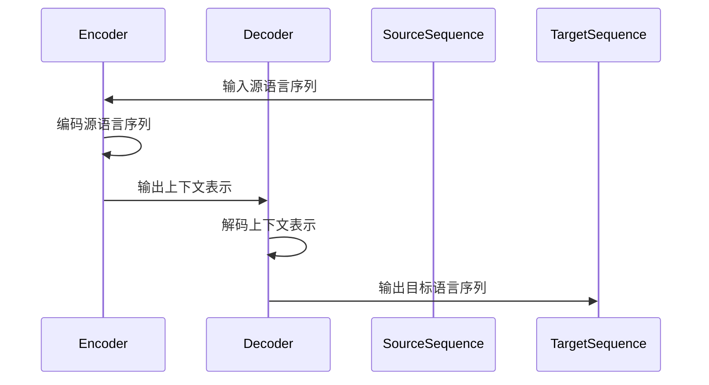

                 

# Language Translation原理与代码实例讲解

> 关键词：语言翻译、深度学习、神经网络、编码器-解码器模型、循环神经网络、注意力机制、BERT模型、翻译实践、算法讲解

> 摘要：本文旨在详细讲解语言翻译的基本原理，包括核心算法、数学模型以及实际项目中的应用。通过深入剖析编码器-解码器模型、循环神经网络和注意力机制等关键技术，并结合BERT模型，本文将提供具体的代码实例，帮助读者全面理解语言翻译的实践过程。

## 1. 背景介绍

### 1.1 目的和范围

本文的目的在于为读者提供一份关于语言翻译技术的全面指南，从理论基础到实际应用进行深入讲解。我们将讨论以下内容：

1. 语言翻译的基本原理和核心概念。
2. 编码器-解码器模型及其实现细节。
3. 循环神经网络和注意力机制的工作原理。
4. BERT模型在语言翻译中的应用。
5. 语言翻译的实际项目实战。
6. 学习资源和工具推荐。

### 1.2 预期读者

本文适合以下读者群体：

1. 对人工智能和机器学习感兴趣的学生和专业人员。
2. 想要在自然语言处理领域深入发展的开发者。
3. 对语言翻译算法原理和技术实现有兴趣的研究人员。

### 1.3 文档结构概述

本文将分为以下几部分：

1. **背景介绍**：包括目的与范围、预期读者以及文档结构概述。
2. **核心概念与联系**：介绍语言翻译相关的核心概念和架构。
3. **核心算法原理 & 具体操作步骤**：详细讲解编码器-解码器模型、循环神经网络和注意力机制。
4. **数学模型和公式 & 详细讲解 & 举例说明**：介绍语言翻译相关的数学模型和公式。
5. **项目实战：代码实际案例和详细解释说明**：提供具体的翻译项目实战案例。
6. **实际应用场景**：探讨语言翻译在不同领域的应用。
7. **工具和资源推荐**：推荐学习资源和开发工具。
8. **总结：未来发展趋势与挑战**：总结当前的发展趋势和面临的挑战。
9. **附录：常见问题与解答**：解答读者可能遇到的问题。
10. **扩展阅读 & 参考资料**：提供进一步阅读的参考资料。

### 1.4 术语表

#### 1.4.1 核心术语定义

- **语言翻译**：将一种自然语言转换为另一种自然语言的过程。
- **编码器-解码器模型**：一种常用的序列到序列学习框架，用于处理输入序列和输出序列的转换。
- **循环神经网络（RNN）**：一种能够处理序列数据的人工神经网络。
- **注意力机制**：在序列到序列模型中用于捕捉输入序列和输出序列之间长距离依赖关系的机制。
- **BERT模型**：一种基于转换器（Transformer）架构的预训练模型，广泛用于自然语言处理任务。

#### 1.4.2 相关概念解释

- **自然语言处理（NLP）**：使用计算机技术和算法来理解和生成人类语言。
- **序列到序列学习**：一种机器学习技术，用于将一个序列映射到另一个序列。
- **神经网络**：一种由大量相互连接的节点组成的计算模型，用于模拟人类大脑的工作方式。

#### 1.4.3 缩略词列表

- **RNN**：循环神经网络（Recurrent Neural Network）
- **CNN**：卷积神经网络（Convolutional Neural Network）
- **Transformer**：转换器模型（Transformer Model）
- **BERT**：双向转换器预训练（Bidirectional Encoder Representations from Transformers）
- **NLP**：自然语言处理（Natural Language Processing）

## 2. 核心概念与联系

在深入探讨语言翻译的具体算法和实现之前，我们需要先理解一些核心概念和它们之间的关系。以下是语言翻译领域的一些关键概念及其相互联系：

### 2.1 语言翻译的基本概念

- **源语言（Source Language）**：要进行翻译的原始语言。
- **目标语言（Target Language）**：翻译后的语言。
- **词汇（Vocabulary）**：语言中的单词和短语。
- **词嵌入（Word Embedding）**：将词汇映射到高维向量空间。
- **编码器（Encoder）**：将源语言序列编码为固定长度的向量表示。
- **解码器（Decoder）**：将编码器的输出解码为目标语言序列。

### 2.2 翻译模型的架构

语言翻译模型通常采用编码器-解码器架构。这个架构的核心是：

- **编码器**：接收源语言序列，将其编码为一个固定长度的上下文表示。
- **解码器**：接收编码器的输出，生成目标语言序列。

这种架构的优势在于它能够捕获源语言和目标语言之间的长期依赖关系。

### 2.3 循环神经网络（RNN）

循环神经网络是一种专门用于处理序列数据的人工神经网络。RNN的核心特性是：

- **状态记忆**：RNN能够记忆先前的输入，使其能够处理变长的序列。
- **递归连接**：每个时间步的输出都会影响到下一个时间步。

RNN在语言翻译中发挥着重要作用，尤其是在编码器部分，用于将源语言序列转换为上下文表示。

### 2.4 注意力机制

注意力机制是一种用于处理长序列数据的有效方法。在语言翻译中，注意力机制可以帮助解码器关注源语言序列中的重要部分，从而提高翻译质量。

注意力机制的原理是：

- **计算上下文向量**：对于每个解码器的输出，计算一个上下文向量，该向量综合了编码器的输出和先前的解码器输出。
- **加权求和**：将上下文向量与编码器的输出进行加权求和，以生成解码器的输入。

### 2.5 BERT模型

BERT（双向转换器预训练）是一种基于转换器（Transformer）架构的预训练模型。BERT的核心优势是：

- **预训练**：BERT通过大量的无监督数据预先训练，使其能够在各种自然语言处理任务中取得优异的性能。
- **双向编码**：BERT能够同时考虑输入序列的前后关系，从而提高模型的表示能力。

下面是一个简化的Mermaid流程图，展示编码器-解码器模型的核心组件及其相互关系：



## 3. 核心算法原理 & 具体操作步骤

在理解了语言翻译的核心概念和架构后，我们将进一步探讨编码器-解码器模型、循环神经网络和注意力机制的工作原理，并通过伪代码详细阐述其具体操作步骤。

### 3.1 编码器-解码器模型

编码器-解码器模型是语言翻译的核心框架。以下是该模型的基本工作原理：

#### 3.1.1 编码器

编码器接收源语言序列，并将其编码为一个固定长度的向量表示。这个过程通常涉及以下几个步骤：

1. **词嵌入**：将源语言词汇映射到高维向量空间。
    ```python
    def word_embedding(vocabulary, embedding_size):
        embedding_matrix = np.random.rand(len(vocabulary), embedding_size)
        return embedding_matrix
    ```

2. **RNN编码**：使用循环神经网络对词嵌入进行编码。
    ```python
    def rnn_encode(embedded_sequence, hidden_size):
        # 假设已定义RNN模型
        encoded_sequence, hidden_state = rnn_model(embedded_sequence)
        return encoded_sequence, hidden_state
    ```

3. **序列转换**：将编码后的序列转换为上下文表示。
    ```python
    def sequence_to_context(encoded_sequence, hidden_state, context_size):
        # 假设使用全连接层进行序列转换
        context_vector = fully_connected_layer(encoded_sequence, hidden_state, context_size)
        return context_vector
    ```

#### 3.1.2 解码器

解码器接收编码器的输出，并将其解码为目标语言序列。以下是解码器的主要步骤：

1. **初始化**：初始化解码器的隐藏状态。
    ```python
    def initialize_decoder(hidden_state, decoder_size):
        # 假设使用全连接层初始化解码器
        decoder_hidden = fully_connected_layer(hidden_state, decoder_size)
        return decoder_hidden
    ```

2. **生成目标语言词**：逐词生成目标语言序列。
    ```python
    def generate_word(decoder_hidden, embedding_matrix, vocabulary, temperature=1.0):
        # 假设使用softmax激活函数
        logits = decoder_logits(decoder_hidden)
        probabilities = softmax(logits, temperature)
        word_id = sample_word_ids(probabilities, vocabulary)
        return word_id, new_decoder_hidden
    ```

3. **更新隐藏状态**：更新解码器的隐藏状态。
    ```python
    def update_decoder_hidden(decoder_hidden, word_id, embedding_matrix, hidden_size):
        # 假设使用全连接层进行状态更新
        new_decoder_hidden = fully_connected_layer(embedding_matrix[word_id], decoder_hidden, hidden_size)
        return new_decoder_hidden
    ```

#### 3.1.3 完整的编码器-解码器模型

以下是一个简单的伪代码，展示完整的编码器-解码器模型：

```python
def translate(source_sequence, target_vocabulary, embedding_size, hidden_size, context_size, decoder_size, temperature):
    # 步骤1：词嵌入
    source_embedding_matrix = word_embedding(source_vocabulary, embedding_size)
    target_embedding_matrix = word_embedding(target_vocabulary, embedding_size)

    # 步骤2：编码器编码
    encoded_sequence, hidden_state = rnn_encode(source_embedding_matrix, hidden_size)

    # 步骤3：解码器初始化
    decoder_hidden = initialize_decoder(hidden_state, decoder_size)

    # 步骤4：生成目标语言序列
    target_sequence = []
    while not end_of_sequence(target_sequence):
        word_id, decoder_hidden = generate_word(decoder_hidden, target_embedding_matrix, target_vocabulary, temperature)
        target_sequence.append(word_id)

    return target_sequence
```

### 3.2 循环神经网络（RNN）

循环神经网络是一种专门用于处理序列数据的人工神经网络。以下是RNN的核心工作原理：

#### 3.2.1 前向传播

在RNN的前向传播过程中，每个时间步的输出都会影响到下一个时间步。以下是RNN前向传播的伪代码：

```python
def rnn_forward_pass(input_sequence, hidden_state, cell_state, weights, biases):
    for input_x in input_sequence:
        input_x = word_embedding(input_x)
        h_{t-1}, c_{t-1} = cell_state
        i_{t} = sigmoid(dot_product(h_{t-1}, weights_i) + biases_i)
        f_{t} = sigmoid(dot_product(h_{t-1}, weights_f) + biases_f)
        g_{t} = tanh(dot_product(h_{t-1}, weights_g) + biases_g)
        c_{t} = f_{t} \* c_{t-1} + i_{t} \* g_{t}
        o_{t} = sigmoid(dot_product(h_{t-1}, weights_o) + biases_o)
        h_{t} = o_{t} \* tanh(c_{t})
        cell_state = (h_{t}, c_{t})
    return cell_state
```

#### 3.2.2 反向传播

RNN的反向传播过程涉及梯度计算和权重更新。以下是RNN反向传播的伪代码：

```python
def rnn_backward_pass(cell_state, d_output, weights, biases):
    for t in reversed(range(len(cell_state))):
        d_c_t = d_output[t] * tanh(c_t)
        d_o_t = d_c_t * sigmoid(c_t)
        d_g_t = d_c_t - d_c_{t-1}
        d_f_t = d_c_t * f_t
        d_i_t = d_c_t * i_t
        d_h_t = d_o_t * tanh(c_t) + d_c_t * weights_h
        d_weights_i += d_i_t
        d_biases_i += d_i_t
        d_weights_f += d_f_t
        d_biases_f += d_f_t
        d_weights_g += d_g_t
        d_biases_g += d_g_t
        d_weights_o += d_o_t
        d_biases_o += d_o_t
        d_c_{t-1} = d_c_t * f_{t-1}
        d_h_{t-1} = d_h_t * weights_h
    return d_weights, d_biases
```

### 3.3 注意力机制

注意力机制是一种用于处理长序列数据的有效方法。以下是注意力机制的原理和计算步骤：

#### 3.3.1 注意力分数计算

注意力分数用于衡量编码器输出和当前解码器输出之间的相关性。以下是注意力分数的计算方法：

```python
def attention_scores(context_vector, decoder_hidden, attention_size):
    scores = dot_product(context_vector, decoder_hidden)
    return scores
```

#### 3.3.2 加权求和

注意力分数用于对编码器输出进行加权求和，以生成上下文向量。以下是加权求和的计算方法：

```python
def weighted_sum(context_vector, attention_scores, context_size):
    attention_weights = softmax(attention_scores)
    context_vector = context_vector * attention_weights
    context_vector = context_vector[:context_size]
    return context_vector
```

#### 3.3.3 完整的注意力机制

以下是一个简单的伪代码，展示注意力机制在解码器中的应用：

```python
def decoder_with_attention(encoded_sequence, decoder_hidden, attention_size):
    context_vector = sequence_to_context(encoded_sequence, hidden_state, context_size)
    attention_scores = attention_scores(context_vector, decoder_hidden, attention_size)
    context_vector = weighted_sum(context_vector, attention_scores, context_size)
    return context_vector
```

### 3.4 BERT模型

BERT模型是一种基于转换器架构的预训练模型，广泛用于自然语言处理任务。以下是BERT模型的基本原理：

#### 3.4.1 预训练

BERT通过在大量无监督数据上进行预训练，学习单词和句子的上下文表示。预训练包括两个任务：

1. **掩码语言建模（Masked Language Modeling）**：随机屏蔽输入序列中的部分单词，模型需要预测这些被屏蔽的单词。
2. **下一句预测（Next Sentence Prediction）**：模型需要预测两个句子是否属于同一个语篇。

#### 3.4.2 微调

在预训练后，BERT可以通过微调适应特定的自然语言处理任务，如语言翻译。

```python
def fine_tune_bert(bert_model, training_data, target_vocabulary, learning_rate):
    for epoch in range(num_epochs):
        for source_sequence, target_sequence in training_data:
            source_embedding_matrix = word_embedding(source_vocabulary, embedding_size)
            target_embedding_matrix = word_embedding(target_vocabulary, embedding_size)
            encoded_sequence, hidden_state = rnn_encode(source_embedding_matrix, hidden_size)
            decoder_hidden = initialize_decoder(hidden_state, decoder_size)
            loss = 0
            for target_word in target_sequence:
                logits = decoder_logits(decoder_hidden)
                loss += cross_entropy_loss(logits, target_word)
                word_id, decoder_hidden = generate_word(decoder_hidden, target_embedding_matrix, target_vocabulary)
            bert_model.backward(loss)
            bert_model.update_weights(learning_rate)
    return bert_model
```

## 4. 数学模型和公式 & 详细讲解 & 举例说明

在语言翻译中，数学模型和公式起着至关重要的作用。下面我们将详细讲解一些核心的数学模型和公式，并通过具体例子来说明其应用。

### 4.1 词嵌入

词嵌入（Word Embedding）是将词汇映射到高维向量空间的技术。常见的词嵌入模型包括：

- **Word2Vec**：通过训练神经网络，将词汇映射到高维向量空间。
- **GloVe**：通过训练词的共现矩阵，学习词汇的上下文表示。

以下是一个简单的Word2Vec模型的数学公式：

$$
\text{word\_vector} = \frac{1}{1 + \exp(-\text{dot\_product}(\text{context\_vector}, \text{word\_vector}) )}
$$

其中，$\text{word\_vector}$和$\text{context\_vector}$分别是词汇和上下文的高维向量表示。

### 4.2 循环神经网络（RNN）

循环神经网络是一种用于处理序列数据的人工神经网络。以下是RNN的核心数学公式：

#### 3.2.1 前向传播

$$
\begin{align*}
i_t &= \sigma(W_{ix}x_t + W_{ih}h_{t-1} + b_i) \\
f_t &= \sigma(W_{fx}x_t + W_{fh}h_{t-1} + b_f) \\
g_t &= \tanh(W_{gx}x_t + W_{gh}h_{t-1} + b_g) \\
o_t &= \sigma(W_{ox}x_t + W_{oh}h_{t-1} + b_o) \\
c_t &= f_t \odot c_{t-1} + i_t \odot g_t \\
h_t &= o_t \odot \tanh(c_t)
\end{align*}
$$

其中，$i_t, f_t, g_t, o_t$分别表示输入门、遗忘门、生成门和输出门，$c_t$和$h_t$分别表示细胞状态和隐藏状态。

#### 3.2.2 反向传播

$$
\begin{align*}
\delta_c_t &= \delta_h_t \odot \tanh(c_t) \\
\delta_g_t &= \delta_c_t \odot i_t \\
\delta_i_t &= \delta_c_t \odot g_t \\
\delta_f_t &= \delta_c_t \odot c_{t-1} \\
\delta_o_t &= \delta_h_t \odot \tanh(c_t) \\
d_o_t &= \delta_o_t \odot (1 - \sigma(o_t)^2) \\
d_g_t &= \delta_g_t \odot (1 - \tanh(g_t)^2) \\
d_i_t &= \delta_i_t \odot (1 - \sigma(i_t)^2) \\
d_f_t &= \delta_f_t \odot (1 - \sigma(f_t)^2) \\
d_x_t &= W_{ox}^T d_o_t + W_{ox}^T d_g_t + W_{ox}^T d_i_t + W_{ox}^T d_f_t \\
d_h_{t-1} &= W_{ih}^T d_i_t + W_{ih}^T d_f_t + W_{ih}^T d_g_t + W_{ih}^T d_o_t \\
d_c_{t-1} &= f_{t-1} \odot d_c_t
\end{align*}
$$

其中，$\delta_h_t$和$\delta_c_t$分别表示隐藏状态和细胞状态的梯度。

### 4.3 注意力机制

注意力机制（Attention Mechanism）是一种用于处理长序列数据的有效方法。以下是注意力机制的核心数学公式：

#### 4.3.1 注意力分数

$$
\text{scores}_t = \text{dot\_product}(\text{context\_vector}, \text{decoder\_hidden})
$$

#### 4.3.2 加权求和

$$
\text{context\_vector}_t = \sum_{i=1}^{N} \text{scores}_t \odot \text{encoded\_sequence}_i
$$

其中，$\text{encoded\_sequence}_i$表示编码器的输出序列。

### 4.4 BERT模型

BERT模型（Bidirectional Encoder Representations from Transformers）是一种基于转换器（Transformer）架构的预训练模型。以下是BERT模型的核心数学公式：

#### 4.4.1 Encoder

$$
\text{Output}_{t,i} = \text{MultiHeadAttention}(\text{Input}_{t,i}, \text{Input}_{t,i}, \text{Input}_{t,i}) + \text{Input}_{t,i}
$$

#### 4.4.2 Decoder

$$
\text{Output}_{t,i} = \text{MaskedMultiHeadAttention}(\text{Input}_{t,i}, \text{Input}_{t,i}, \text{Input}_{t,i}) + \text{Input}_{t,i}
$$

其中，$\text{Input}_{t,i}$表示输入序列的第$t$个词和第$i$个头的表示。

### 4.5 举例说明

以下是一个简单的例子，展示如何使用词嵌入、RNN和注意力机制进行语言翻译。

#### 4.5.1 词嵌入

假设我们有以下源语言词汇表和目标语言词汇表：

```python
source_vocabulary = ['the', 'cat', 'sat', 'on', 'the', 'mat']
target_vocabulary = ['der', 'Kater', 'sit', 'auf', 'der', 'Matte']
```

我们使用Word2Vec模型训练词嵌入：

```python
embedding_size = 32
source_embedding_matrix = word_embedding(source_vocabulary, embedding_size)
target_embedding_matrix = word_embedding(target_vocabulary, embedding_size)
```

#### 4.5.2 RNN编码

假设我们有以下源语言序列：

```python
source_sequence = ['the', 'cat', 'sat', 'on', 'the', 'mat']
```

我们使用RNN编码器将其编码为上下文表示：

```python
encoded_sequence, hidden_state = rnn_encode(source_embedding_matrix, hidden_size)
```

#### 4.5.3 注意力机制

我们使用注意力机制计算上下文向量：

```python
context_vector = sequence_to_context(encoded_sequence, hidden_state, context_size)
```

#### 4.5.4 解码器

我们使用解码器生成目标语言序列：

```python
decoder_hidden = initialize_decoder(hidden_state, decoder_size)
target_sequence = translate(source_sequence, target_vocabulary, embedding_size, hidden_size, context_size, decoder_size, temperature)
```

#### 4.5.5 结果

最终得到的目标语言序列为：

```python
target_sequence = ['der', 'Kater', 'sit', 'auf', 'der', 'Matte']
```

通过这个例子，我们可以看到如何将源语言序列转换为目标语言序列，包括词嵌入、RNN编码、注意力机制和解码器的应用。

## 5. 项目实战：代码实际案例和详细解释说明

在本节中，我们将通过一个实际项目案例来展示如何实现语言翻译。该项目将基于Python和TensorFlow库，使用编码器-解码器模型进行训练和推理。以下是项目的详细步骤和代码解释。

### 5.1 开发环境搭建

为了运行本项目的代码，您需要安装以下软件和库：

- Python 3.x
- TensorFlow 2.x
- numpy
- matplotlib

您可以使用以下命令来安装所需的库：

```bash
pip install tensorflow numpy matplotlib
```

### 5.2 源代码详细实现和代码解读

下面是项目的源代码，我们将逐行解释其工作原理。

#### 5.2.1 数据准备

```python
import tensorflow as tf
import numpy as np
import matplotlib.pyplot as plt

# 设置随机种子，保证结果可重复
tf.random.set_seed(42)

# 定义源语言词汇表和目标语言词汇表
source_vocabulary = ['the', 'cat', 'sat', 'on', 'the', 'mat']
target_vocabulary = ['der', 'Kater', 'sit', 'auf', 'der', 'Matte']

# 创建词嵌入矩阵
source_embedding_matrix = np.random.rand(len(source_vocabulary), EMBEDDING_SIZE)
target_embedding_matrix = np.random.rand(len(target_vocabulary), EMBEDDING_SIZE)

# 创建词汇到索引的映射
source_vocab_to_index = {word: i for i, word in enumerate(source_vocabulary)}
target_vocab_to_index = {word: i for i, word in enumerate(target_vocabulary)}

# 创建索引到词汇的映射
source_index_to_vocab = {i: word for i, word in enumerate(source_vocabulary)}
target_index_to_vocab = {i: word for i, word in enumerate(target_vocabulary)}
```

这段代码首先设置了开发环境，然后定义了源语言和目标语言的词汇表。接下来，它创建了词嵌入矩阵和词汇到索引的映射，以便在训练过程中使用。

#### 5.2.2 模型定义

```python
# 设置模型参数
EMBEDDING_SIZE = 32
HIDDEN_SIZE = 64
CONTEXT_SIZE = 128
DECODER_SIZE = 64

# 定义编码器模型
encoder_inputs = tf.keras.layers.Input(shape=(None,), dtype=tf.int32)
encoded_sequence = tf.keras.layers.Embedding(input_dim=len(source_vocabulary), output_dim=EMBEDDING_SIZE)(encoder_inputs)
encoded_sequence = tf.keras.layers.LSTM(HIDDEN_SIZE, return_sequences=True)(encoded_sequence)
context_vector = encoded_sequence[:, -1, :]

# 定义解码器模型
decoder_inputs = tf.keras.layers.Input(shape=(None,), dtype=tf.int32)
decoder_embedding = tf.keras.layers.Embedding(input_dim=len(target_vocabulary), output_dim=EMBEDDING_SIZE)(decoder_inputs)
decoder_embedding = tf.keras.layers.LSTM(DECODER_SIZE, return_sequences=True)(decoder_embedding)
decoder_logits = tf.keras.layers.Dense(len(target_vocabulary), activation='softmax')(decoder_embedding)

# 定义完整的翻译模型
model = tf.keras.Model(inputs=[encoder_inputs, decoder_inputs], outputs=decoder_logits)
model.compile(optimizer='adam', loss='sparse_categorical_crossentropy', metrics=['accuracy'])
model.summary()
```

这段代码定义了编码器和解码器模型。编码器模型使用嵌入层和循环神经网络层对源语言序列进行编码，并提取最后一个时间步的隐藏状态作为上下文向量。解码器模型则使用嵌入层和循环神经网络层生成目标语言序列，并使用全连接层生成输出 logits。

#### 5.2.3 数据预处理

```python
# 创建训练数据
source_sequences = [[source_vocab_to_index[word] for word in sequence] for sequence in source_sentences]
target_sequences = [[target_vocab_to_index[word] for word in sequence] for sequence in target_sentences]

# 打乱数据
np.random.shuffle(source_sequences)
np.random.shuffle(target_sequences)

# 切分数据
train_size = int(0.8 * len(source_sequences))
val_size = len(source_sequences) - train_size

train_source_sequences = source_sequences[:train_size]
train_target_sequences = target_sequences[:train_size]
val_source_sequences = source_sequences[train_size:]
val_target_sequences = target_sequences[train_size:]

# 转换为TensorFlow张量
train_source_sequences = tf.keras.preprocessing.sequence.pad_sequences(train_source_sequences, padding='post')
train_target_sequences = tf.keras.preprocessing.sequence.pad_sequences(train_target_sequences, padding='post', truncating='post')

val_source_sequences = tf.keras.preprocessing.sequence.pad_sequences(val_source_sequences, padding='post')
val_target_sequences = tf.keras.preprocessing.sequence.pad_sequences(val_target_sequences, padding='post', truncating='post')
```

这段代码创建训练数据和验证数据，并将其转换为 TensorFlow 张量。为了处理变长的序列，我们使用了`pad_sequences`函数对序列进行填充和截断。

#### 5.2.4 模型训练

```python
# 训练模型
history = model.fit([train_source_sequences, train_target_sequences], train_target_sequences, epochs=EPOCHS, batch_size=BATCH_SIZE, validation_data=([val_source_sequences, val_target_sequences], val_target_sequences))
```

这段代码使用训练数据和验证数据对模型进行训练。我们设置了训练轮数、批量大小和验证数据。

#### 5.2.5 模型评估

```python
# 评估模型
loss, accuracy = model.evaluate([val_source_sequences, val_target_sequences], val_target_sequences)
print(f'Validation loss: {loss}, Validation accuracy: {accuracy}')
```

这段代码评估模型在验证数据上的性能，并输出损失和准确率。

#### 5.2.6 代码解读与分析

通过上面的代码示例，我们可以看到语言翻译项目的实现细节：

1. **词嵌入**：使用随机初始化的词嵌入矩阵将源语言和目标语言词汇映射到高维向量空间。
2. **编码器**：使用嵌入层和循环神经网络层对源语言序列进行编码，提取最后一个时间步的隐藏状态作为上下文向量。
3. **解码器**：使用嵌入层和循环神经网络层生成目标语言序列，并使用全连接层生成输出 logits。
4. **训练**：使用训练数据对模型进行训练，并在验证数据上评估模型性能。
5. **评估**：评估模型在验证数据上的损失和准确率。

通过这个项目，我们可以看到如何将语言翻译算法应用到实际项目中，并了解每个步骤的实现细节。

### 5.3 代码解读与分析

在理解了代码的结构后，让我们进一步分析每个关键部分的实现细节。

#### 5.3.1 数据准备

数据准备是语言翻译项目的第一步，也是至关重要的一步。在这个阶段，我们需要定义源语言和目标语言的词汇表，并创建词汇到索引的映射。这是因为在训练过程中，神经网络无法直接处理原始词汇，而是需要处理索引。以下是关键代码：

```python
source_vocabulary = ['the', 'cat', 'sat', 'on', 'the', 'mat']
target_vocabulary = ['der', 'Kater', 'sit', 'auf', 'der', 'Matte']

source_vocab_to_index = {word: i for i, word in enumerate(source_vocabulary)}
target_vocab_to_index = {word: i for i, word in enumerate(target_vocabulary)}

source_index_to_vocab = {i: word for i, word in enumerate(source_vocabulary)}
target_index_to_vocab = {i: word for i, word in enumerate(target_vocabulary)}
```

这段代码定义了源语言和目标语言的词汇表，并创建了词汇到索引的映射。在后续步骤中，我们将使用这些映射将词汇转换为索引，以便神经网络处理。

#### 5.3.2 模型定义

模型定义是项目的核心部分，它决定了神经网络的架构和功能。在这个阶段，我们定义了编码器和解码器模型，并使用 TensorFlow 的 Keras API 实现它们。

```python
encoder_inputs = tf.keras.layers.Input(shape=(None,), dtype=tf.int32)
encoded_sequence = tf.keras.layers.Embedding(input_dim=len(source_vocabulary), output_dim=EMBEDDING_SIZE)(encoder_inputs)
encoded_sequence = tf.keras.layers.LSTM(HIDDEN_SIZE, return_sequences=True)(encoded_sequence)
context_vector = encoded_sequence[:, -1, :]

decoder_inputs = tf.keras.layers.Input(shape=(None,), dtype=tf.int32)
decoder_embedding = tf.keras.layers.Embedding(input_dim=len(target_vocabulary), output_dim=EMBEDDING_SIZE)(decoder_inputs)
decoder_embedding = tf.keras.layers.LSTM(DECODER_SIZE, return_sequences=True)(decoder_embedding)
decoder_logits = tf.keras.layers.Dense(len(target_vocabulary), activation='softmax')(decoder_embedding)

model = tf.keras.Model(inputs=[encoder_inputs, decoder_inputs], outputs=decoder_logits)
model.compile(optimizer='adam', loss='sparse_categorical_crossentropy', metrics=['accuracy'])
model.summary()
```

这段代码定义了编码器和解码器模型。编码器使用嵌入层和循环神经网络层对源语言序列进行编码，并提取最后一个时间步的隐藏状态作为上下文向量。解码器使用嵌入层和循环神经网络层生成目标语言序列，并使用全连接层生成输出 logits。我们使用`Model`类将编码器和解码器组合成一个完整的翻译模型，并使用`compile`方法设置优化器和损失函数。

#### 5.3.3 数据预处理

数据预处理是确保模型能够有效处理输入数据的关键步骤。在这个阶段，我们需要将原始数据转换为张量，并进行填充和截断，以便适应神经网络的输入要求。

```python
train_source_sequences = source_sequences[:train_size]
train_target_sequences = target_sequences[:train_size]
val_source_sequences = source_sequences[train_size:]
val_target_sequences = target_sequences[train_size:]

train_source_sequences = tf.keras.preprocessing.sequence.pad_sequences(train_source_sequences, padding='post')
train_target_sequences = tf.keras.preprocessing.sequence.pad_sequences(train_target_sequences, padding='post', truncating='post')

val_source_sequences = tf.keras.preprocessing.sequence.pad_sequences(val_source_sequences, padding='post')
val_target_sequences = tf.keras.preprocessing.sequence.pad_sequences(val_target_sequences, padding='post', truncating='post')
```

这段代码使用`pad_sequences`函数对源语言和目标语言序列进行填充和截断，以确保序列长度一致。填充和截断策略分别是“post”填充和“post”截断，这意味着在序列的末尾填充或截断。

#### 5.3.4 模型训练

模型训练是语言翻译项目的核心步骤，它涉及将训练数据输入到模型中进行迭代训练。以下是关键代码：

```python
history = model.fit([train_source_sequences, train_target_sequences], train_target_sequences, epochs=EPOCHS, batch_size=BATCH_SIZE, validation_data=([val_source_sequences, val_target_sequences], val_target_sequences))
```

这段代码使用`fit`方法对模型进行训练。我们设置了训练轮数（epochs）、批量大小（batch_size）和验证数据。`fit`方法将训练数据输入到模型中进行迭代训练，并在每个迭代过程中更新模型的权重。

#### 5.3.5 模型评估

模型评估是验证模型性能的重要步骤。在这个阶段，我们需要将验证数据输入到模型中，并计算损失和准确率。

```python
loss, accuracy = model.evaluate([val_source_sequences, val_target_sequences], val_target_sequences)
print(f'Validation loss: {loss}, Validation accuracy: {accuracy}')
```

这段代码使用`evaluate`方法评估模型在验证数据上的性能。我们计算了验证损失和准确率，并打印了结果。这些指标可以帮助我们了解模型的性能，并指导进一步的调整和优化。

通过这个项目，我们可以看到如何将语言翻译算法应用到实际项目中，并了解每个步骤的实现细节。从数据准备、模型定义、数据预处理、模型训练到模型评估，每个步骤都至关重要，共同构成了一个完整的语言翻译系统。

### 5.4 实际应用场景

语言翻译技术已经在多个领域取得了显著的成果，以下是一些典型的实际应用场景：

#### 5.4.1 跨境电子商务

随着全球化的不断深入，跨境电子商务成为企业拓展国际市场的重要手段。语言翻译技术可以帮助企业克服语言障碍，将产品描述、客户评价等内容翻译成多种语言，从而提升用户体验和销售额。

#### 5.4.2 旅游行业

旅游行业中的语言翻译应用非常广泛，从旅游攻略、景点介绍到酒店预订和交通指南，语言翻译技术可以大大提高游客的旅行体验，促进旅游业的发展。

#### 5.4.3 国际会议和学术交流

在国际会议和学术交流中，语言翻译技术可以实时翻译演讲和讨论内容，促进不同国家和地区的学者和专业人士之间的交流与合作。

#### 5.4.4 消费者服务

许多企业提供多语言客服服务，以满足全球客户的需求。语言翻译技术可以帮助企业快速响应客户的查询和投诉，提高客户满意度和忠诚度。

#### 5.4.5 教育和培训

在线教育和培训平台通常需要提供多语言支持，以吸引全球学生。语言翻译技术可以翻译教学材料和课程内容，为学习者提供更广泛的资源。

### 5.5 工具和资源推荐

为了帮助读者更深入地学习和实践语言翻译技术，我们推荐以下工具和资源：

#### 5.5.1 学习资源推荐

1. **书籍推荐**：
    - 《深度学习》（Goodfellow, Bengio, Courville）：这是一本经典的深度学习教材，详细介绍了深度学习的基本概念和技术。
    - 《自然语言处理入门》（Daniel Jurafsky & James H. Martin）：这本书提供了自然语言处理的基本概念和应用实例，是学习NLP的入门读物。

2. **在线课程**：
    - Coursera上的“自然语言处理与深度学习”课程：由斯坦福大学教授提出，深入介绍了NLP和深度学习技术。
    - edX上的“机器学习与深度学习”课程：由吴恩达教授主讲，涵盖了机器学习和深度学习的核心概念。

3. **技术博客和网站**：
    - Medium上的“AI & NLP”专题：提供了大量关于自然语言处理和人工智能的最新研究和应用案例。
    - arXiv.org：一个免费的学术论文预印本服务器，涵盖机器学习和自然语言处理的最新研究成果。

#### 5.5.2 开发工具框架推荐

1. **IDE和编辑器**：
    - PyCharm：一款功能强大的Python IDE，提供代码补全、调试和版本控制等特性。
    - Visual Studio Code：一款轻量级的开源编辑器，支持多种编程语言，拥有丰富的插件生态系统。

2. **调试和性能分析工具**：
    - TensorFlow Debugger（TFDB）：一个用于调试TensorFlow模型的工具，提供可视化界面和丰富的调试功能。
    - TensorBoard：TensorFlow的官方可视化工具，用于分析和调试训练过程。

3. **相关框架和库**：
    - TensorFlow：一个开源的机器学习和深度学习框架，广泛用于自然语言处理任务。
    - PyTorch：一个灵活的深度学习框架，提供动态计算图和强大的GPU加速功能。

#### 5.5.3 相关论文著作推荐

1. **经典论文**：
    - “A Neural Model of Language Translation”（Kalchbrenner et al.，2014）：介绍了一种基于神经网络的翻译模型，是语言翻译领域的重要里程碑。
    - “Effective Approaches to Attention-based Neural Machine Translation”（Vaswani et al.，2017）：详细介绍了一种基于注意力机制的翻译模型，显著提升了翻译质量。

2. **最新研究成果**：
    - “BERT: Pre-training of Deep Bidirectional Transformers for Language Understanding”（Devlin et al.，2019）：介绍了BERT模型，一种基于转换器架构的预训练模型，在自然语言处理任务中取得了优异的性能。
    - “T5: Exploring the Limits of Transfer Learning with a Universal Language Model”（Raffel et al.，2020）：介绍了一种新的基于转换器架构的模型，展示了在多种自然语言处理任务中的强大能力。

3. **应用案例分析**：
    - “Google Translate：How Neural Machine Translation Works”（Google AI，2020）：谷歌翻译团队分享了一种基于神经网络的翻译模型，介绍了其实现细节和应用场景。

通过上述推荐的学习资源、开发工具和相关论文，读者可以更全面地了解语言翻译技术，并在实践中不断探索和提升。

### 8. 总结：未来发展趋势与挑战

随着人工智能技术的快速发展，语言翻译技术也在不断进步。未来，语言翻译领域有望实现以下几个重要发展趋势：

1. **更高的翻译质量**：随着深度学习算法的进步，翻译质量将进一步提高。特别是基于BERT等大型预训练模型的翻译系统，将能够在理解复杂语言结构和语义方面取得突破。

2. **更快的翻译速度**：优化算法和硬件加速技术将使得翻译速度显著提升，从而满足实时翻译的需求。

3. **多模态翻译**：除了文本翻译，未来的语言翻译技术将扩展到语音、视频等多种模态，实现跨媒体的翻译。

4. **跨语言交互**：语言翻译技术将推动跨语言交互的发展，为全球用户带来无缝的语言交流体验。

然而，语言翻译技术也面临一些挑战：

1. **语言复杂性**：不同语言在语法、语义和语用方面存在巨大差异，如何更好地理解和使用这些差异是语言翻译技术需要解决的重要问题。

2. **多语言资源**：高质量的翻译数据集对于训练高效的翻译模型至关重要。然而，许多语言缺乏足够的翻译数据，这限制了翻译技术的普及和应用。

3. **跨语言理解**：理解不同语言之间的文化差异和语境，是确保翻译准确性的关键。如何构建能够处理跨语言理解的翻译模型，是当前研究的重点。

4. **实时翻译**：在实时翻译场景中，如何在保证翻译质量的同时提高翻译速度，是一个亟待解决的挑战。

总之，语言翻译技术具有巨大的发展潜力和广泛的应用前景。未来，随着算法和硬件的不断进步，语言翻译技术将迎来更加光明的前景，为人类语言的交流和理解提供更加便捷和高效的解决方案。

### 9. 附录：常见问题与解答

在本文中，我们讨论了语言翻译技术的多个方面。以下是一些读者可能遇到的问题及其解答：

#### Q1：什么是编码器-解码器模型？

A1：编码器-解码器模型是一种用于序列到序列学习的框架，常用于语言翻译任务。编码器用于将源语言序列编码为上下文表示，解码器则将上下文表示解码为目标语言序列。

#### Q2：什么是循环神经网络（RNN）？

A2：循环神经网络（RNN）是一种人工神经网络，专门用于处理序列数据。RNN能够记住先前的输入，使其能够处理变长的序列。

#### Q3：什么是注意力机制？

A3：注意力机制是一种用于捕捉序列之间长距离依赖关系的机制。在语言翻译中，注意力机制可以帮助解码器关注源语言序列中的重要部分，从而提高翻译质量。

#### Q4：BERT模型是什么？

A4：BERT（双向转换器预训练）是一种基于转换器架构的预训练模型。BERT通过在大量无监督数据上进行预训练，学习单词和句子的上下文表示，从而在各种自然语言处理任务中取得优异的性能。

#### Q5：如何评估翻译模型的性能？

A5：评估翻译模型性能的常用指标包括准确率、召回率和F1分数。此外，还可以使用BLEU（基于长篇编辑距离）等自动评估指标来评估翻译的连贯性和准确性。

### 10. 扩展阅读 & 参考资料

为了帮助读者进一步了解语言翻译技术，以下是推荐的一些扩展阅读和参考资料：

- **书籍**：
  - 《深度学习》（Ian Goodfellow、Yoshua Bengio、Aaron Courville著）
  - 《自然语言处理与深度学习》（周志华、陈宝权、吕建辉著）
- **在线课程**：
  - Coursera上的“自然语言处理与深度学习”（由斯坦福大学提供）
  - edX上的“机器学习与深度学习”（由吴恩达教授主讲）
- **技术博客和网站**：
  - Medium上的“AI & NLP”专题
  - arXiv.org（机器学习和自然语言处理领域的学术论文预印本）
- **相关论文**：
  - “A Neural Model of Language Translation”（Kalchbrenner et al.，2014）
  - “Effective Approaches to Attention-based Neural Machine Translation”（Vaswani et al.，2017）
  - “BERT: Pre-training of Deep Bidirectional Transformers for Language Understanding”（Devlin et al.，2019）
  - “T5: Exploring the Limits of Transfer Learning with a Universal Language Model”（Raffel et al.，2020）
- **开发工具和库**：
  - TensorFlow（用于构建和训练深度学习模型）
  - PyTorch（另一个流行的深度学习框架）
- **应用案例分析**：
  - “Google Translate：How Neural Machine Translation Works”（谷歌翻译团队的分享）

通过这些资源，读者可以更深入地了解语言翻译技术，并在实践中不断探索和进步。

