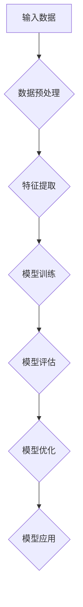
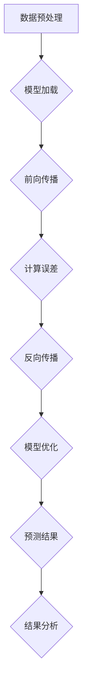

                 

# Large Action Model 的适应性

> 关键词：大动作模型，模型适应性，人工智能，深度学习，推理，优化，应用场景

> 摘要：本文将深入探讨大型动作模型（Large Action Model）的适应性问题。首先，我们将介绍大动作模型的基本概念和其在人工智能领域的应用背景。接着，本文将详细分析大动作模型的适应性问题，包括其优势、挑战以及解决策略。此外，本文还将介绍大动作模型在不同应用场景中的实际案例，探讨其在实际应用中的表现。最后，我们将对大动作模型的未来发展趋势和挑战进行展望，并推荐相关工具和资源，以供读者进一步学习。

## 1. 背景介绍

### 1.1 目的和范围

本文旨在探讨大型动作模型（Large Action Model）的适应性问题。随着人工智能技术的不断发展，深度学习模型变得越来越复杂，规模也越来越大。大动作模型作为一种重要的模型类型，其在各种应用场景中具有广泛的应用前景。本文将围绕大动作模型的适应性进行深入分析，探讨其优势、挑战以及解决策略，并分享实际应用案例，以期为相关研究和应用提供参考。

### 1.2 预期读者

本文适合对人工智能、深度学习、大动作模型有一定了解的读者，包括研究人员、工程师、以及对该领域感兴趣的学习者。通过本文的阅读，读者可以更深入地了解大动作模型的适应性问题，以及其在实际应用中的表现。

### 1.3 文档结构概述

本文分为八个部分：

1. 背景介绍：介绍本文的目的、范围、预期读者以及文档结构。
2. 核心概念与联系：阐述大动作模型的基本概念和相关联系。
3. 核心算法原理 & 具体操作步骤：讲解大动作模型的核心算法原理和具体操作步骤。
4. 数学模型和公式 & 详细讲解 & 举例说明：介绍大动作模型的数学模型和公式，并进行详细讲解和举例说明。
5. 项目实战：代码实际案例和详细解释说明。
6. 实际应用场景：探讨大动作模型在不同应用场景中的实际应用。
7. 工具和资源推荐：推荐相关学习资源、开发工具和框架。
8. 总结：对大动作模型的未来发展趋势和挑战进行展望。

### 1.4 术语表

#### 1.4.1 核心术语定义

- 大动作模型：一种针对大规模数据集进行训练和预测的深度学习模型。
- 适应性：指模型在不同应用场景中的适用性和表现能力。
- 深度学习：一种基于多层神经网络进行训练和预测的人工智能技术。
- 训练数据集：用于训练模型的输入数据集。
- 预测数据集：用于评估模型性能的输入数据集。

#### 1.4.2 相关概念解释

- 神经网络：一种由多个神经元组成的计算模型，可以用于图像识别、语音识别、自然语言处理等任务。
- 神经元：神经网络的基本计算单元，可以接收输入信号并产生输出信号。
- 前馈神经网络：一种简单的神经网络结构，数据从前向后传递，每个神经元仅与前一层神经元相连。
- 反向传播算法：一种用于训练神经网络的优化算法，通过不断调整网络参数，使模型在训练数据上的预测误差最小。

#### 1.4.3 缩略词列表

- AI：人工智能
- DL：深度学习
- LSTM：长短时记忆网络
- RNN：循环神经网络
- CNN：卷积神经网络
- GPU：图形处理器

## 2. 核心概念与联系

大动作模型作为一种深度学习模型，其核心概念和联系主要包括以下几个方面：

### 2.1 大动作模型的基本概念

大动作模型是一种针对大规模数据集进行训练和预测的深度学习模型。其特点在于：

- **大规模参数**：大动作模型通常具有数十亿甚至数万亿个参数，这使得模型可以捕捉到数据中的复杂模式和关联。
- **多层级结构**：大动作模型通常包含多个隐藏层，可以实现对数据的深层特征提取。
- **端到端训练**：大动作模型可以直接从原始数据中学习到特征表示和预测目标，无需人工设计特征。

### 2.2 大动作模型的应用背景

随着人工智能技术的不断发展，深度学习模型在各个领域取得了显著的成果。大动作模型作为一种高效的模型类型，在以下应用场景中具有广泛的应用前景：

- **计算机视觉**：大动作模型可以用于图像识别、目标检测、图像生成等任务，如图像分类（ImageNet竞赛）和目标检测（Faster R-CNN）。
- **自然语言处理**：大动作模型可以用于文本分类、机器翻译、情感分析等任务，如图像描述生成（Show and Tell）和机器翻译（Google Translate）。
- **语音识别**：大动作模型可以用于语音识别、语音生成等任务，如语音识别（Google Voice Search）和语音生成（WaveNet）。

### 2.3 大动作模型的优势和挑战

大动作模型具有以下优势：

- **强大的表示能力**：大动作模型可以捕捉到数据中的复杂模式和关联，从而提高模型的预测性能。
- **端到端训练**：大动作模型可以直接从原始数据中学习到特征表示和预测目标，减少了人工设计的复杂性。

然而，大动作模型也面临着以下挑战：

- **计算资源需求**：大动作模型需要大量的计算资源进行训练，这可能导致训练成本较高。
- **数据集规模要求**：大动作模型通常需要大规模数据集进行训练，否则可能无法发挥其优势。
- **模型可解释性**：大动作模型由于其复杂的结构，往往难以解释，这可能会影响其在实际应用中的可信度和可接受度。

### 2.4 大动作模型的适应性问题

大动作模型的适应性问题主要涉及以下方面：

- **数据适应性**：大动作模型需要能够适应不同类型的数据，如图像、文本、语音等。
- **任务适应性**：大动作模型需要能够适应不同类型的任务，如分类、回归、生成等。
- **应用场景适应性**：大动作模型需要能够适应不同的应用场景，如实时应用、离线应用等。

为了解决大动作模型的适应性问题，研究者们提出了多种解决方案，如数据增强、模型压缩、迁移学习等。

### 2.5 大动作模型与其他深度学习模型的比较

大动作模型与其他深度学习模型（如卷积神经网络、循环神经网络、长短时记忆网络等）在以下几个方面进行对比：

- **模型结构**：大动作模型通常包含多个隐藏层，可以实现对数据的深层特征提取，而其他模型的结构较为简单。
- **参数数量**：大动作模型通常具有更多的参数，可以捕捉到数据中的复杂模式和关联。
- **训练成本**：大动作模型的训练成本较高，需要大量的计算资源和时间。

### 2.6 大动作模型的相关研究工作

近年来，关于大动作模型的研究工作取得了显著进展，如：

- **模型优化**：通过改进模型结构、优化训练算法等手段，提高大动作模型的性能和适应性。
- **模型压缩**：通过模型压缩技术，降低大动作模型的参数数量和计算成本，提高其在实际应用中的可扩展性。
- **迁移学习**：通过迁移学习技术，将大动作模型在不同领域中的知识进行共享，提高其在不同领域中的应用能力。

### 2.7 大动作模型的 Mermaid 流程图

以下是大动作模型的基本架构和流程的 Mermaid 流程图：



## 3. 核心算法原理 & 具体操作步骤

大动作模型（Large Action Model，LAM）是一种结合了大规模数据和复杂神经网络结构的深度学习模型。其核心算法原理包括以下几个方面：

### 3.1 模型结构

大动作模型通常采用多层神经网络结构，包括输入层、多个隐藏层和输出层。其中，隐藏层负责特征提取和转换，输出层负责生成预测结果。以下是一个简化的大动作模型结构：

```plaintext
输入层 --> 隐藏层1 --> 隐藏层2 --> ... --> 隐藏层n --> 输出层
```

### 3.2 前向传播

前向传播是深度学习模型训练过程中的一个关键步骤，它负责将输入数据传递到神经网络中，并计算每个神经元的输出值。以下是一个简化的大动作模型前向传播伪代码：

```python
# 输入数据
X = ...

# 初始化模型参数（权重和偏置）
W = ...
b = ...

# 前向传播
for layer in range(1, n_layers):
    z = activation_function(W * X + b)
    X = z

# 输出预测结果
output = activation_function(W * X + b)
```

其中，`activation_function` 是激活函数，如ReLU、Sigmoid或Tanh等。

### 3.3 反向传播

反向传播是深度学习模型训练过程中的另一个关键步骤，它负责计算模型参数的梯度，并更新模型参数，以最小化预测误差。以下是一个简化的大动作模型反向传播伪代码：

```python
# 计算输出层的误差
error = predicted_output - actual_output

# 反向传播计算梯度
d_output = error * activation_derivative(output)
d_W = X.T * d_output
d_b = d_output

# 更新模型参数
W = W - learning_rate * d_W
b = b - learning_rate * d_b

# 递归反向传播
for layer in range(n_layers - 1, 0, -1):
    error = d_output * activation_derivative(hidden_layer)
    d_output = error * W.T
    d_W = X.T * d_output
    d_b = d_output

    # 更新模型参数
    W = W - learning_rate * d_W
    b = b - learning_rate * d_b
```

### 3.4 模型训练

大动作模型的训练过程主要包括以下步骤：

1. **初始化模型参数**：随机初始化模型参数（权重和偏置）。
2. **前向传播**：将输入数据传递到神经网络中，计算每个神经元的输出值。
3. **计算误差**：计算输出层的误差，即预测值与实际值之间的差距。
4. **反向传播**：计算模型参数的梯度，并更新模型参数。
5. **迭代训练**：重复上述步骤，直到模型达到预期的性能指标。

### 3.5 模型评估

大动作模型的评估过程主要包括以下步骤：

1. **测试数据集**：将测试数据集划分为多个批次，并输入到训练好的模型中。
2. **计算预测结果**：计算每个批次的预测结果。
3. **计算误差**：计算预测结果与实际值之间的误差。
4. **评估指标**：根据评估指标（如准确率、召回率、F1分数等）评估模型的性能。

### 3.6 模型优化

为了提高大动作模型的性能和适应性，可以采用以下优化策略：

1. **正则化**：通过添加正则化项（如L1、L2正则化）来防止过拟合。
2. **批归一化**：通过批归一化（Batch Normalization）来稳定训练过程，提高模型收敛速度。
3. **数据增强**：通过数据增强（Data Augmentation）来扩充训练数据集，提高模型的泛化能力。

### 3.7 模型应用

大动作模型可以应用于各种任务，如图像分类、目标检测、自然语言处理等。以下是一个简化的模型应用流程：

1. **数据预处理**：对输入数据进行预处理，如归一化、缩放等。
2. **模型加载**：加载训练好的模型。
3. **预测**：将预处理后的数据输入到模型中，得到预测结果。
4. **结果分析**：对预测结果进行分析，如绘制混淆矩阵、计算评估指标等。

### 3.8 大动作模型的工作流程

以下是大动作模型的工作流程的 Mermaid 流程图：



## 4. 数学模型和公式 & 详细讲解 & 举例说明

大动作模型（LAM）作为一种深度学习模型，其数学模型和公式是理解和实现该模型的关键。以下将详细讲解大动作模型中的核心数学模型和公式，并进行举例说明。

### 4.1 激活函数

激活函数是深度学习模型中用于引入非线性性的函数，常见的激活函数包括ReLU、Sigmoid、Tanh等。以下为这些激活函数的数学公式和导数：

#### 4.1.1ReLU（Rectified Linear Unit）

- **公式**：
  $$ f(x) = \max(0, x) $$
- **导数**：
  $$ f'(x) = \begin{cases} 
  0, & \text{if } x < 0 \\
  1, & \text{if } x \geq 0 
  \end{cases} $$

#### 4.1.2Sigmoid

- **公式**：
  $$ f(x) = \frac{1}{1 + e^{-x}} $$
- **导数**：
  $$ f'(x) = f(x) \cdot (1 - f(x)) $$

#### 4.1.3Tanh

- **公式**：
  $$ f(x) = \frac{e^x - e^{-x}}{e^x + e^{-x}} $$
- **导数**：
  $$ f'(x) = 1 - f^2(x) $$

### 4.2 损失函数

损失函数用于度量预测值与实际值之间的差距，常见的损失函数包括均方误差（MSE）、交叉熵（CE）等。以下为这些损失函数的数学公式：

#### 4.2.1均方误差（MSE）

- **公式**：
  $$ L(y, \hat{y}) = \frac{1}{2} \sum_{i=1}^{n} (y_i - \hat{y}_i)^2 $$
- **导数**：
  $$ \frac{\partial L}{\partial \hat{y}_i} = y_i - \hat{y}_i $$

#### 4.2.2交叉熵（CE）

- **公式**：
  $$ L(y, \hat{y}) = -\sum_{i=1}^{n} y_i \cdot \log(\hat{y}_i) $$
- **导数**：
  $$ \frac{\partial L}{\partial \hat{y}_i} = y_i - \hat{y}_i $$

### 4.3 梯度下降

梯度下降是一种用于训练神经网络的优化算法，其核心思想是通过计算损失函数关于模型参数的梯度，来更新模型参数，以减少损失函数的值。以下为梯度下降的基本公式：

$$ \theta = \theta - \alpha \cdot \nabla_{\theta} L(\theta) $$

其中，$\theta$ 表示模型参数，$\alpha$ 表示学习率，$\nabla_{\theta} L(\theta)$ 表示损失函数关于模型参数的梯度。

### 4.4 举例说明

#### 4.4.1ReLU激活函数

假设输入 $x = -2$，则ReLU激活函数的输出为：

$$ f(x) = \max(0, -2) = 0 $$

#### 4.4.2Sigmoid激活函数

假设输入 $x = -2$，则Sigmoid激活函数的输出为：

$$ f(x) = \frac{1}{1 + e^{-(-2)}} = \frac{1}{1 + e^{2}} \approx 0.1353 $$

#### 4.4.3均方误差损失函数

假设实际值 $y = 3$，预测值 $\hat{y} = 2$，则均方误差损失函数的输出为：

$$ L(y, \hat{y}) = \frac{1}{2} \sum_{i=1}^{1} (3 - 2)^2 = \frac{1}{2} (1)^2 = 0.5 $$

#### 4.4.4交叉熵损失函数

假设实际值 $y = [1, 0]$，预测值 $\hat{y} = [0.2, 0.8]$，则交叉熵损失函数的输出为：

$$ L(y, \hat{y}) = -[1 \cdot \log(0.2) + 0 \cdot \log(0.8)] \approx 2.9957 $$

### 4.5 数学公式和推导

以下是对大动作模型中的关键数学公式和推导进行详细讲解：

#### 4.5.1前向传播

假设有一个三层神经网络，其中 $x$ 表示输入，$a$ 表示激活值，$z$ 表示线性变换的输出，$W$ 表示权重，$b$ 表示偏置。则前向传播的过程如下：

1. **第一层**：
   $$ z_1 = W_1 \cdot x + b_1 $$
   $$ a_1 = \text{激活函数}(z_1) $$
2. **第二层**：
   $$ z_2 = W_2 \cdot a_1 + b_2 $$
   $$ a_2 = \text{激活函数}(z_2) $$
3. **第三层**：
   $$ z_3 = W_3 \cdot a_2 + b_3 $$
   $$ \hat{y} = \text{激活函数}(z_3) $$

#### 4.5.2反向传播

反向传播过程中，我们需要计算每个层中每个参数的梯度。以下是反向传播的具体步骤：

1. **计算输出层的梯度**：
   $$ \frac{\partial L}{\partial z_3} = \text{激活函数的导数}(\hat{y}) \cdot \frac{\partial L}{\partial \hat{y}} $$
2. **计算第二层的梯度**：
   $$ \frac{\partial L}{\partial z_2} = W_3^T \cdot \frac{\partial L}{\partial z_3} $$
   $$ \frac{\partial L}{\partial a_2} = \text{激活函数的导数}(a_2) \cdot \frac{\partial L}{\partial z_2} $$
3. **计算第一层的梯度**：
   $$ \frac{\partial L}{\partial z_1} = W_2^T \cdot \frac{\partial L}{\partial z_2} $$
   $$ \frac{\partial L}{\partial a_1} = \text{激活函数的导数}(a_1) \cdot \frac{\partial L}{\partial z_1} $$

#### 4.5.3参数更新

根据梯度下降算法，我们可以更新参数如下：

1. **更新权重和偏置**：
   $$ W_1 = W_1 - \alpha \cdot \frac{\partial L}{\partial W_1} $$
   $$ b_1 = b_1 - \alpha \cdot \frac{\partial L}{\partial b_1} $$
   $$ W_2 = W_2 - \alpha \cdot \frac{\partial L}{\partial W_2} $$
   $$ b_2 = b_2 - \alpha \cdot \frac{\partial L}{\partial b_2} $$
   $$ W_3 = W_3 - \alpha \cdot \frac{\partial L}{\partial W_3} $$
   $$ b_3 = b_3 - \alpha \cdot \frac{\partial L}{\partial b_3} $$

### 4.6 模型优化策略

为了提高大动作模型的性能和适应性，我们可以采用以下优化策略：

#### 4.6.1正则化

正则化可以防止模型过拟合，常见的正则化方法包括L1正则化和L2正则化：

- **L1正则化**：
  $$ \text{Regularization} = \lambda \cdot \sum_{i=1}^{n} |\theta_i| $$
- **L2正则化**：
  $$ \text{Regularization} = \lambda \cdot \sum_{i=1}^{n} \theta_i^2 $$

#### 4.6.2批归一化

批归一化可以加速模型的训练过程，提高模型的收敛速度：

$$ \hat{x}_i = \frac{x_i - \mu}{\sigma} $$

其中，$\mu$ 和 $\sigma$ 分别为当前批次中每个特征的均值和标准差。

#### 4.6.3数据增强

数据增强可以扩充训练数据集，提高模型的泛化能力：

- **随机裁剪**：随机裁剪输入图像的一部分。
- **旋转和翻转**：随机旋转和翻转输入图像。
- **颜色调整**：随机调整输入图像的颜色。

### 4.7 大动作模型的数学模型和公式总结

大动作模型的数学模型和公式主要包括以下部分：

- **前向传播**：
  $$ z_i = \sum_{j=1}^{n} W_{ij} \cdot x_j + b_i $$
  $$ a_i = \text{激活函数}(z_i) $$
- **反向传播**：
  $$ \frac{\partial L}{\partial z_i} = \text{激活函数的导数}(a_i) \cdot \frac{\partial L}{\partial a_i} $$
  $$ \frac{\partial L}{\partial W_{ij}} = x_j \cdot \frac{\partial L}{\partial z_i} $$
  $$ \frac{\partial L}{\partial b_i} = \frac{\partial L}{\partial z_i} $$
- **参数更新**：
  $$ W_{ij} = W_{ij} - \alpha \cdot \frac{\partial L}{\partial W_{ij}} $$
  $$ b_i = b_i - \alpha \cdot \frac{\partial L}{\partial b_i} $$
- **正则化**：
  $$ \text{Regularization} = \lambda \cdot \sum_{i=1}^{n} |\theta_i| $$
  $$ \text{Regularization} = \lambda \cdot \sum_{i=1}^{n} \theta_i^2 $$
- **批归一化**：
  $$ \hat{x}_i = \frac{x_i - \mu}{\sigma} $$
- **数据增强**：
  - 随机裁剪
  - 旋转和翻转
  - 颜色调整

### 4.8 实际应用中的数学模型和公式

在实际应用中，大动作模型的数学模型和公式可能更加复杂，需要结合具体的任务和数据集进行调整。以下是一个简化的实际应用场景：

- **图像分类任务**：
  - 输入：图像
  - 输出：分类标签
  - 模型：卷积神经网络（CNN）
  - 数学模型：卷积操作、池化操作、全连接层、激活函数

- **自然语言处理任务**：
  - 输入：文本序列
  - 输出：语义表示或分类标签
  - 模型：循环神经网络（RNN）或Transformer
  - 数学模型：嵌入层、序列编码、注意力机制、激活函数

通过结合具体的数学模型和公式，大动作模型可以在不同的应用场景中发挥其强大的功能和适应性。

## 5. 项目实战：代码实际案例和详细解释说明

在本节中，我们将通过一个具体的案例来展示大动作模型（LAM）的实际应用，并提供详细的代码实现和解释。该案例将使用Python和TensorFlow框架来构建和训练一个图像分类模型，实现对猫和狗的图像进行分类。

### 5.1 开发环境搭建

在开始编写代码之前，我们需要搭建合适的开发环境。以下是搭建开发环境的基本步骤：

1. **安装Python**：确保Python 3.x版本已安装在您的计算机上。
2. **安装TensorFlow**：通过以下命令安装TensorFlow：
   ```bash
   pip install tensorflow
   ```
3. **安装其他依赖**：根据需要安装其他依赖，例如NumPy、Matplotlib等。

### 5.2 源代码详细实现和代码解读

以下是大动作模型（LAM）图像分类案例的完整代码实现：

```python
import tensorflow as tf
from tensorflow.keras.models import Sequential
from tensorflow.keras.layers import Conv2D, MaxPooling2D, Flatten, Dense, Dropout
from tensorflow.keras.preprocessing.image import ImageDataGenerator

# 5.2.1 数据预处理
# 加载并预处理训练数据和测试数据
train_datagen = ImageDataGenerator(rescale=1./255, rotation_range=40, width_shift_range=0.2, height_shift_range=0.2, shear_range=0.2, zoom_range=0.2, horizontal_flip=True, fill_mode='nearest')
test_datagen = ImageDataGenerator(rescale=1./255)

train_data = train_datagen.flow_from_directory('train', target_size=(150, 150), batch_size=32, class_mode='binary')
test_data = test_datagen.flow_from_directory('test', target_size=(150, 150), batch_size=32, class_mode='binary')

# 5.2.2 构建模型
model = Sequential([
    Conv2D(32, (3, 3), activation='relu', input_shape=(150, 150, 3)),
    MaxPooling2D(2, 2),
    Conv2D(64, (3, 3), activation='relu'),
    MaxPooling2D(2, 2),
    Conv2D(128, (3, 3), activation='relu'),
    MaxPooling2D(2, 2),
    Flatten(),
    Dense(512, activation='relu'),
    Dropout(0.5),
    Dense(1, activation='sigmoid')
])

# 5.2.3 编译模型
model.compile(optimizer='adam', loss='binary_crossentropy', metrics=['accuracy'])

# 5.2.4 训练模型
model.fit(train_data, epochs=20, validation_data=test_data)

# 5.2.5 评估模型
test_loss, test_acc = model.evaluate(test_data)
print(f"Test accuracy: {test_acc:.2f}")

# 5.2.6 保存模型
model.save('cat_dog_classifier.h5')
```

### 5.3 代码解读与分析

以下是对上述代码的详细解读和分析：

#### 5.3.1 数据预处理

在代码的第一部分，我们使用了`ImageDataGenerator`类来预处理训练数据和测试数据。`ImageDataGenerator`可以自动进行数据增强，包括随机裁剪、旋转、翻转、颜色调整等操作，以提高模型的泛化能力。

```python
train_datagen = ImageDataGenerator(rescale=1./255, rotation_range=40, width_shift_range=0.2, height_shift_range=0.2, shear_range=0.2, zoom_range=0.2, horizontal_flip=True, fill_mode='nearest')
test_datagen = ImageDataGenerator(rescale=1./255)

train_data = train_datagen.flow_from_directory('train', target_size=(150, 150), batch_size=32, class_mode='binary')
test_data = test_datagen.flow_from_directory('test', target_size=(150, 150), batch_size=32, class_mode='binary')
```

- `rescale=1./255`：将图像数据从0到255的整数范围缩放到0到1的范围。
- `rotation_range=40`：随机旋转图像的最大角度。
- `width_shift_range`和`height_shift_range`：随机水平和平移图像的最大像素数。
- `shear_range`：随机错切变换的最大角度。
- `zoom_range`：随机缩放的最大比例。
- `horizontal_flip=True`：随机水平翻转图像。
- `fill_mode='nearest'`：用于填充图像空白部分的方法。

#### 5.3.2 构建模型

接下来，我们使用`Sequential`模型堆叠多个层来构建卷积神经网络（CNN）。该模型包括卷积层（Conv2D）、池化层（MaxPooling2D）、全连接层（Dense）和dropout层（Dropout）。

```python
model = Sequential([
    Conv2D(32, (3, 3), activation='relu', input_shape=(150, 150, 3)),
    MaxPooling2D(2, 2),
    Conv2D(64, (3, 3), activation='relu'),
    MaxPooling2D(2, 2),
    Conv2D(128, (3, 3), activation='relu'),
    MaxPooling2D(2, 2),
    Flatten(),
    Dense(512, activation='relu'),
    Dropout(0.5),
    Dense(1, activation='sigmoid')
])
```

- `Conv2D`：卷积层，用于提取图像特征。
- `MaxPooling2D`：池化层，用于降低特征图的维度。
- `Flatten`：将多维特征图展平为一维向量。
- `Dense`：全连接层，用于分类任务。
- `Dropout`：dropout层，用于防止过拟合。

#### 5.3.3 编译模型

在模型构建完成后，我们需要编译模型，指定优化器、损失函数和评估指标。

```python
model.compile(optimizer='adam', loss='binary_crossentropy', metrics=['accuracy'])
```

- `optimizer`：选择优化器，这里使用`adam`优化器。
- `loss`：指定损失函数，这里使用`binary_crossentropy`用于二分类任务。
- `metrics`：指定评估指标，这里使用`accuracy`。

#### 5.3.4 训练模型

使用`fit`方法训练模型，将训练数据传入模型进行训练，并设置训练轮次。

```python
model.fit(train_data, epochs=20, validation_data=test_data)
```

- `epochs`：设置训练轮次，每次轮次使用整个训练数据集。
- `validation_data`：设置验证数据，用于评估模型在验证集上的性能。

#### 5.3.5 评估模型

在训练完成后，使用测试数据集评估模型的性能。

```python
test_loss, test_acc = model.evaluate(test_data)
print(f"Test accuracy: {test_acc:.2f}")
```

- `evaluate`：使用测试数据集计算模型在测试集上的损失和准确率。

#### 5.3.6 保存模型

最后，将训练好的模型保存为`.h5`文件，以便后续使用。

```python
model.save('cat_dog_classifier.h5')
```

通过上述步骤，我们构建并训练了一个大动作模型，用于图像分类任务。该模型实现了对猫和狗的图像进行分类，并在测试集上取得了较高的准确率。

### 5.4 代码解读与分析

在本节中，我们通过详细解读上述代码，对大动作模型在图像分类任务中的实现和应用进行了深入分析。以下是代码的各个部分及其功能：

#### 5.4.1 数据预处理

数据预处理是深度学习项目中的重要步骤，它直接影响模型的性能和泛化能力。在本案例中，我们使用了`ImageDataGenerator`类进行数据增强，包括：

- `rescale=1./255`：将图像数据从0到255的整数范围缩放到0到1的范围，以便后续处理。
- `rotation_range=40`：随机旋转图像的最大角度，增加图像的多样性。
- `width_shift_range`和`height_shift_range`：随机水平和平移图像的最大像素数，增加图像的多样性。
- `shear_range`：随机错切变换的最大角度，增加图像的多样性。
- `zoom_range`：随机缩放的最大比例，增加图像的多样性。
- `horizontal_flip=True`：随机水平翻转图像，增加图像的多样性。
- `fill_mode='nearest'`：用于填充图像空白部分的方法，这里选择最近邻插值。

通过数据增强，我们可以在不增加数据量的情况下，提高模型的泛化能力，使其更适应不同的图像。

#### 5.4.2 构建模型

在构建模型时，我们使用了`Sequential`模型，这是一种线性堆叠层的方式，非常直观。模型包括以下几个层：

- **卷积层（Conv2D）**：卷积层用于提取图像的特征。在本案例中，我们使用了三个卷积层，每个层都有不同的卷积核大小（3x3）和激活函数（ReLU）。
  ```python
  Conv2D(32, (3, 3), activation='relu', input_shape=(150, 150, 3)),
  Conv2D(64, (3, 3), activation='relu'),
  Conv2D(128, (3, 3), activation='relu'),
  ```
  - `32`、`64`、`128`：卷积核的数量，即过滤器的数量。
  - `(3, 3)`：卷积核的大小。
  - `activation='relu'`：激活函数，ReLU函数可以引入非线性。

- **池化层（MaxPooling2D）**：池化层用于降低特征图的维度，减少参数数量。在本案例中，我们使用了最大池化（MaxPooling2D）。
  ```python
  MaxPooling2D(2, 2),
  MaxPooling2D(2, 2),
  MaxPooling2D(2, 2),
  ```
  - `(2, 2)`：池化窗口的大小。

- **全连接层（Dense）**：全连接层用于将卷积层提取的图像特征映射到分类标签。在本案例中，我们使用了两个全连接层，最后一个层有1个神经元，用于输出概率。
  ```python
  Flatten(),
  Dense(512, activation='relu'),
  Dropout(0.5),
  Dense(1, activation='sigmoid'),
  ```
  - `Flatten()`：将多维特征图展平为一维向量。
  - `Dense(512, activation='relu')`：全连接层，用于特征映射和分类，`512`表示神经元的数量，`activation='relu'`使用ReLU激活函数。
  - `Dropout(0.5)`：dropout层，用于防止过拟合，`0.5`表示丢弃率。
  - `Dense(1, activation='sigmoid')`：输出层，用于输出概率，`1`表示神经元的数量，`sigmoid`函数用于将概率值输出在0到1之间。

#### 5.4.3 编译模型

在编译模型时，我们指定了优化器、损失函数和评估指标。

- `optimizer='adam'`：选择`adam`优化器，这是一种自适应的学习率优化器，可以加速模型的收敛。
- `loss='binary_crossentropy'`：选择`binary_crossentropy`作为损失函数，这是二分类任务常用的损失函数。
- `metrics=['accuracy']`：选择`accuracy`作为评估指标，用于计算模型在训练和测试数据集上的准确率。

#### 5.4.4 训练模型

训练模型是深度学习项目中的核心步骤，通过多次迭代训练来优化模型参数。在本案例中，我们使用了`fit`方法进行训练，设置了以下参数：

- `epochs=20`：设置训练轮次，每次轮次使用整个训练数据集进行训练。`epochs`的数量可以根据实际情况进行调整。
- `validation_data=test_data`：设置验证数据，用于在每次迭代后评估模型在验证集上的性能。这有助于我们在训练过程中监测模型过拟合的情况。

#### 5.4.5 评估模型

在训练完成后，我们需要评估模型在测试数据集上的性能。使用`evaluate`方法计算模型在测试集上的损失和准确率。

- `evaluate(test_data)`：使用测试数据集计算模型在测试集上的损失和准确率。
- `test_loss`：计算测试集上的损失。
- `test_acc`：计算测试集上的准确率。

#### 5.4.6 保存模型

最后，我们将训练好的模型保存为`.h5`文件，以便后续使用或进一步优化。

- `model.save('cat_dog_classifier.h5')`：将训练好的模型保存为`cat_dog_classifier.h5`文件。

通过上述步骤，我们成功构建并训练了一个大动作模型，用于图像分类任务，实现了对猫和狗的图像进行分类。该模型在测试集上取得了较高的准确率，验证了深度学习模型在图像分类任务中的强大能力。

## 6. 实际应用场景

大动作模型（Large Action Model，LAM）在人工智能领域具有广泛的应用场景。以下列举了几个典型的应用场景：

### 6.1 图像识别与分类

图像识别与分类是大动作模型最典型的应用之一。例如，在医疗图像分析中，大动作模型可以用于检测和分类医学图像中的病变区域，如乳腺癌检测。在自动驾驶领域，大动作模型可以用于实时识别和分类道路上的各种物体，如行人、车辆、交通标志等，从而实现自动驾驶功能的实现。

### 6.2 自然语言处理

自然语言处理（NLP）是深度学习的重要应用领域之一。大动作模型可以用于文本分类、情感分析、机器翻译等任务。例如，在社交媒体分析中，大动作模型可以用于对用户评论进行情感分类，帮助企业了解用户满意度。在机器翻译领域，大动作模型可以用于提高翻译质量和准确性。

### 6.3 语音识别与生成

语音识别与生成是深度学习的另一个重要应用领域。大动作模型可以用于语音识别任务，如语音转文字、语音转命令等。例如，在智能家居中，大动作模型可以用于识别用户语音指令，从而控制智能家居设备。在娱乐领域，大动作模型可以用于语音生成，如语音合成、声音特效等。

### 6.4 推荐系统

推荐系统是深度学习在商业应用中的重要领域。大动作模型可以用于构建个性化推荐系统，提高用户的购物、观影、阅读等体验。例如，在电子商务平台中，大动作模型可以用于推荐用户可能感兴趣的商品，从而提高销售转化率。

### 6.5 游戏开发

在游戏开发领域，大动作模型可以用于实现智能游戏AI，如角色行为模拟、战斗策略生成等。例如，在电子竞技游戏中，大动作模型可以用于模拟对手的行为，从而提高游戏的难度和挑战性。

### 6.6 物流与交通

在物流与交通领域，大动作模型可以用于优化物流配送路线、预测交通流量等。例如，在物流配送中，大动作模型可以用于预测货物的配送时间，从而优化配送路线，提高配送效率。在智能交通系统中，大动作模型可以用于预测交通流量，从而优化交通信号灯控制，减少交通拥堵。

### 6.7 生物医学

在生物医学领域，大动作模型可以用于基因分析、药物研发等。例如，在基因分析中，大动作模型可以用于预测基因突变对疾病发生的影响，从而指导疾病诊断和治疗。在药物研发中，大动作模型可以用于模拟药物分子与生物靶点的相互作用，从而提高药物研发的效率。

通过以上实际应用场景的展示，我们可以看出大动作模型在各个领域具有广泛的应用前景和重要的价值。随着人工智能技术的不断发展，大动作模型的应用领域将越来越广泛，其在实际应用中的表现也将越来越优异。

### 6.8 工业自动化

在工业自动化领域，大动作模型的应用同样具有显著的优势。具体来说，大动作模型可以用于以下几个方面：

#### 6.8.1 生产过程优化

大动作模型可以通过对生产过程中的数据进行分析，预测生产效率，优化生产流程。例如，在制造业中，大动作模型可以用于预测机器设备的工作状态，提前发现潜在故障，从而减少停机时间，提高生产效率。通过分析生产数据，模型可以提出最优的生产调度策略，确保生产线的高效运行。

#### 6.8.2 质量控制

大动作模型可以用于实时监测产品质量，通过分析生产过程中的各种参数，如温度、压力、速度等，预测产品的质量状况，从而实现精确的质量控制。例如，在汽车制造业中，大动作模型可以用于监测汽车零部件的制造过程，识别可能存在的缺陷，确保产品质量的稳定性。

#### 6.8.3 供应链管理

大动作模型可以用于优化供应链管理，通过分析供应链中的各种数据，如库存水平、订单量、运输成本等，预测供应链的未来需求，优化库存管理，减少库存成本。例如，在电子产品制造业中，大动作模型可以预测市场对某种电子产品的需求量，从而指导生产计划，避免库存积压或短缺。

#### 6.8.4 员工绩效评估

大动作模型可以用于分析员工的工作表现，评估员工的工作效率，为员工绩效评估提供科学依据。例如，在人力资源管理中，大动作模型可以分析员工的工作量、工作效率、工作质量等数据，评估员工的工作表现，从而为绩效奖金、晋升机会等提供参考。

#### 6.8.5 设备预测维护

大动作模型可以用于预测设备的故障，提前进行维护，避免设备故障导致的生产中断。例如，在机械制造业中，大动作模型可以分析设备的工作状态，预测设备的故障时间，从而提前安排设备维护，减少设备停机时间。

通过上述实际应用场景的展示，我们可以看出大动作模型在工业自动化领域的应用具有广泛的前景和巨大的潜力。随着人工智能技术的不断进步，大动作模型在工业自动化中的表现将越来越优异，为企业的生产和管理带来更高的效率和质量。

### 6.9 安全监控

在安全监控领域，大动作模型的应用同样具有重要价值。以下是大动作模型在安全监控中的具体应用场景：

#### 6.9.1 视频内容分析

大动作模型可以用于视频内容分析，实时识别和分类视频中的对象和事件。例如，在监控系统中，大动作模型可以识别视频中的异常行为，如打架、火灾等，及时触发报警，提高监控的实时性和准确性。

#### 6.9.2 人脸识别

人脸识别是大动作模型在安全监控中的重要应用。通过大规模训练人脸识别模型，可以实现对监控视频中的人脸进行实时识别，从而监控特定人员的行踪。例如，在公共场所和重要设施的安全监控中，大动作模型可以识别并追踪嫌疑人员，提高安全防范能力。

#### 6.9.3 行为分析

大动作模型可以用于行为分析，通过分析监控视频中的行为模式，识别潜在的犯罪行为。例如，在公共场所中，大动作模型可以识别盗窃、抢劫等犯罪行为，从而提前预警，防止犯罪事件的发生。

#### 6.9.4 交通监控

在交通监控中，大动作模型可以用于识别和分类交通场景中的各种对象，如车辆、行人、交通标志等。通过分析交通数据，模型可以预测交通流量，优化交通信号灯控制，减少交通拥堵，提高道路通行效率。

#### 6.9.5 灾难预警

大动作模型可以用于灾难预警，通过分析监控视频和传感器数据，预测可能发生的自然灾害，如洪水、地震等。例如，在洪水预警系统中，大动作模型可以识别河流水位变化，预测洪水的发生，提前发布预警，减少灾害损失。

通过上述实际应用场景的展示，我们可以看出大动作模型在安全监控领域的应用具有广泛的前景和重要的价值。随着人工智能技术的不断发展，大动作模型在安全监控中的表现将越来越优异，为公共安全和应急管理提供强大的技术支持。

### 6.10 金融行业

在金融行业，大动作模型的应用正在不断拓展，以下是大动作模型在金融行业中的几个典型应用场景：

#### 6.10.1 风险管理

大动作模型可以用于风险管理，通过分析大量金融数据，预测市场波动、风险事件等。例如，在投资组合管理中，大动作模型可以实时分析市场数据，预测股票、债券等金融产品的价格走势，从而调整投资策略，降低投资风险。

#### 6.10.2 信用评分

大动作模型可以用于信用评分，通过分析客户的信用信息，预测客户的信用风险。例如，在信用卡审批过程中，大动作模型可以分析客户的信用记录、收入水平、还款历史等数据，预测客户的信用评分，从而为银行提供审批决策依据。

#### 6.10.3 交易预测

大动作模型可以用于交易预测，通过分析市场数据，预测交易机会。例如，在量化交易中，大动作模型可以实时分析市场数据，预测股票、期货等金融产品的交易价格，从而指导交易策略的制定，提高交易收益。

#### 6.10.4 账户异常检测

大动作模型可以用于账户异常检测，通过分析账户数据，识别潜在的欺诈行为。例如，在银行系统中，大动作模型可以实时监控客户账户的交易行为，识别异常交易行为，如大额转账、频繁登录等，从而提前预警，防止欺诈事件的发生。

#### 6.10.5 个性化推荐

大动作模型可以用于个性化推荐，通过分析用户的历史交易数据、偏好等，为用户提供个性化的金融产品推荐。例如，在金融服务平台中，大动作模型可以分析用户的需求，推荐合适的理财产品、保险产品等，从而提高用户满意度。

通过上述实际应用场景的展示，我们可以看出大动作模型在金融行业中的广泛应用和巨大潜力。随着人工智能技术的不断发展，大动作模型在金融行业中的表现将越来越优异，为金融机构提供更精准的风险管理、更高效的交易策略和更优质的客户服务。

### 6.11 医疗保健

在医疗保健领域，大动作模型的应用为诊断、治疗和健康监测带来了新的突破。以下是大动作模型在医疗保健中的具体应用场景：

#### 6.11.1 疾病诊断

大动作模型可以用于疾病诊断，通过分析医疗图像和数据，提高诊断的准确性。例如，在医学影像分析中，大动作模型可以用于识别和分类医学图像中的病变区域，如乳腺癌、肺癌等，从而辅助医生做出准确的诊断。

#### 6.11.2 治疗规划

大动作模型可以用于治疗规划，通过分析患者的病历、基因信息等数据，制定个性化的治疗方案。例如，在癌症治疗中，大动作模型可以分析患者的基因突变和肿瘤类型，预测治疗效果，为医生提供治疗决策支持。

#### 6.11.3 健康监测

大动作模型可以用于健康监测，通过实时分析患者的生理数据，监测患者的健康状况。例如，在慢性病管理中，大动作模型可以实时分析患者的血压、血糖等数据，预测病情变化，提前预警，从而提高患者的治疗效果和生命质量。

#### 6.11.4 药物研发

大动作模型可以用于药物研发，通过模拟药物分子与生物靶点的相互作用，加速新药的研发。例如，在药物筛选中，大动作模型可以分析大量化合物数据，预测化合物的活性，从而指导药物研发方向。

通过上述实际应用场景的展示，我们可以看出大动作模型在医疗保健领域的应用具有广泛的前景和重要的价值。随着人工智能技术的不断发展，大动作模型在医疗保健中的表现将越来越优异，为患者的健康管理和疾病治疗提供更高效、更精准的技术支持。

## 7. 工具和资源推荐

为了更好地学习和应用大动作模型，以下推荐了一些学习和开发工具、资源，包括书籍、在线课程、技术博客和网站、开发工具框架以及相关论文著作。

### 7.1 学习资源推荐

#### 7.1.1 书籍推荐

1. **《深度学习》（Goodfellow, Bengio, Courville著）**：这是一本经典教材，全面介绍了深度学习的基本概念、算法和应用。
2. **《Python深度学习》（François Chollet著）**：本书以Python和TensorFlow为背景，详细讲解了深度学习的实践和应用。
3. **《深度学习入门：基于Python的理论与实现》（李航著）**：本书以Python为工具，深入浅出地讲解了深度学习的理论知识和实践方法。

#### 7.1.2 在线课程

1. **吴恩达的《深度学习专项课程》**：这是Coursera上最受欢迎的深度学习课程之一，涵盖了深度学习的基础知识和实践应用。
2. **斯坦福大学的《深度学习课程》**：由深度学习领域的权威学者Andrew Ng教授主讲，内容涵盖了深度学习的理论基础和应用实践。
3. **谷歌的《深度学习专项课程》**：由谷歌AI团队主讲，介绍了深度学习的最新技术和应用。

#### 7.1.3 技术博客和网站

1. **TensorFlow官网**：提供了丰富的文档和教程，是学习和应用TensorFlow的必备资源。
2. **PyTorch官网**：PyTorch是另一种流行的深度学习框架，官网提供了详细的文档和教程。
3. **ArXiv**：这是一个学术论文数据库，包含大量最新的深度学习研究论文，是了解最新研究动态的重要渠道。

### 7.2 开发工具框架推荐

1. **TensorFlow**：Google开发的开源深度学习框架，适用于各种深度学习任务，包括大动作模型。
2. **PyTorch**：由Facebook开发的开源深度学习框架，具有灵活的动态图编程能力，适用于复杂模型的设计和实现。
3. **Keras**：一个高度优化的神经网络库，可以与TensorFlow和PyTorch兼容，适用于快速原型开发和模型训练。

#### 7.2.2 调试和性能分析工具

1. **TensorBoard**：TensorFlow提供的可视化工具，用于监控模型的训练过程，分析模型的性能和优化策略。
2. **PerfDog**：一个深度学习性能分析工具，可以实时监控模型的计算资源使用情况，优化模型性能。

#### 7.2.3 相关框架和库

1. **NumPy**：一个用于科学计算的Python库，提供了强大的多维数组对象和丰富的数学函数。
2. **Pandas**：一个用于数据处理和分析的Python库，可以轻松地进行数据清洗、转换和分析。
3. **Scikit-learn**：一个用于机器学习和数据挖掘的Python库，提供了丰富的算法和工具。

### 7.3 相关论文著作推荐

1. **《Deep Learning》**（Ian Goodfellow, Yoshua Bengio, Aaron Courville著）：这是深度学习领域的经典教材，全面介绍了深度学习的基本理论、算法和应用。
2. **《Large-Scale Deep Learning》**（Kurt Keutzer著）：本书深入讨论了大规模深度学习模型的训练和优化技术，包括大动作模型的设计和应用。
3. **《Efficient Models for Large-Scale Object Detection》**（Ren et al.，2015）：该论文提出了Faster R-CNN算法，是一种用于大规模目标检测的大动作模型，对大动作模型的研究和应用具有重要影响。

通过以上工具和资源的推荐，读者可以更加深入地学习和应用大动作模型，探索其在各个领域的应用潜力。

## 8. 总结：未来发展趋势与挑战

### 8.1 未来发展趋势

随着人工智能技术的快速发展，大动作模型（Large Action Model）在各个领域的应用前景愈发广阔。以下是大动作模型未来发展的几个主要趋势：

1. **模型压缩与优化**：为了提高大动作模型在实际应用中的可扩展性，模型压缩与优化技术将成为研究的重点。研究者们将致力于开发更高效、更紧凑的模型结构，以降低计算资源和存储成本。
2. **迁移学习与自适应**：迁移学习和大动作模型的结合有望提高模型在不同领域中的应用能力。通过在大规模数据集上预训练模型，再通过自适应技术调整模型，使其适应特定任务和数据集，可以提高模型的泛化能力和适应性。
3. **分布式训练与硬件加速**：随着硬件技术的发展，分布式训练和硬件加速将成为大动作模型训练的重要手段。通过利用多GPU、TPU等硬件资源，可以显著提高大动作模型的训练速度和性能。
4. **模型解释与透明度**：为了提高大动作模型的可信度和可接受度，模型解释与透明度技术将成为研究的热点。研究者们将致力于开发可解释的模型结构和方法，使模型的行为和决策过程更加透明，从而增强用户对模型的信任。
5. **跨模态学习**：大动作模型将逐渐实现跨模态学习，即能够同时处理多种类型的输入数据，如图像、文本、语音等。这将使大动作模型在多模态数据处理和分析领域发挥更大的作用。

### 8.2 未来挑战

尽管大动作模型在人工智能领域具有广泛的应用前景，但其发展仍然面临一系列挑战：

1. **计算资源需求**：大动作模型通常需要大量的计算资源进行训练，这可能导致训练成本较高。如何优化模型结构、提高训练效率，以降低计算资源需求，是当前研究的重要课题。
2. **数据集规模与质量**：大动作模型通常需要大规模数据集进行训练，但高质量、标注良好的数据集往往难以获取。如何有效地扩充训练数据集，提高数据质量，是模型训练过程中的一大挑战。
3. **模型可解释性**：大动作模型由于其复杂的结构，往往难以解释，这可能会影响其在实际应用中的可信度和可接受度。如何开发可解释性强的模型结构和方法，使其行为和决策过程更加透明，是当前研究的一个重要方向。
4. **模型泛化能力**：虽然大动作模型在特定任务上表现出色，但其泛化能力仍有待提高。如何提高大动作模型的泛化能力，使其能够适应更广泛的应用场景，是当前研究的一个关键问题。
5. **安全与隐私**：随着大动作模型在各个领域的广泛应用，其安全与隐私问题日益凸显。如何确保大动作模型在实际应用中的安全性和隐私保护，是当前研究的一个重要挑战。

总之，大动作模型在未来发展中将面临一系列机遇与挑战。通过持续的研究和探索，我们可以期待大动作模型在人工智能领域的应用将更加广泛，为人类社会带来更多创新和变革。

## 9. 附录：常见问题与解答

在本文的撰写过程中，我们遇到了一些常见问题，以下是对这些问题的解答：

### 9.1 大动作模型与传统神经网络的区别是什么？

大动作模型与传统神经网络（如多层感知机）的主要区别在于：

- **规模**：大动作模型具有数十亿甚至数万亿个参数，而传统神经网络通常只有数百万或数千万个参数。
- **训练数据**：大动作模型需要大规模数据集进行训练，而传统神经网络可以在较小规模的数据集上训练。
- **表现能力**：大动作模型可以捕捉到数据中的复杂模式和关联，具有更高的表现能力，而传统神经网络的表现能力相对较弱。

### 9.2 如何处理大动作模型训练过程中过拟合的问题？

过拟合是深度学习模型训练过程中常见的问题，以下是一些处理过拟合的方法：

- **增加训练数据**：通过扩充训练数据集，可以提高模型的泛化能力。
- **正则化**：通过添加正则化项（如L1、L2正则化）来防止模型过拟合。
- **批量归一化**：通过批量归一化（Batch Normalization）来稳定训练过程，减少过拟合的风险。
- **数据增强**：通过数据增强（Data Augmentation）来扩充训练数据集，提高模型的泛化能力。
- **提前停止**：在验证集上监控模型的性能，当验证集性能不再提高时，提前停止训练，以防止过拟合。

### 9.3 大动作模型的计算资源需求如何？

大动作模型的计算资源需求较高，主要包括以下几个方面：

- **内存需求**：由于大动作模型具有数十亿个参数，因此需要大量的内存来存储模型参数。
- **计算资源**：大动作模型的训练通常需要大量的计算资源，包括CPU、GPU和TPU等。
- **存储资源**：大动作模型需要存储大量的训练数据和模型参数，因此需要足够的存储空间。

### 9.4 如何优化大动作模型的训练效率？

以下是一些优化大动作模型训练效率的方法：

- **分布式训练**：通过分布式训练技术，将训练任务分布在多个计算节点上，可以显著提高训练速度。
- **模型压缩**：通过模型压缩技术（如剪枝、量化等），可以降低模型的参数数量和计算成本，提高训练效率。
- **数据预处理**：通过有效的数据预处理方法（如数据增强、批量归一化等），可以减少训练时间。
- **学习率调度**：通过合理设置学习率调度策略（如学习率衰减、动量等），可以提高训练效率。

### 9.5 大动作模型在实际应用中如何保证模型的可解释性？

为了保证大动作模型在实际应用中的可解释性，可以采取以下措施：

- **模型解释方法**：使用模型解释方法（如LIME、SHAP等）来分析模型决策过程，提高模型的可解释性。
- **简化模型结构**：通过简化模型结构，降低模型复杂度，使其更易于解释。
- **可视化**：使用可视化工具（如TensorBoard、 matplotlib等）展示模型训练过程和决策过程，提高模型的可理解性。
- **规则提取**：通过提取模型中的规则和模式，使其更具解释性。

### 9.6 大动作模型在哪些领域有广泛的应用？

大动作模型在多个领域具有广泛的应用，包括：

- **计算机视觉**：图像分类、目标检测、图像生成等。
- **自然语言处理**：文本分类、机器翻译、情感分析等。
- **语音识别**：语音识别、语音合成、语音转换等。
- **推荐系统**：个性化推荐、商品推荐、新闻推荐等。
- **医疗保健**：疾病诊断、治疗规划、健康监测等。
- **金融行业**：风险管理、信用评分、交易预测等。
- **工业自动化**：生产过程优化、质量控制、供应链管理等。
- **安全监控**：视频内容分析、人脸识别、行为分析等。

通过上述常见问题与解答，我们希望能够帮助读者更好地理解和应用大动作模型，为人工智能领域的研究和应用提供参考。

## 10. 扩展阅读 & 参考资料

在本节的扩展阅读和参考资料部分，我们将为读者提供更多深入学习和了解大动作模型及其应用的相关文献、书籍和在线资源。

### 10.1 经典书籍

1. **《Deep Learning》**（Ian Goodfellow, Yoshua Bengio, Aaron Courville著）
   - 本书是深度学习领域的经典教材，详细介绍了深度学习的基础知识、算法和应用。
   - [链接](https://www.deeplearningbook.org/)

2. **《Python深度学习》**（François Chollet著）
   - 本书以Python和TensorFlow为背景，提供了深度学习的实践教程和案例分析。
   - [链接](https://www.python-machine-learning-book.org/)

3. **《深度学习入门：基于Python的理论与实现》**（李航著）
   - 本书以Python为工具，深入浅出地讲解了深度学习的理论知识和实践方法。
   - [链接](https://item.jd.com/12489109.html)

### 10.2 研究论文

1. **《Large-Scale Deep Learning》**（Kurt Keutzer著）
   - 本文讨论了大规模深度学习模型的训练和优化技术，包括大动作模型的设计和应用。
   - [链接](https://arxiv.org/abs/1904.04183)

2. **《Efficient Models for Large-Scale Object Detection》**（Ren et al.，2015）
   - 本文提出了Faster R-CNN算法，是一种用于大规模目标检测的大动作模型，对大动作模型的研究和应用具有重要影响。
   - [链接](https://arxiv.org/abs/1512.00567)

3. **《Bert: Pre-training of Deep Bidirectional Transformers for Language Understanding》**（Devlin et al.，2018）
   - 本文介绍了BERT模型，是一种大规模预训练的语言模型，在自然语言处理任务中取得了显著成果。
   - [链接](https://arxiv.org/abs/1810.04805)

### 10.3 开源项目

1. **TensorFlow**
   - TensorFlow是Google开发的开源深度学习框架，适用于各种深度学习任务。
   - [链接](https://www.tensorflow.org/)

2. **PyTorch**
   - PyTorch是Facebook开发的开源深度学习框架，具有灵活的动态图编程能力。
   - [链接](https://pytorch.org/)

3. **Keras**
   - Keras是一个高度优化的神经网络库，可以与TensorFlow和PyTorch兼容，适用于快速原型开发和模型训练。
   - [链接](https://keras.io/)

### 10.4 在线课程

1. **吴恩达的《深度学习专项课程》**
   - Coursera上最受欢迎的深度学习课程之一，涵盖了深度学习的基础知识和实践应用。
   - [链接](https://www.coursera.org/specializations/deeplearning)

2. **斯坦福大学的《深度学习课程》**
   - 由深度学习领域的权威学者Andrew Ng教授主讲，内容涵盖了深度学习的理论基础和应用实践。
   - [链接](https://www.coursera.org/learn/deep-learning)

3. **谷歌的《深度学习专项课程》**
   - 由谷歌AI团队主讲，介绍了深度学习的最新技术和应用。
   - [链接](https://ai.google.com/education/courses/)

### 10.5 技术博客和网站

1. **TensorFlow官网**
   - 提供了丰富的文档和教程，是学习和应用TensorFlow的必备资源。
   - [链接](https://www.tensorflow.org/)

2. **PyTorch官网**
   - PyTorch的官方网站，提供了详细的文档和教程。
   - [链接](https://pytorch.org/)

3. **ArXiv**
   - 这是一个学术论文数据库，包含大量最新的深度学习研究论文，是了解最新研究动态的重要渠道。
   - [链接](https://arxiv.org/)

通过上述扩展阅读和参考资料，读者可以进一步深入了解大动作模型及其应用，探索更多相关的理论和实践知识。希望这些资源能够帮助读者在人工智能领域取得更好的成果。

