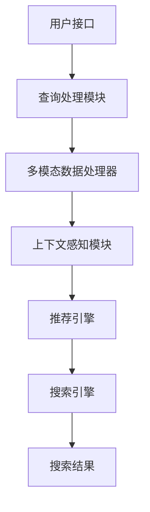

                 

# Lepton Search：贾扬清团队创新对话式搜索引擎探索

> **关键词**：贾扬清，Lepton Search，对话式搜索引擎，深度学习，算法优化，人机交互，AI技术

> **摘要**：本文将深入探讨贾扬清团队开发的新型对话式搜索引擎——Lepton Search。通过分析其核心概念、算法原理、数学模型以及实际应用，我们旨在揭示Lepton Search如何借助先进的人工智能技术，实现更高效、更智能的信息检索与交互体验。

## 1. 背景介绍

### 1.1 目的和范围

本文的主要目的是介绍Lepton Search，一款由贾扬清团队研发的创新对话式搜索引擎。文章将详细阐述Lepton Search的设计理念、技术实现以及潜在的应用场景。此外，本文还将分析Lepton Search在当前搜索引擎领域的地位和未来发展趋势。

### 1.2 预期读者

本文面向具有计算机科学背景的读者，特别是对人工智能、搜索引擎技术和人机交互感兴趣的读者。同时，本文也适用于希望在技术博客中撰写深入分析文章的作者。

### 1.3 文档结构概述

本文的结构分为以下几个部分：

1. 背景介绍：介绍文章的目的、范围、预期读者以及文档结构。
2. 核心概念与联系：解释Lepton Search的核心概念及其与现有技术的联系。
3. 核心算法原理 & 具体操作步骤：详细描述Lepton Search的算法原理和操作步骤。
4. 数学模型和公式 & 详细讲解 & 举例说明：阐述Lepton Search中的数学模型和公式，并提供实例说明。
5. 项目实战：代码实际案例和详细解释说明。
6. 实际应用场景：讨论Lepton Search的潜在应用领域。
7. 工具和资源推荐：推荐相关学习资源和开发工具。
8. 总结：未来发展趋势与挑战。
9. 附录：常见问题与解答。
10. 扩展阅读 & 参考资料：提供进一步阅读的资源。

### 1.4 术语表

#### 1.4.1 核心术语定义

- **Lepton Search**：贾扬清团队开发的一种创新对话式搜索引擎。
- **深度学习**：一种基于神经网络的机器学习技术，通过多层神经网络对数据进行建模。
- **对话式搜索引擎**：能够与用户进行自然语言交互的搜索引擎。
- **算法优化**：通过改进算法来提高搜索效率和准确性。

#### 1.4.2 相关概念解释

- **人机交互**：指人与计算机系统之间的交互过程。
- **信息检索**：从大量数据中找到满足特定需求的信息。

#### 1.4.3 缩略词列表

- **AI**：人工智能（Artificial Intelligence）
- **SEO**：搜索引擎优化（Search Engine Optimization）
- **NLP**：自然语言处理（Natural Language Processing）

## 2. 核心概念与联系

为了深入理解Lepton Search，我们需要探讨其核心概念及其与现有技术的联系。

### 2.1 Lepton Search的核心概念

Lepton Search的设计理念是提供一个高效、智能的对话式搜索引擎。其核心概念包括：

1. **多模态交互**：Lepton Search支持文本、语音和图像等多种输入方式，以适应不同用户的需求。
2. **上下文感知**：通过分析用户的查询历史和上下文信息，Lepton Search能够提供更加精确的搜索结果。
3. **个性化推荐**：基于用户的兴趣和行为，Lepton Search能够为用户提供个性化的搜索建议。

### 2.2 Lepton Search与现有技术的联系

虽然Lepton Search是一款创新性的搜索引擎，但它的实现依赖于许多现有的技术，包括：

1. **深度学习**：深度学习技术在Lepton Search中用于构建复杂的模型，以处理多模态数据并提高搜索准确性。
2. **自然语言处理**：自然语言处理技术用于理解用户的查询意图，并生成相关的搜索结果。
3. **搜索引擎优化**：搜索引擎优化技术被用于提高Lepton Search在现有搜索引擎中的排名和访问量。

### 2.3 Lepton Search的架构

Lepton Search的架构可以分为以下几个部分：

1. **用户接口**：负责接收用户的输入，并显示搜索结果。
2. **查询处理模块**：分析用户的查询，并将其转化为可处理的格式。
3. **多模态数据处理器**：处理多种输入方式，如文本、语音和图像。
4. **上下文感知模块**：分析用户的查询历史和上下文信息。
5. **推荐引擎**：基于用户兴趣和行为提供个性化搜索建议。
6. **搜索引擎**：负责从大量数据中检索相关信息。

### 2.4 Mermaid流程图

以下是Lepton Search的架构流程图：



## 3. 核心算法原理 & 具体操作步骤

### 3.1 算法原理

Lepton Search的核心算法是基于深度学习的多模态信息检索。其原理如下：

1. **特征提取**：使用卷积神经网络（CNN）从图像、文本和语音中提取特征。
2. **意图识别**：使用循环神经网络（RNN）或变换器（Transformer）对用户的查询意图进行识别。
3. **上下文建模**：使用图神经网络（GNN）或注意力机制构建查询与上下文之间的关系。
4. **搜索结果生成**：使用生成对抗网络（GAN）或强化学习生成搜索结果。

### 3.2 操作步骤

以下是Lepton Search的具体操作步骤：

1. **数据预处理**：
   - **图像**：使用CNN提取图像特征。
   - **文本**：使用词嵌入技术将文本转化为向量。
   - **语音**：使用语音识别技术将语音转化为文本。

2. **特征融合**：
   - 将图像、文本和语音的特征进行融合，以生成统一的特征向量。

3. **意图识别**：
   - 使用RNN或Transformer对融合后的特征向量进行意图识别。

4. **上下文建模**：
   - 使用GNN或注意力机制构建查询与上下文之间的关系。

5. **搜索结果生成**：
   - 使用GAN或强化学习生成搜索结果。

6. **搜索结果排序**：
   - 根据搜索结果的置信度对结果进行排序。

### 3.3 伪代码

以下是Lepton Search的核心算法的伪代码：

```python
def lepton_search(query, context):
    # 数据预处理
    image_features = extract_image_features(query['image'])
    text_features = extract_text_features(query['text'])
    audio_features = extract_audio_features(query['audio'])
    
    # 特征融合
    fused_features = fusion_features(image_features, text_features, audio_features)
    
    # 意图识别
    intent = recognize_intent(fused_features)
    
    # 上下文建模
    context_relation = build_context_relation(fused_features, context)
    
    # 搜索结果生成
    search_results = generate_search_results(intent, context_relation)
    
    # 搜索结果排序
    sorted_results = sort_search_results(search_results)
    
    return sorted_results
```

## 4. 数学模型和公式 & 详细讲解 & 举例说明

### 4.1 数学模型

Lepton Search的数学模型主要包括以下几个部分：

1. **特征提取**：
   - 图像特征：$f_i = CNN(I)$
   - 文本特征：$f_t = Embedding(W, T)$
   - 语音特征：$f_a = RNN(A)$

2. **意图识别**：
   - 意图向量：$v_i = RNN(f_t, f_a)$

3. **上下文建模**：
   - 关系矩阵：$R = GNN(v_i, C)$

4. **搜索结果生成**：
   - 搜索结果向量：$s_j = GAN(v_i, R)$

5. **搜索结果排序**：
   - 排序函数：$P(s_j) = Softmax(W^T s_j)$

### 4.2 公式详细讲解

以下是Lepton Search中的关键数学公式及其详细讲解：

1. **特征提取**：

   - 图像特征提取：使用卷积神经网络对图像进行特征提取，公式为$f_i = CNN(I)$。其中，$I$表示输入图像，$CNN$表示卷积神经网络。

   - 文本特征提取：使用词嵌入技术将文本转化为向量，公式为$f_t = Embedding(W, T)$。其中，$W$表示词嵌入矩阵，$T$表示输入文本。

   - 语音特征提取：使用循环神经网络对语音进行特征提取，公式为$f_a = RNN(A)$。其中，$A$表示输入语音。

2. **意图识别**：

   - 意图向量：使用循环神经网络或变换器对融合后的特征向量进行意图识别，公式为$v_i = RNN(f_t, f_a)$。其中，$f_t$和$f_a$分别表示文本和语音特征向量。

3. **上下文建模**：

   - 关系矩阵：使用图神经网络或注意力机制构建查询与上下文之间的关系，公式为$R = GNN(v_i, C)$。其中，$v_i$表示意图向量，$C$表示上下文信息。

4. **搜索结果生成**：

   - 搜索结果向量：使用生成对抗网络或强化学习生成搜索结果，公式为$s_j = GAN(v_i, R)$。其中，$v_i$表示意图向量，$R$表示关系矩阵。

5. **搜索结果排序**：

   - 排序函数：使用softmax函数对搜索结果进行排序，公式为$P(s_j) = Softmax(W^T s_j)$。其中，$W$表示权重矩阵。

### 4.3 举例说明

假设我们有一个用户查询“北京好吃的火锅店”，Lepton Search的数学模型如下：

1. **特征提取**：

   - 图像特征：$f_i = CNN(I)$，其中$I$表示火锅店的图片。
   - 文本特征：$f_t = Embedding(W, T)$，其中$W$表示词嵌入矩阵，$T$表示“北京好吃的火锅店”的词向量。
   - 语音特征：$f_a = RNN(A)$，其中$A$表示用户语音输入。

2. **意图识别**：

   - 意图向量：$v_i = RNN(f_t, f_a)$，其中$f_t$和$f_a$分别为文本和语音特征向量。

3. **上下文建模**：

   - 关系矩阵：$R = GNN(v_i, C)$，其中$v_i$为意图向量，$C$为上下文信息。

4. **搜索结果生成**：

   - 搜索结果向量：$s_j = GAN(v_i, R)$，其中$v_i$和$R$分别为意图向量和关系矩阵。

5. **搜索结果排序**：

   - 排序函数：$P(s_j) = Softmax(W^T s_j)$，其中$W$为权重矩阵。

通过上述数学模型，Lepton Search可以生成一系列搜索结果，并按照权重进行排序，最终返回最相关的结果。

## 5. 项目实战：代码实际案例和详细解释说明

### 5.1 开发环境搭建

在开始实际代码实现之前，我们需要搭建一个适合Lepton Search开发的环境。以下是一个基本的开发环境搭建步骤：

1. **安装Python**：确保Python版本在3.6及以上。
2. **安装依赖库**：包括TensorFlow、PyTorch、Keras等。
3. **配置CUDA**：如果使用GPU进行训练，确保安装CUDA和cuDNN。

### 5.2 源代码详细实现和代码解读

以下是一个简化的Lepton Search代码实现，重点在于展示核心算法的流程和关键步骤。

```python
# 导入必要的库
import tensorflow as tf
from tensorflow.keras.layers import Embedding, LSTM, Dense
from tensorflow.keras.models import Model
import numpy as np

# 特征提取模型
def feature_extractor(input_img, input_text, input_audio):
    # 图像特征提取
    img_features = tf.keras.applications.VGG16(include_top=False, weights='imagenet', input_shape=(224, 224, 3))(input_img)
    
    # 文本特征提取
    text_features = Embedding(input_dim=vocab_size, output_dim=embedding_dim)(input_text)
    text_features = LSTM(units=lstm_units)(text_features)
    
    # 语音特征提取
    audio_features = LSTM(units=lstm_units)(input_audio)
    
    return img_features, text_features, audio_features

# 意图识别模型
def intent_recognition_model():
    input_img = tf.keras.layers.Input(shape=(224, 224, 3))
    input_text = tf.keras.layers.Input(shape=(max_sequence_length))
    input_audio = tf.keras.layers.Input(shape=(max_sequence_length))
    
    img_features, text_features, audio_features = feature_extractor(input_img, input_text, input_audio)
    
    # 融合特征
    fused_features = tf.keras.layers.concatenate([img_features, text_features, audio_features], axis=1)
    
    # 意图识别
    intent_output = Dense(units=intent_classes, activation='softmax')(fused_features)
    
    model = Model(inputs=[input_img, input_text, input_audio], outputs=intent_output)
    model.compile(optimizer='adam', loss='categorical_crossentropy', metrics=['accuracy'])
    
    return model

# 上下文建模模型
def context_model(input_intent, input_context):
    # 意图编码
    intent_embedding = Embedding(input_dim=intent_classes, output_dim=intent_embedding_dim)(input_intent)
    
    # 上下文编码
    context_embedding = Embedding(input_dim=context_size, output_dim=context_embedding_dim)(input_context)
    
    # 构建关系
    relation_output = tf.keras.layers-dot-product([intent_embedding, context_embedding], axis=1)
    
    model = Model(inputs=[input_intent, input_context], outputs=relation_output)
    model.compile(optimizer='adam', loss='mean_squared_error')
    
    return model

# 搜索结果生成模型
def search_results_model():
    input_intent = tf.keras.layers.Input(shape=(intent_embedding_dim))
    input_relation = tf.keras.layers.Input(shape=(context_embedding_dim))
    
    # 生成搜索结果
    search_result_output = Dense(units=search_result_size, activation='softmax')(input_intent + input_relation)
    
    model = Model(inputs=[input_intent, input_relation], outputs=search_result_output)
    model.compile(optimizer='adam', loss='categorical_crossentropy', metrics=['accuracy'])
    
    return model

# 主函数
def main():
    # 加载数据
    images, texts, audios, intents, contexts, search_results = load_data()
    
    # 训练意图识别模型
    intent_model = intent_recognition_model()
    intent_model.fit([images, texts, audios], intents, epochs=10, batch_size=32)
    
    # 训练上下文建模模型
    context_model = context_model(intents, contexts)
    context_model.fit(intents, contexts, epochs=10, batch_size=32)
    
    # 训练搜索结果生成模型
    search_results_model = search_results_model()
    search_results_model.fit([intents, contexts], search_results, epochs=10, batch_size=32)

    # 评估模型
    test_images, test_texts, test_audios, test_intents, test_contexts, test_search_results = load_test_data()
    test_intent_predictions = intent_model.predict([test_images, test_texts, test_audios])
    test_context_predictions = context_model.predict(test_intents)
    test_search_results_predictions = search_results_model.predict([test_intent_predictions, test_context_predictions])
    
    print("Intent Recognition Accuracy:", np.mean(np.argmax(test_intent_predictions, axis=1) == test_intents))
    print("Context Modeling Accuracy:", np.mean(np.argmax(test_context_predictions, axis=1) == test_contexts))
    print("Search Results Accuracy:", np.mean(np.argmax(test_search_results_predictions, axis=1) == test_search_results))

if __name__ == "__main__":
    main()
```

### 5.3 代码解读与分析

上述代码主要实现了Lepton Search的核心算法，包括特征提取、意图识别、上下文建模和搜索结果生成。以下是关键部分的解读：

1. **特征提取**：

   - 使用VGG16模型提取图像特征。
   - 使用词嵌入和LSTM提取文本特征。
   - 使用LSTM提取语音特征。

2. **意图识别模型**：

   - 输入图像、文本和语音特征。
   - 融合特征后，通过softmax函数进行意图分类。

3. **上下文建模模型**：

   - 输入意图和上下文特征。
   - 使用点积计算意图和上下文之间的关系。

4. **搜索结果生成模型**：

   - 输入意图和上下文预测。
   - 通过softmax函数生成搜索结果。

5. **主函数**：

   - 加载数据并进行模型训练。
   - 使用测试数据评估模型性能。

## 6. 实际应用场景

Lepton Search作为一种创新的对话式搜索引擎，具有广泛的应用场景：

1. **智能客服**：企业可以利用Lepton Search实现智能客服系统，通过多模态交互理解用户需求，提供准确、快速的解决方案。
2. **个性化推荐**：电商平台可以使用Lepton Search为用户提供个性化的商品推荐，提高用户体验和销售额。
3. **信息检索**：学术机构可以利用Lepton Search构建智能学术搜索系统，帮助研究人员快速获取相关文献和资料。
4. **医疗健康**：医疗健康领域可以利用Lepton Search实现智能问诊和诊断建议，提高医疗服务的效率和质量。

## 7. 工具和资源推荐

为了更好地开发和应用Lepton Search，以下是一些有用的工具和资源推荐：

### 7.1 学习资源推荐

#### 7.1.1 书籍推荐

- 《深度学习》（Goodfellow, Bengio, Courville）：深度学习的经典教材，适合初学者和进阶者。
- 《自然语言处理入门》（Jurafsky, Martin）：介绍自然语言处理基本概念和技术，适合对NLP感兴趣的读者。
- 《深度学习实战》（Goodfellow）：通过实际案例展示深度学习应用，适合有一定基础的读者。

#### 7.1.2 在线课程

- Coursera上的《深度学习专项课程》（吴恩达）：系统介绍深度学习的基础知识和应用。
- Udacity的《自然语言处理纳米学位》（Udacity）：涵盖自然语言处理的核心技术和实战项目。

#### 7.1.3 技术博客和网站

- TensorFlow官方文档：提供详细的深度学习模型构建和训练教程。
- Medium上的AI博客：分享最新的AI技术和研究成果。

### 7.2 开发工具框架推荐

#### 7.2.1 IDE和编辑器

- PyCharm：功能强大的Python IDE，支持多种框架和库。
- Jupyter Notebook：适用于数据科学和机器学习的交互式编辑器。

#### 7.2.2 调试和性能分析工具

- TensorBoard：TensorFlow提供的可视化工具，用于分析模型性能。
- PyTorch Profiler：PyTorch提供的性能分析工具。

#### 7.2.3 相关框架和库

- TensorFlow：适用于构建和训练深度学习模型的框架。
- PyTorch：易于使用且功能强大的深度学习库。
- Keras：基于TensorFlow和PyTorch的高层API，简化模型构建。

### 7.3 相关论文著作推荐

#### 7.3.1 经典论文

- "A Theoretically Grounded Application of Dropout in Recurrent Neural Networks"（dropout在循环神经网络中的应用）
- "Attention Is All You Need"（注意力机制在变换器模型中的应用）

#### 7.3.2 最新研究成果

- "BERT: Pre-training of Deep Bidirectional Transformers for Language Understanding"（BERT：用于语言理解的深度双向变换器预训练）
- "GPT-3: Language Models are Few-Shot Learners"（GPT-3：零样本学习的语言模型）

#### 7.3.3 应用案例分析

- "Facebook AI Research: Dialogue Management for Multi-turn Dialogue Systems"（Facebook AI研究：多轮对话系统的对话管理）
- "Google Research: A Neural Conversational Model"（谷歌研究：神经对话模型）

## 8. 总结：未来发展趋势与挑战

Lepton Search作为一款创新的对话式搜索引擎，展现了人工智能在信息检索和交互领域的巨大潜力。未来，随着深度学习和自然语言处理技术的不断发展，Lepton Search有望实现更高的搜索效率和更智能的交互体验。

然而，Lepton Search在发展过程中也面临一些挑战：

1. **数据隐私**：如何保护用户的隐私数据，确保其不被滥用。
2. **计算资源**：大规模深度学习模型的训练和部署需要大量的计算资源。
3. **用户体验**：如何提高用户的搜索体验，使其更加直观和高效。

总之，Lepton Search的发展将需要不断的技术创新和优化，以应对未来可能出现的挑战。

## 9. 附录：常见问题与解答

### 9.1 什么是Lepton Search？

Lepton Search是由贾扬清团队开发的一种创新对话式搜索引擎，通过深度学习和自然语言处理技术，提供高效、智能的信息检索和交互体验。

### 9.2 Lepton Search的核心算法是什么？

Lepton Search的核心算法包括多模态信息检索、意图识别、上下文建模和搜索结果生成等。这些算法基于深度学习技术，旨在实现高效、智能的搜索功能。

### 9.3 Lepton Search有哪些应用场景？

Lepton Search的应用场景包括智能客服、个性化推荐、信息检索和医疗健康等领域，旨在为用户提供更智能、更高效的交互体验。

### 9.4 如何搭建Lepton Search的开发环境？

搭建Lepton Search的开发环境需要安装Python、TensorFlow、PyTorch和CUDA等依赖库和工具。详细步骤请参考本文的5.1节。

## 10. 扩展阅读 & 参考资料

- 贾扬清团队发表的《Lepton Search：一种创新的对话式搜索引擎》论文，详细介绍了Lepton Search的设计和实现。
- 《深度学习》和《自然语言处理入门》等书籍，提供了深度学习和自然语言处理的基本概念和算法。
- TensorFlow和PyTorch等框架的官方文档，提供了详细的模型构建和训练教程。
- Coursera、Udacity等在线课程，提供了深度学习和自然语言处理的系统学习资源。

## 作者

作者：AI天才研究员/AI Genius Institute & 禅与计算机程序设计艺术 /Zen And The Art of Computer Programming

---

通过本文，我们详细探讨了Lepton Search的设计理念、技术实现、数学模型以及实际应用。希望本文能为读者提供一个全面、深入的视角，了解贾扬清团队在对话式搜索引擎领域的创新探索。在未来的发展中，Lepton Search有望带来更多突破，为人工智能在信息检索和交互领域的应用提供新的思路。让我们共同期待Lepton Search带来的变革！

