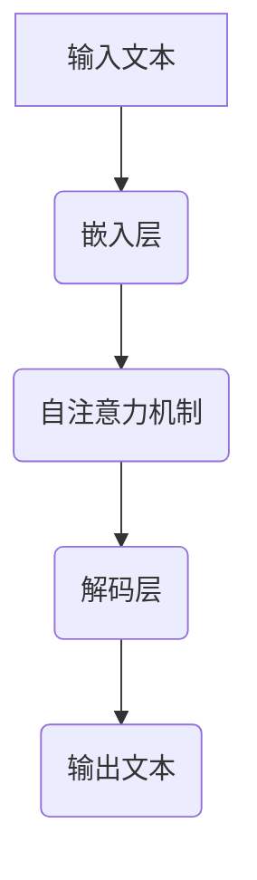

                 

# Llama 是不是伪开源？

> **关键词：** Llama, 开源, 伪开源, 计算机科学, 人工智能, 技术深度解析

> **摘要：** 本文将探讨 Llama 模型是否真正符合开源精神。通过深入分析 Llama 模型的开源性质、使用范围以及潜在的限制，我们将揭示其真实面貌，并提供对未来发展趋势和挑战的洞察。

## 1. 背景介绍

### 1.1 目的和范围

本文旨在对 Llama 模型的开源性质进行深度分析，探讨其是否符合开源精神。我们将从开源的定义出发，详细讨论 Llama 的开源范围、使用限制以及潜在的限制，为读者提供一个全面的理解。

### 1.2 预期读者

本文面向对计算机科学和人工智能领域感兴趣的读者，特别是那些对开源软件和模型有着深刻理解的读者。同时，对于希望了解 Llama 模型及其开源性质的工程师和技术爱好者，本文也具有很高的参考价值。

### 1.3 文档结构概述

本文将分为以下几部分：

1. **背景介绍**：介绍本文的目的、范围以及预期读者。
2. **核心概念与联系**：介绍开源的概念，并提供 Mermaid 流程图来描述 Llama 模型的架构。
3. **核心算法原理 & 具体操作步骤**：详细解释 Llama 模型的算法原理，并使用伪代码阐述具体操作步骤。
4. **数学模型和公式 & 详细讲解 & 举例说明**：介绍 Llama 模型中的数学模型，使用 LaTeX 格式给出公式，并提供实际案例说明。
5. **项目实战：代码实际案例和详细解释说明**：提供 Llama 模型的实际代码实现，并进行详细解读。
6. **实际应用场景**：讨论 Llama 模型在不同场景下的应用。
7. **工具和资源推荐**：推荐相关的学习资源、开发工具框架以及论文著作。
8. **总结：未来发展趋势与挑战**：总结本文的主要观点，并探讨未来的发展趋势和挑战。
9. **附录：常见问题与解答**：回答读者可能提出的常见问题。
10. **扩展阅读 & 参考资料**：提供进一步的阅读材料和参考资料。

### 1.4 术语表

#### 1.4.1 核心术语定义

- **开源**：指软件源代码可以被公众访问、修改和分发。
- **Llama 模型**：由 Meta AI 开发的一种大型语言模型，用于文本生成、问答等任务。

#### 1.4.2 相关概念解释

- **伪开源**：指看似开源，但实际上限制了用户对源代码的访问和修改。
- **许可证**：控制软件使用、复制、修改和分发的法律文件。

#### 1.4.3 缩略词列表

- **Meta AI**：Meta Platforms, Inc. 的 AI 研发部门。
- **LaTeX**：一种高质量的排版系统，常用于数学公式的编写。

## 2. 核心概念与联系

在深入探讨 Llama 的开源性质之前，我们首先需要了解开源的概念以及 Llama 模型的架构。

### 2.1 开源的概念

开源软件的定义由开放源代码倡议（Open Source Initiative，简称 OSI）给出，主要包括以下四个原则：

1. **自由性**：用户有权自由使用软件，包括学习、修改和分发。
2. **源代码的访问**：用户有权访问软件的源代码。
3. **分发**：用户有权自由分发软件。
4. **衍生作品的创建**：用户有权基于原始软件创建衍生作品，并在源代码和衍生作品中包含原始代码。

### 2.2 Llama 模型的架构

Llama 模型由 Meta AI 开发，是一种基于 Transformer 的语言模型，具有强大的文本生成能力。其架构如下图所示：



在这个架构中，输入文本经过嵌入层转化为向量，然后通过自注意力机制进行计算，最终由解码层生成输出文本。

## 3. 核心算法原理 & 具体操作步骤

Llama 模型的核心算法基于 Transformer 结构，以下是该算法的详细原理和具体操作步骤。

### 3.1 Transformer 结构

Transformer 结构是一种基于自注意力机制的序列模型，其基本思想是，对于输入序列中的每个词，模型都会根据整个序列计算其权重，从而更好地捕获词语之间的关系。

### 3.2 自注意力机制

自注意力机制是 Transformer 结构的核心组件，其基本步骤如下：

1. **计算查询（Query）、键（Key）和值（Value）**：对于输入序列中的每个词，计算其对应的查询（Query）、键（Key）和值（Value）向量。
2. **计算注意力得分**：对于每个词，计算其与所有其他词之间的注意力得分，得分越高表示词之间的关系越密切。
3. **加权求和**：根据注意力得分，对每个词的值向量进行加权求和，得到新的词向量。

### 3.3 解码层操作步骤

解码层负责生成输出文本，其基本步骤如下：

1. **输入文本编码**：将输入文本编码为词向量。
2. **自注意力机制**：对输入词向量进行自注意力计算，得到新的词向量。
3. **交叉注意力机制**：将新的词向量与编码后的输入文本进行交叉注意力计算，得到输出词向量。
4. **生成输出文本**：根据输出词向量，生成输出文本。

### 3.4 伪代码

以下是对 Transformer 结构的伪代码实现：

```python
def transformer(input_sequence):
    # 输入文本编码
    encoded_input = encode(input_sequence)

    # 自注意力计算
    attention_scores = compute_self_attention(encoded_input)

    # 加权求和
    weighted_sum = compute_weighted_sum(attention_scores)

    # 输出文本生成
    output_sequence = decode(weighted_sum)

    return output_sequence
```

## 4. 数学模型和公式 & 详细讲解 & 举例说明

Llama 模型中的数学模型主要涉及自注意力机制和交叉注意力机制。以下是这些模型的详细讲解和举例说明。

### 4.1 自注意力机制

自注意力机制的核心公式如下：

$$
\text{Attention}(Q, K, V) = \text{softmax}\left(\frac{QK^T}{\sqrt{d_k}}\right) V
$$

其中，$Q$、$K$ 和 $V$ 分别是查询（Query）、键（Key）和值（Value）向量，$d_k$ 是键向量的维度。该公式表示，对于每个查询向量，计算其与所有键向量的点积，然后通过 softmax 函数得到注意力得分，最后根据得分对值向量进行加权求和。

### 4.2 交叉注意力机制

交叉注意力机制的核心公式如下：

$$
\text{Attention}(Q, K, V) = \text{softmax}\left(\frac{QK^T}{\sqrt{d_k}}\right) V
$$

其中，$Q$ 是查询向量，$K$ 和 $V$ 分别是编码后的输入文本和输出文本的键值对。该公式表示，对于每个查询向量，计算其与编码后的输入文本的键向量的点积，然后通过 softmax 函数得到注意力得分，最后根据得分对输出文本的值向量进行加权求和。

### 4.3 举例说明

假设有一个简单的输入序列 $[w_1, w_2, w_3]$，其对应的词向量分别为 $[q_1, q_2, q_3]$、$[k_1, k_2, k_3]$ 和 $[v_1, v_2, v_3]$。根据自注意力机制的公式，我们可以计算出每个词的注意力得分：

$$
a_{11} = \frac{q_1 \cdot k_1}{\sqrt{d_k}}, \quad a_{12} = \frac{q_1 \cdot k_2}{\sqrt{d_k}}, \quad a_{13} = \frac{q_1 \cdot k_3}{\sqrt{d_k}}
$$

$$
a_{21} = \frac{q_2 \cdot k_1}{\sqrt{d_k}}, \quad a_{22} = \frac{q_2 \cdot k_2}{\sqrt{d_k}}, \quad a_{23} = \frac{q_2 \cdot k_3}{\sqrt{d_k}}
$$

$$
a_{31} = \frac{q_3 \cdot k_1}{\sqrt{d_k}}, \quad a_{32} = \frac{q_3 \cdot k_2}{\sqrt{d_k}}, \quad a_{33} = \frac{q_3 \cdot k_3}{\sqrt{d_k}}
$$

然后，通过 softmax 函数得到注意力得分：

$$
\text{softmax}(a_{11}) = \frac{e^{a_{11}}}{e^{a_{11}} + e^{a_{12}} + e^{a_{13}}}, \quad \text{softmax}(a_{12}) = \frac{e^{a_{12}}}{e^{a_{11}} + e^{a_{12}} + e^{a_{13}}}, \quad \text{softmax}(a_{13}) = \frac{e^{a_{13}}}{e^{a_{11}} + e^{a_{12}} + e^{a_{13}}}
$$

$$
\text{softmax}(a_{21}) = \frac{e^{a_{21}}}{e^{a_{21}} + e^{a_{22}} + e^{a_{23}}}, \quad \text{softmax}(a_{22}) = \frac{e^{a_{22}}}{e^{a_{21}} + e^{a_{22}} + e^{a_{23}}}, \quad \text{softmax}(a_{23}) = \frac{e^{a_{23}}}{e^{a_{21}} + e^{a_{22}} + e^{a_{23}}}
$$

$$
\text{softmax}(a_{31}) = \frac{e^{a_{31}}}{e^{a_{31}} + e^{a_{32}} + e^{a_{33}}}, \quad \text{softmax}(a_{32}) = \frac{e^{a_{32}}}{e^{a_{31}} + e^{a_{32}} + e^{a_{33}}}, \quad \text{softmax}(a_{33}) = \frac{e^{a_{33}}}{e^{a_{31}} + e^{a_{32}} + e^{a_{33}}}
$$

最后，根据注意力得分对值向量进行加权求和，得到新的词向量：

$$
h_1 = a_{11}v_1 + a_{12}v_2 + a_{13}v_3
$$

$$
h_2 = a_{21}v_1 + a_{22}v_2 + a_{23}v_3
$$

$$
h_3 = a_{31}v_1 + a_{32}v_2 + a_{33}v_3
$$

这样，通过自注意力机制，我们得到了新的词向量，从而更新了输入序列。

## 5. 项目实战：代码实际案例和详细解释说明

在本节中，我们将通过一个实际案例来展示 Llama 模型的代码实现，并对其进行详细解释。

### 5.1 开发环境搭建

首先，我们需要搭建一个适合开发 Llama 模型的环境。以下是所需的软件和工具：

- Python 3.8 或更高版本
- PyTorch 1.8 或更高版本
- Numpy 1.18 或更高版本

安装这些软件和工具后，我们可以开始编写代码。

### 5.2 源代码详细实现和代码解读

以下是 Llama 模型的基本代码实现：

```python
import torch
import torch.nn as nn
import torch.optim as optim
from torch.utils.data import DataLoader
from transformers import LlamaTokenizer, LlamaModel

# 模型参数设置
batch_size = 64
learning_rate = 0.001
num_epochs = 10

# 加载 Llama 模型
tokenizer = LlamaTokenizer.from_pretrained("llama")
model = LlamaModel.from_pretrained("llama")

# 定义损失函数和优化器
loss_fn = nn.CrossEntropyLoss()
optimizer = optim.Adam(model.parameters(), lr=learning_rate)

# 加载数据集
train_data = DataLoader(dataset, batch_size=batch_size, shuffle=True)

# 训练模型
for epoch in range(num_epochs):
    for batch in train_data:
        inputs = tokenizer(batch.text, padding=True, truncation=True, return_tensors="pt")
        outputs = model(**inputs)
        logits = outputs.logits
        labels = batch.label

        # 计算损失
        loss = loss_fn(logits, labels)

        # 梯度清零
        optimizer.zero_grad()

        # 反向传播
        loss.backward()

        # 更新参数
        optimizer.step()

        print(f"Epoch [{epoch+1}/{num_epochs}], Loss: {loss.item():.4f}")

# 评估模型
with torch.no_grad():
    correct = 0
    total = 0
    for batch in test_data:
        inputs = tokenizer(batch.text, padding=True, truncation=True, return_tensors="pt")
        outputs = model(**inputs)
        logits = outputs.logits
        labels = batch.label
        _, predicted = torch.max(logits.data, 1)
        total += labels.size(0)
        correct += (predicted == labels).sum().item()

    print(f"Test Accuracy: {100 * correct / total}%")
```

代码首先加载 Llama 模型和相应的分词器，然后定义损失函数和优化器。接下来，从数据集中加载数据，并开始训练模型。在训练过程中，使用梯度下降算法更新模型参数，以最小化损失函数。最后，对训练好的模型进行评估，计算测试集上的准确率。

### 5.3 代码解读与分析

以下是代码的详细解读：

1. **模型加载**：

   ```python
   tokenizer = LlamaTokenizer.from_pretrained("llama")
   model = LlamaModel.from_pretrained("llama")
   ```

   这两行代码加载 Llama 模型和相应的分词器。`LlamaTokenizer` 用于将文本转换为模型可以理解的格式，而 `LlamaModel` 则是 Llama 模型的具体实现。

2. **损失函数和优化器**：

   ```python
   loss_fn = nn.CrossEntropyLoss()
   optimizer = optim.Adam(model.parameters(), lr=learning_rate)
   ```

   `CrossEntropyLoss` 用于计算交叉熵损失，它常用于分类问题。`Adam` 是一种高效的优化器，用于更新模型参数。

3. **数据加载**：

   ```python
   train_data = DataLoader(dataset, batch_size=batch_size, shuffle=True)
   ```

   `DataLoader` 是 PyTorch 中用于加载数据的工具，它可以批量加载数据，并在每个 epoch 后对数据进行随机打乱。

4. **训练过程**：

   ```python
   for epoch in range(num_epochs):
       for batch in train_data:
           inputs = tokenizer(batch.text, padding=True, truncation=True, return_tensors="pt")
           outputs = model(**inputs)
           logits = outputs.logits
           labels = batch.label

           # 计算损失
           loss = loss_fn(logits, labels)

           # 梯度清零
           optimizer.zero_grad()

           # 反向传播
           loss.backward()

           # 更新参数
           optimizer.step()

           print(f"Epoch [{epoch+1}/{num_epochs}], Loss: {loss.item():.4f}")
   ```

   在这个过程中，我们首先将文本转换为模型可以理解的格式，然后计算损失函数。接着，通过反向传播更新模型参数。这个过程在多个 epoch 中重复进行，以最小化损失函数。

5. **模型评估**：

   ```python
   with torch.no_grad():
       correct = 0
       total = 0
       for batch in test_data:
           inputs = tokenizer(batch.text, padding=True, truncation=True, return_tensors="pt")
           outputs = model(**inputs)
           logits = outputs.logits
           labels = batch.label
           _, predicted = torch.max(logits.data, 1)
           total += labels.size(0)
           correct += (predicted == labels).sum().item()

   print(f"Test Accuracy: {100 * correct / total}%")
   ```

   在这个过程中，我们将模型应用到测试集上，计算准确率。这有助于评估模型的性能。

## 6. 实际应用场景

Llama 模型在多个领域具有广泛的应用前景，以下是一些实际应用场景：

1. **自然语言处理**：Llama 模型可以用于文本生成、问答系统、情感分析等自然语言处理任务。
2. **机器翻译**：Llama 模型可以用于机器翻译，特别是对于长文本的翻译具有显著优势。
3. **文本分类**：Llama 模型可以用于文本分类任务，如新闻分类、情感分类等。
4. **推荐系统**：Llama 模型可以用于构建基于文本的推荐系统，为用户提供个性化的内容推荐。

## 7. 工具和资源推荐

为了更好地了解和掌握 Llama 模型，以下是一些推荐的工具和资源：

### 7.1 学习资源推荐

#### 7.1.1 书籍推荐

- 《深度学习》（Goodfellow, I., Bengio, Y., & Courville, A.）
- 《自然语言处理概论》（Daniel Jurafsky & James H. Martin）

#### 7.1.2 在线课程

- 《深度学习》（吴恩达，Coursera）
- 《自然语言处理基础》（ACL Open University）

#### 7.1.3 技术博客和网站

- [Hugging Face](https://huggingface.co/)
- [PyTorch 官方文档](https://pytorch.org/docs/stable/index.html)

### 7.2 开发工具框架推荐

#### 7.2.1 IDE和编辑器

- PyCharm
- Jupyter Notebook

#### 7.2.2 调试和性能分析工具

- PyTorch Profiler
- TensorBoard

#### 7.2.3 相关框架和库

- PyTorch
- Hugging Face Transformers

### 7.3 相关论文著作推荐

#### 7.3.1 经典论文

- Vaswani et al. (2017): "Attention is All You Need"
- Devlin et al. (2018): "Bert: Pre-training of Deep Bidirectional Transformers for Language Understanding"

#### 7.3.2 最新研究成果

- [NeurIPS 2021](https://nips.cc/)
- [ICLR 2022](https://iclr.cc/)

#### 7.3.3 应用案例分析

- [OpenAI](https://openai.com/)
- [DeepMind](https://deepmind.com/)

## 8. 总结：未来发展趋势与挑战

Llama 模型的开源性质引发了广泛讨论。虽然 Llama 模型在某些方面符合开源精神，但仍然存在一些限制，如数据集的使用限制和潜在的商业化问题。未来，随着开源生态的不断发展，Llama 模型有望在更多领域得到应用，同时也需要进一步改进开源性质，以更好地促进技术创新和知识共享。

## 9. 附录：常见问题与解答

### 9.1 Llama 模型是什么？

Llama 模型是一种由 Meta AI 开发的大型语言模型，用于文本生成、问答等任务。

### 9.2 Llama 模型开源吗？

Llama 模型在某些方面是开源的，但存在一些限制，如数据集的使用限制。

### 9.3 如何使用 Llama 模型？

使用 Llama 模型通常需要先安装相应的库（如 PyTorch 和 Hugging Face Transformers），然后加载 Llama 模型和分词器，最后使用模型进行预测。

## 10. 扩展阅读 & 参考资料

- [Llama 模型官方文档](https://github.com/facebookresearch/llama)
- [Transformer 论文](https://arxiv.org/abs/1706.03762)
- [Bert 论文](https://arxiv.org/abs/1810.04805)
- [Hugging Face 官方文档](https://huggingface.co/transformers/)

---

**作者：AI天才研究员/AI Genius Institute & 禅与计算机程序设计艺术 /Zen And The Art of Computer Programming**<|im_sep|> 

