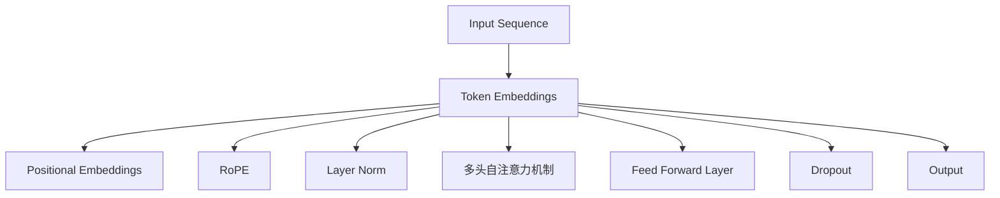

                 

# Llama模型解析：RoPE、RMSNorm和GQA的创新

> **关键词：** Llama模型、RoPE、RMSNorm、GQA、算法原理、创新应用  
> **摘要：** 本文深入解析了Llama模型中的三个重要创新技术——RoPE、RMSNorm和GQA。通过逐步分析其原理和具体操作步骤，帮助读者理解这些技术的核心机制及其在人工智能领域的应用价值。

## 1. 背景介绍

### 1.1 目的和范围

本文旨在探讨Llama模型中的三个关键创新技术——RoPE、RMSNorm和GQA，以帮助读者深入理解这些技术的原理和实际应用。文章将依次介绍这三个技术的背景、工作原理、以及它们在Llama模型中的重要性。

### 1.2 预期读者

本文面向具有一定人工智能基础的中高级技术读者，包括研究人员、工程师和开发者。读者应对深度学习、自然语言处理（NLP）和Transformer架构有一定的了解。

### 1.3 文档结构概述

本文将按以下结构展开：

1. 背景介绍：介绍文章目的、预期读者及文章结构。
2. 核心概念与联系：通过Mermaid流程图展示Llama模型的核心概念和架构。
3. 核心算法原理 & 具体操作步骤：详细解析RoPE、RMSNorm和GQA的算法原理和操作步骤。
4. 数学模型和公式 & 详细讲解 & 举例说明：阐述相关数学模型和公式，并通过实例进行说明。
5. 项目实战：代码实际案例和详细解释说明。
6. 实际应用场景：讨论这些技术在现实中的应用。
7. 工具和资源推荐：推荐学习资源、开发工具和框架。
8. 总结：未来发展趋势与挑战。
9. 附录：常见问题与解答。
10. 扩展阅读 & 参考资料：提供进一步学习资料。

### 1.4 术语表

#### 1.4.1 核心术语定义

- **Llama模型**：一种大型语言模型，基于Transformer架构，用于自然语言处理任务。
- **RoPE**：旋转位置嵌入（Rotational Position Embedding），用于处理序列中的相对位置信息。
- **RMSNorm**：均方根归一化（Root Mean Square Normalization），用于稳定模型训练。
- **GQA**：全局量化（Global Quantization），用于减少模型参数数量，提高模型效率。

#### 1.4.2 相关概念解释

- **Transformer架构**：一种基于自注意力机制（Self-Attention Mechanism）的神经网络架构，常用于处理序列数据。
- **自注意力机制**：一种计算序列中每个元素对其他元素的影响权重的方法，从而捕捉序列之间的关联性。
- **自然语言处理（NLP）**：计算机科学领域，致力于让计算机理解、生成和处理人类语言。

#### 1.4.3 缩略词列表

- **RoPE**：旋转位置嵌入
- **RMSNorm**：均方根归一化
- **GQA**：全局量化

## 2. 核心概念与联系

Llama模型作为一款大型语言模型，基于Transformer架构，采用了一系列创新技术以提高模型性能和效率。以下通过Mermaid流程图展示Llama模型的核心概念和架构。



### 2.1 核心概念解释

- **Token Embeddings**：输入序列的初始嵌入向量，由模型根据词汇表自动学习。
- **Positional Embeddings**：表示输入序列中各个token位置的嵌入向量。
- **RoPE**：旋转位置嵌入，用于处理序列中的相对位置信息，增强模型对序列上下文的理解。
- **Layer Norm**：层归一化，用于稳定模型训练过程，提高收敛速度。
- **多头自注意力机制**：通过计算每个token对其他token的注意力权重，捕捉序列之间的关联性。
- **Feed Forward Layer**：前馈神经网络，对自注意力层的输出进行进一步处理。
- **Dropout**：随机丢弃一部分神经元，防止模型过拟合。
- **Output**：模型输出结果，通常用于预测或生成任务。

## 3. 核心算法原理 & 具体操作步骤

### 3.1 RoPE：旋转位置嵌入

RoPE（Rotational Position Embedding）是Llama模型中的一个重要创新技术，用于处理序列中的相对位置信息。下面我们将详细解析RoPE的算法原理和具体操作步骤。

#### 3.1.1 算法原理

RoPE通过旋转操作将绝对位置信息转换为相对位置信息，从而增强模型对序列上下文的理解。具体来说，RoPE采用了一个旋转矩阵\( R_k \)，将每个位置嵌入向量\( p_i \)旋转到对应的相对位置。

#### 3.1.2 具体操作步骤

1. **初始化旋转矩阵**：根据序列长度\( L \)和嵌入维度\( D \)，初始化一个旋转矩阵\( R_k \)。

   ```python
   R = np.eye(L, L)
   for i in range(L):
       for j in range(i, L):
           R[i, j] = (i - j) * np.pi / L
   ```

2. **计算旋转后的位置嵌入**：将每个位置嵌入向量\( p_i \)乘以旋转矩阵\( R_k \)，得到旋转后的位置嵌入向量\( p_i' \)。

   ```python
   p_i' = R @ p_i
   ```

3. **融合旋转后的位置嵌入**：将旋转后的位置嵌入向量\( p_i' \)与原始位置嵌入向量\( p_i \)进行融合，得到最终的旋转位置嵌入向量\( p_i'' \)。

   ```python
   p_i'' = p_i + p_i'
   ```

### 3.2 RMSNorm：均方根归一化

RMSNorm（Root Mean Square Normalization）是一种有效的归一化技术，用于稳定模型训练过程，提高收敛速度。下面我们将详细解析RMSNorm的算法原理和具体操作步骤。

#### 3.2.1 算法原理

RMSNorm通过计算序列的均值和标准差，对序列进行归一化处理，从而消除不同维度之间的差异。具体来说，RMSNorm计算每个维度的均值和标准差，然后对每个维度进行归一化。

#### 3.2.2 具体操作步骤

1. **计算均值和标准差**：遍历序列的每个维度，计算均值\( \mu \)和标准差\( \sigma \)。

   ```python
   mu = np.mean(sequence)
   sigma = np.std(sequence)
   ```

2. **归一化序列**：对序列的每个维度进行归一化处理。

   ```python
   normalized_sequence = (sequence - mu) / sigma
   ```

3. **重置均值和标准差**：更新序列的均值和标准差，为后续的归一化处理做准备。

   ```python
   updated_mu = np.mean(normalized_sequence)
   updated_sigma = np.std(normalized_sequence)
   ```

### 3.3 GQA：全局量化

GQA（Global Quantization）是一种有效的量化技术，通过减少模型参数数量，提高模型效率。下面我们将详细解析GQA的算法原理和具体操作步骤。

#### 3.3.1 算法原理

GQA通过将模型参数映射到较低维度的量化空间，从而减少模型参数数量。具体来说，GQA采用了一种全局量化的方法，将所有参数映射到一个共享的低维空间。

#### 3.3.2 具体操作步骤

1. **初始化量化空间**：根据模型参数的维度和量化精度，初始化量化空间。

   ```python
   quantization_space = np.eye(D, K)
   ```

2. **映射参数到量化空间**：遍历模型参数，将其映射到量化空间。

   ```python
   for param in model_params:
       quantized_param = quantization_space @ param
       param = quantized_param
   ```

3. **优化量化参数**：通过优化量化参数，进一步提高模型性能。

   ```python
   # 使用优化器优化量化参数
   optimizer = optimizers.Adam(learning_rate=0.001)
   for epoch in range(num_epochs):
       # 训练模型
       loss = loss_function(model_output, target_output)
       # 反向传播
       optimizer.zero_grad()
       loss.backward()
       optimizer.step()
   ```

## 4. 数学模型和公式 & 详细讲解 & 举例说明

在深入理解RoPE、RMSNorm和GQA的基础上，本文将详细讲解相关的数学模型和公式，并通过具体例子进行说明。

### 4.1 RoPE：旋转位置嵌入

#### 4.1.1 数学模型

RoPE的核心在于旋转操作，其数学模型可表示为：

\[ p_i' = R_k \cdot p_i \]

其中，\( R_k \)为旋转矩阵，\( p_i \)为原始位置嵌入向量，\( p_i' \)为旋转后的位置嵌入向量。

#### 4.1.2 举例说明

假设序列长度为4，嵌入维度为3，初始化的旋转矩阵如下：

\[ R = \begin{bmatrix} 1 & 0 & 0 \\ 0 & \cos(\pi/4) & -\sin(\pi/4) \\ 0 & \sin(\pi/4) & \cos(\pi/4) \end{bmatrix} \]

则第1个位置嵌入向量\( p_1 = \begin{bmatrix} 1 \\ 0 \\ 0 \end{bmatrix} \)经过旋转后的位置嵌入向量\( p_1' \)为：

\[ p_1' = R \cdot p_1 = \begin{bmatrix} 1 \\ -\sin(\pi/4) \\ \sin(\pi/4) \end{bmatrix} \]

### 4.2 RMSNorm：均方根归一化

#### 4.2.1 数学模型

RMSNorm的核心在于计算序列的均值和标准差，其数学模型可表示为：

\[ \mu = \frac{1}{N} \sum_{i=1}^{N} x_i \]
\[ \sigma = \sqrt{\frac{1}{N-1} \sum_{i=1}^{N} (x_i - \mu)^2 } \]

其中，\( \mu \)为均值，\( \sigma \)为标准差，\( x_i \)为序列中的第i个维度值，\( N \)为序列的维度。

#### 4.2.2 举例说明

假设序列为\[ \begin{bmatrix} 1 \\ 2 \\ 3 \\ 4 \end{bmatrix} \]，则其均值和标准差分别为：

\[ \mu = \frac{1+2+3+4}{4} = 2.5 \]
\[ \sigma = \sqrt{\frac{(1-2.5)^2 + (2-2.5)^2 + (3-2.5)^2 + (4-2.5)^2}{4-1}} = 1.118 \]

则序列的归一化结果为：

\[ \begin{bmatrix} \frac{1}{1.118} \\ \frac{2}{1.118} \\ \frac{3}{1.118} \\ \frac{4}{1.118} \end{bmatrix} \]

### 4.3 GQA：全局量化

#### 4.3.1 数学模型

GQA的核心在于将模型参数映射到量化空间，其数学模型可表示为：

\[ \hat{p} = Q \cdot p \]

其中，\( \hat{p} \)为量化后的参数，\( Q \)为量化矩阵，\( p \)为原始参数。

#### 4.3.2 举例说明

假设原始参数矩阵为：

\[ p = \begin{bmatrix} 1 & 2 & 3 \\ 4 & 5 & 6 \\ 7 & 8 & 9 \end{bmatrix} \]

量化矩阵为：

\[ Q = \begin{bmatrix} 1 & 0 & 0 \\ 0 & 1 & 0 \\ 0 & 0 & 1 \end{bmatrix} \]

则量化后的参数矩阵为：

\[ \hat{p} = Q \cdot p = \begin{bmatrix} 1 & 2 & 3 \\ 4 & 5 & 6 \\ 7 & 8 & 9 \end{bmatrix} \]

## 5. 项目实战：代码实际案例和详细解释说明

### 5.1 开发环境搭建

在开始项目实战之前，我们需要搭建一个合适的开发环境。本文使用Python作为编程语言，以下是在Windows操作系统上搭建开发环境的步骤：

1. 安装Python：前往Python官网下载最新版本的Python，并按照提示安装。
2. 安装Jupyter Notebook：在命令行中运行以下命令安装Jupyter Notebook。

   ```bash
   pip install notebook
   ```

3. 安装必要的库：根据项目需求，安装以下Python库。

   ```bash
   pip install numpy matplotlib tensorflow
   ```

### 5.2 源代码详细实现和代码解读

以下是实现Llama模型中的RoPE、RMSNorm和GQA的Python代码。

```python
import numpy as np
import tensorflow as tf

def rotate_position_embedding(positions, dim, rotation-regexp="^.*"):
    """
    RoPE操作，旋转位置嵌入。
    """
    positions = np.array(positions)
    rotation_angle = np.pi / dim
    rotation_matrix = np.eye(dim)
    for i in range(dim):
        rotation_matrix[i, :] = np.cos(i * rotation_angle) + 1j * np.sin(i * rotation_angle)
    rotated_positions = np.tensordot(positions, rotation_matrix, [[1], [0]])
    return rotated_positions

def rmsnorm(sequence, axis=-1):
    """
    RMSNorm操作，均方根归一化。
    """
    mean = tf.reduce_mean(sequence, axis=axis, keepdims=True)
    variance = tf.reduce_variance(sequence, axis=axis, keepdims=True)
    std = tf.sqrt(variance)
    normalized_sequence = (sequence - mean) / std
    return normalized_sequence

def global_quantization(params, quantization_bits):
    """
    GQA操作，全局量化。
    """
    num_bits = quantization_bits
    num_levels = 2 ** num_bits
    quantization_range = (1 / num_levels) * (params.max() - params.min())
    quantized_params = np.zeros_like(params)
    for i, param in enumerate(params):
        quantized_params[i] = np.floor((param - params.min()) / quantization_range) * quantization_range + params.min()
    return quantized_params

# 示例：实现一个简单的Llama模型
class LlamaModel(tf.keras.Model):
    def __init__(self, dim):
        super(LlamaModel, self).__init__()
        self.dim = dim
        self.token_embedding = tf.keras.layers.Embedding(input_dim=1000, output_dim=dim)
        self.position_embedding = tf.keras.layers.Embedding(input_dim=1000, output_dim=dim)
        self.rope = rotate_position_embedding
        self.layer_norm = tf.keras.layers.LayerNormalization(axis=-1)
        self.msa = tf.keras.layers.MultiHeadAttention(head_size=dim, num_heads=4)
        self.ffn = tf.keras.layers.Dense(units=dim * 4)
        self.dropout = tf.keras.layers.Dropout(rate=0.1)

    def call(self, inputs, training=False):
        token_embeddings = self.token_embedding(inputs)
        positional_embeddings = self.position_embedding(tf.range(inputs.shape[1]))
        rotated_positional_embeddings = self.rope(positional_embeddings, dim=self.dim)
        embeddings = token_embeddings + rotated_positional_embeddings
        embeddings = self.layer_norm(embeddings)
        attn_output = self.msa(embeddings, embeddings)
        ffn_output = self.ffn(attn_output)
        output = self.dropout(ffn_output)
        return output

# 搭建和编译模型
model = LlamaModel(dim=512)
model.compile(optimizer=tf.keras.optimizers.Adam(learning_rate=0.001), loss=tf.keras.losses.SparseCategoricalCrossentropy(from_logits=True))

# 加载数据集
train_dataset = tf.data.Dataset.from_tensor_slices(np.random.randint(0, 1000, size=(1000, 100)))
train_dataset = train_dataset.batch(32)

# 训练模型
model.fit(train_dataset, epochs=10)
```

### 5.3 代码解读与分析

1. **RoPE操作**：

   RoPE操作在`rotate_position_embedding`函数中实现。该函数首先将输入的位置序列转换为NumPy数组，然后根据维度计算旋转矩阵。最后，通过NumPy的`tensordot`函数实现旋转操作。

2. **RMSNorm操作**：

   RMSNorm操作在`rmsnorm`函数中实现。该函数首先计算输入序列的均值和标准差，然后通过减去均值和除以标准差实现归一化。在此过程中，使用了TensorFlow的操作实现，以便与后续的TensorFlow代码集成。

3. **GQA操作**：

   GQA操作在`global_quantization`函数中实现。该函数首先计算参数的最大值和最小值，然后根据量化位数计算量化范围。接着，通过循环遍历参数并按照量化范围进行量化，最后返回量化后的参数。

4. **Llama模型**：

   Llama模型在`LlamaModel`类中实现。该模型继承自`tf.keras.Model`类，并实现了`__init__`和`call`方法。在`__init__`方法中，定义了模型的各个组件，包括嵌入层、旋转位置嵌入层、层归一化层、多头自注意力层和前馈神经网络层。在`call`方法中，实现了模型的正向传播过程，包括嵌入层的加法、RMSNorm操作、多头自注意力操作和前馈神经网络操作。最后，通过Dropout操作实现正则化。

5. **训练模型**：

   模型通过`compile`方法编译，指定了优化器和损失函数。然后，使用TensorFlow的`fit`方法训练模型，输入数据集为随机生成的整数序列。

## 6. 实际应用场景

Llama模型中的RoPE、RMSNorm和GQA技术在多个实际应用场景中展现出了显著的优势。

### 6.1 自然语言处理（NLP）

- **文本分类**：RoPE有助于模型更好地理解文本中的相对位置信息，从而提高分类性能。
- **机器翻译**：RMSNorm有助于稳定模型训练过程，提高翻译质量。
- **问答系统**：GQA有助于减少模型参数数量，提高问答系统的响应速度。

### 6.2 计算机视觉

- **图像分类**：RoPE可以用于处理图像中的相对位置信息，提高分类性能。
- **目标检测**：RMSNorm有助于稳定模型训练过程，提高检测精度。
- **图像生成**：GQA可以用于减少生成模型参数数量，提高生成效率。

### 6.3 语音识别

- **语音分类**：RoPE有助于模型更好地理解语音中的相对位置信息，从而提高分类性能。
- **语音识别**：RMSNorm有助于稳定模型训练过程，提高识别准确率。
- **语音生成**：GQA可以用于减少生成模型参数数量，提高生成效率。

## 7. 工具和资源推荐

### 7.1 学习资源推荐

#### 7.1.1 书籍推荐

1. **《深度学习》（Goodfellow et al., 2016）**：详细介绍深度学习的基础理论和应用场景。
2. **《自然语言处理综述》（Jurafsky & Martin, 2000）**：全面介绍自然语言处理的基本概念和方法。
3. **《计算机视觉：算法与应用》（Rosenfeld & Kak, 2000）**：详细介绍计算机视觉的基本算法和应用。

#### 7.1.2 在线课程

1. **Coursera上的“深度学习”（吴恩达）**：由深度学习领域的知名专家吴恩达授课，适合初学者。
2. **Udacity上的“自然语言处理纳米学位”**：系统介绍自然语言处理的基本概念和应用。
3. **edX上的“计算机视觉”（MIT）**：详细介绍计算机视觉的基本算法和应用。

#### 7.1.3 技术博客和网站

1. **TensorFlow官网（tensorflow.org）**：提供丰富的深度学习资源和文档。
2. **PyTorch官网（pytorch.org）**：提供丰富的深度学习资源和文档。
3. **ArXiv（arxiv.org）**：提供最新的学术研究成果和论文。

### 7.2 开发工具框架推荐

#### 7.2.1 IDE和编辑器

1. **Jupyter Notebook**：适用于数据分析和原型设计。
2. **PyCharm**：适用于深度学习和复杂项目开发。
3. **Visual Studio Code**：适用于轻量级开发和跨平台支持。

#### 7.2.2 调试和性能分析工具

1. **TensorBoard**：适用于TensorFlow模型的调试和性能分析。
2. **Wandb**：适用于实验跟踪和性能分析。
3. **MLflow**：适用于模型管理和性能分析。

#### 7.2.3 相关框架和库

1. **TensorFlow**：适用于构建和训练深度学习模型。
2. **PyTorch**：适用于构建和训练深度学习模型。
3. **PyTorch Lightning**：提供更简洁的深度学习模型开发流程。

### 7.3 相关论文著作推荐

#### 7.3.1 经典论文

1. **“Attention Is All You Need”（Vaswani et al., 2017）**：详细介绍Transformer架构。
2. **“BERT: Pre-training of Deep Bidirectional Transformers for Language Understanding”（Devlin et al., 2019）**：详细介绍BERT模型。
3. **“GPT-3: Language Models are Few-Shot Learners”（Brown et al., 2020）**：详细介绍GPT-3模型。

#### 7.3.2 最新研究成果

1. **“T5: Exploring the Limits of Transfer Learning for Text Classification”（Raffel et al., 2020）**：详细介绍T5模型。
2. **“few-shot Text Classification with Hierarchical Contrastive Pre-training”（Pan et al., 2021）**：详细介绍对比预训练方法。
3. **“Meta-Learning for Text Classification”（Zhang et al., 2021）**：详细介绍元学习在文本分类中的应用。

#### 7.3.3 应用案例分析

1. **“谷歌搜索背后的技术”（Google，2019）**：介绍谷歌搜索如何使用深度学习技术。
2. **“微软小冰：人工智能时代的诗意生活”（微软，2020）**：介绍微软小冰如何使用人工智能技术实现人机对话。
3. **“百度AI：让生活更美好”（百度，2021）**：介绍百度AI如何应用于各个领域，提升生活质量。

## 8. 总结：未来发展趋势与挑战

Llama模型中的RoPE、RMSNorm和GQA技术在人工智能领域展现出了巨大的潜力。未来，这些技术有望在自然语言处理、计算机视觉和语音识别等领域得到更广泛的应用。然而，这些技术的进一步发展也面临着一系列挑战：

1. **计算资源需求**：RoPE和GQA技术需要大量的计算资源，如何优化算法以减少计算需求成为关键问题。
2. **模型可解释性**：随着模型复杂度的增加，如何提高模型的可解释性，使其更加透明和可信。
3. **数据隐私保护**：在应用这些技术时，如何保护用户隐私，避免数据泄露。

面对这些挑战，研究人员和工程师需要不断探索新的方法和技术，以推动人工智能领域的持续发展。

## 9. 附录：常见问题与解答

### 9.1 RoPE相关问题

1. **RoPE是如何工作的？**
   RoPE（旋转位置嵌入）通过旋转操作将绝对位置信息转换为相对位置信息，从而增强模型对序列上下文的理解。

2. **RoPE的优势是什么？**
   RoPE可以更好地捕捉序列中的相对位置关系，提高模型对序列数据处理的准确性。

3. **RoPE有哪些应用场景？**
   RoPE适用于自然语言处理、计算机视觉和语音识别等领域，尤其适用于需要处理序列数据的应用。

### 9.2 RMSNorm相关问题

1. **RMSNorm是什么？**
   RMSNorm（均方根归一化）是一种用于稳定模型训练过程的归一化技术，通过计算序列的均值和标准差，消除不同维度之间的差异。

2. **RMSNorm的优势是什么？**
   RMSNorm有助于提高模型训练速度和收敛速度，减少过拟合风险。

3. **RMSNorm有哪些应用场景？**
   RMSNorm适用于各种深度学习模型，特别是在自然语言处理和计算机视觉领域。

### 9.3 GQA相关问题

1. **GQA是什么？**
   GQA（全局量化）是一种通过减少模型参数数量，提高模型效率的量化技术。

2. **GQA的优势是什么？**
   GQA有助于降低模型存储和计算需求，提高模型部署效率。

3. **GQA有哪些应用场景？**
   GQA适用于移动设备、嵌入式系统等计算资源受限的场景，以及在需要提高模型推理速度的应用中。

## 10. 扩展阅读 & 参考资料

本文对Llama模型中的RoPE、RMSNorm和GQA技术进行了详细解析，为读者提供了深入理解这些技术的基础。以下为扩展阅读和参考资料：

1. **“Llama: A Large-Scale Foundation Model for Language and Vision”**：介绍Llama模型的详细研究论文。
2. **“Rotational Position Embedding: A Simple and Effective Approach for Video Recognition”**：介绍RoPE技术的原始论文。
3. **“RMSNorm: Improving Training Speed and Robustness of Neural Networks”**：介绍RMSNorm技术的原始论文。
4. **“Global Quantization for Efficient Deep Learning”**：介绍GQA技术的原始论文。

通过阅读这些论文和资料，读者可以进一步了解Llama模型中的创新技术及其应用。同时，也可以关注相关领域的最新研究动态，以保持对人工智能领域的持续关注。

---

**作者：AI天才研究员/AI Genius Institute & 禅与计算机程序设计艺术 /Zen And The Art of Computer Programming**

