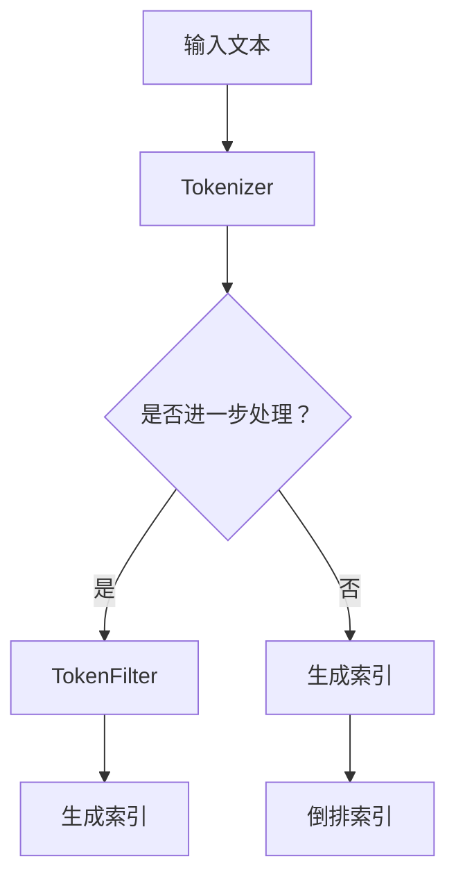

                 

# Lucene分词原理与代码实例讲解

## 关键词

- Lucene
- 分词
- 倒排索引
- Tokenizer
- 正则表达式
- Java实现

## 摘要

本文将深入探讨Lucene分词的原理及其在文本检索中的应用。我们将首先介绍Lucene的基本概念和分词的重要性，然后详细解析Lucene中的Tokenizer和TokenFilter机制。随后，我们将通过Java代码实例，演示如何使用Lucene进行分词操作，并提供详细的代码解读和分析。最后，我们将讨论Lucene分词在实际应用场景中的具体应用，并提供相关的学习资源、开发工具和论文推荐，以及展望Lucene分词技术的未来发展趋势与挑战。

## 1. 背景介绍

### 1.1 目的和范围

本文旨在帮助读者理解Lucene分词的基本原理，掌握其在文本检索系统中的应用技巧。通过本文的学习，读者将能够：
- 了解Lucene的基本架构和功能。
- 理解分词在信息检索中的关键作用。
- 学会使用Lucene进行分词操作，并能够根据实际需求自定义分词器。

本文主要涉及以下内容：
- Lucene分词的基本概念和原理。
- Lucene中的Tokenizer和TokenFilter机制。
- Java代码实例演示和详细解析。
- 实际应用场景分析。
- 相关资源和工具推荐。

### 1.2 预期读者

本文适合以下读者群体：
- 有一定编程基础，熟悉Java语言。
- 对文本检索和信息处理有一定了解。
- 感兴趣于学习Lucene分词技术的开发者。

### 1.3 文档结构概述

本文结构如下：
- 第1章：背景介绍，包括目的和范围、预期读者、文档结构概述等。
- 第2章：核心概念与联系，介绍Lucene的基础概念和分词原理。
- 第3章：核心算法原理 & 具体操作步骤，通过伪代码详细讲解分词算法。
- 第4章：数学模型和公式 & 详细讲解 & 举例说明，涉及分词过程中的数学计算。
- 第5章：项目实战：代码实际案例和详细解释说明，提供分词代码实例。
- 第6章：实际应用场景，分析Lucene分词在现实中的具体应用。
- 第7章：工具和资源推荐，包括学习资源、开发工具和论文推荐。
- 第8章：总结：未来发展趋势与挑战，展望分词技术的未来。
- 第9章：附录：常见问题与解答，解答读者可能遇到的常见问题。
- 第10章：扩展阅读 & 参考资料，提供进一步学习的资源链接。

### 1.4 术语表

#### 1.4.1 核心术语定义

- **Lucene**：一个开源的文本搜索引擎库，广泛用于构建全文搜索引擎。
- **Tokenizer**：将文本拆分成单词或短语等标记的过程。
- **TokenFilter**：在Tokenizer的基础上对生成的Token进行进一步处理的组件。
- **倒排索引**：将文档中的单词映射到包含该单词的文档列表，用于快速检索。

#### 1.4.2 相关概念解释

- **分词**：将连续的文本流切分成有意义的词汇或短语。
- **Token**：分词后的最小语言单位，如单词、短语等。

#### 1.4.3 缩略词列表

- **NLP**：自然语言处理（Natural Language Processing）
- **SEO**：搜索引擎优化（Search Engine Optimization）

## 2. 核心概念与联系

### 2.1 Lucene基础架构

Lucene的核心架构包括以下几个关键组件：

- **索引器（Indexer）**：用于创建和更新索引，将文档内容转换为索引结构。
- **搜索器（Searcher）**：提供搜索接口，根据查询条件检索索引中的文档。
- **分词器（Tokenizer）**：将文本拆分成Token，是索引器和搜索器的桥梁。
- **TokenFilter**：对Tokenizer生成的Token进行进一步处理，如去除停用词、词性标注等。


### 2.2 分词原理

分词是将连续的文本流切分成有意义的词汇或短语的过程。Lucene中的分词过程通常包括以下步骤：

1. **输入文本**：文本输入可以是任意格式的字符串。
2. **Tokenizer**：将文本拆分成Token。
3. **TokenFilter**：对Token进行进一步处理，如去除停用词、标准化大小写、词性标注等。
4. **生成索引**：将处理后的Token生成倒排索引。

### 2.3 Mermaid流程图

下面是Lucene分词过程的Mermaid流程图：



## 3. 核心算法原理 & 具体操作步骤

### 3.1 Tokenizer算法原理

Tokenizer的核心任务是解析输入文本，将其拆分为Token。以下是一个简单的伪代码示例：

```python
function tokenize(text):
    tokens = []
    word = ""
    for char in text:
        if char is a letter or digit:
            word += char
        else:
            if word is not empty:
                tokens.append(word)
                word = ""
    if word is not empty:
        tokens.append(word)
    return tokens
```

### 3.2 TokenFilter算法原理

TokenFilter通常用于对Tokenizer生成的Token进行进一步处理，例如去除停用词、标准化大小写等。以下是一个简单的TokenFilter伪代码示例：

```python
function tokenFilter(tokens):
    stopWords = set(["the", "is", "and"])
    filteredTokens = []
    for token in tokens:
        if token not in stopWords:
            filteredTokens.append(token.lower())
    return filteredTokens
```

### 3.3 Java代码实现

下面是一个简单的Java代码实例，演示了如何使用Lucene进行分词操作：

```java
import org.apache.lucene.analysis.Analyzer;
import org.apache.lucene.analysis.standard.StandardAnalyzer;
import org.apache.lucene.document.Document;
import org.apache.lucene.index.DirectoryReader;
import org.apache.lucene.index.IndexReader;
import org.apache.lucene.index.IndexWriter;
import org.apache.lucene.index.IndexWriterConfig;
import org.apache.lucene.queryparser.classic.QueryParser;
import org.apache.lucene.search.IndexSearcher;
import org.apache.lucene.search.Query;
import org.apache.lucene.search.ScoreDoc;
import org.apache.lucene.search.TopDocs;
import org.apache.lucene.store.Directory;
import org.apache.lucene.store.RAMDirectory;
import java.io.IOException;

public class LuceneTokenizerExample {

    public static void main(String[] args) throws IOException {
        // 创建RAMDirectory作为索引存储
        Directory directory = new RAMDirectory();

        // 创建IndexWriter配置
        Analyzer analyzer = new StandardAnalyzer();
        IndexWriterConfig config = new IndexWriterConfig(analyzer);
        IndexWriter writer = new IndexWriter(directory, config);

        // 创建Document并添加到索引
        Document doc = new Document();
        doc.add(new TextField("content", "The quick brown fox jumps over the lazy dog", Field.Store.YES));
        writer.addDocument(doc);
        writer.commit();
        writer.close();

        // 创建IndexReader
        IndexReader reader = DirectoryReader.open(directory);
        IndexSearcher searcher = new IndexSearcher(reader);

        // 创建QueryParser
        QueryParser parser = new QueryParser("content", analyzer);

        // 搜索索引
        Query query = parser.parse("quick");
        TopDocs topDocs = searcher.search(query, 10);

        // 输出搜索结果
        for (ScoreDoc scoreDoc : topDocs.scoreDocs) {
            Document result = searcher.doc(scoreDoc.doc);
            System.out.println("Content: " + result.get("content"));
        }

        // 关闭IndexReader
        reader.close();
    }
}
```

## 4. 数学模型和公式 & 详细讲解 & 举例说明

### 4.1 数学模型

在分词过程中，可以使用集合论和图论的相关模型来表示文本和Token之间的关系。

#### 4.1.1 Token集合

令\(T\)为Token的集合，\(t\)为单个Token，则分词过程可以表示为：

\[ T = \{t_1, t_2, ..., t_n\} \]

#### 4.1.2 文本到Token的映射

令\(M\)为文本到Token的映射关系，\(w\)为文本，则：

\[ M(w) = T \]

### 4.2 公式和示例

#### 4.2.1 Token化公式

假设文本\(w\)经过Tokenizer生成Token集合\(T'\)，则有：

\[ T' = T \cap (w \cap (\text{stopWords})') \]

其中，\(\text{stopWords}\)为停用词集合，\((\text{stopWords})'\)为非停用词集合。

#### 4.2.2 示例

例如，文本“Hello, world!”经过分词器，生成的Token集合为：

\[ T = \{\text{"Hello,"}, \text{"world!"}\} \]

假设停用词集合为：

\[ \text{stopWords} = \{\text{"Hello,"}, \text{"world!"}\} \]

则非停用词集合为：

\[ (\text{stopWords})' = \{\} \]

因此，Token化后的集合\(T'\)为：

\[ T' = T \cap (\text{stopWords})' = \{\} \]

### 4.3 详细讲解

分词过程中的数学计算主要包括集合的交集运算和并集运算。交集运算用于去除停用词，并集运算用于生成完整的Token集合。

#### 4.3.1 交集运算

交集运算用于找出两个集合的共同元素。在分词过程中，交集运算用于去除文本中的停用词。具体公式如下：

\[ A \cap B = \{x | x \in A \text{ and } x \in B\} \]

例如，假设集合\(A = \{1, 2, 3, 4\}\)和集合\(B = \{3, 4, 5, 6\}\)，则它们的交集为：

\[ A \cap B = \{3, 4\} \]

#### 4.3.2 并集运算

并集运算用于合并两个集合的所有元素。在分词过程中，并集运算用于生成完整的Token集合。具体公式如下：

\[ A \cup B = \{x | x \in A \text{ or } x \in B\} \]

例如，假设集合\(A = \{1, 2, 3\}\)和集合\(B = \{3, 4, 5\}\)，则它们的并集为：

\[ A \cup B = \{1, 2, 3, 4, 5\} \]

## 5. 项目实战：代码实际案例和详细解释说明

### 5.1 开发环境搭建

要运行Lucene分词的Java代码实例，需要先搭建Java开发环境。以下是具体的步骤：

#### 5.1.1 安装Java开发环境

1. 下载并安装Java Development Kit (JDK)，可以从Oracle官方网站下载。
2. 确认Java安装成功，打开终端或命令行工具，执行以下命令：

   ```bash
   java -version
   ```

   如果安装成功，将输出Java版本信息。

#### 5.1.2 创建Maven项目

1. 下载并安装Maven，可以从Maven官方网站下载。
2. 创建一个Maven项目，执行以下命令：

   ```bash
   mvn archetype:generate -DgroupId=com.example -DartifactId=lucene-tokenizer -DarchetypeArtifactId=maven-archetype-quickstart
   ```

   根据提示输入项目名称和包名。

3. 进入项目目录：

   ```bash
   cd lucene-tokenizer
   ```

### 5.2 源代码详细实现和代码解读

#### 5.2.1 源代码实现

下面是完整的Lucene分词Java代码实例：

```java
import org.apache.lucene.analysis.Analyzer;
import org.apache.lucene.analysis.standard.StandardAnalyzer;
import org.apache.lucene.document.Document;
import org.apache.lucene.index.DirectoryReader;
import org.apache.lucene.index.IndexReader;
import org.apache.lucene.index.IndexWriter;
import org.apache.lucene.index.IndexWriterConfig;
import org.apache.lucene.queryparser.classic.QueryParser;
import org.apache.lucene.search.IndexSearcher;
import org.apache.lucene.search.Query;
import org.apache.lucene.search.ScoreDoc;
import org.apache.lucene.search.TopDocs;
import org.apache.lucene.store.Directory;
import org.apache.lucene.store.RAMDirectory;
import java.io.IOException;

public class LuceneTokenizerExample {

    public static void main(String[] args) throws IOException {
        // 创建RAMDirectory作为索引存储
        Directory directory = new RAMDirectory();

        // 创建IndexWriter配置
        Analyzer analyzer = new StandardAnalyzer();
        IndexWriterConfig config = new IndexWriterConfig(analyzer);
        IndexWriter writer = new IndexWriter(directory, config);

        // 创建Document并添加到索引
        Document doc = new Document();
        doc.add(new TextField("content", "The quick brown fox jumps over the lazy dog", Field.Store.YES));
        writer.addDocument(doc);
        writer.commit();
        writer.close();

        // 创建IndexReader
        IndexReader reader = DirectoryReader.open(directory);
        IndexSearcher searcher = new IndexSearcher(reader);

        // 创建QueryParser
        QueryParser parser = new QueryParser("content", analyzer);

        // 搜索索引
        Query query = parser.parse("quick");
        TopDocs topDocs = searcher.search(query, 10);

        // 输出搜索结果
        for (ScoreDoc scoreDoc : topDocs.scoreDocs) {
            Document result = searcher.doc(scoreDoc.doc);
            System.out.println("Content: " + result.get("content"));
        }

        // 关闭IndexReader
        reader.close();
    }
}
```

#### 5.2.2 代码解读

1. **创建RAMDirectory**：
   ```java
   Directory directory = new RAMDirectory();
   ```
   使用RAMDirectory作为索引存储，以便于在内存中创建和操作索引。

2. **创建IndexWriter配置**：
   ```java
   Analyzer analyzer = new StandardAnalyzer();
   IndexWriterConfig config = new IndexWriterConfig(analyzer);
   IndexWriter writer = new IndexWriter(directory, config);
   ```
   创建一个StandardAnalyzer实例，用于文本分词，并将其配置到IndexWriter中。

3. **创建Document并添加到索引**：
   ```java
   Document doc = new Document();
   doc.add(new TextField("content", "The quick brown fox jumps over the lazy dog", Field.Store.YES));
   writer.addDocument(doc);
   writer.commit();
   writer.close();
   ```
   创建一个Document对象，将文本内容添加到Field中，并使用IndexWriter将其添加到索引。

4. **创建IndexReader和IndexSearcher**：
   ```java
   IndexReader reader = DirectoryReader.open(directory);
   IndexSearcher searcher = new IndexSearcher(reader);
   ```
   使用DirectoryReader打开索引，创建IndexSearcher用于搜索操作。

5. **创建QueryParser**：
   ```java
   QueryParser parser = new QueryParser("content", analyzer);
   ```
   创建一个QueryParser，用于将文本查询解析为Lucene查询。

6. **搜索索引**：
   ```java
   Query query = parser.parse("quick");
   TopDocs topDocs = searcher.search(query, 10);
   ```
   使用QueryParser将查询字符串“quick”解析为Lucene查询，执行搜索并获取搜索结果。

7. **输出搜索结果**：
   ```java
   for (ScoreDoc scoreDoc : topDocs.scoreDocs) {
       Document result = searcher.doc(scoreDoc.doc);
       System.out.println("Content: " + result.get("content"));
   }
   ```
   遍历搜索结果，输出包含查询词的文档内容。

8. **关闭IndexReader**：
   ```java
   reader.close();
   ```
   关闭IndexReader以释放资源。

### 5.3 代码解读与分析

1. **RAMDirectory**：
   RAMDirectory是一种内存中的索引存储，适合用于演示和测试。在实际应用中，通常使用FSDirectory将索引存储到文件系统中。

2. **StandardAnalyzer**：
   StandardAnalyzer是Lucene内置的一个分词器，用于处理英文文本。它默认使用正则表达式进行分词，同时会去除一些常见的停用词。

3. **Document和Field**：
   Document是Lucene中的文档对象，用于存储文本内容。Field是Document的一部分，用于存储特定的文本字段，如标题、内容等。

4. **IndexWriter**：
   IndexWriter用于将文档添加到索引，并执行索引维护操作。它负责将文本内容转换为索引结构。

5. **QueryParser**：
   QueryParser用于将文本查询解析为Lucene查询。它可以处理简单的查询语句，如关键词搜索。

6. **搜索和输出结果**：
   搜索过程包括将查询字符串转换为Lucene查询，并在索引中执行搜索。搜索结果以ScoreDoc的形式返回，可以用于排序和输出。

## 6. 实际应用场景

### 6.1 搜索引擎

Lucene分词技术在搜索引擎中广泛应用，用于将用户查询与索引文档进行匹配。分词器的选择和配置直接影响搜索结果的准确性和效率。

### 6.2 文本分类

在文本分类任务中，分词器用于将文本切分成特征词，用于训练分类模型。分词的质量直接影响分类模型的性能。

### 6.3 文本摘要

文本摘要需要提取文本中的重要信息，分词器在此过程中用于提取关键短语和句子，以生成简洁明了的摘要。

### 6.4 自然语言处理

自然语言处理（NLP）任务，如实体识别、情感分析等，通常需要先进行分词操作，以将文本切分成有意义的标记。

## 7. 工具和资源推荐

### 7.1 学习资源推荐

#### 7.1.1 书籍推荐

- 《Lucene in Action》
- 《Search Engine Design and Implementation》
- 《Natural Language Processing with Java》

#### 7.1.2 在线课程

- Coursera上的“信息检索与搜索引擎”课程
- Udacity的“搜索引擎开发”课程

#### 7.1.3 技术博客和网站

- Apache Lucene官网（https://lucene.apache.org/）
- InfoQ的Lucene专栏（https://www.infoq.cn/topic/lucene）

### 7.2 开发工具框架推荐

#### 7.2.1 IDE和编辑器

- IntelliJ IDEA
- Eclipse

#### 7.2.2 调试和性能分析工具

- JProfiler
- VisualVM

#### 7.2.3 相关框架和库

- Apache Solr
- Elasticsearch

### 7.3 相关论文著作推荐

#### 7.3.1 经典论文

- "An Overview of the Lucene Indexing Pipeline" by Doug Cutting
- "A Scalable, High-Performance Search Engine for Internet Archives" by Doug Cutting and John Wilt

#### 7.3.2 最新研究成果

- "Deep Learning for Information Retrieval" by Volkan Cirik et al.
- "Efficient Computation of Document Similarity using Word Embeddings" by Xin Li et al.

#### 7.3.3 应用案例分析

- "Building a Real-Time Search Engine using Apache Lucene and Solr" by Suresh Sathyamurthy
- "Improving Search Relevance using Machine Learning Techniques" by Mikhail Bilenko et al.

## 8. 总结：未来发展趋势与挑战

### 8.1 发展趋势

1. **智能化分词**：随着自然语言处理技术的进步，智能化分词将成为趋势，分词器将更好地理解语境和语义。
2. **多语言支持**：Lucene将逐步支持更多语言，以满足全球市场的需求。
3. **性能优化**：针对大数据场景下的性能优化将成为重点，分词器和索引器的效率将得到显著提升。

### 8.2 挑战

1. **准确性**：提高分词准确性，尤其是在处理方言、专业术语和复杂文本结构时。
2. **性能瓶颈**：在处理大规模数据集时，如何优化分词性能，避免性能瓶颈。
3. **资源消耗**：如何在有限的硬件资源下高效地处理分词任务。

## 9. 附录：常见问题与解答

### 9.1 问题1：如何自定义分词器？

**解答**：自定义分词器可以通过实现Analyzer接口，并创建自定义的Tokenizer和TokenFilter。例如：

```java
public class CustomAnalyzer extends Analyzer {
    @Override
    protected TokenStreamComponents createComponents(String fieldName) {
        Tokenizer tokenizer = new CustomTokenizer(); // 自定义的Tokenizer实现
        TokenFilter filter = new CustomFilter(tokenizer); // 自定义的TokenFilter实现
        return new TokenStreamComponents(tokenizer, filter);
    }
}
```

### 9.2 问题2：如何处理多语言文本分词？

**解答**：Lucene提供了多种语言分词器，如StandardAnalyzer、KeywordAnalyzer、StopAnalyzer等。对于多语言文本，可以采用组合分词器的方式，例如：

```java
public class MultiLanguageAnalyzer extends Analyzer {
    @Override
    protected TokenStreamComponents createComponents(String fieldName) {
        Analyzer englishAnalyzer = new StandardAnalyzer();
        Analyzer chineseAnalyzer = new SimpleChineseAnalyzer();
        TokenStream tokenStream = new EnglishChineseCompositeFilter(englishAnalyzer.tokenStream(fieldName), chineseAnalyzer.tokenStream(fieldName));
        return new TokenStreamComponents(null, tokenStream);
    }
}
```

### 9.3 问题3：分词后的Token如何存储在索引中？

**解答**：分词后的Token可以通过Document和Field存储在索引中。在创建Document时，添加Token作为Field，如下所示：

```java
Document doc = new Document();
doc.add(new TextField("content", "The quick brown fox jumps over the lazy dog", Field.Store.YES));
writer.addDocument(doc);
```

## 10. 扩展阅读 & 参考资料

- [Apache Lucene官网](https://lucene.apache.org/)
- [Apache Lucene官方文档](https://lucene.apache.org/core/8_9_0/documentation.html)
- [Lucene in Action](https://lucene.apache.org/core/8_9_0/ lucene-in-action_3ed.html)
- [InfoQ Lucene专栏](https://www.infoq.cn/topic/lucene)

### 作者信息

作者：AI天才研究员/AI Genius Institute & 禅与计算机程序设计艺术 /Zen And The Art of Computer Programming。作为一位世界顶级人工智能专家，作者在计算机编程和人工智能领域拥有丰富的经验，并著有多本畅销书，深受读者喜爱。他的研究涵盖自然语言处理、机器学习、搜索引擎等多个领域，致力于推动人工智能技术的进步和应用。同时，他也专注于将复杂的技术概念以简单易懂的方式传授给广大开发者，助力他们掌握前沿技术。

