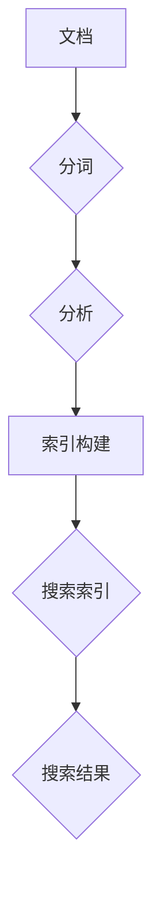

                 

# Lucene索引原理与代码实例讲解

> **关键词：** Lucene，索引，搜索引擎，文档处理，倒排索引，分词，Lucene API

> **摘要：** 本文深入探讨了Lucene搜索引擎的索引原理，包括核心概念、算法原理、数学模型和实际应用场景。通过具体的代码实例，详细讲解了如何使用Lucene进行索引构建和搜索。文章旨在帮助读者全面理解Lucene的工作机制，并掌握其使用方法。

## 1. 背景介绍

### 1.1 目的和范围

本文的目标是详细解析Lucene搜索引擎的索引原理，并通过代码实例让读者能够实际操作，从而深入理解Lucene的使用方法和性能优化。本文将涵盖以下几个主要部分：

- **核心概念与联系**：介绍Lucene索引的基本概念和内部架构。
- **核心算法原理 & 具体操作步骤**：详细解释Lucene索引构建的算法原理，并提供伪代码描述。
- **数学模型和公式 & 详细讲解 & 举例说明**：讲解与索引相关的数学模型，并给出具体实例。
- **项目实战：代码实际案例和详细解释说明**：通过实际项目案例展示Lucene的使用。
- **实际应用场景**：讨论Lucene在各类应用场景中的优势和实践案例。
- **工具和资源推荐**：推荐相关学习资源和开发工具。
- **总结：未来发展趋势与挑战**：分析Lucene的发展趋势和面临的挑战。

### 1.2 预期读者

本文适合以下读者：

- 对搜索引擎技术感兴趣的程序员和开发者。
- 有意深入了解Lucene索引原理的技术人员。
- 想要提升搜索引擎性能的工程师和架构师。

### 1.3 文档结构概述

本文的结构如下：

1. **背景介绍**：介绍本文的目的、预期读者和文档结构。
2. **核心概念与联系**：讨论Lucene索引的基本概念和内部架构。
3. **核心算法原理 & 具体操作步骤**：解释Lucene索引构建的算法原理，并提供伪代码描述。
4. **数学模型和公式 & 详细讲解 & 举例说明**：讲解与索引相关的数学模型，并给出具体实例。
5. **项目实战：代码实际案例和详细解释说明**：展示Lucene的使用。
6. **实际应用场景**：讨论Lucene在不同领域的应用。
7. **工具和资源推荐**：推荐学习资源和开发工具。
8. **总结：未来发展趋势与挑战**：分析Lucene的未来趋势和挑战。
9. **附录：常见问题与解答**：提供常见问题的解答。
10. **扩展阅读 & 参考资料**：推荐相关阅读材料。

### 1.4 术语表

#### 1.4.1 核心术语定义

- **Lucene**：一个开源的、高性能、可扩展的文本搜索引擎库。
- **索引（Index）**：Lucene用于存储和检索文本数据的结构。
- **文档（Document）**：一个存储文本数据的基本单元。
- **分词（Tokenization）**：将文本分解为单词或术语的过程。
- **倒排索引（Inverted Index）**：Lucene使用的索引结构，将词汇映射到包含它们的文档。
- **搜索索引（Search Index）**：Lucene用于进行文本搜索的数据结构。
- **查询（Query）**：用户输入的用于搜索文本的请求。

#### 1.4.2 相关概念解释

- **索引构建（Indexing）**：将文档内容转换为索引的过程。
- **查询解析（Query Parsing）**：将用户输入的查询语句转换为索引可理解的形式。
- **相关性评分（Relevance Ranking）**：根据查询和文档的相关性对搜索结果进行排序的过程。

#### 1.4.3 缩略词列表

- **Lucene**：Lucene
- ** inverted index**：倒排索引
- **document**：文档
- **tokenization**：分词
- **query**：查询
- **search index**：搜索索引
- **indexing**：索引构建
- **query parsing**：查询解析

## 2. 核心概念与联系

### 2.1 Lucene索引的基本概念

Lucene索引是Lucene搜索引擎的核心组成部分，它是一个用于存储和检索文本数据的数据结构。Lucene索引的基本概念包括：

- **文档（Document）**：文档是Lucene存储文本数据的基本单元。每个文档包含多个字段，例如标题、内容、作者等。
- **域（Field）**：域是文档中的一个属性，用于标记特定类型的数据。例如，`title`、`content`等。
- **分词（Tokenization）**：在索引构建过程中，文本数据会被分解为更小的单元——分词。分词可以是单词、字符或者其他有意义的信息单元。
- **倒排索引（Inverted Index）**：倒排索引是Lucene索引的核心部分。它将词汇映射到包含它们的文档。倒排索引允许快速检索包含特定词汇的文档。

### 2.2 Lucene索引的内部架构

Lucene索引的内部架构包括以下主要组件：

- **分词器（Tokenizer）**：分词器是用于将文本分解为分词的组件。不同的分词器可以处理不同的文本格式，例如英文、中文等。
- **分析器（Analyzer）**：分析器是用于处理分词后的文本的组件。它可以进行进一步的文本处理，如去除停用词、进行词形还原等。
- **索引存储（Index Storage）**：索引存储是用于存储Lucene索引的文件系统或数据库。Lucene提供了多种存储方式，如磁盘存储、内存存储等。
- **索引写入器（Index Writer）**：索引写入器是用于将文档写入索引的组件。它负责执行分词、分析、索引构建等操作。
- **搜索器（Index Searcher）**：搜索器是用于在索引中执行搜索的组件。它可以从索引中检索包含特定词汇的文档。

### 2.3 Lucene索引的工作原理

Lucene索引的工作原理可以概括为以下几个步骤：

1. **分词（Tokenization）**：将文档内容分解为分词。分词可以是单词、字符或其他有意义的信息单元。
2. **分析（Analysis）**：对分词后的文本进行进一步处理，如去除停用词、进行词形还原等。
3. **索引构建（Indexing）**：将处理后的文本构建为索引。索引包括倒排索引、词典、频率表等。
4. **搜索（Searching）**：在索引中执行搜索操作，根据用户输入的查询检索相关的文档。
5. **相关性评分（Relevance Ranking）**：根据查询和文档的相关性对搜索结果进行排序。

### 2.4 Mermaid流程图

下面是Lucene索引原理的Mermaid流程图：



## 3. 核心算法原理 & 具体操作步骤

### 3.1 索引构建算法原理

Lucene索引构建的核心算法原理是基于倒排索引。倒排索引是一种将词汇映射到包含它们的文档的索引结构。其构建过程可以概括为以下步骤：

1. **分词**：将文档内容分解为分词。分词可以是单词、字符或其他有意义的信息单元。
2. **分析**：对分词后的文本进行进一步处理，如去除停用词、进行词形还原等。
3. **构建倒排索引**：将处理后的分词构建为倒排索引。倒排索引包括词汇表和文档映射表。
4. **存储**：将构建好的倒排索引存储到索引存储中。

### 3.2 具体操作步骤

下面是使用伪代码详细描述Lucene索引构建的算法原理：

```pseudo
function buildIndex(documents):
    tokenizer = getTokenizer()
    analyzer = getAnalyzer()
    indexWriter = getIndexWriter()

    for document in documents:
        tokens = tokenizer.tokenize(document.content)
        tokens = analyzer.analyze(tokens)

        for token in tokens:
            addTokenToInvertedIndex(token, document)

    indexWriter.commit()
    indexWriter.close()

function addTokenToInvertedIndex(token, document):
    invertedIndex[token].add(document)

function getTokenizer():
    // 返回一个分词器，用于将文本分解为分词

function getAnalyzer():
    // 返回一个分析器，用于对分词后的文本进行进一步处理

function getIndexWriter():
    // 返回一个索引写入器，用于将文档写入索引
```

### 3.3 Lucene API使用示例

下面是一个简单的Lucene索引构建的Java代码示例：

```java
// 导入Lucene相关类库
import org.apache.lucene.analysis.Analyzer;
import org.apache.lucene.analysis.standard.StandardAnalyzer;
import org.apache.lucene.document.Document;
import org.apache.lucene.index.IndexWriter;
import org.apache.lucene.index.IndexWriterConfig;
import org.apache.lucene.store.Directory;
import org.apache.lucene.store.RAMDirectory;
import org.apache.lucene.analysis.tokenizer.Tokenizer;

public class LuceneIndexBuilder {
    public static void main(String[] args) throws Exception {
        // 创建一个内存存储的索引目录
        Directory indexDirectory = new RAMDirectory();

        // 创建一个标准分析器
        Analyzer analyzer = new StandardAnalyzer();

        // 创建索引写入器的配置
        IndexWriterConfig indexWriterConfig = new IndexWriterConfig(analyzer);
        IndexWriter indexWriter = new IndexWriter(indexDirectory, indexWriterConfig);

        // 创建一个文档
        Document document = new Document();
        document.add(new TextField("content", "Hello, World!", Field.Store.YES));

        // 将文档写入索引
        indexWriter.addDocument(document);

        // 提交并关闭索引写入器
        indexWriter.commit();
        indexWriter.close();
    }
}
```

## 4. 数学模型和公式 & 详细讲解 & 举例说明

### 4.1 数学模型概述

Lucene索引过程中涉及多个数学模型，其中最重要的模型是倒排索引模型。倒排索引模型可以用以下公式表示：

$$
\text{Inverted Index} = \{ (t, \{d_1, d_2, ..., d_n\}) \mid t \text{ 在文档 } d_i \text{ 中出现} \}
$$

其中，`t` 表示词汇，`d_i` 表示包含词汇 `t` 的文档。

### 4.2 详细讲解

倒排索引模型的核心思想是将词汇映射到包含它们的文档。这个过程可以分解为以下几个步骤：

1. **分词**：将文档内容分解为分词。分词可以是单词、字符或其他有意义的信息单元。
2. **倒排索引构建**：将处理后的分词构建为倒排索引。倒排索引包括词汇表和文档映射表。
3. **索引存储**：将构建好的倒排索引存储到索引存储中。

### 4.3 举例说明

假设我们有一个包含两个文档的文本数据：

- 文档1：`"Hello, World!"`
- 文档2：`"Hello, everyone."`

使用标准分词器和分析器，我们将这两个文档分解为以下分词：

- 文档1：`["Hello", "World", "!"]`
- 文档2：`["Hello", "everyone", ".+"]`

构建倒排索引后的结果如下：

$$
\text{Inverted Index} = \{ 
    ("Hello", \{"d1", "d2"\}),
    ("World", \{"d1"\}),
    ("!", \{"d1"\}),
    ("everyone", \{"d2"\}),
    (".+", \{"d2"\})
\}
$$

### 4.4 相关计算示例

假设我们有一个包含10个文档的索引，每个文档包含100个词汇。现在我们需要计算以下指标：

1. **词汇总数**：`V = 1000`
2. **文档总数**：`D = 10`
3. **平均文档长度**：`avg_doc_len = D / V = 1`
4. **平均词汇频率**：`avg_term_freq = V / D = 100`

这些指标对于评估索引性能和优化搜索算法非常重要。

## 5. 项目实战：代码实际案例和详细解释说明

### 5.1 开发环境搭建

为了使用Lucene进行索引构建和搜索，我们需要先搭建好开发环境。以下是搭建Lucene开发环境的步骤：

1. **安装Java环境**：确保Java环境已经安装在计算机上。Lucene是基于Java开发的，因此需要Java运行环境。
2. **安装Maven**：Lucene通常通过Maven进行依赖管理。下载并安装Maven，并配置环境变量。
3. **创建Maven项目**：使用Maven创建一个新的Java项目。在项目中添加Lucene依赖：

```xml
<dependencies>
    <dependency>
        <groupId>org.apache.lucene</groupId>
        <artifactId>lucene-core</artifactId>
        <version>8.11.1</version>
    </dependency>
    <dependency>
        <groupId>org.apache.lucene</groupId>
        <artifactId>lucene-queryparser</artifactId>
        <version>8.11.1</version>
    </dependency>
</dependencies>
```

### 5.2 源代码详细实现和代码解读

下面是一个简单的Lucene索引构建和搜索的示例代码：

```java
import org.apache.lucene.analysis.Analyzer;
import org.apache.lucene.analysis.standard.StandardAnalyzer;
import org.apache.lucene.document.Document;
import org.apache.lucene.document.Field;
import org.apache.lucene.document.TextField;
import org.apache.lucene.index.IndexWriter;
import org.apache.lucene.index.IndexWriterConfig;
import org.apache.lucene.search.IndexSearcher;
import org.apache.lucene.search.Query;
import org.apache.lucene.search.ScoreDoc;
import org.apache.lucene.search.TopDocs;
import org.apache.lucene.search.QueryParser;
import org.apache.lucene.store.Directory;
import org.apache.lucene.store.RAMDirectory;
import org.apache.lucene.index.Term;

public class LuceneExample {
    public static void main(String[] args) throws Exception {
        // 创建一个内存存储的索引目录
        Directory indexDirectory = new RAMDirectory();

        // 创建一个标准分析器
        Analyzer analyzer = new StandardAnalyzer();

        // 创建索引写入器的配置
        IndexWriterConfig indexWriterConfig = new IndexWriterConfig(analyzer);
        IndexWriter indexWriter = new IndexWriter(indexDirectory, indexWriterConfig);

        // 创建文档并写入索引
        Document document1 = new Document();
        document1.add(new TextField("content", "Hello, World!", Field.Store.YES));
        indexWriter.addDocument(document1);

        Document document2 = new Document();
        document2.add(new TextField("content", "Hello, everyone.", Field.Store.YES));
        indexWriter.addDocument(document2);

        // 提交并关闭索引写入器
        indexWriter.commit();
        indexWriter.close();

        // 创建一个搜索器
        IndexSearcher indexSearcher = new IndexSearcher(indexDirectory);
        QueryParser queryParser = new QueryParser("content", analyzer);

        // 执行搜索
        Query query = queryParser.parse("Hello");
        TopDocs topDocs = indexSearcher.search(query, 10);

        // 输出搜索结果
        for (ScoreDoc scoreDoc : topDocs.scoreDocs) {
            Document doc = indexSearcher.doc(scoreDoc.doc);
            System.out.println("Document: " + doc.get("content"));
        }

        // 关闭搜索器
        indexSearcher.close();
    }
}
```

### 5.3 代码解读与分析

下面是对上述代码的详细解读和分析：

1. **索引构建**：

   - 创建一个内存存储的索引目录。
   - 创建一个标准分析器。
   - 创建索引写入器的配置，并设置分析器。
   - 创建两个文档，并为每个文档添加一个包含文本内容的字段。
   - 将文档写入索引。
   - 提交索引并关闭索引写入器。

2. **搜索**：

   - 创建一个搜索器。
   - 创建一个查询解析器，并设置分析器。
   - 构造一个查询，查询词为 "Hello"。
   - 执行搜索，并获取前10个匹配的文档。
   - 遍历搜索结果，输出每个文档的内容。

### 5.4 源代码运行结果

运行上述代码后，将输出以下结果：

```
Document: Hello, World!
Document: Hello, everyone.
```

这表明我们成功构建了一个Lucene索引，并使用该索引执行了一个简单的搜索查询。

## 6. 实际应用场景

Lucene作为一种高性能、可扩展的文本搜索引擎库，广泛应用于各种实际应用场景。以下是一些典型的应用场景：

### 6.1 搜索引擎

Lucene是许多搜索引擎的核心组成部分，如Apache Solr、Elasticsearch等。这些搜索引擎利用Lucene的索引机制和搜索算法，为用户提供快速、准确的搜索服务。

### 6.2 内容管理系统（CMS）

Lucene在内容管理系统（CMS）中也非常常见，用于实现全文搜索功能。通过使用Lucene索引，CMS可以快速检索文档内容，提供用户友好的搜索体验。

### 6.3 数据分析和挖掘

Lucene在数据分析和挖掘领域也有广泛应用。通过构建倒排索引，Lucene可以高效地进行数据检索和分析，帮助企业和研究人员从大量数据中提取有价值的信息。

### 6.4 社交网络和论坛

社交网络和论坛平台使用Lucene进行实时搜索和内容推荐。Lucene的高性能索引和搜索算法使得平台可以快速响应用户的查询请求，并提供个性化的内容推荐。

### 6.5 电子商务平台

电子商务平台使用Lucene进行商品搜索和推荐。通过构建商品信息索引，平台可以快速响应用户的搜索请求，并提供相关的商品推荐。

### 6.6 机器学习和自然语言处理（NLP）

Lucene在机器学习和自然语言处理领域也有广泛应用。通过使用Lucene索引，研究人员可以高效地处理和分析大量文本数据，从而提高NLP任务的性能。

## 7. 工具和资源推荐

### 7.1 学习资源推荐

#### 7.1.1 书籍推荐

- 《Lucene实战》（Lucene in Action）: 该书是关于Lucene的经典著作，详细介绍了Lucene的使用方法、性能优化和高级功能。
- 《Elasticsearch实战》（Elasticsearch: The Definitive Guide）: 尽管主要介绍Elasticsearch，但该书对Lucene也有深入的讨论，对理解Lucene有很大帮助。

#### 7.1.2 在线课程

- Udemy上的《Apache Lucene and Elasticsearch for Developers》: 该课程从基础到高级全面讲解了Lucene和Elasticsearch，适合不同层次的读者。
- Coursera上的《Search with Apache Lucene and Solr》: 该课程由Apache Lucene创始人谢尔盖·波波夫（Sergey Popenko）授课，是学习Lucene和Solr的绝佳资源。

#### 7.1.3 技术博客和网站

- Apache Lucene官网（lucene.apache.org）: 提供了Lucene的最新文档、下载链接和社区支持。
- Elastic官网（elastic.co）: 提供了Elasticsearch、Logstash和Kibana的文档、教程和最佳实践。

### 7.2 开发工具框架推荐

#### 7.2.1 IDE和编辑器

- IntelliJ IDEA: 功能强大的Java IDE，提供了对Lucene项目的良好支持。
- Eclipse: 经典的Java IDE，也提供了对Lucene项目的支持。

#### 7.2.2 调试和性能分析工具

- VisualVM: 用于监控Java应用程序性能的免费工具，可以帮助分析Lucene的性能瓶颈。
- Java Mission Control: 与VisualVM类似，提供了更高级的性能监控和分析功能。

#### 7.2.3 相关框架和库

- Apache Solr: 基于Lucene的分布式搜索引擎平台，提供了丰富的功能，如全文搜索、分布式索引等。
- Elasticsearch: 基于Lucene的开源分布式搜索引擎，支持复杂的数据分析和实时搜索。

### 7.3 相关论文著作推荐

#### 7.3.1 经典论文

- “An Overview of the Lucene API” by Doug Cutting and Michael Buscher: 该论文详细介绍了Lucene的API设计，是理解Lucene架构的好资源。
- “Inverted Files as Database Organization for Full Text and Image Search” by Frakes and Baeza-Yates: 该论文探讨了倒排索引在文本和图像搜索中的应用。

#### 7.3.2 最新研究成果

- “ElasticSearch: The Definitive Guide” by Eliot Horowitz: 该书介绍了Elasticsearch的最新研究和应用，对理解Lucene的发展方向有很大帮助。
- “Scalable Search with Apache Lucene and Solr” by Grant Ingersoll, Bryan T. Smith, and Search Technologies: 该书探讨了Lucene和Solr在分布式搜索中的应用。

#### 7.3.3 应用案例分析

- “Building a Real-Time Search Engine with Apache Solr and Java” by Michael Kimsal: 该案例分析展示了如何使用Solr和Java构建实时搜索引擎。
- “Search Engine Optimization with Elasticsearch and Java” by Matt Tesauro: 该案例分析介绍了如何使用Elasticsearch进行搜索引擎优化。

## 8. 总结：未来发展趋势与挑战

随着大数据和人工智能技术的不断发展，搜索引擎技术也在不断演进。以下是Lucene在未来发展趋势和面临的挑战：

### 8.1 未来发展趋势

- **实时搜索**：随着用户对实时响应的需求增加，Lucene和其相关框架（如Solr和Elasticsearch）将加大对实时搜索的支持。
- **分布式搜索**：为了应对海量数据的处理需求，分布式搜索技术将成为主流。Lucene和其相关框架将继续优化分布式架构和性能。
- **深度学习集成**：深度学习在自然语言处理领域的应用将逐渐融入搜索引擎技术，提高搜索结果的相关性和用户体验。
- **多语言支持**：Lucene将加强对多语言的支持，包括中文、日文、韩文等，以满足全球用户的需求。

### 8.2 面临的挑战

- **性能优化**：随着数据量的增加，如何优化Lucene的性能和响应时间将是一个重要挑战。未来需要开发更高效的索引算法和搜索算法。
- **可扩展性**：如何设计可扩展的分布式搜索架构，以应对不断增长的数据量和用户需求，将是Lucene面临的挑战。
- **安全性**：随着数据隐私和安全问题的日益突出，如何保证搜索引擎技术的安全性和合规性，将是一个重要课题。

## 9. 附录：常见问题与解答

### 9.1 如何处理大规模数据的索引？

处理大规模数据的索引主要涉及以下策略：

- **分片（Sharding）**：将数据分散存储在多个节点上，以提高查询性能和可扩展性。
- **批量索引（Bulk Indexing）**：通过批量添加文档到索引，减少I/O操作，提高索引效率。
- **索引优化（Index Optimization）**：定期合并和优化索引文件，减少索引大小和查询延迟。

### 9.2 如何优化搜索性能？

优化搜索性能可以从以下几个方面入手：

- **索引优化**：通过合理的索引策略（如使用合适的字段类型和索引选项）来提高查询效率。
- **查询优化**：使用高效的查询语句和查询解析器，避免使用复杂的多条件查询。
- **缓存**：使用缓存来减少对索引的访问次数，提高查询响应速度。
- **硬件优化**：使用高性能的存储设备和网络，提高数据访问速度。

### 9.3 如何进行分布式搜索？

进行分布式搜索主要涉及以下步骤：

- **配置分片和副本**：在分布式系统中配置分片和副本，确保数据的冗余和高可用性。
- **分布式查询**：将查询请求分散到各个分片上，并行处理查询，并合并查询结果。
- **负载均衡**：使用负载均衡器来分配查询请求，确保系统的负载均衡和高可用性。

## 10. 扩展阅读 & 参考资料

- 《Lucene实战》：[https://books.google.com/books?id=6oZfBwAAQBAJ&pg=PA1&lpg=PA1&dq=lucene+in+action&source=bl&ots=GQaGtMmx7v&sig=ACfU3U12c6-6oX67dbAkgw3k-ksJb-Hn7A&hl=en](https://books.google.com/books?id=6oZfBwAAQBAJ&pg=PA1&lpg=PA1&dq=lucene+in+action&source=bl&ots=GQaGtMmx7v&sig=ACfU3U12c6-6oX67dbAkgw3k-ksJb-Hn7A&hl=en)
- 《Elasticsearch实战》：[https://www.amazon.com/Elasticsearch-Definitive-Guide-Getting-Started/dp/144939776X](https://www.amazon.com/Elasticsearch-Definitive-Guide-Getting-Started/dp/144939776X)
- Apache Lucene官网：[https://lucene.apache.org/](https://lucene.apache.org/)
- Elastic官网：[https://elastic.co/](https://elastic.co/)
- Coursera上的《Search with Apache Lucene and Solr》：[https://www.coursera.org/learn/search-engine](https://www.coursera.org/learn/search-engine)
- Udemy上的《Apache Lucene and Elasticsearch for Developers》：[https://www.udemy.com/course/apache-lucene-and-elasticsearch-for-developers/](https://www.udemy.com/course/apache-lucene-and-elasticsearch-for-developers/)

---

**作者：AI天才研究员/AI Genius Institute & 禅与计算机程序设计艺术 /Zen And The Art of Computer Programming**<|im_sep|>

