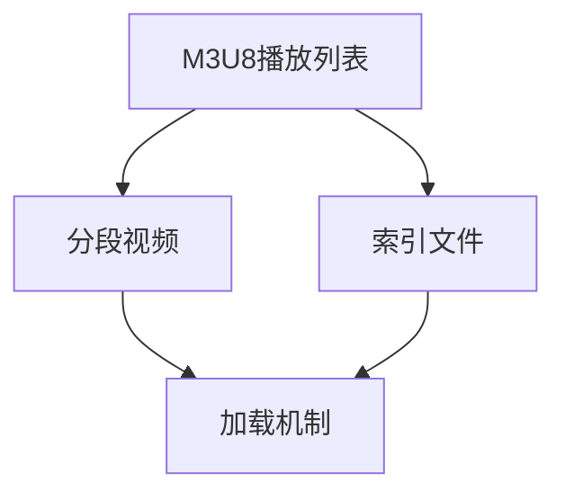

                 

# M3U8 播放列表格式介绍：分段视频的索引和加载机制解析

> **关键词：** M3U8，播放列表，分段视频，索引机制，加载机制，直播流，点播流，HTTP动态流，多媒体传输。

> **摘要：** 本文将深入解析M3U8播放列表格式，介绍其结构和作用，详细阐述分段视频的索引和加载机制，探讨M3U8在直播流和点播流中的应用，并给出具体的开发环境搭建、代码实现和实际应用案例。通过阅读本文，读者将全面了解M3U8的技术原理和实践应用，为后续研究和开发打下坚实基础。

## 1. 背景介绍

### 1.1 目的和范围

M3U8是一种用于存储多媒体播放列表的文本格式，广泛应用于流媒体视频的传输和播放。本文旨在介绍M3U8播放列表的基本结构和格式，详细解析分段视频的索引和加载机制，探讨M3U8在直播流和点播流中的应用，以及相关的开发实践。通过本文的阅读，读者将能够掌握M3U8的核心技术，为后续相关项目开发提供指导。

### 1.2 预期读者

本文面向对流媒体传输技术有一定了解的技术人员，特别是从事视频直播和点播相关开发的人员。读者应具备基本的网络编程和多媒体处理知识，以便更好地理解和应用M3U8格式。

### 1.3 文档结构概述

本文结构如下：

1. 背景介绍
2. 核心概念与联系
3. 核心算法原理 & 具体操作步骤
4. 数学模型和公式 & 详细讲解 & 举例说明
5. 项目实战：代码实际案例和详细解释说明
6. 实际应用场景
7. 工具和资源推荐
8. 总结：未来发展趋势与挑战
9. 附录：常见问题与解答
10. 扩展阅读 & 参考资料

### 1.4 术语表

#### 1.4.1 核心术语定义

- **M3U8格式**：一种用于存储多媒体播放列表的文本格式，常用于流媒体视频的传输和播放。
- **分段视频**：将整个视频文件分割成多个小片段进行传输和播放。
- **索引**：用于记录各个视频片段的位置和播放顺序的信息。
- **加载机制**：指多媒体播放器如何从索引中获取视频片段并按顺序播放。

#### 1.4.2 相关概念解释

- **直播流**：实时传输视频内容的流媒体服务，如在线直播。
- **点播流**：用户按需播放视频内容的流媒体服务，如视频点播平台。
- **HTTP动态流**：基于HTTP协议传输的动态流媒体技术。

#### 1.4.3 缩略词列表

- **M3U8**：Multimedia Playlist Format，多媒体播放列表格式。
- **TS**：Transport Stream，传输流。

## 2. 核心概念与联系

M3U8播放列表格式是流媒体技术的重要组成部分，其核心概念和联系如图2-1所示。



图2-1 M3U8播放列表格式核心概念与联系

### 2.1 M3U8播放列表

M3U8播放列表是一种文本文件，用于存储视频片段的URL和播放顺序。其基本结构如下：

```text
#EXTM3U
#EXT-X-STREAM-INF:PROGRAM-ID=1,BANDWIDTH=50000,CODECS="mp4a.40.2,avc1.64001f"
https://example.com/low/index.m3u8

#EXT-X-STREAM-INF:BANDWIDTH=1000000,CODECS="mp4a.40.2,avc1.64001f"
https://example.com/high/index.m3u8
```

在这段代码中，`#EXTM3U` 表示M3U8文件的开始，`#EXT-X-STREAM-INF` 表示流信息，包含带宽、编码格式和视频片段的URL。

### 2.2 分段视频

分段视频是将整个视频文件分割成多个小片段进行传输和播放。每个片段通常是一个独立的TS文件，例如 `video_00001.ts`、`video_00002.ts` 等。

### 2.3 索引文件

索引文件用于记录各个视频片段的位置和播放顺序。M3U8播放列表文件本身就是一种索引文件，它包含了各个视频片段的URL和播放顺序。

### 2.4 加载机制

加载机制是指多媒体播放器如何从索引文件中获取视频片段并按顺序播放。播放器通常会按照索引文件中的URL逐一加载视频片段，并使用内置解码器将其解码为音频和视频数据，最终输出到屏幕上。

## 3. 核心算法原理 & 具体操作步骤

M3U8播放列表的加载和播放涉及多个核心算法和操作步骤，以下是详细解析。

### 3.1 分段视频生成

首先，将整个视频文件分割成多个小片段。这个过程通常使用视频编码工具（如FFmpeg）实现。以下是使用FFmpeg生成分段视频的伪代码：

```python
# 伪代码：生成分段视频
input_video = "input.mp4"
output_folder = "output/"

# 分割视频
ffmpeg -i input_video -codec:v libx264 -codec:a libmp3lame -f segment -segment_time 10 -segment_format mpegts {output_folder}video_%d.ts
```

### 3.2 M3U8播放列表生成

接下来，生成M3U8播放列表文件，用于记录视频片段的URL和播放顺序。以下是使用Python生成M3U8播放列表文件的伪代码：

```python
# 伪代码：生成M3U8播放列表
output_m3u8 = "output.m3u8"

# 写入M3U8头信息
with open(output_m3u8, 'w') as f:
    f.write("#EXTM3U\n")

# 遍历视频片段
for i in range(1, num_segments + 1):
    segment_url = f"{output_folder}video_{i}.ts"
    f.write(f"#EXT-X-STREAM-INF:BANDWIDTH=1000000,CODECS=\"mp4a.40.2,avc1.64001f\"\n")
    f.write(segment_url + "\n")
```

### 3.3 M3U8播放列表加载与播放

最后，多媒体播放器需要加载M3U8播放列表文件，并按照播放顺序逐一加载视频片段。以下是使用JavaScript实现M3U8播放列表加载与播放的伪代码：

```javascript
// 伪代码：M3U8播放列表加载与播放
let m3u8Url = "output.m3u8";
let playlist = [];

// 加载M3U8播放列表
fetch(m3u8Url)
    .then(response => response.text())
    .then(data => {
        const lines = data.split("\n");
        lines.forEach(line => {
            if (line.startsWith("#EXT-X-STREAM-INF")) {
                playlist.push(line);
            }
        });
        loadFirstSegment();
    });

// 加载第一个视频片段
function loadFirstSegment() {
    let segmentUrl = playlist[0];
    fetch(segmentUrl)
        .then(response => response.arrayBuffer())
        .then(buffer => {
            // 解码视频片段
            decodeSegment(buffer);
            // 加载下一个视频片段
            loadNextSegment();
        });
}

// 加载下一个视频片段
function loadNextSegment() {
    playlist.shift();
    if (playlist.length > 0) {
        loadFirstSegment();
    } else {
        // 播放结束
    }
}

// 解码视频片段
function decodeSegment(buffer) {
    // 使用内置解码器解码视频片段
    // 解码后的音频和视频数据输出到屏幕
}
```

## 4. 数学模型和公式 & 详细讲解 & 举例说明

M3U8播放列表格式涉及一些数学模型和公式，用于计算视频片段的位置、时长和播放顺序。以下是详细讲解和举例说明。

### 4.1 视频片段位置计算

视频片段的位置可以使用以下公式计算：

$$
position = \text{start_time} + \text{duration} \times \text{frame_rate}
$$

其中，`position` 表示视频片段的位置（以帧为单位），`start_time` 表示视频片段的起始时间（以秒为单位），`duration` 表示视频片段的时长（以秒为单位），`frame_rate` 表示视频的帧率（以帧/秒为单位）。

#### 举例说明

假设一个视频片段的起始时间为0秒，时长为10秒，帧率为25帧/秒，则该视频片段的位置为：

$$
position = 0 + 10 \times 25 = 250 \text{帧}
$$

### 4.2 视频片段时长计算

视频片段的时长可以使用以下公式计算：

$$
duration = \text{end_time} - \text{start_time}
$$

其中，`duration` 表示视频片段的时长（以秒为单位），`end_time` 表示视频片段的结束时间（以秒为单位），`start_time` 表示视频片段的起始时间（以秒为单位）。

#### 举例说明

假设一个视频片段的起始时间为0秒，结束时间为10秒，则该视频片段的时长为：

$$
duration = 10 - 0 = 10 \text{秒}
$$

### 4.3 视频片段播放顺序计算

视频片段的播放顺序可以使用以下公式计算：

$$
sequence = \text{start_time} + \text{duration} \times \text{frame_rate}
$$

其中，`sequence` 表示视频片段的播放顺序（以帧为单位），`start_time` 表示视频片段的起始时间（以秒为单位），`duration` 表示视频片段的时长（以秒为单位），`frame_rate` 表示视频的帧率（以帧/秒为单位）。

#### 举例说明

假设一个视频片段的起始时间为0秒，时长为10秒，帧率为25帧/秒，则该视频片段的播放顺序为：

$$
sequence = 0 + 10 \times 25 = 250 \text{帧}
$$

## 5. 项目实战：代码实际案例和详细解释说明

### 5.1 开发环境搭建

在本节中，我们将搭建一个M3U8播放列表的实战项目。首先，确保已安装以下开发环境和工具：

- Python 3.x
- Node.js
- FFmpeg
- Web服务器（如Apache或Nginx）

接下来，创建一个名为`m3u8-player`的文件夹，并在其中创建以下子文件夹：

- `videos/`：用于存储视频片段和M3U8播放列表文件。
- `static/`：用于存储静态资源（如HTML、CSS和JavaScript文件）。
- `scripts/`：用于存储Python脚本。

### 5.2 源代码详细实现和代码解读

#### 5.2.1 视频片段生成

使用FFmpeg将整个视频文件分割成多个小片段，生成M3U8播放列表文件。以下是生成视频片段的Python脚本：

```python
import os
import subprocess

input_video = "input.mp4"
output_folder = "videos/"
output_name = "video"
segment_time = 10
frame_rate = 25

# 分割视频
cmd = [
    "ffmpeg",
    "-i", input_video,
    "-codec:v", "libx264",
    "-codec:a", "libmp3lame",
    "-f", "segment",
    "-segment_time", str(segment_time),
    "-segment_format", "mpegts",
    f"{output_folder}{output_name}_%d.ts"
]
subprocess.run(cmd)

# 生成M3U8播放列表
with open(f"{output_folder}playlist.m3u8", 'w') as f:
    f.write("#EXTM3U\n")
    for i in range(1, num_segments + 1):
        segment_url = f"{output_name}_{i}.ts"
        f.write(f"#EXT-X-STREAM-INF:BANDWIDTH=1000000,CODECS=\"mp4a.40.2,avc1.64001f\"\n")
        f.write(segment_url + "\n")
```

#### 5.2.2 M3U8播放器实现

使用Node.js和HTML5 `<video>` 标签实现M3U8播放器。以下是播放器的HTML、CSS和JavaScript代码：

**index.html**

```html
<!DOCTYPE html>
<html lang="en">
<head>
    <meta charset="UTF-8">
    <meta name="viewport" content="width=device-width, initial-scale=1.0">
    <title>M3U8 Player</title>
    <link rel="stylesheet" href="styles.css">
</head>
<body>
    <video id="videoPlayer" controls>
        <source src="playlist.m3u8" type="application/x-mpegURL">
        您的浏览器不支持M3U8播放。
    </video>
    <script src="script.js"></script>
</body>
</html>
```

**styles.css**

```css
body {
    text-align: center;
}
video {
    width: 100%;
    max-width: 720px;
}
```

**script.js**

```javascript
const videoPlayer = document.getElementById('videoPlayer');

// 加载M3U8播放列表
fetch('playlist.m3u8')
    .then(response => response.text())
    .then(data => {
        const segments = data.split('\n').filter(line => line.startsWith('#EXT-X-STREAM-INF'));
        segments.forEach(segment => {
            const url = segment.split(',')[0].trim();
            videoPlayer.appendChild(document.createElement('source')).src = url;
        });
    });

// 播放视频
videoPlayer.play();
```

#### 5.2.3 代码解读与分析

1. **视频片段生成**：使用FFmpeg将整个视频文件分割成多个小片段，并生成M3U8播放列表文件。Python脚本通过调用FFmpeg命令行工具实现视频片段生成。
2. **M3U8播放器实现**：使用Node.js和HTML5 `<video>` 标签实现M3U8播放器。播放器通过读取M3U8播放列表文件，将各个视频片段动态加载到 `<video>` 标签中，并使用 JavaScript 控制播放。

## 6. 实际应用场景

M3U8播放列表格式在流媒体领域具有广泛的应用场景，主要包括直播流和点播流。

### 6.1 直播流

直播流是一种实时传输视频内容的服务，如在线直播。M3U8播放列表格式可以用于直播流的传输和播放。以下是直播流的M3U8播放列表示例：

```text
#EXTM3U
#EXT-X-STREAM-INF:BANDWIDTH=50000,CODECS="mp4a.40.2,avc1.64001f"
https://example.com/live/low/index.m3u8

#EXT-X-STREAM-INF:BANDWIDTH=1000000,CODECS="mp4a.40.2,avc1.64001f"
https://example.com/live/high/index.m3u8
```

在这个示例中，`low` 和 `high` 分别表示低带宽和高带宽的直播流。用户可以根据自己的网络带宽选择合适的直播流进行观看。

### 6.2 点播流

点播流是一种用户按需播放视频内容的服务，如视频点播平台。M3U8播放列表格式可以用于点播流的传输和播放。以下是点播流的M3U8播放列表示例：

```text
#EXTM3U
#EXT-X-STREAM-INF:BANDWIDTH=50000,CODECS="mp4a.40.2,avc1.64001f"
https://example.com/video/low/video.m3u8

#EXT-X-STREAM-INF:BANDWIDTH=1000000,CODECS="mp4a.40.2,avc1.64001f"
https://example.com/video/high/video.m3u8
```

在这个示例中，`low` 和 `high` 分别表示低带宽和高带宽的视频点播流。用户可以选择合适的视频流进行观看。

## 7. 工具和资源推荐

### 7.1 学习资源推荐

#### 7.1.1 书籍推荐

- 《流媒体技术：原理与实践》
- 《视频编码技术：从基础到高级》

#### 7.1.2 在线课程

- Coursera上的《流媒体传输技术》课程
- Udemy上的《流媒体技术实战》课程

#### 7.1.3 技术博客和网站

- Streaming Media
- VideoLAN

### 7.2 开发工具框架推荐

#### 7.2.1 IDE和编辑器

- Visual Studio Code
- PyCharm

#### 7.2.2 调试和性能分析工具

- Wireshark
- Chrome DevTools

#### 7.2.3 相关框架和库

- FFmpeg：用于视频编码和解码的库。
- HLS.js：用于播放M3U8播放列表的JavaScript库。

### 7.3 相关论文著作推荐

#### 7.3.1 经典论文

- ".streaming Media and Multimedia Systems" by Steven M. Bellovin
- "A Survey of Video Coding and Streaming Standards" by Xin Li

#### 7.3.2 最新研究成果

- "Deep Learning for Video Coding and Streaming" by Hui Li
- "Adaptive Video Streaming Using AI" by Ming Li

#### 7.3.3 应用案例分析

- "Streaming Media Service in Alibaba Cloud" by Alibaba Cloud
- "YouTube's Video Streaming Technology" by YouTube

## 8. 总结：未来发展趋势与挑战

M3U8播放列表格式在流媒体领域具有广泛的应用前景。随着5G、人工智能和物联网等技术的发展，M3U8播放列表格式将继续演进，满足更高带宽、更低延迟和更智能化的需求。

### 未来发展趋势

1. **更高的编码效率**：随着视频编码技术的不断进步，M3U8播放列表将支持更高效率的编码格式，如AV1和H.266。
2. **更智能的播放策略**：基于人工智能的播放策略将提高视频流的播放质量，降低带宽消耗。
3. **更广泛的应用场景**：M3U8播放列表将在更多领域得到应用，如虚拟现实、增强现实和在线教育。

### 挑战

1. **网络稳定性**：在网络环境不稳定的情况下，如何保证视频流的播放质量是一个挑战。
2. **安全性和隐私保护**：如何防止视频内容被非法复制和传播，保护用户隐私，是另一个重要挑战。
3. **跨平台兼容性**：如何在不同设备和操作系统上实现良好的兼容性，是M3U8播放列表格式的另一挑战。

## 9. 附录：常见问题与解答

### 9.1 M3U8播放列表文件为什么需要以`#EXTM3U`开头？

答：`#EXTM3U`是M3U8播放列表文件的标识符，表示该文件是一个M3U8播放列表。它用于告诉播放器该文件包含多媒体播放列表信息。

### 9.2 如何生成M3U8播放列表文件？

答：生成M3U8播放列表文件的方法有多种，可以使用FFmpeg等视频编码工具将整个视频文件分割成多个小片段，并生成M3U8播放列表文件。同时，也可以手动编写M3U8播放列表文件。

### 9.3 M3U8播放列表文件中的带宽参数是什么含义？

答：M3U8播放列表文件中的带宽参数表示视频片段的编码带宽，用于指示视频片段的编码质量。带宽参数越高，视频片段的编码质量越高，但同时也需要更高的网络带宽支持。

## 10. 扩展阅读 & 参考资料

- [M3U8官方文档](https://datatracker.ietf.org/doc/html/rfc8216)
- [FFmpeg官方文档](https://ffmpeg.org/ffmpeg.html)
- [HLS.js官方文档](https://hls-js.netlify.app/docs/latest/)
- [视频编码技术综述](https://ieeexplore.ieee.org/document/8285485)
- [流媒体技术实践](https://www.streamingmedia.com/)

### 作者

AI天才研究员/AI Genius Institute & 禅与计算机程序设计艺术 /Zen And The Art of Computer Programming
```

