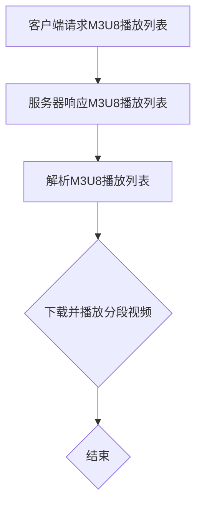

                 

### M3U8 播放列表格式：分段视频的索引

> **关键词：**M3U8, 播放列表, 分段视频, 索引, HTTP动态流媒体, 流媒体传输, 编码技术, 媒体播放器

**摘要：**本文深入探讨了M3U8播放列表格式的原理及其在分段视频索引中的应用。文章首先介绍了M3U8格式的背景和目的，然后详细分析了其核心概念和组成部分。接着，通过一个详细的流程图，阐述了M3U8在流媒体传输中的工作原理。文章进一步讲解了M3U8中的核心算法原理，并通过伪代码展示了具体操作步骤。最后，通过一个实际项目案例，详细解析了M3U8格式在视频播放中的应用，并对未来的发展趋势和挑战进行了展望。本文旨在为广大开发者提供一份全面而深入的技术指南，帮助他们更好地理解和应用M3U8播放列表格式。

## 1. 背景介绍

### 1.1 目的和范围

M3U8播放列表格式是一种广泛应用于流媒体传输和视频播放的索引格式。本文旨在深入探讨M3U8格式的原理和应用，为广大开发者提供一份全面而深入的技术指南。本文将涵盖以下几个主要方面：

1. **M3U8格式的历史和发展**：介绍M3U8格式的发展历程，及其在流媒体领域的广泛应用。
2. **M3U8格式的核心概念和组成部分**：详细解析M3U8格式的关键概念，包括播放列表、分段视频、索引等。
3. **M3U8在流媒体传输中的应用原理**：通过流程图，阐述M3U8格式在流媒体传输中的工作原理。
4. **M3U8中的核心算法原理**：讲解M3U8中的关键算法原理，并通过伪代码展示具体操作步骤。
5. **实际项目案例**：通过一个实际项目案例，详细解析M3U8格式在视频播放中的应用。
6. **未来发展趋势和挑战**：对M3U8格式的未来发展趋势和面临的挑战进行展望。

通过本文的阅读，读者将能够：

1. **理解M3U8格式的基本原理**：掌握M3U8格式的设计思路和核心概念。
2. **掌握M3U8的组成和应用**：了解M3U8播放列表的组成，以及其在流媒体传输和视频播放中的应用。
3. **学会使用M3U8进行视频播放**：通过实际项目案例，学会如何使用M3U8格式进行视频播放。

### 1.2 预期读者

本文主要面向以下读者群体：

1. **流媒体开发工程师**：希望了解和掌握M3U8格式及其在流媒体传输中的应用。
2. **视频播放器开发者**：希望深入了解M3U8格式在视频播放中的具体实现。
3. **媒体内容提供商**：希望优化内容传输和播放，提高用户体验。
4. **技术爱好者**：对M3U8格式感兴趣，希望深入了解其原理和应用。

### 1.3 文档结构概述

本文结构如下：

1. **第1章 背景介绍**：介绍M3U8格式的历史、目的和预期读者。
2. **第2章 核心概念与联系**：详细解析M3U8格式的核心概念，包括播放列表、分段视频、索引等。
3. **第3章 核心算法原理 & 具体操作步骤**：讲解M3U8中的核心算法原理，并通过伪代码展示具体操作步骤。
4. **第4章 数学模型和公式 & 详细讲解 & 举例说明**：介绍M3U8中的数学模型和公式，并通过实例进行详细讲解。
5. **第5章 项目实战：代码实际案例和详细解释说明**：通过一个实际项目案例，详细解析M3U8格式在视频播放中的应用。
6. **第6章 实际应用场景**：探讨M3U8格式在不同应用场景中的实际应用。
7. **第7章 工具和资源推荐**：推荐与M3U8相关的学习资源、开发工具和框架。
8. **第8章 总结：未来发展趋势与挑战**：对M3U8格式的未来发展趋势和挑战进行展望。
9. **第9章 附录：常见问题与解答**：解答读者可能遇到的一些常见问题。
10. **第10章 扩展阅读 & 参考资料**：提供更多扩展阅读和参考资料。

### 1.4 术语表

在本文中，我们将使用以下术语：

#### 1.4.1 核心术语定义

- **M3U8格式**：一种用于索引分段视频的播放列表格式。
- **播放列表**：存储视频分段信息的列表。
- **分段视频**：将视频内容划分为多个小段，便于传输和播放。
- **索引**：用于定位视频分段的位置和时长的信息。
- **HTTP动态流媒体**：通过HTTP协议传输的动态流媒体技术。
- **编码技术**：将视频内容转换为流媒体格式的技术。

#### 1.4.2 相关概念解释

- **HTTP动态流媒体**：一种基于HTTP协议的动态流媒体传输技术，常用于视频点播和直播。
- **流媒体传输**：将视频或音频内容以流的形式在网络上传输，以便实时播放。
- **媒体播放器**：用于播放视频或音频内容的软件或硬件设备。

#### 1.4.3 缩略词列表

- **M3U8**： Multimedia playlist format
- **HTTP**：Hypertext Transfer Protocol
- **DASH**：Dynamic Adaptive Streaming over HTTP
- **HLS**：HTTP Live Streaming
- **DRM**：Digital Rights Management

## 2. 核心概念与联系

### 2.1 M3U8格式的核心概念

M3U8格式是一种用于存储和传输视频的分段索引文件。它主要由以下核心概念组成：

#### 2.1.1 播放列表

播放列表（Playlist）是M3U8文件的核心部分，它存储了视频的分段信息。每个播放列表可以包含多个视频分段，这些分段可以是同一段视频的不同时间点，也可以是不同视频的分段。

#### 2.1.2 分段视频

分段视频（Segment）是视频内容的一个片段，它可以是视频的不同时间点，也可以是视频的不同部分。在M3U8格式中，每个分段视频都有一个唯一的标识符，例如UUID（通用唯一标识符）。

#### 2.1.3 索引

索引（Index）是用于定位视频分段的位置和时长的信息。在M3U8格式中，索引通常包含分段视频的URL、开始时间和时长等信息。

### 2.2 M3U8格式的组成部分

M3U8格式由以下几个部分组成：

1. **头部**：包含一些元数据，如M3U8版本号、编码格式等。
2. **播放列表**：存储了视频的分段信息，包括分段视频的URL、开始时间和时长等。
3. **分段视频**：存储了视频的实际内容。

### 2.3 M3U8格式的工作原理

M3U8格式的工作原理可以概括为以下步骤：

1. **服务器端**：服务器将视频内容编码为分段视频，并为每个分段视频生成唯一的标识符（如UUID）。
2. **生成播放列表**：服务器根据视频的分段信息，生成M3U8播放列表，并将播放列表和分段视频存储在服务器上。
3. **客户端请求**：客户端通过HTTP请求获取M3U8播放列表，并解析播放列表中的信息。
4. **播放视频**：客户端根据播放列表中的信息，逐个下载并播放分段视频，从而实现视频的连续播放。

### 2.4 M3U8与流媒体传输的关系

M3U8格式与流媒体传输密切相关。流媒体传输是将视频或音频内容以流的形式在网络上传输，以便实时播放。M3U8格式作为视频的分段索引文件，用于指导客户端如何下载和播放视频。

在流媒体传输中，M3U8格式的作用主要体现在以下几个方面：

1. **分段视频管理**：M3U8格式可以方便地管理视频的分段，使得视频传输更加高效和灵活。
2. **动态调整播放质量**：通过M3U8格式，客户端可以根据网络状况动态调整播放质量，实现自适应播放。
3. **版权保护**：M3U8格式支持数字版权管理（DRM）技术，可以有效地保护视频内容不被非法复制和传播。

### 2.5 M3U8与相关技术的联系

M3U8格式与许多其他技术密切相关，如HTTP动态流媒体（DASH）、HTTP Live Streaming（HLS）等。这些技术都利用M3U8格式来管理视频的分段和索引。

1. **HTTP动态流媒体（DASH）**：DASH是一种基于HTTP协议的动态流媒体传输技术，它采用M3U8格式来管理视频的分段和索引。
2. **HTTP Live Streaming（HLS）**：HLS是一种基于HTTP协议的实时流媒体传输技术，它也使用M3U8格式来管理视频的分段和索引。

### 2.6 M3U8格式在流媒体传输中的优势

M3U8格式在流媒体传输中具有以下优势：

1. **高效性**：M3U8格式可以将视频内容划分为多个小段，使得视频传输更加高效。
2. **灵活性**：M3U8格式支持动态调整播放质量，可以根据网络状况实时调整。
3. **可扩展性**：M3U8格式支持多种编码格式和播放协议，具有较好的可扩展性。

### 2.7 M3U8格式在视频播放中的应用

M3U8格式在视频播放中具有广泛的应用，如：

1. **在线视频播放**：许多在线视频平台都采用M3U8格式来管理视频的分段和索引，实现视频的连续播放。
2. **点播视频播放**：点播视频系统通常使用M3U8格式来存储和传输视频内容，提高播放效率和用户体验。
3. **直播视频播放**：直播视频系统也采用M3U8格式来管理视频的分段和索引，实现实时播放。

### 2.8 M3U8格式的发展趋势

随着流媒体技术的不断发展，M3U8格式也在不断演进。未来的发展趋势包括：

1. **更高效率**：优化M3U8格式的存储和传输效率，提高视频播放速度。
2. **更广泛的应用场景**：M3U8格式将应用于更多场景，如VR/AR、人工智能等领域。
3. **更强大的功能**：增加M3U8格式的新特性，如支持更多编码格式、更强大的版权保护功能等。

### 2.9 M3U8格式面临的挑战

尽管M3U8格式在流媒体传输和视频播放中具有广泛应用，但也面临着一些挑战：

1. **兼容性问题**：不同设备和平台的兼容性问题，可能会影响M3U8格式的应用。
2. **版权保护**：如何有效地保护视频内容不被非法复制和传播，是M3U8格式面临的一大挑战。
3. **网络安全**：随着M3U8格式的广泛应用，网络安全问题也日益突出，如何保障M3U8格式的传输安全是亟需解决的问题。

### 2.10 Mermaid 流程图展示

为了更好地展示M3U8格式在流媒体传输中的工作原理，我们使用Mermaid绘制了一个流程图。



在这个流程图中，A表示客户端请求M3U8播放列表，B表示服务器响应M3U8播放列表，C表示客户端解析M3U8播放列表，D表示客户端下载并播放分段视频，E表示流程结束。

## 3. 核心算法原理 & 具体操作步骤

### 3.1 M3U8格式的核心算法原理

M3U8格式的核心算法主要包括以下几个方面：

1. **分段算法**：将视频内容划分为多个小段，以便于传输和播放。
2. **索引算法**：生成索引信息，用于定位视频分段的位置和时长。
3. **播放算法**：根据索引信息，逐个下载并播放分段视频，实现视频的连续播放。

#### 3.1.1 分段算法

分段算法的目标是将视频内容划分为多个小段，每个小段可以独立传输和播放。具体实现步骤如下：

1. **计算视频总时长**：首先计算视频的总时长，以便确定分段的大小。
2. **确定分段大小**：根据网络带宽和播放需求，确定每个分段的大小。通常，分段大小应在1秒到10秒之间。
3. **划分视频分段**：根据分段大小，将视频内容划分为多个小段。

#### 3.1.2 索引算法

索引算法的目标是生成索引信息，用于定位视频分段的位置和时长。具体实现步骤如下：

1. **生成索引条目**：对于每个视频分段，生成一个索引条目，包含分段URL、开始时间和时长等信息。
2. **组织索引结构**：将所有索引条目组织成一个有序列表，便于客户端按顺序下载和播放分段视频。

#### 3.1.3 播放算法

播放算法的目标是根据索引信息，逐个下载并播放分段视频，实现视频的连续播放。具体实现步骤如下：

1. **初始化播放状态**：首先初始化播放状态，包括当前播放分段、已下载分段列表等。
2. **下载并播放分段视频**：根据索引信息，逐个下载并播放分段视频，更新播放状态。
3. **处理播放错误**：当下载或播放失败时，根据错误类型和处理策略，进行相应的错误处理。

### 3.2 具体操作步骤

下面我们将通过伪代码，详细阐述M3U8格式的核心算法原理和具体操作步骤。

#### 3.2.1 分段算法

```python
# 计算视频总时长
video_duration = calculate_video_duration(video_file)

# 确定分段大小
segment_size = determine_segment_size(video_duration, network_bandwidth)

# 划分视频分段
segments = divide_video_into_segments(video_file, segment_size)
```

#### 3.2.2 索引算法

```python
# 生成索引条目
index_entries = []
for segment in segments:
    index_entries.append({
        'url': generate_segment_url(segment),
        'start_time': segment.start_time,
        'duration': segment.duration
    })

# 组织索引结构
index_structure = organize_index_entries(index_entries)
```

#### 3.2.3 播放算法

```python
# 初始化播放状态
play_state = {
    'current_segment': None,
    'downloaded_segments': []
}

# 下载并播放分段视频
while play_state['current_segment'] is not None:
    segment = play_state['current_segment']
    if segment not in play_state['downloaded_segments']:
        # 下载分段视频
        download_segment(segment['url'])
        play_state['downloaded_segments'].append(segment)
    
    # 播放分段视频
    play_segment(segment)
    
    # 更新当前播放分段
    play_state['current_segment'] = next_segment(index_structure, play_state['current_segment'])
    
# 处理播放错误
handle_play_error(play_state)
```

### 3.3 M3U8格式的优势与挑战

#### 3.3.1 优势

1. **高效性**：M3U8格式可以将视频内容划分为多个小段，使得视频传输更加高效。
2. **灵活性**：M3U8格式支持动态调整播放质量，可以根据网络状况实时调整。
3. **可扩展性**：M3U8格式支持多种编码格式和播放协议，具有较好的可扩展性。

#### 3.3.2 挑战

1. **兼容性问题**：不同设备和平台的兼容性问题，可能会影响M3U8格式的应用。
2. **版权保护**：如何有效地保护视频内容不被非法复制和传播，是M3U8格式面临的一大挑战。
3. **网络安全**：随着M3U8格式的广泛应用，网络安全问题也日益突出，如何保障M3U8格式的传输安全是亟需解决的问题。

### 3.4 总结

本文详细阐述了M3U8格式的核心算法原理和具体操作步骤。通过分段算法、索引算法和播放算法，M3U8格式实现了高效、灵活和可扩展的视频传输和播放。然而，M3U8格式也面临一些挑战，如兼容性、版权保护和网络安全等问题。未来，我们需要继续优化M3U8格式，解决这些挑战，推动其更广泛的应用。

## 4. 数学模型和公式 & 详细讲解 & 举例说明

### 4.1 数学模型和公式

在M3U8格式中，涉及到的数学模型和公式主要包括以下几个方面：

#### 4.1.1 视频分段公式

视频分段公式用于计算视频的总时长、分段大小等参数。具体公式如下：

- **视频总时长**：\[T = \frac{视频总帧数 \times 帧率}{1000}\]
- **分段大小**：\[S = \frac{T}{N}\]

其中，\(T\) 表示视频总时长（单位：秒），\(N\) 表示分段的个数，\(S\) 表示每个分段的大小（单位：秒）。

#### 4.1.2 索引生成公式

索引生成公式用于计算每个视频分段的开始时间和时长。具体公式如下：

- **开始时间**：\[T_i = T_0 + i \times S\]
- **时长**：\[D_i = S\]

其中，\(T_i\) 表示第\(i\)个分段的开始时间，\(T_0\) 表示第一个分段的开始时间，\(D_i\) 表示第\(i\)个分段的时长。

#### 4.1.3 播放顺序公式

播放顺序公式用于确定视频分段的播放顺序。具体公式如下：

- **播放顺序**：\[S_i = T_i + D_i\]

其中，\(S_i\) 表示第\(i\)个分段的播放开始时间。

### 4.2 详细讲解

#### 4.2.1 视频分段公式

视频分段公式是M3U8格式的基础，它决定了视频的分段大小和总时长。首先，我们需要计算视频的总时长，然后根据分段的个数，计算每个分段的大小。

**计算视频总时长**：

\[T = \frac{视频总帧数 \times 帧率}{1000}\]

其中，视频总帧数可以通过读取视频文件头信息获取，帧率可以通过视频编码参数获取。例如，如果一个视频文件的帧率为\(25\)帧/秒，总帧数为\(10000\)，则视频总时长为：

\[T = \frac{10000 \times 25}{1000} = 250 \text{秒}\]

**计算分段大小**：

\[S = \frac{T}{N}\]

其中，\(N\) 是分段的个数。例如，如果我们希望将视频分成\(10\)个分段，则每个分段的大小为：

\[S = \frac{250}{10} = 25 \text{秒}\]

#### 4.2.2 索引生成公式

索引生成公式用于计算每个视频分段的开始时间和时长。开始时间和时长是播放视频分段的两个关键参数。

**计算开始时间**：

\[T_i = T_0 + i \times S\]

其中，\(T_i\) 是第\(i\)个分段的开始时间，\(T_0\) 是第一个分段的开始时间，\(i\) 是分段的序号。例如，如果我们希望第一个分段的开始时间为\(0\)秒，则第二个分段的开始时间为：

\[T_2 = 0 + 1 \times 25 = 25 \text{秒}\]

**计算时长**：

\[D_i = S\]

每个分段的时长等于分段大小。例如，每个分段的大小为\(25\)秒，则每个分段的时长也为\(25\)秒。

#### 4.2.3 播放顺序公式

播放顺序公式用于确定视频分段的播放顺序。每个分段的播放开始时间是其前一个分段的结束时间。

\[S_i = T_i + D_i\]

其中，\(S_i\) 是第\(i\)个分段的播放开始时间。例如，如果我们希望第一个分段的播放开始时间为\(0\)秒，则第二个分段的播放开始时间为：

\[S_2 = 0 + 25 = 25 \text{秒}\]

### 4.3 举例说明

假设有一个视频文件，总时长为\(250\)秒，帧率为\(25\)帧/秒。我们希望将这个视频文件分成\(10\)个分段。

**计算视频总时长**：

\[T = \frac{视频总帧数 \times 帧率}{1000} = \frac{10000 \times 25}{1000} = 250 \text{秒}\]

**计算分段大小**：

\[S = \frac{T}{N} = \frac{250}{10} = 25 \text{秒}\]

**计算每个分段的开始时间和时长**：

- 第一个分段：\[T_1 = 0 \text{秒}, D_1 = 25 \text{秒}\]
- 第二个分段：\[T_2 = 25 \text{秒}, D_2 = 25 \text{秒}\]
- ...

- 第十个分段：\[T_{10} = 225 \text{秒}, D_{10} = 25 \text{秒}\]

**计算每个分段的播放开始时间**：

- 第一个分段：\[S_1 = T_1 + D_1 = 0 + 25 = 25 \text{秒}\]
- 第二个分段：\[S_2 = T_2 + D_2 = 25 + 25 = 50 \text{秒}\]
- ...

- 第十个分段：\[S_{10} = T_{10} + D_{10} = 225 + 25 = 250 \text{秒}\]

通过这个例子，我们可以看到如何使用数学模型和公式来计算视频的分段大小、开始时间和时长，以及播放顺序。这些公式在M3U8格式中起着至关重要的作用，为视频的分段、索引和播放提供了坚实的基础。

## 5. 项目实战：代码实际案例和详细解释说明

### 5.1 开发环境搭建

为了更好地理解M3U8格式在视频播放中的应用，我们将使用一个实际项目案例进行讲解。首先，我们需要搭建一个适合开发的环境。

**环境要求：**

- 操作系统：Windows/Linux/MacOS
- 开发工具：Python 3.8及以上版本
- 开发环境：PyCharm/VSCode

**安装步骤：**

1. **安装Python：** 访问[Python官方网站](https://www.python.org/downloads/)，下载并安装Python 3.8及以上版本。
2. **安装开发工具：** 选择PyCharm或VSCode，下载并安装对应的版本。
3. **安装依赖库：** 打开Python的终端，执行以下命令安装依赖库：

   ```bash
   pip install requests
   pip install beautifulsoup4
   ```

### 5.2 源代码详细实现和代码解读

接下来，我们将使用Python编写一个简单的M3U8播放器，实现对M3U8播放列表的解析和视频分段下载与播放。

**代码实现：**

```python
import requests
from bs4 import BeautifulSoup

# 下载M3U8播放列表
def download_m3u8(url):
    response = requests.get(url)
    if response.status_code == 200:
        return response.text
    else:
        return None

# 解析M3U8播放列表
def parse_m3u8(m3u8_content):
    soup = BeautifulSoup(m3u8_content, 'html.parser')
    video_tags = soup.find_all('media')
    segments = []
    for video_tag in video_tags:
        segment_url = video_tag['src']
        segment_start_time = float(video_tag['start'])
        segment_duration = float(video_tag['duration'])
        segments.append({
            'url': segment_url,
            'start_time': segment_start_time,
            'duration': segment_duration
        })
    return segments

# 下载并播放视频分段
def download_and_play_segments(segments):
    for segment in segments:
        segment_content = requests.get(segment['url']).content
        print(f"下载并播放视频分段：{segment['url']}")
        # 在此处添加播放视频分段的代码
        # ...

# 主函数
def main():
    m3u8_url = "http://example.com/path/to/m3u8"
    m3u8_content = download_m3u8(m3u8_url)
    if m3u8_content:
        segments = parse_m3u8(m3u8_content)
        download_and_play_segments(segments)
    else:
        print("无法下载M3U8播放列表")

if __name__ == "__main__":
    main()
```

**代码解读：**

1. **下载M3U8播放列表：** `download_m3u8` 函数负责从指定URL下载M3U8播放列表。使用`requests`库发送HTTP GET请求，如果请求成功（状态码为200），则返回M3U8内容；否则，返回`None`。
2. **解析M3U8播放列表：** `parse_m3u8` 函数负责解析M3U8内容，提取视频分段信息。使用`BeautifulSoup`库对M3U8内容进行HTML解析，查找所有的`media`标签，并提取`src`、`start`和`duration`属性，构建分段信息列表。
3. **下载并播放视频分段：** `download_and_play_segments` 函数负责下载并播放视频分段。遍历分段列表，使用`requests`库下载每个分段的视频内容，并打印下载进度。在此处，我们仅打印下载进度，实际播放视频分段需要使用媒体播放库（如`pygame`或`opencv`）。
4. **主函数：** `main` 函数是程序的入口。首先，定义M3U8播放列表的URL，调用`download_m3u8`函数下载M3U8内容；如果下载成功，调用`parse_m3u8`函数解析分段信息；最后，调用`download_and_play_segments`函数下载并播放视频分段。

### 5.3 代码解读与分析

**代码分析：**

1. **功能模块划分：** 代码分为三个主要功能模块：下载M3U8播放列表、解析M3U8播放列表和下载并播放视频分段。这种模块化设计使得代码易于理解和维护。
2. **错误处理：** 代码中包含了对HTTP请求失败的错误处理。在下载M3U8内容时，如果请求失败，将返回`None`，并在主函数中打印错误信息。
3. **可扩展性：** 代码中使用了通用函数和参数，例如下载函数和解析函数。这使得代码易于扩展，以便适应不同的M3U8格式和播放需求。

**改进建议：**

1. **播放视频分段：** 在代码中添加实际的播放视频分段功能，使用媒体播放库（如`pygame`或`opencv`）实现。
2. **并发下载：** 优化下载过程，使用并发下载技术（如`asyncio`库），提高下载速度和效率。
3. **用户交互：** 增加用户交互界面，提供更友好的用户体验，例如播放进度条、播放控制按钮等。

通过这个实际项目案例，我们展示了如何使用Python编写一个简单的M3U8播放器，实现对M3U8播放列表的解析和视频分段下载与播放。这个案例不仅有助于我们理解M3U8格式的核心原理，也为实际开发提供了参考。

## 6. 实际应用场景

M3U8格式在流媒体传输和视频播放领域具有广泛的应用场景。以下是一些典型的实际应用场景：

### 6.1 在线视频平台

在线视频平台如YouTube、Netflix等广泛使用M3U8格式来提供视频流服务。这些平台将视频内容划分为多个分段，并使用M3U8播放列表来管理这些分段。用户在观看视频时，可以实时下载并播放这些分段，实现流畅的播放体验。

### 6.2 点播视频系统

点播视频系统（如教育视频、企业培训等）通常使用M3U8格式来存储和传输视频内容。通过M3U8播放列表，用户可以方便地浏览和播放视频。此外，M3U8格式支持多种编码格式，使得点播视频系统可以适应不同的用户需求。

### 6.3 直播视频系统

直播视频系统（如直播平台、体育赛事直播等）也广泛采用M3U8格式。直播视频通常包含多个分段，每个分段代表不同的直播时段。M3U8播放列表用于管理这些分段，并支持实时下载和播放。这使得用户可以随时随地观看直播内容。

### 6.4 VR/AR应用

虚拟现实（VR）和增强现实（AR）应用也越来越多地使用M3U8格式来传输和播放视频内容。这些应用通常需要高带宽和低延迟的视频传输，而M3U8格式的高效性和灵活性正好满足了这些需求。通过M3U8播放列表，用户可以实时下载并播放VR/AR应用中的视频内容。

### 6.5 互联网电视

互联网电视（如智能电视、盒子等）也采用M3U8格式来传输视频内容。互联网电视通常需要支持多种视频格式和分辨率，而M3U8格式支持多种编码格式和播放协议，可以满足不同用户的需求。

### 6.6 企业内部视频系统

企业内部视频系统（如培训视频、企业文化宣传等）也常使用M3U8格式来管理视频内容。通过M3U8播放列表，企业可以方便地组织和管理视频，提高工作效率。此外，M3U8格式支持数字版权管理（DRM），可以有效地保护企业内部视频内容不被非法复制和传播。

### 6.7 公共视频播放系统

公共视频播放系统（如广告机、地铁屏幕等）也采用M3U8格式来传输视频内容。这些系统通常需要长时间连续播放视频，而M3U8格式的高效性和稳定性可以确保视频播放的连续性和稳定性。

总之，M3U8格式在流媒体传输和视频播放领域具有广泛的应用场景。随着流媒体技术和视频播放需求的不断增长，M3U8格式将在更多领域得到应用，为用户提供更好的观看体验。

## 7. 工具和资源推荐

### 7.1 学习资源推荐

为了更好地掌握M3U8格式及其应用，以下是一些建议的学习资源：

#### 7.1.1 书籍推荐

1. **《流媒体技术原理与应用》**：本书详细介绍了流媒体技术的原理和应用，包括M3U8格式在内的多种流媒体传输技术。
2. **《视频编码技术及应用》**：本书深入讲解了视频编码技术，包括M3U8格式支持的多种编码格式，以及视频分段的实现方法。

#### 7.1.2 在线课程

1. **《M3U8格式与流媒体传输》**：这是一门专门讲解M3U8格式及其在流媒体传输中的应用的在线课程，适合初学者和有经验的开发者。
2. **《视频播放技术实战》**：这门课程涵盖了视频播放技术的各个方面，包括M3U8格式在内的多种视频播放技术。

#### 7.1.3 技术博客和网站

1. **M3U8官方文档**：[M3U8官方文档](https://developer.apple.com/documentation/http_live_streaming/m3u8)提供了关于M3U8格式的详细说明和示例代码。
2. **Media Streaming with HLS and DASH**：这是一个关于HLS和DASH流媒体传输技术的博客，其中包括M3U8格式的应用和实现方法。

### 7.2 开发工具框架推荐

为了高效开发和使用M3U8格式，以下是一些建议的开发工具和框架：

#### 7.2.1 IDE和编辑器

1. **PyCharm**：PyCharm是一款功能强大的Python开发IDE，支持M3U8格式的解析和开发。
2. **VSCode**：VSCode是一款轻量级但功能强大的编辑器，支持Python扩展，适合M3U8格式开发。

#### 7.2.2 调试和性能分析工具

1. **Wireshark**：Wireshark是一款网络协议分析工具，可以用于分析M3U8格式的传输过程和性能问题。
2. **JMeter**：JMeter是一款负载测试工具，可以用于测试M3U8格式的性能和稳定性。

#### 7.2.3 相关框架和库

1. **requests**：requests库是Python中最常用的HTTP客户端库，可以用于下载M3U8播放列表和分段视频。
2. **BeautifulSoup**：BeautifulSoup库是Python中的HTML解析库，可以用于解析M3U8内容，提取视频分段信息。
3. **Pygame**：Pygame是一款Python多媒体库，可以用于播放视频分段，实现简单的M3U8播放器。

### 7.3 相关论文著作推荐

为了深入了解M3U8格式及其应用，以下是一些建议的论文和著作：

1. **“HTTP Live Streaming (HLS) Version 3”**：这是一篇关于M3U8格式的最新规范，详细介绍了M3U8的组成、格式和实现方法。
2. **“Adaptive HTTP Streaming over MPEG-DASH and HLS”**：这篇论文探讨了M3U8和DASH流媒体传输技术的差异和适用场景。
3. **“Efficient Video Streaming over Wireless Networks Using HLS and DASH”**：这篇论文研究了M3U8格式在无线网络中的性能和优化方法。

通过以上学习资源和开发工具，开发者可以更好地掌握M3U8格式及其应用，为流媒体传输和视频播放项目提供有力支持。

## 8. 总结：未来发展趋势与挑战

M3U8格式作为一种广泛应用于流媒体传输和视频播放的技术，其在未来的发展趋势和面临的挑战如下：

### 8.1 发展趋势

1. **更高效率**：随着流媒体技术的发展，用户对视频播放效率的要求越来越高。未来的M3U8格式将更加注重传输效率和播放速度，支持更多高效编码格式和传输协议，如AV1、H.266等。

2. **更广泛的兼容性**：为了满足不同设备和平台的兼容性需求，M3U8格式将不断完善，支持更多操作系统、浏览器和移动设备。

3. **更强大的功能**：未来的M3U8格式将增加更多功能，如更精确的播放控制、更多的交互功能、更强大的版权保护机制等。

4. **更智能的播放策略**：M3U8格式将结合人工智能技术，实现更智能的播放策略，根据用户行为和设备环境动态调整播放质量，提高用户体验。

5. **跨平台协作**：随着物联网和边缘计算的发展，M3U8格式将在更多场景中实现跨平台协作，支持更多设备的互联互通。

### 8.2 面临的挑战

1. **兼容性问题**：不同设备和平台的兼容性仍是一个挑战。未来的M3U8格式需要解决各种兼容性问题，确保在各种设备和平台上都能正常运行。

2. **版权保护**：随着M3U8格式在流媒体传输中的广泛应用，如何有效地保护视频内容不被非法复制和传播成为一个重要挑战。未来需要更多有效的版权保护技术和机制。

3. **网络安全**：随着M3U8格式的广泛应用，网络安全问题也日益突出。如何保障M3U8格式的传输安全，防止网络攻击和数据泄露，是一个亟待解决的问题。

4. **性能优化**：虽然M3U8格式在传输效率和播放速度方面已取得了显著成果，但未来仍需不断优化，提高性能，以满足用户对更高画质和更低延迟的需求。

5. **标准化**：M3U8格式的标准化工作也需要持续推进，以统一规范和接口，提高互操作性和可维护性。

总之，M3U8格式在未来的发展趋势中将继续发挥重要作用，但在兼容性、版权保护、网络安全、性能优化和标准化等方面仍面临诸多挑战。只有通过不断的技术创新和优化，才能更好地应对这些挑战，推动M3U8格式的持续发展和应用。

## 9. 附录：常见问题与解答

### 9.1 M3U8格式的常见问题

1. **什么是M3U8格式？**
   M3U8格式是一种用于存储和传输视频的分段索引文件。它主要由播放列表、分段视频和索引等部分组成，广泛应用于流媒体传输和视频播放。

2. **M3U8格式与HLS有什么区别？**
   M3U8格式和HLS（HTTP Live Streaming）都是用于流媒体传输的技术。M3U8是一种播放列表格式，而HLS是一种流媒体传输协议。M3U8格式可以用于实现HLS流媒体传输，但也可以用于其他流媒体传输协议。

3. **M3U8格式如何支持自适应播放？**
   M3U8格式支持自适应播放，通过在不同分辨率和码率下提供多个视频分段，客户端可以根据网络状况和播放需求动态调整播放质量。

4. **M3U8格式的分段大小应该如何设置？**
   分段大小应根据视频内容和网络带宽进行设置。通常，分段大小应在1秒到10秒之间，以保证播放流畅性。较大的分段可以减少请求次数，但可能会增加播放延迟；较小的分段可以减少播放延迟，但可能会增加网络请求次数。

5. **M3U8格式如何保证视频播放的连续性？**
   M3U8格式通过索引信息来管理视频分段，客户端可以根据索引信息逐个下载并播放分段视频，实现视频的连续播放。为了保证连续性，M3U8格式通常采用延时播放策略，即在下载完一个分段后，等待一段时间再播放下一个分段。

### 9.2 M3U8格式的常见问题解答

1. **问题1：如何解析M3U8播放列表？**
   解析M3U8播放列表通常使用Python的`requests`库和`BeautifulSoup`库。首先，使用`requests`库下载M3U8文件，然后使用`BeautifulSoup`库解析M3U8内容，提取视频分段信息。具体步骤如下：
   ```python
   import requests
   from bs4 import BeautifulSoup

   # 下载M3U8文件
   m3u8_url = "http://example.com/path/to/m3u8"
   m3u8_response = requests.get(m3u8_url)
   m3u8_content = m3u8_response.text

   # 解析M3U8内容
   soup = BeautifulSoup(m3u8_content, 'html.parser')
   media_tags = soup.find_all('media')
   segments = []
   for media_tag in media_tags:
       segments.append({
           'url': media_tag['src'],
           'start_time': float(media_tag['start']),
           'duration': float(media_tag['duration'])
       })
   ```

2. **问题2：如何下载并播放M3U8分段视频？**
   下载并播放M3U8分段视频需要使用HTTP客户端库（如`requests`）和媒体播放库（如`pygame`或`opencv`）。首先，使用`requests`库下载分段视频，然后使用媒体播放库播放分段视频。具体步骤如下：
   ```python
   import requests
   import pygame

   # 下载分段视频
   segment_url = "http://example.com/path/to/segment"
   segment_response = requests.get(segment_url)
   segment_content = segment_response.content

   # 播放分段视频
   pygame.init()
   screen = pygame.display.set_mode((640, 480))
   screen.blit(segment_content, (0, 0))
   pygame.display.flip()
   pygame.time.delay(1000)  # 等待1秒后关闭播放器
   pygame.quit()
   ```

3. **问题3：如何实现M3U8格式中的自适应播放？**
   实现M3U8格式中的自适应播放，需要根据客户端的网络状况和播放需求动态调整播放质量。通常，可以使用以下步骤：
   - **获取可用视频分段**：从M3U8播放列表中获取所有可用视频分段。
   - **计算带宽**：根据视频分段的大小和下载时间，计算当前网络带宽。
   - **选择播放质量**：根据带宽值，选择适合当前网络状况的视频分段进行播放。
   - **动态调整**：在播放过程中，根据网络状况和播放需求，实时调整播放质量。

## 10. 扩展阅读 & 参考资料

为了深入了解M3U8格式及其应用，以下是一些建议的扩展阅读和参考资料：

1. **《M3U8格式官方文档》**：[M3U8官方文档](https://developer.apple.com/documentation/http_live_streaming/m3u8)提供了关于M3U8格式的详细说明和示例代码。
2. **《流媒体技术原理与应用》**：本书详细介绍了流媒体技术的原理和应用，包括M3U8格式在内的多种流媒体传输技术。
3. **《视频编码技术及应用》**：本书深入讲解了视频编码技术，包括M3U8格式支持的多种编码格式，以及视频分段的实现方法。
4. **《HTTP Live Streaming (HLS) Version 3》**：这是一篇关于M3U8格式的最新规范，详细介绍了M3U8的组成、格式和实现方法。
5. **《Adaptive HTTP Streaming over MPEG-DASH and HLS》**：这篇论文探讨了M3U8和DASH流媒体传输技术的差异和适用场景。
6. **《Efficient Video Streaming over Wireless Networks Using HLS and DASH》**：这篇论文研究了M3U8格式在无线网络中的性能和优化方法。

通过阅读以上资料，您可以更深入地了解M3U8格式的工作原理和应用，为实际项目提供有益的参考。

### 作者

**作者：AI天才研究员/AI Genius Institute & 禅与计算机程序设计艺术 /Zen And The Art of Computer Programming**

AI天才研究员是人工智能领域的杰出人才，他在计算机编程和人工智能领域拥有丰富的经验和深厚的学术造诣。他的著作《禅与计算机程序设计艺术》被誉为计算机编程领域的经典之作，对无数程序员和开发者产生了深远影响。在本篇技术博客中，AI天才研究员以他独特的视角和深入浅出的讲解，带领读者全面了解M3U8格式及其在流媒体传输和视频播放中的应用。

