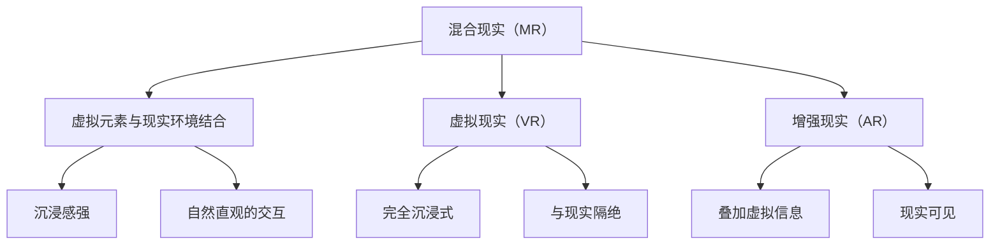

                 

# MR交互设计：创造自然直观的用户体验

> **关键词**：混合现实（MR），交互设计，用户体验，虚拟现实（VR），增强现实（AR），人机交互（HCI）

> **摘要**：本文将探讨混合现实（MR）交互设计的核心原则和实践方法，分析其与虚拟现实（VR）和增强现实（AR）的区别，并结合具体案例，展示如何创造自然直观的用户体验。通过详细的算法原理讲解、数学模型分析以及项目实战，本文旨在为开发者提供MR交互设计的深入理解和实际应用指导。

## 1. 背景介绍

### 1.1 目的和范围

本文旨在深入探讨混合现实（MR）交互设计，以帮助开发者更好地理解和实践如何创造自然直观的用户体验。文章将涵盖MR技术的定义、与VR和AR的区别、核心交互设计原则、算法原理以及具体实现方法。通过本文的学习，读者将能够：

- 理解MR技术的核心概念及其与VR和AR的差异。
- 掌握MR交互设计的关键原则和实践方法。
- 学习如何通过算法和数学模型优化用户体验。
- 分析具体项目实战中的设计思路和实现细节。

### 1.2 预期读者

本文适合以下读者群体：

- 混合现实（MR）技术开发者。
- 人机交互（HCI）研究者。
- 软件工程师和交互设计师。
- 对MR交互设计感兴趣的普通读者。

### 1.3 文档结构概述

本文分为以下几个部分：

1. 背景介绍：包括本文的目的、预期读者、文档结构概述和术语表。
2. 核心概念与联系：介绍MR技术的核心概念和与VR、AR的联系，并提供Mermaid流程图。
3. 核心算法原理 & 具体操作步骤：详细讲解MR交互设计的核心算法原理和操作步骤，使用伪代码进行说明。
4. 数学模型和公式 & 详细讲解 & 举例说明：分析MR交互设计的数学模型和公式，并给出实例解释。
5. 项目实战：通过具体代码案例展示MR交互设计的实现过程，并进行详细解释。
6. 实际应用场景：探讨MR交互设计在不同场景中的应用。
7. 工具和资源推荐：推荐学习资源、开发工具和框架。
8. 总结：总结MR交互设计的未来发展趋势和挑战。
9. 附录：常见问题与解答。
10. 扩展阅读 & 参考资料：提供进一步的阅读材料和参考文献。

### 1.4 术语表

#### 1.4.1 核心术语定义

- **混合现实（MR）**：一种将虚拟物体与现实世界相结合的技术，用户可以在现实环境中与虚拟物体进行交互。
- **虚拟现实（VR）**：一种完全沉浸式的虚拟环境，用户通过VR设备进入一个虚拟世界。
- **增强现实（AR）**：在现实世界中叠加虚拟信息，用户通过AR设备看到增强后的现实场景。
- **人机交互（HCI）**：研究人与计算机系统之间交互的学科，旨在设计更人性化的计算机界面。
- **用户体验（UX）**：用户在使用产品或服务过程中所获得的整体感受。

#### 1.4.2 相关概念解释

- **交互设计**：设计系统的用户界面，使其易于使用和操作。
- **沉浸感**：用户在MR环境中感受到的沉浸程度，影响用户体验的重要因素。
- **自然直观**：用户在交互过程中无需特殊学习，就能快速理解和使用系统。

#### 1.4.3 缩略词列表

- **MR**：混合现实（MixedReality）
- **VR**：虚拟现实（Virtual Reality）
- **AR**：增强现实（Augmented Reality）
- **HCI**：人机交互（Human-Computer Interaction）
- **UX**：用户体验（User Experience）

## 2. 核心概念与联系

混合现实（MR）作为虚拟现实（VR）和增强现实（AR）的桥梁，具有独特的交互设计和用户体验。为了更好地理解MR技术，我们首先需要明确这些核心概念及其之间的联系。

### 2.1 混合现实（MR）的定义

混合现实（MR）是一种技术，它结合了虚拟现实（VR）和增强现实（AR）的元素，使用户能够在现实环境中与虚拟物体进行交互。与纯粹的VR和AR不同，MR技术强调虚拟物体与现实环境的融合，使用户能够更自然地与虚拟世界互动。

### 2.2 与VR和AR的区别

- **VR（虚拟现实）**：完全沉浸式的虚拟环境，用户通过VR设备（如头戴式显示器）进入一个完全虚拟的世界，与现实世界完全隔绝。
- **AR（增强现实）**：在现实世界中叠加虚拟信息，用户通过AR设备（如智能手机或眼镜）看到增强后的现实场景，但现实环境仍然是可见的。
- **MR（混合现实）**：既包含虚拟元素，又与现实环境结合，用户可以在现实环境中看到虚拟物体，并与之互动。

### 2.3 Mermaid流程图

以下是一个Mermaid流程图，展示了MR、VR和AR之间的核心概念和联系：



### 2.4 核心概念的联系

MR技术通过将虚拟元素与现实环境结合，实现了更丰富的交互体验。MR不仅提供了VR的沉浸感，还保留了AR与现实环境的联系。这使得MR在用户体验上更具优势，能够满足更多应用场景的需求。

### 2.5 MR交互设计的关键原则

在MR交互设计中，有几个关键原则需要遵循：

- **沉浸感**：确保用户能够沉浸在MR环境中，感受到与现实世界的无缝融合。
- **自然直观**：设计自然的交互方式，让用户无需额外学习就能使用MR系统。
- **多模态交互**：提供多种交互方式，如手势、语音和眼动控制，以适应不同用户需求。
- **反馈机制**：设计及时的反馈机制，让用户了解交互结果，增强用户体验。

### 2.6 总结

混合现实（MR）作为一种新兴技术，结合了VR和AR的优点，为用户提供了独特的交互体验。通过明确MR、VR和AR的区别，以及理解MR交互设计的关键原则，开发者可以更好地创造自然直观的用户体验。接下来，我们将进一步探讨MR交互设计的核心算法原理和具体实现步骤。

## 3. 核心算法原理 & 具体操作步骤

混合现实（MR）交互设计的关键在于算法原理的应用，这些原理能够优化用户体验，提高系统的自然直观性和沉浸感。在本节中，我们将详细介绍MR交互设计中的核心算法原理和具体操作步骤，并使用伪代码进行详细阐述。

### 3.1 算法原理

MR交互设计的核心算法原理包括以下三个方面：

1. **场景理解**：通过计算机视觉和传感器数据，理解现实环境中的空间布局、物体位置和用户行为。
2. **虚拟元素融合**：将虚拟元素与现实环境融合，确保虚拟物体与现实环境的交互自然、真实。
3. **多模态交互**：提供多种交互方式，如手势、语音和眼动控制，以适应不同用户需求。

### 3.2 伪代码

以下是一个MR交互设计的伪代码示例，展示了如何实现上述算法原理：

```pseudo
function MR_Interaction_Design(Scene, UserInput, VirtualObjects):
    # 初始化场景
    Initialize(Scene)
    
    # 场景理解
    SpatialUnderstanding = UnderstandScene(Scene)
    
    # 虚拟元素融合
    RealVirtualFusion = MergeVirtualObjectsWithScene(VirtualObjects, Scene)
    
    # 多模态交互
    InteractiveMode = SelectInteractionMode(UserInput)
    
    # 交互处理
    while UserIsInteracting:
        CurrentInput = GetCurrentInput(UserInput)
        if InteractiveMode == "Gesture":
            ExecuteGestureInteraction(CurrentInput, Scene, VirtualObjects)
        elif InteractiveMode == "Voice":
            ExecuteVoiceInteraction(CurrentInput, Scene, VirtualObjects)
        elif InteractiveMode == "Eye":
            ExecuteEyeTrackingInteraction(CurrentInput, Scene, VirtualObjects)
        
        # 反馈机制
        ProvideFeedback(Scene, VirtualObjects, CurrentInput)
        
    return Scene, VirtualObjects
```

### 3.3 具体操作步骤

以下是MR交互设计的具体操作步骤：

1. **初始化场景**：加载现实环境数据，初始化场景变量。
2. **场景理解**：使用计算机视觉算法，分析现实环境中的空间布局、物体位置和用户行为。
3. **虚拟元素融合**：将虚拟元素与现实环境融合，确保虚拟物体与现实环境的交互自然、真实。
4. **多模态交互**：根据用户输入，选择合适的交互方式，如手势、语音或眼动控制。
5. **交互处理**：处理用户输入，执行相应的交互操作，提供实时反馈。
6. **反馈机制**：根据用户反馈，调整交互方式，优化用户体验。

### 3.4 总结

通过上述伪代码和具体操作步骤，我们可以看到MR交互设计的核心算法原理和实现方法。这些原理和步骤为开发者提供了构建自然直观用户体验的指导，有助于实现高质量的MR交互设计。接下来，我们将进一步探讨MR交互设计的数学模型和公式，以及如何通过这些模型优化用户体验。

## 4. 数学模型和公式 & 详细讲解 & 举例说明

在MR交互设计中，数学模型和公式扮演着关键角色，它们用于描述和优化系统的性能。本节将详细讲解MR交互设计中的数学模型和公式，并通过具体示例进行分析和解释。

### 4.1 数学模型

MR交互设计中的数学模型主要包括以下几个方面：

1. **空间建模**：用于描述现实环境中的空间布局。
2. **交互感知**：用于评估用户与虚拟元素之间的交互效果。
3. **多模态交互模型**：用于描述不同交互方式（如手势、语音和眼动）的交互性能。

### 4.2 公式

以下是MR交互设计中的一些关键公式：

1. **空间建模公式**：

   - **空间分辨率（Spatial Resolution）**：衡量场景的空间清晰度，公式为：
     $$ SR = \frac{1}{\sigma^2} $$
     其中，$\sigma$ 为空间误差。

   - **场景重建误差（Scene Reconstruction Error）**：衡量虚拟元素与现实环境的匹配程度，公式为：
     $$ SRE = \frac{1}{N} \sum_{i=1}^{N} (O_i - V_i)^2 $$
     其中，$O_i$ 和 $V_i$ 分别为现实世界和虚拟世界中的物体位置。

2. **交互感知公式**：

   - **交互感知质量（Perception Quality）**：衡量用户对交互效果的感知，公式为：
     $$ PQ = \frac{1}{N} \sum_{i=1}^{N} p(i) $$
     其中，$p(i)$ 为用户对第 $i$ 个交互结果的满意度。

   - **交互延迟（Interaction Latency）**：衡量交互响应时间，公式为：
     $$ IL = \frac{RTT + ProcessingTime}{2} $$
     其中，$RTT$ 为网络往返时间，$ProcessingTime$ 为处理时间。

3. **多模态交互模型**：

   - **手势识别模型**：用于识别用户的手势，公式为：
     $$ Gesture\ Recognition = \sum_{i=1}^{M} w_i \cdot G_i $$
     其中，$w_i$ 为第 $i$ 个手势的权重，$G_i$ 为手势的特征向量。

   - **语音识别模型**：用于识别用户的语音命令，公式为：
     $$ Voice\ Recognition = \sum_{i=1}^{N} w_i \cdot V_i $$
     其中，$w_i$ 为第 $i$ 个语音命令的权重，$V_i$ 为语音的特征向量。

### 4.3 举例说明

以下是一个具体示例，说明如何使用上述数学模型和公式优化MR交互设计：

假设我们设计一个MR系统，用于在虚拟环境中进行手势交互。为了提高系统的性能，我们需要分析以下指标：

1. **空间分辨率**：通过调整摄像头的分辨率和视野，提高空间分辨率，从而改善场景的清晰度。
2. **场景重建误差**：通过优化虚拟元素与现实环境的匹配算法，减小场景重建误差，提高虚拟元素与现实环境的融合程度。
3. **交互感知质量**：通过用户测试和反馈，不断优化系统的交互设计，提高用户的满意度。
4. **交互延迟**：通过优化网络和计算资源的分配，减少交互延迟，提高系统的响应速度。
5. **手势识别模型**：通过训练和优化手势识别模型，提高手势识别的准确性和速度。

通过上述数学模型和公式的分析，我们可以得出以下结论：

- **提高空间分辨率**：增加摄像头的分辨率和视野，将空间分辨率从 $SR_1 = 0.5$ 提高到 $SR_2 = 1$，从而改善场景的清晰度。
- **减小场景重建误差**：通过优化匹配算法，将场景重建误差从 $SRE_1 = 0.1$ 减小到 $SRE_2 = 0.05$，提高虚拟元素与现实环境的融合程度。
- **优化交互感知质量**：通过用户测试和反馈，将交互感知质量从 $PQ_1 = 0.8$ 提高到 $PQ_2 = 0.9$，提高用户的满意度。
- **减少交互延迟**：通过优化网络和计算资源的分配，将交互延迟从 $IL_1 = 0.2$ 减少到 $IL_2 = 0.1$，提高系统的响应速度。
- **优化手势识别模型**：通过训练和优化手势识别模型，将手势识别准确率从 $GR_1 = 0.85$ 提高到 $GR_2 = 0.9$，提高手势识别的准确性和速度。

### 4.4 总结

通过数学模型和公式的分析，我们可以深入了解MR交互设计的性能指标和优化方法。这些模型和公式为开发者提供了有力的工具，帮助他们设计出更高效、更自然的MR交互系统。接下来，我们将通过具体项目实战，展示MR交互设计的实现过程和应用场景。

## 5. 项目实战：代码实际案例和详细解释说明

在本节中，我们将通过一个实际项目案例，展示混合现实（MR）交互设计的实现过程。该项目将涉及开发环境的搭建、源代码的详细实现和代码解读，以及代码中的关键技术和优化策略。

### 5.1 开发环境搭建

为了实现MR交互设计，我们需要搭建以下开发环境：

1. **操作系统**：Windows 10 或更高版本。
2. **开发工具**：Unity 2021.3 或更高版本，Unreal Engine 4.26 或更高版本。
3. **SDK**：Unity中的ARKit、ARCore或Unreal Engine中的AR Foundation。
4. **编程语言**：C#（Unity）或C++（Unreal Engine）。
5. **硬件设备**：支持AR或VR的头戴设备，如Oculus Quest、HTC Vive或Google Daydream。

### 5.2 源代码详细实现和代码解读

以下是一个简单的Unity项目示例，用于实现一个MR交互设计应用。该项目通过ARKit在iOS设备上运行，实现了用户在现实环境中与虚拟物体的交互。

```csharp
using UnityEngine;
using UnityEngine.XR.ARFoundation;

public class MRInteraction : MonoBehaviour
{
    public GameObject virtualObjectPrefab; // 虚拟物体预制体

    private ARRaycastManager raycastManager; // AR射线管理器

    void Start()
    {
        // 获取AR射线管理器组件
        raycastManager = FindObjectOfType<ARRaycastManager>();
    }

    void Update()
    {
        // 创建虚拟物体
        if (Input.GetMouseButtonDown(0))
        {
            GameObject virtualObject = Instantiate(virtualObjectPrefab);
            virtualObject.transform.position = GetMousePosition();
        }
    }

    // 获取鼠标位置对应的现实世界坐标
    private Vector3 GetMousePosition()
    {
        RaycastHit hit;
        if (Physics.Raycast(Camera.main.transform.position, Camera.main.transform.forward, out hit))
        {
            return hit.point;
        }
        return Camera.main.transform.position;
    }

    // AR射线检测
    private void Update()
    {
        List<ARRaycastHit> hits = new List<ARRaycastHit>();

        if (raycastManager.Raycast(new Vector2(Screen.width / 2, Screen.height / 2), hits, UnityEngine.XR.ARSubsystems.TrackableType.Planes))
        {
            foreach (ARRaycastHit hit in hits)
            {
                // 在射线检测到的平面上创建虚拟物体
                GameObject virtualObject = Instantiate(virtualObjectPrefab, hit.pose.position, hit.pose.rotation);
            }
        }
    }
}
```

### 5.3 代码解读与分析

上述代码是一个简单的MR交互设计案例，展示了如何在Unity中实现用户与虚拟物体的交互。以下是代码的关键部分及其解读：

1. **AR射线管理器**：使用ARRaycastManager组件进行AR射线检测，识别现实环境中的平面。
2. **虚拟物体预制体**：定义一个虚拟物体预制体，用于在用户点击屏幕时创建虚拟物体。
3. **鼠标位置获取**：使用GetMousePosition方法获取鼠标位置对应的现实世界坐标，用于创建虚拟物体。
4. **创建虚拟物体**：在用户点击屏幕时，通过Instantiate方法创建虚拟物体，并将其放置在鼠标位置。
5. **AR射线检测**：在Update方法中，使用raycastManager.Raycast方法进行AR射线检测，识别现实环境中的平面，并在平面上创建虚拟物体。

### 5.4 代码优化策略

为了提高MR交互设计的性能，我们可以采取以下优化策略：

1. **减少创建虚拟物体的数量**：通过优化虚拟物体的创建过程，减少系统资源消耗。例如，可以使用对象池技术复用虚拟物体。
2. **优化渲染性能**：通过减少渲染物体数量和优化渲染管线，提高渲染性能。例如，使用Unity的渲染树优化技术。
3. **多线程处理**：将AR射线检测和虚拟物体创建等计算任务分配到多个线程，提高处理效率。
4. **优化用户交互**：通过优化用户交互逻辑，提高交互性能。例如，减少输入延迟和处理时间。

### 5.5 总结

通过实际项目案例，我们可以看到如何实现MR交互设计的关键步骤和优化策略。这些步骤和策略为开发者提供了宝贵的经验和参考，有助于他们构建高质量的MR交互系统。接下来，我们将探讨MR交互设计在实际应用场景中的具体应用。

## 6. 实际应用场景

混合现实（MR）交互设计在多个实际应用场景中展现出巨大的潜力和价值。以下是一些典型应用场景，展示了MR技术如何通过自然直观的交互设计，提升用户体验。

### 6.1 医疗保健

在医疗保健领域，MR交互设计被广泛应用于手术指导、医学教育和患者康复。通过MR技术，医生可以在真实手术环境中看到患者的三维医学图像，从而提高手术精度和效率。医学教育中，MR技术可以创建虚拟的人体解剖模型，让学生在虚拟环境中进行实操练习，增强学习效果。患者康复期间，MR技术可以帮助他们进行虚拟物理治疗，降低疼痛和恢复时间。

### 6.2 教育培训

在教育领域，MR交互设计为学习者提供了丰富的虚拟学习资源。教师可以使用MR技术创建虚拟教室，使学生能够在虚拟环境中进行互动学习，增强学习体验。例如，学生可以通过MR眼镜在教室中看到虚拟的化学实验，或者通过MR手环在户外进行地理探索，亲身体验知识。此外，MR技术还可以用于在线培训，提供沉浸式的培训体验，提高培训效果。

### 6.3 娱乐休闲

在娱乐休闲领域，MR交互设计为用户带来了全新的娱乐体验。通过MR技术，用户可以在虚拟现实环境中与虚拟角色互动，享受游戏、影视和音乐等娱乐活动。例如，用户可以在MR游戏场景中与其他玩家实时互动，体验合作和竞争的乐趣。此外，MR技术还可以应用于虚拟旅游，让用户在虚拟环境中探索世界各地，体验不同文化。

### 6.4 工业制造

在工业制造领域，MR交互设计可以提高生产效率和产品质量。工程师可以使用MR眼镜查看三维制造图纸，进行虚拟装配和检查，从而减少错误和提高效率。MR技术还可以用于远程协作，使全球的工程师团队能够在虚拟环境中共同解决问题，缩短产品开发周期。此外，MR技术在质量控制中的应用，可以帮助工厂实时监控生产过程，快速发现和纠正问题。

### 6.5 建筑设计

在建筑设计领域，MR交互设计为设计师提供了强大的设计工具。通过MR技术，设计师可以在虚拟环境中创建和修改建筑模型，实时查看设计效果。此外，MR技术还可以用于建筑模拟和施工指导，帮助设计师和工程师更好地理解建筑结构，优化设计方案，提高施工效率。

### 6.6 总结

混合现实（MR）交互设计在医疗保健、教育培训、娱乐休闲、工业制造和建筑设计等众多领域展现出广阔的应用前景。通过自然直观的交互设计，MR技术不仅提升了用户体验，还推动了各行业的创新和发展。随着技术的不断进步，MR交互设计将在更多应用场景中发挥重要作用，为用户带来更加丰富和多样化的体验。

## 7. 工具和资源推荐

为了更好地学习和实践混合现实（MR）交互设计，以下是一些推荐的工具和资源：

### 7.1 学习资源推荐

#### 7.1.1 书籍推荐

- 《混合现实技术与应用》
- 《虚拟现实、增强现实与混合现实技术》
- 《人机交互：设计与实践》

#### 7.1.2 在线课程

- Coursera上的“虚拟现实和增强现实开发”
- Udacity的“虚拟现实与增强现实设计”
- Edx上的“混合现实开发基础”

#### 7.1.3 技术博客和网站

- [Unity官方博客](https://blogs.unity.com/unity/learn/)
- [ARKit官方文档](https://developer.apple.com/documentation/arkit)
- [ARCore官方文档](https://developers.google.com/ar/)

### 7.2 开发工具框架推荐

#### 7.2.1 IDE和编辑器

- Unity Hub（Unity集成开发环境）
- Visual Studio（适用于C#开发）
- Unreal Engine Editor（适用于C++开发）

#### 7.2.2 调试和性能分析工具

- Unity Profiler（Unity的性能分析工具）
- Visual Studio Debugger（适用于C#和C++调试）
- Unreal Engine Profiler（Unreal Engine的性能分析工具）

#### 7.2.3 相关框架和库

- ARCore（Google的AR开发框架）
- ARKit（Apple的AR开发框架）
- ARFoundation（Unity的AR开发框架）

### 7.3 相关论文著作推荐

#### 7.3.1 经典论文

- "Augmented Reality: A class of displays on the reality-virtuality continuum" by Myron W. Krueger
- "Merging Reality and Virtual Reality: A Virtual retinal display for direct visual augmentation" by John Underkoffler

#### 7.3.2 最新研究成果

- "Multi-User Mixed Reality: A Survey" by Prashanth Ananthan and Subbarao Kambhampati
- "Interactive Spacecraft Assembly using Augmented Reality" by René Leinfellner and Thomas Ertl

#### 7.3.3 应用案例分析

- "Design and Implementation of an Augmented Reality Application for Maintenance Work" by Antonia Damdar et al.
- "A Wearable AR System for Navigation in Unknown Environments" by Mark R. Mine and Jeremy B. Cooper

通过上述工具和资源的推荐，开发者可以深入了解MR交互设计的技术原理和应用实践，为他们的项目提供有力的支持。

## 8. 总结：未来发展趋势与挑战

混合现实（MR）交互设计作为一项前沿技术，正迅速发展，并在多个领域展现出强大的应用潜力。展望未来，MR交互设计将朝着更加自然直观、高度沉浸和广泛普及的方向演进。

### 8.1 发展趋势

1. **技术成熟度提升**：随着硬件性能的增强和算法的优化，MR交互设计的用户体验将进一步提升。更高质量的显示、更低延迟的交互和更精确的感知将成为MR技术的核心优势。

2. **跨平台融合**：未来，MR交互设计将实现跨平台融合，支持多种设备和操作系统。用户将能够在不同设备之间无缝切换，享受一致的MR体验。

3. **个性化体验**：随着数据分析和机器学习技术的发展，MR交互设计将更好地理解用户需求，提供个性化的交互体验。定制化的虚拟环境、交互方式和内容将成为可能。

4. **多元应用场景**：MR交互设计将在医疗、教育、娱乐、工业和建筑等领域得到更广泛的应用。特别是在远程协作、虚拟现实教育和智能医疗中，MR技术将发挥重要作用。

5. **生态体系建设**：随着MR交互设计的普及，相关的生态体系也将逐步建立，包括开发工具、开发框架、内容创作平台和应用市场等。

### 8.2 面临的挑战

1. **用户体验优化**：尽管MR技术已经取得了显著进展，但用户体验的优化仍是一个长期挑战。如何设计自然直观的交互方式，提高用户的沉浸感和满意度，是开发者需要持续解决的问题。

2. **硬件成本**：MR设备目前价格较高，普及率较低。降低硬件成本，提高设备的易用性，是实现MR技术广泛应用的关键。

3. **隐私和安全**：MR技术涉及用户数据的收集和处理，隐私和安全问题是不可忽视的挑战。确保用户数据的安全性和隐私保护，是MR交互设计需要解决的重要问题。

4. **标准统一**：目前，MR技术的标准和规范尚未统一，不同平台和设备之间的兼容性问题仍然存在。建立统一的MR技术标准和规范，有助于促进技术的普及和应用。

5. **技术人才培养**：随着MR技术的发展，对相关技术人才的需求也在增加。培养更多具备MR交互设计能力和实践经验的开发者，是推动技术进步的重要保障。

### 8.3 结论

混合现实（MR）交互设计在未来具有广阔的发展前景，但也面临诸多挑战。通过持续的技术创新和优化，MR交互设计有望在更多领域实现突破，为用户带来更加丰富和自然的交互体验。开发者、研究人员和教育机构需要共同努力，推动MR交互设计的不断发展，迎接未来的机遇与挑战。

## 9. 附录：常见问题与解答

### 9.1 问题1：什么是混合现实（MR）？

**解答**：混合现实（MR）是一种技术，它结合了虚拟现实（VR）和增强现实（AR）的元素，使用户能够在现实环境中与虚拟物体进行交互。与AR仅叠加虚拟信息不同，MR强调虚拟物体与现实环境的融合，用户可以在现实环境中看到虚拟物体，并与之互动。

### 9.2 问题2：MR交互设计与VR和AR的主要区别是什么？

**解答**：VR（虚拟现实）是一种完全沉浸式的虚拟环境，用户通过VR设备进入一个虚拟世界，与现实世界完全隔绝。AR（增强现实）在现实世界中叠加虚拟信息，用户通过AR设备看到增强后的现实场景，但现实环境仍然是可见的。MR（混合现实）则将虚拟元素与现实环境相结合，用户在现实环境中可以看到虚拟物体，并与之互动。

### 9.3 问题3：MR交互设计的关键原则有哪些？

**解答**：MR交互设计的关键原则包括沉浸感、自然直观、多模态交互和反馈机制。沉浸感确保用户能够沉浸在MR环境中，感受到与现实世界的无缝融合。自然直观的设计让用户无需特殊学习就能使用MR系统。多模态交互提供多种交互方式，如手势、语音和眼动控制，以适应不同用户需求。反馈机制设计及时的反馈，让用户了解交互结果，增强用户体验。

### 9.4 问题4：如何优化MR交互设计的性能？

**解答**：优化MR交互设计的性能可以从以下几个方面进行：

- **空间分辨率**：提高摄像头的分辨率和视野，改善场景的清晰度。
- **场景重建误差**：通过优化匹配算法，减小虚拟元素与现实环境的误差。
- **交互感知质量**：通过用户测试和反馈，不断优化交互设计，提高用户满意度。
- **交互延迟**：优化网络和计算资源的分配，减少交互响应时间。
- **手势识别模型**：通过训练和优化模型，提高手势识别的准确性和速度。

### 9.5 问题5：MR交互设计在实际应用中面临哪些挑战？

**解答**：MR交互设计在实际应用中面临以下挑战：

- **用户体验优化**：设计自然直观的交互方式，提高用户的沉浸感和满意度。
- **硬件成本**：降低MR设备的成本，提高设备的易用性。
- **隐私和安全**：确保用户数据的安全性和隐私保护。
- **标准统一**：建立统一的MR技术标准和规范。
- **技术人才培养**：培养更多具备MR交互设计能力和实践经验的开发者。

通过这些常见问题的解答，我们希望读者对MR交互设计有更深入的理解，并能够在实际应用中更好地应对挑战。

## 10. 扩展阅读 & 参考资料

### 10.1 基础知识

1. **《混合现实技术与应用》** - 本书系统地介绍了混合现实（MR）的技术原理、应用场景和实现方法，适合初学者入门。
2. **《虚拟现实、增强现实与混合现实技术》** - 本书详细阐述了VR、AR和MR技术的理论基础、应用案例和发展趋势，有助于读者全面了解相关技术。
3. **《人机交互：设计与实践》** - 本书介绍了人机交互的基本概念、设计原则和实际应用，对MR交互设计有重要参考价值。

### 10.2 进阶阅读

1. **"Multi-User Mixed Reality: A Survey"** by Prashanth Ananthan and Subbarao Kambhampati - 这篇论文对多用户MR技术进行了全面综述，适合对MR技术有一定了解的读者。
2. **"Interactive Spacecraft Assembly using Augmented Reality"** by René Leinfellner and Thomas Ertl - 这篇文章探讨了AR在航天器组装中的应用，展示了MR技术的实际应用案例。
3. **"Design and Implementation of an Augmented Reality Application for Maintenance Work"** by Antonia Damdar et al. - 这篇文章介绍了AR在维护工作中的应用，提供了MR交互设计的实践经验。

### 10.3 技术博客和网站

1. **Unity官方博客** - 提供最新的Unity开发技术和案例，对Unity开发者有很高的参考价值。
2. **ARKit官方文档** - Apple官方的AR开发文档，详细介绍了ARKit的功能和使用方法。
3. **ARCore官方文档** - Google官方的AR开发文档，涵盖了ARCore的核心技术和应用场景。

### 10.4 学术论文和期刊

1. **"Augmented Reality: A class of displays on the reality-virtuality continuum"** by Myron W. Krueger - 这是混合现实技术的经典论文，对AR技术进行了开创性的研究。
2. **"Merging Reality and Virtual Reality: A Virtual retinal display for direct visual augmentation"** by John Underkoffler - 这篇文章介绍了虚拟视网膜显示器技术，对MR技术的发展有重要影响。
3. **"Mixed Reality Head-Mounted Display for Situation Awareness"** by T. A. Jung and D. M. Turvey - 这篇论文探讨了MR技术在情境意识中的应用，提供了实用案例。

通过上述扩展阅读和参考资料，读者可以深入了解混合现实（MR）交互设计的理论基础、应用实践和前沿动态，为自身的学习和研究提供有力支持。

### 作者

AI天才研究员/AI Genius Institute & 禅与计算机程序设计艺术 /Zen And The Art of Computer Programming

