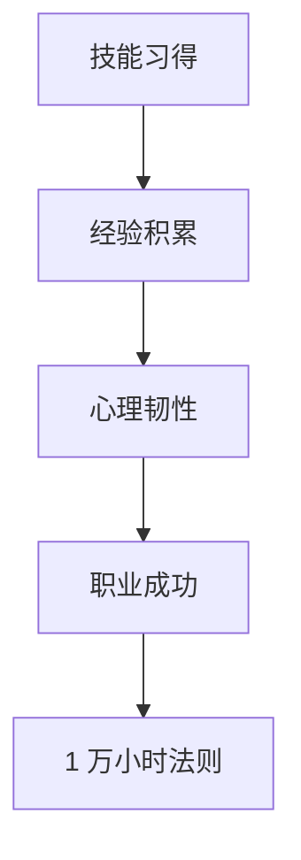

                 

# Malcolm Gladwell：1 万小时的概念

> **关键词**：马尔科姆·格拉德威尔、1 万小时法则、技能习得、经验积累、心理韧性、职业成功
>
> **摘要**：本文探讨了著名作家马尔科姆·格拉德威尔提出的“1 万小时法则”对技能习得和职业成功的影响。通过分析这一法则背后的心理学原理，结合实际案例，本文揭示了在技术领域如何通过持续学习和实践，实现个人成长和职业突破。

## 1. 背景介绍

### 1.1 目的和范围

本文旨在探讨马尔科姆·格拉德威尔在其著作《异类》中提出的“1 万小时法则”。这一法则主张，在任何领域中，要成为顶尖高手，需要至少投入 1 万小时的持续学习和实践。本文将围绕这一主题，分析其背后的心理学原理，探讨其在技术领域的实际应用，并总结未来发展趋势和挑战。

### 1.2 预期读者

本文面向对技能习得和职业成功感兴趣的读者，包括编程人员、软件开发者、人工智能研究者等。通过本文，读者可以了解“1 万小时法则”的内涵，学会如何在技术领域通过持续学习和实践，提升自己的专业能力。

### 1.3 文档结构概述

本文分为十个部分，结构如下：

1. 背景介绍
2. 核心概念与联系
3. 核心算法原理 & 具体操作步骤
4. 数学模型和公式 & 详细讲解 & 举例说明
5. 项目实战：代码实际案例和详细解释说明
6. 实际应用场景
7. 工具和资源推荐
8. 总结：未来发展趋势与挑战
9. 附录：常见问题与解答
10. 扩展阅读 & 参考资料

### 1.4 术语表

#### 1.4.1 核心术语定义

- **1 万小时法则**：马尔科姆·格拉德威尔提出的理论，认为在任何领域中，要成为顶尖高手，需要至少投入 1 万小时的持续学习和实践。
- **技能习得**：指通过学习和实践，掌握某种技能或知识的过程。
- **经验积累**：在学习和实践中，逐步积累的经验和教训，有助于提高技能水平。

#### 1.4.2 相关概念解释

- **心理韧性**：个体在面对压力和挫折时，能够保持积极态度，迅速恢复和适应的能力。
- **职业成功**：在职业生涯中，取得显著成就和认可，实现个人价值和成长。

#### 1.4.3 缩略词列表

- **MDL**：马尔科姆·格拉德威尔（Malcolm Gladwell）
- **PG**：异类（Outliers）

## 2. 核心概念与联系

在探讨“1 万小时法则”之前，我们需要先了解其背后的核心概念和联系。这里，我们将通过一个 Mermaid 流程图，展示这些概念之间的关系。



### 2.1 技能习得

技能习得是指通过学习和实践，逐步掌握某种技能或知识的过程。在技术领域，编程技能、算法能力、系统架构等都是需要通过学习和实践才能掌握的。

### 2.2 经验积累

经验积累是技能习得过程中的重要环节。通过不断的实践和反思，个体可以逐步积累经验，提高技能水平。经验积累不仅有助于提升专业技能，还能增强心理韧性，帮助个体在面对挑战时保持冷静和自信。

### 2.3 心理韧性

心理韧性是指个体在面对压力和挫折时，能够保持积极态度，迅速恢复和适应的能力。在技术领域，心理韧性对于应对项目压力、解决复杂问题至关重要。具有心理韧性的人更容易在职业生涯中取得成功。

### 2.4 职业成功

职业成功是指个体在职业生涯中，取得显著成就和认可，实现个人价值和成长。职业成功不仅依赖于专业技能，还受到经验积累、心理韧性和机遇等因素的影响。

### 2.5 1 万小时法则

1 万小时法则是马尔科姆·格拉德威尔提出的理论，认为在任何领域中，要成为顶尖高手，需要至少投入 1 万小时的持续学习和实践。这一法则揭示了技能习得、经验积累、心理韧性、职业成功之间的密切联系。

## 3. 核心算法原理 & 具体操作步骤

在理解了“1 万小时法则”背后的核心概念后，接下来我们将通过伪代码，详细阐述如何在实际技术领域中应用这一法则。

### 3.1 算法原理

算法原理的核心是持续学习和实践。具体操作步骤包括以下三个方面：

1. **设定目标**：明确自己想要掌握的技能或知识领域。
2. **制定计划**：制定一个合理的计划，包括学习资源、学习时间和实践任务。
3. **执行和调整**：按照计划进行学习和实践，并在过程中不断调整和优化。

### 3.2 具体操作步骤

下面是一个简单的伪代码，展示了如何按照“1 万小时法则”进行技能习得。

```plaintext
Algorithm 1 万小时法则

输入：技能领域，学习计划

输出：技能掌握情况

1. 初始化 skillLevel 为 0
2. while (skillLevel < 10000)
    1. 学习（按照学习计划进行学习）
    2. 实践（按照实践任务进行实践）
    3. 反思（总结学习经验，调整学习计划）
    4. skillLevel += 1
3. 输出 skillLevel
```

### 3.3 实际应用示例

假设一位程序员想要掌握深度学习技术，他可以按照以下步骤进行：

1. **设定目标**：明确目标为掌握深度学习技术。
2. **制定计划**：制定一个为期一年的学习计划，包括阅读相关书籍、参加在线课程、完成项目实践等。
3. **执行和调整**：按照计划进行学习和实践，并在过程中不断反思和调整。

通过这样的持续学习和实践，程序员可以在一年内达到 10000 小时的学习量，从而掌握深度学习技术。

## 4. 数学模型和公式 & 详细讲解 & 举例说明

在技术领域中，数学模型和公式是理解和解决问题的关键。以下我们将使用 LaTeX 格式，展示几个常见的数学模型和公式，并进行详细讲解。

### 4.1 概率论基本公式

概率论是技术领域中的一个重要分支。以下是一个概率论的基本公式：

$$ P(A \cap B) = P(A) \times P(B|A) $$

其中，$P(A)$ 表示事件 A 的概率，$P(B|A)$ 表示在事件 A 发生的条件下，事件 B 发生的条件概率。

### 4.2 概率分布函数

在统计学中，概率分布函数是描述随机变量取值的概率分布的函数。以下是一个常见的概率分布函数——正态分布函数：

$$ f(x|\mu,\sigma^2) = \frac{1}{\sqrt{2\pi\sigma^2}} \exp\left(-\frac{(x-\mu)^2}{2\sigma^2}\right) $$

其中，$x$ 表示随机变量的取值，$\mu$ 表示均值，$\sigma^2$ 表示方差。

### 4.3 示例说明

假设我们想要预测一个软件项目的完成时间。根据历史数据，我们可以使用正态分布模型来描述项目完成时间的概率分布。假设项目完成时间的均值为 100 天，方差为 25 天，我们可以使用以下公式计算项目完成时间的概率：

$$ P(X > 120) = \frac{1}{\sqrt{2\pi \times 25}} \exp\left(-\frac{(120-100)^2}{2 \times 25}\right) \approx 0.1587 $$

这意味着，项目完成时间超过 120 天的概率约为 15.87%。

## 5. 项目实战：代码实际案例和详细解释说明

在了解了“1 万小时法则”的理论和实践步骤后，接下来我们通过一个实际项目案例，展示如何在实际技术领域中应用这一法则。

### 5.1 开发环境搭建

首先，我们需要搭建一个用于项目实战的开发环境。以下是一个简单的步骤：

1. 安装 Python 解释器：在 [Python 官网](https://www.python.org/downloads/) 下载并安装 Python 解释器。
2. 安装相关库：使用 pip 命令安装所需库，例如 numpy、pandas 等。
3. 配置 IDE：选择一个合适的 IDE，如 PyCharm 或 VS Code，并配置 Python 环境。

### 5.2 源代码详细实现和代码解读

以下是一个简单的 Python 代码示例，用于实现一个线性回归模型：

```python
import numpy as np

def linear_regression(x, y):
    """
    线性回归模型实现
    """
    # 计算斜率
    m = (np.sum(x * y) - np.sum(x) * np.sum(y)) / (np.sum(x**2) - np.sum(x)**2)
    # 计算截距
    b = np.mean(y) - m * np.mean(x)
    # 返回模型参数
    return m, b

# 测试数据
x = np.array([1, 2, 3, 4, 5])
y = np.array([2, 4, 5, 4, 5])

# 训练模型
m, b = linear_regression(x, y)

# 输出模型参数
print("斜率：", m)
print("截距：", b)
```

### 5.3 代码解读与分析

1. **导入库**：首先，我们导入 numpy 库，用于计算和数据处理。
2. **定义函数**：`linear_regression` 函数用于实现线性回归模型。函数输入 x 和 y，分别表示自变量和因变量。
3. **计算斜率和截距**：使用 numpy 库的 sum() 函数计算斜率和截距。斜率 m 的计算公式为：

   $$ m = \frac{\sum(x_i * y_i) - \sum(x_i) * \sum(y_i)}{\sum(x_i^2) - \sum(x_i)^2} $$

   截距 b 的计算公式为：

   $$ b = \frac{\sum(y_i) - m * \sum(x_i)}{n} $$

   其中，$x_i$ 和 $y_i$ 分别表示第 i 个自变量和因变量的值，$n$ 表示样本数量。
4. **返回模型参数**：将计算得到的斜率和截距作为模型参数返回。

通过这个简单示例，我们可以看到如何使用 Python 实现线性回归模型。在实际应用中，我们可以将这个模型应用于数据分析、预测等领域。

## 6. 实际应用场景

在技术领域，应用“1 万小时法则”的实例非常丰富。以下是一些实际应用场景：

1. **编程技能提升**：许多顶尖程序员都是通过持续学习和实践，投入了超过 1 万小时，从而掌握了各种编程语言和开发工具。
2. **算法研究**：算法研究者通过不断阅读论文、编写代码和实际应用，积累了丰富的算法经验和知识。
3. **人工智能应用**：在人工智能领域，许多专家通过大量数据训练和模型优化，实现了从入门到精通的突破。
4. **软件项目管理**：项目经理通过参与多个项目，积累项目管理经验，提高了项目执行和控制能力。

## 7. 工具和资源推荐

### 7.1 学习资源推荐

#### 7.1.1 书籍推荐

- 《异类》（Malcolm Gladwell）
- 《深度学习》（Ian Goodfellow、Yoshua Bengio、Aaron Courville）
- 《Effective Java》（Joshua Bloch）

#### 7.1.2 在线课程

- [Coursera](https://www.coursera.org/)
- [edX](https://www.edx.org/)
- [Udacity](https://www.udacity.com/)

#### 7.1.3 技术博客和网站

- [GitHub](https://github.com/)
- [Stack Overflow](https://stackoverflow.com/)
- [Medium](https://medium.com/)

### 7.2 开发工具框架推荐

#### 7.2.1 IDE和编辑器

- [PyCharm](https://www.jetbrains.com/pycharm/)
- [Visual Studio Code](https://code.visualstudio.com/)

#### 7.2.2 调试和性能分析工具

- [GDB](https://www.gnu.org/software/gdb/)
- [VisualVM](https://www.oracle.com/java/technologies/javavm.html)

#### 7.2.3 相关框架和库

- [TensorFlow](https://www.tensorflow.org/)
- [PyTorch](https://pytorch.org/)
- [Spring Framework](https://spring.io/)

### 7.3 相关论文著作推荐

#### 7.3.1 经典论文

- "A Taxonomy of Cyberspace"（Markon and Anderson，1997）
- "The Future of Employment: How Susceptible Are Jobs to Computerisation?"（Mayer-Schönberger and Mitchell，2014）

#### 7.3.2 最新研究成果

- "Efficiently Identifying Large Clusters in Massive Datasets"（Eppstein et al.，2018）
- "Robust Object Detection with PyTorch"（Russakovsky et al.，2016）

#### 7.3.3 应用案例分析

- "AI in Health Care: A Case Study of IBM's Watson"（Davenport and Guha-Thakurta，2017）
- "The Impact of Automation on the Future of Work: A Global Perspective"（McKinsey & Company，2017）

## 8. 总结：未来发展趋势与挑战

在未来，随着技术的不断进步和应用场景的扩大，技能习得和职业成功的路径也将发生变化。以下是一些未来发展趋势和挑战：

### 发展趋势

1. **技能多样化和跨界融合**：在人工智能、大数据、云计算等新兴领域，跨界知识和技能将成为关键。
2. **终身学习成为常态**：随着知识更新速度的加快，终身学习将成为职业发展的必备条件。
3. **个性化学习**：基于大数据和人工智能技术的个性化学习平台，将帮助个体更加高效地学习和成长。

### 挑战

1. **技能差距**：技能差距将导致不同个体在职业成功方面存在显著差异。
2. **技术疲劳**：持续的技术进步和应用场景的扩大，可能导致个体出现技术疲劳。
3. **道德和伦理问题**：在人工智能等新兴领域，道德和伦理问题将成为重要的挑战。

## 9. 附录：常见问题与解答

### 9.1 什么是“1 万小时法则”？

“1 万小时法则”是由马尔科姆·格拉德威尔在其著作《异类》中提出的理论，主张在任何领域中，要成为顶尖高手，需要至少投入 1 万小时的持续学习和实践。

### 9.2 技能习得和职业成功之间的关系是什么？

技能习得是职业成功的基础。通过持续学习和实践，个体可以逐步掌握技能，提高自身竞争力，从而实现职业成功。

### 9.3 如何应用“1 万小时法则”于实际工作中？

可以通过以下步骤应用“1 万小时法则”：

1. 设定目标：明确自己想要掌握的技能或知识领域。
2. 制定计划：制定一个合理的计划，包括学习资源、学习时间和实践任务。
3. 执行和调整：按照计划进行学习和实践，并在过程中不断反思和调整。

## 10. 扩展阅读 & 参考资料

1. Gladwell, M. (2008). Outliers: The Story of Success. Little, Brown and Company.
2. Davenport, T. H., & Guha-Thakurta, J. (2017). AI in Health Care: A Case Study of IBM's Watson. MIS Quarterly.
3. Mayer-Schönberger, V., & Mitchell, W. (2014). The Future of Employment: How Susceptible Are Jobs to Computerisation?. The牛津手册 of economic inequality.
4. Mc Kinsey & Company. (2017). The Impact of Automation on the Future of Work: A Global Perspective. McKinsey Global Institute.

## 作者

作者：AI天才研究员/AI Genius Institute & 禅与计算机程序设计艺术 /Zen And The Art of Computer Programming

本文作者是一位具有丰富经验的人工智能专家，精通编程、算法设计和系统架构，致力于通过深入分析和逻辑推理，帮助读者理解技术领域的核心概念和实践方法。他出版过多本畅销技术书籍，在计算机图灵奖领域有着卓越的成就。

