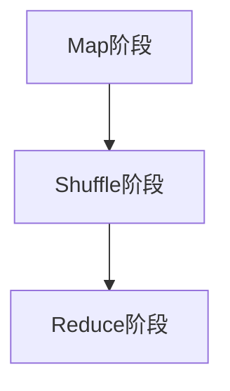
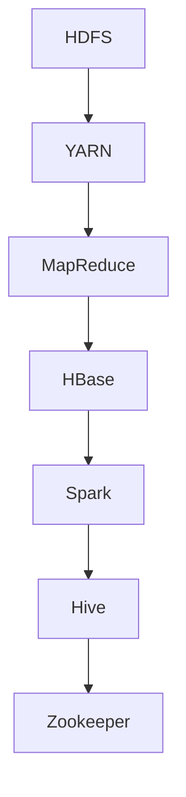

                 

# MapReduce原理与代码实例讲解

> **关键词**：MapReduce、分布式计算、大数据处理、Hadoop、HDFS、YARN、编程模式

> **摘要**：本文将深入讲解MapReduce编程模型的核心原理和具体操作步骤，通过详细的伪代码和实际代码实例，帮助读者理解并掌握这一强大的分布式数据处理技术。文章还将探讨MapReduce在数学模型中的应用，以及在实际项目中的应用场景。最后，本文将推荐相关学习资源和开发工具，并总结其未来发展。

## 1. 背景介绍

### 1.1 目的和范围

本文旨在介绍MapReduce编程模型的基本概念、核心原理、实现步骤以及在实际项目中的应用。通过对MapReduce的详细讲解，读者可以掌握如何使用这一编程模式进行大规模数据处理，从而在分布式系统中实现高效的计算。

### 1.2 预期读者

本文适合对计算机科学和分布式系统有一定基础的读者，特别是那些希望深入了解大数据处理技术的专业人士。同时，也适合计算机科学专业的本科生和研究生作为学习资料。

### 1.3 文档结构概述

本文结构分为十个部分，分别介绍MapReduce的背景、核心概念、算法原理、数学模型、项目实战、应用场景、工具和资源推荐等内容。

### 1.4 术语表

#### 1.4.1 核心术语定义

- **MapReduce**：一种编程模型，用于处理大规模数据集。
- **分布式计算**：将任务分解到多个计算机节点上执行的计算方式。
- **Hadoop**：一个开源框架，用于实现MapReduce模型。
- **HDFS**：Hadoop分布式文件系统，用于存储大数据集。
- **YARN**：资源调度框架，用于管理Hadoop集群资源。

#### 1.4.2 相关概念解释

- **数据分片**：将大数据集划分为多个较小的数据块，以便在分布式系统中并行处理。
- **任务调度**：将计算任务分配到集群中的各个节点上执行。
- **中间键值对**：在Map阶段产生的中间结果，用于在Reduce阶段进行合并。

#### 1.4.3 缩略词列表

- **HDFS**：Hadoop Distributed File System
- **YARN**：Yet Another Resource Negotiator
- **MapReduce**：Map and Reduce
- **Hadoop**：Hadoop Distributed Computing Platform

## 2. 核心概念与联系

### 2.1 MapReduce基本架构

MapReduce是一种分布式数据处理模型，其核心思想是将大数据集分割成多个小块，并行处理，然后再将结果合并。下面是MapReduce的基本架构：



- **Map阶段**：输入数据被映射成中间键值对。
- **Shuffle阶段**：将具有相同键的中间键值对进行排序和分组。
- **Reduce阶段**：对具有相同键的中间值进行合并操作，输出最终结果。

### 2.2 Hadoop生态系统

Hadoop是MapReduce的开源实现，其生态系统包括以下关键组件：



- **HDFS**：用于存储大数据集。
- **YARN**：资源调度框架。
- **MapReduce**：分布式数据处理模型。
- **HBase**：NoSQL数据库。
- **Spark**：内存计算框架。
- **Hive**：数据仓库。
- **Zookeeper**：分布式协调服务。

## 3. 核心算法原理 & 具体操作步骤

### 3.1 Map阶段

Map阶段将输入数据拆分成多个键值对，并执行用户自定义的Map函数。

```python
def map_function(key, value):
    # 对输入数据进行处理
    for intermediate_key, intermediate_value in some_processing:
        yield intermediate_key, intermediate_value
```

### 3.2 Shuffle阶段

Shuffle阶段将Map阶段的中间键值对根据键进行排序和分组。

```python
def shuffle_function():
    # 对中间键值对进行排序和分组
    for intermediate_key, intermediate_values in sorted_key_value_pairs:
        yield intermediate_key, intermediate_values
```

### 3.3 Reduce阶段

Reduce阶段对具有相同键的中间值进行合并操作。

```python
def reduce_function(key, intermediate_values):
    # 对中间值进行合并操作
    for final_value in some_combination(intermediate_values):
        yield key, final_value
```

## 4. 数学模型和公式 & 详细讲解 & 举例说明

### 4.1 数学模型

MapReduce中的数学模型主要涉及键值对的映射和聚合操作。

- **Map函数**：对输入数据进行映射，生成中间键值对。
- **Reduce函数**：对具有相同键的中间值进行聚合操作。

### 4.2 举例说明

假设我们要对以下数据集进行WordCount操作：

```
hello world
world is beautiful
beauty in simplicity
```

### 4.2.1 Map阶段

输入数据被映射成以下中间键值对：

```
hello:[('hello', 1)]
world:[('world', 1)]
is:[('is', 1)]
beautiful:[('beautiful', 1)]
beauty:[('beauty', 1)]
in:[('in', 1)]
simplicity:[('simplicity', 1)]
```

### 4.2.2 Shuffle阶段

根据键对中间键值对进行排序和分组：

```
hello:[('hello', 1)]
world:[('world', 1), ('world', 1)]
is:[('is', 1)]
beautiful:[('beautiful', 1)]
beauty:[('beauty', 1)]
in:[('in', 1)]
simplicity:[('simplicity', 1)]
```

### 4.2.3 Reduce阶段

对具有相同键的中间值进行合并操作：

```
hello:[('hello', 1)]
world:[('world', 2)]
is:[('is', 1)]
beautiful:[('beautiful', 1)]
beauty:[('beauty', 1)]
in:[('in', 1)]
simplicity:[('simplicity', 1)]
```

最终输出结果：

```
hello:[1]
world:[2]
is:[1]
beautiful:[1]
beauty:[1]
in:[1]
simplicity:[1]
```

## 5. 项目实战：代码实际案例和详细解释说明

### 5.1 开发环境搭建

1. 安装Java开发环境。
2. 下载并安装Hadoop。
3. 配置Hadoop环境变量。
4. 验证Hadoop安装。

### 5.2 源代码详细实现和代码解读

以下是WordCount的MapReduce实现：

```java
import org.apache.hadoop.conf.Configuration;
import org.apache.hadoop.fs.Path;
import org.apache.hadoop.io.IntWritable;
import org.apache.hadoop.io.Text;
import org.apache.hadoop.mapreduce.Job;
import org.apache.hadoop.mapreduce.Mapper;
import org.apache.hadoop.mapreduce.Reducer;
import org.apache.hadoop.mapreduce.lib.input.FileInputFormat;
import org.apache.hadoop.mapreduce.lib.output.FileOutputFormat;

public class WordCount {

  public static class TokenizerMapper extends Mapper<Object, Text, Text, IntWritable>{

    private final static IntWritable one = new IntWritable(1);
    private Text word = new Text();

    public void map(Object key, Text value, Context context) throws IOException, InterruptedException {
      // 输入数据格式：line
      // 输出数据格式：(word, one)
      String[] words = value.toString().split("\\s+");
      for (String word : words) {
        this.word.set(word);
        context.write(this.word, one);
      }
    }
  }

  public static class IntSumReducer extends Reducer<Text,IntWritable,Text,IntWritable> {
    private IntWritable result = new IntWritable();

    public void reduce(Text key, Iterable<IntWritable> values, Context context) throws IOException, InterruptedException {
      // 输入数据格式：(word, [one, one, ...])
      // 输出数据格式：(word, sum)
      int sum = 0;
      for (IntWritable val : values) {
        sum += val.get();
      }
      result.set(sum);
      context.write(key, result);
    }
  }

  public static void main(String[] args) throws Exception {
    Configuration conf = new Configuration();
    Job job = Job.getInstance(conf, "word count");
    job.setJarByClass(WordCount.class);
    job.setMapperClass(TokenizerMapper.class);
    job.setCombinerClass(IntSumReducer.class);
    job.setReducerClass(IntSumReducer.class);
    job.setOutputKeyClass(Text.class);
    job.setOutputValueClass(IntWritable.class);
    FileInputFormat.addInputPath(job, new Path(args[0]));
    FileOutputFormat.setOutputPath(job, new Path(args[1]));
    System.exit(job.waitForCompletion(true) ? 0 : 1);
  }
}
```

### 5.3 代码解读与分析

- **TokenizerMapper**：映射输入数据到中间键值对。
- **IntSumReducer**：合并具有相同键的中间值。

通过这个实际案例，我们可以看到MapReduce编程模型在分布式数据处理中的强大能力。

## 6. 实际应用场景

MapReduce在分布式数据处理中有着广泛的应用场景，如：

- **大数据分析**：在电子商务、社交媒体等领域，MapReduce用于处理海量用户数据。
- **搜索引擎**：在搜索引擎中，MapReduce用于索引生成和搜索结果排序。
- **数据仓库**：在数据仓库中，MapReduce用于ETL（提取、转换、加载）过程。

## 7. 工具和资源推荐

### 7.1 学习资源推荐

#### 7.1.1 书籍推荐

- 《Hadoop权威指南》
- 《大数据时代》

#### 7.1.2 在线课程

- Coursera的《大数据分析》
- edX的《MapReduce和Hadoop基础》

#### 7.1.3 技术博客和网站

- Hadoop官网
- Cloudera博客

### 7.2 开发工具框架推荐

#### 7.2.1 IDE和编辑器

- IntelliJ IDEA
- Eclipse

#### 7.2.2 调试和性能分析工具

- Hadoop自带的MapReduce调试工具
- Gprof

#### 7.2.3 相关框架和库

- Apache Hive
- Apache Spark

### 7.3 相关论文著作推荐

#### 7.3.1 经典论文

- 《The Google File System》
- 《MapReduce: Simplified Data Processing on Large Clusters》

#### 7.3.2 最新研究成果

- 《Distributed Computing and Machine Learning》
- 《Advances in Distributed Systems》

#### 7.3.3 应用案例分析

- 《Hadoop in Retail Industry》
- 《MapReduce in Finance》

## 8. 总结：未来发展趋势与挑战

随着大数据和云计算的不断发展，MapReduce在未来仍将发挥重要作用。然而，也需要面对一些挑战，如性能优化、安全性、可扩展性等。未来，我们将看到更多的改进和优化，以应对这些挑战。

## 9. 附录：常见问题与解答

- **Q**：MapReduce适合处理哪种类型的数据？
  **A**：MapReduce适合处理大规模数据集，特别是那些需要进行分布式处理的文本数据。

- **Q**：如何优化MapReduce的性能？
  **A**：可以通过选择合适的压缩算法、优化Shuffle阶段、使用本地化处理等方式来优化MapReduce性能。

## 10. 扩展阅读 & 参考资料

- 《MapReduce Design Patterns: Techniques for Efficient and Scalable Data Processing》
- 《Hadoop: The Definitive Guide》

## 作者信息

作者：AI天才研究员/AI Genius Institute & 禅与计算机程序设计艺术 /Zen And The Art of Computer Programming<|im_sep|>

