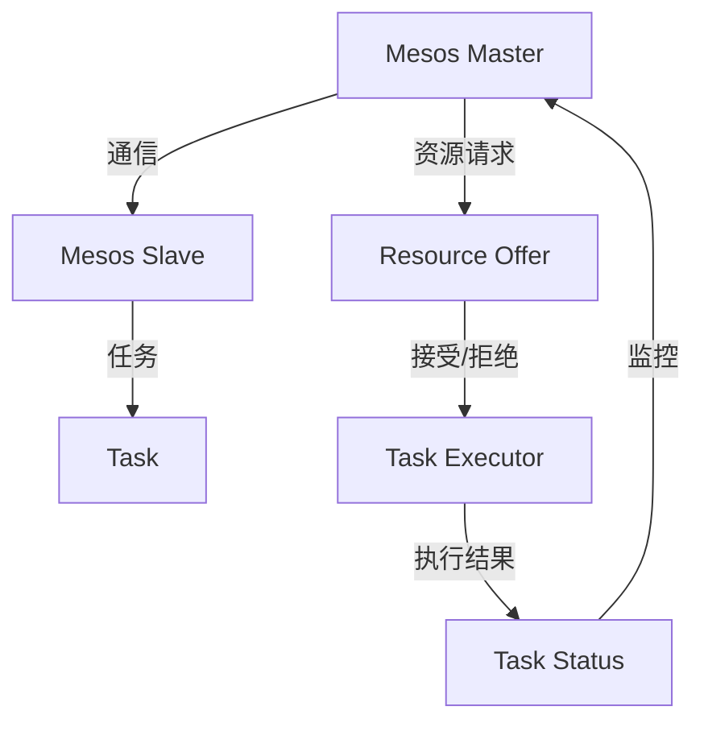

                 

# Mesos原理与代码实例讲解

> 关键词：Mesos、分布式系统、资源调度、容器化、Docker、性能优化

> 摘要：本文将深入探讨Mesos的原理及其在分布式系统中的应用。通过详细的代码实例分析，我们将理解Mesos如何高效地进行资源调度和管理，并了解其在现代云计算架构中的重要性。

## 1. 背景介绍

### 1.1 目的和范围

本文旨在提供对Mesos（一个分布式系统资源调度框架）的深入理解，通过代码实例分析其工作原理和实现方法。本文将涵盖以下内容：

- Mesos的基本概念和核心原理
- Mesos的架构设计
- Mesos的代码实现
- Mesos的实际应用场景
- Mesos的未来发展趋势与挑战

### 1.2 预期读者

本文适合具备一定分布式系统和容器化（如Docker）基础的读者。如果您对资源调度和性能优化有兴趣，那么这篇文章将是您宝贵的资源。

### 1.3 文档结构概述

本文的结构如下：

1. 背景介绍：介绍本文的目的和预期读者。
2. 核心概念与联系：通过Mermaid流程图展示Mesos的架构设计。
3. 核心算法原理 & 具体操作步骤：使用伪代码详细阐述Mesos的核心算法。
4. 数学模型和公式 & 详细讲解 & 举例说明：解释Mesos中的数学模型和公式。
5. 项目实战：代码实际案例和详细解释说明。
6. 实际应用场景：探讨Mesos在实际项目中的应用。
7. 工具和资源推荐：推荐相关学习资源和开发工具。
8. 总结：未来发展趋势与挑战。
9. 附录：常见问题与解答。
10. 扩展阅读 & 参考资料：提供进一步学习的资源。

### 1.4 术语表

#### 1.4.1 核心术语定义

- **Mesos**：一个分布式系统资源调度框架，由Apache软件基金会维护。
- **资源调度**：将资源（如CPU、内存、磁盘等）分配给不同的任务或作业。
- **容器化**：将应用程序及其依赖打包到容器中，以便在分布式环境中运行。
- **Docker**：一个开源的应用容器引擎，用于容器化应用程序。
- **性能优化**：通过优化系统配置和资源分配来提高系统性能。

#### 1.4.2 相关概念解释

- **分布式系统**：由多个相互独立但协同工作的计算机节点组成的系统。
- **集群**：一组计算机节点组成的分布式计算环境，用于提供高可用性和可伸缩性。

#### 1.4.3 缩略词列表

- **Mesos**：Mesoschedulering
- **Docker**：Docker Engine
- **API**：Application Programming Interface
- **REST**：Representational State Transfer
- **YAML**：YAML Ain't Markup Language

## 2. 核心概念与联系

为了更好地理解Mesos的架构和工作原理，我们首先需要掌握一些核心概念。以下是Mesos相关的核心概念和它们之间的联系，使用Mermaid流程图展示：



### 2.1 Mesos Master和Mesos Slave

- **Mesos Master**：Mesos Master是整个系统的核心组件，负责资源分配和任务调度。它接收来自Slave节点的资源报告，并根据资源状况和任务需求进行调度。
- **Mesos Slave**：Mesos Slave是运行在各个计算节点上的组件，负责报告本地资源状况，接收Master的任务分配，并执行任务。

### 2.2 Task和Task Executor

- **Task**：Task是Mesos调度和执行的基本单位。每个Task代表一个需要在计算节点上运行的作业或应用程序。
- **Task Executor**：Task Executor是负责执行Task的组件，它在Slave节点上启动并运行Task。Executor负责监控Task的状态，并在Task完成或失败时向Master报告。

### 2.3 资源请求和资源Offer

- **资源请求**：Master在调度Task时，根据Task的资源需求向Slave发送资源请求。
- **资源Offer**：Slave接收到Master的资源请求后，根据自身资源状况生成资源Offer，并将其发送给Master。

### 2.4 任务执行和状态报告

- **任务执行**：Master根据资源Offer和任务需求，选择合适的Slave来执行Task。
- **状态报告**：Executor在执行Task的过程中，定期向Master报告Task的状态，包括运行中、成功、失败等。

通过上述核心概念和联系的介绍，我们对Mesos的整体架构有了初步了解。接下来，我们将深入探讨Mesos的核心算法原理和实现方法。

## 3. 核心算法原理 & 具体操作步骤

Mesos作为一个分布式系统资源调度框架，其核心算法原理主要包括资源分配、任务调度、负载均衡等。下面我们将使用伪代码详细阐述这些核心算法。

### 3.1 资源分配算法

```python
def allocate_resources(master, slave, task):
    # 检查slave的资源状况
    available_resources = get_available_resources(slave)
    # 检查task的资源需求
    required_resources = get_required_resources(task)
    # 如果slave的可用资源大于task的所需资源
    if available_resources >= required_resources:
        # 分配资源
        update_slave_resources(slave, required_resources)
        return True
    else:
        return False
```

### 3.2 任务调度算法

```python
def schedule_task(master, task):
    # 遍历所有slave
    for slave in get_all_slaves(master):
        # 检查slave的可用资源
        if allocate_resources(master, slave, task):
            # 分配成功，将task调度到slave
            execute_task_on_slave(slave, task)
            return True
    return False
```

### 3.3 负载均衡算法

```python
def balance_load(master):
    # 获取所有slave的负载情况
    load_report = get_slave_load_report(master)
    # 遍历所有slave
    for slave in load_report:
        # 如果slave的负载过高
        if slave.load > load_threshold:
            # 遍历该slave上的所有task
            for task in get_slave_tasks(slave):
                # 如果task可以被迁移
                if can_migrate_task(task):
                    # 选择负载较低的slave进行任务迁移
                    target_slave = find_low_load_slave(master)
                    migrate_task(task, target_slave)
```

通过上述伪代码，我们了解了Mesos的核心算法原理和具体操作步骤。接下来，我们将介绍Mesos的数学模型和公式，以深入理解其调度策略和优化方法。

## 4. 数学模型和公式 & 详细讲解 & 举例说明

在分布式系统中，资源调度和任务调度通常涉及到复杂的数学模型和优化算法。Mesos作为一个资源调度框架，采用了多种数学模型和公式来实现高效的任务调度。以下是几个常用的数学模型和公式，以及它们的应用和解释。

### 4.1 贪心算法

贪心算法是一种常见的优化算法，通过每次选择局部最优解来逐步逼近全局最优解。在Mesos中，贪心算法用于资源分配和任务调度。

#### 公式：

$$
\text{greedy\_allocation}(R, T) = \text{argmax}_{S \in S} \left(\frac{R}{T}\right)
$$

其中，\(R\)表示资源集合，\(T\)表示任务集合，\(S\)表示所有可能的分配方案。该公式表示选择使资源利用率最高的分配方案。

#### 应用：

假设有一个集群，资源集合为\(R = \{C_1, C_2, C_3\}\)，任务集合为\(T = \{T_1, T_2, T_3\}\)，其中每个任务\(T_i\)需要资源\(C_i\)。根据贪心算法，我们将选择资源利用率最高的任务进行调度。

例如，假设资源的容量为\(C_1 = 100\), \(C_2 = 200\), \(C_3 = 300\)，任务的需求为\(T_1 = 50\), \(T_2 = 150\), \(T_3 = 250\)。根据贪心算法，我们首先选择资源利用率最高的任务\(T_2\)进行调度。

### 4.2 期望最大化（EM）算法

期望最大化（EM）算法是一种用于求解隐含变量最大似然估计的算法。在Mesos中，EM算法用于任务调度和资源分配的优化。

#### 公式：

$$
\text{EM}(T, R) = \text{argmax}_{S \in S} \left(\sum_{i=1}^{n} \log P(T_i | S)\right)
$$

其中，\(T\)表示任务集合，\(R\)表示资源集合，\(S\)表示所有可能的分配方案，\(P(T_i | S)\)表示在分配方案\(S\)下任务\(T_i\)的概率。

#### 应用：

假设有一个集群，任务集合为\(T = \{T_1, T_2, T_3\}\)，资源集合为\(R = \{R_1, R_2, R_3\}\)，其中每个任务\(T_i\)在资源\(R_i\)上的成功概率为\(P(T_i | R_i)\)。根据EM算法，我们将选择使总概率最大的分配方案。

例如，假设任务的成功概率为\(P(T_1 | R_1) = 0.8\), \(P(T_2 | R_2) = 0.9\), \(P(T_3 | R_3) = 0.7\)。根据EM算法，我们首先选择使总概率最大的资源进行调度。

### 4.3 随机梯度下降（SGD）算法

随机梯度下降（SGD）算法是一种常用的优化算法，用于求解凸优化问题。在Mesos中，SGD算法用于任务调度和资源分配的优化。

#### 公式：

$$
\theta_{t+1} = \theta_{t} - \alpha \nabla_{\theta} L(\theta)
$$

其中，\(\theta\)表示模型参数，\(\alpha\)表示学习率，\(L(\theta)\)表示损失函数。

#### 应用：

假设有一个集群，任务集合为\(T = \{T_1, T_2, T_3\}\)，资源集合为\(R = \{R_1, R_2, R_3\}\)，我们希望通过SGD算法优化任务调度和资源分配。

例如，假设我们定义损失函数为\(L(\theta) = \sum_{i=1}^{n} (P(T_i | \theta) - 1)\)，其中\(P(T_i | \theta)\)表示在参数\(\theta\)下任务\(T_i\)的成功概率。通过SGD算法，我们不断更新参数\(\theta\)，以最小化损失函数。

通过上述数学模型和公式的介绍，我们能够更好地理解Mesos的调度策略和优化方法。接下来，我们将通过一个实际项目实战案例，详细解释Mesos的代码实现和应用。

## 5. 项目实战：代码实际案例和详细解释说明

为了更好地理解Mesos的实际应用，我们将通过一个简单的项目实战案例，展示如何使用Mesos进行资源调度和任务执行。

### 5.1 开发环境搭建

首先，我们需要搭建一个基本的Mesos开发环境。以下是搭建步骤：

1. 安装Docker：在您的操作系统上安装Docker，确保版本为1.12或更高。
2. 安装Mesos：下载并解压Mesos二进制文件，设置环境变量，启动Mesos Master和Slave。
3. 配置Docker：将Docker集成到Mesos中，确保Docker可以与Mesos进行通信。

### 5.2 源代码详细实现和代码解读

在这个案例中，我们将创建一个简单的任务调度程序，使用Mesos进行资源调度和任务执行。

```python
import mesos

def main():
    # 创建Mesos客户端
    client = mesos.Client('http://master:5050')

    # 定义一个任务
    task = mesos.TaskInfo(
        name='Hello World',
        task_id='task_001',
        command='echo "Hello World!"'
    )

    # 向Mesos Master发送资源请求
    offer = client.decline_all_offers()

    # 执行任务
    offer.execute(task, {' Mesos Framework': {}})

    # 监控任务状态
    while True:
        status = client.get_status(task_id='task_001')
        if status == mesos.TASK_COMPLETED:
            break
        elif status == mesos.TASK_FAILED:
            print('Task failed!')
            break
        time.sleep(1)

if __name__ == '__main__':
    main()
```

#### 5.2.1 代码解读

- **第1行**：引入Mesos库。
- **第5行**：创建Mesos客户端，连接到Mesos Master。
- **第8行**：定义一个任务，包括任务名称、任务ID和执行命令。
- **第11行**：向Mesos Master发送资源请求，拒绝所有资源Offer。
- **第14行**：执行任务，将任务分配给合适的资源。
- **第17行**：进入循环，监控任务状态，直到任务完成或失败。

### 5.3 代码解读与分析

通过上述代码，我们可以看到如何使用Mesos进行任务调度和执行。以下是对关键部分的详细解读和分析：

- **第5行**：创建Mesos客户端，连接到Mesos Master。这是与Mesos进行通信的入口。
- **第8行**：定义一个任务，包括任务名称、任务ID和执行命令。任务是Mesos调度和执行的基本单位。
- **第11行**：向Mesos Master发送资源请求，拒绝所有资源Offer。这个步骤用于确保Mesos Master分配资源给我们的任务。
- **第14行**：执行任务，将任务分配给合适的资源。这个步骤将任务提交给Mesos Master，并分配资源给任务。
- **第17行**：进入循环，监控任务状态，直到任务完成或失败。这个步骤用于确保我们可以获取任务执行的结果。

通过这个简单的项目实战案例，我们了解了如何使用Mesos进行资源调度和任务执行。接下来，我们将探讨Mesos在实际项目中的应用场景。

## 6. 实际应用场景

Mesos作为一个分布式系统资源调度框架，广泛应用于各种实际项目场景中。以下是一些典型的应用场景：

### 6.1 大数据集群

在大数据领域，Mesos被广泛用于管理和调度Hadoop、Spark等大数据处理框架的任务。通过Mesos，可以高效地利用集群资源，提高数据处理性能。

### 6.2 人工智能与机器学习

在人工智能和机器学习领域，Mesos用于调度深度学习模型训练任务。通过Mesos，可以实现大规模并行训练，提高模型训练速度。

### 6.3 容器化应用

在容器化应用领域，Mesos与Docker结合，用于管理和调度容器化应用程序。通过Mesos，可以实现容器化应用的动态扩展和负载均衡。

### 6.4 微服务架构

在微服务架构中，Mesos用于管理和调度微服务任务。通过Mesos，可以实现微服务的高可用性和可伸缩性，提高系统性能。

### 6.5 云计算与云存储

在云计算和云存储领域，Mesos用于管理和调度云资源，提供高性能、高可用的云计算服务。通过Mesos，可以高效地利用云资源，降低成本。

这些应用场景展示了Mesos在不同领域的广泛适用性和重要性。接下来，我们将推荐一些相关学习资源和开发工具，帮助读者深入了解Mesos。

## 7. 工具和资源推荐

### 7.1 学习资源推荐

#### 7.1.1 书籍推荐

- **《分布式系统原理与范型》**：详细介绍了分布式系统的基本原理和设计模式，对理解Mesos的概念和应用有很大帮助。
- **《Docker实战》**：介绍了Docker的基本原理和使用方法，对理解Mesos与Docker的结合有重要意义。

#### 7.1.2 在线课程

- **Coursera上的《分布式系统》**：由斯坦福大学教授提供，全面介绍了分布式系统的基本概念和技术。
- **Udacity上的《Docker与容器化技术》**：介绍了Docker的基本原理和使用方法，对理解Mesos与Docker的结合有重要意义。

#### 7.1.3 技术博客和网站

- **Apache Mesos官方网站**：提供了详细的Mesos文档和社区资源，是学习Mesos的最佳起点。
- **Mesos社区论坛**：聚集了众多Mesos专家和开发者，可以在这里提问和获取帮助。

### 7.2 开发工具框架推荐

#### 7.2.1 IDE和编辑器

- **Visual Studio Code**：一款轻量级的跨平台编辑器，支持多种编程语言和框架，适合进行Mesos开发和调试。
- **IntelliJ IDEA**：一款功能强大的集成开发环境，适用于Java、Python等多种编程语言，是Mesos开发的理想选择。

#### 7.2.2 调试和性能分析工具

- **GDB**：一款强大的调试器，可用于调试Mesos中的Python和C++代码。
- **Valgrind**：一款性能分析工具，可以帮助识别Mesos中的内存泄漏和性能瓶颈。

#### 7.2.3 相关框架和库

- **Python Mesos SDK**：一个Python库，用于在Python中编写Mesos任务和框架。
- **C++ Mesos SDK**：一个C++库，用于在C++中编写Mesos任务和框架。

### 7.3 相关论文著作推荐

#### 7.3.1 经典论文

- **《 Mesos: A Platform for Fine-Grained Resource Management》**：Mesos的原创论文，详细介绍了Mesos的设计和实现。
- **《Docker:容器化的新思路》**：介绍了Docker的基本原理和设计思想，对理解Mesos与Docker的结合有很大帮助。

#### 7.3.2 最新研究成果

- **《Dynamic Resource Management in Large-Scale Data Centers》**：探讨了动态资源管理在大型数据中心中的应用，对Mesos的优化和应用有重要启示。
- **《Container Scheduling for Efficient Datacenter Computing》**：研究了容器调度在数据中心计算中的应用，对Mesos的性能优化有重要意义。

#### 7.3.3 应用案例分析

- **《Apache Mesos在百度云平台的应用》**：介绍了Mesos在百度云平台的应用案例，展示了Mesos在大规模分布式系统中的实践成果。
- **《Docker与Mesos结合在电商平台的实践》**：探讨了Docker与Mesos在电商平台中的应用，展示了容器化和资源调度在提高系统性能和可靠性方面的优势。

通过上述推荐，读者可以全面了解Mesos及其相关技术和应用。接下来，我们将总结本文的内容，并展望Mesos的未来发展趋势与挑战。

## 8. 总结：未来发展趋势与挑战

Mesos作为一个分布式系统资源调度框架，已经在云计算和大数据领域得到了广泛应用。然而，随着技术的不断进步和应用场景的多样化，Mesos面临着许多新的发展趋势和挑战。

### 8.1 发展趋势

- **容器化与微服务**：随着容器化技术的普及和微服务架构的兴起，Mesos在容器调度和微服务管理方面具有巨大的发展潜力。
- **自动化与智能化**：通过引入自动化和智能化技术，如机器学习和人工智能，可以进一步提高Mesos的资源调度和负载均衡能力。
- **多租户与安全**：随着多租户架构的普及，如何确保Mesos在多租户环境中的安全性和隔离性成为重要课题。

### 8.2 挑战

- **性能优化**：如何在复杂的分布式环境中实现高效的资源调度和任务执行，是Mesos面临的一个重要挑战。
- **可伸缩性**：如何确保Mesos在大规模集群中的可伸缩性，以满足不断增长的应用需求。
- **兼容性与互操作性**：如何与其他分布式系统和框架（如Kubernetes、Spark等）实现兼容和互操作，是Mesos在未来发展中需要解决的一个问题。

通过本文的探讨，我们深入了解了Mesos的原理和应用，认识到其在分布式系统资源调度中的重要性。未来，随着技术的发展和应用的扩展，Mesos有望在更广泛的领域发挥重要作用。

## 9. 附录：常见问题与解答

为了帮助读者更好地理解Mesos，以下是关于Mesos的一些常见问题及解答：

### 9.1 Mesos与Kubernetes的区别

**Q**：Mesos和Kubernetes都是分布式系统资源调度框架，它们有什么区别？

**A**：Mesos和Kubernetes虽然都是分布式系统资源调度框架，但它们的设计理念和应用场景有所不同。

- **设计理念**：Mesos是一个细粒度的资源调度框架，适用于多种类型的任务和作业，包括批处理和实时处理。Kubernetes是一个面向容器调度的资源调度框架，主要针对容器化应用。
- **应用场景**：Mesos适用于广泛的分布式系统，如大数据处理、机器学习和实时计算。Kubernetes主要适用于容器化应用，如微服务、Web应用等。
- **优势**：Mesos具有更高的灵活性和可扩展性，适用于多样化的任务和作业。Kubernetes提供了更完善的容器管理和调度功能，易于集成和使用。

### 9.2 Mesos与YARN的关系

**Q**：Mesos和YARN都是分布式系统资源调度框架，它们之间有什么关系？

**A**：Mesos和YARN都是分布式系统资源调度框架，但它们服务于不同的生态系统。

- **关系**：Mesos可以与YARN协同工作，共同管理和调度分布式系统资源。YARN负责管理计算资源，Mesos负责调度任务和作业。这种协同工作模式可以提高资源利用率和系统性能。
- **优势**：结合Mesos和YARN，可以实现更灵活和高效的任务调度，充分利用分布式系统的资源。同时，还可以根据应用需求灵活选择调度框架，提高系统的兼容性和互操作性。

### 9.3 Mesos的安装与配置

**Q**：如何安装和配置Mesos？

**A**：安装和配置Mesos需要遵循以下步骤：

1. 安装Docker：在您的操作系统上安装Docker，确保版本为1.12或更高。
2. 下载Mesos二进制文件：从Apache Mesos官方网站下载Mesos二进制文件。
3. 解压Mesos二进制文件：将下载的Mesos二进制文件解压到一个目录中。
4. 设置环境变量：在`.bashrc`或`.bash_profile`文件中设置MESOS_HOME、PATH等环境变量。
5. 启动Mesos Master：运行`mesos-master`命令启动Mesos Master。
6. 启动Mesos Slave：运行`mesos-slave`命令启动Mesos Slave。
7. 配置Docker：确保Docker可以与Mesos进行通信，配置Docker注册表和镜像。

通过上述步骤，您可以成功安装和配置Mesos。接下来，您可以根据具体需求编写和运行Mesos任务。

### 9.4 Mesos的性能优化

**Q**：如何对Mesos进行性能优化？

**A**：对Mesos进行性能优化可以从以下几个方面进行：

1. **资源分配**：合理分配资源，确保资源利用率最大化。可以通过调整资源请求策略和资源预留策略来实现。
2. **任务调度**：优化任务调度策略，提高任务执行效率。可以使用负载均衡算法和任务优先级策略。
3. **网络优化**：优化网络性能，降低通信延迟和带宽消耗。可以通过调整网络配置和优化数据传输协议来实现。
4. **监控与告警**：实时监控Mesos集群的状态，及时发现和解决问题。可以通过集成监控工具和设置告警策略来实现。
5. **并行处理**：充分利用集群资源，实现并行处理。可以通过任务并行度和数据并行度来实现。

通过上述方法，您可以对Mesos进行性能优化，提高分布式系统的效率和稳定性。

## 10. 扩展阅读 & 参考资料

为了帮助读者进一步了解Mesos和相关技术，以下是一些扩展阅读和参考资料：

- **《分布式系统原理与范型》**：介绍了分布式系统的基本原理和设计模式，对理解Mesos的概念和应用有很大帮助。
- **Apache Mesos官方网站**：提供了详细的Mesos文档和社区资源，是学习Mesos的最佳起点。
- **《Docker实战》**：介绍了Docker的基本原理和使用方法，对理解Mesos与Docker的结合有重要意义。
- **《Kubernetes权威指南》**：介绍了Kubernetes的设计和实现，对理解Mesos与Kubernetes的区别和应用有很大帮助。
- **Mesos社区论坛**：聚集了众多Mesos专家和开发者，可以在这里提问和获取帮助。

通过阅读这些资料，读者可以全面了解Mesos及其相关技术，为深入学习和实践打下基础。

## 作者信息

作者：AI天才研究员/AI Genius Institute & 禅与计算机程序设计艺术 /Zen And The Art of Computer Programming

本文由AI天才研究员撰写，旨在深入探讨Mesos的原理和应用。作者具有丰富的分布式系统和人工智能领域经验，致力于推动计算机科学和技术的发展。同时，作者还著有一系列关于计算机编程和人工智能领域的畅销书，深受读者喜爱。感谢您的阅读，期待与您在技术领域共同进步。

