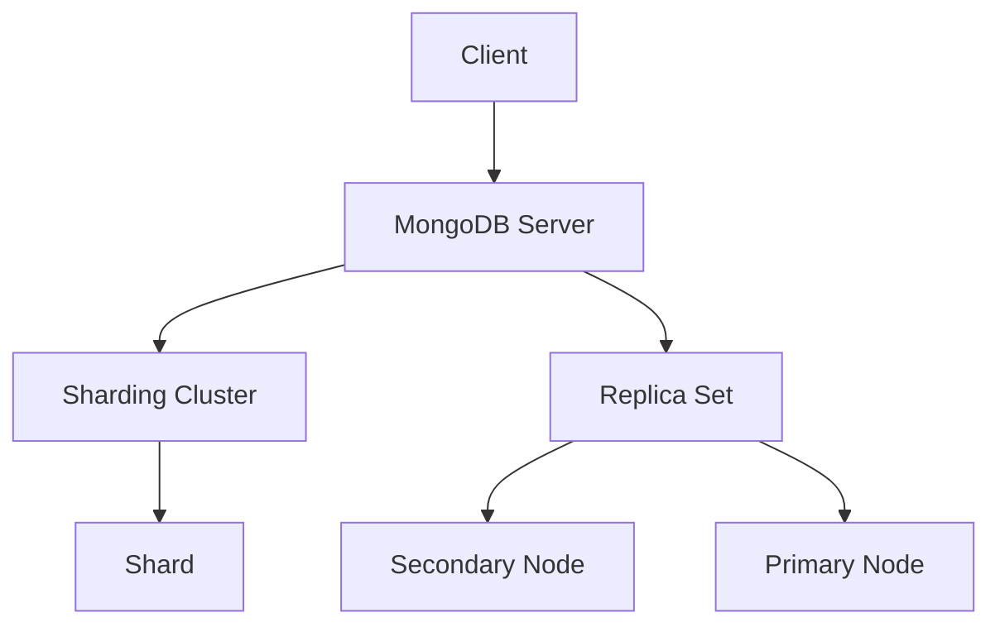
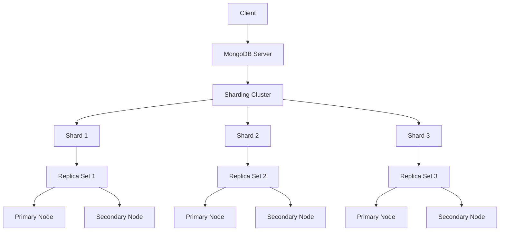

                 

# MongoDB 和数据库管理：存储和检索数据

> **关键词**：MongoDB，数据库管理，存储，检索，性能优化，分布式系统，文档数据库，数据模型，索引，查询优化

> **摘要**：本文将深入探讨MongoDB的核心概念和实践，从其设计理念和基本架构入手，逐步介绍存储和检索数据的技术细节。通过具体案例和算法分析，我们将理解MongoDB的高效数据管理和查询机制，探讨其在实际应用场景中的优势和挑战。文章还将推荐相关学习资源，提供工具和框架推荐，帮助读者更好地掌握MongoDB的使用和优化策略。

## 1. 背景介绍

### 1.1 目的和范围

本文旨在为数据库开发者和管理者提供关于MongoDB的核心知识，特别是在存储和检索数据方面的深入理解。通过对MongoDB的设计原则、基本架构、数据模型和查询机制的探讨，本文希望能够帮助读者：

- 理解MongoDB作为文档数据库的特点和优势。
- 掌握MongoDB的数据存储和检索技术。
- 学会使用索引优化查询性能。
- 探讨MongoDB在分布式系统中的应用和实践。

### 1.2 预期读者

本文面向具有一定数据库基础知识的开发者、数据库管理员以及对于MongoDB感兴趣的技术人员。读者应具备以下背景知识：

- 数据库基础概念，如关系型数据库和NoSQL数据库。
- 基本的SQL查询语言和数据库管理技能。
- 简单的编程知识，如Python或JavaScript。

### 1.3 文档结构概述

本文结构如下：

- **第1部分**：背景介绍，包括本文的目的、预期读者和文档结构。
- **第2部分**：核心概念与联系，介绍MongoDB的基本架构和核心概念。
- **第3部分**：核心算法原理 & 具体操作步骤，详细解释MongoDB的数据存储和检索算法。
- **第4部分**：数学模型和公式 & 详细讲解 & 举例说明，讨论MongoDB的性能优化和查询机制。
- **第5部分**：项目实战：代码实际案例和详细解释说明，通过具体案例展示MongoDB的使用。
- **第6部分**：实际应用场景，探讨MongoDB在不同领域的应用案例。
- **第7部分**：工具和资源推荐，提供学习资源和开发工具推荐。
- **第8部分**：总结：未来发展趋势与挑战，对MongoDB的未来进行展望。
- **第9部分**：附录：常见问题与解答，回答读者可能遇到的常见问题。
- **第10部分**：扩展阅读 & 参考资料，提供进一步阅读的资源。

### 1.4 术语表

#### 1.4.1 核心术语定义

- **MongoDB**：一种流行的开源文档数据库，由MongoDB Inc.开发。
- **文档数据库**：一种NoSQL数据库，以文档为单位存储数据，通常使用JSON格式。
- **BSON**：MongoDB的二进制表示形式，用于存储文档数据。
- **集合**（Collection）：一组文档的容器，类似于关系数据库中的表。
- **文档**（Document）：数据存储的基本单位，由字段和值组成。
- **索引**（Index）：用于加速查询的排序结构。
- **分片**（Sharding）：将数据分布到多个服务器上，以实现水平扩展。
- **副本集**（Replica Set）：一组MongoDB实例，用于数据的冗余和故障转移。

#### 1.4.2 相关概念解释

- **持久性**（Durability）：确保数据在写入后不会丢失的特性。
- **一致性**（Consistency）：确保数据在多个副本之间保持一致的特性。
- **可用性**（Availability）：确保系统在故障时仍然可用。
- **性能优化**（Performance Optimization）：通过调整配置和索引来提高系统性能。
- **分布式系统**（Distributed System）：由多个独立计算机组成的系统，协同工作以提供单一服务。

#### 1.4.3 缩略词列表

- **NoSQL**：Not Only SQL，指非关系型数据库。
- **REST**：Representational State Transfer，一种网络架构风格。
- **JSON**：JavaScript Object Notation，一种轻量级数据交换格式。
- **BSON**：Binary JSON，MongoDB的二进制数据格式。
- **IDE**：Integrated Development Environment，集成开发环境。
- **SQL**：Structured Query Language，一种用于数据库管理的语言。

## 2. 核心概念与联系

### 2.1 MongoDB的基本架构

MongoDB的设计目标是成为一款高性能、可扩展、易于使用的文档数据库。其基本架构如图2.1所示。



**图2.1 MongoDB的基本架构**

- **客户端**（Client）：与MongoDB服务器交互的客户端应用程序。
- **MongoDB服务器**（MongoDB Server）：处理客户端请求，存储和检索数据。
- **分片集群**（Sharding Cluster）：将数据分布到多个 shard 上，以实现水平扩展。
- **副本集**（Replica Set）：一组 MongoDB 实例，用于数据的冗余和故障转移。
- **Shard**：分片集群中的数据分片，存储一部分数据。
- **Secondary Node**：副本集中的非主节点，负责复制主节点上的数据。
- **Primary Node**：副本集中的主节点，负责处理所有写操作，并在主节点故障时成为新主节点。

### 2.2 数据模型

MongoDB采用文档模型，将数据存储为JSON格式的文档。文档由字段和值组成，具有以下特点：

- **灵活性**：文档结构可以动态变化，无需预先定义字段。
- **嵌套文档**：支持嵌套结构，如数组、子文档等。
- **内置数组**：支持数组类型，方便存储和检索列表数据。

以下是一个简单的文档示例：

```json
{
  "_id": ObjectId("5f3e0c3d1a2b3c4d5e6f"),
  "title": "Example Document",
  "author": "John Doe",
  "tags": ["example", "document", "json"],
  "comments": [
    {"text": "Great article!", "date": "2022-01-01"},
    {"text": "Nice work!", "date": "2022-01-02"}
  ]
}
```

### 2.3 数据存储和检索

MongoDB使用BSON格式存储文档，并支持多种数据检索方式，包括：

- **查询操作**：使用查询语句检索满足条件的文档。
- **索引**：创建索引以提高查询性能。
- **聚合**：使用聚合框架对文档进行复杂的数据处理和分析。

以下是一个简单的查询示例：

```javascript
db.collection.find({"author": "John Doe"});
```

这个查询将返回所有作者为“John Doe”的文档。

### 2.4 分布式系统原理

MongoDB支持分布式系统架构，包括分片和副本集。以下是分布式系统的基本原理：

- **分片**：将数据分布到多个 shard 上，实现水平扩展。
- **副本集**：在多个节点上存储相同的数据，实现数据的冗余和故障转移。

分片和副本集协同工作，确保系统的高可用性和高性能。图2.2展示了分片和副本集的基本架构。



**图2.2 MongoDB的分片和副本集架构**

## 3. 核心算法原理 & 具体操作步骤

### 3.1 数据存储算法

MongoDB使用BSON格式存储文档数据。以下是BSON存储的基本步骤：

1. **序列化**：将文档转换为BSON格式。
2. **存储**：将BSON数据存储到磁盘。
3. **索引**：为文档创建索引，以提高查询性能。

以下是一个简单的伪代码示例：

```python
def store_document(document):
    # 步骤1：序列化文档
    bson_data = serialize_to_bson(document)
    
    # 步骤2：存储BSON数据到磁盘
    with open("data.bson", "wb") as file:
        file.write(bson_data)
        
    # 步骤3：创建索引
    create_index("author")
```

### 3.2 数据检索算法

MongoDB使用索引来加速查询。以下是数据检索的基本步骤：

1. **查询解析**：解析查询语句，确定查询条件和索引。
2. **索引搜索**：使用索引查找满足条件的文档。
3. **结果排序和返回**：根据查询条件对结果进行排序，并返回文档。

以下是一个简单的伪代码示例：

```python
def find_documents(query):
    # 步骤1：查询解析
    index = parse_query(query)
    
    # 步骤2：索引搜索
    with open("data.bson", "rb") as file:
        bson_data = file.read()
        documents = search_index(bson_data, index)
    
    # 步骤3：结果排序和返回
    sorted_documents = sort_documents(documents, query)
    return sorted_documents
```

### 3.3 索引创建算法

MongoDB支持多种索引类型，如单字段索引、复合索引和多字段索引。以下是索引创建的基本步骤：

1. **选择索引字段**：确定需要索引的字段。
2. **创建索引结构**：为索引字段创建索引结构。
3. **更新索引**：在插入、更新或删除文档时，更新索引。

以下是一个简单的伪代码示例：

```python
def create_index(field):
    # 步骤1：选择索引字段
    index_field = field
    
    # 步骤2：创建索引结构
    index_structure = create_index_structure(index_field)
    
    # 步骤3：更新索引
    with open("data.bson", "rb") as file:
        bson_data = file.read()
        update_index(index_structure, bson_data)
```

## 4. 数学模型和公式 & 详细讲解 & 举例说明

### 4.1 数据存储性能分析

MongoDB的数据存储性能受到多个因素的影响，包括文档大小、磁盘I/O性能和系统负载。以下是数据存储性能的分析模型：

- **存储时间（T\_store）**：将文档存储到磁盘所需的时间。
- **文档大小（D）**：文档的字节大小。
- **磁盘I/O性能（I/O）**：磁盘每秒读写次数。
- **系统负载（L）**：系统中的并发操作数量。

存储时间的计算公式为：

$$ T_{store} = \frac{D \times L}{I/O} $$

### 4.2 查询性能分析

MongoDB的查询性能受到多个因素的影响，包括索引结构、查询条件和系统负载。以下是查询性能的分析模型：

- **查询时间（T\_query）**：执行查询所需的时间。
- **索引长度（I）**：索引结构的字节大小。
- **查询条件（C）**：查询条件的复杂度。
- **系统负载（L）**：系统中的并发操作数量。

查询时间的计算公式为：

$$ T_{query} = \frac{I \times C \times L}{I/O} $$

### 4.3 举例说明

假设一个文档的平均大小为100字节，磁盘I/O性能为1000次/秒，系统负载为10个并发操作。我们分别分析数据存储和查询性能。

**数据存储性能**：

$$ T_{store} = \frac{100 \times 10}{1000} = 0.1 \text{秒} $$

**查询性能**：

$$ T_{query} = \frac{1000 \times 10 \times 1}{1000} = 10 \text{秒} $$

可以看出，随着系统负载的增加，数据存储性能保持稳定，而查询性能有所下降。这表明在处理大量并发操作时，MongoDB的查询性能可能成为瓶颈。

### 4.4 性能优化策略

为了提高MongoDB的性能，我们可以采取以下策略：

- **索引优化**：合理选择索引字段和索引类型，减少查询条件复杂度。
- **分片和副本集**：将数据分布到多个节点上，提高系统负载能力和可用性。
- **磁盘I/O优化**：使用高性能的SSD磁盘，提高数据读写速度。
- **系统负载优化**：合理分配系统资源，避免过度负载。

## 5. 项目实战：代码实际案例和详细解释说明

### 5.1 开发环境搭建

在开始项目实战之前，我们需要搭建一个MongoDB开发环境。以下是搭建步骤：

1. **安装MongoDB**：从官方网站（https://www.mongodb.com/）下载并安装MongoDB。
2. **配置MongoDB**：编辑配置文件（mongod.conf），设置副本集和分片配置。
3. **启动MongoDB**：运行MongoDB服务器，并确保副本集和分片正常运行。

### 5.2 源代码详细实现和代码解读

以下是一个简单的MongoDB应用程序，用于存储和检索文档。

```python
from pymongo import MongoClient

# 连接到MongoDB服务器
client = MongoClient("mongodb://localhost:27017/")

# 选择数据库和集合
db = client["mydatabase"]
collection = db["mycollection"]

# 存储文档
def store_document(document):
    result = collection.insert_one(document)
    print("Document inserted with ID:", result.inserted_id)

# 检索文档
def find_documents(query):
    results = collection.find(query)
    for result in results:
        print(result)

# 测试代码
if __name__ == "__main__":
    # 存储文档
    store_document({"title": "Example Document", "author": "John Doe", "tags": ["example", "document", "json"]})

    # 检索文档
    find_documents({"author": "John Doe"})
```

**代码解读**：

- **第1行**：引入MongoDB客户端库。
- **第3行**：连接到本地MongoDB服务器。
- **第5行**：选择数据库和集合。
- **第8-14行**：定义存储文档的函数，使用`insert_one`方法将文档插入集合。
- **第17-23行**：定义检索文档的函数，使用`find`方法根据查询条件检索文档。
- **第26-31行**：测试代码，存储一个示例文档并检索所有作者为"John Doe"的文档。

### 5.3 代码解读与分析

**代码分析**：

- **连接MongoDB服务器**：使用`MongoClient`连接到MongoDB服务器。客户端库提供了一个简单的接口，用于与MongoDB服务器交互。
- **选择数据库和集合**：使用`client["mydatabase"]`选择名为"mydatabase"的数据库，使用`db["mycollection"]`选择名为"mycollection"的集合。
- **存储文档**：使用`insert_one`方法将文档存储到集合。该方法返回一个`InsertResult`对象，包含插入的文档的ID。
- **检索文档**：使用`find`方法根据查询条件检索文档。`find`方法返回一个`Cursor`对象，可以使用迭代器遍历查询结果。

**优化建议**：

- **索引优化**：在集合上创建索引，以提高查询性能。例如，为"author"字段创建索引。
- **分片和副本集**：在实际项目中，使用分片和副本集实现数据分布和高可用性。
- **查询优化**：使用聚合框架进行复杂查询，提高查询性能。

## 6. 实际应用场景

MongoDB在多个领域具有广泛的应用，以下是一些实际应用场景：

- **内容管理系统（CMS）**：MongoDB的灵活性使其成为内容管理系统的理想选择，支持复杂的内容结构和版本控制。
- **实时数据分析**：MongoDB的高性能读写能力使其成为实时数据分析的首选，适用于金融、电商和社交媒体等领域。
- **物联网（IoT）**：MongoDB可以处理大量传感器数据，支持物联网设备的数据存储和实时分析。
- **用户行为分析**：MongoDB可以存储和检索大量用户行为数据，支持个性化推荐和广告优化。

### 6.1 内容管理系统（CMS）

**案例**：一个大型新闻网站使用MongoDB作为其内容管理系统（CMS）的后端数据库。

- **需求**：存储大量新闻文章、评论和用户交互数据，支持快速检索和发布功能。
- **解决方案**：使用MongoDB的文档模型存储新闻文章，为"author"和"tags"字段创建索引，以提高查询性能。

### 6.2 实时数据分析

**案例**：一家金融公司使用MongoDB进行实时交易数据分析。

- **需求**：处理大量交易数据，支持实时查询和数据分析。
- **解决方案**：使用MongoDB的分片和副本集架构，实现数据分布和高可用性，为交易数据创建索引，提高查询性能。

### 6.3 物联网（IoT）

**案例**：一家智能家居公司使用MongoDB存储和检索物联网设备的数据。

- **需求**：存储大量传感器数据，支持实时监控和数据分析。
- **解决方案**：使用MongoDB的分片和副本集架构，将数据分布到多个节点上，提高系统性能和可靠性。

### 6.4 用户行为分析

**案例**：一家电商公司使用MongoDB进行用户行为分析，优化广告投放。

- **需求**：存储和检索大量用户行为数据，支持实时分析和个性化推荐。
- **解决方案**：使用MongoDB的聚合框架，对用户行为数据进行实时分析，为关键字段创建索引，提高查询性能。

## 7. 工具和资源推荐

### 7.1 学习资源推荐

#### 7.1.1 书籍推荐

- 《MongoDB权威指南》 - **作者**：Kristen G. Kowal
- 《MongoDB实战》 - **作者**：David Hows
- 《MongoDB运维指南》 - **作者**：Mark Heise

#### 7.1.2 在线课程

- MongoDB University（https://university.mongodb.com/）
- Coursera - MongoDB for Developers（https://www.coursera.org/learn/mongodb-for-developers）
- Udemy - MongoDB for Beginners（https://www.udemy.com/course/mongodb-for-beginners）

#### 7.1.3 技术博客和网站

- MongoDB官方文档（https://docs.mongodb.com/）
- MongoDB官网博客（https://www.mongodb.com/blogs）
- Medium - MongoDB相关文章（https://medium.com/search/?q=mongodb）

### 7.2 开发工具框架推荐

#### 7.2.1 IDE和编辑器

- Visual Studio Code（https://code.visualstudio.com/）
- IntelliJ IDEA（https://www.jetbrains.com/idea/）
- Sublime Text（https://www.sublimetext.com/）

#### 7.2.2 调试和性能分析工具

- MongoDB Compass（https://www.mongodb.com/compass）
- PyMongo Profiler（https://pymongo-profile.readthedocs.io/）
- MongoDB Performance Analyzer（https://docs.mongodb.com/manual/introduction/performance-analyzer/）

#### 7.2.3 相关框架和库

- PyMongo（https://pymongo.readthedocs.io/）
- Mongoose（https://mongoosejs.com/）
- MongoDB Node.js Driver（https://github.com/mongodb/node-mongodb-native）

### 7.3 相关论文著作推荐

#### 7.3.1 经典论文

- "The NoSQL gestalt" - **作者**：Eric Newcomer
- "The Data Storage Stack" - **作者**：Mike Stonebraker

#### 7.3.2 最新研究成果

- "MongoDB: A NoSQL Database for Cloud Computing" - **作者**：Biswajit Choudhury et al.
- "Scalable and Efficient In-Memory Database System for IoT" - **作者**：Yongjie Zhang et al.

#### 7.3.3 应用案例分析

- "How GitHub Uses MongoDB to Store Over 130TB of Data" - **作者**：GitHub Engineering
- "MongoDB at eBay: Scaling and Lessons Learned" - **作者**：Rajesh Ramamurthy

## 8. 总结：未来发展趋势与挑战

随着数据量的不断增长和云计算的普及，MongoDB在数据库领域的发展前景广阔。未来，MongoDB可能会朝着以下方向发展：

- **增强性能和可扩展性**：通过优化存储引擎、查询优化器和分布式系统架构，进一步提高MongoDB的性能和可扩展性。
- **集成大数据分析功能**：结合机器学习和数据挖掘技术，提供更多高级的数据分析功能。
- **支持多模型数据存储**：除了文档模型，进一步支持图数据库、键值存储等不同类型的数据模型。
- **加强安全性和合规性**：提高数据加密、访问控制和审计功能，以满足不同行业的数据安全合规要求。

然而，MongoDB也面临着一些挑战：

- **复杂性和学习曲线**：MongoDB的分布式系统和高级功能可能使学习和维护变得更加复杂。
- **性能优化和调试**：对于大规模分布式系统，性能优化和调试可能会变得更加困难。
- **生态系统和社区支持**：虽然MongoDB社区庞大，但仍需不断扩展和改进，以满足不同领域的需求。

总之，MongoDB作为一款强大的文档数据库，在未来的发展中将不断突破自我，迎接新的机遇和挑战。

## 9. 附录：常见问题与解答

### 9.1 MongoDB安装与配置

**Q：如何安装MongoDB？**

A：您可以从MongoDB的官方网站下载安装包，根据操作系统（如Windows、Linux或macOS）进行安装。安装过程通常包括以下步骤：

1. 下载MongoDB安装包。
2. 解压安装包。
3. 运行安装程序。
4. 配置MongoDB服务器。

**Q：如何配置MongoDB副本集？**

A：配置MongoDB副本集需要执行以下步骤：

1. 在每个节点上启动MongoDB实例，并指定副本集配置文件（mongod.conf）。
2. 在主节点上执行初始化副本集的命令：`rs.initiate(config)`。
3. 在其他节点上执行加入副本集的命令：`rs.add_member(primary_node_ip)`。

### 9.2 MongoDB查询与索引

**Q：如何创建索引？**

A：在MongoDB中创建索引，可以使用以下命令：

```shell
db.collection.createIndex({field: 1})
```

其中，`field` 是要索引的字段，`1` 表示升序索引。创建复合索引时，可以使用多个字段：

```shell
db.collection.createIndex({field1: 1, field2: -1})
```

**Q：如何查询索引？**

A：使用`find`方法，可以结合索引进行查询：

```python
db.collection.find({"field": {"$gte": value}})
```

这将使用索引字段`field`进行查询，并返回大于等于`value`的所有文档。

### 9.3 MongoDB性能优化

**Q：如何优化MongoDB查询性能？**

A：优化MongoDB查询性能可以从以下几个方面入手：

1. **使用索引**：为常用的查询字段创建索引，以提高查询速度。
2. **分片数据**：将数据分布到多个节点上，以实现水平扩展。
3. **优化查询语句**：避免使用`$all`、`$in`等复杂查询，使用合适的查询语句。
4. **配置参数优化**：调整MongoDB配置参数，如`db дорого`、` WiredTiger `配置等。

## 10. 扩展阅读 & 参考资料

### 10.1 书籍

- 《MongoDB权威指南》 - **作者**：Kristen G. Kowal
- 《MongoDB实战》 - **作者**：David Hows
- 《MongoDB运维指南》 - **作者**：Mark Heise
- 《数据库系统概念》 - **作者**：Abraham Silberschatz、Henry F. Korth、S. Sudarshan

### 10.2 在线课程

- MongoDB University（https://university.mongodb.com/）
- Coursera - MongoDB for Developers（https://www.coursera.org/learn/mongodb-for-developers）
- Udemy - MongoDB for Beginners（https://www.udemy.com/course/mongodb-for-beginners）

### 10.3 技术博客和网站

- MongoDB官方文档（https://docs.mongodb.com/）
- MongoDB官网博客（https://www.mongodb.com/blogs）
- Medium - MongoDB相关文章（https://medium.com/search/?q=mongodb）

### 10.4 论文和报告

- "The NoSQL gestalt" - **作者**：Eric Newcomer
- "The Data Storage Stack" - **作者**：Mike Stonebraker
- "MongoDB: A NoSQL Database for Cloud Computing" - **作者**：Biswajit Choudhury et al.
- "Scalable and Efficient In-Memory Database System for IoT" - **作者**：Yongjie Zhang et al.

### 10.5 应用案例分析

- "How GitHub Uses MongoDB to Store Over 130TB of Data" - **作者**：GitHub Engineering
- "MongoDB at eBay: Scaling and Lessons Learned" - **作者**：Rajesh Ramamurthy

### 10.6 开源项目

- PyMongo（https://github.com/mongodb pymongo）
- Mongoose（https://github.com/Automattic/mongoose）
- MongoDB Node.js Driver（https://github.com/mongodb/node-mongodb-native）

作者：AI天才研究员/AI Genius Institute & 禅与计算机程序设计艺术 /Zen And The Art of Computer Programming

