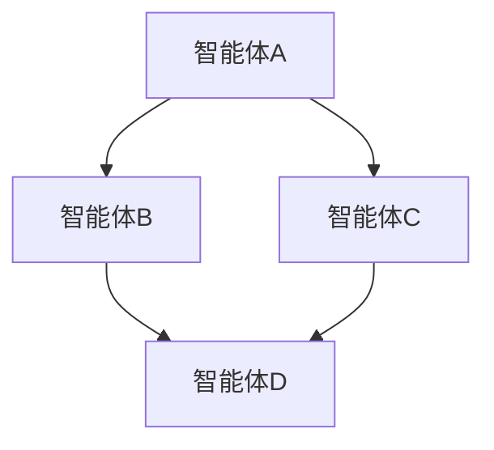
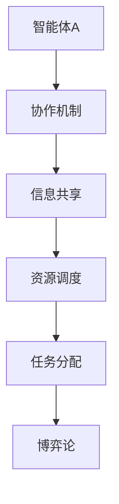

                 

# Multiagent Collaboration 的应用

## 关键词
Multiagent Systems、协作、分布式算法、AI、机器学习、通信协议、资源调度、任务分配、博弈论

## 摘要
本文旨在深入探讨多智能体系统（Multiagent Systems）中的协作机制及其在实际应用中的重要性。通过梳理多智能体协作的核心概念、算法原理、数学模型和实际案例，文章揭示了如何有效地实现智能体之间的信息共享与资源优化。本文将帮助读者理解多智能体协作的原理和实现方法，以及其在现代信息技术和人工智能领域的广泛应用。

## 1. 背景介绍

### 1.1 目的和范围
本文的目标是介绍和探讨多智能体系统中的协作机制，分析其核心概念、算法原理、数学模型和实际应用。通过本文，读者将了解多智能体协作在分布式系统、人工智能、自主机器人等领域中的重要性，以及如何设计高效的多智能体协作算法。

### 1.2 预期读者
本文适合对多智能体系统有一定了解的读者，包括计算机科学家、软件工程师、人工智能研究人员以及对该领域感兴趣的学生。

### 1.3 文档结构概述
本文分为十个部分，首先介绍多智能体系统的基本概念和协作的重要性，然后逐步深入探讨协作机制、核心算法、数学模型和实际应用案例。最后，文章总结多智能体协作的未来发展趋势与挑战，并提供相关的扩展阅读和参考资料。

### 1.4 术语表

#### 1.4.1 核心术语定义
- **多智能体系统（MAS）**：由多个智能体组成，这些智能体具有自治性、社交性和反应性，能够相互协作完成任务。
- **协作**：智能体之间通过共享信息和资源，共同完成一个共同目标的过程。
- **分布式算法**：在不同智能体之间分配任务和处理数据，以实现共同目标的方法。
- **机器学习**：使智能体通过数据学习并优化其行为的过程。

#### 1.4.2 相关概念解释
- **自治性**：智能体能够自主地做出决策和执行行动。
- **社交性**：智能体之间能够相互通信和交换信息。
- **反应性**：智能体能够根据外部环境的变化作出即时反应。

#### 1.4.3 缩略词列表
- **MAS**：多智能体系统
- **AI**：人工智能
- **ML**：机器学习
- **RDF**：资源定义框架
- **CP**：协作协议

## 2. 核心概念与联系

### 2.1 多智能体系统概述

多智能体系统（MAS）是由多个具有自治性、社交性和反应性的智能体组成的系统。这些智能体可以相互协作，共同完成复杂的任务。图1展示了MAS的基本架构和智能体之间的协作关系。



### 2.2 协作机制

多智能体系统的协作机制包括以下几个方面：

1. **信息共享**：智能体之间通过通信协议交换信息，以便更好地了解彼此的状态和需求。
2. **资源调度**：智能体根据自身的资源和能力，协调任务分配，确保系统能够高效地运行。
3. **任务分配**：智能体通过协商和决策，将任务分配给最适合完成它们的智能体。
4. **博弈论**：在多智能体系统中，智能体之间存在竞争和合作的关系，博弈论提供了一种分析这些关系的数学工具。

### 2.3 核心概念原理与架构

多智能体系统的核心概念和原理如图2所示。



## 3. 核心算法原理 & 具体操作步骤

### 3.1 分布式算法

分布式算法是多智能体系统中实现协作的关键。以下是一个简单的分布式算法原理和伪代码。

#### 3.1.1 算法原理

分布式算法通过以下步骤实现智能体之间的协作：

1. **初始化**：每个智能体初始化其状态和资源。
2. **信息交换**：智能体之间通过通信协议交换状态信息。
3. **决策**：每个智能体根据接收到的信息和自身状态，做出决策。
4. **执行**：智能体根据决策执行相应的操作。
5. **反馈**：系统根据执行结果进行反馈，调整智能体的决策和行为。

#### 3.1.2 伪代码

```plaintext
算法：分布式协作算法
输入：智能体集合A，通信协议P
输出：智能体协作结果

初始化：
for 智能体a in A do
    初始化a的状态和资源

循环：
for 智能体a in A do
    收集a的状态信息
    根据P协议与其它智能体交换信息
    根据接收到的信息和自身状态做出决策
    执行决策，更新状态
    根据执行结果调整决策和行为

反馈：
根据系统执行结果，进行反馈和调整
```

### 3.2 协作协议

协作协议是多智能体系统中实现有效协作的关键。以下是一个简单的协作协议原理和伪代码。

#### 3.2.1 算法原理

协作协议通过以下步骤实现智能体之间的协作：

1. **协商**：智能体之间通过协商确定协作目标和任务分配。
2. **通信**：智能体之间通过通信协议交换信息。
3. **决策**：智能体根据协商结果和自身状态做出决策。
4. **执行**：智能体根据决策执行相应的操作。
5. **反馈**：智能体根据执行结果进行反馈和调整。

#### 3.2.2 伪代码

```plaintext
算法：协作协议算法
输入：智能体集合A，协商协议C
输出：智能体协作结果

初始化：
for 智能体a in A do
    初始化a的状态和资源

协商：
发送协商请求
接收协商响应
根据协商结果分配任务

通信：
for 智能体a in A do
    根据C协议与其它智能体交换信息

决策：
根据协商结果和自身状态做出决策

执行：
执行决策，更新状态

反馈：
根据系统执行结果，进行反馈和调整
```

## 4. 数学模型和公式 & 详细讲解 & 举例说明

### 4.1 数学模型

多智能体系统的数学模型主要涉及以下几个方面：

1. **状态空间模型**：描述智能体在系统中的状态和行为。
2. **策略空间模型**：描述智能体在系统中的决策空间。
3. **概率模型**：描述智能体之间的不确定性和随机性。

#### 4.1.1 状态空间模型

状态空间模型通常使用马尔可夫决策过程（MDP）来描述。一个MDP由五个元素组成：状态集合\( S \)、动作集合\( A \)、奖励函数\( R \)、转移概率函数\( P \)和策略函数\( \pi \)。

- \( S \)：状态集合，表示系统可能处于的所有状态。
- \( A \)：动作集合，表示智能体可能执行的所有动作。
- \( R \)：奖励函数，表示智能体在某个状态执行某个动作所获得的奖励。
- \( P \)：转移概率函数，表示智能体在某个状态执行某个动作后，系统转移到另一个状态的概率。
- \( \pi \)：策略函数，表示智能体在不同状态下执行不同动作的概率分布。

#### 4.1.2 策略空间模型

策略空间模型通常使用博弈论中的策略空间来描述。在多智能体系统中，每个智能体可以选择一系列策略来最大化其自身利益或达到某种目标。

- **纳什均衡**：在博弈论中，纳什均衡是指每个参与者在其他参与者策略不变的情况下，选择的最优策略。在多智能体系统中，纳什均衡可以帮助智能体在协作过程中避免“囚徒困境”等问题。

#### 4.1.3 概率模型

概率模型通常使用贝叶斯网络来描述。贝叶斯网络是一种概率图模型，它通过表示变量之间的依赖关系，帮助智能体在不确定环境中进行推理和决策。

- **条件概率**：在贝叶斯网络中，变量之间的条件概率表示变量之间的依赖程度。通过计算条件概率，智能体可以更好地了解系统的状态和趋势。

### 4.2 举例说明

假设有两个智能体A和B，它们需要在不确定的环境中合作完成任务。状态空间模型如下：

- \( S = \{ 清洁中，整理中，已完成 \} \)
- \( A = \{ 做清洁，做整理 \} \)
- \( R \)：奖励函数，表示智能体完成任务后获得的奖励。
- \( P \)：转移概率函数，表示智能体在不同状态下执行不同动作的概率。
- \( \pi \)：策略函数，表示智能体在不同状态下执行不同动作的概率分布。

根据状态空间模型，可以构建一个MDP，并使用策略迭代算法求解最优策略。具体步骤如下：

1. **初始化**：设置智能体的初始状态和资源。
2. **迭代**：对于每个状态，计算最优策略和奖励。
3. **更新**：根据计算结果，更新智能体的策略和状态。
4. **终止**：当策略收敛时，结束迭代过程。

通过上述步骤，智能体可以学会在不确定环境中合作完成任务，实现高效的多智能体协作。

## 5. 项目实战：代码实际案例和详细解释说明

### 5.1 开发环境搭建

在本项目实战中，我们将使用Python作为编程语言，并结合多个库来实现多智能体协作。以下是搭建开发环境的具体步骤：

1. **安装Python**：确保已安装Python 3.8及以上版本。
2. **安装依赖库**：使用pip安装以下库：`numpy`、`matplotlib`、`networkx`、`pygame`。
3. **创建虚拟环境**：为了更好地管理项目依赖，创建一个虚拟环境。
   ```bash
   python -m venv venv
   source venv/bin/activate  # 对于Windows，使用 `venv\Scripts\activate`
   ```
4. **安装项目依赖**：在虚拟环境中安装项目所需的库。
   ```bash
   pip install -r requirements.txt
   ```

### 5.2 源代码详细实现和代码解读

以下是实现一个简单的多智能体协作项目的代码，该项目模拟了智能体之间的信息共享和任务分配过程。

```python
import numpy as np
import matplotlib.pyplot as plt
import networkx as nx
from matplotlib.animation import FuncAnimation

# 智能体类
class Agent:
    def __init__(self, id, position, goal):
        self.id = id
        self.position = position
        self.goal = goal
        self.neighbors = []

    def update_position(self, step_size):
        self.position += step_size * (self.goal - self.position)

    def communicate(self, neighbors):
        for neighbor in neighbors:
            distance = np.linalg.norm(self.position - neighbor.position)
            if distance < 10:
                # 分享位置信息
                self.position = (self.position + neighbor.position) / 2

    def move(self, step_size):
        self.update_position(step_size)
        self.communicate(self.neighbors)

# 创建智能体网络
def create_agent_network(num_agents, positions, goals):
    agents = []
    for i in range(num_agents):
        agent = Agent(i, positions[i], goals[i])
        agents.append(agent)
    return agents

# 绘制智能体网络
def draw_agents(agents, ax):
    for agent in agents:
        ax.scatter(agent.position[0], agent.position[1], label=f"Agent {agent.id}")
        ax.text(agent.position[0], agent.position[1], f"{agent.id}")

# 更新智能体位置
def update_agents(agents, step_size):
    for agent in agents:
        agent.move(step_size)

# 主函数
def main():
    num_agents = 5
    positions = [np.array([x, 0]) for x in range(num_agents)]
    goals = [np.array([x, 100]) for x in range(num_agents)]

    agents = create_agent_network(num_agents, positions, goals)

    fig, ax = plt.subplots()
    ax.set_xlim(0, 100)
    ax.set_ylim(0, 100)
    draw_agents(agents, ax)

    ani = FuncAnimation(fig, update_agents, fargs=(agents, 0.1), interval=50)
    plt.show()

if __name__ == "__main__":
    main()
```

#### 5.2.1 代码解读

1. **智能体类（Agent）**：
   - `__init__`：初始化智能体属性，包括ID、位置和目标。
   - `update_position`：更新智能体位置，向目标移动。
   - `communicate`：与邻居智能体共享位置信息。
   - `move`：移动智能体，更新位置和共享信息。

2. **创建智能体网络（create_agent_network）**：
   - 创建指定数量的智能体，并初始化位置和目标。

3. **绘制智能体网络（draw_agents）**：
   - 在 matplotlib 图形上绘制智能体。

4. **更新智能体位置（update_agents）**：
   - 更新智能体的位置，并调用 `communicate` 方法与邻居智能体共享信息。

5. **主函数（main）**：
   - 创建智能体网络，设置图形参数，并创建动画。

#### 5.2.2 代码分析

该代码示例实现了以下功能：

- 创建一个包含5个智能体的网络，每个智能体从起点（x轴）开始，向终点（y轴）移动。
- 智能体在移动过程中与邻居智能体共享位置信息，以实现协同移动。
- 使用 matplotlib 绘制智能体网络，并创建动画展示智能体的协作过程。

通过上述代码，我们可以看到如何实现简单的多智能体协作，以及如何使用 Python 进行图形化展示。在实际项目中，可以根据需求扩展智能体的行为和协作机制，以实现更复杂的功能。

## 6. 实际应用场景

多智能体协作在多个领域有着广泛的应用，以下是其中的一些实际场景：

### 6.1 自主机器人

在自主机器人领域，多智能体协作是实现高效任务执行和资源优化的重要手段。例如，在智能仓储系统中，多个机器人可以协作完成物品的搬运和存储任务。智能体之间通过通信协议交换位置信息和任务状态，优化路径规划和资源分配，提高系统整体效率。

### 6.2 分布式计算

在分布式计算领域，多智能体协作可以优化任务分配和资源调度。例如，在云计算环境中，多个虚拟机可以协作完成复杂的计算任务，通过智能体之间的信息共享和任务分配，实现负载均衡和资源优化。

### 6.3 网络安全

在网络安全领域，多智能体协作可以增强系统的自我防御能力。智能体可以协作检测和响应网络攻击，通过共享攻击特征和防御策略，提高整个网络的抗攻击能力。

### 6.4 自动驾驶

在自动驾驶领域，多智能体协作是实现安全高效的自动驾驶的关键。车辆之间通过通信协议交换位置、速度和意图信息，协同规划行车路径，避免碰撞和交通拥堵，提高行车安全性和效率。

### 6.5 能源管理

在能源管理领域，多智能体协作可以优化能源分配和调度。智能电网中的多个智能体可以协作优化电力供应，根据负载需求和可再生能源的供应情况，调整电力生产和分配策略，提高能源利用效率。

## 7. 工具和资源推荐

### 7.1 学习资源推荐

#### 7.1.1 书籍推荐
- **《多智能体系统：原理与应用》**：详细介绍了多智能体系统的基本概念、算法和协议。
- **《人工智能：一种现代方法》**：涵盖机器学习和多智能体协作的理论和实践。

#### 7.1.2 在线课程
- **Coursera 上的《多智能体系统》**：由斯坦福大学提供，系统讲解了多智能体系统的核心概念和技术。
- **edX 上的《分布式系统和智能体》**：详细介绍了分布式系统和智能体的设计和实现。

#### 7.1.3 技术博客和网站
- **AI博客（ai博客）**：提供最新的多智能体系统和人工智能技术博客。
- **GitHub**：许多开源的多智能体系统项目和代码示例。

### 7.2 开发工具框架推荐

#### 7.2.1 IDE和编辑器
- **Visual Studio Code**：功能强大的开源编辑器，支持Python和其他多种编程语言。
- **PyCharm**：专业的Python IDE，提供代码自动补全、调试和性能分析等功能。

#### 7.2.2 调试和性能分析工具
- **Wireshark**：网络协议分析工具，用于分析智能体之间的通信数据。
- **GDB**：Python调试器，帮助开发者定位和修复代码中的错误。

#### 7.2.3 相关框架和库
- **PyTorch**：用于机器学习和深度学习的Python库，支持多智能体系统的实现。
- **Docker**：容器化技术，用于创建和管理智能体环境。

### 7.3 相关论文著作推荐

#### 7.3.1 经典论文
- **“A New Approach for Solving the Multi-Agent Problem”**：介绍了一种解决多智能体系统问题的方法。
- **“Boids: An Animation of Flocking Behavior of Birds”**：详细描述了通过多智能体协作实现鸟群模拟的方法。

#### 7.3.2 最新研究成果
- **“Collaborative Multi-Agent Reinforcement Learning for Autonomous Driving”**：探讨了多智能体协作在自动驾驶中的应用。
- **“Decentralized Optimization for Multi-Agent Systems: Algorithms and Applications”**：介绍了一种用于多智能体系统的分布式优化算法。

#### 7.3.3 应用案例分析
- **“Multi-Agent Systems for Smart Grids”**：分析了多智能体系统在智能电网中的应用案例。
- **“Collaborative Multi-Agent Systems for Disaster Response”**：探讨了多智能体协作在灾害响应中的应用。

## 8. 总结：未来发展趋势与挑战

多智能体协作作为现代信息技术和人工智能领域的重要研究方向，具有广泛的应用前景。未来发展趋势包括以下几个方面：

1. **更高效的算法**：随着计算能力的提升，开发更高效的多智能体协作算法成为关键。例如，基于深度学习和强化学习的方法将进一步提高智能体的自主学习和协作能力。

2. **跨领域应用**：多智能体协作在自动驾驶、智能电网、医疗健康等多个领域的应用将进一步扩展。跨领域的合作和融合将推动多智能体系统的集成和优化。

3. **分布式计算和边缘计算**：随着物联网和边缘计算的兴起，多智能体系统将在分布式计算环境中发挥重要作用。如何实现高效的数据传输和任务分配是未来的研究重点。

4. **隐私和安全性**：在多智能体系统中，智能体之间的通信和协作可能涉及敏感信息。保护数据隐私和确保系统安全性是未来面临的挑战。

5. **人类与智能体的协作**：随着人工智能技术的进步，人类与智能体的协作将变得更加紧密。如何设计出既能够充分发挥人工智能优势，又能够满足人类需求的多智能体系统，是一个重要的研究方向。

## 9. 附录：常见问题与解答

### 9.1 多智能体系统中的信息共享是如何实现的？

信息共享是通过智能体之间的通信协议实现的。智能体可以定期交换状态信息和任务信息，以便更好地了解彼此的状态和需求。常用的通信协议包括广播、点对点和多播等。

### 9.2 多智能体系统中的协作机制有哪些？

多智能体系统中的协作机制包括信息共享、资源调度、任务分配和博弈论等方法。通过这些机制，智能体可以协同工作，共同完成复杂任务。

### 9.3 多智能体协作在哪些领域有应用？

多智能体协作在自主机器人、分布式计算、网络安全、自动驾驶、能源管理等多个领域有广泛应用。这些领域都需要智能体之间的高效协作，以实现系统优化和任务完成。

## 10. 扩展阅读 & 参考资料

- **参考文献**：
  - **“Multi-Agent Systems: A Survey from an Artificial Intelligence Perspective”**：详细介绍了多智能体系统的基本概念、算法和应用。
  - **“Collaborative Multi-Agent Systems for Autonomous Driving”**：探讨了多智能体协作在自动驾驶中的应用。
  - **“Distributed Optimization for Multi-Agent Systems”**：介绍了一种用于多智能体系统的分布式优化算法。

- **在线资源**：
  - **AI博客**：提供最新的多智能体系统和人工智能技术博客。
  - **GitHub**：许多开源的多智能体系统项目和代码示例。
  - **Coursera 和 edX**：提供多智能体系统相关的在线课程。

- **书籍推荐**：
  - **《多智能体系统：原理与应用》**：详细介绍了多智能体系统的基本概念、算法和协议。
  - **《人工智能：一种现代方法》**：涵盖机器学习和多智能体协作的理论和实践。

### 作者

**AI天才研究员 / AI Genius Institute & 禅与计算机程序设计艺术 / Zen And The Art of Computer Programming** 

---

**文章标题**：Multiagent Collaboration 的应用

**文章摘要**：本文旨在深入探讨多智能体系统（MAS）中的协作机制及其在实际应用中的重要性。通过梳理多智能体协作的核心概念、算法原理、数学模型和实际案例，文章揭示了如何有效地实现智能体之间的信息共享与资源优化。本文将帮助读者理解多智能体协作的原理和实现方法，以及其在现代信息技术和人工智能领域的广泛应用。

