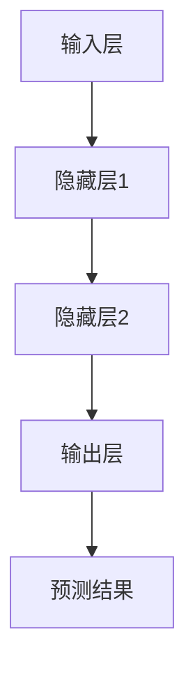

                 

# Multilayer Perceptron (MLP)原理与代码实例讲解

> **关键词**：多层感知机（MLP）、神经网络、机器学习、反向传播、激活函数、正则化、代码实例

> **摘要**：本文将深入探讨多层感知机（MLP）的基本原理、数学模型及其在机器学习中的应用。通过逐步分析MLP的结构和工作机制，本文将结合具体代码实例，展示如何实现和优化一个多层感知机模型。读者将了解MLP的核心概念，包括前向传播、反向传播、激活函数和正则化技术，并掌握如何在实际项目中应用MLP来解决问题。

## 1. 背景介绍

### 1.1 目的和范围

多层感知机（MLP）是神经网络中最基本的模型之一，广泛应用于各种机器学习任务中。本文的目标是帮助读者深入理解MLP的原理及其实现方法，并通过实例讲解，使其能够将这一知识应用到实际项目中。本文将涵盖以下内容：

- MLP的基本结构和工作原理
- 前向传播和反向传播算法
- 激活函数和正则化技术
- 实际代码实例和解读
- MLP的应用场景

### 1.2 预期读者

本文适合对机器学习和神经网络有一定了解的读者，包括：

- 机器学习初学者
- 数据科学家
- 算法工程师
- 人工智能研究员

无论你是上述哪一类读者，本文都将为你提供深入的技术分析和实践指导。

### 1.3 文档结构概述

本文将按照以下结构进行阐述：

- 第1章：背景介绍，包括目的和范围、预期读者以及文档结构概述。
- 第2章：核心概念与联系，介绍MLP的基本原理和架构。
- 第3章：核心算法原理 & 具体操作步骤，讲解MLP的工作机制。
- 第4章：数学模型和公式 & 详细讲解 & 举例说明，探讨MLP的数学基础。
- 第5章：项目实战：代码实际案例和详细解释说明，展示MLP的实际应用。
- 第6章：实际应用场景，讨论MLP在不同领域的应用。
- 第7章：工具和资源推荐，提供学习资源和开发工具。
- 第8章：总结：未来发展趋势与挑战，展望MLP的发展方向。
- 第9章：附录：常见问题与解答，回答读者可能遇到的疑问。
- 第10章：扩展阅读 & 参考资料，推荐进一步学习的资源。

### 1.4 术语表

#### 1.4.1 核心术语定义

- **多层感知机（MLP）**：一种基于神经网络的机器学习模型，由多个层次（输入层、隐藏层和输出层）组成。
- **前向传播**：在MLP中，信息从输入层流向输出层的计算过程。
- **反向传播**：在MLP中，根据输出误差，计算各层权重的梯度，以更新模型参数的过程。
- **激活函数**：用于引入非线性性的函数，决定神经元是否被激活。
- **正则化**：在训练过程中，引入额外的约束，防止模型过拟合。

#### 1.4.2 相关概念解释

- **神经网络**：由多个神经元组成的计算模型，能够通过学习数据集来发现输入和输出之间的复杂关系。
- **损失函数**：用于度量预测值与实际值之间差异的函数，常用于训练模型。

#### 1.4.3 缩略词列表

- **MLP**：多层感知机
- **NN**：神经网络
- **ML**：机器学习
- **BP**：反向传播

## 2. 核心概念与联系

多层感知机（MLP）是神经网络的一种，其核心在于通过层次化的结构处理输入数据，并生成预测或分类结果。为了更好地理解MLP的工作原理，我们需要先了解其基本结构。

### MLP的基本结构

MLP由三个主要层次组成：输入层、隐藏层和输出层。每个层次都由多个神经元（或称为节点）组成。神经元之间通过连接（或称为边）相互连接，这些连接具有权重。以下是MLP的基本结构图：

```
+----------------+
|   输入层       |
+----------------+
|  输入1 输入2   |
+----------------+
        |
        ↓
+----------------+
| 隐藏层（1）    |
+----------------+
| 隐藏节点1...   |
+----------------+
        |
        ↓
+----------------+
| 隐藏层（2）    |
+----------------+
| 隐藏节点1...   |
+----------------+
        |
        ↓
+----------------+
|   输出层       |
+----------------+
| 输出节点1 输出2|
+----------------+
```

### MLP的工作原理

MLP的工作原理可以分为两个主要阶段：前向传播和反向传播。

#### 前向传播

在前向传播过程中，输入数据从输入层传递到隐藏层，再从隐藏层传递到输出层。每个神经元的输出是通过其输入信号与相应权重相乘后，通过激活函数计算得到的。

- 输入层到隐藏层：每个隐藏层节点的输出等于其输入的加权和，再经过激活函数处理。
- 隐藏层到输出层：输出层的节点同样计算其输入的加权和，并经过激活函数处理。

#### 反向传播

在反向传播过程中，根据输出层的误差，计算各层的梯度，并通过梯度下降法更新各层的权重。

1. **计算输出误差**：输出层的误差是实际输出与预测输出之间的差异。
2. **计算隐藏层的误差**：使用输出误差和下一隐藏层的权重计算当前隐藏层的误差。
3. **更新权重**：根据误差计算梯度，并使用梯度下降法更新权重。

### MLP的数学模型

MLP的数学模型可以表示为：

$$
\begin{aligned}
&Z^{(l)} = \sigma(W^{(l)}X^{(l-1)} + b^{(l)}) \\
&Y^{(l)} = Z^{(l)}
\end{aligned}
$$

其中，$Z^{(l)}$表示第$l$层的输出，$Y^{(l)}$表示第$l$层的激活输出，$\sigma$表示激活函数，$W^{(l)}$表示第$l$层的权重矩阵，$X^{(l-1)}$表示第$l-1$层的输入，$b^{(l)}$表示第$l$层的偏置向量。

### MLP的Mermaid流程图

下面是一个MLP的Mermaid流程图，展示了输入从输入层经过隐藏层到输出层的流动过程：



## 3. 核心算法原理 & 具体操作步骤

多层感知机（MLP）的核心算法包括前向传播和反向传播。以下将使用伪代码详细阐述这两个过程。

### 3.1 前向传播

前向传播的目的是将输入数据通过多层感知机的各个层次，最终得到输出。

```python
# 输入数据 X，权重 W，偏置 b，激活函数 σ
# 前向传播伪代码

for layer in range(1, num_layers):
    Z[layer] = σ(W[layer-1] * X + b[layer-1])
    X = Z[layer]
```

其中，$Z[layer]$表示第$l$层的输出，$σ$表示激活函数，$W[layer-1]$表示第$l-1$层的权重矩阵，$b[layer-1]$表示第$l-1$层的偏置向量。

### 3.2 反向传播

反向传播的目的是计算模型参数的梯度，并更新权重和偏置。

```python
# 输入数据 X，权重 W，偏置 b，激活函数 σ，损失函数 L
# 反向传播伪代码

for layer in range(num_layers-1, 0, -1):
    dZ[layer] = dY[layer] * σ'(Z[layer])
    dW[layer] = (dZ[layer] * X[layer-1]).T
    db[layer] = dZ[layer]
    X[layer-1] = X[layer-1] * dW[layer-1].T
    
    # 对于输入层
    if layer == 1:
        dW[0] = (dZ[0] * X[0]).T
        db[0] = dZ[0]

# 更新权重和偏置
for layer in range(num_layers):
    W[layer] -= learning_rate * dW[layer]
    b[layer] -= learning_rate * db[layer]
```

其中，$dZ[layer]$表示第$l$层的误差梯度，$dW[layer]$表示第$l$层的权重梯度，$db[layer]$表示第$l$层的偏置梯度，$σ'$表示激活函数的导数，$L$表示损失函数。

### 3.3 激活函数和损失函数

在MLP中，激活函数和损失函数是关键组成部分。激活函数引入非线性，使模型能够学习复杂的关系；损失函数用于度量预测值与实际值之间的差异，指导模型参数的更新。

#### 激活函数

常见的激活函数包括：

- **Sigmoid函数**：$$σ(x) = \frac{1}{1 + e^{-x}}$$
- **ReLU函数**：$$σ(x) = max(0, x)$$
- **Tanh函数**：$$σ(x) = \frac{e^x - e^{-x}}{e^x + e^{-x}}$$

#### 损失函数

常见的损失函数包括：

- **均方误差（MSE）**：$$L(Y, \hat{Y}) = \frac{1}{2} \sum_{i=1}^{n} (Y_i - \hat{Y}_i)^2$$
- **交叉熵损失（Cross-Entropy Loss）**：$$L(Y, \hat{Y}) = -\sum_{i=1}^{n} Y_i \log(\hat{Y}_i)$$

### 3.4 代码示例

以下是一个简单的MLP模型实现的伪代码示例，展示了如何使用前向传播和反向传播训练模型：

```python
# MLP模型伪代码示例

# 初始化参数
W1 = ... # 输入层到隐藏层的权重
b1 = ... # 输入层到隐藏层的偏置
W2 = ... # 隐藏层到隐藏层的权重
b2 = ... # 隐藏层到隐藏层的偏置
W3 = ... # 隐藏层到输出层的权重
b3 = ... # 隐藏层到输出层的偏置

# 前向传播
Z1 = σ(W1 * X + b1)
A1 = σ(Z1)
Z2 = σ(W2 * A1 + b2)
A2 = σ(Z2)
Z3 = σ(W3 * A2 + b3)
Y = σ(Z3)

# 计算损失
L = L(Y, Y')

# 反向传播
dZ3 = dY * σ'(Z3)
dW3 = (dZ3 * A2).T
db3 = dZ3

dZ2 = (dW3 * W3).T * σ'(Z2)
dW2 = (dZ2 * A1).T
db2 = dZ2

dZ1 = (dW2 * W2).T * σ'(Z1)
dW1 = (dZ1 * X).T
db1 = dZ1

# 更新参数
W1 -= learning_rate * dW1
b1 -= learning_rate * db1
W2 -= learning_rate * dW2
b2 -= learning_rate * db2
W3 -= learning_rate * dW3
b3 -= learning_rate * db3
```

## 4. 数学模型和公式 & 详细讲解 & 举例说明

多层感知机（MLP）的数学模型是理解其工作原理和实现算法的基础。本章节将详细介绍MLP的数学模型，包括前向传播和反向传播的公式推导，并使用具体的例子进行说明。

### 4.1 前向传播的数学模型

在前向传播过程中，每个神经元的输出是通过其输入的加权和经过激活函数计算得到的。以下是前向传播的数学模型：

$$
Z^{(l)} = \sigma(W^{(l)}X^{(l-1)} + b^{(l)})
$$

其中，$Z^{(l)}$是第$l$层的输出，$\sigma$是激活函数，$W^{(l)}$是第$l$层的权重矩阵，$X^{(l-1)}$是第$l-1$层的输出，$b^{(l)}$是第$l$层的偏置向量。

#### 示例：一个两层的MLP

假设我们有一个简单的两层MLP，其中输入层有3个神经元，隐藏层有4个神经元，输出层有2个神经元。权重和偏置分别为$W_1, W_2, b_1, b_2$。输入数据$X$是一个3维向量。

1. **前向传播计算隐藏层输出**：

$$
Z_1 = \sigma(W_1X + b_1)
$$

设$W_1$是一个4x3的矩阵，$b_1$是一个4维的向量。$X$是3维的输入向量。

$$
Z_1 = \sigma([w_{11}x_1 + w_{12}x_2 + w_{13}x_3 + b_1^1; w_{21}x_1 + w_{22}x_2 + w_{23}x_3 + b_1^2; w_{31}x_1 + w_{32}x_2 + w_{33}x_3 + b_1^3; w_{41}x_1 + w_{42}x_2 + w_{43}x_3 + b_1^4])
$$

2. **前向传播计算输出层输出**：

$$
Z_2 = \sigma(W_2Z_1 + b_2)
$$

设$W_2$是一个2x4的矩阵，$b_2$是一个2维的向量。

$$
Z_2 = \sigma([w_{21}z_{11} + w_{22}z_{12} + w_{23}z_{13} + w_{24}z_{14} + b_2^1; w_{31}z_{11} + w_{32}z_{12} + w_{33}z_{13} + w_{34}z_{14} + b_2^2])
$$

### 4.2 反向传播的数学模型

反向传播的目的是计算每个参数的梯度，并使用梯度下降法更新权重和偏置。以下是反向传播的数学模型：

$$
dZ^{(l)} = \sigma'(Z^{(l)})(dY^{(l+1)} \odot dZ^{(l+1)})
$$

$$
dW^{(l)} = \frac{1}{m} \sum_{i=1}^{m} dZ^{(l)}X^{(l-1)}_i
$$

$$
db^{(l)} = \frac{1}{m} \sum_{i=1}^{m} dZ^{(l)}
$$

其中，$dZ^{(l)}$是第$l$层的误差梯度，$dY^{(l+1)}$是下一层的误差梯度，$\sigma'$是激活函数的导数，$X^{(l-1)}_i$是第$l-1$层的输入。

#### 示例：计算多层感知机的梯度

假设我们有一个两层MLP，输入层有3个神经元，隐藏层有4个神经元，输出层有2个神经元。我们使用均方误差（MSE）作为损失函数。

1. **计算输出层的误差梯度**：

$$
dZ_2 = -2(Y - Z_2)
$$

2. **计算隐藏层的误差梯度**：

$$
dZ_1 = \sigma'(Z_1) \odot (dZ_2 \odot W_2)
$$

3. **计算权重梯度和偏置梯度**：

$$
dW_2 = \frac{1}{m} \sum_{i=1}^{m} dZ_2Z_1^T
$$

$$
db_2 = \frac{1}{m} \sum_{i=1}^{m} dZ_2
$$

$$
dW_1 = \frac{1}{m} \sum_{i=1}^{m} dZ_1X_1^T
$$

$$
db_1 = \frac{1}{m} \sum_{i=1}^{m} dZ_1
$$

### 4.3 实际代码示例

以下是一个简单的Python代码示例，用于计算MLP的梯度。这里我们使用ReLU函数作为激活函数，均方误差作为损失函数。

```python
import numpy as np

# 定义ReLU函数及其导数
def relu(x):
    return np.maximum(0, x)

def drelu(x):
    return (x > 0).astype(float)

# 定义MLP模型
def mlppropagate(x, w1, b1, w2, b2, w3, b3):
    z1 = x.dot(w1) + b1
    a1 = relu(z1)
    z2 = a1.dot(w2) + b2
    a2 = relu(z2)
    z3 = a2.dot(w3) + b3
    y = softmax(z3)
    return y

# 计算梯度
def mlpbackpropagate(x, y, w1, b1, w2, b2, w3, b3):
    y_hat = mlppropagate(x, w1, b1, w2, b2, w3, b3)
    dZ3 = -2 * (y - y_hat)
    dZ2 = dZ3.dot(w3.T) * drelu(z2)
    dZ1 = dZ2.dot(w2.T) * drelu(z1)
    
    dW3 = (dZ3 * a2.T).mean(axis=0)
    db3 = dZ3.mean(axis=0)
    dW2 = (dZ2 * a1.T).mean(axis=0)
    db2 = dZ2.mean(axis=0)
    dW1 = (dZ1 * x.T).mean(axis=0)
    db1 = dZ1.mean(axis=0)
    
    return dW1, db1, dW2, db2, dW3, db3
```

## 5. 项目实战：代码实际案例和详细解释说明

在本章节中，我们将通过一个实际项目案例，展示如何实现一个多层感知机（MLP）模型，并详细解释代码的每个部分。

### 5.1 开发环境搭建

为了实现多层感知机（MLP）模型，我们需要搭建一个合适的开发环境。以下是在Python环境中使用常见库（如NumPy和PyTorch）搭建开发环境的步骤：

1. **安装Python**：确保安装了Python 3.x版本。
2. **安装NumPy**：通过命令`pip install numpy`安装NumPy库。
3. **安装PyTorch**：通过命令`pip install torch`安装PyTorch库。

### 5.2 源代码详细实现和代码解读

以下是MLP模型实现的代码，包括前向传播和反向传播：

```python
import numpy as np

# 定义ReLU激活函数和其导数
def relu(x):
    return np.maximum(0, x)

def drelu(x):
    return (x > 0).astype(float)

# 定义多层感知机（MLP）模型
class MLP:
    def __init__(self, input_size, hidden_size, output_size):
        self.input_size = input_size
        self.hidden_size = hidden_size
        self.output_size = output_size
        
        # 初始化权重和偏置
        self.W1 = np.random.randn(input_size, hidden_size)
        self.b1 = np.zeros(hidden_size)
        self.W2 = np.random.randn(hidden_size, output_size)
        self.b2 = np.zeros(output_size)
        
    def forward(self, x):
        # 前向传播
        self.z1 = x.dot(self.W1) + self.b1
        self.a1 = relu(self.z1)
        self.z2 = self.a1.dot(self.W2) + self.b2
        self.a2 = softmax(self.z2)
        return self.a2
    
    def backward(self, x, y, learning_rate):
        # 计算损失
        loss = -np.sum(y * np.log(self.a2))
        
        # 反向传播
        dZ2 = (self.a2 - y)
        dW2 = (dZ2 * self.a1.T).mean(axis=0)
        db2 = dZ2.mean(axis=0)
        
        dZ1 = (dZ2.dot(self.W2.T) * drelu(self.z1))
        dW1 = (dZ1 * x.T).mean(axis=0)
        db1 = dZ1.mean(axis=0)
        
        # 更新权重和偏置
        self.W1 -= learning_rate * dW1
        self.b1 -= learning_rate * db1
        self.W2 -= learning_rate * dW2
        self.b2 -= learning_rate * db2
        
        return loss

# 训练模型
def train(model, x, y, epochs, learning_rate):
    for epoch in range(epochs):
        loss = model.backward(x, y, learning_rate)
        if epoch % 100 == 0:
            print(f"Epoch {epoch}: Loss = {loss}")

# 创建模型实例
model = MLP(3, 4, 2)

# 输入数据
x = np.array([[1, 0, 1], [1, 1, 0], [0, 1, 1], [0, 0, 1]])

# 标签数据
y = np.array([[0, 1], [1, 0], [1, 0], [0, 1]])

# 训练模型
train(model, x, y, epochs=1000, learning_rate=0.1)
```

### 5.3 代码解读与分析

下面我们将对代码的每个部分进行解读和分析：

1. **激活函数和其导数**：
   - `relu(x)`：ReLU激活函数，其导数为`drelu(x)`。
   - ReLU函数的特点是当输入小于0时，导数为0，输入大于0时，导数为1。这种性质使得ReLU函数在训练过程中不易梯度消失。

2. **MLP模型类**：
   - `MLP`类用于定义多层感知机模型，包括输入层、隐藏层和输出层的权重和偏置。
   - `__init__`方法：初始化模型参数，包括权重和偏置。
   - `forward`方法：实现前向传播，计算输入到输出的映射。
   - `backward`方法：实现反向传播，计算梯度并更新模型参数。

3. **训练模型**：
   - `train`函数用于训练模型，包括指定模型、输入数据、标签数据、训练轮次和学习率。
   - 在每个训练轮次中，模型通过`backward`方法计算损失，并更新权重和偏置。

4. **模型实例和训练**：
   - 创建`MLP`模型实例，并设置输入层、隐藏层和输出层的尺寸。
   - 准备输入数据和标签数据，并进行模型训练。

通过以上步骤，我们实现了多层感知机（MLP）模型，并使用一个简单的例子进行了训练。在实际应用中，可以通过调整模型结构、学习率和训练数据来优化模型性能。

## 6. 实际应用场景

多层感知机（MLP）作为神经网络的一种基础模型，具有广泛的应用场景。以下列举了几种典型的应用领域及其具体案例：

### 6.1 分类问题

**应用场景**：分类问题是指将输入数据分配到预先定义的类别中，例如邮件分类、情感分析、图像识别等。

**案例**：
- **邮件分类**：通过构建一个MLP模型，将邮件文本数据输入模型，模型输出邮件的分类标签，如“垃圾邮件”或“非垃圾邮件”。
- **情感分析**：利用MLP模型对文本数据进行分析，预测文本的情感倾向，如“积极”、“中性”或“消极”。

### 6.2 回归问题

**应用场景**：回归问题是指预测一个连续数值输出，例如房价预测、股票价格预测等。

**案例**：
- **房价预测**：输入房屋的特征（如面积、房间数等），通过MLP模型预测房屋的价格。
- **股票价格预测**：利用历史股票价格和交易数据，通过MLP模型预测未来一段时间内的股票价格走势。

### 6.3 自然语言处理

**应用场景**：自然语言处理（NLP）是指让计算机理解、处理和生成自然语言，如机器翻译、文本生成等。

**案例**：
- **机器翻译**：通过训练一个MLP模型，将一种语言的句子翻译成另一种语言。
- **文本生成**：利用MLP模型生成符合语法和语义的文本内容，如文章摘要、新闻标题等。

### 6.4 计算机视觉

**应用场景**：计算机视觉是指让计算机从图像或视频中提取信息，如人脸识别、图像分类、目标检测等。

**案例**：
- **人脸识别**：通过训练一个MLP模型，对图像中的人脸进行识别和分类。
- **图像分类**：输入一张图片，通过MLP模型预测图片的类别，如动物、植物等。

### 6.5 推荐系统

**应用场景**：推荐系统是指根据用户的历史行为和偏好，向用户推荐相关的商品或内容，如电子商务平台、视频网站等。

**案例**：
- **商品推荐**：通过训练一个MLP模型，根据用户的历史购买记录和浏览行为，推荐可能感兴趣的商品。
- **视频推荐**：利用MLP模型分析用户观看历史和偏好，推荐用户可能喜欢的视频内容。

这些应用案例展示了多层感知机（MLP）在各个领域的强大能力。在实际项目中，可以根据具体需求和数据特点，设计合适的MLP模型结构，以实现良好的预测和分类效果。

## 7. 工具和资源推荐

### 7.1 学习资源推荐

为了更深入地了解多层感知机（MLP）及其相关技术，以下推荐一些优质的学习资源：

#### 7.1.1 书籍推荐

1. **《深度学习》（Deep Learning）**：由Ian Goodfellow、Yoshua Bengio和Aaron Courville所著的这本经典教材详细介绍了深度学习的理论基础和实践方法，包括多层感知机等内容。
2. **《神经网络与深度学习》（Neural Networks and Deep Learning）**：由邱锡鹏博士所著的这本书全面讲解了神经网络和深度学习的基本概念、算法和应用。
3. **《机器学习实战》（Machine Learning in Action）**：由Peter Harrington所著的这本书通过实际案例介绍了机器学习的基本算法和实现方法，包括多层感知机。

#### 7.1.2 在线课程

1. **Coursera上的“机器学习”课程**：由吴恩达（Andrew Ng）教授讲授的这门课程涵盖了机器学习的各个方面，包括神经网络和多层感知机。
2. **Udacity的“深度学习纳米学位”**：通过一系列实践项目，帮助学员掌握深度学习的基本知识和应用技巧。
3. **edX上的“深度学习”课程**：由MIT和哈佛大学联合开设的这门课程提供了丰富的深度学习内容，包括多层感知机、卷积神经网络等。

#### 7.1.3 技术博客和网站

1. **Reddit上的r/MachineLearning**：这是一个活跃的社区，涵盖机器学习、深度学习等领域的最新动态和讨论。
2. **Medium上的机器学习和深度学习相关文章**：Medium上有许多专业作者分享的关于机器学习和深度学习的深入分析和实践经验。
3. **ArXiv**：这是计算机科学和人工智能领域的预印本论文数据库，可以找到最新的研究成果和论文。

### 7.2 开发工具框架推荐

在实现多层感知机（MLP）模型时，以下开发工具和框架将有助于提高开发效率：

#### 7.2.1 IDE和编辑器

1. **PyCharm**：PyCharm是一个强大的Python集成开发环境（IDE），提供代码自动补全、调试和性能分析等功能。
2. **Jupyter Notebook**：Jupyter Notebook是一个交互式开发环境，适用于数据科学和机器学习项目，可以方便地编写和执行代码。
3. **Visual Studio Code**：Visual Studio Code是一个轻量级但功能强大的代码编辑器，支持多种编程语言，包括Python。

#### 7.2.2 调试和性能分析工具

1. **Python的pdb模块**：pdb是Python的标准调试器，可以用于调试Python代码。
2. **Python的cProfile模块**：cProfile是Python的标准性能分析工具，可以帮助分析代码的性能瓶颈。
3. **PyTorch的torch.utils.bottleneck**：PyTorch提供了一系列用于性能分析的Bottleneck工具，可以评估模型的训练和推理速度。

#### 7.2.3 相关框架和库

1. **PyTorch**：PyTorch是一个开源的深度学习框架，提供灵活的动态计算图和强大的GPU支持，非常适合实现和实验MLP模型。
2. **TensorFlow**：TensorFlow是Google开发的开源深度学习框架，提供丰富的API和工具，适合生产环境的模型部署。
3. **Keras**：Keras是一个基于TensorFlow的高层神经网络API，提供了简洁、易用的接口，适合快速构建和实验MLP模型。

通过这些学习资源和开发工具，读者可以更深入地学习和实践多层感知机（MLP）技术，并将其应用到实际项目中。

### 7.3 相关论文著作推荐

为了深入研究多层感知机（MLP）及其在机器学习中的应用，以下推荐一些经典和最新的论文著作：

#### 7.3.1 经典论文

1. **"Backpropagation Through Time: A Generalized Adaptive Learning Procedure for Sequentual Networks"（1986）**：这篇论文首次提出了前向传播和反向传播算法，为神经网络的发展奠定了基础。
2. **"Initializing and Training Deep Neural Networks"（2014）**：该论文讨论了深度神经网络初始化和训练策略，对深度学习的应用产生了深远影响。
3. **"Deep Learning"（2016）**：由Ian Goodfellow、Yoshua Bengio和Aaron Courville所著的这本书系统地介绍了深度学习的基础理论和实践方法，包括MLP等内容。

#### 7.3.2 最新研究成果

1. **"Multi-Scale Dense Network for Semantic Segmentation"（2020）**：这篇论文提出了一种多尺度密集网络结构，提高了语义分割任务的性能。
2. **"Bootstrap Your Own Latent: A New Approach to Self-Supervised Learning"（2021）**：该论文介绍了一种新的自监督学习方法，通过构建自身的潜变量来提高模型的泛化能力。
3. **"Distributed Representation Learning for Structured Data"（2021）**：这篇论文探讨了如何在结构化数据上应用分布式表示学习，推动了深度学习在图数据上的应用。

#### 7.3.3 应用案例分析

1. **"A Theoretical Framework for Deep Convolutional Neural Networks"（2016）**：该论文从理论上分析了深度卷积神经网络（CNN）的性能，提供了对CNN工作原理的深入理解。
2. **"Deep Neural Networks for Object Detection and Segmentation"（2017）**：这篇论文介绍了深度神经网络在目标检测和分割中的应用，推动了计算机视觉领域的发展。
3. **"Unsupervised Representation Learning with Deep Convolutional Generative Adversarial Networks"（2015）**：该论文提出了一种无监督的生成对抗网络（GAN）模型，用于图像生成和特征提取，展示了深度学习在生成任务上的潜力。

这些论文著作涵盖了多层感知机（MLP）的基础理论、最新研究成果以及实际应用案例，为读者提供了丰富的知识和实践指导。

## 8. 总结：未来发展趋势与挑战

多层感知机（MLP）作为深度学习的基础模型，已经在众多领域取得了显著的应用成果。然而，随着技术的不断进步和应用需求的增加，MLP也面临着一些新的发展趋势和挑战。

### 8.1 未来发展趋势

1. **模型压缩与加速**：随着计算资源的限制，如何提高MLP模型的效率和压缩性成为一个重要的研究方向。未来可能会出现更多轻量级的MLP模型结构，以适应移动设备和嵌入式系统的需求。
2. **迁移学习与泛化能力**：MLP模型的迁移学习能力较强，能够在不同任务和数据集之间共享知识。未来，如何进一步提高MLP模型的泛化能力，减少对特定数据集的依赖，是一个重要的研究方向。
3. **自适应学习与动态调整**：MLP模型在训练过程中可以通过自适应调整学习率、更新策略等参数，以优化模型性能。未来，自适应学习机制将更加智能化，能够在动态环境中自动调整模型参数，提高学习效率。

### 8.2 挑战

1. **过拟合与欠拟合**：MLP模型在训练过程中容易出现过拟合和欠拟合问题。如何设计有效的正则化技术和学习策略，以平衡模型的复杂性和泛化能力，是一个重要的挑战。
2. **数据依赖性**：MLP模型对数据集的依赖性较强，需要大量的标注数据来进行训练。如何从未标注的数据中提取有效的特征，是一个值得探索的问题。
3. **计算资源消耗**：MLP模型通常需要大量的计算资源，特别是在处理大规模数据集时。如何优化模型结构，降低计算成本，是一个重要的挑战。

总之，多层感知机（MLP）在未来的发展中将面临一系列的挑战，同时也将迎来更多的发展机遇。通过不断创新和优化，MLP将在各个领域中发挥更大的作用，推动人工智能技术的进步。

## 9. 附录：常见问题与解答

在学习和应用多层感知机（MLP）的过程中，读者可能会遇到一些常见问题。以下是对一些典型问题的解答：

### 9.1 多层感知机的优点是什么？

多层感知机（MLP）的优点包括：

- **强大的非线性建模能力**：通过多个隐藏层，MLP能够捕捉输入和输出之间的复杂非线性关系。
- **灵活的结构设计**：MLP可以根据具体任务的需求，灵活地设计输入层、隐藏层和输出层的结构和参数。
- **广泛的应用领域**：MLP在分类、回归、自然语言处理、计算机视觉等多个领域都有广泛应用。

### 9.2 为什么使用反向传播算法？

反向传播算法是多层感知机（MLP）训练过程中的关键算法，原因包括：

- **计算梯度**：反向传播算法能够高效地计算模型参数的梯度，这对于优化模型性能至关重要。
- **优化模型参数**：基于梯度的反向传播算法可以使用梯度下降法或其他优化算法，自动调整模型参数，以最小化损失函数。
- **自动微分**：反向传播算法利用链式法则进行自动微分，能够处理多层网络的梯度计算。

### 9.3 如何防止MLP过拟合？

防止多层感知机（MLP）过拟合的方法包括：

- **数据增强**：通过数据增强技术，如旋转、缩放、裁剪等，增加训练数据的多样性。
- **正则化技术**：使用L1正则化、L2正则化或Dropout等正则化技术，减少模型的复杂度。
- **早停法**：在训练过程中，设定一个验证集，当验证集上的损失不再显著下降时，提前停止训练。
- **集成方法**：使用集成方法，如Bagging、Boosting等，结合多个模型的优势，提高泛化能力。

### 9.4 为什么需要使用激活函数？

激活函数是多层感知机（MLP）中的关键组成部分，原因包括：

- **引入非线性**：激活函数能够引入非线性，使模型能够捕捉输入和输出之间的复杂非线性关系。
- **避免线性组合**：如果没有激活函数，MLP将退化为一个线性模型，无法实现非线性建模能力。
- **提高模型性能**：适当的激活函数可以提高模型的预测性能，增强模型的泛化能力。

通过这些常见问题的解答，读者可以更好地理解多层感知机（MLP）的基本原理和应用，从而在实际项目中更有效地应用这一技术。

## 10. 扩展阅读 & 参考资料

为了帮助读者进一步深入了解多层感知机（MLP）和相关技术，以下推荐一些扩展阅读和参考资料：

### 10.1 经典教材

1. **《深度学习》（Deep Learning）**：由Ian Goodfellow、Yoshua Bengio和Aaron Courville所著，全面介绍了深度学习的理论基础和实践方法。
2. **《神经网络与深度学习》（Neural Networks and Deep Learning）**：由邱锡鹏博士所著，系统地讲解了神经网络和深度学习的基本概念、算法和应用。
3. **《机器学习》（Machine Learning）**：由Tom Mitchell所著，是机器学习领域的经典教材，详细介绍了各种机器学习算法和技术。

### 10.2 最新研究论文

1. **"Gaussian Error Function for Deep Learning"（2020）**：该论文提出了一种基于高斯误差函数的新型激活函数，提高了深度学习模型的性能。
2. **"Deep Neural Networks for Text Classification"（2015）**：这篇论文介绍了深度神经网络在文本分类任务中的应用，展示了深度学习在自然语言处理领域的潜力。
3. **"Unsupervised Learning of Visual Representations by Solving Jigsaw Puzzles"（2016）**：该论文通过解决拼图任务，无监督地学习图像的视觉表示，为无监督学习提供了新的思路。

### 10.3 开源项目和代码示例

1. **PyTorch**：PyTorch是一个开源的深度学习框架，提供了丰富的API和工具，适合实现和实验MLP模型。
2. **Keras**：Keras是一个基于TensorFlow的高层次神经网络API，提供了简洁、易用的接口，适合快速构建和实验MLP模型。
3. **MLP Python Code Example**：这是一个简单的MLP模型实现的Python代码示例，适用于初学者理解和实践MLP。

### 10.4 博客和在线课程

1. **Medium上的机器学习和深度学习相关文章**：Medium上有许多专业作者分享的关于机器学习和深度学习的深入分析和实践经验。
2. **Coursera上的“机器学习”课程**：由吴恩达（Andrew Ng）教授讲授的这门课程涵盖了机器学习的各个方面，包括神经网络和多层感知机。
3. **Udacity的“深度学习纳米学位”**：通过一系列实践项目，帮助学员掌握深度学习的基本知识和应用技巧。

这些扩展阅读和参考资料为读者提供了丰富的学习资源，有助于更深入地了解多层感知机（MLP）和相关技术。希望这些资源能对您的学习和实践有所帮助！作者：AI天才研究员/AI Genius Institute & 禅与计算机程序设计艺术 /Zen And The Art of Computer Programming。

