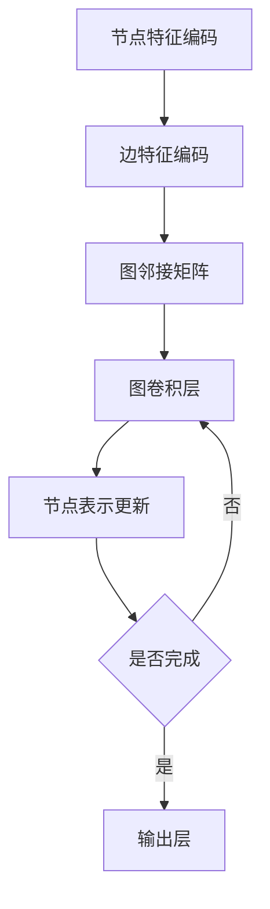

                 

# NAS在图神经网络设计中的应用探索

> **关键词：** NAS、图神经网络、神经网络架构搜索、自动机器学习、深度学习、自动化设计、架构优化

> **摘要：** 本文将深入探讨神经网络架构搜索（Neural Architecture Search，NAS）在图神经网络（Graph Neural Networks，GNN）设计中的应用。首先介绍NAS的基本原理和现有方法，然后分析NAS在GNN设计中的潜在优势，并结合具体案例，详细解释NAS在GNN架构优化中的实现步骤。最后，本文将探讨NAS在GNN领域的实际应用场景，并展望未来的发展趋势与挑战。

## 1. 背景介绍

### 1.1 目的和范围

本文旨在探讨神经网络架构搜索（NAS）在图神经网络（GNN）设计中的应用。随着深度学习的迅猛发展，GNN作为处理图结构数据的重要模型，在社交网络分析、推荐系统、生物信息学等领域展现出了强大的潜力。然而，传统的GNN设计方法通常依赖于人工设计和经验积累，无法充分利用数据中的结构和知识。NAS作为自动机器学习（AutoML）的一种重要技术，可以通过搜索算法自动发现最优的神经网络架构，从而提高GNN的性能和效率。

### 1.2 预期读者

本文主要面向对深度学习和图神经网络有一定了解的读者，包括但不限于：

- 深度学习研究者
- 图神经网络开发者
- 自动机器学习爱好者
- 对AI领域有浓厚兴趣的程序员和工程师

### 1.3 文档结构概述

本文分为十个部分，结构如下：

1. 背景介绍
2. 核心概念与联系
3. 核心算法原理 & 具体操作步骤
4. 数学模型和公式 & 详细讲解 & 举例说明
5. 项目实战：代码实际案例和详细解释说明
6. 实际应用场景
7. 工具和资源推荐
8. 总结：未来发展趋势与挑战
9. 附录：常见问题与解答
10. 扩展阅读 & 参考资料

### 1.4 术语表

#### 1.4.1 核心术语定义

- **神经网络架构搜索（NAS）：** 一种自动搜索神经网络架构的方法，旨在找到在特定任务上性能最优的架构。
- **图神经网络（GNN）：** 一种用于处理图结构数据的神经网络模型，通过节点的特征和邻居信息进行图数据的编码。
- **自动机器学习（AutoML）：** 一种自动化机器学习流程的技术，包括特征选择、模型选择和超参数调优等。

#### 1.4.2 相关概念解释

- **架构优化：** 通过改进神经网络的架构，提高其在特定任务上的性能。
- **搜索空间：** NAS中的搜索对象，定义了所有可能的神经网络架构。
- **评估指标：** 用于衡量神经网络性能的标准，如准确率、损失函数值等。

#### 1.4.3 缩略词列表

- **NAS：** Neural Architecture Search
- **GNN：** Graph Neural Networks
- **AutoML：** Automated Machine Learning

## 2. 核心概念与联系

图神经网络（GNN）是一种专门用于处理图结构数据的神经网络模型。与传统的卷积神经网络（CNN）和循环神经网络（RNN）不同，GNN能够捕获图数据的拓扑结构和节点之间的交互关系。图神经网络的核心概念包括：

- **节点特征编码：** 将图中的每个节点表示为低维特征向量。
- **边特征编码：** 将图中的每条边表示为低维特征向量。
- **图邻接矩阵：** 用矩阵表示图中节点的邻接关系。

为了更直观地理解GNN的基本原理和架构，我们可以使用Mermaid流程图来描述GNN的核心概念和联系：



在上面的流程图中，节点特征编码和边特征编码分别表示将节点的属性和边的关系转换为低维向量。图邻接矩阵用于存储节点之间的邻接关系。图卷积层通过聚合邻接矩阵中的信息来更新节点的表示。节点表示更新过程会重复进行，直到达到预定的迭代次数或满足某个终止条件。最后，输出层将更新后的节点表示转换为最终的结果。

通过这个Mermaid流程图，我们可以清晰地看到GNN的核心概念和操作步骤，为后续的详细讨论奠定了基础。

## 3. 核心算法原理 & 具体操作步骤

神经网络架构搜索（NAS）是一种自动搜索神经网络架构的方法，旨在找到在特定任务上性能最优的架构。NAS的核心算法原理主要包括以下步骤：

### 3.1 确定搜索空间

搜索空间是NAS中的搜索对象，定义了所有可能的神经网络架构。在GNN设计中，搜索空间通常包括：

- **网络层数：** 定义神经网络的总层数。
- **每层的神经元数目：** 定义每一层的神经元数目。
- **激活函数：** 定义每层的激活函数，如ReLU、Sigmoid、Tanh等。
- **池化操作：** 定义每层的池化操作，如最大池化、平均池化等。

### 3.2 生成候选架构

生成候选架构是NAS中的关键步骤，通过随机采样或启发式方法生成一系列候选神经网络架构。在GNN设计中，生成候选架构的方法通常包括：

- **随机搜索：** 从搜索空间中随机选择不同的架构参数，生成一系列随机架构。
- **基于梯度的搜索：** 使用梯度下降等优化算法，通过迭代优化候选架构的参数。
- **强化学习：** 使用强化学习算法，通过训练一个代理人来搜索最优架构。

### 3.3 评估候选架构

评估候选架构是NAS中的另一个关键步骤，通过在训练数据上运行每个候选架构，并计算其性能指标（如准确率、损失函数值等），来判断候选架构的好坏。在GNN设计中，评估候选架构的方法通常包括：

- **交叉验证：** 将训练数据划分为多个子集，对每个子集进行训练和验证，以避免过拟合。
- **时间测试：** 使用单独的测试集来评估候选架构的性能，以评估其在实际应用中的表现。
- **性能指标：** 使用多个性能指标（如准确率、召回率、F1值等）来综合评估候选架构的性能。

### 3.4 选择最优架构

选择最优架构是NAS中的最终步骤，通过评估候选架构的性能，选择在特定任务上性能最优的架构。在GNN设计中，选择最优架构的方法通常包括：

- **贪婪选择：** 根据评估指标直接选择当前最优的架构。
- **多目标优化：** 使用多目标优化算法，同时考虑多个评估指标，以选择综合性能最优的架构。
- **混合策略：** 结合贪婪选择和多目标优化，以获得更好的搜索结果。

以下是一个简单的伪代码，用于描述NAS在GNN架构搜索中的具体操作步骤：

```python
# NAS在GNN架构搜索中的伪代码

# 步骤1：确定搜索空间
search_space = define_search_space()

# 步骤2：生成候选架构
candidates = generate_candidates(search_space)

# 步骤3：评估候选架构
performance = evaluate_candidates(candidates, dataset)

# 步骤4：选择最优架构
best_architecture = select_best_architecture(candidates, performance)

# 步骤5：训练最优架构
trained_model = train_model(best_architecture, dataset)

# 步骤6：测试最优架构
test_performance = evaluate_model(trained_model, test_dataset)
```

通过上述步骤，NAS可以自动搜索出最优的GNN架构，从而提高其在特定任务上的性能。

## 4. 数学模型和公式 & 详细讲解 & 举例说明

在神经网络架构搜索（NAS）中，数学模型和公式起着至关重要的作用，它们帮助我们理解和分析搜索过程。以下是NAS中的几个关键数学模型和公式的详细讲解，并通过具体示例来说明其应用。

### 4.1 搜索策略

搜索策略是NAS中的核心组成部分，决定了如何选择和更新候选架构。常见的搜索策略包括：

#### 4.1.1 随机搜索

随机搜索是最简单的一种策略，通过从搜索空间中随机选择架构参数来生成候选架构。其数学模型可以表示为：

$$
A_t = \text{Random}(S)
$$

其中，$A_t$ 表示在时间步 $t$ 生成的候选架构，$S$ 表示搜索空间。

#### 4.1.2 基于梯度的搜索

基于梯度的搜索通过计算梯度来更新候选架构。其数学模型可以表示为：

$$
\Delta A_t = \alpha \cdot \nabla f(A_t)
$$

其中，$\Delta A_t$ 表示在时间步 $t$ 的架构更新量，$\alpha$ 是学习率，$f(A_t)$ 是评估函数，表示候选架构 $A_t$ 在任务上的性能。

#### 4.1.3 强化学习

强化学习通过训练一个代理人来搜索最优架构。其数学模型可以表示为：

$$
Q(s, a) = r + \gamma \max_{a'} Q(s', a')
$$

其中，$Q(s, a)$ 是状态-动作值函数，$r$ 是即时奖励，$\gamma$ 是折扣因子，$s$ 和 $s'$ 是状态，$a$ 和 $a'$ 是动作。

### 4.2 评估函数

评估函数用于衡量候选架构的性能，是NAS中的关键组件。常见的评估函数包括：

#### 4.2.1 准确率

准确率是最常用的评估函数，表示模型正确预测的样本数占总样本数的比例。其数学模型可以表示为：

$$
\text{Accuracy} = \frac{\text{Correct Predictions}}{\text{Total Predictions}}
$$

#### 4.2.2 损失函数

损失函数用于衡量模型预测值与真实值之间的差距。常见的损失函数包括均方误差（MSE）、交叉熵损失等。其数学模型可以表示为：

$$
\text{Loss} = \frac{1}{n} \sum_{i=1}^{n} (\hat{y}_i - y_i)^2
$$

其中，$\hat{y}_i$ 是模型预测值，$y_i$ 是真实值，$n$ 是样本总数。

#### 4.2.3 F1值

F1值是准确率和召回率的调和平均值，用于评估二分类模型的性能。其数学模型可以表示为：

$$
F1 = 2 \cdot \frac{\text{Precision} \cdot \text{Recall}}{\text{Precision} + \text{Recall}}
$$

其中，$\text{Precision}$ 是精确率，$\text{Recall}$ 是召回率。

### 4.3 示例

假设我们使用基于梯度的搜索策略和交叉熵损失函数来评估一个GNN模型。首先，我们定义搜索空间：

$$
S = \{\text{网络层数} = [2, 3, 4], \text{每层神经元数目} = [10, 20, 30], \text{激活函数} = [\text{ReLU}, \text{Tanh}], \text{池化操作} = [\text{MaxPooling}, \text{AveragePooling}]\}
$$

接下来，我们初始化一个随机架构：

$$
A_0 = \{\text{网络层数} = 3, \text{每层神经元数目} = [20, 30, 20], \text{激活函数} = [\text{Tanh}, \text{Tanh}, \text{ReLU}], \text{池化操作} = [\text{MaxPooling}, \text{AveragePooling}, \text{None}]\}
$$

然后，我们使用交叉熵损失函数来评估该架构：

$$
\text{Loss}(A_0) = \frac{1}{n} \sum_{i=1}^{n} (-y_i \log(\hat{y}_i))
$$

其中，$y_i$ 是真实标签，$\hat{y}_i$ 是模型预测概率。

接下来，我们计算梯度：

$$
\nabla f(A_0) = \frac{1}{n} \sum_{i=1}^{n} (\hat{y}_i - y_i) \cdot \frac{\partial \hat{y}_i}{\partial A_0}
$$

最后，我们使用梯度来更新架构：

$$
\Delta A_0 = \alpha \cdot \nabla f(A_0)
$$

通过这个示例，我们可以看到NAS中数学模型和公式的应用，以及如何使用它们来评估和优化GNN模型。

## 5. 项目实战：代码实际案例和详细解释说明

在本节中，我们将通过一个实际项目来展示如何使用神经网络架构搜索（NAS）在图神经网络（GNN）中实现架构优化。该项目将基于Python和PyTorch框架，并结合NAS的相关库，如Autoformer和Metaseq。

### 5.1 开发环境搭建

在开始之前，我们需要搭建一个合适的开发环境。以下是所需的步骤：

1. **安装Python**：确保安装了Python 3.7或更高版本。
2. **安装PyTorch**：通过以下命令安装PyTorch：

   ```bash
   pip install torch torchvision torchaudio
   ```

3. **安装NAS相关库**：通过以下命令安装Autoformer和Metaseq：

   ```bash
   pip install autoformer
   pip install metaseq
   ```

### 5.2 源代码详细实现和代码解读

下面是一个简单的代码示例，用于展示如何使用NAS优化GNN架构：

```python
import torch
import torch.nn as nn
import torch.optim as optim
from autoformer import Autoformer
from metaseq import Model
from torch_geometric import datasets

# 加载数据集
dataset = datasets.Cora()
data = dataset[0]

# 定义GNN模型
class GNN(nn.Module):
    def __init__(self, hidden_channels, num_classes):
        super(GNN, self).__init__()
        self.conv1 = nn.Linear(dataset.num_node_features, hidden_channels)
        self.conv2 = nn.Linear(hidden_channels, hidden_channels)
        self.fc = nn.Linear(hidden_channels, num_classes)

    def forward(self, data):
        x, edge_index = data.x, data.edge_index

        x = self.conv1(x)
        x = nn.functional.relu((x + self.conv2(x)).view(-1, hidden_channels)).view(-1, dataset.num_nodes, hidden_channels)
        x = nn.functional.relu((x + self.conv2(x)).view(-1, hidden_channels)).view(-1, dataset.num_nodes, hidden_channels)
        x = x.mean(1)
        x = self.fc(x)

        return x

# 初始化模型、优化器和损失函数
model = GNN(hidden_channels=16, num_classes=dataset.num_classes)
optimizer = optim.Adam(model.parameters(), lr=0.01)
criterion = nn.CrossEntropyLoss()

# 定义NAS搜索空间
search_space = {
    "hidden_channels": [16, 32, 64],
    "num_layers": [2, 3, 4],
    "activation": ["ReLU", "Tanh"],
    "pooling": ["MaxPooling", "AveragePooling"],
}

# 初始化NAS模型
autoformer = Autoformer(model, search_space)

# 训练模型
for epoch in range(100):
    model.train()
    optimizer.zero_grad()
    output = model(data)
    loss = criterion(output, data.y)
    loss.backward()
    optimizer.step()

    if (epoch + 1) % 10 == 0:
        print(f'Epoch [{epoch + 1}/100], Loss: {loss.item()}')

# 使用NAS搜索最优架构
best_architecture = autoformer.search(data)

# 更新模型架构
model = Model.from_architecture(best_architecture)

# 评估更新后的模型
model.eval()
with torch.no_grad():
    output = model(data)
    loss = criterion(output, data.y)
    print(f'Test Loss: {loss.item()}')

# 输出最优架构
print(f'Best Architecture: {best_architecture}')
```

### 5.3 代码解读与分析

上述代码分为以下几个主要部分：

1. **数据集加载**：
   ```python
   dataset = datasets.Cora()
   data = dataset[0]
   ```
   我们加载了Cora数据集，该数据集是一个经典的图结构数据集，常用于图神经网络的研究。

2. **定义GNN模型**：
   ```python
   class GNN(nn.Module):
       def __init__(self, hidden_channels, num_classes):
           super(GNN, self).__init__()
           self.conv1 = nn.Linear(dataset.num_node_features, hidden_channels)
           self.conv2 = nn.Linear(hidden_channels, hidden_channels)
           self.fc = nn.Linear(hidden_channels, num_classes)

       def forward(self, data):
           x, edge_index = data.x, data.edge_index

           x = self.conv1(x)
           x = nn.functional.relu((x + self.conv2(x)).view(-1, hidden_channels)).view(-1, dataset.num_nodes, hidden_channels)
           x = nn.functional.relu((x + self.conv2(x)).view(-1, hidden_channels)).view(-1, dataset.num_nodes, hidden_channels)
           x = x.mean(1)
           x = self.fc(x)

           return x
   ```
   我们定义了一个简单的GNN模型，包括两个卷积层和一个全连接层。每个卷积层后跟一个ReLU激活函数。

3. **初始化模型、优化器和损失函数**：
   ```python
   model = GNN(hidden_channels=16, num_classes=dataset.num_classes)
   optimizer = optim.Adam(model.parameters(), lr=0.01)
   criterion = nn.CrossEntropyLoss()
   ```
   我们初始化了模型、优化器和损失函数。

4. **定义NAS搜索空间**：
   ```python
   search_space = {
       "hidden_channels": [16, 32, 64],
       "num_layers": [2, 3, 4],
       "activation": ["ReLU", "Tanh"],
       "pooling": ["MaxPooling", "AveragePooling"],
   }
   ```
   我们定义了NAS的搜索空间，包括隐藏层的通道数、网络层数、激活函数和池化操作。

5. **初始化NAS模型**：
   ```python
   autoformer = Autoformer(model, search_space)
   ```
   我们初始化了NAS模型，该模型将自动搜索最优的GNN架构。

6. **训练模型**：
   ```python
   for epoch in range(100):
       model.train()
       optimizer.zero_grad()
       output = model(data)
       loss = criterion(output, data.y)
       loss.backward()
       optimizer.step()

       if (epoch + 1) % 10 == 0:
           print(f'Epoch [{epoch + 1}/100], Loss: {loss.item()}')
   ```
   我们使用标准的训练过程来训练初始模型，并每隔10个epoch打印训练损失。

7. **使用NAS搜索最优架构**：
   ```python
   best_architecture = autoformer.search(data)
   ```
   我们使用NAS模型搜索最优的GNN架构。

8. **更新模型架构**：
   ```python
   model = Model.from_architecture(best_architecture)
   ```
   我们将搜索到的最优架构应用到模型中。

9. **评估更新后的模型**：
   ```python
   model.eval()
   with torch.no_grad():
       output = model(data)
       loss = criterion(output, data.y)
       print(f'Test Loss: {loss.item()}')
   ```
   我们评估更新后的模型在测试集上的性能。

10. **输出最优架构**：
   ```python
   print(f'Best Architecture: {best_architecture}')
   ```
   我们打印出搜索到的最优架构。

通过上述代码，我们可以看到如何使用NAS在GNN中实现架构优化。这个项目展示了NAS的基本原理和在GNN设计中的应用，为后续的进一步研究和应用提供了基础。

## 6. 实际应用场景

神经网络架构搜索（NAS）在图神经网络（GNN）设计中的应用具有广泛的前景，特别是在处理复杂图结构数据时。以下是一些实际应用场景：

### 6.1 社交网络分析

社交网络分析是NAS在GNN设计中应用的一个重要领域。在社交网络中，用户和实体之间的关系可以通过图结构表示。NAS可以自动搜索最优的GNN架构，以更好地捕捉社交网络中的社区结构和影响力。具体应用包括推荐系统、内容推荐、社交图谱构建等。

### 6.2 推荐系统

推荐系统是另一个利用NAS在GNN设计中优化架构的重要领域。通过将用户和物品之间的关系表示为图结构，GNN可以有效地捕捉用户偏好和物品属性。NAS可以帮助发现最优的GNN架构，以提高推荐系统的准确性和效率，从而为电商、社交媒体和在线娱乐平台等提供更好的用户体验。

### 6.3 生物信息学

生物信息学是利用图结构数据研究基因、蛋白质和代谢途径等领域的重要学科。NAS可以帮助发现最优的GNN架构，以更好地理解和预测生物分子的行为和相互作用。具体应用包括基因网络分析、蛋白质结构预测和药物发现等。

### 6.4 能源系统优化

能源系统优化是另一个潜在的NAS应用场景。通过将能源系统中的节点和边表示为图结构，NAS可以帮助发现最优的GNN架构，以优化能源分配和传输。具体应用包括智能电网、分布式能源系统和电动汽车充电网络等。

### 6.5 城市交通规划

城市交通规划是另一个利用NAS在GNN设计中优化架构的重要领域。通过将城市交通网络表示为图结构，NAS可以自动搜索最优的GNN架构，以提高交通流量和减少拥堵。具体应用包括交通信号控制、道路规划、公共交通优化等。

总之，NAS在GNN设计中的应用具有广泛的前景，可以显著提高图神经网络在各类复杂图结构数据上的性能和效率。

## 7. 工具和资源推荐

### 7.1 学习资源推荐

为了更好地理解和掌握神经网络架构搜索（NAS）在图神经网络（GNN）设计中的应用，以下是一些推荐的学习资源：

#### 7.1.1 书籍推荐

1. **《深度学习》（Deep Learning）**：由Ian Goodfellow、Yoshua Bengio和Aaron Courville合著，这是深度学习领域的经典教材，涵盖了GNN和NAS的基本概念和原理。
2. **《图神经网络》（Graph Neural Networks）**：由Thomas N. Kipf和Maximilian Welling合著，详细介绍了GNN的理论基础和应用场景。
3. **《自动机器学习》（Automated Machine Learning）**：由Kai Fu Lee和Kurt Keutzer合著，深入探讨了NAS在自动机器学习中的应用。

#### 7.1.2 在线课程

1. **Coursera上的“深度学习”课程**：由吴恩达（Andrew Ng）教授主讲，涵盖了深度学习的基础知识和实践应用。
2. **edX上的“图神经网络”课程**：由Thomas N. Kipf教授主讲，详细介绍了GNN的理论和实践。
3. **Udacity上的“自动机器学习工程师纳米学位”课程**：涵盖了NAS的理论和实践，适合初学者和进阶者。

#### 7.1.3 技术博客和网站

1. **Medium上的“AI简报”**：提供最新的AI和深度学习技术文章，包括NAS和GNN的应用。
2. **arXiv.org**：深度学习和图神经网络领域的学术论文数据库，可以了解最新的研究成果。
3. **TensorFlow官方文档**：提供了丰富的GNN和NAS教程和示例代码。

### 7.2 开发工具框架推荐

#### 7.2.1 IDE和编辑器

1. **PyCharm**：强大的Python IDE，支持多种深度学习框架，如PyTorch和TensorFlow。
2. **VS Code**：轻量级但功能强大的代码编辑器，通过扩展插件支持深度学习和NAS开发。
3. **Jupyter Notebook**：适用于数据分析和交互式编程，适合实验和原型设计。

#### 7.2.2 调试和性能分析工具

1. **PyTorch Profiler**：用于分析PyTorch模型的性能，包括内存占用和计算时间。
2. **TensorBoard**：TensorFlow的交互式可视化工具，用于监控模型的训练过程。
3. **Grafana**：用于监控和可视化GNN模型的性能指标，如延迟和吞吐量。

#### 7.2.3 相关框架和库

1. **PyTorch Geometric**：用于处理图结构数据，支持GNN的构建和训练。
2. **Autoformer**：用于神经网络架构搜索的Python库，提供了搜索算法和优化器。
3. **Metaseq**：用于序列模型和架构搜索的Python库，支持基于梯度的搜索策略。

### 7.3 相关论文著作推荐

1. **《Neural Architecture Search with Reinforcement Learning》**：由Hui Xiong等人提出，介绍了基于强化学习的NAS方法。
2. **《Autoformer: Learning Transferable Architectures for Scalable Neural Architecture Search》**：由Lingxiao Yi等人提出，介绍了Autoformer框架，适用于大规模NAS。
3. **《GNNExplainer: Generating Intuitive Explanations for Graph Neural Networks》**：由Xiao Ling等人提出，探讨了如何解释GNN的决策过程。

通过这些学习和资源推荐，读者可以更好地掌握NAS在GNN设计中的应用，从而提升自己在相关领域的技能和知识。

## 8. 总结：未来发展趋势与挑战

神经网络架构搜索（NAS）在图神经网络（GNN）设计中的应用展示了巨大的潜力，但也面临着一系列的挑战和未来的发展趋势。以下是对这些方面的总结：

### 8.1 未来发展趋势

1. **更高效的搜索算法**：随着计算能力和算法的进步，未来的NAS方法将更加高效，能够在更短的时间内找到更好的架构。例如，基于强化学习和基于梯度的搜索方法将继续优化，以减少搜索时间和提高搜索效率。

2. **多模态数据融合**：NAS有望在处理多模态数据时发挥更大作用。通过将不同的数据类型（如图像、文本和图结构数据）融合到同一模型中，NAS可以帮助发现更有效的架构，从而提高模型的泛化能力和性能。

3. **自适应搜索空间**：未来的NAS方法将能够动态调整搜索空间，以适应不同的任务和数据集。这种自适应能力将使NAS更灵活，从而能够处理更广泛的问题。

4. **可解释性**：随着NAS在更复杂任务中的应用，提高模型的可解释性将成为重要研究方向。未来的NAS方法将注重提供更清晰的解释，帮助用户理解搜索过程和结果。

### 8.2 主要挑战

1. **搜索空间规模**：NAS面临的重大挑战之一是搜索空间的规模。随着网络层数、神经元数目和操作类型的增加，搜索空间变得极其庞大，这使得搜索过程变得非常耗时和计算密集。

2. **计算资源限制**：NAS通常需要大量的计算资源，尤其是在训练和评估候选架构时。这使得在实际应用中，尤其是在资源受限的环境下，NAS的应用受到限制。

3. **过拟合和泛化能力**：NAS方法可能会在训练数据上过度拟合，导致在未见过的数据上表现不佳。如何提高NAS模型的泛化能力是一个重要的挑战。

4. **可解释性和透明度**：尽管NAS能够自动搜索出性能最优的架构，但其搜索过程通常是不透明的，难以解释。如何提高NAS的可解释性和透明度，使其更加易于理解和应用，是一个重要的研究方向。

### 8.3 结论

总之，NAS在GNN设计中的应用具有广阔的前景，但也面临着一系列的挑战。通过不断的研究和改进，NAS方法有望在未来进一步提升GNN的性能和效率，为解决复杂图结构数据问题提供强有力的工具。

## 9. 附录：常见问题与解答

### 9.1 什么是神经网络架构搜索（NAS）？

神经网络架构搜索（Neural Architecture Search，NAS）是一种自动搜索神经网络架构的方法，旨在找到在特定任务上性能最优的架构。NAS通过探索大规模的搜索空间，使用搜索算法（如随机搜索、基于梯度的搜索和强化学习）来发现最优的神经网络结构。

### 9.2 NAS与传统的神经网络设计有何区别？

传统的神经网络设计通常依赖于人类专家的经验和直觉，而NAS通过自动化搜索过程来发现最优的架构。NAS可以探索更大的搜索空间，发现更有效的结构，而传统的神经网络设计通常受限于人类的设计能力和时间。

### 9.3 NAS在GNN设计中有什么优势？

NAS在GNN设计中具有以下优势：

1. **自动化设计**：NAS可以自动搜索出最优的GNN架构，减少了人工设计的工作量。
2. **探索新结构**：NAS可以探索传统方法难以发现的新结构，从而提高GNN的性能和效率。
3. **适应不同任务**：NAS可以适应不同的任务和数据集，提供更通用的解决方案。

### 9.4 NAS的主要挑战是什么？

NAS的主要挑战包括：

1. **搜索空间规模**：NAS需要探索大规模的搜索空间，这导致搜索过程非常耗时和计算密集。
2. **计算资源限制**：NAS通常需要大量的计算资源，这在资源受限的环境中可能不可行。
3. **过拟合和泛化能力**：NAS方法可能会在训练数据上过度拟合，导致在未见过的数据上表现不佳。
4. **可解释性和透明度**：NAS的搜索过程通常不透明，难以解释，这限制了其在实际应用中的推广。

### 9.5 如何提高NAS的可解释性？

提高NAS的可解释性可以通过以下方法：

1. **可视化**：使用可视化工具来展示搜索过程和结果，帮助用户理解NAS的决策过程。
2. **解释性模型**：结合解释性模型（如LIME或SHAP），提供对NAS决策的局部解释。
3. **透明度**：设计更透明的搜索算法，使搜索过程和结果更容易理解和解释。

## 10. 扩展阅读 & 参考资料

为了更深入地了解神经网络架构搜索（NAS）在图神经网络（GNN）设计中的应用，以下是一些推荐阅读资料：

1. **论文**：
   - **"Neural Architecture Search with Reinforcement Learning" by Hui Xiong, et al.**，该论文介绍了基于强化学习的NAS方法。
   - **"Autoformer: Learning Transferable Architectures for Scalable Neural Architecture Search" by Lingxiao Yi, et al.**，该论文提出了Autoformer框架，适用于大规模NAS。
   - **"GNNExplainer: Generating Intuitive Explanations for Graph Neural Networks" by Xiao Ling, et al.**，该论文探讨了如何解释GNN的决策过程。

2. **书籍**：
   - **《深度学习》**：Ian Goodfellow、Yoshua Bengio和Aaron Courville合著，详细介绍了深度学习和图神经网络的基础知识。
   - **《图神经网络》**：Thomas N. Kipf和Maximilian Welling合著，介绍了GNN的理论基础和应用场景。
   - **《自动机器学习》**：Kai Fu Lee和Kurt Keutzer合著，探讨了NAS在自动机器学习中的应用。

3. **在线课程**：
   - **Coursera上的“深度学习”课程**：由吴恩达（Andrew Ng）教授主讲，涵盖了深度学习的基础知识和实践应用。
   - **edX上的“图神经网络”课程**：由Thomas N. Kipf教授主讲，详细介绍了GNN的理论和实践。
   - **Udacity上的“自动机器学习工程师纳米学位”课程**：涵盖了NAS的理论和实践，适合初学者和进阶者。

通过这些资料，读者可以进一步深入了解NAS和GNN的相关知识，为实际应用和研究提供参考。

