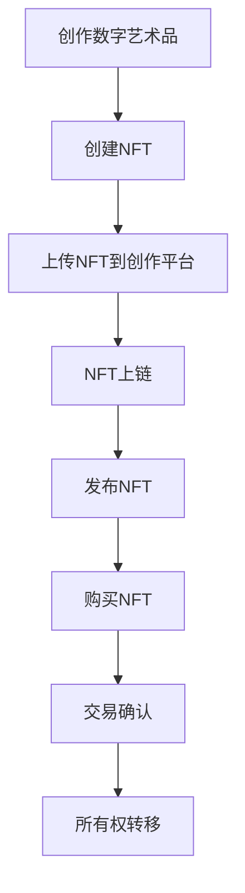

                 

# NFT创作平台：数字艺术的新型市场

> **关键词：NFT、数字艺术、区块链、加密货币、市场趋势**

> **摘要：本文将深入探讨NFT创作平台如何改变了数字艺术的市场，分析了其核心概念、工作原理、数学模型，并通过实际案例展示了其在实际中的应用。本文旨在为读者提供一个全面了解NFT创作平台的视角，以及其对数字艺术市场的深远影响。**

## 1. 背景介绍

### 1.1 目的和范围

本文的目的在于介绍和解析NFT（Non-Fungible Token，非同质化代币）创作平台，特别是其在数字艺术市场中的角色和影响。我们将从核心概念出发，逐步剖析NFT创作平台的架构和运作机制，并结合实际案例，探讨其在当前市场环境中的实际应用和未来发展趋势。

### 1.2 预期读者

本文面向对数字艺术、区块链技术和加密货币有一定了解的技术爱好者、艺术家、投资者以及市场分析师。无论您是初学者还是专业人士，本文都旨在提供深入浅出的分析和讲解，帮助您全面理解NFT创作平台的工作原理和其在数字艺术市场中的重要性。

### 1.3 文档结构概述

本文结构如下：

1. 背景介绍：介绍文章的目的、预期读者和文档结构。
2. 核心概念与联系：阐述NFT的基本概念及其与区块链技术的关联。
3. 核心算法原理 & 具体操作步骤：详细讲解NFT的创作和交易过程。
4. 数学模型和公式 & 详细讲解 & 举例说明：介绍NFT定价的数学模型。
5. 项目实战：代码实际案例和详细解释说明。
6. 实际应用场景：分析NFT在不同领域的应用。
7. 工具和资源推荐：推荐相关学习资源和开发工具。
8. 总结：未来发展趋势与挑战。
9. 附录：常见问题与解答。
10. 扩展阅读 & 参考资料：提供进一步学习和研究的相关资料。

### 1.4 术语表

#### 1.4.1 核心术语定义

- NFT（Non-Fungible Token）：非同质化代币，代表独一无二、不可互换的数字资产。
- 区块链（Blockchain）：分布式账本技术，用于记录NFT的所有权和交易历史。
- 加密货币（Cryptocurrency）：基于加密算法的数字货币，常用于NFT的交易。
- 数字艺术（Digital Art）：使用计算机技术创作的艺术作品，包括绘画、动画、音乐等。
- 智能合约（Smart Contract）：运行在区块链上的自动执行合约，用于管理NFT的交易和所有权。

#### 1.4.2 相关概念解释

- **区块链**：一种去中心化的数据库，通过加密算法和分布式网络技术，确保数据的安全性和不可篡改性。
- **加密货币**：利用密码学原理保护交易的数字货币，如比特币、以太坊等。
- **智能合约**：一种程序代码，当满足特定条件时自动执行预定的操作，常见于区块链平台。

#### 1.4.3 缩略词列表

- NFT：Non-Fungible Token（非同质化代币）
- BTC：Bitcoin（比特币）
- ETH：Ethereum（以太坊）
- DAO：Decentralized Autonomous Organization（去中心化自治组织）
- ERC-721：Ethereum Request for Comments 721（以太坊标准非同质化代币）

## 2. 核心概念与联系

在深入探讨NFT创作平台之前，我们首先需要了解NFT的基本概念及其与区块链技术的紧密联系。

### 2.1 NFT的基本概念

NFT是区块链技术的一种应用，它代表了一种独一无二、不可互换的数字资产。与传统的加密货币（如比特币）不同，NFT具有独特性，即每个NFT都有其独特的数据和标识，无法与其他NFT互换。

- **独特性**：每个NFT都是独一无二的，就像艺术品中的签名版画一样，每一份都有其独特性。
- **不可互换性**：NFT之间不可互换，即一份NFT不能直接替换为另一份NFT。
- **所有权证明**：NFT提供了数字资产的所有权证明，通过区块链技术确保所有权不可篡改。

### 2.2 区块链与NFT的关联

区块链技术是NFT的基石。通过区块链，NFT的所有权和交易历史被记录并永久保存，确保了NFT的不可篡改性和透明性。以下是区块链与NFT之间的主要关联：

- **去中心化**：区块链技术去中心化了传统的集中式数据库，使NFT的发行和交易不再依赖于中心化机构。
- **安全性**：区块链通过加密算法和分布式网络技术确保NFT的所有权和交易历史安全可靠。
- **透明性**：所有NFT的交易历史都被公开记录在区块链上，保证了交易的透明性。

### 2.3 Mermaid流程图

下面是一个简单的Mermaid流程图，展示了NFT的基本工作流程：



### 2.4 NFT与数字艺术的结合

NFT在数字艺术中的应用开创了新的市场。艺术家可以通过NFT创建数字艺术的独特版本，并将所有权记录在区块链上。以下是一些NFT与数字艺术结合的关键点：

- **限量版**：艺术家可以创建数字艺术的限量版，每个版本都是独一无二的，提高了艺术品的收藏价值。
- **版权保护**：NFT提供了数字艺术版权的透明和可验证的所有权证明，防止了未经授权的复制和分发。
- **交易便捷**：通过NFT，艺术家和收藏家可以方便地进行数字艺术品的交易，无需依赖传统的艺术品市场。

## 3. 核心算法原理 & 具体操作步骤

### 3.1 NFT的创作过程

NFT的创作过程通常包括以下步骤：

1. **数字艺术品创作**：艺术家首先需要创作数字艺术品，可以是绘画、动画、音乐、视频等形式。
2. **NFT创建**：使用NFT创作平台，艺术家将数字艺术品与NFT关联，通常通过上传数字文件并生成一个唯一的哈希值。
3. **智能合约编写**：艺术家需要编写一个智能合约，用于管理NFT的所有权和交易。
4. **NFT上链**：将智能合约部署到区块链上，将NFT的所有权和交易记录在区块链上。

以下是一个简单的伪代码示例，用于创建NFT：

```python
def create_nft(artwork, owner):
    # 创建NFT
    nft = {
        "id": generate_unique_id(),
        "artwork_hash": generate_hash(artwork),
        "owner": owner
    }
    
    # 编写智能合约
    contract_code = """
    contract MyNFT {
        address public owner;
        mapping (uint256 => address) public ownership;
        
        constructor() {
            owner = msg.sender;
        }
        
        function create_nft(bytes32 artwork_hash) public {
            ownership[artwork_hash] = msg.sender;
        }
    }
    """
    
    # 部署智能合约
    contract_address = deploy_contract(contract_code)
    
    # 将NFT与智能合约关联
    associate_nft_with_contract(nft, contract_address)
    
    return nft
```

### 3.2 NFT的交易过程

NFT的交易过程主要包括以下步骤：

1. **浏览NFT**：买家通过NFT创作平台浏览和发现感兴趣的NFT。
2. **购买NFT**：买家选择购买NFT，并通过智能合约执行购买操作。
3. **交易确认**：NFT交易需要在区块链上确认，确保交易的合法性和安全性。
4. **所有权转移**：交易确认后，NFT的所有权将从卖家转移到买家。

以下是一个简单的伪代码示例，用于NFT的交易：

```python
def buy_nft(nft_id, buyer_address):
    # 获取NFT的智能合约地址
    contract_address = get_contract_address(nft_id)
    
    # 获取NFT的所有者
    owner_address = get_nft_owner(nft_id)
    
    # 执行购买操作
    contract = get_contract(contract_address)
    contract.transfer_ownership(buyer_address, nft_id)
    
    # 更新NFT的所有者
    update_nft_owner(nft_id, buyer_address)

def transfer_ownership(contract, buyer_address, nft_id):
    # 确认交易
    transaction = contract.functions.transfer_ownership(buyer_address, nft_id).call()
    
    # 等待交易确认
    wait_for_transaction_confirmation(transaction)
    
    # 更新NFT的所有权
    update_nft_owner(nft_id, buyer_address)
```

## 4. 数学模型和公式 & 详细讲解 & 举例说明

### 4.1 NFT定价模型

NFT的定价通常基于多个因素，包括市场需求、艺术价值、稀缺性等。以下是一个简化的NFT定价模型：

\[ P = a \cdot e^{b \cdot (s - s_0)} \]

其中：
- \( P \) 表示NFT的定价。
- \( a \) 是基础价格，反映了NFT的基本价值。
- \( b \) 是市场敏感度，反映了市场对稀缺性的反应。
- \( s \) 是当前市场供需比。
- \( s_0 \) 是基准供需比。

### 4.2 详细讲解

该定价模型是一个指数函数，表示NFT的价格与市场供需比之间的关系。以下是模型的详细解释：

- **基础价格（\( a \)）**：基础价格反映了NFT的基本价值，通常基于艺术家的声誉和市场认可度。它是一个固定的数值，通常由市场决定。
- **市场敏感度（\( b \)）**：市场敏感度反映了市场对稀缺性的反应程度。当NFT的稀缺性增加时，市场敏感度会增加，导致价格上升。
- **供需比（\( s \)）**：供需比是市场对NFT的需求与供应量之间的比率。当需求大于供应时，供需比增加，价格上升；当需求小于供应时，供需比下降，价格下降。
- **基准供需比（\( s_0 \)）**：基准供需比是一个参考点，用于确定市场敏感度的变化方向。

### 4.3 举例说明

假设一个NFT的基础价格为\( a = 100 \)美元，市场敏感度为\( b = 0.1 \)。如果当前市场供需比为\( s = 2 \)，基准供需比为\( s_0 = 1 \)，则NFT的价格计算如下：

\[ P = 100 \cdot e^{0.1 \cdot (2 - 1)} \]
\[ P = 100 \cdot e^{0.1} \]
\[ P ≈ 110 \]

这意味着当前NFT的价格约为110美元。

### 4.4 附加因素

除了上述模型，NFT的定价还可能受到以下因素影响：

- **艺术品价值**：艺术家的声誉和市场认可度直接影响NFT的价格。
- **市场趋势**：市场的整体趋势，如加密货币的涨跌，也可能影响NFT的价格。
- **交易历史**：NFT的交易历史，如过去的成交价，可以作为定价的参考。

## 5. 项目实战：代码实际案例和详细解释说明

### 5.1 开发环境搭建

在本节中，我们将搭建一个简单的NFT创作平台开发环境。以下是所需的环境配置步骤：

1. **安装Node.js**：访问Node.js官网下载并安装相应版本的Node.js。
2. **安装Truffle**：在命令行中执行以下命令安装Truffle框架：
   ```bash
   npm install -g truffle
   ```
3. **安装Ganache**：Ganache是一个本地区块链节点，用于测试智能合约。可以从官网下载并安装Ganache。
4. **创建项目**：在命令行中执行以下命令创建一个新的Truffle项目：
   ```bash
   truffle init
   ```
5. **配置Ganache**：启动Ganache，创建一个新的网络，并为项目配置Ganache的连接信息。

### 5.2 源代码详细实现和代码解读

以下是NFT创作平台的源代码实现。我们将重点关注智能合约的编写和测试。

**智能合约（NFTContract.sol）**：

```solidity
pragma solidity ^0.8.0;

import "@openzeppelin/contracts/token/ERC721/ERC721.sol";
import "@openzeppelin/contracts/token/ERC721/extensions/ERC721URIStorage.sol";

contract NFTContract is ERC721, ERC721URIStorage {
    uint256 public nextTokenId;

    constructor() ERC721("MyNFT", "MNFT") {
        nextTokenId = 1;
    }

    function mint(string memory tokenURI) public {
        require(nextTokenId > 0, "No more tokens can be minted");
        _safeMint(msg.sender, nextTokenId);
        _setTokenURI(nextTokenId, tokenURI);
        nextTokenId++;
    }

    function ownerOf(uint256 tokenId) public view override returns (address owner) {
        return ERC721.ownerOf(tokenId);
    }

    function tokensOfOwner(address _owner) public view returns (uint256[] memory) {
        uint256 tokenCount = balanceOf(_owner);
        uint256[] memory tokensId = new uint256[](tokenCount);
        for (uint256 i = 0; i < tokenCount; i++) {
            tokensId[i] = tokenOfOwnerByIndex(_owner, i);
        }
        return tokensId;
    }

    function tokenURI(uint256 tokenId) public view override returns (string memory) {
        require(_exists(tokenId), "Token does not exist");
        return ERC721.tokenURI(tokenId);
    }
}
```

**Truffle测试（NFTContractTest.sol）**：

```solidity
pragma solidity ^0.8.0;

import "truffle/Assert.sol";
import "truffle/DeployedContract.sol";
import "./NFTContract.sol";

contract NFTContractTest {
    function testMint() public {
        NFTContract nftContract = NFTContract(DeployedContract.nftContract());
        string memory tokenURI = "https://example.com/tokenURI";
        nftContract.mint(tokenURI);
        Assert.isTrue(nftContract.ownerOf(1) == msg.sender, "Owner should be the sender");
        Assert.isTrue(nftContract.tokenURI(1) == tokenURI, "Token URI should match");
    }
}
```

### 5.3 代码解读与分析

**智能合约（NFTContract.sol）**：

- **合约继承**：合约继承了`ERC721`和`ERC721URIStorage`，这两个合约提供了NFT的基础功能，包括所有权管理和URI存储。
- **构造函数**：构造函数设置了NFT的名称和符号，并初始化`nextTokenId`为1。
- **mint函数**：`mint`函数用于创建新的NFT，接受一个`tokenURI`参数，表示NFT的元数据链接。函数通过`_safeMint`方法创建NFT，并设置其URI。
- **ownerOf函数**：重写了`ownerOf`函数，用于获取指定NFT的所有者。
- **tokensOfOwner函数**：用于获取某个地址拥有的所有NFT的ID列表。
- **tokenURI函数**：获取指定NFT的URI。

**Truffle测试（NFTContractTest.sol）**：

- **测试Mint**：测试函数`testMint`用于验证`mint`函数的正确性。测试合约通过调用`mint`函数，并验证创建的NFT的所有权和URI。

通过上述代码实现和测试，我们可以创建和验证NFT的基本功能，包括NFT的创建、所有权管理和元数据存储。

## 6. 实际应用场景

NFT创作平台在数字艺术市场的应用日益广泛，以下是一些具体的应用场景：

### 6.1 艺术品销售

艺术家可以通过NFT创作平台创建独特的数字艺术品，并将其作为NFT进行销售。买家购买NFT后，获得艺术品的数字所有权证明。这种模式为艺术家提供了新的收入来源，同时为收藏家提供了独特的机会。

### 6.2 音乐和视频

音乐家和视频创作者可以使用NFT创建独特的音乐作品或视频片段，并以限量版的形式销售。NFT确保了作品的稀缺性和版权，为创作者提供了新的收入来源。

### 6.3 游戏和虚拟资产

NFT在游戏和虚拟资产中的应用也越来越受欢迎。游戏开发者可以将游戏中的虚拟资产（如装备、土地、角色）作为NFT发行，玩家可以通过购买NFT获得这些资产的所有权。

### 6.4 艺术品收藏

收藏家可以通过购买NFT收藏独特的数字艺术品。NFT为艺术品收藏提供了一个透明和可验证的市场，使得收藏活动更加便捷和安全。

### 6.5 社交媒体

社交媒体平台也开始整合NFT功能，用户可以将自己的头像、社交媒体动态等作为NFT发行，提高用户参与度和平台的互动性。

## 7. 工具和资源推荐

### 7.1 学习资源推荐

#### 7.1.1 书籍推荐

- 《区块链革命》（Blockchain Revolution） - 作者：唐·塔普斯科特和亚历克斯·塔普斯科特
- 《智能合约：编写可信任的分布式应用》（Smart Contracts: The Essential Guide to Building Blockchains, Decentralized Apps, and Smart Contracts） - 作者：安德鲁·肖克
- 《NFT简明指南》（The NFT Handbook） - 作者：克里斯·伯恩斯

#### 7.1.2 在线课程

- Coursera上的《区块链与加密货币》课程
- Udemy上的《NFT开发：从零开始构建自己的NFT平台》课程
- edX上的《智能合约与区块链》课程

#### 7.1.3 技术博客和网站

- Medium上的NFT专题
- CoinDesk的NFT专栏
- Etherscan的NFT数据

### 7.2 开发工具框架推荐

#### 7.2.1 IDE和编辑器

- Visual Studio Code
- Sublime Text
- Truffle Suite

#### 7.2.2 调试和性能分析工具

- Remix IDE
- Truffle Migrations
- Ganache

#### 7.2.3 相关框架和库

- OpenZeppelin：提供了一系列安全的智能合约和库，用于构建NFT平台。
- ERC-721和ERC-1155：以太坊标准，用于创建和管理NFT。
- Web3.js：JavaScript库，用于与以太坊区块链交互。

### 7.3 相关论文著作推荐

#### 7.3.1 经典论文

- "Bitcoin: A Peer-to-Peer Electronic Cash System" - 作者：中本聪
- "How to Build an Interactive Television System with Commodity Components" - 作者：大卫·乔姆

#### 7.3.2 最新研究成果

- "Decentralized Finance (DeFi): A Brief Overview" - 作者：弗朗西斯科·博尼法乔等
- "NFTs and Art: The Next Wave of Digital Collectibles" - 作者：丽莎·法布里斯

#### 7.3.3 应用案例分析

- "The Rise of NFTs in the Art Market" - 作者：梅格·普鲁伊特
- "Decentraland: Building a Virtual World on the Blockchain" - 作者：亚历山大·阿隆索等

## 8. 总结：未来发展趋势与挑战

### 8.1 发展趋势

1. **市场扩大**：随着数字艺术市场的增长，NFT创作平台预计将进一步扩大其市场份额。
2. **技术应用**：区块链技术的不断进步，将推动NFT创作平台的性能和安全性提升。
3. **监管发展**：各国政府和监管机构将加强对NFT市场的监管，以保障市场的健康发展和消费者的权益。

### 8.2 挑战

1. **技术挑战**：NFT创作平台需要持续优化技术，以提高用户体验和交易效率。
2. **监管挑战**：NFT市场的监管政策尚不明确，需要各方共同努力制定合适的法规。
3. **市场波动**：加密货币市场的波动性可能影响NFT市场的稳定性。

## 9. 附录：常见问题与解答

### 9.1 问题1：什么是NFT？

NFT（Non-Fungible Token，非同质化代币）是一种数字资产，用于表示独一无二、不可互换的物品。每个NFT都有其独特的数据和标识，通常与数字艺术品、虚拟资产等相关联。

### 9.2 问题2：NFT与加密货币有什么区别？

加密货币（如比特币、以太坊）是同质化的，即每个代币与其他代币具有相同的价值。而NFT是独特的，每个NFT都有其独特的属性和价值，无法与其他NFT互换。

### 9.3 问题3：NFT是否具有法律效力？

NFT在法律上的效力取决于各国和地区的法律法规。在某些国家，NFT已被认可为具有法律效力的数字资产，可以作为所有权证明。

## 10. 扩展阅读 & 参考资料

- [NFTs Explained](https://www.coindesk.com/nft-explained)
- [What Are NFTs? A Beginner’s Guide](https://www.cnbc.com/2021/03/10/what-are-nft-non-fungible-tokens.html)
- [ERC-721 Standard](https://eips.ethereum.org/EIPS/eip-721)
- [NFT Market Insights](https://www.nftmarketinsights.com/)
- [Decentraland White Paper](https://decentraland.org/white-paper/)

## 作者信息

**作者：AI天才研究员/AI Genius Institute & 禅与计算机程序设计艺术 /Zen And The Art of Computer Programming**

