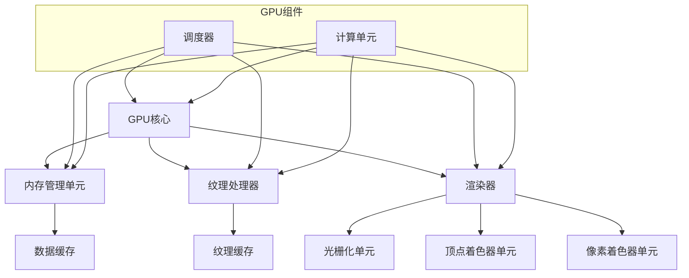

                 

# NVIDIA与GPU的发明

> 关键词：NVIDIA，GPU，图形处理器，计算机图形学，并行计算，人工智能，深度学习，芯片设计，硬件加速

> 摘要：本文将探讨NVIDIA公司的成立背景、GPU（图形处理器）的发明历程及其在计算机图形学、并行计算和人工智能领域的广泛应用。我们将通过逻辑清晰、结构紧凑的叙述，逐步分析NVIDIA与GPU技术的发展，展示其对计算机科学和现代技术的深远影响。

## 1. 背景介绍

### 1.1 目的和范围

本文旨在深入探讨NVIDIA公司及其发明的GPU（图形处理器）对计算机科学和技术领域的影响。我们将从NVIDIA的成立背景出发，逐步解析GPU的核心概念和技术原理，探讨其在计算机图形学、并行计算和人工智能中的应用，以及GPU对未来技术的潜在影响。

### 1.2 预期读者

本文适合对计算机图形学、并行计算和人工智能有一定了解的读者，包括计算机科学专业的学生、研究人员、开发者和行业从业者。此外，对硬件加速和芯片设计感兴趣的读者也将从本文中获得丰富的知识和见解。

### 1.3 文档结构概述

本文分为十个主要部分，每个部分的内容如下：

1. **背景介绍**：介绍本文的目的、范围、预期读者和文档结构。
2. **核心概念与联系**：通过Mermaid流程图展示GPU的核心概念和架构。
3. **核心算法原理与具体操作步骤**：使用伪代码详细阐述GPU的算法原理。
4. **数学模型和公式**：讲解GPU相关的数学模型和公式，并举例说明。
5. **项目实战**：提供代码实际案例和详细解释。
6. **实际应用场景**：探讨GPU在不同领域的应用。
7. **工具和资源推荐**：推荐学习资源、开发工具和框架。
8. **相关论文著作推荐**：推荐经典论文、最新研究成果和应用案例分析。
9. **总结：未来发展趋势与挑战**：总结GPU技术的发展趋势和面临的挑战。
10. **附录：常见问题与解答**：提供常见问题及其解答。

### 1.4 术语表

#### 1.4.1 核心术语定义

- **NVIDIA**：全球领先的图形技术公司，专注于设计和制造GPU。
- **GPU**：图形处理器，一种专门用于图形渲染和计算的处理器。
- **计算机图形学**：研究如何使用计算机生成和处理图形的技术。
- **并行计算**：利用多个处理器或计算单元同时执行多个任务。
- **人工智能**：模拟人类智能行为的计算机科学领域。

#### 1.4.2 相关概念解释

- **芯片设计**：设计制造计算机处理器和芯片的过程。
- **硬件加速**：利用专门设计的硬件来实现特定功能的加速。

#### 1.4.3 缩略词列表

- **GPU**：图形处理器（Graphics Processing Unit）
- **CPU**：中央处理器（Central Processing Unit）
- **AI**：人工智能（Artificial Intelligence）
- **CUDA**：NVIDIA开发的并行计算平台和编程语言。

## 2. 核心概念与联系

为了更好地理解NVIDIA与GPU的发展，我们需要首先了解GPU的核心概念和架构。以下是一个简化的Mermaid流程图，展示GPU的基本组成部分和功能。



**图1：GPU核心组件流程图**

### GPU核心

GPU核心是GPU的核心组件，负责执行大量的并行计算任务。GPU核心通常由多个流处理器（Streaming Multiprocessors, SMs）组成，每个SM包含多个核心。这些核心能够同时执行多个线程，从而实现高度并行计算。

### 内存管理单元

内存管理单元负责管理GPU的内存资源，包括数据缓存和纹理缓存。数据缓存用于存储从主内存加载的数据，而纹理缓存则用于存储用于纹理映射操作的数据。

### 纹理处理器

纹理处理器负责处理纹理映射操作，将纹理映射到3D模型上。这些处理器能够快速处理大量的纹理数据，从而提高图形渲染的效率。

### 渲染器

渲染器是GPU中最关键的组件，负责执行图形渲染任务。它包含多个子组件，如光栅化单元、顶点着色器单元和像素着色器单元。光栅化单元负责将3D模型转换为2D图像，顶点着色器单元负责处理顶点数据，而像素着色器单元则负责处理像素数据。

### 调度器和计算单元

调度器负责协调GPU核心和内存管理单元之间的数据传输，确保数据在正确的时间和位置得到处理。计算单元则负责执行GPU核心上的计算任务，包括并行计算和硬件加速。

通过以上流程图，我们可以更好地理解GPU的核心组件及其功能。在接下来的章节中，我们将进一步探讨GPU的算法原理和数学模型。

## 3. 核心算法原理与具体操作步骤

### 3.1 GPU并行计算的基本原理

GPU的核心优势在于其高度并行的计算能力。这种并行性源于GPU核心中的多个流处理器（SMs），每个SM能够同时执行多个线程。以下是一个简化的伪代码，用于说明GPU并行计算的基本原理。

```python
// 伪代码：GPU并行计算
function parallel_computation(data):
    num_sm = get_number_of_sm()
    num_threads_per_sm = get_number_of_threads_per_sm()

    // 初始化线程和块
    for sm in 0 to num_sm - 1:
        for thread in 0 to num_threads_per_sm - 1:
            // 分配线程ID
            thread_id = get_thread_id()

            // 处理线程数据
            result = process_data(data[thread_id])

            // 存储结果
            store_result(result, sm, thread_id)

    return results
```

### 3.2 CUDA编程模型

NVIDIA的CUDA（Compute Unified Device Architecture）是一种并行计算平台和编程模型，用于在GPU上开发高性能计算应用程序。以下是一个简单的CUDA伪代码示例，用于说明如何使用CUDA进行并行计算。

```cuda
// CUDA伪代码：并行矩阵乘法
__global__ void matrix_multiplication(float *A, float *B, float *C, int width):
    // 计算线程的索引
    int row = blockIdx.y * blockDim.y + threadIdx.y
    int col = blockIdx.x * blockDim.x + threadIdx.x

    // 初始化C矩阵的元素
    float C_value = 0.0

    // 计算每个元素
    for (int k = 0; k < width; k++):
        C_value += A[row * width + k] * B[k * width + col]

    // 存储结果
    C[row * width + col] = C_value
```

在这个示例中，`matrix_multiplication` 是一个CUDA内核函数，它使用线程块（block）和线程（thread）来并行计算矩阵乘法。每个线程块负责计算矩阵的特定部分，而线程则负责计算矩阵元素的具体值。

### 3.3 并行计算的优势

并行计算的优势在于其能够大幅提高计算速度，尤其是在处理大量数据和复杂计算任务时。以下是一些关键优势：

- **并行线程**：GPU核心包含大量的流处理器，每个处理器能够同时执行多个线程，从而实现高度并行计算。
- **数据局部性**：GPU的内存架构优化了数据局部性，从而提高了数据访问速度和计算效率。
- **硬件加速**：GPU专门为图形渲染和计算设计，其硬件加速特性使其在处理大规模计算任务时具有显著优势。
- **编程模型**：CUDA等编程模型提供了灵活的编程接口，使得开发人员能够轻松地将计算任务映射到GPU上。

通过以上分析，我们可以看到GPU的并行计算原理和CUDA编程模型如何支持高性能计算。在接下来的章节中，我们将探讨GPU在数学模型和公式中的应用，以及如何通过具体的数学模型来解释GPU的计算能力。

## 4. 数学模型和公式

GPU的核心在于其强大的并行计算能力，这一能力通过一系列数学模型和公式得到体现。在本节中，我们将详细讲解GPU在数学计算中的核心模型和公式，并通过具体的例子来说明其应用。

### 4.1 GPU中的数学模型

GPU的数学模型主要涉及矩阵运算、向量运算和标量运算。以下是一些关键的数学模型：

#### 4.1.1 矩阵运算

矩阵运算是GPU中最常见的数学运算之一，包括矩阵乘法、矩阵加法和矩阵转置等。以下是矩阵乘法的公式：

$$
C = AB
$$

其中，C是结果矩阵，A和B是输入矩阵。

#### 4.1.2 向量运算

向量运算包括向量加法、向量减法、点积和叉积等。以下是点积的公式：

$$
A \cdot B = \sum_{i=1}^{n} A_i \cdot B_i
$$

其中，A和B是输入向量，$A_i$和$B_i$是向量的第i个分量。

#### 4.1.3 标量运算

标量运算是涉及一个标量与矩阵、向量或另一个标量的运算，如标量乘法、标量加法等。标量乘法的公式如下：

$$
C = a \cdot A
$$

其中，C是结果矩阵，A是输入矩阵，a是标量。

### 4.2 GPU并行计算中的数学公式

GPU的并行计算能力体现在其能够同时处理大量的矩阵和向量运算。以下是一个简化的并行矩阵乘法过程：

#### 4.2.1 矩阵乘法的并行计算

假设我们有一个矩阵A（m×n），矩阵B（n×p），我们要计算它们的乘积C（m×p）。以下是并行矩阵乘法的公式：

$$
C_{ij} = \sum_{k=1}^{n} A_{ik} \cdot B_{kj}
$$

其中，C是结果矩阵，$A_{ik}$和$B_{kj}$是输入矩阵A和B的元素。

在GPU上，我们可以将矩阵A和B分配到不同的内存区域，然后使用多个线程块来并行计算每个C矩阵的元素。以下是一个简化的并行矩阵乘法过程：

```cuda
__global__ void matrix_multiplication(float *A, float *B, float *C, int width):
    int row = blockIdx.y * blockDim.y + threadIdx.y
    int col = blockIdx.x * blockDim.x + threadIdx.x

    float C_value = 0.0
    for (int k = 0; k < width; k++):
        C_value += A[row * width + k] * B[k * width + col]

    C[row * width + col] = C_value
```

在这个示例中，每个线程块负责计算矩阵C的一个子块，从而实现并行计算。

### 4.3 具体例子

为了更好地理解GPU中的数学模型和公式，我们来看一个具体的例子：使用GPU加速线性回归计算。

假设我们有n个数据点$(x_1, y_1), (x_2, y_2), ..., (x_n, y_n)$，我们要使用线性回归模型计算斜率和截距。

线性回归的公式如下：

$$
y = mx + b
$$

其中，m是斜率，b是截距。

计算斜率m的公式如下：

$$
m = \frac{\sum_{i=1}^{n} (x_i - \bar{x})(y_i - \bar{y})}{\sum_{i=1}^{n} (x_i - \bar{x})^2}
$$

计算截距b的公式如下：

$$
b = \bar{y} - m\bar{x}
$$

其中，$\bar{x}$和$\bar{y}$分别是x和y的平均值。

以下是一个简化的CUDA代码示例，用于使用GPU计算线性回归的斜率和截距：

```cuda
__global__ void linear_regression(float *x, float *y, float *m, float *b, int n):
    int thread_id = threadIdx.x + blockIdx.x * blockDim.x

    if (thread_id < n):
        float sum_x_y = 0.0
        float sum_x_squared = 0.0
        float sum_xy = 0.0
        float sum_xx = 0.0

        for (int i = 0; i < n; i++):
            sum_x_y += (x[i] - mean_x) * (y[i] - mean_y)
            sum_x_squared += (x[i] - mean_x)^2
            sum_xy += x[i] * y[i]
            sum_xx += x[i] * x[i]

        m[thread_id] = (sum_x_y / sum_x_squared)
        b[thread_id] = (mean_y - m[thread_id] * mean_x)

    // 等待所有线程完成计算
    __syncthreads()

    if (thread_id == 0):
        float m_avg = 0.0
        float b_avg = 0.0

        for (int i = 0; i < n; i++):
            m_avg += m[i]
            b_avg += b[i]

        m_avg /= n
        b_avg /= n

        // 存储平均值
        m[0] = m_avg
        b[0] = b_avg
```

在这个示例中，我们使用GPU计算每个数据点的斜率和截距，然后计算平均值，从而得到最终的斜率和截距。

通过以上分析，我们可以看到GPU在数学计算中的核心模型和公式如何支持并行计算。在接下来的章节中，我们将通过一个实际的项目实战，展示如何使用GPU进行具体计算，并提供详细的代码解释。

## 5. 项目实战：代码实际案例和详细解释说明

### 5.1 开发环境搭建

在开始项目实战之前，我们需要搭建一个适合GPU编程的开发环境。以下是在Windows和Linux操作系统中搭建CUDA开发环境的步骤：

#### Windows系统：

1. 下载并安装NVIDIA CUDA Toolkit：从NVIDIA官网下载CUDA Toolkit，并按照安装向导安装。
2. 设置环境变量：将CUDA Toolkit的bin目录添加到系统环境变量的Path中，以便在命令行中运行CUDA工具。
3. 安装Visual Studio：安装最新的Visual Studio，并确保在安装过程中选择包含CUDA支持的开发工具。

#### Linux系统：

1. 安装CUDA Toolkit：使用包管理器（如Ubuntu的`apt-get`）安装CUDA Toolkit。
2. 设置环境变量：在`.bashrc`文件中添加以下环境变量，并执行`source ~/.bashrc`以使变量生效：

```bash
export PATH=/usr/local/cuda/bin:$PATH
export LD_LIBRARY_PATH=/usr/local/cuda/lib64:$LD_LIBRARY_PATH
```

2. 安装CMake：安装CMake，以便构建CUDA项目。

### 5.2 源代码详细实现和代码解读

以下是使用CUDA实现的线性回归项目的源代码。我们将在接下来的部分中逐行解释代码的每个部分。

```cuda
#include <stdio.h>
#include <cuda_runtime.h>

// 定义线性回归CUDA内核
__global__ void linear_regression(float *x, float *y, float *m, float *b, int n)
{
    int thread_id = threadIdx.x + blockIdx.x * blockDim.x;

    if (thread_id < n)
    {
        float sum_x_y = 0.0;
        float sum_x_squared = 0.0;
        float sum_xy = 0.0;
        float sum_xx = 0.0;

        for (int i = 0; i < n; i++)
        {
            sum_x_y += (x[i] - mean_x) * (y[i] - mean_y);
            sum_x_squared += (x[i] - mean_x) * (x[i] - mean_x);
            sum_xy += x[i] * y[i];
            sum_xx += x[i] * x[i];
        }

        m[thread_id] = (sum_x_y / sum_x_squared);
        b[thread_id] = (mean_y - m[thread_id] * mean_x);
    }

    __syncthreads();

    if (thread_id == 0)
    {
        float m_avg = 0.0;
        float b_avg = 0.0;

        for (int i = 0; i < n; i++)
        {
            m_avg += m[i];
            b_avg += b[i];
        }

        m_avg /= n;
        b_avg /= n;

        // 存储平均值
        m[0] = m_avg;
        b[0] = b_avg;
    }
}

int main()
{
    int n = 100; // 数据点数量
    float x[n], y[n]; // 数据点
    float m, b; // 斜率和截距

    // 初始化数据点
    for (int i = 0; i < n; i++)
    {
        x[i] = i;
        y[i] = i * i;
    }

    float mean_x = 0.0;
    float mean_y = 0.0;

    for (int i = 0; i < n; i++)
    {
        mean_x += x[i];
        mean_y += y[i];
    }

    mean_x /= n;
    mean_y /= n;

    // 分配内存
    float *d_x, *d_y, *d_m, *d_b;
    size_t size = n * sizeof(float);

    cudaMalloc(&d_x, size);
    cudaMalloc(&d_y, size);
    cudaMalloc(&d_m, sizeof(float));
    cudaMalloc(&d_b, sizeof(float));

    // 将数据上传到GPU
    cudaMemcpy(d_x, x, size, cudaMemcpyHostToDevice);
    cudaMemcpy(d_y, y, size, cudaMemcpyHostToDevice);

    // 设置线程块和线程数
    dim3 blockSize(16);
    dim3 gridSize((n + blockSize.x - 1) / blockSize.x);

    // 执行CUDA内核
    linear_regression<<<gridSize, blockSize>>>(d_x, d_y, d_m, d_b, n);

    // 从GPU下载结果
    cudaMemcpy(&m, d_m, sizeof(float), cudaMemcpyDeviceToHost);
    cudaMemcpy(&b, d_b, sizeof(float), cudaMemcpyDeviceToHost);

    // 打印结果
    printf("斜率: %f\n", m);
    printf("截距: %f\n", b);

    // 清理内存
    cudaFree(d_x);
    cudaFree(d_y);
    cudaFree(d_m);
    cudaFree(d_b);

    return 0;
}
```

### 5.3 代码解读与分析

下面是对源代码的逐行解读和分析：

```cuda
#include <stdio.h>
#include <cuda_runtime.h>
```

这两行代码包含必要的头文件，用于处理CUDA运行时环境和标准输入输出。

```cuda
// 定义线性回归CUDA内核
__global__ void linear_regression(float *x, float *y, float *m, float *b, int n)
{
    int thread_id = threadIdx.x + blockIdx.x * blockDim.x;

    if (thread_id < n)
    {
        float sum_x_y = 0.0;
        float sum_x_squared = 0.0;
        float sum_xy = 0.0;
        float sum_xx = 0.0;

        for (int i = 0; i < n; i++)
        {
            sum_x_y += (x[i] - mean_x) * (y[i] - mean_y);
            sum_x_squared += (x[i] - mean_x) * (x[i] - mean_x);
            sum_xy += x[i] * y[i];
            sum_xx += x[i] * x[i];
        }

        m[thread_id] = (sum_x_y / sum_x_squared);
        b[thread_id] = (mean_y - m[thread_id] * mean_x);
    }

    __syncthreads();

    if (thread_id == 0)
    {
        float m_avg = 0.0;
        float b_avg = 0.0;

        for (int i = 0; i < n; i++)
        {
            m_avg += m[i];
            b_avg += b[i];
        }

        m_avg /= n;
        b_avg /= n;

        // 存储平均值
        m[0] = m_avg;
        b[0] = b_avg;
    }
}
```

这段代码定义了线性回归的CUDA内核。内核使用多个线程来计算每个数据点的斜率和截距，并最终计算平均值。这里的关键点包括：

- `__global__`：表示这是一个全局范围的CUDA内核，可以在GPU上并行执行。
- `thread_id`：线程的唯一标识，用于确定每个线程负责的数据点。
- `if (thread_id < n)`：确保每个线程只处理其负责的数据点。
- 矩阵和向量运算：计算斜率和截距所需的矩阵和向量运算。
- `__syncthreads()`：同步线程，确保所有线程完成计算后再进行下一步操作。

```cuda
int main()
{
    int n = 100; // 数据点数量
    float x[n], y[n]; // 数据点
    float m, b; // 斜率和截距

    // 初始化数据点
    for (int i = 0; i < n; i++)
    {
        x[i] = i;
        y[i] = i * i;
    }

    float mean_x = 0.0;
    float mean_y = 0.0;

    for (int i = 0; i < n; i++)
    {
        mean_x += x[i];
        mean_y += y[i];
    }

    mean_x /= n;
    mean_y /= n;
```

这段代码初始化数据点和计算平均值。首先，我们创建两个数组`x`和`y`，并初始化为线性关系。然后，计算平均值`mean_x`和`mean_y`，用于后续计算。

```cuda
    // 分配内存
    float *d_x, *d_y, *d_m, *d_b;
    size_t size = n * sizeof(float);

    cudaMalloc(&d_x, size);
    cudaMalloc(&d_y, size);
    cudaMalloc(&d_m, sizeof(float));
    cudaMalloc(&d_b, sizeof(float));
```

这段代码在GPU上分配内存，用于存储数据点和结果。我们使用`cudaMalloc`函数分配内存，并将数据大小存储在`size`变量中。

```cuda
    // 将数据上传到GPU
    cudaMemcpy(d_x, x, size, cudaMemcpyHostToDevice);
    cudaMemcpy(d_y, y, size, cudaMemcpyHostToDevice);
```

这段代码将主机（CPU）上的数据上传到GPU。我们使用`cudaMemcpy`函数将数据从主机复制到GPU内存。

```cuda
    // 设置线程块和线程数
    dim3 blockSize(16);
    dim3 gridSize((n + blockSize.x - 1) / blockSize.x);
```

这段代码设置线程块和线程数。我们定义一个线程块大小为16个线程，并根据数据点数量计算所需的线程块数量。

```cuda
    // 执行CUDA内核
    linear_regression<<<gridSize, blockSize>>>(d_x, d_y, d_m, d_b, n);
```

这段代码执行CUDA内核。我们使用`<<<gridSize, blockSize>>>`语法来指定线程块和线程数，并调用内核函数`linear_regression`。

```cuda
    // 从GPU下载结果
    cudaMemcpy(&m, d_m, sizeof(float), cudaMemcpyDeviceToHost);
    cudaMemcpy(&b, d_b, sizeof(float), cudaMemcpyDeviceToHost);
```

这段代码将GPU上的结果复制回主机。我们使用`cudaMemcpy`函数将结果从GPU内存复制到主机内存。

```cuda
    // 打印结果
    printf("斜率: %f\n", m);
    printf("截距: %f\n", b);
```

这段代码打印斜率和截距的结果。

```cuda
    // 清理内存
    cudaFree(d_x);
    cudaFree(d_y);
    cudaFree(d_m);
    cudaFree(d_b);
}
```

这段代码释放GPU内存，以便在程序结束时回收资源。

通过以上分析，我们可以看到如何使用CUDA实现线性回归计算。在接下来的章节中，我们将探讨GPU在实际应用场景中的广泛用途。

## 6. 实际应用场景

GPU不仅在科学计算和计算机图形学中发挥了重要作用，还在众多实际应用场景中展现了其强大的能力。以下是一些关键应用领域：

### 6.1 计算机游戏

GPU在计算机游戏中扮演了关键角色，其强大的图形渲染能力和并行计算能力使得游戏能够以更高的帧率和更复杂的视觉效果运行。现代游戏引擎大量使用GPU进行物理模拟、光线追踪和人工智能决策。

### 6.2 科学研究

GPU在科学研究中的应用非常广泛，包括天体物理学、分子模拟、流体动力学等领域。通过并行计算，GPU能够加速复杂的模拟和数据分析，从而提高研究效率。

### 6.3 医学成像

GPU在医学成像技术中也有重要应用，例如计算机断层扫描（CT）和磁共振成像（MRI）。GPU加速的图像处理算法可以快速生成高质量的图像，帮助医生进行诊断和治疗规划。

### 6.4 深度学习

深度学习是GPU最引人注目的应用之一。GPU的并行计算能力使得深度学习模型能够以极高的速度进行训练和推理。许多深度学习框架（如TensorFlow、PyTorch等）都针对GPU进行了优化。

### 6.5 自然语言处理

GPU在自然语言处理（NLP）中的应用也在不断增长。通过并行计算，GPU能够加速语言模型训练和推理，从而提高文本分析、机器翻译和情感分析的效率。

### 6.6 金融分析和风险管理

GPU在金融分析中的应用包括高频交易、风险管理、期权定价等。GPU加速的算法能够实时处理大量数据，从而提高交易决策的准确性和效率。

### 6.7 影视制作

GPU在影视制作中用于渲染和合成，通过并行计算实现高质量的视频效果。GPU加速的光线追踪和全局照明算法使得影视作品能够以更真实和丰富的视觉效果呈现。

通过以上分析，我们可以看到GPU在众多实际应用场景中的广泛影响和重要性。GPU的并行计算能力和硬件加速特性使其成为现代计算技术的重要组成部分。

## 7. 工具和资源推荐

### 7.1 学习资源推荐

#### 7.1.1 书籍推荐

1. **《深度学习》（Deep Learning）** - 作者：Ian Goodfellow、Yoshua Bengio和Aaron Courville。这是深度学习领域的经典教材，详细介绍了深度学习的理论基础和实现方法。
2. **《CUDA编程指南》（CUDA Programming Guide）** - 作者：NVIDIA官方指南。这是CUDA编程的权威指南，适合初学者和高级开发者。
3. **《计算机图形学原理及实践》（Principles of Computer Graphics）** - 作者：Edward Angel和Dave Shreiner。这本书详细介绍了计算机图形学的基础知识和技术。
4. **《图形处理器编程技术》（Graphics Processing Unit Programming Techniques）** - 作者：Ian Parberry。这本书涵盖了GPU编程的各个方面，包括算法设计和性能优化。

#### 7.1.2 在线课程

1. **Coursera上的《深度学习专项课程》** - 这个课程由斯坦福大学提供，适合初学者和高级开发者，涵盖深度学习的理论基础和实践。
2. **Udacity的《GPU编程与深度学习》** - 这个课程由Udacity提供，涵盖了CUDA编程和深度学习的基础知识，适合希望了解GPU编程的开发者。
3. **edX上的《计算机图形学》** - 这个课程由许多知名大学提供，包括哈佛大学和麻省理工学院，详细介绍了计算机图形学的基础知识和技术。

#### 7.1.3 技术博客和网站

1. **NVIDIA Developer** - NVIDIA官方开发者网站，提供大量的CUDA教程、技术文章和开发工具。
2. **GitHub** - GitHub上有许多开源的CUDA项目和示例代码，适合开发者学习和实践。
3. **Stack Overflow** - Stack Overflow是程序员常用的技术问答社区，许多GPU编程问题都能在这里找到解答。

### 7.2 开发工具框架推荐

#### 7.2.1 IDE和编辑器

1. **Visual Studio Code** - Visual Studio Code是一款强大的开源编辑器，支持CUDA和深度学习开发，提供丰富的插件和工具。
2. **Eclipse** - Eclipse是一个成熟的IDE，支持多种编程语言和框架，包括CUDA。
3. **IntelliJ IDEA** - IntelliJ IDEA是另一款流行的IDE，支持CUDA和深度学习开发，提供强大的代码编辑和调试功能。

#### 7.2.2 调试和性能分析工具

1. **CUDA Visual Profiler** - NVIDIA提供的CUDA Visual Profiler是一款强大的工具，用于分析和优化CUDA程序的性能。
2. **Nsight Compute** - Nsight Compute是NVIDIA提供的另一个工具，用于分析和优化GPU性能。
3. **NVProf** - NVProf是NVIDIA驱动程序中集成的GPU性能分析工具，用于诊断和优化CUDA程序。

#### 7.2.3 相关框架和库

1. **CUDA** - NVIDIA官方的并行计算平台和编程语言，用于开发高性能GPU应用程序。
2. **PyCUDA** - PyCUDA是一个Python库，用于在GPU上执行Python代码，适合科学计算和深度学习开发。
3. **CUDA FFT** - CUDA FFT是一个优化了的快速傅里叶变换（FFT）库，用于GPU上的信号处理。

### 7.3 相关论文著作推荐

#### 7.3.1 经典论文

1. **"Parallel Processing of Spatial Data with the GPU"** - 这篇论文介绍了GPU在空间数据处理中的应用。
2. **"General-Purpose Computation on Graphics Processing Units"** - 这篇论文是CUDA的早期研究工作，详细介绍了GPU的并行计算能力。
3. **"Deep Learning on Multi-GPU Systems"** - 这篇论文探讨了深度学习在多GPU系统上的性能优化。

#### 7.3.2 最新研究成果

1. **"SqueezeNet: AlexNet-level accuracy with 50x fewer parameters and <1MB model size"** - 这篇论文介绍了SqueezeNet，一种具有极高效率的深度学习模型。
2. **"Bert: Pre-training of deep bidirectional transformers for language understanding"** - 这篇论文介绍了BERT，一种基于Transformer的深度学习模型，在NLP任务上取得了显著性能提升。
3. **"Real-Time Ray Tracing on Interactive GPUs"** - 这篇论文探讨了实时光线追踪技术，展示了GPU在计算机图形学中的应用。

#### 7.3.3 应用案例分析

1. **"Deep Learning for Medical Imaging"** - 这篇综述文章介绍了深度学习在医学成像中的应用案例，包括图像分割、疾病检测等。
2. **"Financial Applications of GPU Computing"** - 这篇文章探讨了GPU计算在金融领域的应用，包括高频交易、风险管理等。
3. **"Deep Learning in Autonomous Driving"** - 这篇文章介绍了深度学习在自动驾驶中的应用，包括环境感知、路径规划和决策等。

通过以上推荐，我们可以看到GPU和CUDA在众多领域的广泛应用和研究成果。希望这些资源和工具能够帮助读者更好地理解和应用GPU技术。

## 8. 总结：未来发展趋势与挑战

随着GPU技术的不断进步，其在计算机科学和现代技术中的应用前景愈发广阔。然而，GPU技术也面临着一系列挑战和趋势，以下是几个关键点：

### 8.1 未来发展趋势

1. **AI和深度学习的推动**：随着人工智能和深度学习技术的快速发展，GPU作为核心计算资源的需求将持续增长。未来，我们可能会看到更多优化过的深度学习框架和算法，以充分利用GPU的并行计算能力。
2. **硬件创新**：GPU制造商将继续推动硬件创新，包括更高性能的处理器、更高效的内存架构和更先进的制造工艺。这将进一步推动GPU在更多领域的应用。
3. **跨平台集成**：GPU技术将继续与其他计算平台（如CPU、FPGA等）集成，提供更全面的解决方案。这将使得开发者能够更灵活地选择合适的计算资源，以满足不同的应用需求。

### 8.2 挑战

1. **能效问题**：随着GPU性能的提高，其能耗问题也日益突出。未来，如何降低GPU的能耗、提高能效将成为一个重要挑战。
2. **编程复杂度**：GPU编程相较于传统CPU编程更为复杂，涉及并行算法设计和数据管理等多个方面。简化GPU编程、提高开发效率将是另一个关键挑战。
3. **兼容性和标准化**：随着GPU技术的多样化，不同GPU之间的兼容性和标准化问题也将越来越突出。如何确保不同GPU之间的互操作性，是一个需要解决的难题。

### 8.3 发展方向

1. **优化算法和框架**：开发更高效、更易用的深度学习框架和算法，以提高GPU的性能和开发效率。
2. **跨平台协同**：探索GPU与其他计算平台的协同工作方式，实现资源的最大化利用。
3. **绿色计算**：推动GPU能效技术的研究，实现绿色计算，减少能耗和环境影响。

通过以上分析，我们可以看到GPU技术在未来将继续发展，并在人工智能、高性能计算和现代技术中发挥重要作用。同时，我们也需要面对和解决一系列挑战，以推动GPU技术的持续进步。

## 9. 附录：常见问题与解答

### 9.1 NVIDIA与GPU的基本概念

**Q1**：什么是NVIDIA？

A1：NVIDIA是一家全球领先的图形技术公司，专注于设计和制造GPU（图形处理器）。

**Q2**：什么是GPU？

A2：GPU（图形处理器）是一种专门用于图形渲染和计算的处理器，其核心优势在于其高度并行的计算能力。

### 9.2 GPU在人工智能中的应用

**Q3**：GPU在深度学习中有什么作用？

A3：GPU在深度学习中发挥着核心作用，其强大的并行计算能力使得深度学习模型能够以极高的速度进行训练和推理。

**Q4**：为什么GPU适合深度学习？

A4：GPU适合深度学习的原因在于其高度并行架构，能够同时处理大量的矩阵运算和向量运算，从而显著提高计算速度。

### 9.3 GPU编程和性能优化

**Q5**：如何进行GPU编程？

A5：GPU编程通常涉及使用CUDA（Compute Unified Device Architecture）等并行计算平台和编程语言。CUDA提供了一套完整的编程接口，使得开发者能够将计算任务映射到GPU上。

**Q6**：如何优化GPU性能？

A6：优化GPU性能的方法包括并行化计算、数据局部性优化、内存带宽优化和算法优化等。通过合理设计算法和数据结构，可以提高GPU的利用率和计算效率。

### 9.4 GPU的能效问题

**Q7**：GPU的能耗问题如何解决？

A7：解决GPU能耗问题的方法包括优化算法和数据访问模式、采用能效技术（如动态电压和频率调节）和研发更高效的GPU架构。通过这些方法，可以在保证性能的同时降低GPU的能耗。

## 10. 扩展阅读与参考资料

### 10.1 学习资源

- **《深度学习》** - 作者：Ian Goodfellow、Yoshua Bengio和Aaron Courville。这是深度学习领域的经典教材，适合初学者和高级开发者。
- **《CUDA编程指南》** - 作者：NVIDIA官方指南。这是CUDA编程的权威指南，详细介绍了CUDA编程的各个方面。
- **《计算机图形学原理及实践》** - 作者：Edward Angel和Dave Shreiner。这本书详细介绍了计算机图形学的基础知识和技术。

### 10.2 开发工具和框架

- **NVIDIA Developer** - NVIDIA官方开发者网站，提供大量的CUDA教程、技术文章和开发工具。
- **PyCUDA** - PyCUDA是一个Python库，用于在GPU上执行Python代码，适合科学计算和深度学习开发。
- **CUDA FFT** - CUDA FFT是一个优化了的快速傅里叶变换（FFT）库，用于GPU上的信号处理。

### 10.3 论文和著作

- **"Parallel Processing of Spatial Data with the GPU"** - 这篇论文介绍了GPU在空间数据处理中的应用。
- **"General-Purpose Computation on Graphics Processing Units"** - 这篇论文是CUDA的早期研究工作，详细介绍了GPU的并行计算能力。
- **"Deep Learning on Multi-GPU Systems"** - 这篇论文探讨了深度学习在多GPU系统上的性能优化。

### 10.4 学术期刊和在线课程

- **《Journal of Computer Graphics Techniques》** - 这是一本专注于计算机图形学和技术的高水平学术期刊。
- **《arXiv.org》** - arXiv是一个开放的学术论文存档库，提供了大量关于GPU和深度学习的最新研究成果。
- **Coursera和Udacity** - Coursera和Udacity提供了许多与GPU编程和深度学习相关的在线课程，适合不同水平的开发者和学习者。

通过以上扩展阅读和参考资料，读者可以深入了解GPU技术的各个方面，并掌握相关的编程和优化技巧。希望这些资源和工具能够帮助读者在GPU技术领域取得更大的成就。

### 作者信息

**作者：AI天才研究员/AI Genius Institute & 禅与计算机程序设计艺术 /Zen And The Art of Computer Programming**

