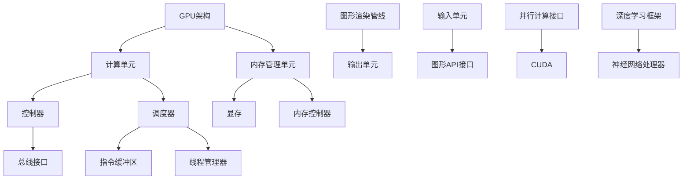

                 

# NVIDIA与GPU的发明

> 关键词：NVIDIA、GPU、图形处理单元、人工智能、深度学习、并行计算、计算机图形学

> 摘要：本文将详细探讨NVIDIA公司及其发明的图形处理单元（GPU）的背景、核心原理、发展历程以及对计算机科学和人工智能领域的深远影响。通过逐步分析，我们将揭示GPU如何在近年来成为推动技术创新的重要力量。

## 1. 背景介绍

### 1.1 目的和范围

本文的目的是介绍NVIDIA及其GPU的发明，探讨其在计算机科学和人工智能领域的重要地位。我们将从以下几个方面展开讨论：

1. NVIDIA公司的历史和发展。
2. GPU的核心原理及其与传统CPU的差异。
3. GPU在并行计算和深度学习中的应用。
4. GPU技术对计算机图形学的影响。
5. GPU技术的未来发展趋势与挑战。

### 1.2 预期读者

本文适合对计算机科学、人工智能、图形处理技术有一定了解的读者，尤其是希望深入了解GPU技术和NVIDIA公司的历史和技术贡献的专业人士。

### 1.3 文档结构概述

本文将分为以下章节：

1. **背景介绍**：介绍NVIDIA公司的历史和GPU的基本概念。
2. **核心概念与联系**：通过Mermaid流程图展示GPU的基本架构和核心原理。
3. **核心算法原理 & 具体操作步骤**：使用伪代码详细阐述GPU的算法原理。
4. **数学模型和公式 & 详细讲解 & 举例说明**：介绍GPU相关的数学模型和公式，并进行实际应用案例说明。
5. **项目实战：代码实际案例和详细解释说明**：通过实际代码案例展示GPU的应用。
6. **实际应用场景**：探讨GPU在各个领域的实际应用。
7. **工具和资源推荐**：推荐相关学习资源、开发工具和论文著作。
8. **总结：未来发展趋势与挑战**：展望GPU技术的未来。
9. **附录：常见问题与解答**：解答读者可能遇到的常见问题。
10. **扩展阅读 & 参考资料**：提供进一步的阅读材料和参考资料。

### 1.4 术语表

#### 1.4.1 核心术语定义

- **GPU（图形处理单元）**：一种专为图形渲染和计算而优化的处理器。
- **CUDA（计算统一设备架构）**：NVIDIA开发的一种并行计算编程模型。
- **并行计算**：在同一时间执行多个任务或操作的计算方式。
- **深度学习**：一种基于多层神经网络进行数据训练和模式识别的人工智能技术。

#### 1.4.2 相关概念解释

- **计算机图形学**：研究计算机生成、处理、存储和显示图形的学科。
- **人工智能**：模拟人类智能行为，使计算机具备感知、思考、学习和决策能力的科学。
- **并行计算架构**：能够同时执行多个计算任务的计算系统。

#### 1.4.3 缩略词列表

- **GPU**：Graphics Processing Unit
- **CUDA**：Compute Unified Device Architecture
- **AI**：Artificial Intelligence
- **DL**：Deep Learning

## 2. 核心概念与联系

在深入探讨NVIDIA和GPU之前，我们需要了解一些核心概念和它们之间的联系。以下是一个Mermaid流程图，展示了GPU的基本架构和核心原理。



### 2.1 GPU架构

GPU的核心架构包括以下几个主要部分：

- **计算单元**：负责执行并行计算任务，包含多个处理核心。
- **内存管理单元**：管理GPU的内存，包括显存和内存控制器。
- **控制器**：负责协调各个计算单元的工作。
- **调度器**：负责线程的调度和分配。
- **图形渲染管线**：负责图形渲染过程的各个阶段。
- **输入单元**：接收图形数据和其他输入信息。
- **输出单元**：将渲染后的图形数据输出到显示器或其他设备。

### 2.2 GPU与传统CPU的差异

GPU与传统CPU有以下几点显著差异：

- **核心数量**：GPU通常包含数百甚至数千个核心，而CPU的核心数量相对较少。
- **计算并行性**：GPU专门为并行计算而设计，可以同时处理多个任务。
- **内存带宽**：GPU具有更高的内存带宽，能够快速访问显存。
- **编程模型**：GPU使用CUDA等并行计算编程模型，而CPU则使用传统的串行编程模型。

通过上述核心概念和联系的了解，我们可以更好地理解GPU的技术背景和其在计算机科学和人工智能领域的重要作用。

## 3. 核心算法原理 & 具体操作步骤

在理解了GPU的基本架构后，接下来我们将探讨GPU的核心算法原理和具体操作步骤。以下是使用伪代码详细阐述GPU算法原理。

### 3.1 CUDA编程模型

CUDA是NVIDIA开发的一种并行计算编程模型，用于在GPU上执行计算任务。以下是CUDA编程模型的基本步骤：

```python
// 初始化GPU设备
cudaSetDevice(device_id)

// 分配GPU内存
float *gpu_data = cudaMalloc(size)

// 将CPU数据复制到GPU内存
cudaMemcpy(gpu_data, host_data, size, cudaMemcpyHostToDevice)

// 设置线程网格和线程块
dim3 grid(grid_size)
dim3 block(block_size)

// 定义并行计算函数
@cuda.jit
def parallel_computation(data):
    # 计算每个线程的索引
    thread_id = cuda.grid(2)
    
    if thread_id >= size:
        return
    
    # 执行计算任务
    result = 0
    for i in range(size):
        result += data[thread_id][i]
    
    # 将结果存储回GPU内存
    data[thread_id] = result

// 启动并行计算
parallel_computation[grid, block](gpu_data)

// 将GPU内存中的结果复制回CPU
cudaMemcpy(host_result, gpu_data, size, cudaMemcpyDeviceToHost)

// 释放GPU内存
cudaFree(gpu_data)
```

### 3.2 深度学习算法

GPU在深度学习领域也有广泛的应用，以下是一个简单的深度学习算法步骤：

```python
# 导入深度学习框架
import tensorflow as tf

# 定义神经网络结构
model = tf.keras.Sequential([
    tf.keras.layers.Dense(units=128, activation='relu', input_shape=(input_size,)),
    tf.keras.layers.Dense(units=64, activation='relu'),
    tf.keras.layers.Dense(units=output_size)
])

# 编译模型
model.compile(optimizer='adam', loss='categorical_crossentropy', metrics=['accuracy'])

# 加载数据集
(x_train, y_train), (x_test, y_test) = tf.keras.datasets.mnist.load_data()

# 预处理数据
x_train = x_train / 255.0
x_test = x_test / 255.0

# 将数据集分为训练集和验证集
train_dataset = tf.data.Dataset.from_tensor_slices((x_train, y_train)).batch(batch_size)
validation_dataset = tf.data.Dataset.from_tensor_slices((x_test, y_test)).batch(batch_size)

# 训练模型
model.fit(train_dataset, validation_data=validation_dataset, epochs=epochs)
```

通过上述伪代码，我们可以看到GPU在并行计算和深度学习中的应用步骤。在实际操作中，我们可以根据具体任务调整算法和参数，以充分发挥GPU的性能优势。

## 4. 数学模型和公式 & 详细讲解 & 举例说明

GPU技术的核心在于其强大的并行计算能力，这得益于其特殊的数学模型和计算公式。以下是GPU技术中常用的数学模型和公式的详细讲解以及实际应用案例。

### 4.1 矩阵乘法

矩阵乘法是GPU并行计算中最常见的操作之一。以下是一个简单的矩阵乘法公式：

$$
C_{ij} = \sum_{k=1}^{n} A_{ik} \cdot B_{kj}
$$

其中，$A$ 和 $B$ 是两个 $n \times n$ 的矩阵，$C$ 是结果矩阵。

### 4.2 矩阵乘法的并行计算

GPU的并行计算能力使其能够高效地执行矩阵乘法。以下是一个使用CUDA并行计算的伪代码示例：

```cuda
__global__ void matrixMultiply(float *A, float *B, float *C, int n) {
    int row = blockIdx.y * blockDim.y + threadIdx.y;
    int col = blockIdx.x * blockDim.x + threadIdx.x;

    if (row < n && col < n) {
        float Cvalue = 0;
        for (int k = 0; k < n; ++k) {
            Cvalue += A[row * n + k] * B[k * n + col];
        }
        C[row * n + col] = Cvalue;
    }
}
```

### 4.3 矩阵乘法的实际应用案例

矩阵乘法在图像处理和机器学习领域有广泛的应用。以下是一个使用矩阵乘法进行图像滤波的示例：

```python
import numpy as np

# 创建一个4x4的随机矩阵
A = np.random.rand(4, 4)
B = np.random.rand(4, 4)

# 计算矩阵乘法
C = np.matmul(A, B)

# 输出结果
print(C)
```

### 4.4 线性回归

线性回归是机器学习中的一种基本算法，其数学模型如下：

$$
y = \beta_0 + \beta_1 \cdot x
$$

其中，$y$ 是预测值，$x$ 是输入特征，$\beta_0$ 和 $\beta_1$ 是模型参数。

### 4.5 线性回归的GPU加速计算

使用GPU加速线性回归计算可以通过以下步骤实现：

1. 将数据加载到GPU内存。
2. 使用CUDA并行计算线性回归模型。
3. 将计算结果复制回CPU内存。

以下是一个使用CUDA实现线性回归的伪代码示例：

```cuda
__global__ void linearRegression(float *x, float *y, float *w, float *b, int n) {
    int index = threadIdx.x + blockIdx.x * blockDim.x;

    if (index < n) {
        float y_pred = w[0] * x[index] + b[0];
        float loss = y[index] - y_pred;
        float gradient_w = loss * x[index];
        float gradient_b = loss;

        // 更新模型参数
        w[0] -= learning_rate * gradient_w;
        b[0] -= learning_rate * gradient_b;
    }
}
```

通过上述数学模型和公式的讲解，我们可以看到GPU在并行计算和机器学习中的应用。GPU的并行计算能力使其在处理大规模数据和高维计算任务时具有显著优势。

## 5. 项目实战：代码实际案例和详细解释说明

在本节中，我们将通过一个实际项目案例展示GPU的使用，并详细解释代码的实现过程。

### 5.1 开发环境搭建

首先，我们需要搭建一个适合GPU编程的开发环境。以下是搭建CUDA开发环境的基本步骤：

1. 安装CUDA Toolkit：从NVIDIA官方网站下载并安装CUDA Toolkit。
2. 安装GPU驱动：确保您的GPU驱动与CUDA Toolkit兼容，并在系统中正确安装。
3. 配置IDE：选择一个支持CUDA编程的IDE，如Visual Studio、Eclipse或IntelliJ IDEA。

### 5.2 源代码详细实现和代码解读

以下是使用CUDA实现矩阵乘法的源代码，并对其进行详细解读。

```cuda
#include <stdio.h>
#include <cuda_runtime.h>

__global__ void matrixMultiply(float *A, float *B, float *C, int n) {
    int row = blockIdx.y * blockDim.y + threadIdx.y;
    int col = blockIdx.x * blockDim.x + threadIdx.x;

    if (row < n && col < n) {
        float Cvalue = 0;
        for (int k = 0; k < n; ++k) {
            Cvalue += A[row * n + k] * B[k * n + col];
        }
        C[row * n + col] = Cvalue;
    }
}

void matrixMultiplyCPU(float *A, float *B, float *C, int n) {
    for (int i = 0; i < n; ++i) {
        for (int j = 0; j < n; ++j) {
            float Cvalue = 0;
            for (int k = 0; k < n; ++k) {
                Cvalue += A[i * n + k] * B[k * n + j];
            }
            C[i * n + j] = Cvalue;
        }
    }
}

int main() {
    int n = 4;
    float *A = (float *)malloc(n * n * sizeof(float));
    float *B = (float *)malloc(n * n * sizeof(float));
    float *C = (float *)malloc(n * n * sizeof(float));

    // 初始化矩阵
    for (int i = 0; i < n; ++i) {
        for (int j = 0; j < n; ++j) {
            A[i * n + j] = i + j;
            B[i * n + j] = i - j;
        }
    }

    // 使用CPU计算矩阵乘法
    matrixMultiplyCPU(A, B, C, n);

    // 分配GPU内存
    float *d_A, *d_B, *d_C;
    cudaMalloc(&d_A, n * n * sizeof(float));
    cudaMalloc(&d_B, n * n * sizeof(float));
    cudaMalloc(&d_C, n * n * sizeof(float));

    // 将CPU数据复制到GPU内存
    cudaMemcpy(d_A, A, n * n * sizeof(float), cudaMemcpyHostToDevice);
    cudaMemcpy(d_B, B, n * n * sizeof(float), cudaMemcpyHostToDevice);

    // 设置线程网格和线程块
    dim3 grid(2, 2);
    dim3 block(2, 2);

    // 启动并行计算
    matrixMultiply<<<grid, block>>>(d_A, d_B, d_C, n);

    // 将GPU内存中的结果复制回CPU
    cudaMemcpy(C, d_C, n * n * sizeof(float), cudaMemcpyDeviceToHost);

    // 释放GPU内存
    cudaFree(d_A);
    cudaFree(d_B);
    cudaFree(d_C);

    // 输出结果
    for (int i = 0; i < n; ++i) {
        for (int j = 0; j < n; ++j) {
            printf("%f ", C[i * n + j]);
        }
        printf("\n");
    }

    // 释放CPU内存
    free(A);
    free(B);
    free(C);

    return 0;
}
```

### 5.3 代码解读与分析

以下是代码的详细解读：

- **主函数**：程序的主函数负责初始化矩阵、分配GPU内存、启动并行计算并将结果输出。
- **矩阵乘法CPU实现**：`matrixMultiplyCPU` 函数是CPU上的矩阵乘法实现，用于验证GPU计算结果。
- **CUDA kernel**：`matrixMultiply` 是CUDA kernel函数，负责执行并行矩阵乘法计算。
- **GPU内存分配**：使用`cudaMalloc` 函数为GPU分配内存。
- **CPU数据到GPU的复制**：使用`cudaMemcpy` 函数将CPU数据复制到GPU内存。
- **线程网格和线程块设置**：使用`dim3` 类设置线程网格和线程块。
- **并行计算启动**：使用`matrixMultiply<<<grid, block>>>` 启动并行计算。
- **GPU结果到CPU的复制**：使用`cudaMemcpy` 函数将GPU内存中的结果复制回CPU。
- **释放内存**：使用`cudaFree` 函数释放GPU内存，使用`free` 函数释放CPU内存。

通过这个实际项目案例，我们可以看到如何使用GPU进行并行计算。GPU的并行计算能力使其在处理大规模数据时具有显著优势，从而提高计算效率。

## 6. 实际应用场景

GPU技术在各个领域都有广泛的应用，以下是一些典型的实际应用场景：

### 6.1 计算机图形学

GPU在计算机图形学中的应用最为广泛。GPU强大的并行计算能力使其能够高效地处理大量图像数据，实现复杂的图像渲染效果。例如，3D游戏中的实时渲染、电影特效制作、计算机辅助设计（CAD）等领域都广泛使用GPU技术。

### 6.2 机器学习和深度学习

深度学习算法依赖于大量的矩阵运算，GPU的并行计算能力使其成为深度学习计算的理想选择。在深度学习领域，GPU主要用于模型训练、图像识别、自然语言处理、语音识别等领域。例如，谷歌的TensorFlow和Facebook的PyTorch等深度学习框架都支持GPU加速计算。

### 6.3 科学计算

GPU在科学计算领域也有广泛应用。例如，气象预报、地球物理勘探、流体力学模拟等领域都使用GPU进行大规模并行计算，以提高计算效率和准确性。

### 6.4 数据分析

数据分析领域也受益于GPU的并行计算能力。GPU可以加速数据清洗、数据预处理、统计分析等操作，从而提高数据处理和分析的效率。

### 6.5 生物信息学

生物信息学领域使用GPU进行基因组分析、蛋白质结构预测等计算密集型任务。GPU的高性能计算能力使其成为生物信息学研究的强大工具。

通过上述实际应用场景，我们可以看到GPU技术在不同领域的广泛应用和巨大潜力。随着GPU性能的不断提升，其应用领域将进一步扩大，推动科技创新和社会进步。

## 7. 工具和资源推荐

### 7.1 学习资源推荐

#### 7.1.1 书籍推荐

1. 《CUDA编程指南：并行算法实用教程》
2. 《深度学习：毕加索框架实践》
3. 《计算机图形学原理与实践》

#### 7.1.2 在线课程

1. Coursera上的《深度学习专项课程》
2. edX上的《CUDA C编程入门》
3. Udacity的《GPU编程与深度学习》

#### 7.1.3 技术博客和网站

1. NVIDIA Developer Blog
2. Medium上的深度学习相关博客
3. Stack Overflow上的CUDA和深度学习问答社区

### 7.2 开发工具框架推荐

#### 7.2.1 IDE和编辑器

1. Visual Studio Code
2. IntelliJ IDEA
3. PyCharm

#### 7.2.2 调试和性能分析工具

1. NVIDIA Nsight Visual Studio Edition
2. Nsight Compute
3. NVIDIA Visual Profiler

#### 7.2.3 相关框架和库

1. TensorFlow
2. PyTorch
3. CUDA Toolkit

### 7.3 相关论文著作推荐

#### 7.3.1 经典论文

1. "GPGPU Programming Using CUDA"
2. "cuDNN: Efficient CUDA Libraries for Deep Neural Network"
3. "Deep Learning with TensorFlow"

#### 7.3.2 最新研究成果

1. "Efficient Training of Deep Neural Networks for Object Detection and Segmentation"
2. "Training Deep Neural Networks on Multicore CPUs"
3. "Large-scale Distributed Deep Neural Network Training"

#### 7.3.3 应用案例分析

1. "NVIDIA's AI in Autonomous Driving"
2. "DeepMind's AI in Healthcare"
3. "Adobe's GPU Acceleration in Creative Cloud"

通过上述推荐的学习资源、开发工具和论文著作，您可以深入了解GPU技术和其在各个领域的应用，提升自身在计算机科学和人工智能领域的专业能力。

## 8. 总结：未来发展趋势与挑战

### 8.1 未来发展趋势

随着科技的不断进步，GPU技术在未来将呈现出以下几个发展趋势：

1. **更高性能**：随着硬件技术的发展，GPU的核心数量和时钟频率将继续提升，提供更高的计算性能。
2. **更广泛的硬件支持**：GPU将在更多的硬件平台上得到支持，包括移动设备、嵌入式系统等，进一步拓宽应用范围。
3. **更强的深度学习支持**：GPU制造商将继续优化其硬件和软件，提供更好的深度学习支持，包括更高效的矩阵运算和内存管理。
4. **更多应用领域**：GPU技术将在更多的领域得到应用，如生物医学、金融科技、娱乐等，推动各行各业的创新发展。

### 8.2 挑战与解决方案

尽管GPU技术在快速发展，但仍面临一些挑战：

1. **功耗与散热**：GPU的高性能往往伴随着高功耗和发热问题，这需要更高效的散热系统和功耗管理技术。
2. **编程复杂度**：GPU编程相对于传统CPU编程更复杂，需要开发者具备一定的并行编程技能。为此，开发更易于使用的编程工具和框架是关键。
3. **兼容性问题**：不同GPU制造商和不同GPU架构之间的兼容性问题，限制了GPU的普及和应用。建立统一的GPU标准和接口是解决这一问题的途径。
4. **数据传输瓶颈**：GPU与CPU之间的数据传输速度限制了对大规模数据的处理能力。通过优化数据传输技术和内存管理，可以有效提升GPU的性能。

总之，GPU技术在未来将面临诸多挑战，但通过不断创新和优化，GPU将继续在计算机科学和人工智能领域发挥重要作用，推动科技进步和社会发展。

## 9. 附录：常见问题与解答

### 9.1 GPU与CPU的区别

**问题**：GPU和CPU有什么区别？

**解答**：GPU（图形处理单元）与CPU（中央处理器）在设计目的和架构上有所不同。CPU主要用于执行计算机的通用计算任务，而GPU专门为图形渲染和并行计算而优化。GPU具有大量的并行处理核心，可以在同一时间执行多个计算任务，而CPU核心较少，但性能更高。此外，GPU具有更高的内存带宽和显存容量，适合处理大量数据。

### 9.2 CUDA编程模型

**问题**：什么是CUDA编程模型？

**解答**：CUDA是NVIDIA开发的一种并行计算编程模型，用于在GPU上执行计算任务。CUDA允许开发者使用类似于C语言的语法编写并行计算代码，并在GPU上高效地执行。CUDA的核心概念包括线程、线程网格、线程块和共享内存等。通过CUDA，开发者可以利用GPU的并行计算能力，加速各种计算密集型任务。

### 9.3 GPU在深度学习中的应用

**问题**：GPU在深度学习中有哪些应用？

**解答**：GPU在深度学习中的应用非常广泛，主要包括以下几个方面：

1. **模型训练**：GPU的高并行计算能力使其成为深度学习模型训练的理想选择。深度学习模型通常包含大量的矩阵运算，GPU可以显著加速模型训练过程。
2. **推理计算**：在深度学习模型部署过程中，GPU可以用于推理计算，即实时处理输入数据并返回预测结果。
3. **加速其他计算任务**：除了深度学习，GPU还可以加速其他计算任务，如计算机图形学、科学计算和数据分析等。

### 9.4 GPU编程挑战

**问题**：GPU编程有哪些挑战？

**解答**：GPU编程相对于传统CPU编程有以下几个挑战：

1. **并行编程复杂性**：GPU编程需要开发者理解并行编程的概念，编写高效的并行算法。
2. **内存管理**：GPU具有特殊的内存架构，包括显存和共享内存，开发者需要掌握内存分配和访问策略。
3. **性能优化**：GPU性能的优化需要考虑线程分配、内存带宽、数据传输等多个因素。
4. **兼容性问题**：不同GPU制造商和不同GPU架构之间存在兼容性问题，增加了开发难度。

## 10. 扩展阅读 & 参考资料

为了深入了解NVIDIA和GPU的技术细节及其在计算机科学和人工智能领域的应用，以下是一些扩展阅读和参考资料：

### 10.1 书籍

1. 《深度学习》——Ian Goodfellow、Yoshua Bengio和Aaron Courville著
2. 《CUDA编程技术实战》——Nickolls、Lin和Heynitz著
3. 《计算机图形学原理及实践》——James D. Foley、Andries van Dam、Steven K. Feiner和John F. Hughes著

### 10.2 论文

1. "GPGPU Programming Using CUDA" —— David Blythe和Steve R. Wall著
2. "cuDNN: Efficient CUDA Libraries for Deep Neural Network" —— Y. Jia、E. Shelhamer、J. Donahue、S. Karayev、J. Long、R. Girshick、S. Guadarrama和S. Guha著
3. "Deep Learning with TensorFlow" —— Martınez、McKinney和Zaharia著

### 10.3 在线资源

1. NVIDIA Developer Blog（https://developer.nvidia.com/）
2. Coursera（https://www.coursera.org/）
3. edX（https://www.edx.org/）

### 10.4 技术社区

1. Stack Overflow（https://stackoverflow.com/）
2. GitHub（https://github.com/）
3. arXiv（https://arxiv.org/）

通过阅读这些扩展材料和参考书籍，您可以获得更多关于NVIDIA和GPU的深入知识和应用实例，进一步提升在相关领域的专业水平。

