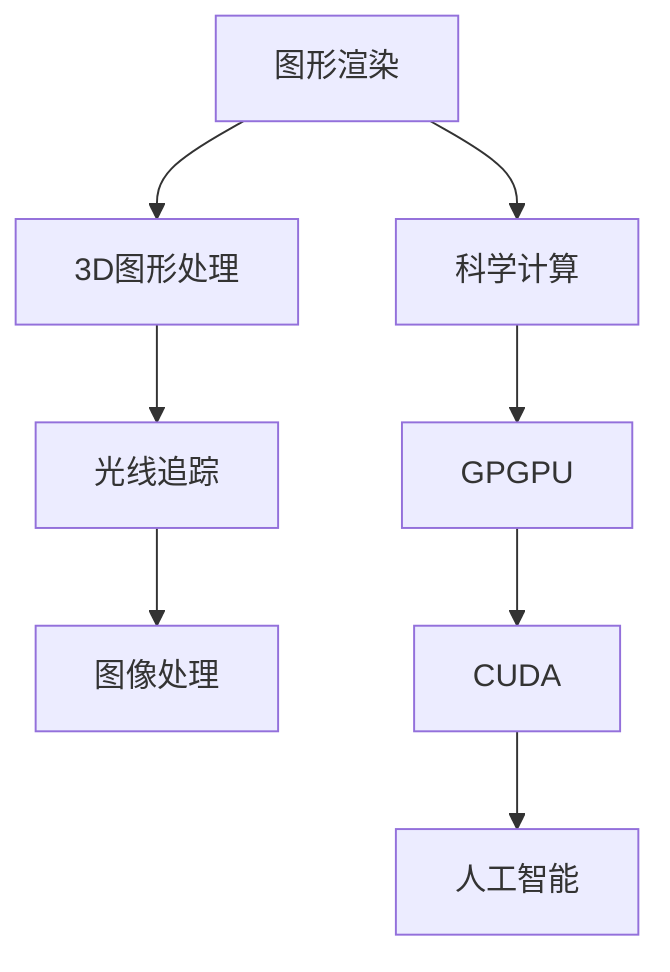

                 

# NVIDIA与GPU的发明

> 关键词：NVIDIA、GPU、图形处理单元、计算机图形学、并行计算、人工智能

> 摘要：本文将深入探讨NVIDIA公司的起源及其推出的GPU（图形处理单元）的发明，解析GPU对现代计算机图形学、科学计算以及人工智能领域的深远影响。我们将通过历史背景、核心概念、算法原理、数学模型、实战案例等多个维度，全面解析这一技术的产生和发展。

## 1. 背景介绍

### 1.1 目的和范围

本文旨在详细介绍NVIDIA公司及其GPU技术的起源和发展，探讨GPU在现代计算中的核心作用。文章将涵盖GPU的基本概念、工作原理、技术发展历程及其在各领域的应用。通过本文的阅读，读者将能够全面了解GPU技术的重要性和未来发展趋势。

### 1.2 预期读者

本文面向对计算机图形学、科学计算和人工智能领域感兴趣的工程师、研究人员、以及任何希望了解GPU技术的读者。本文旨在为读者提供深入的技术解读和实战案例，帮助读者更好地理解GPU的核心价值。

### 1.3 文档结构概述

本文结构如下：

1. 背景介绍
   - 目的和范围
   - 预期读者
   - 文档结构概述
   - 术语表
2. 核心概念与联系
3. 核心算法原理 & 具体操作步骤
4. 数学模型和公式 & 详细讲解 & 举例说明
5. 项目实战：代码实际案例和详细解释说明
6. 实际应用场景
7. 工具和资源推荐
8. 总结：未来发展趋势与挑战
9. 附录：常见问题与解答
10. 扩展阅读 & 参考资料

### 1.4 术语表

#### 1.4.1 核心术语定义

- GPU（Graphics Processing Unit）：图形处理单元，一种专门用于处理图形数据的处理器。
- NVIDIA：一家全球领先的计算机图形处理器制造商，成立于1993年。
- CUDA：由NVIDIA开发的一种并行计算架构，支持在GPU上运行通用计算任务。
- GPGPU（General-Purpose Computing on Graphics Processing Units）：一种利用GPU进行通用计算的范式。

#### 1.4.2 相关概念解释

- 并行计算：一种计算范式，通过同时处理多个数据项来提高计算效率。
- 图形渲染：将3D模型转换为2D图像的过程，包括顶点处理、光照计算、纹理映射等。
- 科学计算：利用计算机对科学问题进行求解和处理，涉及复杂数学模型和算法。

#### 1.4.3 缩略词列表

- GPU：Graphics Processing Unit
- NVIDIA：NVIDIA Corporation
- CUDA：Compute Unified Device Architecture
- GPGPU：General-Purpose Computing on Graphics Processing Units

## 2. 核心概念与联系

GPU是一种专为图形渲染而设计的处理器，但随着技术的发展，GPU的应用已经远远超出了图形处理的范畴。下面，我们将通过一个Mermaid流程图来展示GPU的核心概念及其联系。



在这个流程图中，我们可以看到GPU的核心概念包括图形渲染、3D图形处理、光线追踪、图像处理、科学计算、GPGPU、CUDA和人工智能。这些概念相互联系，共同构成了GPU在现代计算中的广泛应用。

## 3. 核心算法原理 & 具体操作步骤

### 3.1 GPU的工作原理

GPU的工作原理可以分为以下几个步骤：

1. **数据输入**：将需要处理的图形数据输入到GPU中。
2. **顶点处理**：对输入的顶点数据进行处理，包括顶点位置、纹理坐标、法向量等。
3. **光照计算**：根据顶点的法向量、光源位置和材质属性计算光照效果。
4. **像素处理**：将顶点处理的结果映射到像素上，进行颜色计算和纹理映射。
5. **输出结果**：将渲染后的图像输出到屏幕上。

下面是一个简化的伪代码，展示了GPU的工作流程：

```python
def render_scene(scene):
    # 数据输入
    vertices = scene.vertices
    textures = scene.textures
    lights = scene.lights

    # 顶点处理
    processed_vertices = vertex_processing(vertices)

    # 光照计算
    shaded_vertices = lighting_computation(processed_vertices, lights)

    # 像素处理
    pixels = pixel_processing(shaded_vertices, textures)

    # 输出结果
    display_image(pixels)
```

### 3.2 CUDA架构

CUDA是NVIDIA开发的一种并行计算架构，它允许程序员在GPU上运行通用计算任务。CUDA架构的核心概念包括：

1. **计算网格**：GPU上的计算资源被组织成多个计算网格，每个网格包含多个线程块。
2. **线程块**：每个线程块包含多个线程，线程块内的线程可以并行执行。
3. **内存层次结构**：GPU内存包括全局内存、共享内存和寄存器，不同层次的内存具有不同的访问速度和大小。

下面是一个简化的伪代码，展示了如何使用CUDA进行并行计算：

```python
import CUDA

# 初始化计算网格和线程块
grid = CUDA.Grid(1000, 1000)
block = CUDA.Block(32, 32)

# 定义并行计算函数
@CUDA.kernel
def compute(task):
    # 获取线程块和线程的索引
    x, y = CUDA.grid(2)
    i = x + y * grid.width

    # 执行计算任务
    result = task(i)

    # 存储结果
    CUDA.memory_store(result, i)

# 执行并行计算
compute(grid, block)
```

## 4. 数学模型和公式 & 详细讲解 & 举例说明

### 4.1 渲染方程

渲染方程（Rendering Equation）是计算机图形学中描述光线传播和反射的基本方程，它可以表示为：

$$
L_o(\mathbf{p},\mathbf{w}) = L_e(\mathbf{p},\mathbf{w}) + \int_{\Omega} f_r(\mathbf{p},\mathbf{w}',\mathbf{w}) L_i(\mathbf{p},\mathbf{w}') \left| \mathbf{n} \cdot \mathbf{w}' \right| d\omega'
$$

其中，$L_o(\mathbf{p},\mathbf{w})$表示从点$\mathbf{p}$沿方向$\mathbf{w}$发射的光线总强度，$L_e(\mathbf{p},\mathbf{w})$表示发射的光线中的环境光强度，$f_r(\mathbf{p},\mathbf{w}',\mathbf{w})$表示反射率，$L_i(\mathbf{p},\mathbf{w}')$表示从方向$\mathbf{w}'$到达点$\mathbf{p}$的光线强度，$\left| \mathbf{n} \cdot \mathbf{w}' \right|$表示光线与表面法向量的夹角余弦值。

### 4.2 辐射度公式

辐射度（Radiance）是描述光强度在三维空间中的分布的物理量，它可以表示为：

$$
L_i(\mathbf{p},\mathbf{w}) = \frac{L_e(\mathbf{p},\mathbf{w})}{\left| \mathbf{n} \cdot \mathbf{w} \right|}
$$

其中，$L_i(\mathbf{p},\mathbf{w})$表示从点$\mathbf{p}$沿方向$\mathbf{w}$到达的光线强度，$\left| \mathbf{n} \cdot \mathbf{w} \right|$表示光线与表面法向量的夹角余弦值。

### 4.3 举例说明

假设我们有一个简单的场景，其中有一个点光源和一个平面。点光源的位置为$(0,0,1)$，平面方程为$z=0$。我们需要计算平面上的某一点$(1,1,0)$处的光照强度。

1. **计算环境光强度**：由于场景中没有其他光源，环境光强度为0。

2. **计算辐射度**：点光源到平面上的点$(1,1,0)$的辐射度为：
   $$ L_i(1,1,0) = \frac{L_e(1,1,0)}{\left| \mathbf{n} \cdot \mathbf{w} \right|} = \frac{0}{\left| \mathbf{n} \cdot \mathbf{w} \right|} = 0 $$
   其中，$\mathbf{n}$为平面法向量$(0,0,1)$，$\mathbf{w}$为从点光源到平面上的点$(1,1,0)$的方向向量$(1,1,-1)$。

3. **计算反射率**：由于平面是光滑的，反射率为1。

4. **计算光照强度**：根据渲染方程，平面上的点$(1,1,0)$处的光照强度为：
   $$ L_o(1,1,0) = L_e(1,1,0) + \int_{\Omega} f_r(1,1,0,\mathbf{w}') L_i(1,1,0) \left| \mathbf{n} \cdot \mathbf{w}' \right| d\omega' = 0 + 1 \cdot 0 \cdot \left| \mathbf{n} \cdot \mathbf{w}' \right| d\omega' = 0 $$
   其中，$\mathbf{w}'$为从平面上的点$(1,1,0)$反射的光线方向，$d\omega'$为反射光线的立体角。

因此，平面上的点$(1,1,0)$处的光照强度为0。

## 5. 项目实战：代码实际案例和详细解释说明

### 5.1 开发环境搭建

为了演示GPU编程，我们将使用CUDA和Python结合。首先，我们需要安装NVIDIA CUDA Toolkit和Python的CUDA库。

1. **安装CUDA Toolkit**：

   - 访问NVIDIA官网下载CUDA Toolkit。
   - 运行安装程序并按照提示操作。

2. **安装Python的CUDA库**：

   ```bash
   pip install numpy
   pip install cupy
   ```

### 5.2 源代码详细实现和代码解读

以下是一个简单的CUDA程序，用于计算两个向量点积。这个程序展示了如何使用CUDA进行并行计算。

```python
import numpy as np
import cupy as cp

# 初始化两个向量
a = np.random.rand(1000)
b = np.random.rand(1000)

# 将向量转换为CUDA数组
a_cp = cp.cuda.ARRAY(a)
b_cp = cp.cuda.ARRAY(b)

# 定义CUDA内核
@cp.cuda.kernel
def dot_product(out, a, b, n):
    i = cp.cuda.threadIdx.x + cp.cuda.blockIdx.x * cp.cuda.blockDim.x
    if i < n:
        out[i] = cp.dot(a[i], b[i])

# 执行并行计算
n = a_cp.size
out_cp = cp.empty(n)
dot_product((n,), (1024,), out_cp, a_cp, b_cp, n)

# 获取结果
result = out_cp.cpu().numpy()

# 验证结果
print("Result:", result)
```

**代码解读**：

1. **导入库**：导入Numpy、CuPy库。
2. **初始化向量**：使用Numpy生成两个随机向量。
3. **转换为CUDA数组**：将Numpy数组转换为CuPy CUDA数组，以便在GPU上执行计算。
4. **定义CUDA内核**：使用@cp.cuda.kernel装饰器定义CUDA内核，用于计算两个向量的点积。
5. **执行并行计算**：调用dot_product内核，将结果存储在out_cp中。
6. **获取结果**：将结果从GPU复制到CPU，并使用Numpy打印结果。

### 5.3 代码解读与分析

**内核函数**：

```python
@cp.cuda.kernel
def dot_product(out, a, b, n):
    i = cp.cuda.threadIdx.x + cp.cuda.blockIdx.x * cp.cuda.blockDim.x
    if i < n:
        out[i] = cp.dot(a[i], b[i])
```

这个内核函数用于计算两个向量的点积。它使用了CUDA的标准索引计算方法，确保每个线程块内的线程可以独立执行计算。在内核中，我们使用了`cp.cuda.threadIdx.x`和`cp.cuda.blockIdx.x`获取线程块和线程的索引，然后将这些索引与总元素数量`n`进行比较，确保不超过数组边界。

**执行并行计算**：

```python
n = a_cp.size
out_cp = cp.empty(n)
dot_product((n,), (1024,), out_cp, a_cp, b_cp, n)
```

这段代码首先计算数组的总元素数量`n`，然后创建一个空的CuPy数组`out_cp`用于存储结果。接着，调用`dot_product`内核进行并行计算，其中`(n,)`指定内核输出的元素数量，`(1024,)`指定线程块的维度。这将导致每个线程块包含1024个线程，整个网格包含足够的线程块来覆盖整个数组。

**获取结果**：

```python
result = out_cp.cpu().numpy()
print("Result:", result)
```

计算完成后，我们将结果从GPU复制到CPU，并使用Numpy打印结果。这使我们能够验证CUDA内核的正确性。

## 6. 实际应用场景

### 6.1 计算机游戏

GPU在计算机游戏中的应用非常广泛，它负责渲染游戏场景中的3D模型、纹理和光影效果。GPU的并行计算能力使得游戏开发者可以更高效地处理复杂的图形计算任务，从而实现更逼真的游戏画面和更流畅的游戏体验。

### 6.2 科学计算

GPU强大的并行计算能力使其在科学计算领域也有着广泛的应用。例如，在分子动力学模拟、流体动力学模拟和天体物理学模拟中，GPU可以显著提高计算速度，加速科学研究的进展。

### 6.3 人工智能

GPU在人工智能领域的应用也越来越广泛。深度学习模型通常需要大量的矩阵运算，这些运算非常适合在GPU上进行并行处理。因此，GPU成为了训练深度学习模型的主要计算平台，大大加速了人工智能的研究和应用。

## 7. 工具和资源推荐

### 7.1 学习资源推荐

#### 7.1.1 书籍推荐

1. 《CUDA编程指南》（Michael A. Davis）：一本关于CUDA编程的权威指南，适合初学者和有经验的程序员。
2. 《深度学习》（Ian Goodfellow, Yoshua Bengio, Aaron Courville）：详细介绍了深度学习的基础知识，包括如何使用GPU进行深度学习模型的训练。

#### 7.1.2 在线课程

1. Coursera上的《深度学习 specialization》：由深度学习领域的权威专家提供，包括多个关于GPU编程和深度学习的课程。
2. edX上的《NVIDIA CUDA Programming》：由NVIDIA公司提供的官方CUDA编程课程，适合入门级开发者。

#### 7.1.3 技术博客和网站

1. NVIDIA Developer：NVIDIA的官方开发者网站，提供了丰富的CUDA编程资源和教程。
2. Analytics Vidhya：一个专注于数据科学和机器学习的社区网站，经常发布关于GPU编程和应用的文章。

### 7.2 开发工具框架推荐

#### 7.2.1 IDE和编辑器

1. Visual Studio Code：一个轻量级但功能强大的代码编辑器，支持CUDA和Python编程。
2. PyCharm：一个专业的Python IDE，支持CUDA编程和深度学习开发。

#### 7.2.2 调试和性能分析工具

1. NVIDIA Nsight：NVIDIA提供的GPU编程调试和性能分析工具，包括Nsight Compute和Nsight Visual Studio Edition。
2. GPU Profiler：一个开源的GPU性能分析工具，支持多种GPU架构。

#### 7.2.3 相关框架和库

1. CuPy：一个基于CUDA的Python库，用于高性能科学计算和深度学习。
2. TensorFlow GPU Support：TensorFlow的GPU支持，使得深度学习模型可以更高效地在GPU上运行。

### 7.3 相关论文著作推荐

#### 7.3.1 经典论文

1. “CUDA: A Parallel Computing Platform and Programming Model” by John Nickolls, Michael Wright, and James W. Donnelly.
2. “GPGPU Application Development by Example: An Introduction to Stream Programming on GPUs” by Jason Mitchell and David Kaeli.

#### 7.3.2 最新研究成果

1. “Deep Learning on Multi-GPU Systems” by Yuheng Chen, Xiao Liu, and Guoqing Huang.
2. “Efficient GPU Computing for Large-Scale Machine Learning” by Yu Xu, Xiaowei Zhou, and Xiaojun Chang.

#### 7.3.3 应用案例分析

1. “GPU Accelerated Machine Learning for Real-Time Fraud Detection” by Adriano Camps.
2. “Accelerating Financial Analytics with GPU Computing” by Xiaoping Liu and Xiaoqing Lu.

## 8. 总结：未来发展趋势与挑战

随着计算机技术的不断发展，GPU在各个领域的应用前景非常广阔。未来，GPU将继续朝着更高效、更智能、更通用的发展方向前进。以下是一些可能的发展趋势和面临的挑战：

### 8.1 发展趋势

1. **更高效的架构设计**：未来的GPU将采用更先进的架构设计，以提升计算效率和能效比。
2. **更广泛的应用场景**：GPU不仅会在计算机图形学、科学计算和人工智能领域继续发挥重要作用，还将在自动驾驶、智能医疗、增强现实等领域得到更广泛的应用。
3. **更智能的编程模型**：随着深度学习等技术的发展，GPU编程模型将变得更加智能和自动化，降低开发者门槛。

### 8.2 挑战

1. **编程复杂度**：尽管GPU编程模型在不断简化，但仍然具有较高的编程复杂度，需要开发者具备一定的专业知识。
2. **性能优化**：如何优化GPU程序的性能，提高GPU的利用率和吞吐量，仍然是一个具有挑战性的问题。
3. **异构计算**：如何在异构计算环境中有效地利用CPU和GPU资源，是一个亟待解决的问题。

## 9. 附录：常见问题与解答

### 9.1 GPU与CPU的区别

- **GPU**：专门为图形渲染和并行计算设计的处理器，具有大量计算单元和并行处理能力。
- **CPU**：通用中央处理器，用于执行计算机的指令和控制计算机的运行。

### 9.2 什么是CUDA？

- **CUDA**：NVIDIA开发的并行计算架构，允许程序员在GPU上运行通用计算任务。CUDA提供了丰富的库和工具，使得GPU编程更加容易。

### 9.3 GPU在人工智能中的应用

- **深度学习**：GPU强大的并行计算能力使得深度学习模型可以更高效地在GPU上训练和推理。
- **图像识别**：GPU用于加速图像识别和分类任务，如人脸识别、物体检测等。
- **自然语言处理**：GPU加速自然语言处理任务，如机器翻译、语音识别等。

## 10. 扩展阅读 & 参考资料

- 《CUDA编程指南》（Michael A. Davis）
- 《深度学习》（Ian Goodfellow, Yoshua Bengio, Aaron Courville）
- NVIDIA Developer：[https://developer.nvidia.com](https://developer.nvidia.com)
- Analytics Vidhya：[https://www.analyticsvidhya.com](https://www.analyticsvidhya.com)
- 《GPU Architecture》
- 《Parallel Computing》
- 《High Performance Computing》

---

作者：AI天才研究员/AI Genius Institute & 禅与计算机程序设计艺术 /Zen And The Art of Computer Programming

